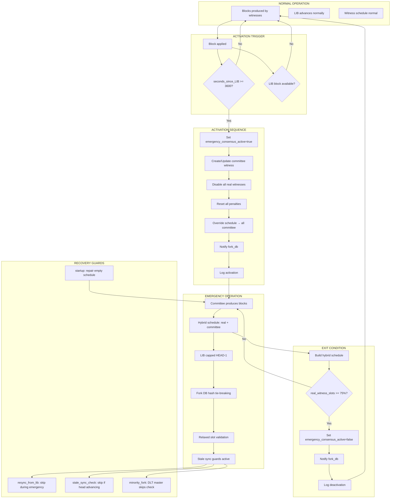

# Emergency Consensus Mode — Full Workflow Tree

Comprehensive analysis of the emergency consensus system introduced in Hardfork 12. Covers all processes, code paths, component interactions, and guard conditions across the entire node codebase.

---

## 1. Overview

Emergency consensus mode activates when the network has stalled for 1 hour (no blocks have been accepted since the Last Irreversible Block timestamp). During emergency, a special "committee" witness produces blocks to maintain chain continuity. Once enough real witnesses re-enable their signing keys (\(\ge\) 75% of schedule slots), emergency mode auto-deactivates.

### Key Constants

| Constant | Value | Meaning |
|----------|-------|---------|
| `CHAIN_EMERGENCY_CONSENSUS_TIMEOUT_SEC` | 3600 | Seconds since LIB before activation |
| `CHAIN_EMERGENCY_WITNESS_ACCOUNT` | `"committee"` | Emergency block producer |
| `CHAIN_EMERGENCY_WITNESS_PUBLIC_KEY` | `VIZ75CR...` | Deterministic signing key |
| `CHAIN_EMERGENCY_EXIT_NORMAL_BLOCKS` | 21 | Consecutive real-witness blocks for exit |
| `CHAIN_IRREVERSIBLE_THRESHOLD` | 75% (`75 * CHAIN_1_PERCENT`) | Required to advance LIB / exit emergency |
| `CHAIN_MAX_WITNESSES` | 21 | Maximum unique witness slots |
| `CHAIN_HARDFORK_12` | Hardfork #12 | Gates all emergency logic |

### System State

Two dynamic global property fields track emergency state:

| Field | Type | Default | Meaning |
|-------|------|---------|---------|
| `emergency_consensus_active` | `bool` | `false` | Is emergency mode active? |
| `emergency_consensus_start_block` | `uint32_t` | `0` | Block number at activation |

---

## 2. Complete Workflow Trees

### 2A. Emergency Activation

**Location:** [`database::update_global_dynamic_data()`](file://libraries/chain/database.cpp#L5059-L5200) — runs on every applied block.

```
Block applied (update_global_dynamic_data)
  │
  ├── Gate: has_hardfork(CHAIN_HARDFORK_12)?
  │   └── No  → RETURN (emergency mode not possible)
  │
  ├── Gate: _dgp.emergency_consensus_active?
  │   └── Yes → RETURN (already active, skip re-activation)
  │
  ├── Gate: LIB block available in block_log?
  │   ├── LIB num == 0                            → skip (no LIB)
  │   ├── fetch_block_by_number(LIB) invalid      → skip (snapshot restore)
  │   └── LIB block found in block_log            → proceed
  │       Reason: DLT nodes with empty block_log after snapshot would
  │       see millions of seconds since genesis → false activation → deadlock
  │
  ├── Compute: seconds_since_lib = b.timestamp - lib_block.timestamp
  │
  ├── Gate: seconds_since_lib >= CHAIN_EMERGENCY_CONSENSUS_TIMEOUT_SEC (3600)?
  │   └── No  → RETURN (network still within grace period)
  │
  └── === ACTIVATION SEQUENCE ===
      │
      ├── 1. Set emergency flags on DGP:
      │       dgp.emergency_consensus_active = true
      │       dgp.emergency_consensus_start_block = b.block_num()
      │
      ├── 2. Create/Update emergency witness object:
      │   ├── Witness "committee" exists?
      │   │   ├── No  → create<witness_object>:
      │   │   │         owner = "committee"
      │   │   │         signing_key = CHAIN_EMERGENCY_WITNESS_PUBLIC_KEY
      │   │   │         running_version = CHAIN_VERSION
      │   │   │         hardfork votes = current applied hf version (neutral)
      │   │   │         props = current median_props
      │   │   └── Yes → modify existing:
      │   │             signing_key = CHAIN_EMERGENCY_WITNESS_PUBLIC_KEY
      │   │             schedule = top
      │   │             sync version + hardfork votes + props
      │   │
      │   ├── 3. Disable ALL real witnesses:
      │   │       For each witness (except committee):
      │   │         signing_key = zero (public_key_type())
      │   │         penalty_percent = 0
      │   │         counted_votes = votes
      │   │         current_run = 0
      │   │
      │   ├── 4. Remove ALL penalty expiration objects
      │   │
      │   ├── 5. Override witness schedule:
      │   │       All num_scheduled_witnesses slots → "committee"
      │   │       next_shuffle_block_num = head + num_scheduled
      │   │
      │   ├── 6. Notify fork_db:
      │   │       _fork_db.set_emergency_mode(true)
      │   │       → enables deterministic hash tie-breaking
      │   │
      │   └── 7. Log:
      │           "EMERGENCY CONSENSUS MODE activated at block #N.
      │            No blocks for X seconds since LIB Y."
      │
      └── Determinism guarantee: uses ONLY block-embedded data
           (b.timestamp, lib_block.timestamp). No wall-clock, no skip flags.
```

---

### 2B. Emergency Deactivation (Exit Condition)

**Location:** [`database::update_witness_schedule()`](file://libraries/chain/database.cpp#L2689-L2791) — runs on every schedule boundary.

```
update_witness_schedule()
  │
  ├── 1. Build normal witness schedule
  │      (may have empty slots if witnesses have zero signing_key)
  │
  ├── Gate: has_hardfork(HF12) && emergency_consensus_active?
  │   └── No  → skip hybrid override, proceed with normal schedule
  │
  └── === HYBRID SCHEDULE OVERRIDE ===
      │
      ├── For each slot i in [0, CHAIN_MAX_WITNESSES) (by CHAIN_BLOCK_WITNESS_REPEAT):
      │   ├── Slot name == "" ?
      │   │   └── Fill slot + repeats with "committee" → committee_slots++
      │   ├── Witness has signing_key != zero ?
      │   │   └── Keep witness → real_witness_slots++
      │   └── Witness unavailable (key=0 or not found)?
      │       └── Fill slot + repeats with "committee" → committee_slots++
      │
      ├── Expand: num_scheduled_witnesses = CHAIN_MAX_WITNESSES × REPEAT
      ├── Set: next_shuffle_block_num = head + num_scheduled
      ├── Log: "Emergency hybrid schedule: R real, C committee slots"
      │
      ├── Sync committee witness:
      │       props = current median_props
      │       hardfork votes = current applied version (neutral voter)
      │
      └── === EXIT CHECK ===
          ├── exit_threshold = (CHAIN_MAX_WITNESSES × 75%) / 100  (= 15)
          ├── real_witness_slots >= exit_threshold?
          │   ├── No  → emergency continues (not enough real witnesses)
          │   └── Yes → DEACTIVATE:
          │       ├── dgp.emergency_consensus_active = false
          │       ├── _fork_db.set_emergency_mode(false)
          │       └── Log: "EMERGENCY CONSENSUS MODE deactivated at block #N.
          │                R real witnesses active (threshold: T)."
          │
          └── After deactivation: witnesses with restored keys produce normally
```

---

### 2C. Witness Block Production in Emergency Mode

**Location:** [`witness_plugin::maybe_produce_block()`](file://plugins/witness/witness.cpp#L468-L870)

```
maybe_produce_block() {now = NTP + 250ms}
  │
  ├── DLT mode sync check:
  │   └── db._dlt_mode && chain().is_syncing()?  → not_synced
  │
  ├── === HARDFORK 12 THREE-STATE SAFETY ===
  │   │
  │   ├── emergency_consensus_active?
  │   │   └── Yes → EMERGENCY PATH:
  │   │       ├── _production_enabled = true (bypass stale + participation)
  │   │       └── _witnesses.empty()?
  │   │           └── Yes → ERROR: "no witnesses configured"
  │   │
  │   ├── Not emergency, participation >= 33%?
  │   │   └── Yes → HEALTHY PATH:
  │   │       ├── Clear stale-production skip flag
  │   │       └── Enable production if slot_time(1) >= now
  │   │
  │   └── Not emergency, participation < 33%?
  │       └── DISTRESSED PATH:
  │           ├── Honor enable-stale-production override
  │           └── Else: check sync + participation normally
  │
  ├── Block post-validation broadcast (every witness we have, scheduled only)
  │
  ├── === MINORITY FORK DETECTION ===
  │   │
  │   ├── NOT emergency: standard 21-block check
  │   │   └── All 21 blocks from our witnesses?
  │   │       ├── stale-production enabled → continue
  │   │       └── stale-production disabled → resync_from_lib()
  │   │
  │   ├── Emergency + DLT + IS MASTER:
  │   │   └── SKIP minority fork check entirely
  │   │       (all blocks being "ours" is expected for master)
  │   │
  │   └── Emergency + DLT + NOT MASTER (follower):
  │       └── 42-block check (2 full rounds via CHAIN_MAX_WITNESSES × 2)
  │           └── All 42 blocks from our witnesses?
  │               └── Yes → DLT EMERGENCY MINORITY FORK:
  │                   resync_from_lib()  [but see guard in §2G below]
  │
  ├── Slot assignment check:
  │   ├── get_slot_at_time(now) == 0?         → not_time_yet
  │   ├── scheduled_witness not ours?          → not_my_turn
  │   ├── scheduled_key == zero?               → not_my_turn
  │   └── Don't have private key?              → no_private_key
  │
  ├── Timing: |scheduled_time - now| > 500ms?  → lag
  │
  ├── === FORK COLLISION ===
  │   │
  │   ├── Emergency mode: ANY block at this height IS competing
  │   │   → defer to fork_db deterministic hash resolution
  │   │
  │   └── Normal mode: only different witness + different parent
  │       → vote-weight comparison
  │
  └── generate_block() with committee private key
```

#### Master/Follower Detection (DLT Emergency)

```
Is this node the DLT emergency master?
  │
  ├── Condition A: CHAIN_EMERGENCY_WITNESS_ACCOUNT ("committee") in _witnesses?
  │   └── Only true when --emergency-private-key is configured
  │
  ├── Condition B: "committee" is in the current schedule?
  │   (check current_shuffled_witnesses for committee account)
  │
  └── A AND B → IS MASTER (produces blocks, others sync from us)
      NOT A OR NOT B → IS FOLLOWER (relies on P2P sync from master)
```

---

### 2D. Fork Database — Emergency Deterministic Tie-Breaking

**Location:** [`fork_database::_push_block()`](file://libraries/chain/fork_database.cpp#L77-L88)

```
fork_db._push_block(item)
  │
  ├── Validate linkage (parent must be in _index)
  ├── Insert into _index
  │
  └── Update _head:
      ├── item->num > _head->num?
      │   └── Yes → _head = item  (longer chain wins, normal)
      │
      └── item->num == _head->num AND _emergency_consensus_active?
          ├── item->id < _head->id?
          │   └── Yes → _head = item  (lower hash wins, deterministic)
          └── No  → keep current _head
```

**Purpose:** When multiple emergency nodes produce at the same height (all using the same committee key), arrival order varies by P2P topology. Deterministic hash comparison ensures all nodes converge on the same chain tip regardless of which block they saw first.

---

### 2E. LIB Advancement During Emergency

**Location:** [`database::update_last_irreversible_block()`](file://libraries/chain/database.cpp#L5686-L5740)

```
update_last_irreversible_block()
  │
  ├── Normal LIB computation:
  │   ├── Collect witness objects for all schedule slots
  │   ├── nth_element by last_supported_block_num
  │   └── new_lib = wit_objs[offset]->last_supported_block_num
  │       where offset = (100% - 75%) × num_witnesses / 100%
  │
  ├── === EMERGENCY LIB CAP ===
  │   │
  │   └── emergency AND new_lib >= head_block_num?
  │       ├── Yes → cap to head - 1
  │       │   Reason: During emergency all slots = committee.
  │       │   Committee's last_supported_block_num == HEAD.
  │       │   nth_element returns HEAD → commit(HEAD) destroys
  │       │   current block's undo session → crash during _apply_block
  │       │   would leave permanently corrupted state (zeroed schedule).
  │       └── No  → use computed value
  │
  ├── Committee witness: current_run advances by CHAIN_BLOCK_WITNESS_REPEAT each block
  │   → after 3 blocks (CHAIN_IRREVERSIBLE_SUPPORT_MIN_RUN), LIB moves every block
  │   → gap between LIB and HEAD stays small → fork_db won't overflow
  │
  └── === BLOCK POST VALIDATION CHAIN ===
      └── emergency? → return early (don't advance LIB via BPV during emergency)
```

---

### 2F. Startup Recovery — Schedule Repair

**Location:** [`database::open()`](file://libraries/chain/database.cpp#L315-L356)

```
database::open() — after replay/reindex
  │
  ├── Read startup DGP + witness_schedule_object
  │
  ├── Scan schedule for empty slots:
  │   └── Any current_shuffled_witnesses[i] == "" ?
  │       │
  │       ├── Yes → EMERGENCY SCHEDULE RECOVERY:
  │       │   ├── If !emergency_active → activate emergency + fork_db flag
  │       │   ├── Fill ALL slots (CHAIN_MAX_WITNESSES × REPEAT) with "committee"
  │       │   ├── num_scheduled_witnesses = CHAIN_MAX_WITNESSES × REPEAT
  │       │   ├── next_shuffle_block_num = head + num_scheduled
  │       │   └── Log: "schedule repaired, all N slots set to committee"
  │       │
  │       └── No, but emergency_active → restore fork_db.set_emergency_mode(true)
  │
  └── Continue normal startup
```

---

### 2G. P2P Stale Sync Detection — Emergency Awareness

**Location:** [`p2p_plugin::stale_sync_check_task()`](file://plugins/p2p/p2p_plugin.cpp#L1056-L1090)

```
stale_sync_check_task() {every 30s}
  │
  ├── elapsed = now - _last_block_received_time
  ├── elapsed > 120s?
  │   └── No  → reschedule
  │
  ├── === EMERGENCY GUARD ===
  │   │
  │   ├── Read emergency_consensus_active from DGP
  │   │
  │   └── emergency active?
  │       ├── Yes + current_head > _last_stale_check_head:
  │       │   └── Head is advancing → MASTER is producing
  │       │       ├── Reset _last_block_received_time = now
  │       │       ├── _last_stale_check_head = current_head
  │       │       └── skip_recovery = true
  │       │
  │       └── Yes + head is STUCK:
  │           └── FOLLOWER lost sync with master
  │               └── Allow recovery to proceed
  │                   (logs warning: "head is stuck — triggering recovery")
  │
  └── Recovery (if !skip_recovery):
      ├── sync_from(LIB block ID)
      ├── resync() → full peer state reset + start_synchronizing()
      └── Reconnect seed nodes
```

---

### 2H. `resync_from_lib()` Emergency Guard

**Location:** [`p2p_plugin::resync_from_lib()`](file://plugins/p2p/p2p_plugin.cpp#L1458-L1484)

```
resync_from_lib() — called from minority fork detection
  │
  ├── === EMERGENCY GUARD ===
  │   │
  │   └── emergency_consensus_active?
  │       ├── Yes → SKIP entirely, log warning:
  │       │   "SKIPPING during emergency consensus mode.
  │       │    Emergency fork must not be unwound."
  │       │
  │       │   Reason: During emergency, LIB is close to HEAD.
  │       │   Popping blocks + fork_db reset → peer blocks from
  │       │   real network may link to re-seeded LIB → fork switch
  │       │   → pop below committed LIB → infinite loop or crash.
  │       │
  │       └── No  → continue with normal resync flow
  │
  └── Normal flow:
      ├── Pop all reversible blocks back to LIB
      ├── Reset fork_db, seed with LIB block
      ├── sync_from(LIB block ID)
      ├── resync() → peer state reset
      └── Reconnect seed nodes
```

---

### 2I. Block Validation — Relaxed Slot Mapping

**Location:** [`database::verify_signing_witness()`](file://libraries/chain/database.cpp#L4884-L4896)

```
verify_signing_witness(next_block)
  │
  ├── Normal mode: FC_ASSERT(witness.owner == scheduled_witness)
  │   └── "Witness produced block at wrong time"
  │
  └── Emergency mode:
      └── If block.witness != scheduled_witness:
          └── dlog (debug, not assertion)
              "Emergency mode: accepting block from BW at slot scheduled for SW"
          → Block accepted regardless of slot-to-witness mapping
          → Signature still validated against block.witness's signing_key
```

---

### 2J. Snapshot Plugin — Emergency State Handling

**Location:** [`snapshot::plugin.cpp`](file://plugins/snapshot/plugin.cpp#L127-L181) and stalled sync detection

```
=== SNAPSHOT IMPORT ===

dynamic_global_property_object from snapshot JSON:
  ├── emergency_consensus_active field present? → use value
  ├── emergency_consensus_active field absent?  → default false
  ├── emergency_consensus_start_block present?  → use value
  └── emergency_consensus_start_block absent?   → default 0

This is forward-compatible: older snapshots without these fields
import correctly (no emergency), and new snapshots with emergency
state preserve it.


=== STALLED SYNC DETECTION (snapshot plugin) ===

check_stalled_sync_loop() {every 30s}
  │
  ├── elapsed > stalled_sync_timeout_minutes (default 5 min)?
  │   └── No  → continue
  │
  ├── === EMERGENCY GUARD ===
  │   │
  │   ├── emergency AND head advancing? → skip + reset timer
  │   └── emergency AND head stuck?     → allow recovery (follower)
  │
  ├── First trigger: P2P recovery (trigger_resync + reconnect seeds)
  └── Second trigger: download new snapshot from trusted peers
```

---

### 2K. P2P Block Handling — DLT Emergency Near-Caught-Up

**Location:** [`p2p_plugin::handle_block()`](file://plugins/p2p/p2p_plugin.cpp#L202-L226)

```
handle_block(blk_msg, sync_mode)
  │
  ├── Track _last_block_received_time + _last_stale_check_head
  │
  ├── === DLT EMERGENCY NEAR-CAUGHT-UP ===
  │   │
  │   └── sync_mode AND gap 0-2 AND dlt_mode AND block_age < 30s?
  │       ├── Yes → treat as NORMAL block (sync_mode = false)
  │       │   Reason: Prevents "Syncing Blockchain started" triggers
  │       │   when only a few blocks behind. Emergency witnesses must
  │       │   continue producing — entering full sync mode would set
  │       │   currently_syncing=true and disrupt the production loop.
  │       └── No  → keep sync_mode
  │
  ├── Skip dead-fork blocks (>100 behind head in DLT sync mode)
  │
  └── chain.accept_block() with appropriate skip flags
```

---

### 2L. Witness Guard — Emergency-Aware Key Restoration

**Location:** [`witness_guard::plugin.cpp`](file://plugins/witness_guard/witness_guard.cpp#L87-L107)

```
Witness key auto-restore check:
  │
  ├── stale_production_config override active?
  │   ├── Non-emergency + participation >= 33% → auto-clear stale flag
  │   ├── Non-emergency + participation < 33%  → skip restoration
  │   └── Emergency → do NOT skip
  │       "Emergency consensus handles its own recovery and key
  │        restoration may still be needed."
  │
  ├── Node synced? (head_time within 2 × CHAIN_BLOCK_INTERVAL)
  ├── LIB not too old? (< 200s)
  └── Proceed with key restoration if conditions met
```

---

### 2M. Hardfork Voting — Committee Exclusion

**Location:** [`database::update_witness_schedule()`](file://libraries/chain/database.cpp#L2553-L2564)

```
During emergency mode, committee witness is excluded from:
  ├── running_version (majority_version) tally
  └── hardfork_version_vote tally

Reason: Committee occupies many slots but is a single entity.
Counting it per-slot would inflate its vote weight and drag
majority_version to 0.0.0, blocking hardfork progression.
```

---

### 2N. Median Witness Props — Committee Exclusion

**Location:** [`database::update_median_witness_props()`](file://libraries/chain/database.cpp#L2796-L2820)

```
update_median_witness_props():
  └── Excludes CHAIN_EMERGENCY_WITNESS_ACCOUNT from the active set
      when emergency_consensus_active is true.

Reason: Committee witness copies current median_props and should
not skew the median computation. Its entries are invisible to
the median — they reinforce the existing value.
```

---

## 3. Full State Diagram



---

## 4. Component Interaction Map

```
                    ┌──────────────────────┐
                    │    P2P Plugin         │
                    │  • stale sync check   │
                    │  • resync_from_lib    │
                    │  • block handling     │
                    │  • near-caught-up     │
                    └──────┬───────────────┘
                           │ emergency guards
                           ▼
    ┌──────────┐    ┌──────────────────────┐    ┌──────────────┐
    │ Witness  │◄───│    Database (chain)   │───►│  Fork DB     │
    │ Plugin   │    │  • activation         │    │  • hash tie- │
    │          │    │  • deactivation       │    │    breaking  │
    │ • prod.  │    │  • hybrid schedule    │    │  • emergency │
    │   loop   │    │  • LIB cap            │    │    flag      │
    │ • master/│    │  • slot validation    │    └──────────────┘
    │   follr  │    │  • startup recovery   │
    │ • min.fk │    │  • hardfork voting    │
    └────┬─────┘    │  • median props       │    ┌──────────────┐
         │          └──────────┬───────────┘    │  Snapshot    │
         │                     │                 │  Plugin      │
    ┌────┴─────┐          ┌────┴──────┐         │  • import    │
    │ Witness  │          │  Dynamic   │         │  • stall     │
    │ Guard    │          │  Global    │         │    detection │
    │ • key    │          │  Properties│         └──────────────┘
    │   rest.  │          │  • flags   │
    └──────────┘          └───────────┘
```

---

## 5. Guard Summary — All Emergency Checks

| # | Location | File | Guard |
|---|----------|------|-------|
| 1 | `update_global_dynamic_data` | `database.cpp` | Only activate if HF12 + !already_active + LIB available |
| 2 | `update_witness_schedule` | `database.cpp` | Hybrid override + exit check via 75% real witness slots |
| 3 | `update_last_irreversible_block` | `database.cpp` | Cap LIB to HEAD-1 during emergency |
| 4 | `check_block_post_validation_chain` | `database.cpp` | Skip BPV-based LIB advancement during emergency |
| 5 | `verify_signing_witness` | `database.cpp` | Relax slot-to-witness mapping during emergency |
| 6 | `fork_db._push_block` | `fork_database.cpp` | Deterministic hash tie-breaking during emergency |
| 7 | `maybe_produce_block` | `witness.cpp` | Emergency: bypass stale+participation, master skip minority fork, fork collision → any block competes |
| 8 | `resync_from_lib` | `p2p_plugin.cpp` | SKIP entirely during emergency (prevent crash) |
| 9 | `stale_sync_check_task` | `p2p_plugin.cpp` | Skip recovery if master's head advancing; allow if follower stuck |
| 10 | `handle_block` | `p2p_plugin.cpp` | Near-caught-up blocks treated as normal in DLT emergency |
| 11 | `database::open` | `database.cpp` | Startup schedule repair: fill empty slots, re-activate emergency if needed |
| 12 | `witness_guard` | `witness_guard.cpp` | Don't skip key restoration during emergency |
| 13 | `snapshot import` | `plugin.cpp` | Forward-compatible emergency field handling |
| 14 | `snapshot stalled sync` | `plugin.cpp` | Skip if master's head advancing |
| 15 | `update_witness_schedule` | `database.cpp` | Exclude committee from hardfork version voting |
| 16 | `update_median_witness_props` | `database.cpp` | Exclude committee from median computation |
| 17 | `_push_block` fork switch | `database.cpp` | Direct-extension bypass + fork_db head-seeding (protects emergency after stale sync resets) |
| 18 | `update_global_dynamic_data` | `database.cpp` | Skip emergency activation if LIB block not in block_log (DLT snapshot safety) |

---

## 6. Key Invariants

1. **Deterministic activation**: `seconds_since_lib` uses only block-embedded timestamps — identical on every node, every replay.
2. **DLT snapshot safety**: Activation skipped when LIB block is unavailable in block_log (empty after snapshot restore).
3. **Emergency fork immutability**: `resync_from_lib()` refuses to unwind during emergency, protecting against LIB-close-to-HEAD crashes.
4. **Master/Follower distinction**: DLT nodes with `--emergency-private-key` are masters (skip minority fork detection); followers run 42-block isolation check.
5. **Fork DB convergence**: Deterministic hash tie-breaking ensures all nodes pick the same block when multiple emergency producers compete.
6. **LIB safety**: Capped at HEAD-1 to preserve undo protection for the current `_apply_block`.
7. **Neutral committee voting**: Committee votes for currently-applied hardfork version (not binary version), copies median props — does not skew governance or chain properties.
8. **Stale sync protection**: Master nodes skip stale sync recovery while head is advancing; followers trigger recovery when head is stuck.
