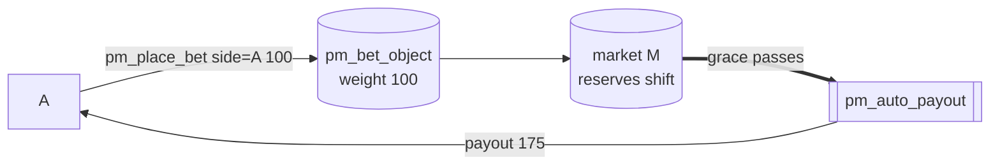

# Bettor A — early winner

Part of [PM Workflow](../README.md). **A** stakes **100 on side A early** (no time penalty) and wins
when the market resolves to A. Payout = stake back + a weight-proportional share of the winners' pool.

## Interaction diagram

## Operations it sends (signed)
- `pm_place_bet` — `side=0 (A)`, `amount=100`, `mode=0` (instant). Debits 100; mints `weight` from the CPMM.
- (optional) `pm_transfer_position` to reassign part of the weight; `pm_cancel_bet` if the market allows it.

## Virtual operations that touch it
- `pm_auto_payout` — credits the final payout once the dispute grace elapses with no open dispute.

## Tokens — normal resolve (A wins)
| sends | receives | net |
|-------|----------|-----|
| 100 | **175** | **+75** |

`profit = winners_pool 150 × weight 100 / Σweight 200 = 75`; no time penalty → `payout = 100 + 75`.

## Tokens — disputed resolve (overturned to B)
| sends | receives | net |
|-------|----------|-----|
| 100 | **0** | **−100** |

The overturn makes A the **losing** side; A's stake funds the new winners' pool. (A could itself file
the dispute if it believed A was correct — see [disputer-winner](../disputer-winner/disputer-winner.md) / [disputer-loser](../disputer-loser/disputer-loser.md).)

## Notes
- Winnings come **only** from losers' stakes (+ forfeit pool), never from emission.
- If **A had bet late**, its profit would be docked by the time penalty — that's [bettor C](../bettor-c-late-winner/bettor-c-late-winner.md).

## Code verification & how to observe
| Element | In code | Where |
|---------|---------|-------|
| `pm_place_bet` (instant, CPMM weight, `allow_instant_bet` gate) | ✔ | `pm_place_bet_evaluator` |
| `pm_transfer_position` / `pm_cancel_bet` (optional) | ✔ | their evaluators |
| winner credit at settle | ✔ | `settle_market` pays `amount + profit − penalty` via `adjust_balance` |
| vop `pm_payout` (per bet) | ✔ | carries `amount` (100), `side` (A), `payout` (175) |
| vop `pm_auto_payout` | ✔ | one per market (summary marker) |

**Observe via plugin:** `get_account_positions` (your bets + `expected_payout` / `expected_payout_approx`),
`get_market_bets`, `get_market_weight_sums` (denominator for your share); the realized `pm_payout` is in `account_history`.
