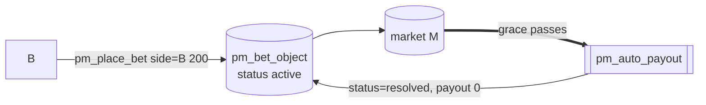

# Bettor B — loser

Part of [PM Workflow](../README.md). **B** stakes **200 on side B**. When the market resolves to **A**,
B's stake funds the winners and B receives **nothing**. (In the disputed path B becomes the winner.)

## Interaction diagram

## Operations it sends (signed)
- `pm_place_bet` — `side=1 (B)`, `amount=200`, `mode=0`. Debits 200.

## Virtual operations that touch it
- `pm_auto_payout` — marks the losing bet `status=resolved`, `resolved_amount=0` (no credit).

## Tokens — normal resolve (A wins)
| sends | receives | net |
|-------|----------|-----|
| 200 | **0** | **−200** |

B's 200 **is** the `losers_sum`: it pays the fees (40) and the winners' pool (150 → A 75 + C 75) plus
LP bonus. Loser gets nothing back — this is the parimutuel "losers fund winners" rule.

## Tokens — disputed resolve (overturned to B)
| sends | receives | net |
|-------|----------|-----|
| 200 | **3350** | **+3150** |

The overturn makes **B the winning side**; now A + C are the losers (200) and the oracle's slashed
insurance (forfeit 3000) is injected into B's winners' pool. `payout = 200 + 3150`.

## Notes
- A loser who believes the oracle is wrong can dispute. If vindicated it becomes this very B-wins
  ledger; if not, it also loses the dispute fee — see [disputer-loser](../disputer-loser/disputer-loser.md).

## Code verification & how to observe
| Element | In code | Where |
|---------|---------|-------|
| `pm_place_bet` | ✔ | `pm_place_bet_evaluator` |
| losing bet → `status=resolved`, `resolved_amount=0` (no credit) | ✔ | `settle_market` (loser branch) |
| vop `pm_payout` (per bet, **payout=0**) | ✔ | losers also get a record — `amount` (200), `side` (B), `payout` 0 |

**Observe via plugin:** `get_account_positions` (your bet shows `expected_payout=0` once resolved),
`get_market_bets` (status flips to resolved), `account_history` (`pm_payout` with payout 0). Dispute path via `get_dispute`.
