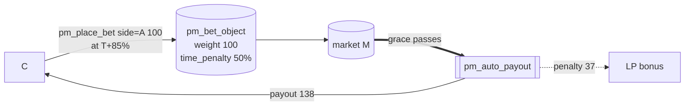

# Bettor C — late winner (time penalty)

Part of [PM Workflow](../README.md). **C** stakes **100 on side A** but **late** — at T+85% of the
betting window — so a **time penalty** is applied to its *profit only* (not its principal). C still
wins when A resolves, but earns less than the equally-weighted early [bettor A](../bettor-a-winner/bettor-a-winner.md);
the docked amount flows to the LPs.

## Interaction diagram

## Operations it sends (signed)
- `pm_place_bet` — `side=0 (A)`, `amount=100`, `mode=0`. The node stamps `time_penalty` from the
  market's penalty curve at placement time (1e6-scaled). Here ≈ **50%**.

## Virtual operations that touch it
- `pm_auto_payout` — credits `amount + profit − penalty`; the penalty is added to the LP bonus.

## Tokens — normal resolve (A wins)
| sends | receives | net |
|-------|----------|-----|
| 100 | **138** | **+38** |

`profit = 150 × 100/200 = 75`; `penalty = profit 75 × 50% = 37` (→ LPs); `payout = 100 + 75 − 37 = 138`.
Same weight as A, but **−37** vs A's +75 because of the late entry.

## Tokens — disputed resolve (overturned to B)
| sends | receives | net |
|-------|----------|-----|
| 100 | **0** | **−100** |

Overturned to B → C is a loser; the time penalty is moot (penalties apply only to a winner's profit).

## Notes
- The penalty discourages last-second sniping of near-certain outcomes; it subsidises liquidity, not the protocol.
- Penalty curve + scale are market config (`time_penalty_type/value`, `penalty_curve_type`).

## Code verification & how to observe
| Element | In code | Where |
|---------|---------|-------|
| `pm_place_bet` stamps `time_penalty` at placement | ✔ | `pm_place_bet_evaluator` (curve eval) |
| penalty applied to **profit only**, docked amount → LP bonus | ✔ | `compute_settlement` / `settle_market` |
| winner credit `amount + profit − penalty` | ✔ | `settle_market` `adjust_balance` |
| vop `pm_payout` (per bet) | ✔ | `amount` 100, `side` A, `payout` 138 (penalty already netted) |
| vop `pm_auto_payout` | ✔ | one per market (summary) |

**Observe via plugin:** `get_account_positions` (your bet's `time_penalty` + reduced `expected_payout`),
`get_market_bets` (the stored `time_penalty`); the realized `pm_payout` in `account_history`.
