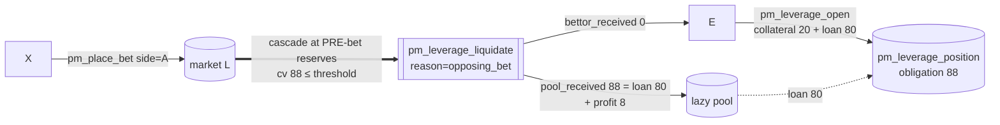

# Bettor E — leverage ×5 liquidated

Part of [PM Workflow](../README.md). **E** opens a **×5** position: **20 collateral + 80 loan** = **100**
on side B (market **L**, `R = 10%`). Before resolution an **opposing bet** (someone backs A) moves the
curve against B; E's `cancel_value` reaches its liquidation threshold and the **cascade liquidation**
force-closes it. **E loses its collateral, but the pool is always made whole** — it recovers the loan
plus its profit. By design, an opposing-bet liquidation can **never** go negative for the pool
(strategy doc §6 "cancel_value < threshold — mathematically impossible during the betting period").

Key figures: `obligation = liquidation_threshold = 80 × 1.10 = 88`. The opposing bet is bounded by the
slippage cap, and the position was opened with a safety margin (Constraint 2), so at liquidation
`cancel_value ≥ loan` always — here it triggers right at `cancel_value = 88`.

## Interaction diagram



## Operations it sends (signed)
- `pm_leverage_open` — `collateral 20`, `loan 80`, `outcome_index 1 (B)`. Pool: `free −= 80`, `leverage_fund_used += 80`.
- E sends nothing further — liquidation is **involuntary**, triggered by another account's bet.

## Virtual operations that touch it
- `pm_leverage_liquidate` (`reason = opposing_bet`) — force-closes the position at the current reserves:
  `pool_received = min(cancel_value, obligation) = 88`, `bettor_received = cancel_value − pool_received = 0`.
  (A position that instead survives to settlement is closed by `pm_leverage_resolve` — [bettor D](../bettor-d-leverage-winner/bettor-d-leverage-winner.md).)

## Tokens — outcome is the same in both resolve paths
E is liquidated **before** resolution, so the final A/B result (disputed or not) doesn't change E:

| actor | sends | receives | net |
|-------|-------|----------|-----|
| **E** | collateral **20** | **0** | **−20** |
| **pool** | loan 80 | **88** (loan 80 + R% profit 8) | **+8** |

The pool recovers its full obligation (`min(cancel_value, obligation)`); since `cancel_value ≥ loan` for
opposing-bet liquidations, the pool **never** takes a loss — it gets the loan back plus its profit. E
loses its collateral (the liquidated position pays the bettor `cancel_value − obligation = 0`).

## Edge case — the ONLY path that can go negative: cancel-bet (Case B)
There is exactly one bounded exception where the pool can take a shortfall — a **`pm_cancel_bet` on the
same side** as a leveraged position (strategy doc §5 Case B). A cancel reverses a *prior, large* same-side
bet, which can move the curve by more than the per-bet slippage cap allows. For **fairness to the
cancel-bettor**, the cancel executes FIRST (at the price they submitted), then the cascade liquidates —
so `cancel_value` can land **below the loan**:

```
shortfall = obligation − cancel_value   (if cancel_value < obligation)
pool_received = cancel_value            (e.g. 70 < loan 80)
bettor_received = 0
lazy_pool.free_balance −= shortfall      (bad debt — bounded by SL%, rare)
```

This bad debt is **bounded** (`shortfall ≤ cancel_value_before × SL%`) and **rare** (the pool's R% on
every other position more than offsets it). It is the *only* negative-liquidation path; it is covered
on-chain by the `leverage_cancel_bet_cascade_bad_debt` test. Opposing-bet liquidations (this page) and
settlement force-close ([bettor D](../bettor-d-leverage-winner/bettor-d-leverage-winner.md)) are always
full-recovery.

## Notes
- Pool protection is structural: `max_per_position`, `max_position_ratio`, `safety_margin`, the slippage
  cap (`max_slippage_percent`), and the `expiration_buffer`. `pm_leverage_enabled=false` blocks **new**
  opens, but the liquidation cascade is **not** gated by the flag — if delegates toggle leverage off
  while positions are open, those positions are still liquidated/settled normally, so governance can
  never strip the pool's protection mid-flight. Covered by `leverage_disabled_keeps_liquidation_protection`.
- A *solvent* outcome (`cancel_value > obligation`) instead pays E `cancel_value − obligation` and the
  pool its interest — the winning side of the same mechanic shown in [bettor D](../bettor-d-leverage-winner/bettor-d-leverage-winner.md).

## Code verification & how to observe
| Element | In code | Where |
|---------|---------|-------|
| `pm_leverage_open` | ✔ | `pm_leverage_open_evaluator` |
| opposing-bet liquidation at **pre-bet** reserves (`cv ≥ loan` ⇒ pool whole) | ✔ | `pm_place_bet` → `cascade_liquidate(reason=0)` before the bet applies |
| `pool_received = min(cv, obligation)`, `bettor_received = cv − pool_received` | ✔ | `liquidate_position` |
| bad debt **only** for cancel-bet (Case B) | ✔ | `pm_cancel_bet` → `cascade_liquidate(reason=1)` after the cancel |
| vop `pm_leverage_liquidate` (`reason` 0 opposing / 1 cancel) | ✔ | `liquidate_position` |

**Observe via plugin:** **`get_account_leverage_positions(E, …)`** / **`get_market_leverage_positions(L, …)`**
(position `status=1` liquidated, `cancel_value_at_liquidation`, `pool_received`, `bettor_received`); the
event is the `pm_leverage_liquidate` vop in `account_history`; pool impact via `get_lazy_pool`.
