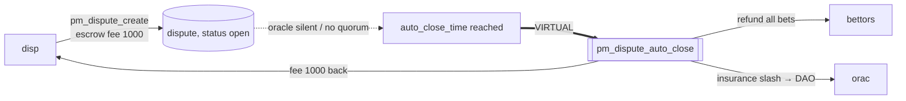

# Dispute forced to end (anti-freeze auto-close)

Part of [PM Workflow](../README.md). A dispute that is **never decided** — the oracle stays silent and
(committee mode) no quorum forms — cannot freeze the market forever. At `auto_close_time` the
`pm_dispute_auto_close` cron force-ends it: **everyone is refunded**, the disputer's fee is **returned**,
and the unresponsive oracle is penalised. No winner is picked.

## Interaction diagram

## Operations
- None at close — it is entirely cron-driven. The only signed op was the original `pm_dispute_create`.

## Virtual operations
- `pm_dispute_auto_close` — full refund of every active bet, LP principal returned, **disputer fee
  refunded**, oracle insurance slashed → DAO (`disputes_auto_closed++`, `dispute_responses_missed++`).

## Tokens — forced end (the only path here)
| Actor | sends | receives | net |
|-------|-------|----------|-----|
| A | 100 | 100 refund | **0** |
| B | 200 | 200 refund | **0** |
| C | 100 | 100 refund | **0** |
| maker / LP1 | liquidity | principal back | **0** (no bonus) |
| disp | dispute_fee 1000 | **1000 back** | **0** |
| orac | insurance −slash → DAO | — | **− slash** |

This is **not** "the disputer lost": a returned fee (net 0) is different from a forfeited fee
([disputer-loser](../disputer-loser/disputer-loser.md), net −1000). Nobody profits; the market is voided
to break the freeze, and the cost falls on the oracle that didn't respond.

## Notes
- The same void-and-refund shape also covers [oracle missed deadline](../oracle/oracle.md)
  (`pm_oracle_missed_penalty`) and `pm_no_contest` — all zero-sum refunds with an oracle penalty.
- Tune `pm_dispute_auto_close_sec` (14 d) vs `pm_dispute_vote_period_sec` (3 d) so honest disputes
  resolve before the anti-freeze fires.

## Code verification & how to observe
| Element | In code | Where |
|---------|---------|-------|
| vop `pm_dispute_auto_close` at `auto_close_time` | ✔ | `process_pm_markets` auto-close scan |
| full bet refund + LP principal + disputer fee returned | ✔ | `refund_all_bets` + `return_liquidity` + fee credit |
| oracle penalty → DAO, `disputes_auto_closed++` / `dispute_responses_missed++` | ✔ | same |
| sibling void paths | ✔ | `pm_oracle_missed_penalty`, `pm_no_contest` (same refund shape) |

**Observe via plugin:** `get_dispute` (status → auto-closed), `get_market` (`status`/`payout_status`),
`get_account_positions` (bets refunded), `get_oracle` (penalty counters).
