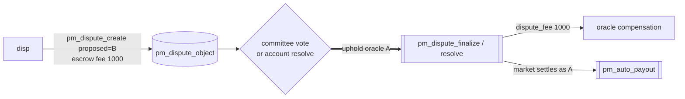

# Disputer — fee forfeited (oracle upheld)

Part of [PM Workflow](../README.md). **disp** disputes the oracle's **A**, escrows `pm_dispute_fee 1000`,
but the verdict **upholds the oracle**. The escrowed fee is **forfeited to the oracle** as compensation,
and the market settles exactly as originally resolved (A wins).

## Interaction diagram

## Operations it sends (signed)
- `pm_dispute_create` — `proposed_outcome = B`, escrows 1000, freezes payout.

## Virtual operations that touch it
- `pm_dispute_finalize` / `pm_dispute_resolve` — on **uphold**, transfers the dispute fee to the oracle
  and unfreezes the original payout.
- `pm_auto_payout` — settles the market on the original outcome A.

## Tokens — disputed resolve, oracle upheld (the "loss")
| sends | receives | net |
|-------|----------|-----|
| dispute_fee **1000** | **0** | **−1000** |

The fee is the disputer's skin-in-the-game: a wrong/frivolous dispute pays the oracle for the trouble.
Bettors A/C still win, B still loses — identical to the [normal ledger](../README.md#master-ledger--normal-resolve-a-wins).

## Tokens — normal resolve (no dispute filed)
N/A — no disputer exists without a filing.

## Notes
- This asymmetry (lose the fee if wrong, win a multiple if right) is what keeps the dispute channel honest.
- If the dispute is never decided (oracle silent, no quorum), it is force-closed and the fee is
  **returned** — see [dispute-auto-close](../dispute-auto-close/dispute-auto-close.md). That is different
  from losing on the merits here.

## Code verification & how to observe
| Element | In code | Where |
|---------|---------|-------|
| `pm_dispute_create` | ✔ | `pm_dispute_create_evaluator` |
| uphold → dispute fee transferred to oracle | ✔ | `pm_dispute_finalize` / `pm_dispute_resolve` (uphold branch) |
| original payout unfrozen + settled (A) | ✔ | `settle_market`, summarised by `pm_auto_payout` |
| vop on the disputer | — | none directly; the loss is the non-refunded escrow |

**Observe via plugin:** `get_dispute` (status → oracle-right), `get_dispute_votes`, `get_oracle`
(the oracle's balance gains the fee; `disputes_won++`).
