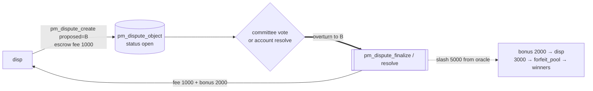

# Disputer — vindicated (oracle overturned)

Part of [PM Workflow](../README.md). **disp** thinks the oracle's **A** is wrong, files a dispute
proposing **B**, escrows `pm_dispute_fee 1000`, and the verdict **overturns to B**. disp gets its fee
back **plus** a reward carved out of the oracle's slashed insurance.

## Interaction diagram

## Operations it sends (signed)
- `pm_dispute_create` — `proposed_outcome = B`, escrows `pm_dispute_fee 1000`. Freezes payout (`payout_status = 3`).
- (committee mode) it does **not** vote on its own — the SHARES electorate does, via `pm_dispute_vote`.

## Virtual operations that touch it
- `pm_dispute_finalize` (committee) **or** `pm_dispute_resolve` (account) — on overturn, refunds the fee
  and credits the reward carve-out.

## Tokens — disputed resolve (overturned to B = the "win")
| sends | receives | net |
|-------|----------|-----|
| dispute_fee **1000** | fee 1000 back + **bonus 2000** | **+2000** |

`reward_target = fee × pm_dispute_reward_multiplier (3×) = 3000` → `bonus = 3000 − 1000 = 2000`, capped
at the slash. The bonus comes from the oracle's **slashed insurance** (5000); the remainder (3000) goes
to `forfeit_pool` → the new winners. disp risked 1000, walks away **+2000**.

## Tokens — "normal" resolve (no dispute filed)
N/A — without filing there is no disputer. If disp had **not** disputed, the original A result would
stand and B-side money would be lost.

## Notes
- The reward is **capped at the actual slash** — a tiny slash means a small (or zero) bonus, only the fee back.
- `dispute_penalty_percent < 0` on the market signals a *good-faith* oracle: no slash, the oracle keeps a
  fee bonus, and the disputer just gets its fee back (no profit). See [resolver-committee](../resolver-committee/resolver-committee.md).

## Code verification & how to observe
| Element | In code | Where |
|---------|---------|-------|
| `pm_dispute_create` (escrow fee, freeze payout) | ✔ | `pm_dispute_create_evaluator` |
| overturn → fee refund + reward carve-out (capped at slash) | ✔ | `pm_dispute_finalize` (committee) / `pm_dispute_resolve` (account) |
| remainder of slash → `forfeit_pool` → winners | ✔ | same |
| vop `pm_dispute_finalize` / settlement marker `pm_auto_payout` | ✔ | `process_pm_markets` |

**Observe via plugin:** `get_dispute` (status → oracle-wrong), `get_dispute_votes` (committee tally),
`get_account_positions` (your refunded fee + reward land as balance; the winning bet's new payout).
