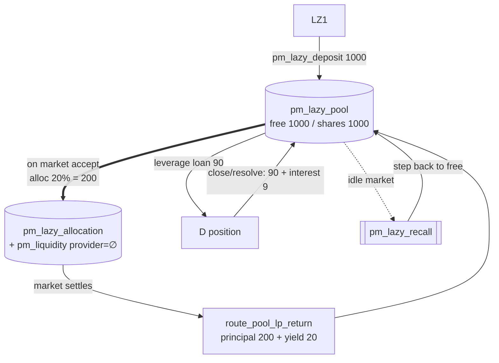

# The Lazy Liquidity Pool (system object)

Part of [PM Workflow](../README.md). The lazy pool is a **singleton** `pm_lazy_pool_object` — not an
account. Depositors fund it once; the pool **auto-allocates** a slice to each accepted market as a
silent LP (`pm_liquidity_object` with empty `provider`), **funds leverage loans**, and **recalls**
idle allocations. It earns LP yield + leverage interest, accounted MasterChef-style
(`reward_per_share × 1e9 / total_shares`). Depositor view: [lp-lazy-pool](../lp-lazy-pool/lp-lazy-pool.md).

## Fields
`total_shares`, `free_balance`, `allocated_balance`, `earned_balance` (monotonic), `reward_per_share`,
`leverage_fund_used` (cap on what `free_balance` may lend).

## Interaction diagram

## How money enters / leaves the pool
| Event | Effect on pool |
|-------|----------------|
| `pm_lazy_deposit` (depositor) | `free_balance += amount`, mint shares |
| market allocation (auto, on accept) | `free → allocated` (becomes a silent LP) |
| market settles | `route_pool_lp_return`: principal + yield → `free_balance`; yield → `earned_balance` & `reward_per_share` |
| leverage open (D/E) | `free_balance −= loan`, `leverage_fund_used += loan` |
| leverage close / resolve / opposing-bet liquidation | `min(cancel_value, obligation) → free_balance`; `cancel_value ≥ loan` ⇒ **never a loss** (loan + R% profit → `earned_balance`) |
| cancel-bet liquidation (Case B only) | recovers `cancel_value` which **may be < loan** → bounded **bad debt** `−= shortfall` from `free_balance` |
| `pm_lazy_recall` (cron, idle market) | recalls one 10% step of an idle allocation back to `free_balance` |
| `pm_lazy_withdraw` (depositor) | burn shares → principal + pending; emergency penalty stays in pool |

## Tokens over the canonical scenario
| Source | Δ earned / free |
|--------|-----------------|
| Market M allocation 200 → yield | **+20** earned |
| Leverage D interest (`90 × 10%`, settlement) | **+9** earned |
| Leverage E opposing-bet liquidation (recovers obligation 88 = loan 80 + R% 8) | **+8** earned |
| **Net pool gain** | **+37** earned |

> **The pool's leverage liquidations are never negative** for opposing bets or settlement force-close:
> the liquidation runs at pre-bet reserves where `cancel_value ≥ loan`, so `pool_received = min(cv,
> obligation)` returns at least the loan (strategy doc §6). The **only** path that can charge the pool a
> bounded shortfall is a same-side **`pm_cancel_bet` (Case B)** — the cancel executes first for fairness,
> then the cascade may liquidate below the loan (`free_balance −= shortfall`, bounded by `SL%`, rare).
> See [bettor E](../bettor-e-leverage-liquidated/bettor-e-leverage-liquidated.md) and the
> `leverage_cancel_bet_cascade_bad_debt` test.

There is no "with/without dispute" branch for the pool itself: as a **market LP** its principal is
returned unconditionally either way; only its *bonus* yield varies with the market's fee/penalty pool.

## Virtual operations it emits
- `pm_lazy_recall` — graduated recall of idle allocations (one 10% step per `(result−created)/10`).
- (leverage) `pm_leverage_liquidate` / `pm_leverage_resolve` settle pool loans.

## Notes
- The pool serves **both** roles at once from a single `free_balance`: market-LP allocations
  (`maybe_allocate_lazy`) **and** leverage loans (`leverage_fund_used` caps the latter). The leverage
  knobs (`pm_leverage_fund_percent`, `…_max_per_position_bp`, `…_max_position_ratio_percent`,
  `…_min_market_liquidity`, `pm_leverage_enabled`) are all checked **at `pm_leverage_open` time** against
  the current median — so later property swings only affect *new* opens, never loans already out.
- `pm_leverage_enabled` is a kill-switch (default **off**). It blocks new opens only; the liquidation
  cascade that protects the pool from **existing** positions is deliberately **not** gated by it, so
  flipping the flag off can never leave open loans unprotected.
- VIZ in the lazy pool is **liquid**, not vested, so it carries **no** validator-scheduling or
  committee-request weight (those use `effective_vesting_shares` only). **Exception (HF14):** for
  **PM committee disputes**, a depositor's pool stake **is** counted — converted to vesting-shares via
  `get_vesting_share_price()` and added to their `pm_dispute_vote` weight, so pooled DAO members aren't
  disenfranchised. See [resolver-committee](../resolver-committee/resolver-committee.md).

## Code verification & how to observe
| Element | In code | Where |
|---------|---------|-------|
| singleton created at HF14 | ✔ | `apply_hardfork(CHAIN_HARDFORK_14)` |
| auto-allocation on accept | ✔ | `maybe_allocate_lazy` |
| LP yield routed back | ✔ | `route_pool_lp_return` (principal + yield → `free_balance`, `reward_per_share`) |
| leverage loan / interest / bad debt | ✔ | `pm_leverage_open` / `liquidate_position` |
| vop `pm_lazy_recall` | ✔ | graduated recall step |
| vop `pm_leverage_liquidate` | ✔ | mid-market cascade (opposing/cancel) |
| vop `pm_leverage_resolve` | ✔ | settles pool loans at market resolution (force-close) |

**Observe via plugin:** `get_lazy_pool` (`free_balance`, `allocated_balance`, `earned_balance`,
`reward_per_share`, `leverage_fund_used`). Per-market allocations have **no** dedicated API method.
