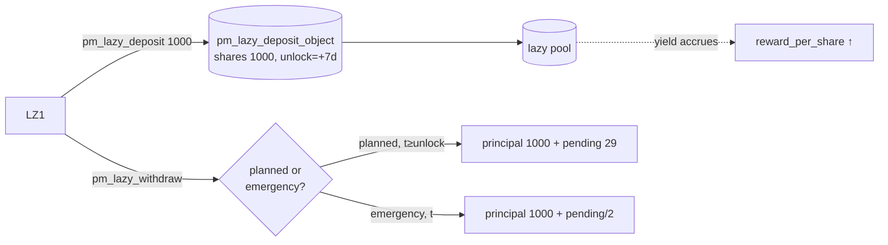

# Liquidity provider in the lazy pool (LZ1)

Part of [PM Workflow](../README.md). **LZ1** deposits **1000** into the [lazy pool](../lazy-pool/lazy-pool.md)
**once** and lets the pool spread it across markets + leverage loans. It earns a share of the pool's
aggregate yield (MasterChef `reward_per_share`), not any single market's outcome. Two exit paths:
**planned** (after the lock) and **emergency** (before the lock, with a penalty).

## What ops make you a lazy-pool participant?
- **`pm_lazy_deposit`** — `amount=1000`. Mints pool shares (first depositor 1:1 → 1000 shares), records
  `principal`, `reward_snapshot`, and `unlock_time = now + pm_lazy_lock_sec` (7 d).
- **`pm_lazy_withdraw`** — burns shares for principal + accrued rewards. `emergency=true` exits before
  `unlock_time` with a penalty on the *profit*.

That is the whole interface — there is **no per-market action**; allocation/recall/leverage are automatic.

## Interaction diagram

## Virtual operations that touch it
- None direct. Its `pending_rewards` track the pool's `reward_per_share`, which rises as the pool's
  allocations settle and leverage interest accrues (driven by `pm_lazy_recall`, leverage vops, etc.).

## Tokens — planned withdrawal (after unlock)
| sends | receives | net |
|-------|----------|-----|
| 1000 deposit | **1000 principal + ~29 pending** | **+29** |

`pending = shares × reward_per_share / 1e9` — its slice of the pool's +29 earned (market yield 20 +
leverage interest 9) over the scenario.

## Tokens — emergency withdrawal (before unlock)
| sends | receives | net |
|-------|----------|-----|
| 1000 deposit | 1000 principal + (29 − **penalty 14**) = **1015** | **+15** |

`penalty = pending 29 × pm_lazy_emergency_penalty_percent 50% = 14`, which **stays in the pool**
(added to `reward_per_share` for the remaining depositors). Principal is never penalised.

## Notes
- "Normal vs dispute resolve" doesn't change LZ1 directly — as a pooled LP its principal is always
  returned; only the *amount* of yield varies with how the underlying markets settled.
- Pool VIZ is liquid, **not** vesting → no validator-scheduling / committee-request weight. **But** for
  **PM committee disputes** your pool stake *does* count: it is converted to vesting-shares
  (`get_vesting_share_price()`) and added to your `pm_dispute_vote` weight. See
  [resolver-committee](../resolver-committee/resolver-committee.md).

## Code verification & how to observe
| Element | In code | Where |
|---------|---------|-------|
| `pm_lazy_deposit` (mint shares, set `unlock_time`) | ✔ | `pm_lazy_deposit_evaluator` |
| `pm_lazy_withdraw` planned (principal + pending) | ✔ | `pm_lazy_withdraw_evaluator` |
| `pm_lazy_withdraw` emergency (penalty on profit → `reward_per_share`) | ✔ | same evaluator, `emergency=true` branch |
| pending = `shares × reward_per_share / 1e9` | ✔ | MasterChef accounting |

**Observe via plugin:** `get_lazy_deposit` (your `shares`, `principal`, `pending_rewards`, `unlock_time`),
`get_lazy_pool` (pool-wide `reward_per_share` driving your yield).
