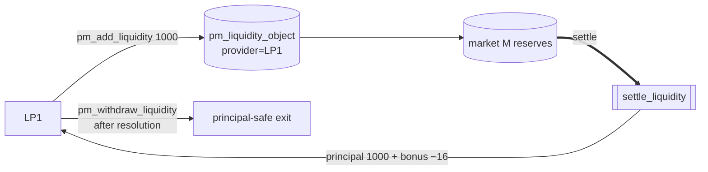

# Liquidity provider in the market (LP1)

Part of [PM Workflow](../README.md). **LP1** adds **1000** liquidity to active market M (after the
maker's seed). Its principal is **always** returned; on top it earns a **time-weighted** slice of the
LP bonus (liquidity fee + time penalties + rounding dust). Distinct from a [lazy-pool provider](../lp-lazy-pool/lp-lazy-pool.md),
who deposits once and is auto-allocated across many markets.

## Interaction diagram

## Operations it sends (signed)
- `pm_add_liquidity` — `amount=1000`. Joins the binary CPMM reserves proportionally; records `deposit_time` (the time-weight basis).
- `pm_withdraw_liquidity` — principal-safe; **locked** from `betting_expiration` until resolution.
  `amount=0` withdraws the full position. Pays principal + any accrued `earned_fee`.

## Virtual operations that touch it
- `pm_auto_payout` / `settle_liquidity` — returns principal + the time-weighted LP-bonus share.

## Tokens — normal resolve (A wins)
| sends | receives | net |
|-------|----------|-----|
| 1000 | **1000 principal + ~16 bonus** | **+16** |

LP bonus pool = `liq_fee 10 + time-penalties 37 = 47`, split by `principal × seconds-in-market` between
the earlier maker (~31) and the later LP1 (~16). Earlier + larger ⇒ bigger slice.

## Tokens — disputed resolve (overturned to B)
| sends | receives | net |
|-------|----------|-----|
| 1000 | 1000 principal + ~4 bonus | **+4** |

Principal still safe; the bonus is smaller (the B-wins pool generated no winner time-penalties, so the
LP bonus is only `liq_fee 10`, split with the maker).

## Notes
- **Principal guarantee** is architectural: the seed/subsidy is returned before any winner is paid; an
  LP can never lose principal to bettors — only forgo bonus.
- Withdrawing during the betting window (before `betting_expiration`) is allowed; after it, the
  position is locked until the market resolves.

## Code verification & how to observe
| Element | In code | Where |
|---------|---------|-------|
| `pm_add_liquidity` (records `deposit_time`) | ✔ | `pm_add_liquidity_evaluator` |
| `pm_withdraw_liquidity` (principal-safe, lock gate) | ✔ | `pm_withdraw_liquidity_evaluator` |
| principal returned + time-weighted bonus | ✔ | `settle_liquidity` → `distribute_lp` (principal × seconds) |
| dedicated LP vop | — | none; settlement is summarised by the market's `pm_auto_payout` |

**Observe via plugin:** `get_market_liquidity` (your `pm_liquidity_object`: `amount`, `earned_fee`,
`status`), `get_market_weight_sums` (reserves / `q` for client pricing).
