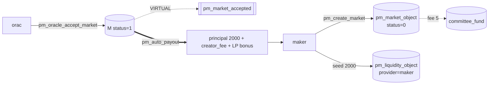

# Market maker (creator + first LP)

Part of [PM Workflow](../README.md) — uses canonical market **M**. The maker creates market M, seeds
the **2000** liquidity (and so becomes the first `pm_liquidity_object`), and proposes the oracle's
**offer ceiling**. It does **not** resolve (that's the oracle).

## Interaction diagram

## Operations it sends (signed)
- `pm_create_market` — sets `oracle_fee_percent` / `oracle_fixed_fee` as the **offer ceiling**,
  plus its own `creator_fee_percent` (5%) and `liquidity_fee_percent` (5%). Pays `pm_market_creation_fee` 5 → DAO, locks `liquidity` 2000.
- `pm_add_liquidity` / `pm_withdraw_liquidity` — optional; principal-safe, locked from
  `betting_expiration` until resolution.

## Virtual operations that touch it
- `pm_market_accepted` — emitted when the oracle accepts (or, for a self-oracle, at creation).
- `pm_auto_payout` — returns the maker's LP principal + its time-weighted LP-bonus share at settlement.

## Tokens — normal resolve (A wins)
| sends | receives | net |
|-------|----------|-----|
| 2000 liquidity + 5 creation-fee (→DAO) | 2000 principal + **creator_fee 10** + **LP-bonus ~31** | **+36** |

LP principal is returned **unconditionally**; `creator_fee = losers_sum × 5% = 10`; LP-bonus =
its time-weighted slice of (liq_fee + time-penalties + dust) = ~31 of 47.

## Tokens — disputed resolve (overturned to B)
| sends | receives | net |
|-------|----------|-----|
| 2000 + 5 | 2000 principal + creator_fee 10 + LP-bonus ~6 | **+11** |

The creator fee is **still paid** from the frozen market config — the dispute punishes the **oracle**
(insurance slash), not the maker. LP-bonus is smaller because the disputed pool produced fewer
time-penalties. If the maker were also the oracle (self-oracle), see [oracle-dispute-loser](../oracle-dispute-loser/oracle-dispute-loser.md).

## Notes
- Self-oracle variant: `oracle == creator` → market is active at creation, `pm_market_accepted`
  fires immediately with `self_oracle=true`, and the maker also earns the `oracle_take`.
- A banned creator cannot open new markets — see [oracle-banned](../oracle-banned/oracle-banned.md) (same `pm_creator_ban_object` mechanism for creators).

## Code verification & how to observe
| Element | In code | Where |
|---------|---------|-------|
| `pm_create_market` (offer ceiling, fees bp) | ✔ | `pm_create_market_evaluator` |
| `pm_add_liquidity` / `pm_withdraw_liquidity` | ✔ | their evaluators (principal-safe, lock gate) |
| vop `pm_market_accepted` | ✔ | on oracle accept / self-oracle create |
| vop `pm_auto_payout` | ✔ | per-market settle marker; LP principal+bonus via `settle_liquidity` (`adjust_balance`) |
| creation fee → DAO | ✔ | `committee_fund += pm_market_creation_fee` |

**Observe via plugin:** `get_market` (status, frozen fees), `list_markets_by_creator`,
`get_market_liquidity` (your LP rows + `earned_fee`), `get_market_meta` (your JSON metadata).
