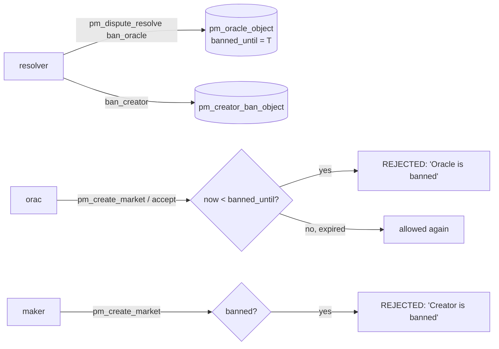

# Banned oracle (and banned creator)

Part of [PM Workflow](../README.md). A ban is a **status**, not a transfer: `pm_oracle_object.banned_until`
(and, for creators, a `pm_creator_ban_object`) blocks the actor from taking on new markets until the
timestamp passes. It usually rides along with an [overturn slash](../oracle-dispute-loser/oracle-dispute-loser.md),
but the ban itself moves no tokens.

## Who sets it
- **Account mode:** `pm_dispute_resolve` with `ban_oracle` + `ban_oracle_until` (and/or
  `ban_creator` + `ban_creator_until`).
- **Committee mode:** `pm_dispute_finalize` applies a ban scaled by consensus on an overturn.
- `banned_until = time_point_sec::maximum()` ⇒ a **permanent** ban.

## Interaction diagram

## Operations affected
- `pm_create_market` — rejected while the **creator** is banned (`pm_creator_ban_object.banned_until > now`).
- `pm_create_market` (as oracle) / `pm_oracle_accept_market` — rejected while the **oracle** is banned.
- Existing markets the oracle already serves continue; the ban only blocks **new** engagements.

## Tokens
| Event | tokens |
|-------|--------|
| the ban itself | **0** — pure status change |
| the slash that usually accompanies it | see [oracle-dispute-loser](../oracle-dispute-loser/oracle-dispute-loser.md) (−5000 insurance) |
| insurance still locked | refundable on `pm_oracle_update` withdraw **after** the ban lifts and no active markets remain |

## Notes
- Bans are stored as plain status fields and survive snapshots (`pm_oracle_object`, `pm_creator_ban_object`
  are both serialized). A re-registration cannot wipe a ban — it is keyed by account.
- Combine with reputation counters (`bans_received`, `disputes_lost`) that the API plugin folds into the
  on-read reliability score.

## Code verification & how to observe
| Element | In code | Where |
|---------|---------|-------|
| oracle `banned_until` set | ✔ | `pm_dispute_resolve` (`ban_oracle`) / `pm_dispute_finalize` |
| oracle ban enforced on create/accept | ✔ | `pm_create_market_evaluator` (`"Oracle is banned"`) |
| creator ban via `pm_creator_ban_object` | ✔ | `pm_dispute_resolve` upsert; checked in `pm_create_market` (`"Creator is banned"`) |
| both objects serialized in snapshot | ✔ | `plugins/snapshot` export/import |
| no token movement from the ban itself | ✔ | status-only |

**Observe via plugin:** `get_oracle` (`banned_until`, `bans_received`) for an oracle ban;
**`get_creator_ban(account)`** (`banned_until`, `ban_count`) for a creator ban.
