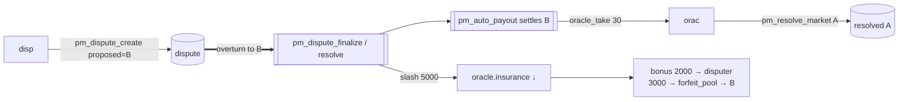

# Oracle — overturned + slashed (dispute loser)

Part of [PM Workflow](../README.md). The oracle **orac** resolved **A**; the dispute **overturns to B**
and the oracle's insurance is **slashed**. The oracle still collects the tiny frozen market fee (the
fee and the punishment are separate money), but loses a large slice of its bond and reputation.

## Interaction diagram

## Operations it sends (signed)
- `pm_resolve_market` (the disputed call). No further oracle action; the committee/resolver decides.

## Virtual operations that touch it
- `pm_dispute_finalize` / `pm_dispute_resolve` (overturn) — slashes insurance, sets `disputes_lost++`,
  optionally sets `banned_until` (→ [oracle-banned](../oracle-banned/oracle-banned.md)).
- `pm_auto_payout` — settles on the corrected outcome B.

## Tokens — disputed resolve, overturned (the "loss")
| sends | receives | net (market) |
|-------|----------|--------------|
| insurance −**5000 slashed** | oracle_take 30 | **−4970** |

`slash = insurance 5000 × dispute_penalty_percent (100%) × consensus_strength (100%) = 5000`. It is
**redistributed**, not burned: `bonus 2000 →` disputer, `3000 → forfeit_pool →` the new winners (B).
The oracle keeping the 30 market fee is deliberate — punishment lives in the bond, not the fee.

## Tokens — normal resolve (no dispute)
| sends | receives | net (market) |
|-------|----------|--------------|
| insurance 5000 (locked) | oracle_take 30 | **+30** |

## Notes
- Slash scales with **consensus strength** (`winning_rshares / max_rshares`) — a split verdict slashes less.
- `dispute_penalty_percent < 0` (good-faith) → **no** slash; the oracle even keeps a fee bonus.
- A slashed oracle is often **banned** too (`ban_oracle` / `banned_until`), blocking new markets until expiry.

## Code verification & how to observe
| Element | In code | Where |
|---------|---------|-------|
| overturn → insurance slash `× pp × consensus_strength`, `disputes_lost++` | ✔ | `pm_dispute_finalize` / `pm_dispute_resolve` (overturn) |
| slash split: disputer bonus + `forfeit_pool` | ✔ | same |
| market fee still paid from frozen config | ✔ | `settle_market` uses `mkt.oracle_fee_percent` |
| optional `banned_until` set | ✔ | `ban_oracle` (account) / scaled ban (committee) |

**Observe via plugin:** `get_oracle` (`insurance` dropped, `disputes_lost++`, `banned_until`,
`total_insurance_slashed`), `get_dispute` (status → oracle-wrong).
