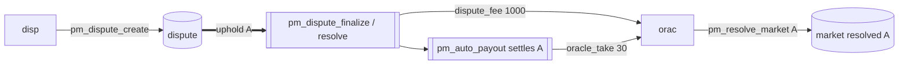

# Oracle — upheld in a dispute (dispute winner)

Part of [PM Workflow](../README.md). The oracle **orac** resolved **A**; a disputer challenged it, but
the verdict **upholds** A. The oracle keeps its normal market fee **and** collects the forfeited
`dispute_fee` as compensation; its insurance is untouched and `disputes_won` increments.

## Interaction diagram

## Operations it sends (signed)
- `pm_resolve_market` (already done). The oracle does not act again during the dispute (committee/account decides).

## Virtual operations that touch it
- `pm_dispute_finalize` / `pm_dispute_resolve` (uphold) — credits the `dispute_fee`, sets `disputes_won++`.
- `pm_auto_payout` — credits the normal `oracle_take`.

## Tokens — disputed resolve, upheld (the "win")
| sends | receives | net (market) |
|-------|----------|--------------|
| insurance 5000 (locked, **not** slashed) | oracle_take 30 + **dispute_fee 1000** | **+1030** |

The challenge backfires on the disputer and **pays the oracle**. Compare the slashed case in
[oracle-dispute-loser](../oracle-dispute-loser/oracle-dispute-loser.md).

## Tokens — normal resolve (no dispute)
| sends | receives | net (market) |
|-------|----------|--------------|
| insurance 5000 (locked) | oracle_take 30 | **+30** |

## Notes
- Being upheld also improves the oracle's on-read reliability score (more `disputes_won`, no slash).
- A *good-faith* market (`dispute_penalty_percent < 0`) can hand the oracle a fee bonus even when the
  outcome is changed — recognising an honest mistake rather than punishing it.

## Code verification & how to observe
| Element | In code | Where |
|---------|---------|-------|
| uphold → `dispute_fee` credited to oracle, `disputes_won++` | ✔ | `pm_dispute_finalize` / `pm_dispute_resolve` (uphold) |
| insurance untouched | ✔ | no slash on uphold |
| settlement on original outcome | ✔ | `settle_market` + `pm_auto_payout` |

**Observe via plugin:** `get_oracle` (`insurance` unchanged, `disputes_won`, higher reliability score),
`get_dispute` (status → oracle-right).
