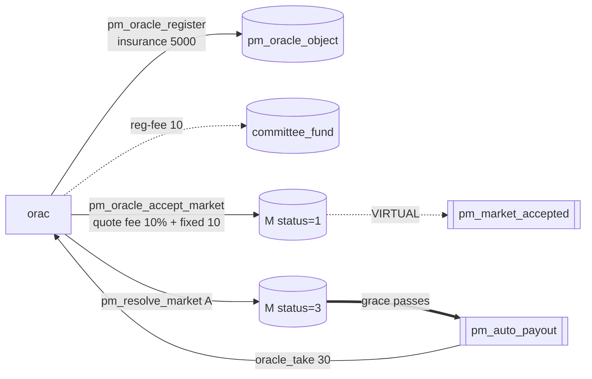

# Oracle (register → accept/quote → resolve)

Part of [PM Workflow](../README.md) — external oracle **orac** on market **M**. The oracle bonds
insurance, **quotes** its fee at accept (≤ the maker's offer and ≤ `pm_max_oracle_fee_percent`), and
resolves the outcome. Its market fee is paid from the losers' pool at settlement; its bond is at risk
only on a missed deadline or a lost dispute.

## Interaction diagram

## Operations it sends (signed)
- `pm_oracle_register` — locks `insurance` 5000, pays `pm_oracle_registration_fee` 10 → DAO. Sets the
  **advisory** standing `fee_percent` / `fixed_fee` (its public price list).
- `pm_oracle_accept_market` — **quotes** `oracle_fee_percent` (10%) + `oracle_fixed_fee` (10), each
  `≤` the creator's offer on the market and `≤ pm_max_oracle_fee_percent`. Freezes them onto M; market goes live.
- `pm_resolve_market` — sets `winning_outcome = A`, opens the dispute grace window.
- `pm_oracle_update` / `pm_no_contest` — optional (top-up/withdraw bond; void a market).

## Virtual operations that touch it
- `pm_market_accepted` — announces the launch + the oracle's frozen terms.
- `pm_auto_payout` — credits the `oracle_take` (`oracle_fee + oracle_fixed_paid`) at settlement.
- `pm_oracle_missed_penalty` — if the oracle never resolves, slashes `pm_oracle_penalty_percent` (5% = 250) of insurance → DAO and refunds all bets.

## Tokens — normal resolve (A wins)
| sends | receives | net (market) |
|-------|----------|--------------|
| insurance 5000 (locked, refundable) + reg-fee 10 (→DAO) | **oracle_take 30** = oracle_fee 20 + fixed 10 | **+30** |

## Tokens — disputed resolve (overturned to B)
| sends | receives | net (market) |
|-------|----------|--------------|
| insurance −**5000 slashed** | oracle_take 30 | **−4970** |

Even when overturned the oracle keeps the small **market fee** (frozen config); the penalty is the
**insurance slash** (`5000 × dispute_penalty_percent × consensus_strength`). The slash is split into the
disputer's reward and the winners' `forfeit_pool`. See [oracle-dispute-loser](../oracle-dispute-loser/oracle-dispute-loser.md).

## Notes
- Quoting **below** the offer is allowed (price = reputation, not a bribe); quoting **above** is rejected.
- A self-oracle (`oracle==creator`) auto-accepts at creation and additionally earns the `creator_take`.

## Code verification & how to observe
| Element | In code | Where |
|---------|---------|-------|
| `pm_oracle_register` (insurance lock, reg-fee→DAO, fee≤cap) | ✔ | `pm_oracle_register_evaluator` |
| `pm_oracle_accept_market` quote (≤ offer, ≤ median cap) + freeze | ✔ | `pm_oracle_accept_market_evaluator` |
| `pm_resolve_market`, `pm_no_contest`, `pm_oracle_update` | ✔ | their evaluators |
| vop `pm_market_accepted` | ✔ | emitted on accept |
| vop `pm_oracle_missed_penalty` | ✔ | `process_pm_markets` missed-deadline scan |
| `oracle_take` credit at settle | ✔ | inside `settle_market` (`adjust_balance`), summarised by `pm_auto_payout` |

**Observe via plugin:** `get_oracle` (insurance, the 14 counters + computed reliability score),
`list_oracles` (sorted), `get_market` (frozen `oracle_fee_percent`/`oracle_fixed_fee`).
