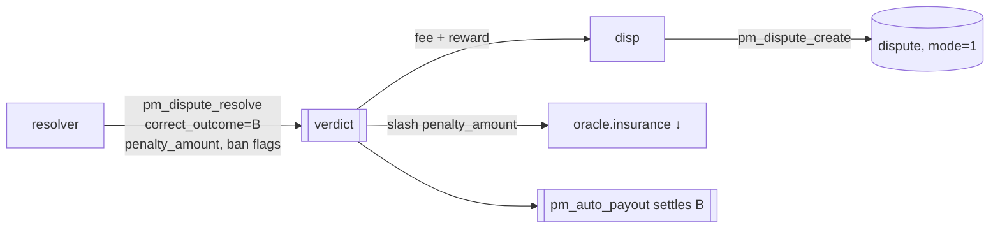

# Resolver — single account (centralized, dispute_mode = 1)

Part of [PM Workflow](../README.md). In **account mode** the market names one `dispute_resolver`
account (e.g. a regulator multisig) that decides disputes alone — **no stake weight, no DAO vote**. It
is set at creation and must differ from both `oracle` and `creator` (anti self-judging). The protocol
stays neutral: same op set as committee mode, only *who decides* differs.

## Interaction diagram

## Operations it sends (signed)
- `pm_dispute_resolve` — **auth `active` of the named `dispute_resolver`** only. Fields:
  `correct_outcome`, `penalty_amount` (insurance to slash — a fixed amount, **not** stake-scaled),
  `ban_oracle` + `ban_oracle_until`, `ban_creator` + `ban_creator_until`.

## Virtual operations
- `pm_auto_payout` — settles on the resolver's chosen outcome after grace.

## Tokens
| Actor | sends | receives |
|-------|-------|----------|
| resolver | 0 | **0** — a neutral arbiter; it sets the verdict, money flows to the parties |
| oracle (overturned) | insurance −`penalty_amount` | keeps market fee |
| disputer (right) | fee | fee back + reward carve-out from `penalty_amount` |

The post-verdict canon is identical to committee mode; only the slash size differs — here it is the
resolver-set `penalty_amount` (no `consensus_strength` scaling, since there is a single decider).

## Notes
- The resolver can also **ban** the oracle and/or creator (`pm_oracle_object.banned_until`,
  `pm_creator_ban_object`). See [oracle-banned](../oracle-banned/oracle-banned.md).
- KYC/whitelisting of the resolver account is a **client-layer** concern; on-chain it is just an account
  with `active` auth over `pm_dispute_resolve`.

## Code verification & how to observe
| Element | In code | Where |
|---------|---------|-------|
| `pm_dispute_resolve` (only the named resolver, `dispute_mode==1`) | ✔ | `pm_dispute_resolve_evaluator` |
| slash = `penalty_amount` (no consensus scaling) | ✔ | overturn branch |
| `ban_oracle` / `ban_creator` applied | ✔ | sets `banned_until` / upserts `pm_creator_ban_object` |
| settlement on resolver's outcome | ✔ | `settle_market` + `pm_auto_payout` |
| resolver token reward | — | none — neutral arbiter |

**Observe via plugin:** `get_dispute` (resolved status), `get_oracle` (slash / ban),
**`get_creator_ban(account)`** (a creator ban's `banned_until` / `ban_count`).
