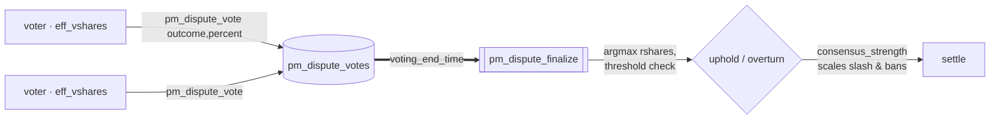

# Resolver — committee (stake-weighted, dispute_mode = 0)

Part of [PM Workflow](../README.md). In **committee mode** the *whole SHARES electorate* decides a
dispute by **stake-weighted vote**. There is no single resolver account; the verdict is tallied
deterministically by the `pm_dispute_finalize` cron at `voting_end_time`.

## Voting weight (read this carefully)
A voter's weight is its live **`effective_vesting_shares`** (`vesting − delegated + received`, like
`committee_vote_request`) **plus its lazy-pool stake converted to vesting-shares**. Since many DAO
members park VIZ in the [lazy pool](../lazy-pool/lazy-pool.md) for yield (where it is *liquid*, not
vested), counting only vested SHARES would disenfranchise them. So the tally adds, per voter:

```
pool_claim_viz = pool_NAV × deposit.shares / pool.total_shares      (their share of the pool)
pool_weight    = pool_claim_viz × get_vesting_share_price()          (same token↔shares price as
                                                                      create_vesting — drifts with dust)
voter_weight   = effective_vesting_shares + pool_weight
```

The **participation quorum** denominator is likewise `total_vesting_shares + (pool_NAV → vesting-shares)`,
so the bar scales with the full electorate (vested + pooled). The 7-day deposit lock prevents
deposit-vote-withdraw gaming — the same reason vesting can't be flash-staked to vote.

## Interaction diagram



## Operations sent (by voters)
- `pm_dispute_vote` — **auth `regular`** (same as committee voting). `vote_outcome = -1` upholds the
  oracle, else proposes the correct outcome; `vote_percent ∈ [-10000, 10000]` is conviction/penalty intensity.
  **A voter may revise their ballot** any number of times while voting is open — a repeat
  `pm_dispute_vote` **overwrites** the prior one (latest ballot wins, no "Already voted" rejection).

## Why a public hearing — no commit-reveal (deliberate, will NOT change)
A committee dispute is an **open public hearing**: the running tally is visible (`get_dispute_votes`)
and votes are **not** hidden behind a commit-reveal phase. This is a permanent design decision, not a
gap:
- The DAO's entire value proposition for prediction markets is **resolving disputes as truthfully and
  transparently as possible**. Hiding votes until a reveal phase would erode the very trust the platform
  is built on — opacity in adjudication is exactly what makes a market venue lose credibility.
- Because the hearing is open, **new evidence and arguments surface during voting**, and voters are
  *expected* to update — so ballots are **revisable** until `voting_end_time`. A voter who is persuaded
  by a late argument simply re-sends `pm_dispute_vote` with the new outcome.
- The usual anti-herding rationale for commit-reveal (Keynesian beauty contest) is weak here: voters are
  **not paid** for matching the majority (see Tokens below), so there is no bandwagon bounty; influence
  is pure stake weight, already gated by the 7-day deposit lock and the participation quorum.

## Virtual operations
- `pm_dispute_finalize` — at `voting_end_time`: per-outcome **rshares** = Σ voter
  (`effective_vesting_shares` + lazy-pool stake → vesting-shares), a participation threshold
  (`pm_dispute_approve_min_percent` of `total_vesting_shares + pool_NAV→shares`), winner = argmax, and
  `consensus_strength = winning_rshares / max_rshares` scales the oracle slash and bans.

## Tokens
| Actor | sends | receives |
|-------|-------|----------|
| each voter | 0 | **0** — voting is a governance duty, not a paid action |
| disputer / oracle / winners | see [disputer-winner](../disputer-winner/disputer-winner.md) · [oracle-dispute-loser](../oracle-dispute-loser/oracle-dispute-loser.md) | — |

Voters never receive tokens; their influence is their **stake weight**. The economic flows (reward,
slash, payouts) land on the disputer, oracle, and bettors per the [dispute ledger](../README.md#master-ledger--disputed-resolve-oracle-said-a--overturned-to-b).

## Notes
- Niche markets may fail the participation threshold → the dispute falls through to
  [dispute-auto-close](../dispute-auto-close/dispute-auto-close.md) (anti-freeze refund).
- Contrast the single-account path: [resolver-account](../resolver-account/resolver-account.md).

## Code verification & how to observe
| Element | In code | Where |
|---------|---------|-------|
| `pm_dispute_vote` (regular auth, only `dispute_mode==0`) | ✔ | `pm_dispute_vote_evaluator` |
| ballot **revisable** while voting open (re-vote overwrites, latest wins) | ✔ | `pm_dispute_vote_evaluator` (modify-or-create on `by_market_voter`) |
| **no commit-reveal** — open tally by design | ✔ | votes stored & tallied in the clear; `get_dispute_votes` exposes the live tally |
| tally weight = `effective_vesting_shares` **+ lazy-pool stake → vesting-shares** | ✔ | `pm_dispute_finalize` (`lazy_vote_weight` lambda, `get_vesting_share_price`) |
| quorum denominator = `total_vesting_shares + pool_NAV→shares` | ✔ | `pm_dispute_finalize` |
| participation threshold + argmax + `consensus_strength` scaling | ✔ | same |
| vop `pm_dispute_finalize` | ✔ | at `voting_end_time` |
| voter token reward | — | none — governance duty, unpaid |

**Observe via plugin:** `get_dispute_votes` (each vote + **live tally** + a stake-weighted **projection
of finalize**: `quorum_percent_bp`, `quorum_reached`, `expected_uphold`, `expected_outcome`,
`expected_consensus_strength_bp` — the verdict that would apply at `voting_end_time` under current
votes), `get_dispute` (status, timers),
`get_lazy_deposit` (a voter's pooled stake) + `get_lazy_pool` (NAV + total shares for the conversion).
On-chain tests: `committee_dispute_lazy_pool_voting_weight` (lazy-pool weight), `committee_dispute_flips_outcome`
(ballot revised mid-hearing: uphold → overturn, latest ballot wins).
