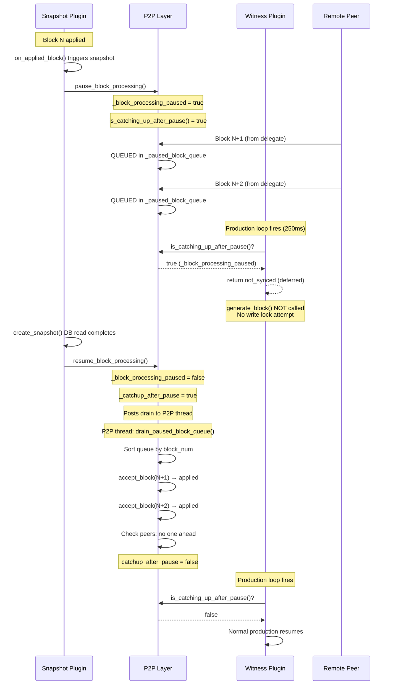
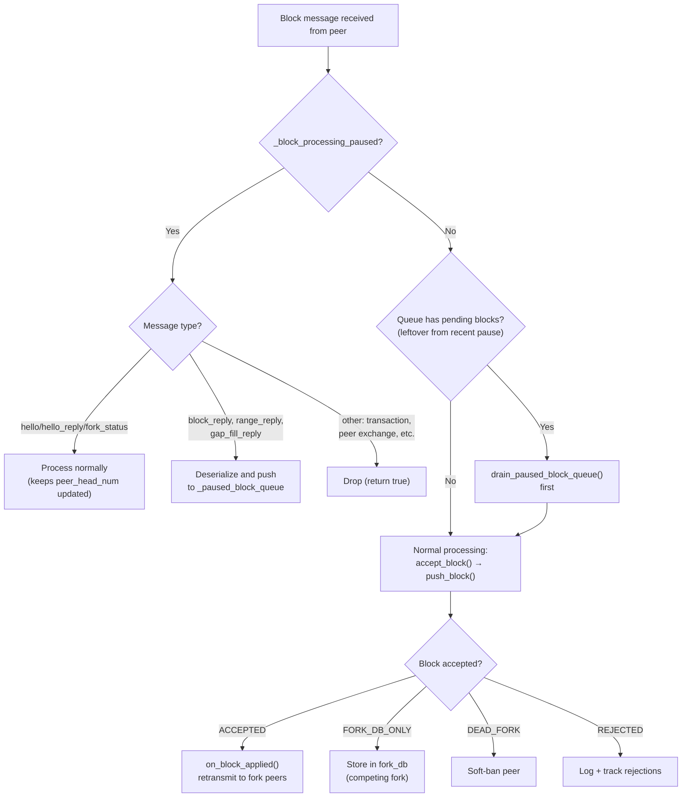
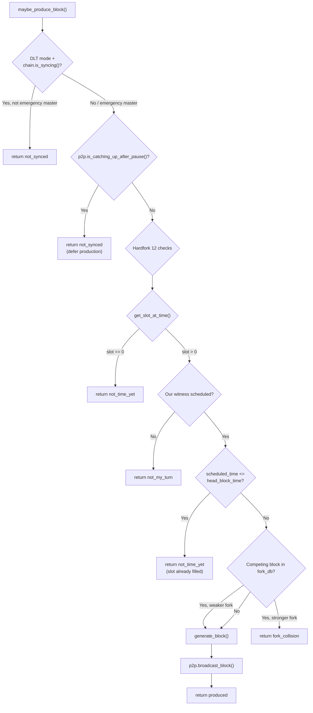
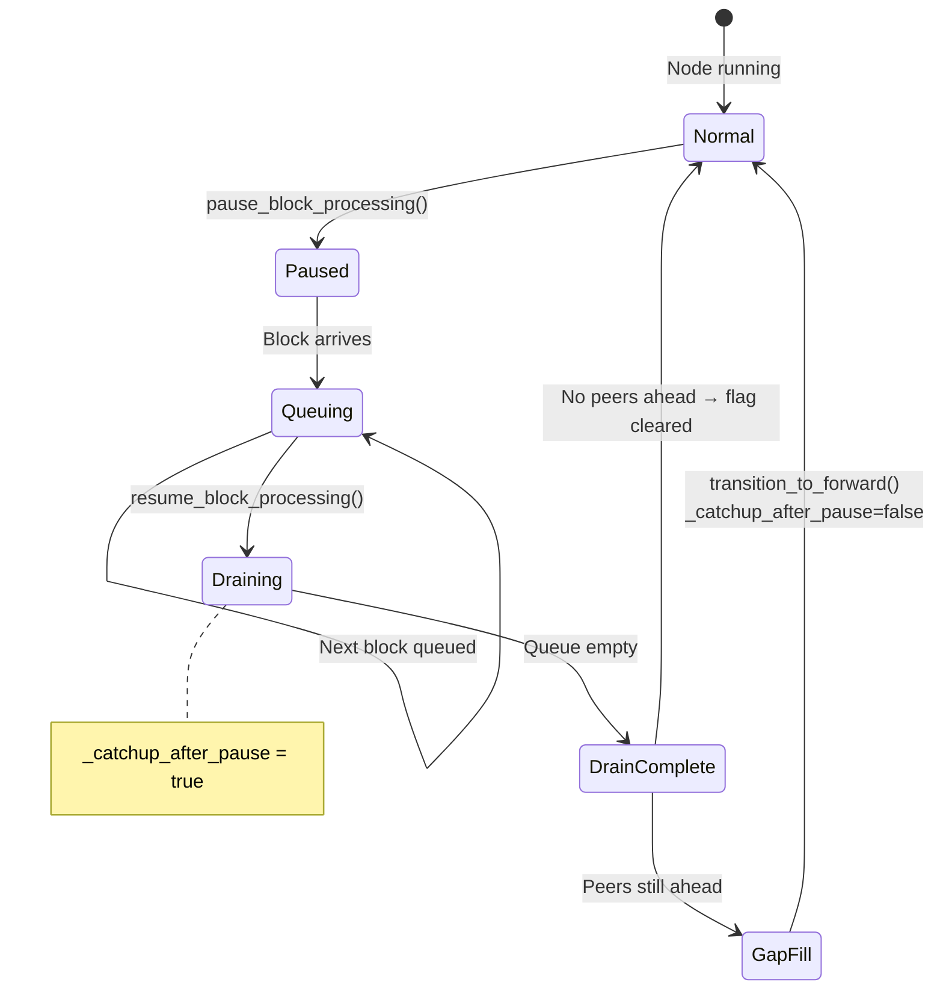

# Snapshot Pause Block Workflow

## Overview

When the snapshot plugin creates a snapshot, it **pauses P2P block processing** to
prevent concurrent database modifications.  During this pause, incoming blocks from
peers are **buffered in a queue** instead of being dropped.  After the pause ends,
the P2P layer drains the queue (applying all buffered blocks), then checks whether
peers are still ahead.  The witness plugin defers block production until all queued
blocks are applied and any remaining gap is filled.

## Sequence Diagram: Snapshot Pause Lifecycle



## Incoming Block Workflow (During Pause)



## Witness Production Workflow (With Catchup Gate)



## Post-Pause Catchup State Machine



## Key Files

| File | Role |
|------|------|
| `libraries/network/dlt_p2p_node.cpp` | P2P block reception, pause/resume, catchup flag |
| `libraries/network/include/graphene/network/dlt_p2p_node.hpp` | `_catchup_after_pause` flag and getter |
| `plugins/p2p/p2p_plugin.cpp` | Exposes `is_catching_up_after_pause()` to other plugins |
| `plugins/p2p/include/graphene/plugins/p2p/p2p_plugin.hpp` | Public API declaration |
| `plugins/witness/witness.cpp` | Production gate that checks catchup flag |
| `plugins/snapshot/plugin.cpp` | Calls `pause/resume_block_processing()` |

## The Bug (Before Fix)

Two interrelated bugs:

**Bug 1 — Write lock deadlock**: The emergency master's witness production loop
(250ms tick) bypasses all sync checks. During snapshot creation, the snapshot thread
holds a strong DB read lock for 30–120s. The production loop called `generate_block()`
→ `push_block()` → write lock → **deadlocked** behind the read lock, producing
11+ second write lock timeouts (readers=0, waiter spinning).

**Bug 2 — Fork on stale head**: Without the block queue, blocks arriving during the
pause were silently dropped. After resume, the emergency master produced a block on a
stale head before gap-fill could deliver the real blocks from delegates, creating a
fork that other nodes had to resolve.

Sequence:
1. Snapshot starts → P2P paused
2. Other delegates produce blocks N+1, N+2 → **dropped** by P2P
3. Emergency master production loop → `generate_block()` → **write lock timeout** (11s+)
4. Snapshot finishes → `resume_block_processing()` requests gap fill → returns immediately
5. Emergency master produces block N+1 with emergency key → **fork conflict**
6. Other nodes see two competing blocks → fork switch chaos

## The Fix

**Production gate during pause**: `is_catching_up_after_pause()` returns true when
either `_block_processing_paused` OR `_catchup_after_pause` is set. This prevents the
witness plugin from calling `generate_block()` while the snapshot holds the DB read
lock (avoids write-lock deadlock) AND during post-pause catchup (avoids stale-head fork).

**Block queue**: During the pause, block-carrying messages (block_reply, block_range_reply,
gap_fill_reply) are deserialized and pushed into `_paused_block_queue`. Hello and fork_status
messages are still processed normally to keep `peer_head_num` up to date.

**Queue drain**: When `resume_block_processing()` is called, it posts `drain_paused_block_queue()`
to the P2P thread. The drain sorts queued blocks by block_num, applies each via
`accept_block()`, and then checks whether peers are still ahead.

**Catchup flag lifecycle**: `_catchup_after_pause` is set when `resume_block_processing()`
runs and cleared when:
- The drain completes and no peer is ahead (immediate path), or
- `transition_to_forward()` runs after a SYNC gap fill (delayed path), or
- `periodic_task()` confirms no gap exists (5s fallback)

The witness plugin checks `is_catching_up_after_pause()` in `maybe_produce_block()` and
defers production while the flag is set.

---

## Bug 3 — currently_syncing not cleared on SYNC→FORWARD (p72, 570 s silence)

### Observed symptom

After a scheduled snapshot the node produced no blocks for **570 seconds** despite
`_catchup_after_pause` being cleared at 10:54:40.  WATCHDOG fired at 11:04:01 and
production resumed immediately after it called `chain.clear_syncing()`.

### Root cause

`currently_syncing` in the chain plugin (`plugin_impl::currently_syncing`) is set to
`true` by every `accept_block(sync_mode=true)` call — i.e. every block fetched during
SYNC mode.  It self-clears **only** when the next `accept_block(sync_mode=false)` runs
(the first FORWARD-mode block).

The chain of events in p72:

```
10:54:38  pause_block_processing()          _block_processing_paused=true
10:54:40  resume_block_processing()         _catchup_after_pause=true
10:54:40  drain_paused_block_queue()        sync_mode=false → currently_syncing=false ✓
10:54:40  drain: no peers ahead             _catchup_after_pause=false ✓
          ← at this point both flags are clear, production should resume

~10:54:41 periodic_task(): peers still ahead by 1-2 blocks
          check_forward_behind() → transition_to_sync()
          Fetch missing blocks: call_accept_block(sync_mode=true)
          → currently_syncing.store(true)
          Sync completes → transition_to_forward()
          → currently_syncing NOT cleared  ← BUG

10:54:41–11:04:01  witness loop:
          is_syncing()=true → return not_synced (rate-limited, silent)
          not_my_turn_streak stays at 0–2 (resets on not_synced)

11:04:01  WATCHDOG fires → chain.clear_syncing()
          → currently_syncing=false → production resumes
```

The circular deadlock: `currently_syncing=true` blocks our witnesses; our witnesses are
the only remaining producers; no FORWARD block arrives to self-clear the flag.

### Why the WATCHDOG evidence confirms this

- `slot_result=2` (`not_my_turn`) at watchdog time — just switched away from `not_synced`
- `not_my_turn_streak=2` — very short; had been returning `not_synced` (resets the streak)
  for almost all of the 570 s
- `prod=true`, `minority_recovering=false` — `_production_enabled` was fine; the block on
  `_catchup_after_pause` was gone; only `is_syncing()` was blocking production

### Fix

`clear_syncing()` added to `dlt_p2p_delegate` and called from `transition_to_forward()`
**before** the early-return guard, so it fires on every SYNC→FORWARD transition
(and is a no-op when `currently_syncing` is already false):

```cpp
// dlt_p2p_node.cpp — transition_to_forward()
if (_delegate) _delegate->clear_syncing();   // ← added
if (_node_status == DLT_NODE_STATUS_FORWARD) return;
```

`dlt_delegate::clear_syncing()` in `p2p_plugin.cpp` delegates to `chain.clear_syncing()`.

### Files changed

| File | Change |
|------|--------|
| `libraries/network/include/graphene/network/dlt_p2p_node.hpp` | `clear_syncing()` pure virtual in `dlt_p2p_delegate` |
| `plugins/p2p/p2p_plugin.cpp` | `dlt_delegate::clear_syncing()` → `chain.clear_syncing()` |
| `libraries/network/dlt_p2p_node.cpp` | `transition_to_forward()` calls `_delegate->clear_syncing()` |
