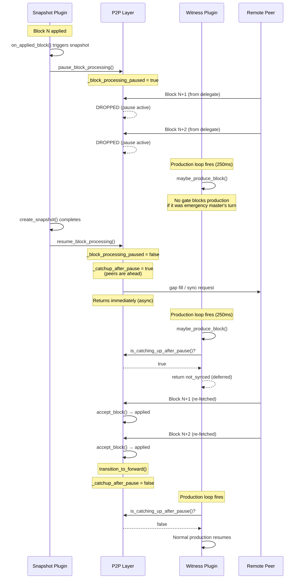
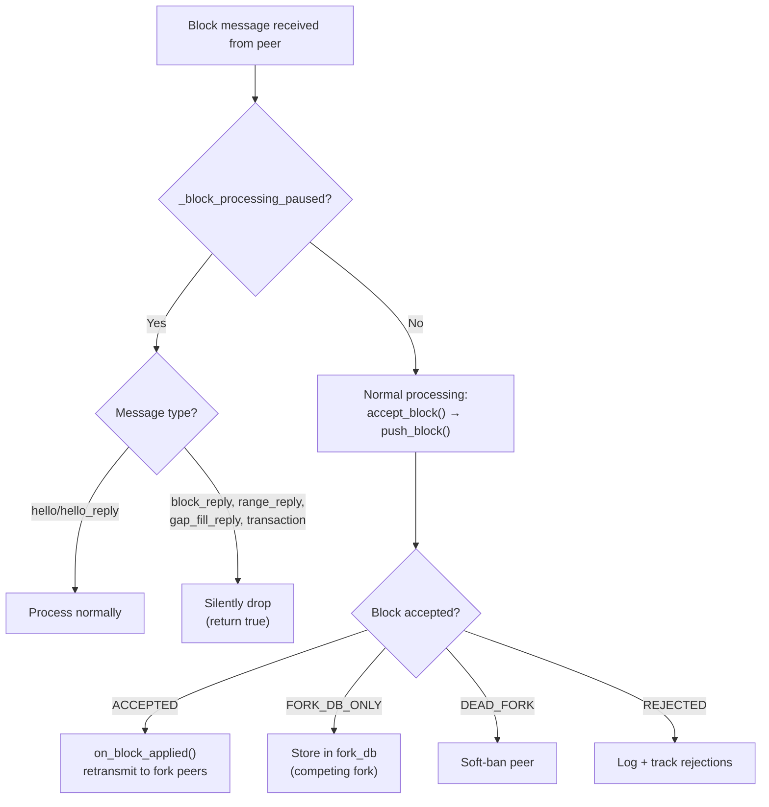
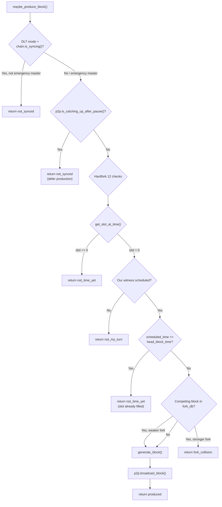
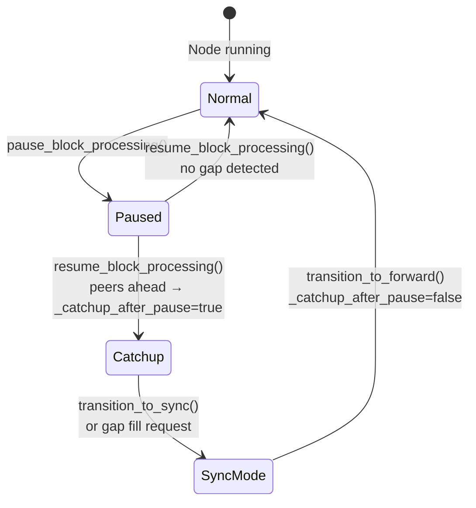

# Snapshot Pause Block Workflow

## Overview

When the snapshot plugin creates a snapshot, it **pauses P2P block processing** to
prevent concurrent database modifications.  During this pause, incoming blocks from
peers are **silently dropped** — they are not buffered.  After the pause ends, the
P2P layer detects the gap and fetches missing blocks from peers.  The witness plugin
must defer block production until the gap is filled to avoid producing competing
blocks on a stale head.

## Sequence Diagram: Snapshot Pause Lifecycle

## Incoming Block Workflow (During Pause)

## Witness Production Workflow (With Catchup Gate)

## Post-Pause Catchup State Machine

## Key Files

| File | Role |
|------|------|
| `libraries/network/dlt_p2p_node.cpp` | P2P block reception, pause/resume, catchup flag |
| `libraries/network/include/graphene/network/dlt_p2p_node.hpp` | `_catchup_after_pause` flag and getter |
| `plugins/p2p/p2p_plugin.cpp` | Exposes `is_catching_up_after_pause()` to other plugins |
| `plugins/p2p/include/graphene/plugins/p2p/p2p_plugin.hpp` | Public API declaration |
| `plugins/witness/witness.cpp` | Production gate that checks catchup flag |
| `plugins/snapshot/plugin.cpp` | Calls `pause/resume_block_processing()` |

## The Bug (Before Fix)

Without the catchup gate, the following race occurred on the emergency master:

1. Snapshot starts → P2P paused
2. Other delegates produce blocks N+1, N+2 → **dropped** by P2P
3. Snapshot finishes → `resume_block_processing()` requests gap fill → **returns immediately**
4. Witness production loop (250ms tick) → "My turn, fork_db empty at head+1" → **produces block N+1 with emergency key**
5. Gap fill response arrives with the real block N+1 from the delegate → **fork conflict**
6. Other nodes see two competing blocks → fork switch chaos

The fix adds a `_catchup_after_pause` flag that is set when `resume_block_processing()`
detects a gap, and cleared when `transition_to_forward()` confirms catchup.  The
witness plugin checks this flag before producing and defers if it is set.
