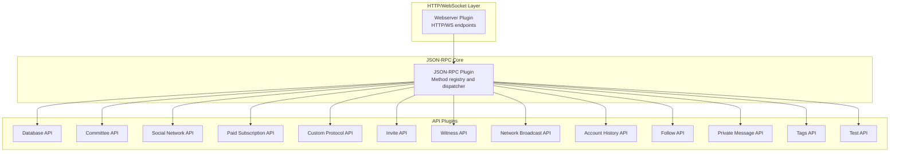
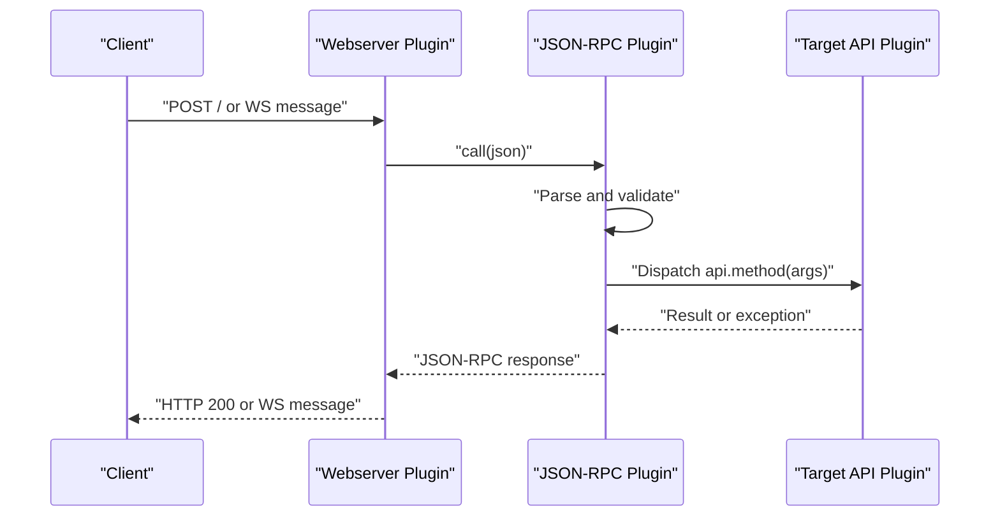
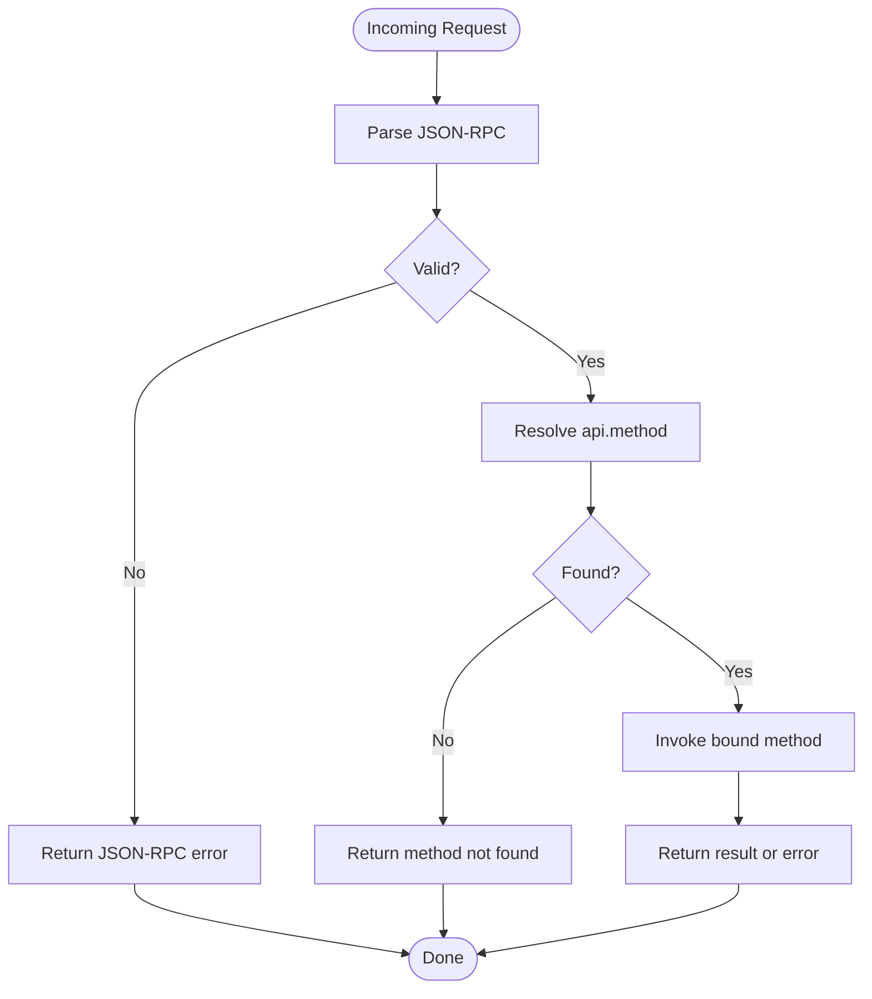
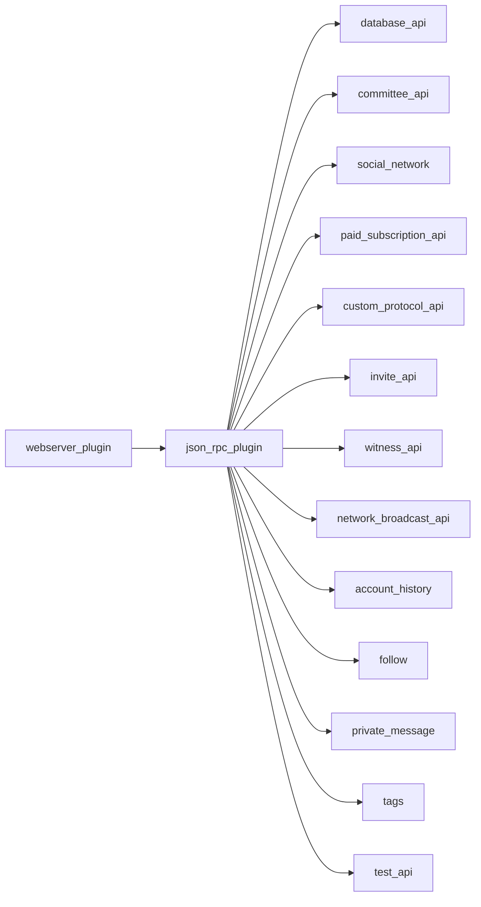

# API Reference

<cite>
**Referenced Files in This Document**
- [plugin.hpp](file://plugins/json_rpc/include/graphene/plugins/json_rpc/plugin.hpp)
- [plugin.cpp](file://plugins/json_rpc/plugin.cpp)
- [plugin.hpp](file://plugins/webserver/webserver_plugin.cpp)
- [plugin.hpp](file://plugins/database_api/include/graphene/plugins/database_api/plugin.hpp)
- [plugin.hpp](file://plugins/committee_api/include/graphene/plugins/committee_api/committee_api.hpp)
- [plugin.hpp](file://plugins/social_network/plugin.hpp)
- [plugin.hpp](file://plugins/paid_subscription_api/plugin.hpp)
- [plugin.hpp](file://plugins/custom_protocol_api/include/graphene/plugins/custom_protocol_api/custom_protocol_api.hpp)
- [plugin.hpp](file://plugins/invite_api/plugin.hpp)
- [plugin.hpp](file://plugins/witness_api/plugin.hpp)
- [plugin.hpp](file://plugins/network_broadcast_api/plugin.hpp)
- [plugin.hpp](file://plugins/account_history/plugin.hpp)
- [plugin.cpp](file://plugins/account_history/plugin.cpp)
- [history_object.hpp](file://plugins/account_history/include/graphene/plugins/account_history/history_object.hpp)
- [plugin.hpp](file://plugins/follow/plugin.hpp)
- [plugin.hpp](file://plugins/private_message/plugin.hpp)
- [plugin.hpp](file://plugins/tags/plugin.hpp)
- [plugin.hpp](file://plugins/test_api/plugin.hpp)
- [plugin.cpp](file://plugins/operation_history/plugin.cpp)
</cite>

## Update Summary
**Changes Made**
- Enhanced Account History API documentation with improved get_account_history method behavior
- Added detailed error handling documentation for edge cases
- Updated method parameter specifications and validation logic
- Improved documentation for account range tracking and sequence management
- Added practical examples for common API usage patterns

## Table of Contents
1. [Introduction](#introduction)
2. [Project Structure](#project-structure)
3. [Core Components](#core-components)
4. [Architecture Overview](#architecture-overview)
5. [Detailed Component Analysis](#detailed-component-analysis)
6. [Dependency Analysis](#dependency-analysis)
7. [Performance Considerations](#performance-considerations)
8. [Troubleshooting Guide](#troubleshooting-guide)
9. [Conclusion](#conclusion)
10. [Appendices](#appendices)

## Introduction
This document describes the VIZ CPP Node JSON-RPC API system. It covers the HTTP and WebSocket endpoints exposed by the node, the method registration mechanism, request/response schemas, error handling, and operational guidance. It also outlines the functional categories of APIs present in the codebase and provides practical usage patterns and integration notes.

## Project Structure
The JSON-RPC system is implemented as a plugin that registers API methods and dispatches requests. The webserver plugin exposes HTTP and WebSocket endpoints and forwards JSON-RPC requests to the JSON-RPC plugin. Other plugins register their own API methods under named namespaces.



**Diagram sources**
- [plugin.hpp](file://plugins/webserver/webserver_plugin.cpp#L112-L165)
- [plugin.cpp](file://plugins/json_rpc/plugin.cpp#L378-L395)
- [plugin.hpp](file://plugins/database_api/include/graphene/plugins/database_api/plugin.hpp#L179-L203)

**Section sources**
- [plugin.hpp](file://plugins/webserver/webserver_plugin.cpp#L254-L312)
- [plugin.cpp](file://plugins/json_rpc/plugin.cpp#L378-L423)

## Core Components
- JSON-RPC Plugin: Provides the method registry, dispatch logic, and response envelope. It supports batch requests and maintains method-to-plugin reindexing for compatibility.
- Webserver Plugin: Exposes HTTP and WebSocket endpoints. Routes inbound messages to the JSON-RPC plugin and returns responses.
- API Plugins: Each plugin registers its methods under a namespace (e.g., database_api, social_network, committee_api). Methods follow a consistent signature pattern and return structured results.

Key behaviors:
- Request envelope: Supports JSON-RPC 2.0 with id, method, and params.
- Method naming: api_name.method_name.
- Batch requests: Array of requests processed serially with ordered responses.
- Error codes: Standardized JSON-RPC error codes plus internal codes for parsing and dispatch failures.

**Section sources**
- [plugin.hpp](file://plugins/json_rpc/include/graphene/plugins/json_rpc/plugin.hpp#L46-L54)
- [plugin.cpp](file://plugins/json_rpc/plugin.cpp#L215-L256)
- [plugin.cpp](file://plugins/json_rpc/plugin.cpp#L402-L423)

## Architecture Overview
The runtime flow for HTTP and WebSocket requests:



**Diagram sources**
- [plugin.hpp](file://plugins/webserver/webserver_plugin.cpp#L216-L246)
- [plugin.cpp](file://plugins/json_rpc/plugin.cpp#L290-L336)

## Detailed Component Analysis

### HTTP Endpoints
- Endpoint: HTTP server configured via webserver plugin options.
- Method: POST with JSON body.
- Headers: Content-Type application/json.
- Body: Single JSON-RPC request or array of requests.
- Response: JSON object or array of JSON-RPC responses.

Operational notes:
- The webserver plugin resolves endpoints and starts listeners for HTTP and/or WebSocket.
- For HTTP, the request body is forwarded to the JSON-RPC plugin; the response is sent back immediately.

**Section sources**
- [plugin.hpp](file://plugins/webserver/webserver_plugin.cpp#L254-L312)
- [plugin.hpp](file://plugins/webserver/webserver_plugin.cpp#L216-L246)

### WebSocket Endpoints
- Endpoint: WebSocket server configured via webserver plugin options.
- Transport: Text frames carrying JSON-RPC messages.
- Behavior: Messages are processed asynchronously; responses are sent back on the same connection.

**Section sources**
- [plugin.hpp](file://plugins/webserver/webserver_plugin.cpp#L254-L312)
- [plugin.hpp](file://plugins/webserver/webserver_plugin.cpp#L192-L214)

### JSON-RPC Envelope and Errors
- Envelope fields:
  - jsonrpc: String "2.0".
  - id: Integer or string; optional for notifications.
  - method: String "api.method" or legacy "call" with params.
  - params: Optional array or object depending on method.
- Responses include:
  - result: Result object or array.
  - error: Object with code, message, and optional data.
  - id: Matches request id.

Standard error codes:
- Parse error, invalid request, method not found, invalid params, internal error, server error, no params, parse params error, error during call.

**Section sources**
- [plugin.cpp](file://plugins/json_rpc/plugin.cpp#L27-L32)
- [plugin.hpp](file://plugins/json_rpc/include/graphene/plugins/json_rpc/plugin.hpp#L46-L54)
- [plugin.cpp](file://plugins/json_rpc/plugin.cpp#L215-L256)

### Method Registration and Dispatch
- Registration: Plugins register methods via a macro-based API declaration and the JSON-RPC plugin's add_api_method.
- Dispatch: The dispatcher validates method names, extracts api_name and method_name, and invokes the bound method with a msg_pack carrying parsed arguments.
- Compatibility: A method reindex maps method names to parent plugins to support legacy calls.



**Diagram sources**
- [plugin.cpp](file://plugins/json_rpc/plugin.cpp#L180-L213)
- [plugin.cpp](file://plugins/json_rpc/plugin.cpp#L215-L256)

**Section sources**
- [plugin.hpp](file://plugins/json_rpc/include/graphene/plugins/json_rpc/plugin.hpp#L109-L113)
- [plugin.cpp](file://plugins/json_rpc/plugin.cpp#L159-L178)
- [plugin.cpp](file://plugins/json_rpc/plugin.cpp#L342-L357)

### Database API (Blockchain State Queries)
- Namespace: database_api
- Purpose: Read-only queries against the blockchain state.
- Typical methods (selected):
  - get_dynamic_global_properties
  - get_chain_properties
  - get_hardfork_version
  - get_block_header, get_block
  - get_irreversible_block_header, get_irreversible_block
  - lookup_account_names, lookup_accounts, get_account_count
  - get_vesting_delegations, get_expiring_vesting_delegations
  - get_transaction_hex, get_required_signatures, get_potential_signatures, verify_authority, verify_account_authority
  - get_database_info
  - get_proposed_transactions
  - get_accounts_on_sale, get_accounts_on_auction, get_subaccounts_on_sale
- Notes:
  - Many methods accept parameters; consult the API plugin header for exact signatures.
  - Subscriptions: set_block_applied_callback, set_pending_transaction_callback, cancel_all_subscriptions.

Example invocation pattern:
- HTTP: POST with {"jsonrpc":"2.0","id":1,"method":"database_api.get_dynamic_global_properties","params":[]}.
- WebSocket: Send the same JSON text frame.

**Section sources**
- [plugin.hpp](file://plugins/database_api/include/graphene/plugins/database_api/plugin.hpp#L137-L169)
- [plugin.hpp](file://plugins/database_api/include/graphene/plugins/database_api/plugin.hpp#L209-L226)

### Social Network APIs (Content and Interactions)
- Namespace: social_network
- Purpose: Content discovery, discussions, and social interactions.
- Typical methods (selected):
  - get_discussions_by_payout, get_post_discussions_by_payout
  - get_comment_discussions_by_payout
  - get_discussions_by_trending, get_discussions_by_created, get_discussions_by_votes
  - get_active_votes, get_account_votes
  - get_content_replies
  - get_follow_counts, get_followers_by_type, get_following_by_type
- Notes:
  - Methods commonly accept pagination and filtering parameters; refer to plugin header for exact signatures.

Example invocation pattern:
- HTTP: POST with {"jsonrpc":"2.0","id":1,"method":"social_network.get_discussions_by_trending","params":[...]}

**Section sources**
- [plugin.hpp](file://plugins/social_network/plugin.hpp)

### Governance APIs (Committee and Proposals)
- Namespace: committee_api
- Purpose: Committee-related operations and proposals.
- Typical methods (selected):
  - get_active_committee
  - get_proposal
  - get_proposals
- Notes:
  - Consult the plugin header for exact signatures and parameters.

Example invocation pattern:
- HTTP: POST with {"jsonrpc":"2.0","id":1,"method":"committee_api.get_active_committee","params":[]}

**Section sources**
- [plugin.hpp](file://plugins/committee_api/include/graphene/plugins/committee_api/committee_api.hpp)

### Custom Protocol APIs (Specialized Business Logic)
- Namespace: custom_protocol_api
- Purpose: Specialized operations defined by custom protocol extensions.
- Typical methods (selected):
  - get_custom_protocol_data
- Notes:
  - Consult the plugin header for exact signatures and parameters.

Example invocation pattern:
- HTTP: POST with {"jsonrpc":"2.0","id":1,"method":"custom_protocol_api.get_custom_protocol_data","params":[]}

**Section sources**
- [plugin.hpp](file://plugins/custom_protocol_api/include/graphene/plugins/custom_protocol_api/custom_protocol_api.hpp)

### Account History API (Enhanced)
- Namespace: account_history
- Purpose: Retrieve account operation history with enhanced error handling and edge case management.
- Method: get_account_history
- Parameters:
  - account: String - Account name to query history for
  - from: Integer - Absolute sequence number, where UINT32_MAX (-1) means most recent
  - limit: Integer - Maximum number of items to return (1-1000, inclusive)
- Return: Map of sequence numbers to operation objects
- Enhanced Features:
  - Improved error handling for edge cases
  - Better parameter validation with clear error messages
  - Account range tracking to prevent searching unavailable sequences
  - Enhanced documentation for method behavior

**Updated** Enhanced get_account_history method with improved error handling and edge case management

**Section sources**
- [plugin.hpp](file://plugins/account_history/plugin.hpp#L83-L92)
- [plugin.cpp](file://plugins/account_history/plugin.cpp#L186-L234)
- [history_object.hpp](file://plugins/account_history/include/graphene/plugins/account_history/history_object.hpp#L44-L119)

### Additional API Categories
- Paid Subscription API: Namespace paid_subscription_api
- Invite API: Namespace invite_api
- Witness API: Namespace witness_api
- Network Broadcast API: Namespace network_broadcast_api
- Follow API: Namespace follow
- Private Message API: Namespace private_message
- Tags API: Namespace tags
- Test API: Namespace test_api

Notes:
- Each API is implemented by its respective plugin and registered with the JSON-RPC plugin.
- Invocation follows the same JSON-RPC envelope and method naming scheme.

**Section sources**
- [plugin.hpp](file://plugins/paid_subscription_api/plugin.hpp)
- [plugin.hpp](file://plugins/invite_api/plugin.hpp)
- [plugin.hpp](file://plugins/witness_api/plugin.hpp)
- [plugin.hpp](file://plugins/network_broadcast_api/plugin.hpp)
- [plugin.hpp](file://plugins/follow/plugin.hpp)
- [plugin.hpp](file://plugins/private_message/plugin.hpp)
- [plugin.hpp](file://plugins/tags/plugin.hpp)
- [plugin.hpp](file://plugins/test_api/plugin.hpp)

## Dependency Analysis
- The webserver plugin depends on the JSON-RPC plugin to process requests.
- The JSON-RPC plugin depends on appbase and maintains a registry of api_name.method_name to bound methods.
- API plugins depend on the JSON-RPC plugin to register their methods.



**Diagram sources**
- [plugin.hpp](file://plugins/webserver/webserver_plugin.cpp#L314-L327)
- [plugin.cpp](file://plugins/json_rpc/plugin.cpp#L378-L395)

**Section sources**
- [plugin.hpp](file://plugins/webserver/webserver_plugin.cpp#L314-L327)
- [plugin.cpp](file://plugins/json_rpc/plugin.cpp#L378-L400)

## Performance Considerations
- Thread pool sizing: Configure the webserver thread pool to match workload characteristics.
- Batch requests: Submit multiple requests in a single HTTP call to reduce overhead.
- Subscriptions: Use callbacks judiciously; they can increase memory and CPU usage.
- Rate limiting: Apply external rate limiting at the reverse proxy or load balancer level if needed.
- Account history limits: The get_account_history method enforces a maximum limit of 1000 operations to prevent excessive resource consumption.

## Troubleshooting Guide
Common issues and resolutions:
- Invalid JSON-RPC envelope: Ensure jsonrpc equals "2.0", id is integer or string, and method is present.
- Method not found: Verify api_name.method_name exists and the plugin is loaded.
- Invalid params: Check parameter types and presence according to the method signature.
- Server errors: Inspect logs for exceptions and stack traces.
- Account history errors: Common errors include account not found in history index, from sequence out of range, and limit exceeded.

**Updated** Enhanced error handling for account history API with specific error messages for edge cases

Error handling behavior:
- Parsing and dispatch errors return standardized JSON-RPC error objects.
- Exceptions thrown by API methods are captured and mapped to server errors with optional data.
- Account history API provides specific error messages for parameter validation failures.

**Section sources**
- [plugin.cpp](file://plugins/json_rpc/plugin.cpp#L290-L311)
- [plugin.cpp](file://plugins/json_rpc/plugin.cpp#L114-L136)
- [plugin.cpp](file://plugins/account_history/plugin.cpp#L194-L202)

## Conclusion
The VIZ CPP Node exposes a robust JSON-RPC interface via HTTP and WebSocket, backed by a modular plugin architecture. API plugins register methods under distinct namespaces, enabling clear separation of concerns. The Account History API has been enhanced with improved error handling, better parameter validation, and enhanced documentation for edge cases. By following the documented envelopes, method naming, and error handling patterns, clients can reliably integrate with the node for blockchain state queries, social interactions, governance operations, and specialized protocols.

## Appendices

### Practical Usage Patterns
- HTTP GET/POST: Use POST with application/json and a JSON-RPC envelope.
- WebSocket: Send text frames with JSON-RPC envelopes; subscribe to block or transaction callbacks if needed.
- Batch: Send an array of requests; receive an array of responses in order.
- Account History: Use get_account_history with proper parameter validation and error handling.

### Migration and Backwards Compatibility
- Legacy call: The "call" method remains supported for backward compatibility; prefer explicit "api.method" calls.
- Method reindex: Some methods are remapped to parent plugins; ensure your client handles reindexing if you rely on legacy names.
- Account History: The enhanced get_account_history method maintains backward compatibility while providing improved error handling.

**Section sources**
- [plugin.cpp](file://plugins/json_rpc/plugin.cpp#L235-L236)
- [plugin.cpp](file://plugins/json_rpc/plugin.cpp#L342-L357)
- [plugin.cpp](file://plugins/account_history/plugin.cpp#L186-L234)

### Account History API Examples
Common usage patterns for the enhanced get_account_history method:

**Get latest operations for an account:**
```json
{
  "jsonrpc": "2.0",
  "id": 1,
  "method": "account_history.get_account_history",
  "params": ["useraccount", 4294967295, 100]
}
```

**Get operations from a specific sequence:**
```json
{
  "jsonrpc": "2.0",
  "id": 1,
  "method": "account_history.get_account_history",
  "params": ["useraccount", 1000, 50]
}
```

**Error handling examples:**
- Account not found in history index: "Account not found in history index, it may have been purged since the last ${b} blocks are stored in the history"
- From sequence out of range: "From is less than account history start sequence ${s}" or "From is greater than account history end sequence ${s}"
- Limit exceeded: "Limit of ${l} is greater than maximum allowed (1000)"

**Section sources**
- [plugin.cpp](file://plugins/account_history/plugin.cpp#L186-L234)
- [plugin.cpp](file://plugins/account_history/plugin.cpp#L194-L202)