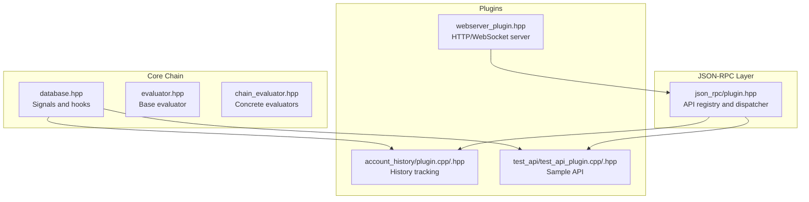
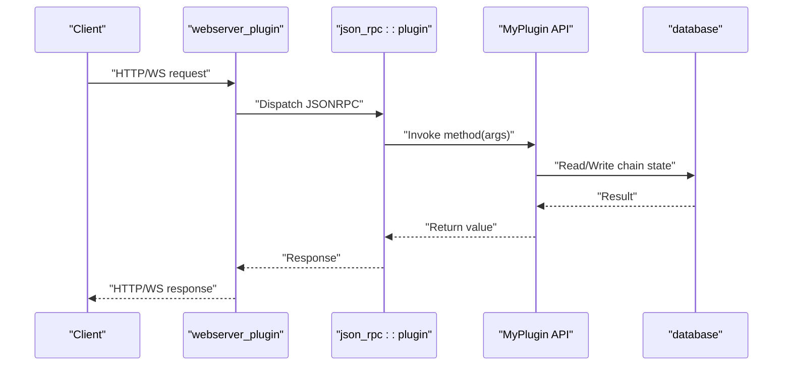
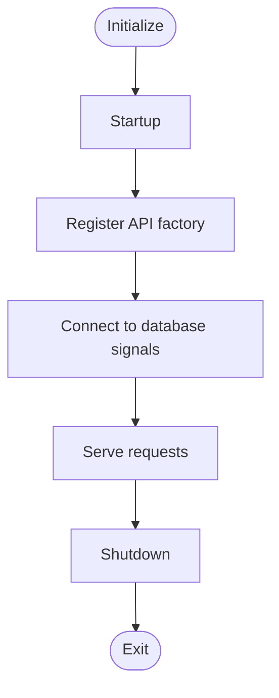
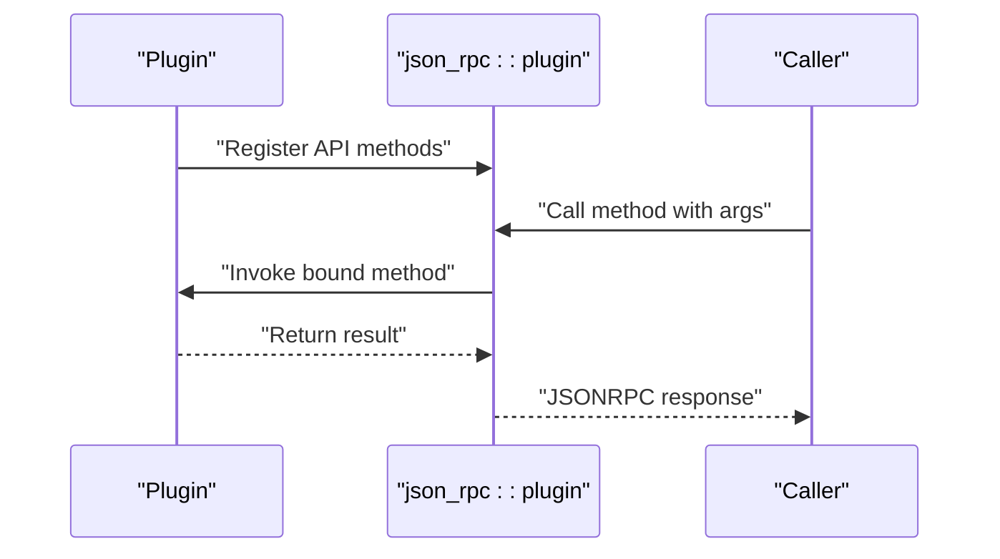
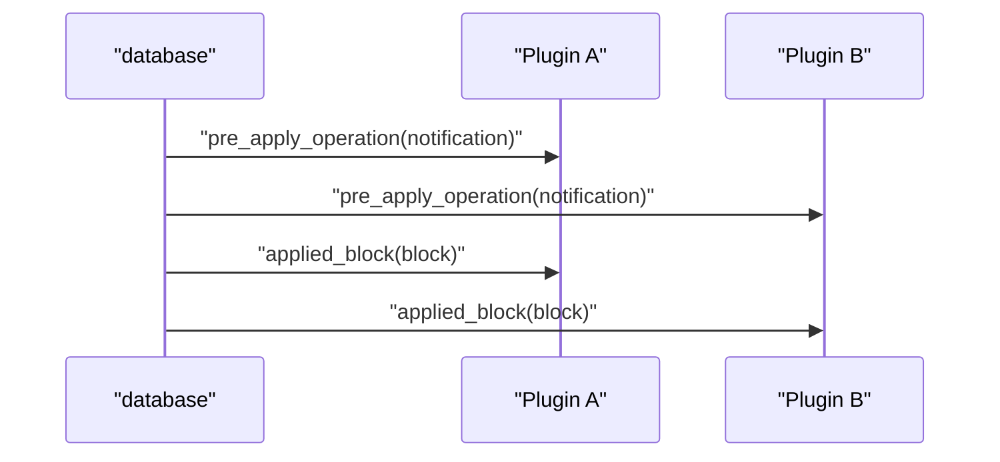
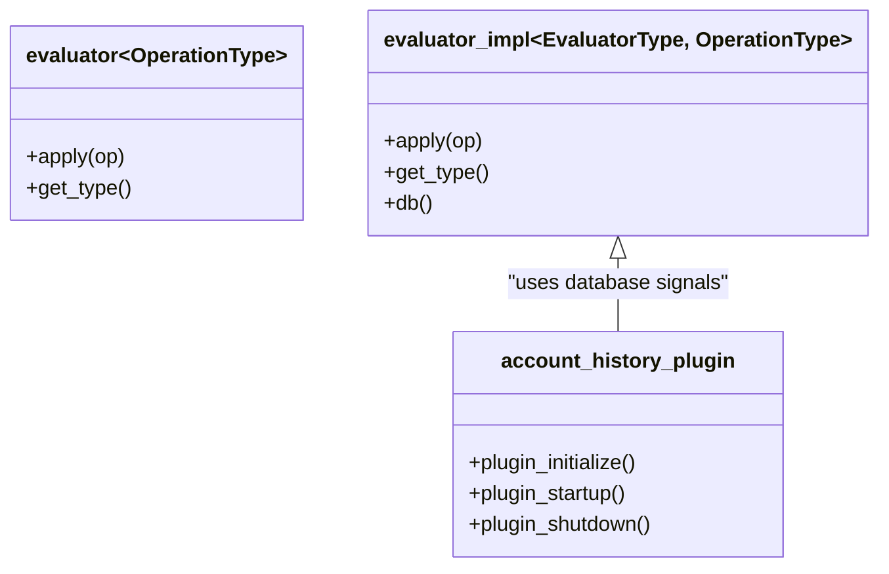
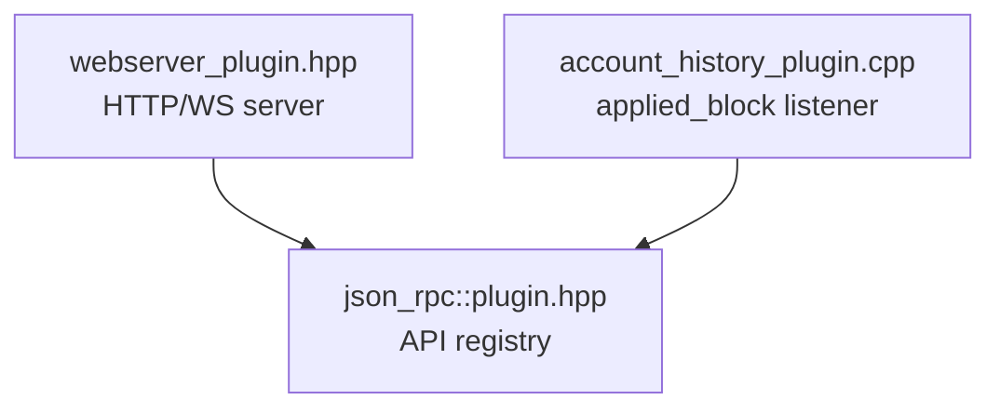
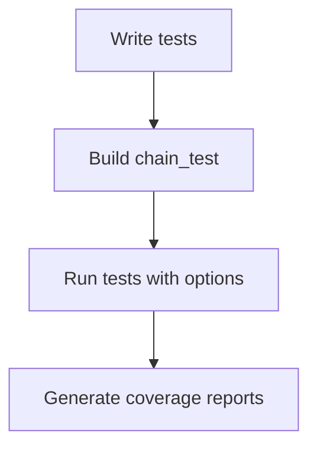
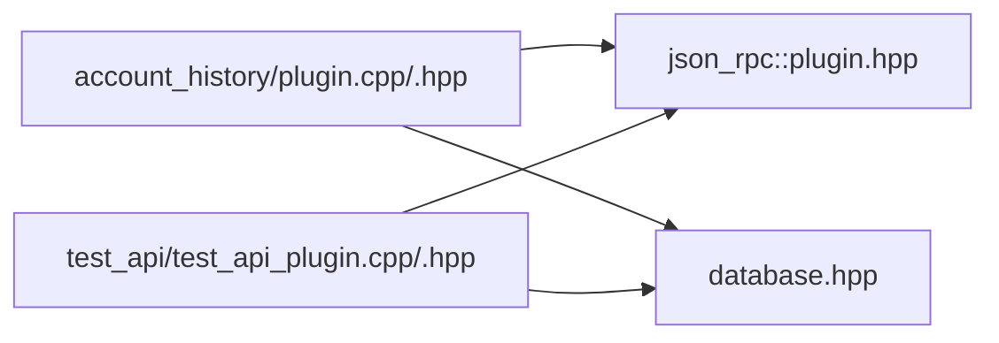

# Advanced Plugin Development

<cite>
**Referenced Files in This Document**
- [plugin.md](file://documentation/plugin.md)
- [debug_node_plugin.md](file://documentation/debug_node_plugin.md)
- [testing.md](file://documentation/testing.md)
- [building.md](file://documentation/building.md)
- [newplugin.py](file://programs/util/newplugin.py)
- [evaluator.hpp](file://libraries/chain/include/graphene/chain/evaluator.hpp)
- [chain_evaluator.hpp](file://libraries/chain/include/graphene/chain/chain_evaluator.hpp)
- [database.hpp](file://libraries/chain/include/graphene/chain/database.hpp)
- [plugin.hpp](file://plugins/json_rpc/include/graphene/plugins/json_rpc/plugin.hpp)
- [webserver_plugin.hpp](file://plugins/webserver/include/graphene/plugins/webserver/webserver_plugin.hpp)
- [account_history_plugin.hpp](file://plugins/account_history/include/graphene/plugins/account_history/plugin.hpp)
- [account_history_plugin.cpp](file://plugins/account_history/plugin.cpp)
- [test_api_plugin.hpp](file://plugins/test_api/include/graphene/plugins/test_api/test_api_plugin.hpp)
- [test_api_plugin.cpp](file://plugins/test_api/test_api_plugin.cpp)
</cite>

## Table of Contents
1. [Introduction](#introduction)
2. [Project Structure](#project-structure)
3. [Core Components](#core-components)
4. [Architecture Overview](#architecture-overview)
5. [Detailed Component Analysis](#detailed-component-analysis)
6. [Dependency Analysis](#dependency-analysis)
7. [Performance Considerations](#performance-considerations)
8. [Troubleshooting Guide](#troubleshooting-guide)
9. [Conclusion](#conclusion)
10. [Appendices](#appendices)

## Introduction
This document provides advanced guidance for developing plugins for the VIZ C++ Node. It covers plugin architecture patterns, lifecycle management, integration with the core system, advanced development techniques (custom evaluators, database object extensions, inter-plugin communication), testing strategies, performance optimization, deployment, and troubleshooting. The content is grounded in the repository’s plugin framework, JSON-RPC API binding, evaluator system, and existing plugin implementations.

## Project Structure
The plugin ecosystem is organized around a modular architecture:
- Core chain and protocol abstractions define operations, evaluators, and database signals.
- The JSON-RPC plugin provides a dispatch mechanism for API registration and invocation.
- Individual plugins implement domain-specific logic, register APIs, and subscribe to chain/database events.
- A scaffolding script automates boilerplate generation for new plugins.

**Diagram sources**
- [database.hpp](file://libraries/chain/include/graphene/chain/database.hpp#L252-L286)
- [evaluator.hpp](file://libraries/chain/include/graphene/chain/evaluator.hpp#L11-L45)
- [chain_evaluator.hpp](file://libraries/chain/include/graphene/chain/chain_evaluator.hpp#L14-L79)
- [plugin.hpp](file://plugins/json_rpc/include/graphene/plugins/json_rpc/plugin.hpp#L84-L118)
- [account_history_plugin.cpp](file://plugins/account_history/plugin.cpp#L471-L501)
- [test_api_plugin.cpp](file://plugins/test_api/test_api_plugin.cpp#L15-L23)
- [webserver_plugin.hpp](file://plugins/webserver/include/graphene/plugins/webserver/webserver_plugin.hpp#L32-L57)

**Section sources**
- [plugin.md](file://documentation/plugin.md#L1-L28)
- [building.md](file://documentation/building.md#L1-L200)

## Core Components
- Application base and plugin lifecycle: Plugins derive from the application base plugin interface and implement initialize/startup/shutdown hooks. They register API factories and connect to database signals.
- JSON-RPC API binding: The JSON-RPC plugin maintains a registry of API methods and dispatches incoming requests. Plugins register their methods via a macro-driven visitor pattern.
- Chain/database integration: Plugins subscribe to database signals (e.g., applied_block, pre_apply_operation, on_applied_transaction) to react to chain events.
- Scaffolding tool: The new plugin generator produces boilerplate for plugin headers, implementation, API classes, and CMake configuration.

Key implementation references:
- Plugin lifecycle and API registration in a typical plugin implementation.
- JSON-RPC API registration and method dispatch.
- Database signals used by plugins to observe chain activity.
- Scaffolding script for generating plugin boilerplate.

**Section sources**
- [account_history_plugin.hpp](file://plugins/account_history/include/graphene/plugins/account_history/plugin.hpp#L59-L97)
- [account_history_plugin.cpp](file://plugins/account_history/plugin.cpp#L471-L501)
- [test_api_plugin.cpp](file://plugins/test_api/test_api_plugin.cpp#L15-L23)
- [plugin.hpp](file://plugins/json_rpc/include/graphene/plugins/json_rpc/plugin.hpp#L84-L118)
- [database.hpp](file://libraries/chain/include/graphene/chain/database.hpp#L252-L286)
- [newplugin.py](file://programs/util/newplugin.py#L126-L217)

## Architecture Overview
The plugin architecture centers on:
- A plugin base class exposing lifecycle hooks.
- A JSON-RPC plugin that binds API names to method implementations.
- A chain database that emits signals plugins can subscribe to.
- Optional webserver plugin to expose HTTP/WS endpoints.

**Diagram sources**
- [webserver_plugin.hpp](file://plugins/webserver/include/graphene/plugins/webserver/webserver_plugin.hpp#L32-L57)
- [plugin.hpp](file://plugins/json_rpc/include/graphene/plugins/json_rpc/plugin.hpp#L84-L118)
- [account_history_plugin.cpp](file://plugins/account_history/plugin.cpp#L185-L194)
- [database.hpp](file://libraries/chain/include/graphene/chain/database.hpp#L252-L286)

## Detailed Component Analysis

### Plugin Lifecycle and Registration Patterns
- Lifecycle: initialize → startup → shutdown. During startup, plugins typically register API factories and connect to database signals.
- Registration: Plugins register APIs via a macro-driven visitor that iterates over declared methods and registers them with the JSON-RPC plugin.
- Example patterns:
  - Connect to applied_block to react to new blocks.
  - Use weak read locks when querying the database from API methods to avoid contention.
  - Add plugin-specific indices to the database for efficient lookups.

**Diagram sources**
- [account_history_plugin.cpp](file://plugins/account_history/plugin.cpp#L471-L501)
- [account_history_plugin.cpp](file://plugins/account_history/plugin.cpp#L185-L194)
- [database.hpp](file://libraries/chain/include/graphene/chain/database.hpp#L252-L286)

**Section sources**
- [account_history_plugin.cpp](file://plugins/account_history/plugin.cpp#L471-L501)
- [account_history_plugin.cpp](file://plugins/account_history/plugin.cpp#L185-L194)
- [plugin.md](file://documentation/plugin.md#L11-L28)

### JSON-RPC API Binding and Invocation
- API registration: Plugins declare API methods and use a macro to register them with the JSON-RPC plugin. The macro expands to a visitor that binds method names to callable lambdas.
- Dispatch: The JSON-RPC plugin stores method descriptors and invokes bound methods with parsed arguments.
- Argument/result types: Methods accept a single argument struct and return a single result struct; void methods use a dedicated type.

**Diagram sources**
- [plugin.hpp](file://plugins/json_rpc/include/graphene/plugins/json_rpc/plugin.hpp#L84-L118)
- [plugin.hpp](file://plugins/json_rpc/include/graphene/plugins/json_rpc/plugin.hpp#L121-L140)
- [test_api_plugin.cpp](file://plugins/test_api/test_api_plugin.cpp#L25-L35)

**Section sources**
- [plugin.hpp](file://plugins/json_rpc/include/graphene/plugins/json_rpc/plugin.hpp#L84-L118)
- [test_api_plugin.hpp](file://plugins/test_api/include/graphene/plugins/test_api/test_api_plugin.hpp#L27-L53)
- [test_api_plugin.cpp](file://plugins/test_api/test_api_plugin.cpp#L25-L35)

### Database Signals and Inter-Plugin Communication
- Signals: The database emits signals for pre/post operation application, applied blocks, and transaction events. Plugins can subscribe to these signals to implement cross-cutting concerns.
- Inter-plugin coordination: Plugins can communicate indirectly by observing each other’s operations via signals and shared indices.

**Diagram sources**
- [database.hpp](file://libraries/chain/include/graphene/chain/database.hpp#L252-L286)
- [account_history_plugin.cpp](file://plugins/account_history/plugin.cpp#L487-L489)

**Section sources**
- [database.hpp](file://libraries/chain/include/graphene/chain/database.hpp#L252-L286)
- [account_history_plugin.cpp](file://plugins/account_history/plugin.cpp#L487-L489)

### Custom Evaluators and Database Object Extensions
- Evaluators: Operations are validated and applied by evaluators. The evaluator base defines apply/get_type, and concrete evaluators implement do_apply.
- Custom operation interpreter: The database supports registering custom operation interpreters to extend the evaluator registry for custom operations.
- Extension patterns: Plugins can add new indices to the database to support efficient queries for custom data.

**Diagram sources**
- [evaluator.hpp](file://libraries/chain/include/graphene/chain/evaluator.hpp#L11-L45)
- [chain_evaluator.hpp](file://libraries/chain/include/graphene/chain/chain_evaluator.hpp#L14-L79)
- [database.hpp](file://libraries/chain/include/graphene/chain/database.hpp#L407-L410)
- [account_history_plugin.cpp](file://plugins/account_history/plugin.cpp#L471-L501)

**Section sources**
- [evaluator.hpp](file://libraries/chain/include/graphene/chain/evaluator.hpp#L11-L45)
- [chain_evaluator.hpp](file://libraries/chain/include/graphene/chain/chain_evaluator.hpp#L14-L79)
- [database.hpp](file://libraries/chain/include/graphene/chain/database.hpp#L407-L410)

### Webserver and Real-Time Event Handling
- Webserver plugin: Provides HTTP/WS endpoints and runs its own io_service thread to isolate request handling from the main application thread.
- Real-time events: Plugins can emit notifications via database signals; the webserver can expose these via WebSocket endpoints (pattern demonstrated by the webserver plugin).

**Diagram sources**
- [webserver_plugin.hpp](file://plugins/webserver/include/graphene/plugins/webserver/webserver_plugin.hpp#L32-L57)
- [plugin.hpp](file://plugins/json_rpc/include/graphene/plugins/json_rpc/plugin.hpp#L84-L118)
- [account_history_plugin.cpp](file://plugins/account_history/plugin.cpp#L471-L501)

**Section sources**
- [webserver_plugin.hpp](file://plugins/webserver/include/graphene/plugins/webserver/webserver_plugin.hpp#L32-L57)

### Asynchronous Processing and Threading Model
- Threading: The webserver plugin runs its own io_service thread to avoid blocking the main application thread. Callbacks can be posted to the HTTP thread from any thread.
- Asynchronous patterns: Plugins should avoid heavy work in signal handlers; queue tasks to background threads or use async I/O where appropriate.

**Section sources**
- [webserver_plugin.hpp](file://plugins/webserver/include/graphene/plugins/webserver/webserver_plugin.hpp#L19-L31)

### Plugin Testing Framework
- Unit tests: Build targets include a chain test executable. Tests are categorized by functionality (basic, block, operation, serialization, etc.).
- Runtime configuration: Test harness supports log level, report level, and selective test execution via runtime options.
- Coverage: Code coverage can be captured using lcov with Debug builds and the coverage flag.

**Diagram sources**
- [testing.md](file://documentation/testing.md#L1-L43)

**Section sources**
- [testing.md](file://documentation/testing.md#L1-L43)

### Deployment and Distribution
- Enabling plugins: Use configuration options to enable plugins and public APIs. Some plugins require replaying the chain when enabling/disabling.
- Public APIs: Configure which APIs are exposed publicly and protect sensitive endpoints.
- Packaging: Drop third-party plugins into the external plugins directory; CMake aggregates internal plugins and builds them automatically.

**Section sources**
- [plugin.md](file://documentation/plugin.md#L11-L28)

## Dependency Analysis
Plugins declare dependencies on other plugins and the chain database. The JSON-RPC plugin is often a dependency for API-enabled plugins. The application base manages plugin initialization order and dependency resolution.

**Diagram sources**
- [account_history_plugin.hpp](file://plugins/account_history/include/graphene/plugins/account_history/plugin.hpp#L61-L65)
- [test_api_plugin.hpp](file://plugins/test_api/include/graphene/plugins/test_api/test_api_plugin.hpp#L35)
- [plugin.hpp](file://plugins/json_rpc/include/graphene/plugins/json_rpc/plugin.hpp#L84-L118)
- [database.hpp](file://libraries/chain/include/graphene/chain/database.hpp#L252-L286)

**Section sources**
- [account_history_plugin.hpp](file://plugins/account_history/include/graphene/plugins/account_history/plugin.hpp#L61-L65)
- [test_api_plugin.hpp](file://plugins/test_api/include/graphene/plugins/test_api/test_api_plugin.hpp#L35)

## Performance Considerations
- Memory management: Use weak read locks when querying the database from API methods to minimize contention. Avoid long-running operations in signal handlers.
- Caching: Maintain in-memory caches for hot paths; invalidate on applied_block or relevant signals.
- Resource utilization: Prefer streaming or paginated queries for large datasets. Limit batch sizes and use database indices added by plugins.
- Concurrency: Offload CPU-intensive tasks to background threads; use async I/O in the webserver plugin to keep the main thread responsive.

[No sources needed since this section provides general guidance]

## Troubleshooting Guide
- Debugging: Use the debug_node plugin to simulate chain state changes and test plugin behavior under controlled scenarios. Bind RPC to localhost and restrict public API exposure when using debug APIs.
- Logging: Adjust log levels and test report levels to gather more details during failures.
- Signal handling: Verify that plugins connect to the correct signals and handle errors gracefully without deadlocking the chain.

**Section sources**
- [debug_node_plugin.md](file://documentation/debug_node_plugin.md#L50-L134)
- [testing.md](file://documentation/testing.md#L16-L23)

## Conclusion
The VIZ C++ Node provides a robust, extensible plugin architecture. By leveraging the JSON-RPC API binding, database signals, and scaffolding tools, developers can implement advanced plugins ranging from custom APIs to deep chain integrations. Following the lifecycle patterns, performance guidelines, and testing strategies outlined here will help ensure reliable, maintainable, and high-performance plugins.

[No sources needed since this section summarizes without analyzing specific files]

## Appendices

### Practical Examples Index
- Custom validator: Implement an evaluator for a custom operation and register it via the custom operation interpreter.
- Specialized API: Use the scaffolding tool to generate a plugin, add API methods, and register them with the JSON-RPC plugin.
- System integration: Subscribe to applied_block and pre_apply_operation signals to mirror chain state to external systems.

**Section sources**
- [newplugin.py](file://programs/util/newplugin.py#L126-L217)
- [database.hpp](file://libraries/chain/include/graphene/chain/database.hpp#L252-L286)
- [plugin.hpp](file://plugins/json_rpc/include/graphene/plugins/json_rpc/plugin.hpp#L84-L118)