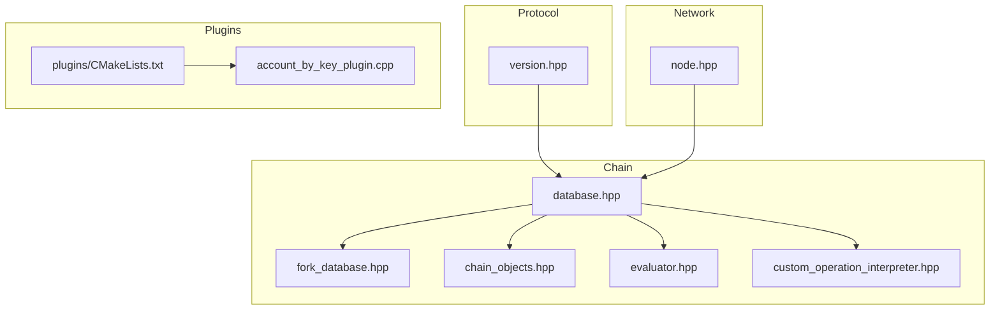
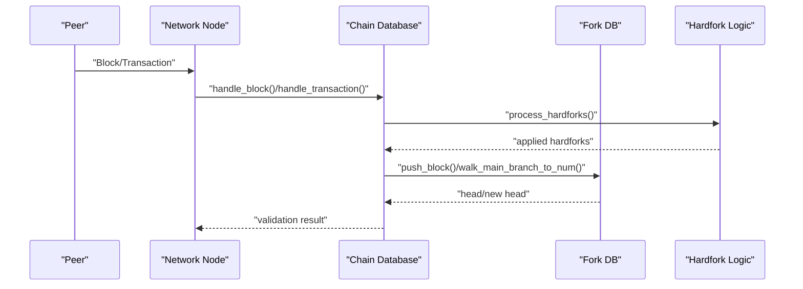
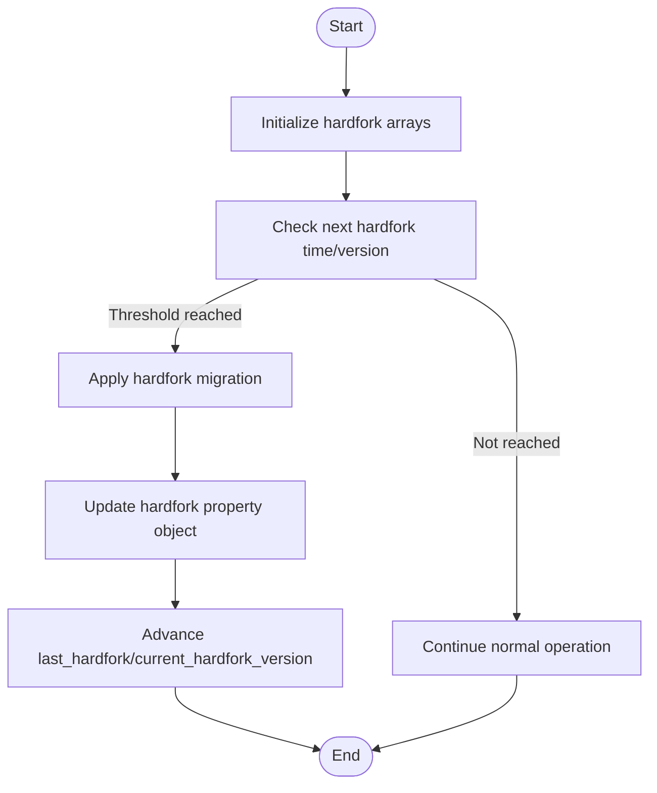
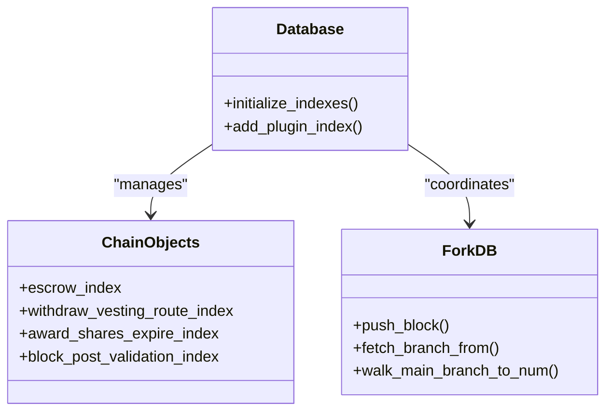
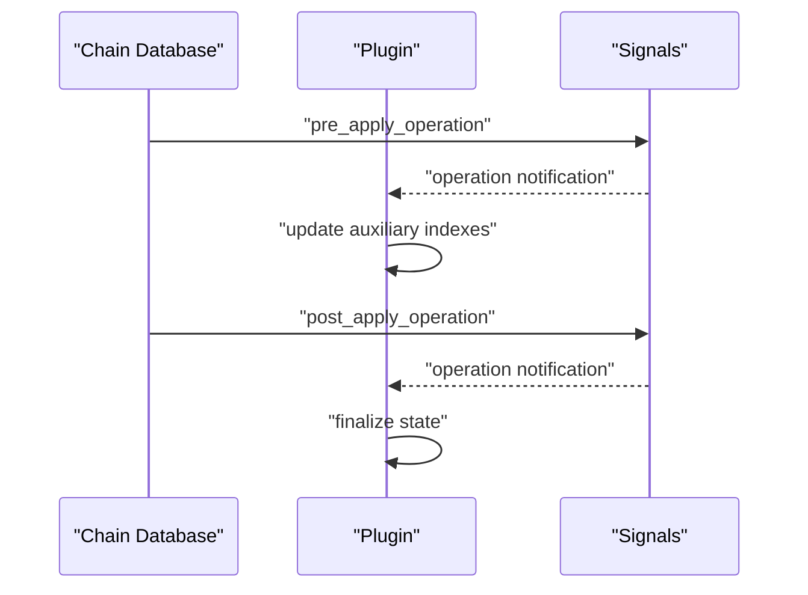
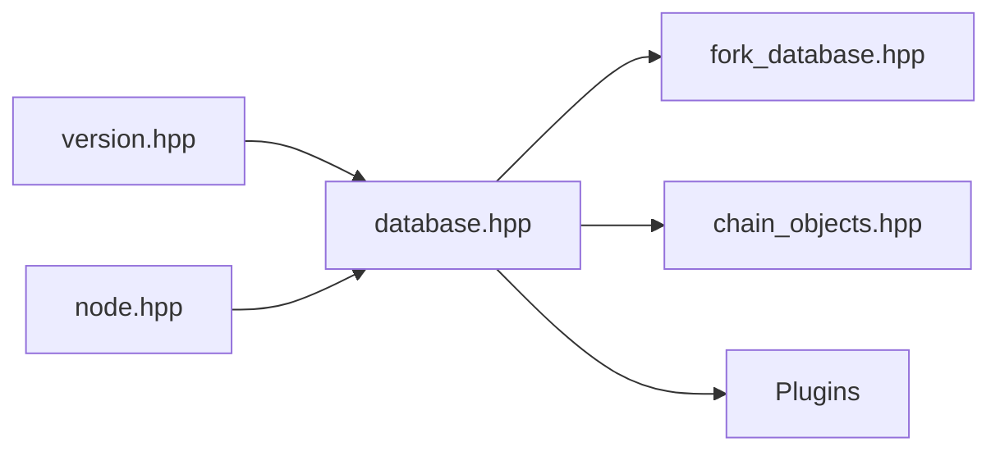

# Advanced Topics

<cite>
**Referenced Files in This Document**
- [fork_database.hpp](file://libraries/chain/include/graphene/chain/fork_database.hpp)
- [database.hpp](file://libraries/chain/include/graphene/chain/database.hpp)
- [0-preamble.hf](file://libraries/chain/hardfork.d/0-preamble.hf)
- [1.hf](file://libraries/chain/hardfork.d/1.hf)
- [10.hf](file://libraries/chain/hardfork.d/10.hf)
- [11.hf](file://libraries/chain/hardfork.d/11.hf)
- [node.hpp](file://libraries/network/include/graphene/network/node.hpp)
- [CMakeLists.txt](file://plugins/CMakeLists.txt)
- [custom_operation_interpreter.hpp](file://libraries/chain/include/graphene/chain/custom_operation_interpreter.hpp)
- [evaluator.hpp](file://libraries/chain/include/graphene/chain/evaluator.hpp)
- [version.hpp](file://libraries/protocol/include/graphene/protocol/version.hpp)
- [chain_objects.hpp](file://libraries/chain/include/graphene/chain/chain_objects.hpp)
- [account_by_key_plugin.cpp](file://plugins/account_by_key/account_by_key_plugin.cpp)
</cite>

## Table of Contents
1. [Introduction](#introduction)
2. [Project Structure](#project-structure)
3. [Core Components](#core-components)
4. [Architecture Overview](#architecture-overview)
5. [Detailed Component Analysis](#detailed-component-analysis)
6. [Dependency Analysis](#dependency-analysis)
7. [Performance Considerations](#performance-considerations)
8. [Troubleshooting Guide](#troubleshooting-guide)
9. [Conclusion](#conclusion)
10. [Appendices](#appendices)

## Introduction
This document provides expert-level guidance on advanced topics for the VIZ CPP Node, focusing on hardfork implementation and management, database schema design and optimization, security considerations and vulnerability assessment, and advanced plugin development patterns. It synthesizes the codebase’s hardfork system, fork database, chain database, network node, plugin framework, and protocol versioning to deliver practical, code-backed advice for extending core functionality and integrating with external systems.

## Project Structure
The VIZ CPP Node is organized around a layered architecture:
- Protocol: Versioning, operations, and core types
- Chain: Block processing, database, fork database, evaluators, and object schemas
- Network: Peer-to-peer node and message handling
- Plugins: Modular extensions exposing APIs and specialized indexes
- Programs: Executables and utilities

**Diagram sources**
- [version.hpp](file://libraries/protocol/include/graphene/protocol/version.hpp#L1-L156)
- [database.hpp](file://libraries/chain/include/graphene/chain/database.hpp#L1-L561)
- [fork_database.hpp](file://libraries/chain/include/graphene/chain/fork_database.hpp#L1-L125)
- [chain_objects.hpp](file://libraries/chain/include/graphene/chain/chain_objects.hpp#L1-L226)
- [evaluator.hpp](file://libraries/chain/include/graphene/chain/evaluator.hpp#L1-L62)
- [custom_operation_interpreter.hpp](file://libraries/chain/include/graphene/chain/custom_operation_interpreter.hpp#L1-L28)
- [node.hpp](file://libraries/network/include/graphene/network/node.hpp#L1-L355)
- [CMakeLists.txt](file://plugins/CMakeLists.txt#L1-L12)
- [account_by_key_plugin.cpp](file://plugins/account_by_key/account_by_key_plugin.cpp#L1-L233)

**Section sources**
- [version.hpp](file://libraries/protocol/include/graphene/protocol/version.hpp#L1-L156)
- [database.hpp](file://libraries/chain/include/graphene/chain/database.hpp#L1-L561)
- [fork_database.hpp](file://libraries/chain/include/graphene/chain/fork_database.hpp#L1-L125)
- [chain_objects.hpp](file://libraries/chain/include/graphene/chain/chain_objects.hpp#L1-L226)
- [evaluator.hpp](file://libraries/chain/include/graphene/chain/evaluator.hpp#L1-L62)
- [custom_operation_interpreter.hpp](file://libraries/chain/include/graphene/chain/custom_operation_interpreter.hpp#L1-L28)
- [node.hpp](file://libraries/network/include/graphene/network/node.hpp#L1-L355)
- [CMakeLists.txt](file://plugins/CMakeLists.txt#L1-L12)
- [account_by_key_plugin.cpp](file://plugins/account_by_key/account_by_key_plugin.cpp#L1-L233)

## Core Components
- Hardfork system: Managed via dedicated headers and a property object storing processed hardforks, current and next hardfork versions, and timestamps.
- Fork database: Maintains a tree of unlinked blocks with indices for ID, previous ID, and block number, enabling efficient branching and rebranching.
- Chain database: Extends a persistent object store with block validation, transaction processing, hardfork orchestration, and plugin hooks.
- Network node: Provides peer discovery, sync, and broadcast with delegate callbacks for block/tx handling.
- Plugin framework: Adds indexes and APIs, integrates with database signals, and supports custom operation interpreters.

**Section sources**
- [0-preamble.hf](file://libraries/chain/hardfork.d/0-preamble.hf#L18-L56)
- [fork_database.hpp](file://libraries/chain/include/graphene/chain/fork_database.hpp#L53-L122)
- [database.hpp](file://libraries/chain/include/graphene/chain/database.hpp#L36-L558)
- [node.hpp](file://libraries/network/include/graphene/network/node.hpp#L182-L304)
- [CMakeLists.txt](file://plugins/CMakeLists.txt#L1-L12)

## Architecture Overview
The system orchestrates block/application logic through the chain database, which coordinates with the fork database for out-of-order block handling and with plugins for extended functionality. Network peers supply blocks and transactions, validated by the chain database against configured hardforks and checkpoints.

**Diagram sources**
- [node.hpp](file://libraries/network/include/graphene/network/node.hpp#L78-L98)
- [database.hpp](file://libraries/chain/include/graphene/chain/database.hpp#L511-L516)
- [fork_database.hpp](file://libraries/chain/include/graphene/chain/fork_database.hpp#L78-L95)

## Detailed Component Analysis

### Hardfork Implementation and Management
- Versioning model: Uses a triple (major, hardfork, release) with dedicated hardfork version comparisons.
- Hardfork headers define constants for each hardfork, including activation time and version.
- Hardfork property object tracks processed hardforks, last hardfork, current and next hardfork versions, and next activation time.
- Orchestration: The chain database initializes hardfork arrays, processes hardforks per block, and applies migrations when thresholds are met.

**Diagram sources**
- [0-preamble.hf](file://libraries/chain/hardfork.d/0-preamble.hf#L18-L56)
- [database.hpp](file://libraries/chain/include/graphene/chain/database.hpp#L511-L516)
- [version.hpp](file://libraries/protocol/include/graphene/protocol/version.hpp#L52-L121)

**Section sources**
- [version.hpp](file://libraries/protocol/include/graphene/protocol/version.hpp#L1-L156)
- [0-preamble.hf](file://libraries/chain/hardfork.d/0-preamble.hf#L18-L56)
- [1.hf](file://libraries/chain/hardfork.d/1.hf#L1-L7)
- [10.hf](file://libraries/chain/hardfork.d/10.hf#L1-L7)
- [11.hf](file://libraries/chain/hardfork.d/11.hf#L1-L7)
- [database.hpp](file://libraries/chain/include/graphene/chain/database.hpp#L511-L516)

### Database Schema Design and Optimization
- Object persistence: Chain database extends a persistent object store; objects are defined with multi-index containers supporting unique and composite keys.
- Index optimization: Composite indices enable efficient queries by author/permlink, account authorities, and routing tables; hashed indices accelerate lookups by ID and previous ID.
- Fork database indices: Hashed by block ID and by previous ID; ordered by block number; capped at a maximum depth to control memory growth.
- Schema evolution: New plugin indexes are added via a helper that registers multi-index types with the database.

**Diagram sources**
- [database.hpp](file://libraries/chain/include/graphene/chain/database.hpp#L411-L414)
- [chain_objects.hpp](file://libraries/chain/include/graphene/chain/chain_objects.hpp#L50-L201)
- [fork_database.hpp](file://libraries/chain/include/graphene/chain/fork_database.hpp#L100-L121)

**Section sources**
- [chain_objects.hpp](file://libraries/chain/include/graphene/chain/chain_objects.hpp#L1-L226)
- [fork_database.hpp](file://libraries/chain/include/graphene/chain/fork_database.hpp#L53-L122)
- [database.hpp](file://libraries/chain/include/graphene/chain/database.hpp#L411-L414)

### Security Considerations and Vulnerability Assessment
- Cryptographic implementation: Relies on underlying protocol/crypto primitives for signatures and keys; ensure keys are handled securely and never logged.
- API authentication: Plugins expose JSON-RPC APIs; secure endpoints via reverse proxy or TLS termination and restrict access.
- Network security: The node delegates block/tx handling to a delegate; validate all inbound messages and enforce rate limits; use allowed peers and bandwidth caps.
- Vulnerability mitigation: Keep hardforks synchronized across the network; monitor block/post validation; avoid exposing internal ports publicly; sanitize logs to prevent sensitive data leakage.

[No sources needed since this section provides general guidance]

### Advanced Plugin Development Patterns
- Custom evaluators: Define evaluators via macros and templates; attach to operations; use database references for state reads/writes.
- Database object extensions: Add plugin-specific indexes using a registration helper; connect to pre/post operation signals to keep auxiliary structures consistent.
- Inter-plugin communication: Use database signals (pre/post apply operation, applied block) to coordinate state changes; pass data via shared objects or plugin APIs.

**Diagram sources**
- [account_by_key_plugin.cpp](file://plugins/account_by_key/account_by_key_plugin.cpp#L158-L164)
- [database.hpp](file://libraries/chain/include/graphene/chain/database.hpp#L238-L286)

**Section sources**
- [evaluator.hpp](file://libraries/chain/include/graphene/chain/evaluator.hpp#L1-L62)
- [custom_operation_interpreter.hpp](file://libraries/chain/include/graphene/chain/custom_operation_interpreter.hpp#L1-L28)
- [account_by_key_plugin.cpp](file://plugins/account_by_key/account_by_key_plugin.cpp#L1-L233)
- [database.hpp](file://libraries/chain/include/graphene/chain/database.hpp#L238-L286)

## Dependency Analysis
- Protocol versioning underpins hardfork comparisons and migrations.
- Chain database depends on fork database for block tree management and on plugin indexes for extended schemas.
- Network node depends on chain database for validation and delegates block/tx handling.
- Plugins depend on chain database signals and registration helpers.

**Diagram sources**
- [version.hpp](file://libraries/protocol/include/graphene/protocol/version.hpp#L1-L156)
- [database.hpp](file://libraries/chain/include/graphene/chain/database.hpp#L1-L561)
- [fork_database.hpp](file://libraries/chain/include/graphene/chain/fork_database.hpp#L1-L125)
- [chain_objects.hpp](file://libraries/chain/include/graphene/chain/chain_objects.hpp#L1-L226)
- [node.hpp](file://libraries/network/include/graphene/network/node.hpp#L1-L355)

**Section sources**
- [version.hpp](file://libraries/protocol/include/graphene/protocol/version.hpp#L1-L156)
- [database.hpp](file://libraries/chain/include/graphene/chain/database.hpp#L1-L561)
- [fork_database.hpp](file://libraries/chain/include/graphene/chain/fork_database.hpp#L1-L125)
- [chain_objects.hpp](file://libraries/chain/include/graphene/chain/chain_objects.hpp#L1-L226)
- [node.hpp](file://libraries/network/include/graphene/network/node.hpp#L1-L355)

## Performance Considerations
- Memory management: Tune shared memory sizing and periodic checks; adjust increments and minimum free sizes to avoid frequent resizing.
- Fork database depth: The maximum depth bounds memory growth; ensure reordering windows align with operational needs.
- Index selection: Use composite indices for multi-field queries; prefer hashed indices for fast ID lookups; minimize redundant indexes.
- Scalability: Offload heavy analytics to plugins; leverage plugin indexes to reduce chain database overhead; batch operations where appropriate.

[No sources needed since this section provides general guidance]

## Troubleshooting Guide
- Hardfork delays: Verify next hardfork time and version; confirm processed hardforks and last hardfork counters; ensure clocks are synchronized.
- Validation failures: Inspect skip flags and validation steps; check checkpoints and block log integrity; review plugin pre/post operation handlers.
- Network issues: Confirm peer connectivity, bandwidth limits, and allowed peers; inspect propagation data for blocks/transactions.
- Plugin anomalies: Validate plugin initialization and shutdown sequences; ensure indexes are registered and signals are connected.

**Section sources**
- [database.hpp](file://libraries/chain/include/graphene/chain/database.hpp#L54-L73)
- [database.hpp](file://libraries/chain/include/graphene/chain/database.hpp#L186-L193)
- [node.hpp](file://libraries/network/include/graphene/network/node.hpp#L268-L289)
- [account_by_key_plugin.cpp](file://plugins/account_by_key/account_by_key_plugin.cpp#L197-L222)

## Conclusion
This guide outlined advanced topics for VIZ CPP Node, covering hardfork lifecycle management, database design with multi-index strategies, security best practices, and plugin development patterns. By leveraging the provided code-backed insights—particularly around hardfork headers, fork database indices, chain database orchestration, and plugin registration—you can extend core functionality safely and efficiently while maintaining performance and security.

## Appendices
- Example references for deep dives:
  - Hardfork headers: [1.hf](file://libraries/chain/hardfork.d/1.hf#L1-L7), [10.hf](file://libraries/chain/hardfork.d/10.hf#L1-L7), [11.hf](file://libraries/chain/hardfork.d/11.hf#L1-L7)
  - Plugin registration: [CMakeLists.txt](file://plugins/CMakeLists.txt#L1-L12)
  - Plugin example: [account_by_key_plugin.cpp](file://plugins/account_by_key/account_by_key_plugin.cpp#L1-L233)