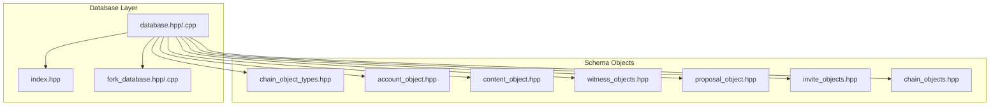
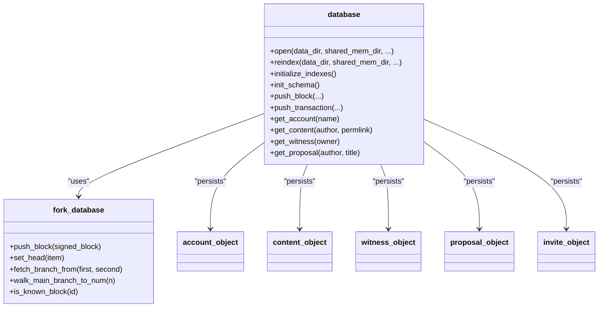
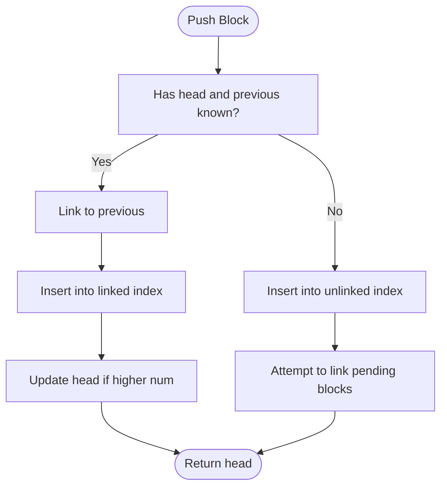
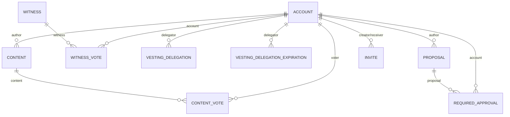
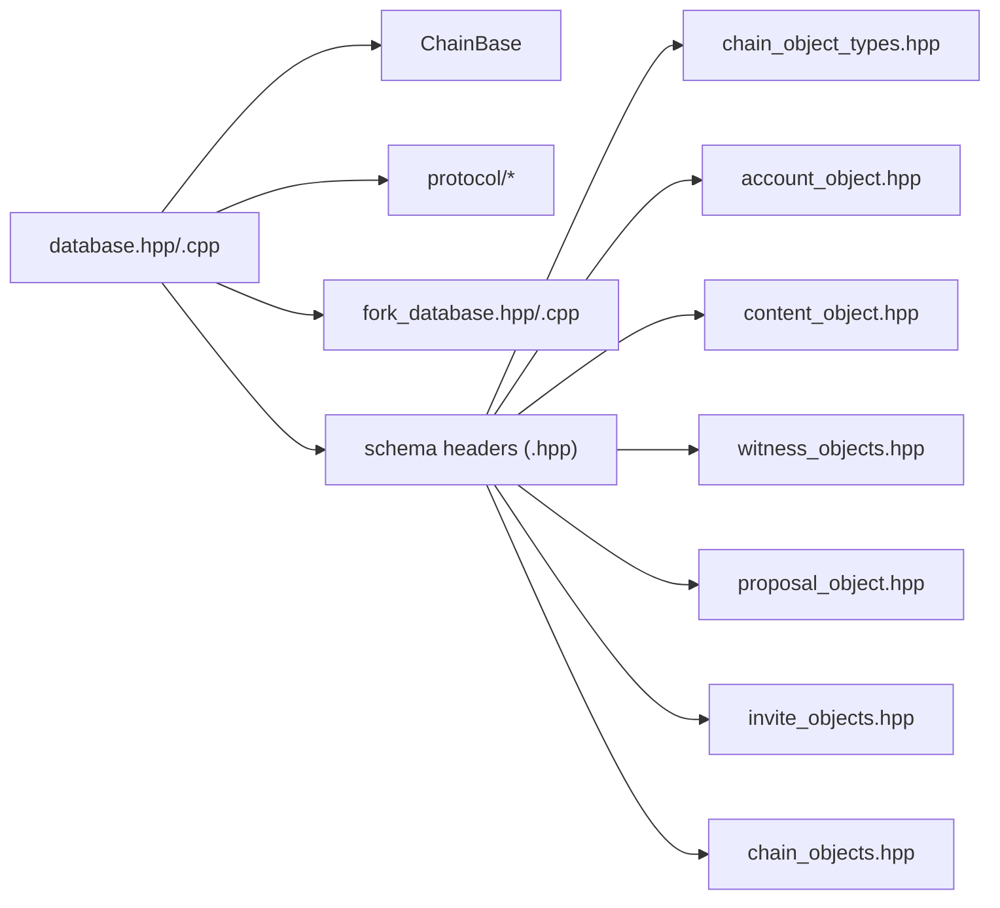

# Database Schema Design

<cite>
**Referenced Files in This Document**
- [database.hpp](file://libraries/chain/include/graphene/chain/database.hpp)
- [database.cpp](file://libraries/chain/database.cpp)
- [chain_object_types.hpp](file://libraries/chain/include/graphene/chain/chain_object_types.hpp)
- [chain_objects.hpp](file://libraries/chain/include/graphene/chain/chain_objects.hpp)
- [account_object.hpp](file://libraries/chain/include/graphene/chain/account_object.hpp)
- [content_object.hpp](file://libraries/chain/include/graphene/chain/content_object.hpp)
- [witness_objects.hpp](file://libraries/chain/include/graphene/chain/witness_objects.hpp)
- [proposal_object.hpp](file://libraries/chain/include/graphene/chain/proposal_object.hpp)
- [invite_objects.hpp](file://libraries/chain/include/graphene/chain/invite_objects.hpp)
- [fork_database.hpp](file://libraries/chain/include/graphene/chain/fork_database.hpp)
- [fork_database.cpp](file://libraries/chain/fork_database.cpp)
- [index.hpp](file://libraries/chain/include/graphene/chain/index.hpp)
</cite>

## Table of Contents
1. [Introduction](#introduction)
2. [Project Structure](#project-structure)
3. [Core Components](#core-components)
4. [Architecture Overview](#architecture-overview)
5. [Detailed Component Analysis](#detailed-component-analysis)
6. [Dependency Analysis](#dependency-analysis)
7. [Performance Considerations](#performance-considerations)
8. [Troubleshooting Guide](#troubleshooting-guide)
9. [Conclusion](#conclusion)
10. [Appendices](#appendices)

## Introduction
This document describes the database schema design and persistence model of VIZ CPP Node. It covers:
- Object persistence system and chain object types
- Database schema definitions and storage optimization strategies
- Fork database implementation, conflict resolution, and branch management
- Index management and query optimization techniques
- Object relationships and interaction patterns
- Schema evolution, versioning, migrations, and backward compatibility
- Practical examples for extending the schema with custom objects and optimizing queries
- Maintenance procedures and guidance for designing efficient data models for plugins

## Project Structure
The database layer is built on top of ChainBase and integrates with Protocol types. The schema is defined via object classes and Boost.MultiIndex containers. Core runtime components include:
- Database lifecycle and schema initialization
- Fork database for chain branching and conflict resolution
- Index registration and plugin index hooks
- Object definitions for accounts, content, witnesses, proposals, invites, and auxiliary objects

**Diagram sources**
- [database.hpp](file://libraries/chain/include/graphene/chain/database.hpp#L36-L561)
- [database.cpp](file://libraries/chain/database.cpp#L206-L268)
- [index.hpp](file://libraries/chain/include/graphene/chain/index.hpp#L8-L24)
- [fork_database.hpp](file://libraries/chain/include/graphene/chain/fork_database.hpp#L53-L125)
- [chain_object_types.hpp](file://libraries/chain/include/graphene/chain/chain_object_types.hpp#L44-L146)
- [account_object.hpp](file://libraries/chain/include/graphene/chain/account_object.hpp#L20-L565)
- [content_object.hpp](file://libraries/chain/include/graphene/chain/content_object.hpp#L56-L270)
- [witness_objects.hpp](file://libraries/chain/include/graphene/chain/witness_objects.hpp#L27-L313)
- [proposal_object.hpp](file://libraries/chain/include/graphene/chain/proposal_object.hpp#L28-L145)
- [invite_objects.hpp](file://libraries/chain/include/graphene/chain/invite_objects.hpp#L14-L72)
- [chain_objects.hpp](file://libraries/chain/include/graphene/chain/chain_objects.hpp#L20-L226)

**Section sources**
- [database.hpp](file://libraries/chain/include/graphene/chain/database.hpp#L36-L561)
- [database.cpp](file://libraries/chain/database.cpp#L206-L268)
- [index.hpp](file://libraries/chain/include/graphene/chain/index.hpp#L8-L24)
- [fork_database.hpp](file://libraries/chain/include/graphene/chain/fork_database.hpp#L53-L125)

## Core Components
- Database lifecycle and initialization:
  - Open and reindex operations, schema initialization, evaluator setup, and hardfork initialization
  - Memory management and resizing during replay
- Fork database:
  - Maintains a tree of unlinked and linked blocks, supports branch fetching and head updates
  - Enforces maximum reordering window and invalidation flags
- Index management:
  - Core and plugin indices are registered via helper functions
  - MultiIndex containers define primary and composite indexes per object type

Key responsibilities:
- [Open/reindex](file://libraries/chain/database.cpp#L206-L268)
- [Initialize schema and indexes](file://libraries/chain/database.cpp#L2992-L3005)
- [Fork database operations](file://libraries/chain/fork_database.cpp#L33-L90)
- [Index registration helpers](file://libraries/chain/include/graphene/chain/index.hpp#L8-L24)

**Section sources**
- [database.cpp](file://libraries/chain/database.cpp#L206-L268)
- [database.cpp](file://libraries/chain/database.cpp#L2992-L3005)
- [fork_database.cpp](file://libraries/chain/fork_database.cpp#L33-L90)
- [index.hpp](file://libraries/chain/include/graphene/chain/index.hpp#L8-L24)

## Architecture Overview
The database architecture combines ChainBase with custom schema objects and a fork-aware block storage model.

**Diagram sources**
- [database.hpp](file://libraries/chain/include/graphene/chain/database.hpp#L36-L561)
- [fork_database.hpp](file://libraries/chain/include/graphene/chain/fork_database.hpp#L53-L125)
- [account_object.hpp](file://libraries/chain/include/graphene/chain/account_object.hpp#L20-L144)
- [content_object.hpp](file://libraries/chain/include/graphene/chain/content_object.hpp#L56-L114)
- [witness_objects.hpp](file://libraries/chain/include/graphene/chain/witness_objects.hpp#L27-L132)
- [proposal_object.hpp](file://libraries/chain/include/graphene/chain/proposal_object.hpp#L28-L83)
- [invite_objects.hpp](file://libraries/chain/include/graphene/chain/invite_objects.hpp#L14-L38)

## Detailed Component Analysis

### Object Persistence System and Chain Object Types
Object types are enumerated and mapped to persistent objects. Each object inherits from a base object class and is associated with a MultiIndex container that defines its indexes.

- Enumerated object types:
  - Dynamic global property, account, authority, witness, transaction, block summary, witness schedule, content, content type, content vote, witness vote, hardfork property, vesting routes, authorities history, recovery requests, escrow, block stats, vesting delegation, fixed delegation, delegation expiration, metadata, proposal, required approvals, committee request/vote, invite, award shares expiration, paid subscriptions, witness penalties, block post validation

- Object identity and serialization:
  - Object IDs are typed identifiers; reflection and raw packing/unpacking are supported for persistence and RPC

Representative definitions:
- [Object types enumeration](file://libraries/chain/include/graphene/chain/chain_object_types.hpp#L44-L146)
- [Object ID and reflection](file://libraries/chain/include/graphene/chain/chain_object_types.hpp#L113-L207)

Storage optimization strategies:
- Shared string buffers and inter-process allocators minimize memory overhead
- Composite indexes reduce scans for common queries (e.g., by_name, by_cashout_time)

**Section sources**
- [chain_object_types.hpp](file://libraries/chain/include/graphene/chain/chain_object_types.hpp#L44-L146)
- [chain_object_types.hpp](file://libraries/chain/include/graphene/chain/chain_object_types.hpp#L113-L207)

### Account Object Schema and Indexes
Accounts store balances, vesting shares, delegation metrics, auction/bidding state, bandwidth, and governance participation.

Primary and composite indexes:
- by_id (unique)
- by_name (unique, lexicographic)
- by_account_on_sale/by_account_on_auction (non-unique)
- by_account_on_sale_start_time (non-unique)
- by_subaccount_on_sale (non-unique)
- by_next_vesting_withdrawal (composite: next_vesting_withdrawal + id)

Optimization notes:
- Composite index by_next_vesting_withdrawal enables efficient batch processing of upcoming withdrawals
- Separate indexes for sale/auction flags support targeted queries for marketplace operations

**Section sources**
- [account_object.hpp](file://libraries/chain/include/graphene/chain/account_object.hpp#L20-L144)
- [account_object.hpp](file://libraries/chain/include/graphene/chain/account_object.hpp#L291-L315)

### Content Object Schema and Indexes
Content objects represent posts/comments with voting, payout, and nesting metadata. Content types and votes are separate objects with dedicated indexes.

Indexes:
- by_id (unique)
- by_cashout_time (composite: cashout_time + id)
- by_permlink (composite: author + permlink)
- by_root (composite: root_content + id)
- by_parent (composite: parent_author + parent_permlink + id)
- Non-consensus indexes (API-heavy):
  - by_last_update (composite: parent_author + last_update + id)
  - by_author_last_update (composite: author + last_update + id)

Content vote indexes:
- by_id (unique)
- by_content_voter (unique composite: content + voter)
- by_voter_content (unique composite: voter + content)
- by_voter_last_update (composite: voter + last_update + content)
- by_content_weight_voter (composite: content + weight + voter)

Optimization notes:
- Composite indexes on author/permlink and root/content enable fast lookup of discussions and hierarchy navigation
- Weighted ordering by content_weight_voter supports leaderboards and trending calculations

**Section sources**
- [content_object.hpp](file://libraries/chain/include/graphene/chain/content_object.hpp#L56-L114)
- [content_object.hpp](file://libraries/chain/include/graphene/chain/content_object.hpp#L197-L248)
- [content_object.hpp](file://libraries/chain/include/graphene/chain/content_object.hpp#L144-L184)

### Witness and Governance Objects
Witness objects track scheduling, votes, signing keys, and penalties. Governance objects include votes and schedules.

Indexes:
- witness_object:
  - by_id (unique)
  - by_work (non-unique)
  - by_name (unique)
  - by_vote_name (composite: votes + owner)
  - by_counted_vote_name (composite: counted_votes + owner)
  - by_schedule_time (composite: virtual_scheduled_time + id)
- witness_vote_object:
  - by_id (unique)
  - by_account_witness (unique composite: account + witness)
  - by_witness_account (unique composite: witness + account)
- witness_schedule_object:
  - by_id (unique)
- witness_penalty_expire_object:
  - by_id (unique)
  - by_account (non-unique)
  - by_expiration (non-unique)

Optimization notes:
- Virtual scheduled time index supports O(log N) scheduling decisions
- Composite indexes on account-witness pairs enable fast vote lookups

**Section sources**
- [witness_objects.hpp](file://libraries/chain/include/graphene/chain/witness_objects.hpp#L183-L219)
- [witness_objects.hpp](file://libraries/chain/include/graphene/chain/witness_objects.hpp#L224-L248)
- [witness_objects.hpp](file://libraries/chain/include/graphene/chain/witness_objects.hpp#L250-L256)
- [witness_objects.hpp](file://libraries/chain/include/graphene/chain/witness_objects.hpp#L276-L291)

### Proposal and Authority Objects
Proposals encapsulate partially approved transactions with required/approved sets. Required approvals link accounts to proposals.

Indexes:
- proposal_object:
  - by_id (unique)
  - by_account (composite: author + title)
  - by_expiration (non-unique)
- required_approval_object:
  - by_id (unique)
  - by_account (composite: account + proposal)

Optimization notes:
- Composite keys on author/title and account/proposal enable targeted queries for governance dashboards

**Section sources**
- [proposal_object.hpp](file://libraries/chain/include/graphene/chain/proposal_object.hpp#L108-L126)
- [proposal_object.hpp](file://libraries/chain/include/graphene/chain/proposal_object.hpp#L128-L140)

### Invite Object Schema
Invite objects track creator, receiver, secret, key, balances, and status.

Indexes:
- by_id (unique)
- by_invite_key (non-unique)
- by_status (non-unique)
- by_creator (non-unique)
- by_receiver (non-unique)

Optimization notes:
- Multiple non-unique indexes support quick filtering by key, status, and participant roles

**Section sources**
- [invite_objects.hpp](file://libraries/chain/include/graphene/chain/invite_objects.hpp#L44-L66)

### Auxiliary and Specialized Objects
Auxiliary objects include vesting routes, escrow, award shares expiration, and block post validation.

Examples:
- Withdraw vesting routes:
  - by_id (unique)
  - by_withdraw_route (composite: from_account + to_account)
  - by_destination (composite: to_account + id)
- Escrow:
  - by_id (unique)
  - by_from_id (composite: from + escrow_id)
  - by_to (composite: to + id)
  - by_agent (composite: agent + id)
  - by_ratification_deadline (composite: is_approved + ratification_deadline + id)
- Award shares expiration:
  - by_id (unique)
  - by_expiration (non-unique)
- Block post validation:
  - by_id (unique)

Optimization notes:
- Composite indexes on multi-key fields enable targeted settlement/cleanup workflows

**Section sources**
- [chain_objects.hpp](file://libraries/chain/include/graphene/chain/chain_objects.hpp#L75-L98)
- [chain_objects.hpp](file://libraries/chain/include/graphene/chain/chain_objects.hpp#L104-L141)
- [chain_objects.hpp](file://libraries/chain/include/graphene/chain/chain_objects.hpp#L160-L172)
- [chain_objects.hpp](file://libraries/chain/include/graphene/chain/chain_objects.hpp#L192-L201)

### Fork Database Implementation
The fork database manages a tree of blocks with:
- Linked index for canonical chain
- Unlinked index for orphaned/out-of-order blocks
- Hashed indexes by block_id and by_previous
- Ordered index by block_num

Conflict resolution and branch management:
- push_block inserts blocks and links to previous if known
- fetch_branch_from walks both branches toward a common ancestor
- walk_main_branch_to_num and fetch_block_on_main_branch_by_number traverse canonical chain
- set_max_size prunes old blocks beyond a configurable threshold

Invalidation and unlinkability:
- Blocks flagged invalid prevent further linking
- Attempting to push blocks outside the reordering window triggers assertions

**Diagram sources**
- [fork_database.cpp](file://libraries/chain/fork_database.cpp#L33-L90)
- [fork_database.hpp](file://libraries/chain/include/graphene/chain/fork_database.hpp#L100-L121)

**Section sources**
- [fork_database.hpp](file://libraries/chain/include/graphene/chain/fork_database.hpp#L53-L125)
- [fork_database.cpp](file://libraries/chain/fork_database.cpp#L33-L90)

### Index Management and Query Optimization
Index registration:
- Core indices are added via add_core_index
- Plugin indices are registered via add_plugin_index and signaled after schema initialization

Common optimization techniques:
- Prefer composite indexes for multi-field queries (e.g., author+permlink, voter+content)
- Use non-unique indexes for status filters (e.g., by_account_on_sale, by_expiration)
- Order composite keys by selectivity and access patterns (e.g., time-based indexes with secondary sort by id)

**Section sources**
- [index.hpp](file://libraries/chain/include/graphene/chain/index.hpp#L8-L24)
- [database.cpp](file://libraries/chain/database.cpp#L2952-L2960)

### Object Relationship Patterns
Relationships among entities:
- Accounts own content and votes; content references authors and parents; votes reference accounts and content
- Witnesses schedule and produce blocks; witness votes link accounts to witnesses
- Proposals require approvals from active/master/regular sets; required approvals link accounts to proposals
- Invites connect creators/receivers and keys to balances
- Vesting delegation links delegators to delegatees; expiration objects track time-based cleanup

**Diagram sources**
- [account_object.hpp](file://libraries/chain/include/graphene/chain/account_object.hpp#L20-L144)
- [content_object.hpp](file://libraries/chain/include/graphene/chain/content_object.hpp#L121-L138)
- [witness_objects.hpp](file://libraries/chain/include/graphene/chain/witness_objects.hpp#L135-L150)
- [proposal_object.hpp](file://libraries/chain/include/graphene/chain/proposal_object.hpp#L90-L103)
- [invite_objects.hpp](file://libraries/chain/include/graphene/chain/invite_objects.hpp#L14-L38)
- [chain_objects.hpp](file://libraries/chain/include/graphene/chain/chain_objects.hpp#L181-L228)

## Dependency Analysis
The database depends on ChainBase for persistence primitives and integrates with Protocol types. The fork database is tightly coupled with block storage and maintains a separate block tree.

**Diagram sources**
- [database.hpp](file://libraries/chain/include/graphene/chain/database.hpp#L1-L50)
- [database.cpp](file://libraries/chain/database.cpp#L1-L40)
- [fork_database.hpp](file://libraries/chain/include/graphene/chain/fork_database.hpp#L1-L20)
- [chain_object_types.hpp](file://libraries/chain/include/graphene/chain/chain_object_types.hpp#L1-L40)
- [account_object.hpp](file://libraries/chain/include/graphene/chain/account_object.hpp#L1-L20)
- [content_object.hpp](file://libraries/chain/include/graphene/chain/content_object.hpp#L1-L15)
- [witness_objects.hpp](file://libraries/chain/include/graphene/chain/witness_objects.hpp#L1-L20)
- [proposal_object.hpp](file://libraries/chain/include/graphene/chain/proposal_object.hpp#L1-L15)
- [invite_objects.hpp](file://libraries/chain/include/graphene/chain/invite_objects.hpp#L1-L15)
- [chain_objects.hpp](file://libraries/chain/include/graphene/chain/chain_objects.hpp#L1-L20)

**Section sources**
- [database.hpp](file://libraries/chain/include/graphene/chain/database.hpp#L1-L50)
- [database.cpp](file://libraries/chain/database.cpp#L1-L40)
- [fork_database.hpp](file://libraries/chain/include/graphene/chain/fork_database.hpp#L1-L20)

## Performance Considerations
- Memory management:
  - Shared memory sizing and incremental growth during reindex
  - Periodic checks and reserved memory protection
- Index selection:
  - Use composite indexes to avoid full scans on multi-column filters
  - Prefer non-unique indexes for status-based filtering
- Fork pruning:
  - Limit maximum reordering window to cap memory footprint
- Batch operations:
  - Leverage composite ordering for efficient iteration (e.g., by_next_vesting_withdrawal)

[No sources needed since this section provides general guidance]

## Troubleshooting Guide
Common issues and diagnostics:
- Database open failures:
  - Revision mismatch between chainbase and head block num
  - Head block mismatch with block log
- Reindex interruptions:
  - Signal guard handles OS signals during replay
- Memory pressure:
  - Automatic resizing and periodic free memory checks
- Fork database errors:
  - Unlinkable block exceptions when previous is unknown
  - Invalid block flags prevent propagation

Operational references:
- [Open and revision checks](file://libraries/chain/database.cpp#L242-L248)
- [Block log validation](file://libraries/chain/database.cpp#L250-L257)
- [Signal guard and reindex loop](file://libraries/chain/database.cpp#L300-L340)
- [Memory checks and resizing](file://libraries/chain/database.cpp#L396-L400)
- [Fork database unlinkable assertion](file://libraries/chain/fork_database.cpp#L59-L63)

**Section sources**
- [database.cpp](file://libraries/chain/database.cpp#L242-L248)
- [database.cpp](file://libraries/chain/database.cpp#L250-L257)
- [database.cpp](file://libraries/chain/database.cpp#L300-L340)
- [database.cpp](file://libraries/chain/database.cpp#L396-L400)
- [fork_database.cpp](file://libraries/chain/fork_database.cpp#L59-L63)

## Conclusion
The VIZ CPP Node database schema leverages ChainBase with carefully designed MultiIndex containers to support high-throughput consensus and API workloads. The fork database ensures robust branch handling and conflict resolution. Composite indexes and typed object IDs enable efficient queries and maintainability. The modular index registration pattern allows plugins to extend the schema safely. Proper maintenance and monitoring of memory and fork pruning are essential for sustained performance.

[No sources needed since this section summarizes without analyzing specific files]

## Appendices

### Schema Evolution and Migration Guidance
- Versioning and hardforks:
  - Hardfork timestamps and versions are maintained in the database and processed during initialization
- Migration strategies:
  - Use schema initialization to register new indices and objects
  - Apply conditional logic during replay to transform legacy data into new structures
- Backward compatibility:
  - Keep existing indexes and IDs stable
  - Add new optional fields and non-conflicting indexes
  - Avoid changing primary key semantics

References:
- [Hardfork initialization and processing](file://libraries/chain/database.cpp#L262-L264)
- [Schema initialization hook](file://libraries/chain/database.cpp#L2992-L3005)

**Section sources**
- [database.cpp](file://libraries/chain/database.cpp#L262-L264)
- [database.cpp](file://libraries/chain/database.cpp#L2992-L3005)

### Extending the Schema with Custom Objects
Steps:
- Define a new object class inheriting from the base object
- Declare MultiIndex container with desired indexes
- Register the index via add_core_index or add_plugin_index
- Reflect the object for serialization

Example references:
- [Core index registration helper](file://libraries/chain/include/graphene/chain/index.hpp#L14-L21)
- [Object definition pattern](file://libraries/chain/include/graphene/chain/account_object.hpp#L20-L30)
- [MultiIndex container pattern](file://libraries/chain/include/graphene/chain/content_object.hpp#L197-L248)

**Section sources**
- [index.hpp](file://libraries/chain/include/graphene/chain/index.hpp#L14-L21)
- [account_object.hpp](file://libraries/chain/include/graphene/chain/account_object.hpp#L20-L30)
- [content_object.hpp](file://libraries/chain/include/graphene/chain/content_object.hpp#L197-L248)

### Query Optimization Examples
- Fast lookup by author and permlink:
  - Use by_permlink composite index on content
- Efficient vote ranking:
  - Use by_content_weight_voter composite index on content votes
- Batch vesting withdrawals:
  - Use by_next_vesting_withdrawal composite index on accounts
- Governance filtering:
  - Use by_expiration on proposals and by_account on required approvals

References:
- [Content by_permlink](file://libraries/chain/include/graphene/chain/content_object.hpp#L210-L214)
- [Content vote by_content_weight_voter](file://libraries/chain/include/graphene/chain/content_object.hpp#L172-L181)
- [Account by_next_vesting_withdrawal](file://libraries/chain/include/graphene/chain/account_object.hpp#L307-L312)
- [Proposal by_expiration](file://libraries/chain/include/graphene/chain/proposal_object.hpp#L123-L125)
- [Required approval by_account](file://libraries/chain/include/graphene/chain/proposal_object.hpp#L134-L139)

**Section sources**
- [content_object.hpp](file://libraries/chain/include/graphene/chain/content_object.hpp#L210-L214)
- [content_object.hpp](file://libraries/chain/include/graphene/chain/content_object.hpp#L172-L181)
- [account_object.hpp](file://libraries/chain/include/graphene/chain/account_object.hpp#L307-L312)
- [proposal_object.hpp](file://libraries/chain/include/graphene/chain/proposal_object.hpp#L123-L125)
- [proposal_object.hpp](file://libraries/chain/include/graphene/chain/proposal_object.hpp#L134-L139)