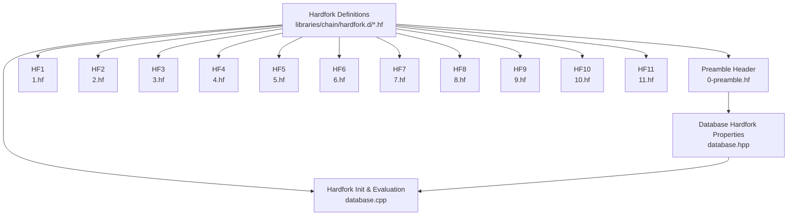
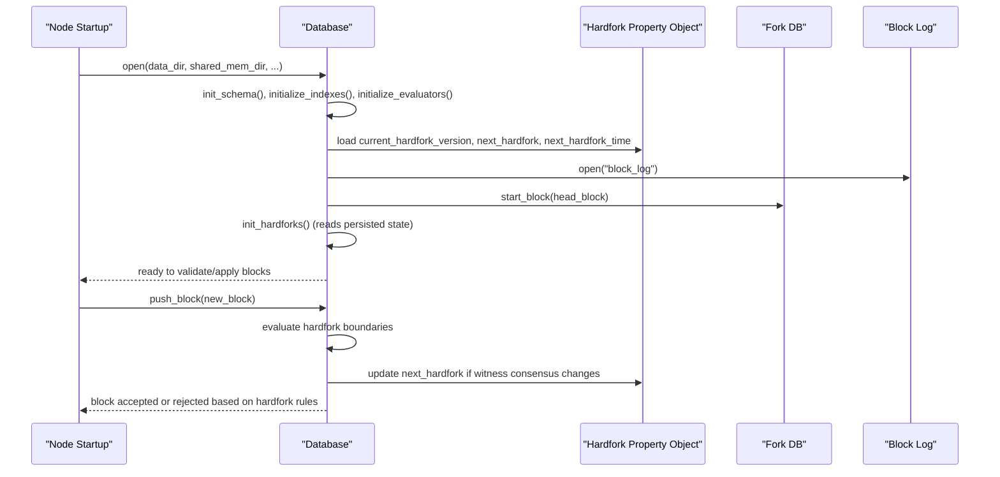
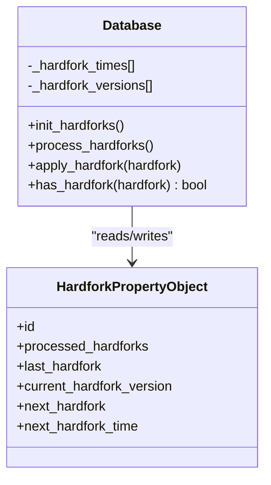
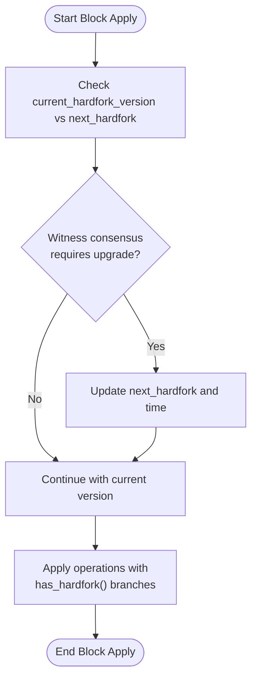
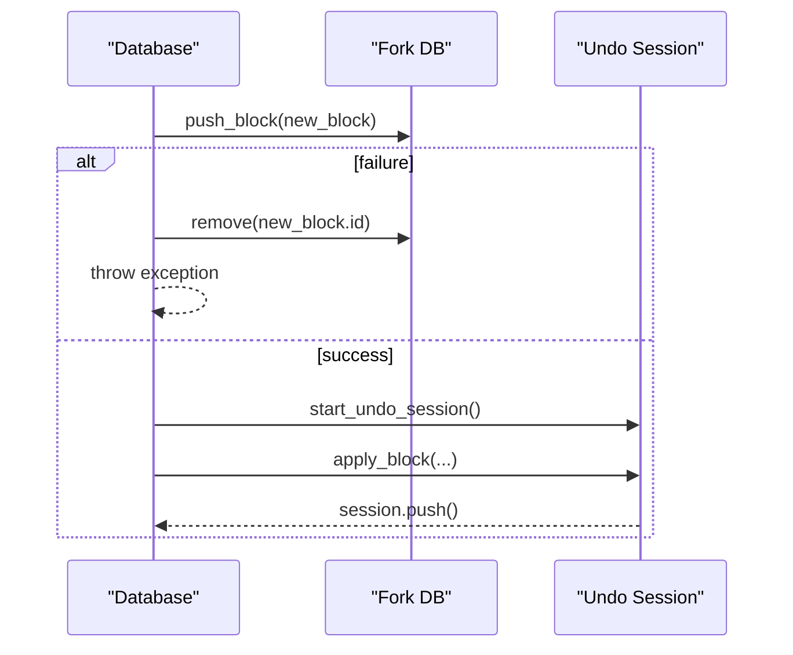
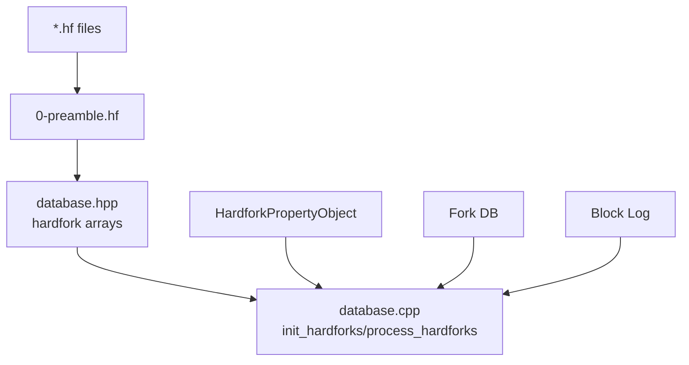

# Hardfork Management

<cite>
**Referenced Files in This Document**
- [database.hpp](file://libraries/chain/include/graphene/chain/database.hpp)
- [database.cpp](file://libraries/chain/database.cpp)
- [0-preamble.hf](file://libraries/chain/hardfork.d/0-preamble.hf)
- [1.hf](file://libraries/chain/hardfork.d/1.hf)
- [2.hf](file://libraries/chain/hardfork.d/2.hf)
- [3.hf](file://libraries/chain/hardfork.d/3.hf)
- [4.hf](file://libraries/chain/hardfork.d/4.hf)
- [5.hf](file://libraries/chain/hardfork.d/5.hf)
- [6.hf](file://libraries/chain/hardfork.d/6.hf)
- [7.hf](file://libraries/chain/hardfork.d/7.hf)
- [8.hf](file://libraries/chain/hardfork.d/8.hf)
- [9.hf](file://libraries/chain/hardfork.d/9.hf)
- [10.hf](file://libraries/chain/hardfork.d/10.hf)
- [11.hf](file://libraries/chain/hardfork.d/11.hf)
</cite>

## Table of Contents
1. [Introduction](#introduction)
2. [Project Structure](#project-structure)
3. [Core Components](#core-components)
4. [Architecture Overview](#architecture-overview)
5. [Detailed Component Analysis](#detailed-component-analysis)
6. [Dependency Analysis](#dependency-analysis)
7. [Performance Considerations](#performance-considerations)
8. [Troubleshooting Guide](#troubleshooting-guide)
9. [Conclusion](#conclusion)
10. [Appendices](#appendices)

## Introduction
This document explains the hardfork management system in the VIZ C++ Node. It covers how hardforks are defined, stored, loaded, and enforced during node runtime; how scheduled upgrades are coordinated with witness voting; how backward compatibility is maintained; and how migrations and state transitions are executed. It also documents rollback and recovery procedures for failed upgrades, and provides practical guidance for implementing custom hardfork logic, adding new operation types, and modifying existing behavior.

## Project Structure
The hardfork system is centered around:
- A dedicated directory of hardfork definition files under libraries/chain/hardfork.d
- A database-level hardfork property object that tracks current and next hardfork versions and timestamps
- Runtime logic in the database that initializes hardfork state, evaluates hardfork boundaries, and applies version-specific behavior

**Diagram sources**
- [0-preamble.hf](file://libraries/chain/hardfork.d/0-preamble.hf#L1-L56)
- [database.hpp](file://libraries/chain/include/graphene/chain/database.hpp#L524-L526)
- [database.cpp](file://libraries/chain/database.cpp#L206-L268)

**Section sources**
- [0-preamble.hf](file://libraries/chain/hardfork.d/0-preamble.hf#L1-L56)
- [database.hpp](file://libraries/chain/include/graphene/chain/database.hpp#L524-L526)
- [database.cpp](file://libraries/chain/database.cpp#L206-L268)

## Core Components
- Hardfork definition files (*.hf): Define constants for each hardfork ID, timestamp, and protocol hardfork version. They are included by the preamble and compiled into the node binary.
- Hardfork property object: Tracks last processed hardfork, current hardfork version, and next hardfork version/time. Updated by runtime logic and persisted in the database.
- Database runtime: Initializes hardfork state on open/reindex, evaluates hardfork boundaries during block application, and conditionally applies behavior changes gated by has_hardfork() checks.

Key responsibilities:
- Version management: Maintains arrays of hardfork times and versions used by the node.
- Scheduled upgrades: Watches witness votes and sets next hardfork according to majority.
- Backward compatibility: Uses has_hardfork() checks to branch behavior depending on applied hardfork level.
- Migration and state transitions: Applies changes to chain properties, validators, and runtime logic when crossing hardfork boundaries.

**Section sources**
- [0-preamble.hf](file://libraries/chain/hardfork.d/0-preamble.hf#L18-L56)
- [database.hpp](file://libraries/chain/include/graphene/chain/database.hpp#L524-L526)
- [database.cpp](file://libraries/chain/database.cpp#L206-L268)

## Architecture Overview
The hardfork architecture integrates definitions, runtime initialization, and evaluation during block processing.

**Diagram sources**
- [database.cpp](file://libraries/chain/database.cpp#L206-L268)
- [database.cpp](file://libraries/chain/database.cpp#L800-L925)
- [database.cpp](file://libraries/chain/database.cpp#L1600-L1654)

## Detailed Component Analysis

### Hardfork Directory and Definition Files
- Purpose: Provide compile-time constants for hardfork IDs, timestamps, and protocol hardfork versions.
- Organization: One *.hf file per hardfork, plus a preamble header that defines the hardfork property object schema and counts.
- Example entries:
  - Hardfork 1: timestamp and version for fixing a median calculation.
  - Hardfork 2: timestamp and version for fixing a committee approval threshold.
  - Hardfork 4: introduces major protocol changes (award operations, custom sequences).
  - Hardfork 6: modifies witness penalties and vote counting.
  - Hardfork 9: adjusts chain parameters for invites, subscriptions, and fees.
  - Hardfork 11: emission model changes.

Practical notes:
- Modify *.hf files to define a new hardfork; do not edit generated files.
- Keep timestamps realistic and coordinated with witness voting.

**Section sources**
- [0-preamble.hf](file://libraries/chain/hardfork.d/0-preamble.hf#L18-L56)
- [1.hf](file://libraries/chain/hardfork.d/1.hf#L1-L7)
- [2.hf](file://libraries/chain/hardfork.d/2.hf#L1-L7)
- [3.hf](file://libraries/chain/hardfork.d/3.hf#L1-L7)
- [4.hf](file://libraries/chain/hardfork.d/4.hf#L1-L7)
- [5.hf](file://libraries/chain/hardfork.d/5.hf#L1-L7)
- [6.hf](file://libraries/chain/hardfork.d/6.hf#L1-L7)
- [7.hf](file://libraries/chain/hardfork.d/7.hf#L1-L7)
- [8.hf](file://libraries/chain/hardfork.d/8.hf#L1-L7)
- [9.hf](file://libraries/chain/hardfork.d/9.hf#L1-L7)
- [10.hf](file://libraries/chain/hardfork.d/10.hf#L1-L7)
- [11.hf](file://libraries/chain/hardfork.d/11.hf#L1-L7)

### Hardfork Property Object and Runtime State
- Schema: Contains processed hardforks vector, last hardfork ID, current hardfork version, and next hardfork version/time.
- Initialization: During open(), the node loads persisted hardfork state and ensures consistency with the chainbase revision and block log.
- Updates: During block application, the node evaluates witness consensus and updates next_hardfork accordingly.

**Diagram sources**
- [0-preamble.hf](file://libraries/chain/hardfork.d/0-preamble.hf#L18-L56)
- [database.hpp](file://libraries/chain/include/graphene/chain/database.hpp#L524-L526)
- [database.cpp](file://libraries/chain/database.cpp#L206-L268)

**Section sources**
- [0-preamble.hf](file://libraries/chain/hardfork.d/0-preamble.hf#L18-L56)
- [database.hpp](file://libraries/chain/include/graphene/chain/database.hpp#L524-L526)
- [database.cpp](file://libraries/chain/database.cpp#L206-L268)

### Hardfork Evaluation and Block Application
- During block validation and application, the node checks:
  - Whether the current hardfork version requires applying changes.
  - Whether witness consensus indicates a scheduled upgrade.
- The node compares witness votes against configured hardfork versions/times and updates next_hardfork accordingly.
- Behavior changes are gated behind has_hardfork() checks to preserve backward compatibility.

**Diagram sources**
- [database.cpp](file://libraries/chain/database.cpp#L1600-L1654)
- [database.cpp](file://libraries/chain/database.cpp#L1085-L1117)

**Section sources**
- [database.cpp](file://libraries/chain/database.cpp#L1600-L1654)
- [database.cpp](file://libraries/chain/database.cpp#L1085-L1117)

### Migration Procedures and State Transitions
- On open():
  - Initialize schema and indexes.
  - Open block log and fork DB.
  - Initialize hardfork state from persisted data.
  - Assert chainbase revision matches head block number.
- On reindex:
  - Replay blocks from the block log with skip flags optimized for speed.
  - Apply each block with hardfork-aware logic.
  - Set revision periodically to ensure progress.

Operational guidance:
- Before upgrading, back up the database and block log.
- Run with read-only mode initially to verify compatibility.
- Monitor logs for hardfork-related warnings or errors.

**Section sources**
- [database.cpp](file://libraries/chain/database.cpp#L206-L268)
- [database.cpp](file://libraries/chain/database.cpp#L270-L350)

### Rollback and Recovery for Failed Upgrades
- Undo sessions: The database uses undo sessions to roll back partial changes when block application fails.
- Fork switching: If a new head does not build off the current head, the node switches forks and reapplies blocks safely.
- Pop block: Removes the head block and restores transactions to pending state.

**Diagram sources**
- [database.cpp](file://libraries/chain/database.cpp#L800-L925)

**Section sources**
- [database.cpp](file://libraries/chain/database.cpp#L800-L925)

### Implementing Custom Hardfork Logic
Steps to add a new hardfork:
1. Define the hardfork in a new *.hf file with ID, timestamp, and version.
2. Increment CHAIN_NUM_HARDFORKS in the preamble if necessary.
3. Gate behavior changes using has_hardfork(CHAIN_HARDFORK_N) checks in relevant code paths.
4. Optionally adjust chain parameters or validators in update_median_witness_props() or related routines.
5. Test with a local testnet or snapshot to validate behavior before mainnet deployment.

Examples of where to add logic:
- Operation evaluators: Wrap validation or execution in has_hardfork() branches.
- Chain properties: Adjust median properties or inflation logic based on hardfork level.
- Witness scheduling: Update vote counting or penalties depending on hardfork.

**Section sources**
- [0-preamble.hf](file://libraries/chain/hardfork.d/0-preamble.hf#L54-L56)
- [database.cpp](file://libraries/chain/database.cpp#L1715-L1779)
- [database.cpp](file://libraries/chain/database.cpp#L2341-L2399)

### Adding New Operation Types
- Define the operation type in the protocol layer.
- Register an evaluator for the operation.
- Gate any new behavior behind has_hardfork() checks.
- Ensure backward compatibility by preserving old validation paths.

Note: This involves protocol and evaluator changes outside the scope of the current file references.

### Modifying Existing Behavior
- Identify the affected subsystem (e.g., witness voting, inflation, chain properties).
- Add a new hardfork constant and timestamp.
- Update the relevant runtime logic to branch on has_hardfork().
- Verify with tests and a staged rollout.

**Section sources**
- [database.cpp](file://libraries/chain/database.cpp#L1830-L1891)
- [database.cpp](file://libraries/chain/database.cpp#L2341-L2399)

### Common Hardfork Scenarios
- Protocol changes: Introduce new operations or modify semantics (e.g., award operations, custom sequences).
- Bug fixes: Correct calculations or state transitions (e.g., median properties, vote accounting).
- Feature additions: Enable new chain parameters or fee structures (e.g., invites, subscriptions, witness penalties).

Validation procedures:
- Confirm hardfork timestamps align with witness votes.
- Verify has_hardfork() branches execute the intended logic.
- Run reindex tests to ensure deterministic replay.

**Section sources**
- [1.hf](file://libraries/chain/hardfork.d/1.hf#L1-L7)
- [2.hf](file://libraries/chain/hardfork.d/2.hf#L1-L7)
- [4.hf](file://libraries/chain/hardfork.d/4.hf#L1-L7)
- [6.hf](file://libraries/chain/hardfork.d/6.hf#L1-L7)
- [9.hf](file://libraries/chain/hardfork.d/9.hf#L1-L7)
- [11.hf](file://libraries/chain/hardfork.d/11.hf#L1-L7)

## Dependency Analysis
The hardfork system depends on:
- Hardfork definition files for compile-time constants.
- Database hardfork property object for runtime state.
- Witness consensus for determining next hardfork.
- Block log and fork database for replay and fork switching.

**Diagram sources**
- [0-preamble.hf](file://libraries/chain/hardfork.d/0-preamble.hf#L18-L56)
- [database.hpp](file://libraries/chain/include/graphene/chain/database.hpp#L524-L526)
- [database.cpp](file://libraries/chain/database.cpp#L206-L268)

**Section sources**
- [0-preamble.hf](file://libraries/chain/hardfork.d/0-preamble.hf#L18-L56)
- [database.hpp](file://libraries/chain/include/graphene/chain/database.hpp#L524-L526)
- [database.cpp](file://libraries/chain/database.cpp#L206-L268)

## Performance Considerations
- Reindexing with skip flags reduces overhead by bypassing expensive validations.
- Periodic revision setting during reindex prevents excessive memory pressure.
- Auto-scaling shared memory helps avoid failures during heavy reindex workloads.

Recommendations:
- Configure shared memory sizing appropriately for your hardware.
- Monitor free memory and adjust thresholds to trigger resizing proactively.

**Section sources**
- [database.cpp](file://libraries/chain/database.cpp#L270-L350)
- [database.cpp](file://libraries/chain/database.cpp#L368-L430)

## Troubleshooting Guide
Common issues and resolutions:
- Revision mismatch on open: Indicates chainbase revision does not match head block number; reindex or restore from a compatible backup.
- Chain state mismatch with block log: Requires reindex to reconcile state.
- Memory exhaustion during reindex: Increase shared memory size or tune auto-resize parameters.
- Hardfork not triggering: Verify witness consensus matches configured hardfork version/time; check has_hardfork() branches.

Diagnostic steps:
- Review logs around open() and reindex() for explicit assertions or exceptions.
- Confirm hardfork timestamps and versions in *.hf files.
- Validate that next_hardfork updates according to witness votes.

**Section sources**
- [database.cpp](file://libraries/chain/database.cpp#L206-L268)
- [database.cpp](file://libraries/chain/database.cpp#L270-L350)
- [database.cpp](file://libraries/chain/database.cpp#L1600-L1654)

## Conclusion
The VIZ hardfork system provides a robust, versioned mechanism for managing protocol upgrades. By combining compile-time definitions, runtime state tracking, and consensus-driven scheduling, it enables safe, backward-compatible upgrades. Proper planning, testing, and validation are essential for successful deployments.

## Appendices
- Practical checklist for upgrades:
  - Freeze node binaries to the target version.
  - Prepare a snapshot and backup.
  - Deploy *.hf files and rebuild.
  - Start node in read-only mode to validate.
  - Monitor logs and metrics.
  - Coordinate with witnesses to reach consensus.
  - Proceed with full node operation after verification.