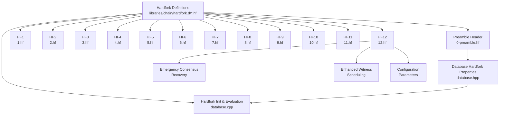
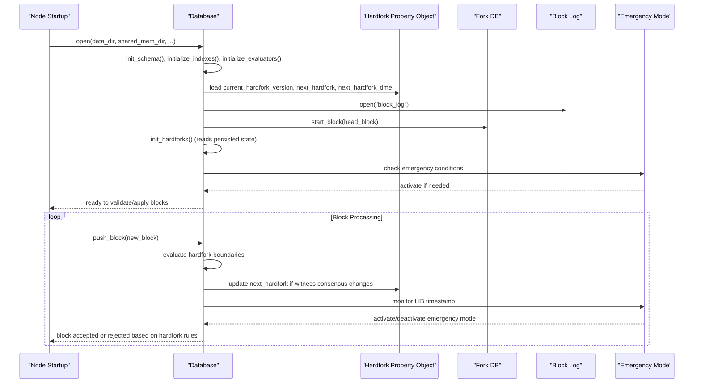
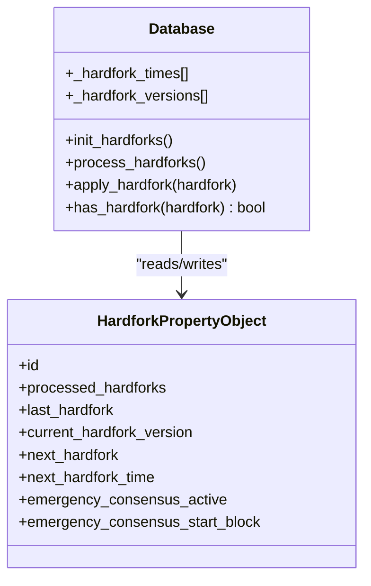
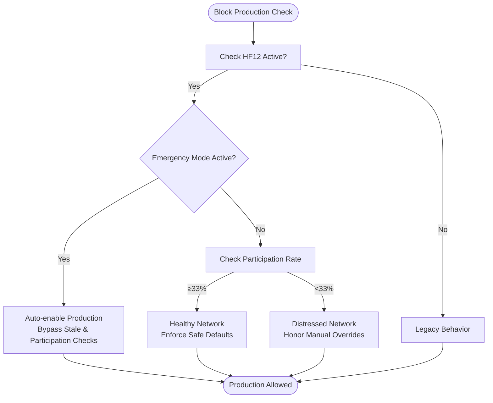
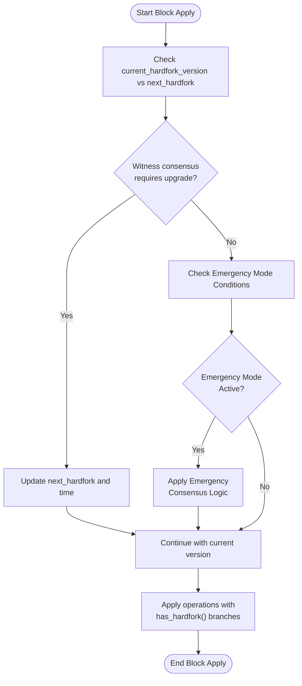
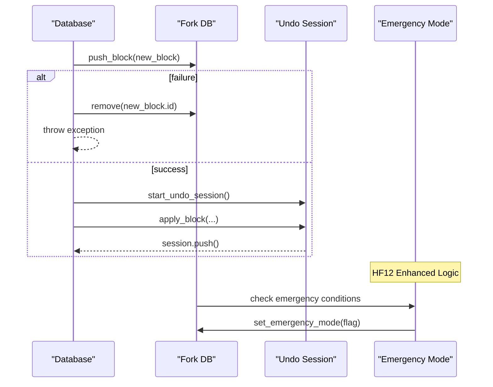
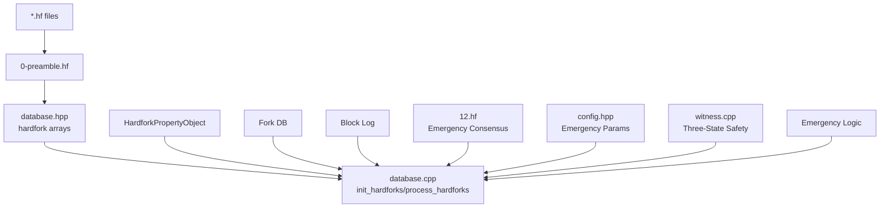

# Hardfork Management

<cite>
**Referenced Files in This Document**
- [database.hpp](file://libraries/chain/include/graphene/chain/database.hpp)
- [database.cpp](file://libraries/chain/database.cpp)
- [0-preamble.hf](file://libraries/chain/hardfork.d/0-preamble.hf)
- [1.hf](file://libraries/chain/hardfork.d/1.hf)
- [2.hf](file://libraries/chain/hardfork.d/2.hf)
- [3.hf](file://libraries/chain/hardfork.d/3.hf)
- [4.hf](file://libraries/chain/hardfork.d/4.hf)
- [5.hf](file://libraries/chain/hardfork.d/5.hf)
- [6.hf](file://libraries/chain/hardfork.d/6.hf)
- [7.hf](file://libraries/chain/hardfork.d/7.hf)
- [8.hf](file://libraries/chain/hardfork.d/8.hf)
- [9.hf](file://libraries/chain/hardfork.d/9.hf)
- [10.hf](file://libraries/chain/hardfork.d/10.hf)
- [11.hf](file://libraries/chain/hardfork.d/11.hf)
- [12.hf](file://libraries/chain/hardfork.d/12.hf)
- [config.hpp](file://libraries/protocol/include/graphene/protocol/config.hpp)
- [fork_database.hpp](file://libraries/chain/include/graphene/chain/fork_database.hpp)
- [global_property_object.hpp](file://libraries/chain/include/graphene/chain/global_property_object.hpp)
- [witness.cpp](file://plugins/witness/witness.cpp)
</cite>

## Update Summary
**Changes Made**
- Added Emergency Consensus Recovery (HF12) as the latest hardfork implementation
- Updated hardfork directory structure to include HF12 definition
- Enhanced witness scheduling logic with emergency mode activation
- Added emergency consensus recovery mechanisms and three-state safety enforcement
- Updated CHAIN_NUM_HARDFORKS from 11 to 12 in preamble
- Added comprehensive emergency mode functionality including fork switching and witness management

## Table of Contents
1. [Introduction](#introduction)
2. [Project Structure](#project-structure)
3. [Core Components](#core-components)
4. [Architecture Overview](#architecture-overview)
5. [Detailed Component Analysis](#detailed-component-analysis)
6. [Dependency Analysis](#dependency-analysis)
7. [Performance Considerations](#performance-considerations)
8. [Troubleshooting Guide](#troubleshooting-guide)
9. [Conclusion](#conclusion)
10. [Appendices](#appendices)

## Introduction
This document explains the hardfork management system in the VIZ C++ Node. It covers how hardforks are defined, stored, loaded, and enforced during node runtime; how scheduled upgrades are coordinated with witness voting; how backward compatibility is maintained; and how migrations and state transitions are executed. The system now includes Emergency Consensus Recovery (HF12) as the latest hardfork implementation with sophisticated emergency mode activation and witness scheduling changes designed to recover from network consensus failures.

## Project Structure
The hardfork system is centered around:
- A dedicated directory of hardfork definition files under libraries/chain/hardfork.d
- A database-level hardfork property object that tracks current and next hardfork versions and timestamps
- Runtime logic in the database that initializes hardfork state, evaluates hardfork boundaries, and applies version-specific behavior
- Emergency consensus recovery mechanisms for network failure scenarios

**Diagram sources**
- [0-preamble.hf:55-56](file://libraries/chain/hardfork.d/0-preamble.hf#L55-L56)
- [12.hf:1-7](file://libraries/chain/hardfork.d/12.hf#L1-L7)
- [database.hpp:577-578](file://libraries/chain/include/graphene/chain/database.hpp#L577-L578)
- [database.cpp:4334-4438](file://libraries/chain/database.cpp#L4334-L4438)
- [config.hpp:110-123](file://libraries/protocol/include/graphene/protocol/config.hpp#L110-L123)

**Section sources**
- [0-preamble.hf:1-56](file://libraries/chain/hardfork.d/0-preamble.hf#L1-L56)
- [12.hf:1-7](file://libraries/chain/hardfork.d/12.hf#L1-L7)
- [database.hpp:577-578](file://libraries/chain/include/graphene/chain/database.hpp#L577-L578)
- [database.cpp:4334-4438](file://libraries/chain/database.cpp#L4334-L4438)

## Core Components
- Hardfork definition files (*.hf): Define constants for each hardfork ID, timestamp, and protocol hardfork version. They are included by the preamble and compiled into the node binary.
- Hardfork property object: Tracks last processed hardfork, current hardfork version, and next hardfork version/time. Updated by runtime logic and persisted in the database.
- Database runtime: Initializes hardfork state on open/reindex, evaluates hardfork boundaries during block application, and conditionally applies behavior changes gated by has_hardfork() checks.
- **Emergency Consensus Recovery**: Advanced emergency mode activation that automatically recovers network consensus when blocks stop being produced for extended periods.

Key responsibilities:
- Version management: Maintains arrays of hardfork times and versions used by the node, now supporting up to 12 hardforks.
- Scheduled upgrades: Watches witness votes and sets next hardfork according to majority.
- Backward compatibility: Uses has_hardfork() checks to branch behavior depending on applied hardfork level.
- Migration and state transitions: Applies changes to chain properties, validators, and runtime logic when crossing hardfork boundaries.
- **Network recovery**: Implements automatic emergency mode activation and recovery mechanisms.

**Section sources**
- [0-preamble.hf:54-56](file://libraries/chain/hardfork.d/0-preamble.hf#L54-L56)
- [12.hf:1-7](file://libraries/chain/hardfork.d/12.hf#L1-L7)
- [database.hpp:577-578](file://libraries/chain/include/graphene/chain/database.hpp#L577-L578)
- [database.cpp:4334-4438](file://libraries/chain/database.cpp#L4334-L4438)

## Architecture Overview
The hardfork architecture integrates definitions, runtime initialization, and evaluation during block processing, now enhanced with emergency consensus recovery capabilities.

**Diagram sources**
- [database.cpp:4334-4438](file://libraries/chain/database.cpp#L4334-L4438)
- [database.cpp:1096-1135](file://libraries/chain/database.cpp#L1096-L1135)
- [database.cpp:2052-2143](file://libraries/chain/database.cpp#L2052-L2143)

## Detailed Component Analysis

### Hardfork Directory and Definition Files
- Purpose: Provide compile-time constants for hardfork IDs, timestamps, and protocol hardfork versions.
- Organization: One *.hf file per hardfork, plus a preamble header that defines the hardfork property object schema and counts.
- **Updated**: Now includes HF12 (Emergency Consensus Recovery) as the latest hardfork.
- Example entries:
  - Hardfork 1: timestamp and version for fixing a median calculation.
  - Hardfork 2: timestamp and version for fixing a committee approval threshold.
  - Hardfork 4: introduces major protocol changes (award operations, custom sequences).
  - Hardfork 6: modifies witness penalties and vote counting.
  - Hardfork 9: adjusts chain parameters for invites, subscriptions, and fees.
  - Hardfork 11: emission model changes.
  - **Hardfork 12: Emergency Consensus Recovery with emergency mode activation and witness scheduling changes**.

Practical notes:
- Modify *.hf files to define a new hardfork; do not edit generated files.
- Keep timestamps realistic and coordinated with witness voting.
- **Updated CHAIN_NUM_HARDFORKS from 11 to 12 in preamble**.

**Section sources**
- [0-preamble.hf:54-56](file://libraries/chain/hardfork.d/0-preamble.hf#L54-L56)
- [1.hf:1-7](file://libraries/chain/hardfork.d/1.hf#L1-L7)
- [2.hf:1-7](file://libraries/chain/hardfork.d/2.hf#L1-L7)
- [3.hf:1-7](file://libraries/chain/hardfork.d/3.hf#L1-L7)
- [4.hf:1-7](file://libraries/chain/hardfork.d/4.hf#L1-L7)
- [5.hf:1-7](file://libraries/chain/hardfork.d/5.hf#L1-L7)
- [6.hf:1-7](file://libraries/chain/hardfork.d/6.hf#L1-L7)
- [7.hf:1-7](file://libraries/chain/hardfork.d/7.hf#L1-L7)
- [8.hf:1-7](file://libraries/chain/hardfork.d/8.hf#L1-L7)
- [9.hf:1-7](file://libraries/chain/hardfork.d/9.hf#L1-L7)
- [10.hf:1-7](file://libraries/chain/hardfork.d/10.hf#L1-L7)
- [11.hf:1-7](file://libraries/chain/hardfork.d/11.hf#L1-L7)
- [12.hf:1-7](file://libraries/chain/hardfork.d/12.hf#L1-L7)

### Hardfork Property Object and Runtime State
- Schema: Contains processed hardforks vector, last hardfork ID, current hardfork version, and next hardfork version/time.
- Initialization: During open(), the node loads persisted hardfork state and ensures consistency with the chainbase revision and block log.
- Updates: During block application, the node evaluates witness consensus and updates next_hardfork accordingly.
- **Enhanced**: Now supports emergency consensus properties for HF12.

**Diagram sources**
- [0-preamble.hf:18-56](file://libraries/chain/hardfork.d/0-preamble.hf#L18-L56)
- [global_property_object.hpp:138-144](file://libraries/chain/include/graphene/chain/global_property_object.hpp#L138-L144)
- [database.hpp:577-578](file://libraries/chain/include/graphene/chain/database.hpp#L577-L578)
- [database.cpp:4334-4438](file://libraries/chain/database.cpp#L4334-L4438)

**Section sources**
- [0-preamble.hf:18-56](file://libraries/chain/hardfork.d/0-preamble.hf#L18-L56)
- [global_property_object.hpp:138-144](file://libraries/chain/include/graphene/chain/global_property_object.hpp#L138-L144)
- [database.hpp:577-578](file://libraries/chain/include/graphene/chain/database.hpp#L577-L578)
- [database.cpp:4334-4438](file://libraries/chain/database.cpp#L4334-L4438)

### Emergency Consensus Recovery (HF12)
**New Section**: HF12 introduces comprehensive emergency consensus recovery mechanisms designed to automatically recover network consensus when blocks stop being produced for extended periods.

#### Emergency Mode Activation
- **Automatic Detection**: Monitors last irreversible block (LIB) timestamp and activates emergency mode after CHAIN_EMERGENCY_CONSENSUS_TIMEOUT_SEC (1 hour) without new blocks.
- **Emergency Witness**: Creates and activates the CHAIN_EMERGENCY_WITNESS_ACCOUNT ("committee") with CHAIN_EMERGENCY_WITNESS_PUBLIC_KEY to produce blocks.
- **Neutral Voting**: Emergency witness votes for the currently applied hardfork version (status quo) to avoid pushing for new hardforks.

#### Three-State Safety Enforcement
- **Healthy Network**: Participation ≥ 33% - enforces safe defaults automatically, overriding manual config overrides.
- **Distressed Network**: Participation < 33% - honors manual config overrides to allow operators to accelerate recovery.
- **Emergency Mode**: Automatically bypasses both stale and participation checks when emergency consensus is active.

#### Enhanced Witness Scheduling
- **Hybrid Schedule**: During emergency mode, replaces unavailable witness slots with emergency witness while maintaining real witness positions.
- **Vote Weighted Fork Switching**: HF12 implements vote-weighted chain comparison during fork switching, using sum of raw votes from unique non-committee witnesses as primary criterion.
- **Median Computation**: Excludes emergency witness from median property computations to prevent skewing chain parameters.

**Diagram sources**
- [witness.cpp:354-392](file://plugins/witness/witness.cpp#L354-L392)
- [database.cpp:2052-2143](file://libraries/chain/database.cpp#L2052-L2143)
- [database.cpp:1096-1135](file://libraries/chain/database.cpp#L1096-L1135)

**Section sources**
- [12.hf:1-7](file://libraries/chain/hardfork.d/12.hf#L1-L7)
- [database.cpp:4334-4438](file://libraries/chain/database.cpp#L4334-L4438)
- [database.cpp:2052-2143](file://libraries/chain/database.cpp#L2052-L2143)
- [database.cpp:1096-1135](file://libraries/chain/database.cpp#L1096-L1135)
- [witness.cpp:354-392](file://plugins/witness/witness.cpp#L354-L392)

### Hardfork Evaluation and Block Application
- During block validation and application, the node checks:
  - Whether the current hardfork version requires applying changes.
  - Whether witness consensus indicates a scheduled upgrade.
  - **Emergency mode activation conditions** based on LIB timestamp monitoring.
- The node compares witness votes against configured hardfork versions/times and updates next_hardfork accordingly.
- Behavior changes are gated behind has_hardfork() checks to preserve backward compatibility.
- **Enhanced**: HF12 adds emergency consensus detection and three-state safety enforcement logic.

**Diagram sources**
- [database.cpp:4334-4438](file://libraries/chain/database.cpp#L4334-L4438)
- [database.cpp:1096-1135](file://libraries/chain/database.cpp#L1096-L1135)
- [database.cpp:1600-1654](file://libraries/chain/database.cpp#L1600-L1654)

**Section sources**
- [database.cpp:4334-4438](file://libraries/chain/database.cpp#L4334-L4438)
- [database.cpp:1096-1135](file://libraries/chain/database.cpp#L1096-L1135)
- [database.cpp:1600-1654](file://libraries/chain/database.cpp#L1600-L1654)

### Migration Procedures and State Transitions
- On open():
  - Initialize schema and indexes.
  - Open block log and fork DB.
  - Initialize hardfork state from persisted data.
  - Assert chainbase revision matches head block number.
  - **Initialize emergency consensus properties if present**.
- On reindex:
  - Replay blocks from the block log with skip flags optimized for speed.
  - Apply each block with hardfork-aware logic including emergency mode detection.
  - Set revision periodically to ensure progress.
  - **Process emergency consensus state transitions during replay**.

Operational guidance:
- Before upgrading, back up the database and block log.
- Run with read-only mode initially to verify compatibility.
- Monitor logs for hardfork-related warnings or errors.
- **Monitor emergency mode activation and deactivation events**.

**Section sources**
- [database.cpp:206-268](file://libraries/chain/database.cpp#L206-L268)
- [database.cpp:270-350](file://libraries/chain/database.cpp#L270-L350)
- [database.cpp:4334-4438](file://libraries/chain/database.cpp#L4334-L4438)

### Rollback and Recovery for Failed Upgrades
- Undo sessions: The database uses undo sessions to roll back partial changes when block application fails.
- Fork switching: If a new head does not build off the current head, the node switches forks and reapplies blocks safely.
- **Enhanced fork switching**: HF12 implements vote-weighted chain comparison during fork switching, using sum of raw votes from unique non-committee witnesses as primary criterion.
- Pop block: Removes the head block and restores transactions to pending state.
- **Emergency mode recovery**: Automatic recovery mechanisms handle emergency consensus state transitions.

**Diagram sources**
- [database.cpp:800-925](file://libraries/chain/database.cpp#L800-L925)
- [database.cpp:1096-1135](file://libraries/chain/database.cpp#L1096-L1135)
- [fork_database.hpp:118-129](file://libraries/chain/include/graphene/chain/fork_database.hpp#L118-L129)

**Section sources**
- [database.cpp:800-925](file://libraries/chain/database.cpp#L800-L925)
- [database.cpp:1096-1135](file://libraries/chain/database.cpp#L1096-L1135)
- [fork_database.hpp:118-129](file://libraries/chain/include/graphene/chain/fork_database.hpp#L118-L129)

### Implementing Custom Hardfork Logic
Steps to add a new hardfork:
1. Define the hardfork in a new *.hf file with ID, timestamp, and version.
2. **Increment CHAIN_NUM_HARDFORKS in the preamble** (now 12).
3. Gate behavior changes using has_hardfork(CHAIN_HARDFORK_N) checks in relevant code paths.
4. Optionally adjust chain parameters or validators in update_median_witness_props() or related routines.
5. **Consider emergency mode implications** for network recovery scenarios.
6. Test with a local testnet or snapshot to validate behavior before mainnet deployment.

Examples of where to add logic:
- Operation evaluators: Wrap validation or execution in has_hardfork() branches.
- Chain properties: Adjust median properties or inflation logic based on hardfork level.
- Witness scheduling: Update vote counting or penalties depending on hardfork.
- **Emergency mode handling**: Implement recovery mechanisms for network failure scenarios.

**Section sources**
- [0-preamble.hf:54-56](file://libraries/chain/hardfork.d/0-preamble.hf#L54-L56)
- [12.hf:1-7](file://libraries/chain/hardfork.d/12.hf#L1-L7)
- [database.cpp:1715-1779](file://libraries/chain/database.cpp#L1715-L1779)
- [database.cpp:2341-2399](file://libraries/chain/database.cpp#L2341-L2399)

### Adding New Operation Types
- Define the operation type in the protocol layer.
- Register an evaluator for the operation.
- Gate any new behavior behind has_hardfork() checks.
- Ensure backward compatibility by preserving old validation paths.
- **Consider emergency mode compatibility** for critical operations.

### Modifying Existing Behavior
- Identify the affected subsystem (e.g., witness voting, inflation, chain properties, emergency mode).
- Add a new hardfork constant and timestamp.
- Update the relevant runtime logic to branch on has_hardfork().
- **Implement emergency mode considerations** for network recovery scenarios.
- Verify with tests and a staged rollout.

**Section sources**
- [database.cpp:1830-1891](file://libraries/chain/database.cpp#L1830-L1891)
- [database.cpp:2341-2399](file://libraries/chain/database.cpp#L2341-L2399)
- [database.cpp:4334-4438](file://libraries/chain/database.cpp#L4334-L4438)

### Common Hardfork Scenarios
- Protocol changes: Introduce new operations or modify semantics (e.g., award operations, custom sequences).
- Bug fixes: Correct calculations or state transitions (e.g., median properties, vote accounting).
- Feature additions: Enable new chain parameters or fee structures (e.g., invites, subscriptions, witness penalties).
- **Network recovery**: Emergency consensus activation and recovery mechanisms for consensus failures.

Validation procedures:
- Confirm hardfork timestamps align with witness votes.
- Verify has_hardfork() branches execute the intended logic.
- Run reindex tests to ensure deterministic replay.
- **Test emergency mode activation and recovery scenarios**.

**Section sources**
- [1.hf:1-7](file://libraries/chain/hardfork.d/1.hf#L1-L7)
- [2.hf:1-7](file://libraries/chain/hardfork.d/2.hf#L1-L7)
- [4.hf:1-7](file://libraries/chain/hardfork.d/4.hf#L1-L7)
- [6.hf:1-7](file://libraries/chain/hardfork.d/6.hf#L1-L7)
- [9.hf:1-7](file://libraries/chain/hardfork.d/9.hf#L1-L7)
- [11.hf:1-7](file://libraries/chain/hardfork.d/11.hf#L1-L7)
- [12.hf:1-7](file://libraries/chain/hardfork.d/12.hf#L1-L7)

## Dependency Analysis
The hardfork system depends on:
- Hardfork definition files for compile-time constants.
- Database hardfork property object for runtime state.
- Witness consensus for determining next hardfork.
- Block log and fork database for replay and fork switching.
- **Emergency consensus parameters and configurations**.

**Diagram sources**
- [0-preamble.hf:54-56](file://libraries/chain/hardfork.d/0-preamble.hf#L54-L56)
- [12.hf:1-7](file://libraries/chain/hardfork.d/12.hf#L1-L7)
- [database.hpp:577-578](file://libraries/chain/include/graphene/chain/database.hpp#L577-L578)
- [database.cpp:4334-4438](file://libraries/chain/database.cpp#L4334-L4438)
- [config.hpp:110-123](file://libraries/protocol/include/graphene/protocol/config.hpp#L110-L123)
- [witness.cpp:354-392](file://plugins/witness/witness.cpp#L354-L392)

**Section sources**
- [0-preamble.hf:54-56](file://libraries/chain/hardfork.d/0-preamble.hf#L54-L56)
- [12.hf:1-7](file://libraries/chain/hardfork.d/12.hf#L1-L7)
- [database.hpp:577-578](file://libraries/chain/include/graphene/chain/database.hpp#L577-L578)
- [database.cpp:4334-4438](file://libraries/chain/database.cpp#L4334-L4438)
- [config.hpp:110-123](file://libraries/protocol/include/graphene/protocol/config.hpp#L110-L123)

## Performance Considerations
- Reindexing with skip flags reduces overhead by bypassing expensive validations.
- Periodic revision setting during reindex prevents excessive memory pressure.
- Auto-scaling shared memory helps avoid failures during heavy reindex workloads.
- **Emergency mode optimization**: Minimal performance impact through efficient emergency witness creation and activation.
- **Enhanced fork switching**: Vote-weighted chain comparison adds computational overhead but improves network stability.

Recommendations:
- Configure shared memory sizing appropriately for your hardware.
- Monitor free memory and adjust thresholds to trigger resizing proactively.
- **Monitor emergency mode activation frequency** to assess network health.
- **Optimize witness scheduling algorithms** for emergency mode scenarios.

**Section sources**
- [database.cpp:270-350](file://libraries/chain/database.cpp#L270-L350)
- [database.cpp:368-430](file://libraries/chain/database.cpp#L368-L430)
- [database.cpp:1096-1135](file://libraries/chain/database.cpp#L1096-L1135)

## Troubleshooting Guide
Common issues and resolutions:
- Revision mismatch on open: Indicates chainbase revision does not match head block number; reindex or restore from a compatible backup.
- Chain state mismatch with block log: Requires reindex to reconcile state.
- Memory exhaustion during reindex: Increase shared memory size or tune auto-resize parameters.
- Hardfork not triggering: Verify witness consensus matches configured hardfork version/time; check has_hardfork() branches.
- **Emergency mode activation failures**: Check CHAIN_EMERGENCY_CONSENSUS_TIMEOUT_SEC configuration and LIB timestamp monitoring.
- **Emergency witness creation issues**: Verify CHAIN_EMERGENCY_WITNESS_ACCOUNT and CHAIN_EMERGENCY_WITNESS_PUBLIC_KEY settings.
- **Three-state safety enforcement problems**: Review witness participation rate calculations and configuration overrides.

Diagnostic steps:
- Review logs around open() and reindex() for explicit assertions or exceptions.
- Confirm hardfork timestamps and versions in *.hf files.
- Validate that next_hardfork updates according to witness votes.
- **Monitor emergency mode activation and deactivation events**.
- **Check fork switching behavior** during emergency mode.

**Section sources**
- [database.cpp:206-268](file://libraries/chain/database.cpp#L206-L268)
- [database.cpp:270-350](file://libraries/chain/database.cpp#L270-L350)
- [database.cpp:1600-1654](file://libraries/chain/database.cpp#L1600-L1654)
- [database.cpp:4334-4438](file://libraries/chain/database.cpp#L4334-L4438)
- [witness.cpp:354-392](file://plugins/witness/witness.cpp#L354-L392)

## Conclusion
The VIZ hardfork system provides a robust, versioned mechanism for managing protocol upgrades, now enhanced with comprehensive emergency consensus recovery capabilities. By combining compile-time definitions, runtime state tracking, consensus-driven scheduling, and automatic network recovery mechanisms, it enables safe, backward-compatible upgrades even during network failure scenarios. The addition of HF12 (Emergency Consensus Recovery) significantly strengthens the system's resilience and reliability for critical network operations.

## Appendices
- Practical checklist for upgrades:
  - Freeze node binaries to the target version.
  - Prepare a snapshot and backup.
  - Deploy *.hf files and rebuild (remember to increment CHAIN_NUM_HARDFORKS to 12).
  - Start node in read-only mode to validate.
  - Monitor logs and metrics.
  - Coordinate with witnesses to reach consensus.
  - **Monitor emergency mode activation and recovery scenarios**.
  - Proceed with full node operation after verification.
- **Emergency mode operational procedures**:
  - Monitor CHAIN_EMERGENCY_CONSENSUS_TIMEOUT_SEC threshold.
  - Verify emergency witness activation and block production.
  - Track emergency mode duration and automatic deactivation.
  - Test fork switching behavior during emergency scenarios.