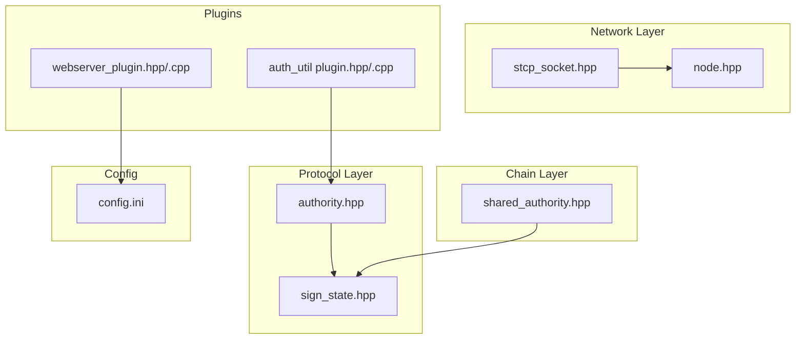
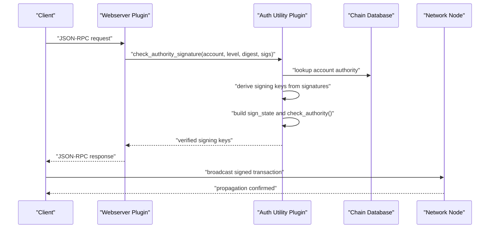
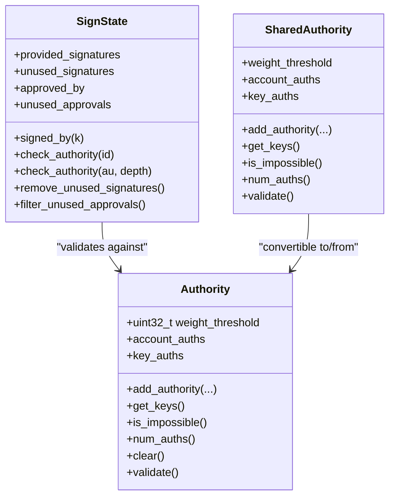
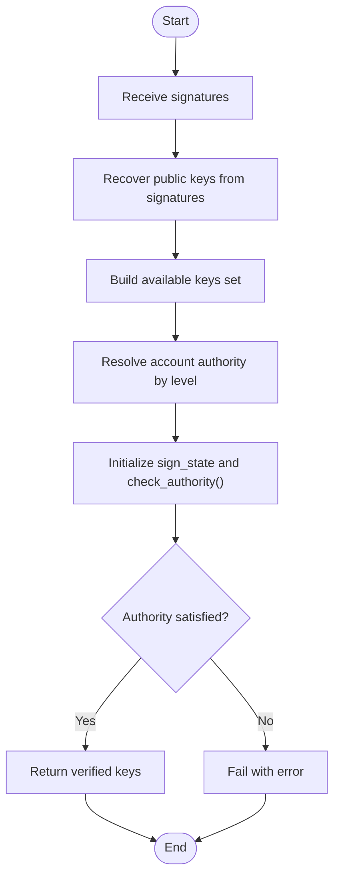
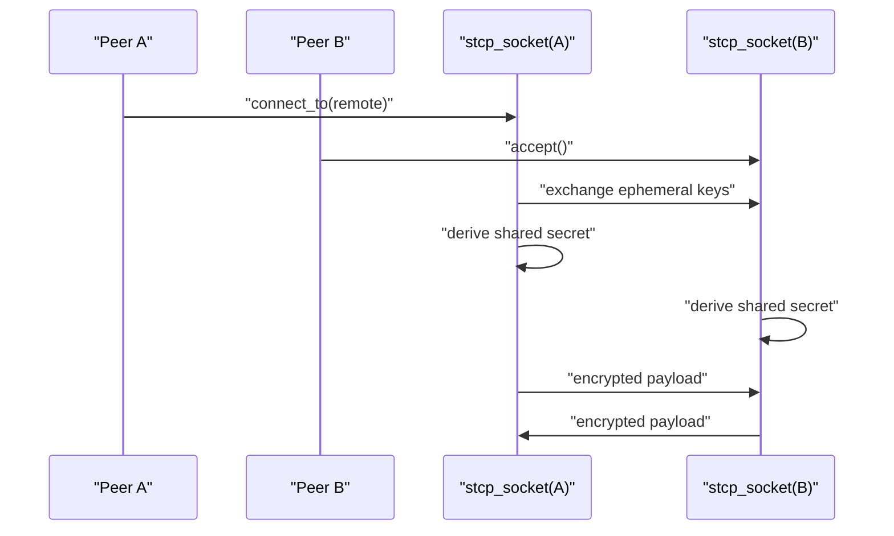
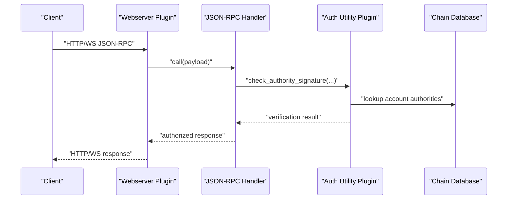
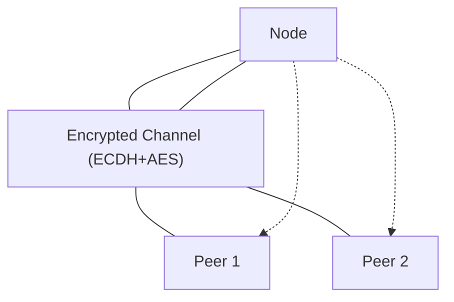
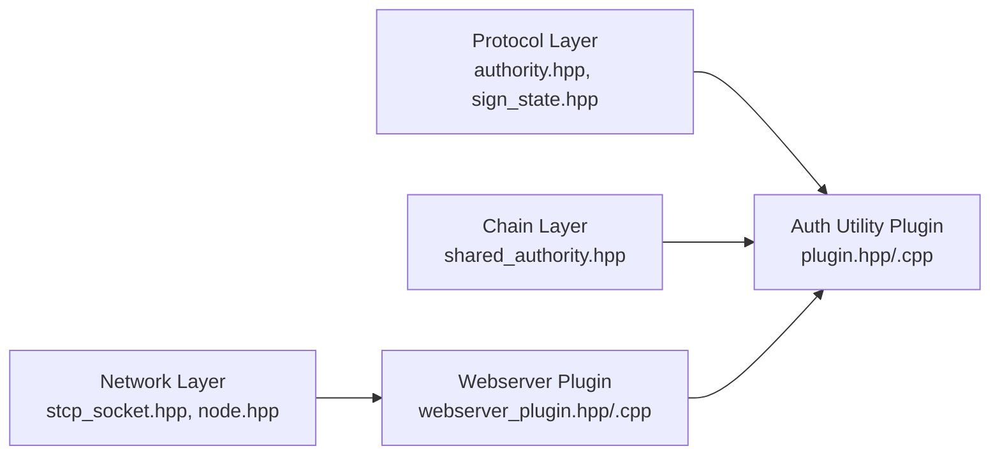

# Security Implementation

<cite>
**Referenced Files in This Document**
- [authority.hpp](file://libraries/protocol/include/graphene/protocol/authority.hpp)
- [shared_authority.hpp](file://libraries/chain/include/graphene/chain/shared_authority.hpp)
- [sign_state.hpp](file://libraries/protocol/include/graphene/protocol/sign_state.hpp)
- [sign_state.cpp](file://libraries/protocol/sign_state.cpp)
- [shared_authority.cpp](file://libraries/chain/shared_authority.cpp)
- [stcp_socket.hpp](file://libraries/network/include/graphene/network/stcp_socket.hpp)
- [stcp_socket.cpp](file://libraries/network/stcp_socket.cpp)
- [node.hpp](file://libraries/network/include/graphene/network/node.hpp)
- [plugin.hpp](file://plugins/auth_util/include/graphene/plugins/auth_util/plugin.hpp)
- [plugin.cpp](file://plugins/auth_util/plugin.cpp)
- [webserver_plugin.hpp](file://plugins/webserver/include/graphene/plugins/webserver/webserver_plugin.hpp)
- [webserver_plugin.cpp](file://plugins/webserver/webserver_plugin.cpp)
- [config.ini](file://share/vizd/config/config.ini)
</cite>

## Table of Contents
1. [Introduction](#introduction)
2. [Project Structure](#project-structure)
3. [Core Components](#core-components)
4. [Architecture Overview](#architecture-overview)
5. [Detailed Component Analysis](#detailed-component-analysis)
6. [Dependency Analysis](#dependency-analysis)
7. [Performance Considerations](#performance-considerations)
8. [Troubleshooting Guide](#troubleshooting-guide)
9. [Conclusion](#conclusion)
10. [Appendices](#appendices)

## Introduction
This document provides comprehensive security implementation documentation for the VIZ CPP Node. It covers cryptographic security (digital signature verification, key management, secure communications), authority and multi-signature systems, API authentication and authorization, network security, vulnerability assessment, best practices for plugin development, and operational security procedures. The goal is to help operators, developers, and auditors understand how security is implemented and how to extend or maintain it safely.

## Project Structure
Security-relevant components are distributed across:
- Protocol layer: cryptographic primitives, authorities, and signature validation logic
- Chain layer: shared-memory compatible authority representation
- Network layer: encrypted peer-to-peer transport
- Plugins: API exposure and webserver hosting
- Configuration: runtime security-related settings

**Diagram sources**
- [authority.hpp](file://libraries/protocol/include/graphene/protocol/authority.hpp#L9-L57)
- [sign_state.hpp](file://libraries/protocol/include/graphene/protocol/sign_state.hpp#L10-L42)
- [shared_authority.hpp](file://libraries/chain/include/graphene/chain/shared_authority.hpp#L20-L100)
- [stcp_socket.hpp](file://libraries/network/include/graphene/network/stcp_socket.hpp#L37-L93)
- [node.hpp](file://libraries/network/include/graphene/network/node.hpp#L190-L304)
- [plugin.hpp](file://plugins/auth_util/include/graphene/plugins/auth_util/plugin.hpp#L21-L54)
- [plugin.cpp](file://plugins/auth_util/plugin.cpp#L31-L78)
- [webserver_plugin.hpp](file://plugins/webserver/include/graphene/plugins/webserver/webserver_plugin.hpp#L32-L57)
- [webserver_plugin.cpp](file://plugins/webserver/webserver_plugin.cpp#L112-L165)
- [config.ini](file://share/vizd/config/config.ini)

**Section sources**
- [authority.hpp](file://libraries/protocol/include/graphene/protocol/authority.hpp#L1-L115)
- [shared_authority.hpp](file://libraries/chain/include/graphene/chain/shared_authority.hpp#L1-L113)
- [sign_state.hpp](file://libraries/protocol/include/graphene/protocol/sign_state.hpp#L1-L45)
- [stcp_socket.hpp](file://libraries/network/include/graphene/network/stcp_socket.hpp#L1-L99)
- [node.hpp](file://libraries/network/include/graphene/network/node.hpp#L1-L355)
- [plugin.hpp](file://plugins/auth_util/include/graphene/plugins/auth_util/plugin.hpp#L1-L60)
- [plugin.cpp](file://plugins/auth_util/plugin.cpp#L1-L99)
- [webserver_plugin.hpp](file://plugins/webserver/include/graphene/plugins/webserver/webserver_plugin.hpp#L1-L62)
- [webserver_plugin.cpp](file://plugins/webserver/webserver_plugin.cpp#L1-L336)
- [config.ini](file://share/vizd/config/config.ini)

## Core Components
- Digital signature verification and authority checks:
  - Authority model with thresholds and weighted participants
  - Signature state engine to validate authorities recursively
- Key management:
  - Public key extraction from signatures
  - Shared authority for shared memory compatibility
- Secure communications:
  - ECDH-based per-connection AES encryption for peer transport
- API exposure:
  - Webserver plugin serving JSON-RPC over HTTP/WebSocket
  - Authorization via account authority and signature validation

Key implementation references:
- Authority and classification: [authority.hpp](file://libraries/protocol/include/graphene/protocol/authority.hpp#L9-L57)
- Signature state and recursion depth: [sign_state.hpp](file://libraries/protocol/include/graphene/protocol/sign_state.hpp#L10-L42)
- Shared authority for chain storage: [shared_authority.hpp](file://libraries/chain/include/graphene/chain/shared_authority.hpp#L20-L100)
- Encrypted peer transport: [stcp_socket.hpp](file://libraries/network/include/graphene/network/stcp_socket.hpp#L37-L93)
- Webserver plugin endpoints: [webserver_plugin.hpp](file://plugins/webserver/include/graphene/plugins/webserver/webserver_plugin.hpp#L32-L57)

**Section sources**
- [authority.hpp](file://libraries/protocol/include/graphene/protocol/authority.hpp#L9-L57)
- [sign_state.hpp](file://libraries/protocol/include/graphene/protocol/sign_state.hpp#L10-L42)
- [shared_authority.hpp](file://libraries/chain/include/graphene/chain/shared_authority.hpp#L20-L100)
- [stcp_socket.hpp](file://libraries/network/include/graphene/network/stcp_socket.hpp#L37-L93)
- [webserver_plugin.hpp](file://plugins/webserver/include/graphene/plugins/webserver/webserver_plugin.hpp#L32-L57)

## Architecture Overview
The security architecture integrates cryptographic checks, authority validation, and secure transport. At runtime:
- Clients submit transactions with signatures
- The node validates signatures against account authorities
- Transactions are propagated securely over encrypted peer links
- APIs are exposed via a configurable webserver

**Diagram sources**
- [plugin.cpp](file://plugins/auth_util/plugin.cpp#L31-L78)
- [sign_state.hpp](file://libraries/protocol/include/graphene/protocol/sign_state.hpp#L10-L42)
- [webserver_plugin.cpp](file://plugins/webserver/webserver_plugin.cpp#L192-L246)
- [node.hpp](file://libraries/network/include/graphene/network/node.hpp#L258-L262)

## Detailed Component Analysis

### Digital Signature Verification and Authority System
- Authority model:
  - Threshold-weighted participation for accounts
  - Support for account and key authorities
  - Classification enum for roles (master, active, key, regular)
- Signature state engine:
  - Builds a set of provided signatures
  - Recursively resolves nested authorities up to a maximum depth
  - Filters unused approvals and signatures
- Shared authority:
  - Compatible with shared memory allocation for chain objects

**Diagram sources**
- [authority.hpp](file://libraries/protocol/include/graphene/protocol/authority.hpp#L9-L57)
- [sign_state.hpp](file://libraries/protocol/include/graphene/protocol/sign_state.hpp#L10-L42)
- [shared_authority.hpp](file://libraries/chain/include/graphene/chain/shared_authority.hpp#L20-L100)

**Section sources**
- [authority.hpp](file://libraries/protocol/include/graphene/protocol/authority.hpp#L9-L57)
- [sign_state.hpp](file://libraries/protocol/include/graphene/protocol/sign_state.hpp#L10-L42)
- [shared_authority.hpp](file://libraries/chain/include/graphene/chain/shared_authority.hpp#L20-L100)
- [sign_state.cpp](file://libraries/protocol/sign_state.cpp)
- [shared_authority.cpp](file://libraries/chain/shared_authority.cpp)

### Key Management and Signature Extraction
- Extract signing keys from provided signatures using deterministic recovery
- Build a set of available keys for authority checks
- Validate authorities against account active/master/regular levels

**Diagram sources**
- [plugin.cpp](file://plugins/auth_util/plugin.cpp#L31-L78)
- [sign_state.hpp](file://libraries/protocol/include/graphene/protocol/sign_state.hpp#L10-L42)

**Section sources**
- [plugin.cpp](file://plugins/auth_util/plugin.cpp#L31-L78)

### Secure Communication Protocols (Peer Transport)
- ECDH key exchange establishes a shared secret per connection
- AES encoder/decoder streams protect message payloads
- TCP socket wrapper supports read/write buffering and flushing

**Diagram sources**
- [stcp_socket.hpp](file://libraries/network/include/graphene/network/stcp_socket.hpp#L37-L93)
- [stcp_socket.cpp](file://libraries/network/stcp_socket.cpp)

**Section sources**
- [stcp_socket.hpp](file://libraries/network/include/graphene/network/stcp_socket.hpp#L37-L93)
- [stcp_socket.cpp](file://libraries/network/stcp_socket.cpp)

### API Authentication and Authorization
- Webserver plugin exposes JSON-RPC over HTTP and WebSocket
- Requests are dispatched to registered handlers on the application’s io_service thread
- Authorization is enforced by the auth_util plugin, which verifies signatures against account authorities

**Diagram sources**
- [webserver_plugin.cpp](file://plugins/webserver/webserver_plugin.cpp#L192-L246)
- [plugin.cpp](file://plugins/auth_util/plugin.cpp#L31-L78)

**Section sources**
- [webserver_plugin.hpp](file://plugins/webserver/include/graphene/plugins/webserver/webserver_plugin.hpp#L32-L57)
- [webserver_plugin.cpp](file://plugins/webserver/webserver_plugin.cpp#L112-L165)
- [plugin.hpp](file://plugins/auth_util/include/graphene/plugins/auth_util/plugin.hpp#L21-L54)
- [plugin.cpp](file://plugins/auth_util/plugin.cpp#L31-L78)

### Network Security Measures
- Peer authentication via encrypted channels prevents passive eavesdropping
- Node maintains peer database and propagation timing metadata
- Bandwidth limits and advanced parameters can be configured for operational control

**Diagram sources**
- [node.hpp](file://libraries/network/include/graphene/network/node.hpp#L190-L304)
- [stcp_socket.hpp](file://libraries/network/include/graphene/network/stcp_socket.hpp#L37-L93)

**Section sources**
- [node.hpp](file://libraries/network/include/graphene/network/node.hpp#L190-L304)
- [stcp_socket.hpp](file://libraries/network/include/graphene/network/stcp_socket.hpp#L37-L93)

### Vulnerability Assessment Procedures
- Common risks:
  - Insufficient signature validation leading to unauthorized operations
  - Weak randomness or reused nonces in cryptographic contexts
  - Man-in-the-middle attacks on unencrypted RPC endpoints
  - Denial-of-service via oversized payloads or excessive concurrent requests
- Penetration testing approaches:
  - Validate authority bypass attempts by submitting malformed signatures
  - Test recursion depth limits and resource exhaustion under heavy nested authorities
  - Verify transport encryption and handshake integrity
  - Stress test webserver endpoints for rate-limiting and memory exhaustion
- Audit methodology:
  - Static analysis of authority thresholds and recursion bounds
  - Dynamic testing of signature recovery and authority resolution paths
  - Network capture analysis to confirm encrypted transport usage
  - Review configuration files for exposed endpoints and weak defaults

[No sources needed since this section provides general guidance]

### Security Best Practices for Plugin Development
- Input validation:
  - Reject malformed or oversized payloads at plugin boundaries
  - Enforce strict schema validation for JSON-RPC arguments
- Secure coding patterns:
  - Prefer constant-time comparisons for secrets
  - Avoid storing plaintext credentials; derive keys securely
- Threat modeling:
  - Enumerate trusted vs. untrusted inputs
  - Model actor permissions per account authority levels
- Example patterns:
  - Use the existing auth_util API to validate signatures before processing sensitive operations
  - Leverage the webserver plugin’s thread pool sizing to manage resource consumption

[No sources needed since this section provides general guidance]

### Practical Examples for Custom Plugins
- Implementing signature verification:
  - Use the auth_util API to validate signatures against account authorities before applying state changes
  - Reference: [plugin.cpp](file://plugins/auth_util/plugin.cpp#L31-L78)
- Exposing a secure API:
  - Register JSON-RPC endpoints via the webserver plugin and enforce authorization inside the handler
  - Reference: [webserver_plugin.cpp](file://plugins/webserver/webserver_plugin.cpp#L192-L246)
- Integrating encrypted transport:
  - For inter-node communication, rely on the built-in stcp_socket for ECDH-based encryption
  - Reference: [stcp_socket.hpp](file://libraries/network/include/graphene/network/stcp_socket.hpp#L37-L93)

**Section sources**
- [plugin.cpp](file://plugins/auth_util/plugin.cpp#L31-L78)
- [webserver_plugin.cpp](file://plugins/webserver/webserver_plugin.cpp#L192-L246)
- [stcp_socket.hpp](file://libraries/network/include/graphene/network/stcp_socket.hpp#L37-L93)

### Security Monitoring, Incident Response, and Updates
- Monitoring:
  - Track peer connection counts, bandwidth usage, and propagation delays
  - Monitor webserver thread pool saturation and error rates
- Incident response:
  - Isolate affected endpoints, rotate keys, and re-validate authorities
  - Review logs around failed signature validations and authority checks
- Updates:
  - Apply hardforks and protocol upgrades that adjust authority thresholds or signature validation rules
  - Update transport encryption parameters and cipher suites as needed

[No sources needed since this section provides general guidance]

## Dependency Analysis
The security subsystem exhibits clear separation of concerns:
- Protocol and chain layers define the authority model and signature validation
- Network layer enforces transport security
- Plugins expose APIs and orchestrate authorization

**Diagram sources**
- [authority.hpp](file://libraries/protocol/include/graphene/protocol/authority.hpp#L9-L57)
- [sign_state.hpp](file://libraries/protocol/include/graphene/protocol/sign_state.hpp#L10-L42)
- [shared_authority.hpp](file://libraries/chain/include/graphene/chain/shared_authority.hpp#L20-L100)
- [stcp_socket.hpp](file://libraries/network/include/graphene/network/stcp_socket.hpp#L37-L93)
- [node.hpp](file://libraries/network/include/graphene/network/node.hpp#L190-L304)
- [plugin.hpp](file://plugins/auth_util/include/graphene/plugins/auth_util/plugin.hpp#L21-L54)
- [plugin.cpp](file://plugins/auth_util/plugin.cpp#L31-L78)
- [webserver_plugin.hpp](file://plugins/webserver/include/graphene/plugins/webserver/webserver_plugin.hpp#L32-L57)
- [webserver_plugin.cpp](file://plugins/webserver/webserver_plugin.cpp#L112-L165)

**Section sources**
- [authority.hpp](file://libraries/protocol/include/graphene/protocol/authority.hpp#L9-L57)
- [sign_state.hpp](file://libraries/protocol/include/graphene/protocol/sign_state.hpp#L10-L42)
- [shared_authority.hpp](file://libraries/chain/include/graphene/chain/shared_authority.hpp#L20-L100)
- [stcp_socket.hpp](file://libraries/network/include/graphene/network/stcp_socket.hpp#L37-L93)
- [node.hpp](file://libraries/network/include/graphene/network/node.hpp#L190-L304)
- [plugin.hpp](file://plugins/auth_util/include/graphene/plugins/auth_util/plugin.hpp#L21-L54)
- [plugin.cpp](file://plugins/auth_util/plugin.cpp#L31-L78)
- [webserver_plugin.hpp](file://plugins/webserver/include/graphene/plugins/webserver/webserver_plugin.hpp#L32-L57)
- [webserver_plugin.cpp](file://plugins/webserver/webserver_plugin.cpp#L112-L165)

## Performance Considerations
- Signature validation cost scales with authority depth and key count; tune recursion limits and key sets accordingly
- Webserver thread pool size impacts throughput under load; monitor queue lengths and latency
- Network bandwidth limits prevent abuse while maintaining propagation performance

[No sources needed since this section provides general guidance]

## Troubleshooting Guide
- Signature validation failures:
  - Confirm account authority levels and weights
  - Verify signature recovery produces expected public keys
  - Check recursion depth and nested authority chains
- Transport errors:
  - Validate ECDH handshake completion and shared secret derivation
  - Inspect TCP socket read/write buffers and flush behavior
- Webserver issues:
  - Ensure endpoints resolve and ports are available
  - Confirm thread pool size adequate for expected concurrency

**Section sources**
- [plugin.cpp](file://plugins/auth_util/plugin.cpp#L31-L78)
- [stcp_socket.hpp](file://libraries/network/include/graphene/network/stcp_socket.hpp#L37-L93)
- [webserver_plugin.cpp](file://plugins/webserver/webserver_plugin.cpp#L266-L312)

## Conclusion
VIZ CPP Node implements a robust security model centered on threshold-based authorities, deterministic signature verification, and encrypted peer transport. Operators should focus on proper configuration, continuous monitoring, and disciplined plugin development practices to maintain a secure deployment. Regular audits, updates, and incident response procedures will further strengthen resilience against evolving threats.

[No sources needed since this section summarizes without analyzing specific files]

## Appendices
- Configuration highlights for security:
  - Configure webserver endpoints and thread pool size
  - Ensure encrypted peer transport is enabled and properly bound
  - Limit bandwidth and manage peer lists for operational safety

**Section sources**
- [config.ini](file://share/vizd/config/config.ini)