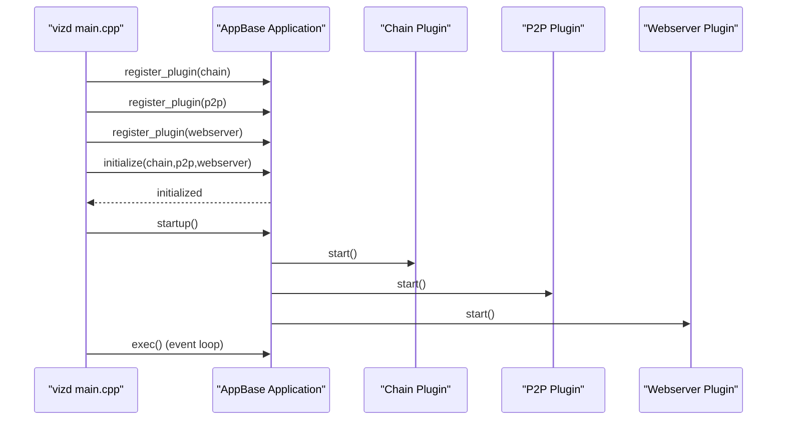
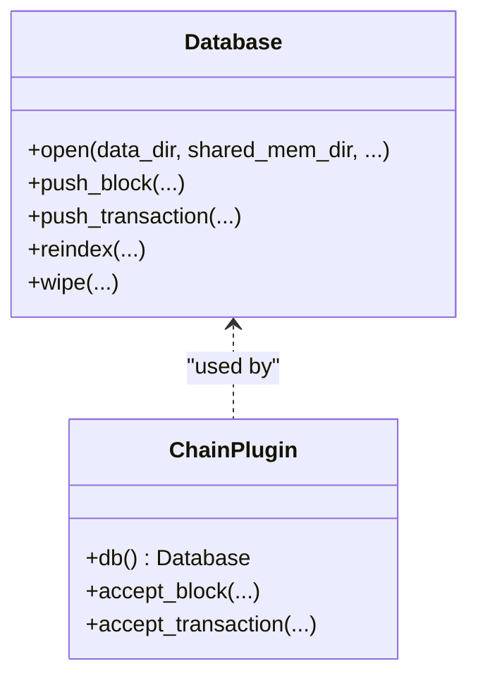
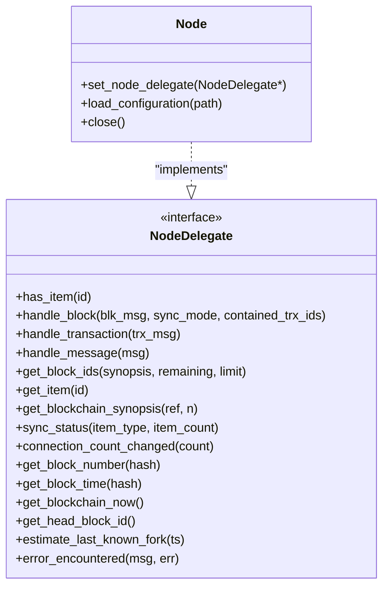
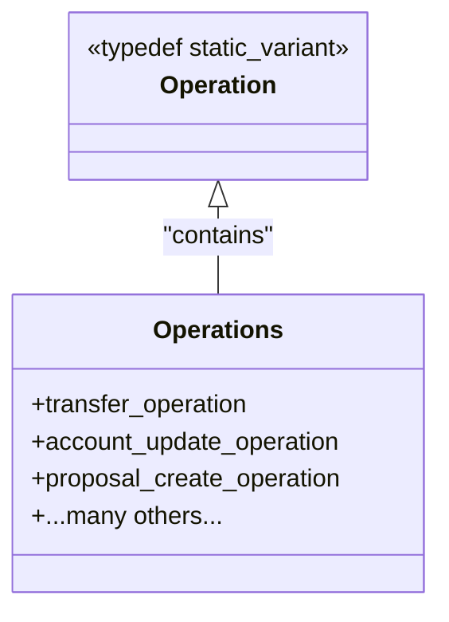
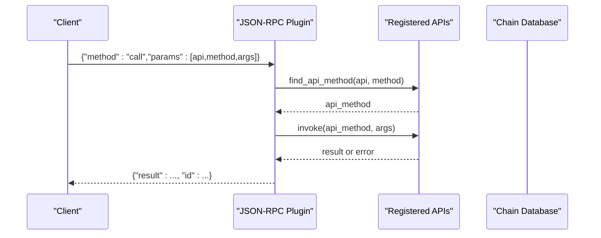
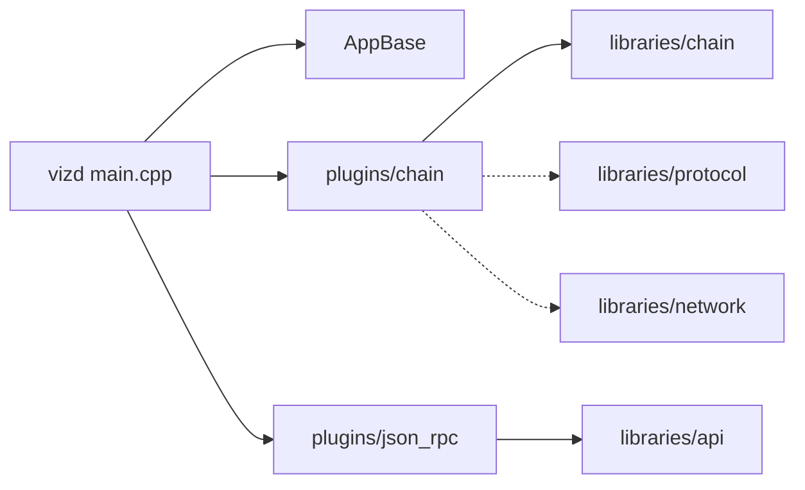

# Architecture Overview

<cite>
**Referenced Files in This Document**
- [README.md](file://README.md)
- [CMakeLists.txt](file://CMakeLists.txt)
- [libraries/CMakeLists.txt](file://libraries/CMakeLists.txt)
- [plugins/CMakeLists.txt](file://plugins/CMakeLists.txt)
- [programs/vizd/main.cpp](file://programs/vizd/main.cpp)
- [libraries/chain/include/graphene/chain/database.hpp](file://libraries/chain/include/graphene/chain/database.hpp)
- [libraries/network/include/graphene/network/node.hpp](file://libraries/network/include/graphene/network/node.hpp)
- [libraries/protocol/include/graphene/protocol/operations.hpp](file://libraries/protocol/include/graphene/protocol/operations.hpp)
- [libraries/api/include/graphene/api/chain_api_properties.hpp](file://libraries/api/include/graphene/api/chain_api_properties.hpp)
- [libraries/wallet/include/graphene/wallet/wallet.hpp](file://libraries/wallet/include/graphene/wallet/wallet.hpp)
- [plugins/chain/plugin.cpp](file://plugins/chain/plugin.cpp)
- [plugins/json_rpc/plugin.cpp](file://plugins/json_rpc/plugin.cpp)
</cite>

## Table of Contents
1. [Introduction](#introduction)
2. [Project Structure](#project-structure)
3. [Core Components](#core-components)
4. [Architecture Overview](#architecture-overview)
5. [Detailed Component Analysis](#detailed-component-analysis)
6. [Dependency Analysis](#dependency-analysis)
7. [Performance Considerations](#performance-considerations)
8. [Troubleshooting Guide](#troubleshooting-guide)
9. [Conclusion](#conclusion)
10. [Appendices](#appendices)

## Introduction
This document describes the architecture of the VIZ C++ Node system. It explains how the main vizd process orchestrates core libraries (chain, protocol, network, wallet), the plugin-based extension mechanism, and external dependencies. It also documents the event-driven observer pattern, data flow from JSON-RPC requests through plugins to database operations, and system boundaries for peer communication, API handling, and persistent state management. Cross-cutting concerns such as performance, security, and monitoring are addressed alongside architectural decisions like the use of C++ for performance, Boost.Signals2 for event handling, and layered separation of concerns.

## Project Structure
The repository is organized around a layered design:
- Top-level build and configuration: CMake and third-party dependencies
- Libraries: chain, protocol, network, api, utilities, time, wallet
- Plugins: modular feature extensions (chain, p2p, json_rpc, database_api, etc.)
- Programs: vizd (daemon), cli_wallet, utilities
- Share: configuration templates, Dockerfiles, seed nodes

```mermaid
graph TB
subgraph "Top-level"
CMK["CMakeLists.txt"]
LIBS_CMK["libraries/CMakeLists.txt"]
PLUG_CMK["plugins/CMakeLists.txt"]
end
subgraph "Libraries"
L_CHAIN["libraries/chain"]
L_PROTOCOL["libraries/protocol"]
L_NETWORK["libraries/network"]
L_API["libraries/api"]
L_UTIL["libraries/utilities"]
L_TIME["libraries/time"]
L_WALLET["libraries/wallet"]
end
subgraph "Plugins"
P_CHAIN["plugins/chain"]
P_JSONRPC["plugins/json_rpc"]
P_DB_API["plugins/database_api"]
P_P2P["plugins/p2p"]
P_WBS["plugins/webserver"]
P_WITNESS["plugins/witness"]
P_TAGS["plugins/tags"]
P_ACCOUNT_HISTORY["plugins/account_history"]
P_ACCOUNT_BY_KEY["plugins/account_by_key"]
P_PRIVATE_MESSAGE["plugins/private_message"]
P_AUTH_UTIL["plugins/auth_util"]
P_DEBUG["plugins/debug_node"]
P_RAW_BLOCK["plugins/raw_block"]
P_BLOCK_INFO["plugins/block_info"]
P_FOLLOW["plugins/follow"]
P_COMMITTEE_API["plugins/committee_api"]
P_INVITE_API["plugins/invite_api"]
P_PAID_SUBSCRIPTION_API["plugins/paid_subscription_api"]
P_CUSTOM_PROTOCOL_API["plugins/custom_protocol_api"]
end
subgraph "Programs"
PR_VIZD["programs/vizd"]
PR_CLI["programs/cli_wallet"]
PR_UTIL["programs/util"]
end
CMK --> LIBS_CMK
CMK --> PLUG_CMK
CMK --> PR_VIZD
CMK --> PR_CLI
CMK --> PR_UTIL
LIBS_CMK --> L_CHAIN
LIBS_CMK --> L_PROTOCOL
LIBS_CMK --> L_NETWORK
LIBS_CMK --> L_API
LIBS_CMK --> L_UTIL
LIBS_CMK --> L_TIME
LIBS_CMK --> L_WALLET
PLUG_CMK --> P_CHAIN
PLUG_CMK --> P_JSONRPC
PLUG_CMK --> P_DB_API
PLUG_CMK --> P_P2P
PLUG_CMK --> P_WBS
PLUG_CMK --> P_WITNESS
PLUG_CMK --> P_TAGS
PLUG_CMK --> P_ACCOUNT_HISTORY
PLUG_CMK --> P_ACCOUNT_BY_KEY
PLUG_CMK --> P_PRIVATE_MESSAGE
PLUG_CMK --> P_AUTH_UTIL
PLUG_CMK --> P_DEBUG
PLUG_CMK --> P_RAW_BLOCK
PLUG_CMK --> P_BLOCK_INFO
PLUG_CMK --> P_FOLLOW
PLUG_CMK --> P_COMMITTEE_API
PLUG_CMK --> P_INVITE_API
PLUG_CMK --> P_PAID_SUBSCRIPTION_API
PLUG_CMK --> P_CUSTOM_PROTOCOL_API
```



**Diagram sources**
- [CMakeLists.txt](file://CMakeLists.txt#L210-L213)
- [libraries/CMakeLists.txt](file://libraries/CMakeLists.txt#L1-L8)
- [plugins/CMakeLists.txt](file://plugins/CMakeLists.txt#L1-L12)

**Section sources**
- [CMakeLists.txt](file://CMakeLists.txt#L1-L277)
- [libraries/CMakeLists.txt](file://libraries/CMakeLists.txt#L1-L8)
- [plugins/CMakeLists.txt](file://plugins/CMakeLists.txt#L1-L12)

## Core Components
- vizd process: Initializes plugins, sets logging, starts the event loop, and manages lifecycle.
- Chain library: Core blockchain state machine, fork database, block/tx validation, and persistence.
- Protocol library: Operation definitions, transactions, and chain-specific types.
- Network library: Peer-to-peer networking, message handling, and synchronization.
- Wallet library: Remote node API integration and transaction construction utilities.
- Plugin system: Modular features exposed via APIs and hooks integrated into the app lifecycle.

Key architectural anchors:
- Event-driven observer pattern via fc::signals in the chain database.
- JSON-RPC plugin routing to registered APIs.
- Plugin registration and initialization in vizd’s main entry point.

**Section sources**
- [programs/vizd/main.cpp](file://programs/vizd/main.cpp#L106-L158)
- [libraries/chain/include/graphene/chain/database.hpp](file://libraries/chain/include/graphene/chain/database.hpp#L10-L12)
- [libraries/protocol/include/graphene/protocol/operations.hpp](file://libraries/protocol/include/graphene/protocol/operations.hpp#L1-L131)
- [libraries/network/include/graphene/network/node.hpp](file://libraries/network/include/graphene/network/node.hpp#L190-L200)
- [libraries/wallet/include/graphene/wallet/wallet.hpp](file://libraries/wallet/include/graphene/wallet/wallet.hpp#L96-L127)
- [plugins/json_rpc/plugin.cpp](file://plugins/json_rpc/plugin.cpp#L151-L200)

## Architecture Overview
High-level system boundaries and interactions:
- Internal boundaries: vizd process hosts plugins; plugins depend on libraries; chain database persists state; network interacts with peers; API plugins expose RPC endpoints.
- External boundaries: peers (other nodes), clients (wallets, applications), and optional external systems (e.g., MongoDB plugin).

```mermaid
graph TB
subgraph "vizd Process"
MAIN["programs/vizd/main.cpp<br/>Initialize plugins, logging, exec loop"]
APPBASE["AppBase Framework<br/>(external thirdparty)"]
end
subgraph "Core Libraries"
L_CHAIN["libraries/chain<br/>database.hpp"]
L_PROTOCOL["libraries/protocol<br/>operations.hpp"]
L_NETWORK["libraries/network<br/>node.hpp"]
L_API["libraries/api<br/>chain_api_properties.hpp"]
L_WALLET["libraries/wallet<br/>wallet.hpp"]
end
subgraph "Plugins"
P_CHAIN["plugins/chain<br/>plugin.cpp"]
P_JSONRPC["plugins/json_rpc<br/>plugin.cpp"]
P_DB_API["plugins/database_api"]
P_P2P["plugins/p2p"]
P_WBS["plugins/webserver"]
P_WITNESS["plugins/witness"]
P_TAGS["plugins/tags"]
P_ACCOUNT_HISTORY["plugins/account_history"]
P_ACCOUNT_BY_KEY["plugins/account_by_key"]
P_PRIVATE_MESSAGE["plugins/private_message"]
P_AUTH_UTIL["plugins/auth_util"]
P_DEBUG["plugins/debug_node"]
P_RAW_BLOCK["plugins/raw_block"]
P_BLOCK_INFO["plugins/block_info"]
P_FOLLOW["plugins/follow"]
P_COMMITTEE_API["plugins/committee_api"]
P_INVITE_API["plugins/invite_api"]
P_PAID_SUBSCRIPTION_API["plugins/paid_subscription_api"]
P_CUSTOM_PROTOCOL_API["plugins/custom_protocol_api"]
end
MAIN --> APPBASE
MAIN --> P_CHAIN
MAIN --> P_JSONRPC
MAIN --> P_DB_API
MAIN --> P_P2P
MAIN --> P_WBS
MAIN --> P_WITNESS
MAIN --> P_TAGS
MAIN --> P_ACCOUNT_HISTORY
MAIN --> P_ACCOUNT_BY_KEY
MAIN --> P_PRIVATE_MESSAGE
MAIN --> P_AUTH_UTIL
MAIN --> P_DEBUG
MAIN --> P_RAW_BLOCK
MAIN --> P_BLOCK_INFO
MAIN --> P_FOLLOW
MAIN --> P_COMMITTEE_API
MAIN --> P_INVITE_API
MAIN --> P_PAID_SUBSCRIPTION_API
MAIN --> P_CUSTOM_PROTOCOL_API
P_CHAIN --> L_CHAIN
P_JSONRPC --> L_API
P_DB_API --> L_API
P_P2P --> L_NETWORK
P_WBS --> L_API
P_WITNESS --> L_CHAIN
P_TAGS --> L_CHAIN
P_ACCOUNT_HISTORY --> L_CHAIN
P_ACCOUNT_BY_KEY --> L_CHAIN
P_PRIVATE_MESSAGE --> L_CHAIN
P_AUTH_UTIL --> L_CHAIN
P_DEBUG --> L_CHAIN
P_RAW_BLOCK --> L_CHAIN
P_BLOCK_INFO --> L_CHAIN
P_FOLLOW --> L_CHAIN
P_COMMITTEE_API --> L_CHAIN
P_INVITE_API --> L_CHAIN
P_PAID_SUBSCRIPTION_API --> L_CHAIN
P_CUSTOM_PROTOCOL_API --> L_PROTOCOL
```



**Diagram sources**
- [programs/vizd/main.cpp](file://programs/vizd/main.cpp#L61-L91)
- [libraries/chain/include/graphene/chain/database.hpp](file://libraries/chain/include/graphene/chain/database.hpp#L36-L50)
- [libraries/network/include/graphene/network/node.hpp](file://libraries/network/include/graphene/network/node.hpp#L190-L200)
- [libraries/protocol/include/graphene/protocol/operations.hpp](file://libraries/protocol/include/graphene/protocol/operations.hpp#L13-L102)
- [libraries/api/include/graphene/api/chain_api_properties.hpp](file://libraries/api/include/graphene/api/chain_api_properties.hpp#L11-L44)
- [libraries/wallet/include/graphene/wallet/wallet.hpp](file://libraries/wallet/include/graphene/wallet/wallet.hpp#L96-L127)
- [plugins/chain/plugin.cpp](file://plugins/chain/plugin.cpp#L169-L182)
- [plugins/json_rpc/plugin.cpp](file://plugins/json_rpc/plugin.cpp#L151-L200)

## Detailed Component Analysis

### vizd Process and Plugin Registration
- The main entry point registers and initializes core plugins, sets logging configuration, and starts the event loop.
- Plugins are conditionally compiled and registered, including chain, p2p, webserver, database_api, and many others.



**Diagram sources**
- [programs/vizd/main.cpp](file://programs/vizd/main.cpp#L61-L91)
- [programs/vizd/main.cpp](file://programs/vizd/main.cpp#L117-L122)
- [programs/vizd/main.cpp](file://programs/vizd/main.cpp#L139-L142)

**Section sources**
- [programs/vizd/main.cpp](file://programs/vizd/main.cpp#L106-L158)

### Chain Library and Observer Pattern
- The chain database extends chainbase and emits signals for events (e.g., block accepted, transaction applied).
- Plugins subscribe to these signals to implement features like history tracking, indexing, and notifications.



**Diagram sources**
- [libraries/chain/include/graphene/chain/database.hpp](file://libraries/chain/include/graphene/chain/database.hpp#L36-L50)
- [plugins/chain/plugin.cpp](file://plugins/chain/plugin.cpp#L169-L182)

**Section sources**
- [libraries/chain/include/graphene/chain/database.hpp](file://libraries/chain/include/graphene/chain/database.hpp#L10-L12)
- [plugins/chain/plugin.cpp](file://plugins/chain/plugin.cpp#L96-L167)

### Network Library and Peer Communication
- The network node defines a delegate interface for block/transaction handling and synchronization.
- It coordinates peer connections, message propagation, and blockchain sync status callbacks.



**Diagram sources**
- [libraries/network/include/graphene/network/node.hpp](file://libraries/network/include/graphene/network/node.hpp#L60-L167)
- [libraries/network/include/graphene/network/node.hpp](file://libraries/network/include/graphene/network/node.hpp#L190-L200)

**Section sources**
- [libraries/network/include/graphene/network/node.hpp](file://libraries/network/include/graphene/network/node.hpp#L190-L200)

### Protocol Layer and Operations
- The protocol layer defines the operation type union and related chain operations, virtual operations, and chain-specific types.
- This forms the basis for validation, signing, and evaluation in the chain library.



**Diagram sources**
- [libraries/protocol/include/graphene/protocol/operations.hpp](file://libraries/protocol/include/graphene/protocol/operations.hpp#L13-L102)

**Section sources**
- [libraries/protocol/include/graphene/protocol/operations.hpp](file://libraries/protocol/include/graphene/protocol/operations.hpp#L1-L131)

### API Layer and JSON-RPC
- The JSON-RPC plugin exposes a method registry and dispatch mechanism to route RPC calls to plugin APIs.
- It constructs responses and handles errors consistently.



**Diagram sources**
- [plugins/json_rpc/plugin.cpp](file://plugins/json_rpc/plugin.cpp#L151-L200)
- [plugins/json_rpc/plugin.cpp](file://plugins/json_rpc/plugin.cpp#L180-L200)

**Section sources**
- [plugins/json_rpc/plugin.cpp](file://plugins/json_rpc/plugin.cpp#L151-L200)

### Wallet Integration
- The wallet library integrates with remote node APIs and provides helpers for transaction building and signing.
- It relies on protocol types and chain constants for compatibility.

**Section sources**
- [libraries/wallet/include/graphene/wallet/wallet.hpp](file://libraries/wallet/include/graphene/wallet/wallet.hpp#L96-L127)

## Dependency Analysis
- Build-time: CMake aggregates libraries and plugins; thirdparty components are referenced externally.
- Runtime: vizd depends on appbase; plugins depend on libraries; chain database underpins most plugins.



**Diagram sources**
- [programs/vizd/main.cpp](file://programs/vizd/main.cpp#L61-L91)
- [libraries/CMakeLists.txt](file://libraries/CMakeLists.txt#L1-L8)
- [plugins/CMakeLists.txt](file://plugins/CMakeLists.txt#L1-L12)

**Section sources**
- [CMakeLists.txt](file://CMakeLists.txt#L210-L213)
- [libraries/CMakeLists.txt](file://libraries/CMakeLists.txt#L1-L8)
- [plugins/CMakeLists.txt](file://plugins/CMakeLists.txt#L1-L12)

## Performance Considerations
- C++ chosen for performance-critical components (validation, networking, persistence).
- Shared memory database (chainbase) optimized for fast reads/writes.
- Optional MongoDB plugin for analytics/offloading; controlled via build flags.
- Logging configuration supports JSON/console/file appenders for observability.
- Compiler flags tuned per platform; optional ccache support.

[No sources needed since this section provides general guidance]

## Troubleshooting Guide
- Logging configuration: The main process parses logging sections from config and applies fc::configure_logging.
- Exception handling: JSON-RPC plugin wraps transport exceptions and returns structured errors.
- Chain operations: Chain plugin validates blocks/transactions and can replay or wipe the database when corrupted.

**Section sources**
- [programs/vizd/main.cpp](file://programs/vizd/main.cpp#L211-L288)
- [plugins/json_rpc/plugin.cpp](file://plugins/json_rpc/plugin.cpp#L96-L136)
- [plugins/chain/plugin.cpp](file://plugins/chain/plugin.cpp#L134-L146)

## Conclusion
The VIZ C++ Node employs a modular, plugin-based architecture built atop robust core libraries. The vizd process orchestrates initialization and runtime, while plugins extend functionality safely. The chain database leverages an observer pattern for event-driven features, and JSON-RPC provides a clean API boundary. System boundaries separate peer communication, client APIs, and persistent state, enabling maintainability, scalability, and targeted optimizations.

[No sources needed since this section summarizes without analyzing specific files]

## Appendices

### System Context Diagram
```mermaid
graph TB
subgraph "External"
PEERS["Peers"]
CLIENTS["Wallets/Applications"]
end
subgraph "Node"
VIZD["vizd process"]
subgraph "Plugins"
P_CHAIN["chain"]
P_P2P["p2p"]
P_JSONRPC["json_rpc"]
P_DB_API["database_api"]
P_WBS["webserver"]
P_WITNESS["witness"]
P_TAGS["tags"]
P_ACCOUNT_HISTORY["account_history"]
P_ACCOUNT_BY_KEY["account_by_key"]
P_PRIVATE_MESSAGE["private_message"]
P_AUTH_UTIL["auth_util"]
P_DEBUG["debug_node"]
P_RAW_BLOCK["raw_block"]
P_BLOCK_INFO["block_info"]
P_FOLLOW["follow"]
P_COMMITTEE_API["committee_api"]
P_INVITE_API["invite_api"]
P_PAID_SUBSCRIPTION_API["paid_subscription_api"]
P_CUSTOM_PROTOCOL_API["custom_protocol_api"]
end
subgraph "Libraries"
L_CHAIN["chain"]
L_PROTOCOL["protocol"]
L_NETWORK["network"]
L_API["api"]
L_WALLET["wallet"]
end
end
PEERS <- --> P_P2P
CLIENTS <- --> P_JSONRPC
CLIENTS <- --> P_DB_API
CLIENTS <- --> P_WBS
VIZD --> P_CHAIN
VIZD --> P_P2P
VIZD --> P_JSONRPC
VIZD --> P_DB_API
VIZD --> P_WBS
VIZD --> P_WITNESS
VIZD --> P_TAGS
VIZD --> P_ACCOUNT_HISTORY
VIZD --> P_ACCOUNT_BY_KEY
VIZD --> P_PRIVATE_MESSAGE
VIZD --> P_AUTH_UTIL
VIZD --> P_DEBUG
VIZD --> P_RAW_BLOCK
VIZD --> P_BLOCK_INFO
VIZD --> P_FOLLOW
VIZD --> P_COMMITTEE_API
VIZD --> P_INVITE_API
VIZD --> P_PAID_SUBSCRIPTION_API
VIZD --> P_CUSTOM_PROTOCOL_API
P_CHAIN --> L_CHAIN
P_JSONRPC --> L_API
P_DB_API --> L_API
P_P2P --> L_NETWORK
P_WBS --> L_API
P_WITNESS --> L_CHAIN
P_TAGS --> L_CHAIN
P_ACCOUNT_HISTORY --> L_CHAIN
P_ACCOUNT_BY_KEY --> L_CHAIN
P_PRIVATE_MESSAGE --> L_CHAIN
P_AUTH_UTIL --> L_CHAIN
P_DEBUG --> L_CHAIN
P_RAW_BLOCK --> L_CHAIN
P_BLOCK_INFO --> L_CHAIN
P_FOLLOW --> L_CHAIN
P_COMMITTEE_API --> L_CHAIN
P_INVITE_API --> L_CHAIN
P_PAID_SUBSCRIPTION_API --> L_CHAIN
P_CUSTOM_PROTOCOL_API --> L_PROTOCOL
```

**Diagram sources**
- [README.md](file://README.md#L1-L53)
- [programs/vizd/main.cpp](file://programs/vizd/main.cpp#L61-L91)
- [libraries/chain/include/graphene/chain/database.hpp](file://libraries/chain/include/graphene/chain/database.hpp#L36-L50)
- [libraries/network/include/graphene/network/node.hpp](file://libraries/network/include/graphene/network/node.hpp#L190-L200)
- [libraries/protocol/include/graphene/protocol/operations.hpp](file://libraries/protocol/include/graphene/protocol/operations.hpp#L13-L102)
- [libraries/api/include/graphene/api/chain_api_properties.hpp](file://libraries/api/include/graphene/api/chain_api_properties.hpp#L11-L44)
- [libraries/wallet/include/graphene/wallet/wallet.hpp](file://libraries/wallet/include/graphene/wallet/wallet.hpp#L96-L127)
- [plugins/chain/plugin.cpp](file://plugins/chain/plugin.cpp#L169-L182)
- [plugins/json_rpc/plugin.cpp](file://plugins/json_rpc/plugin.cpp#L151-L200)