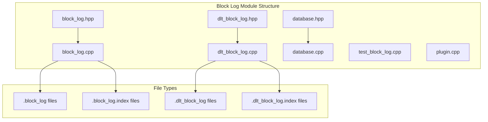
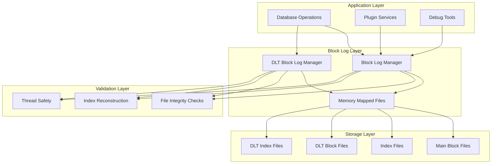
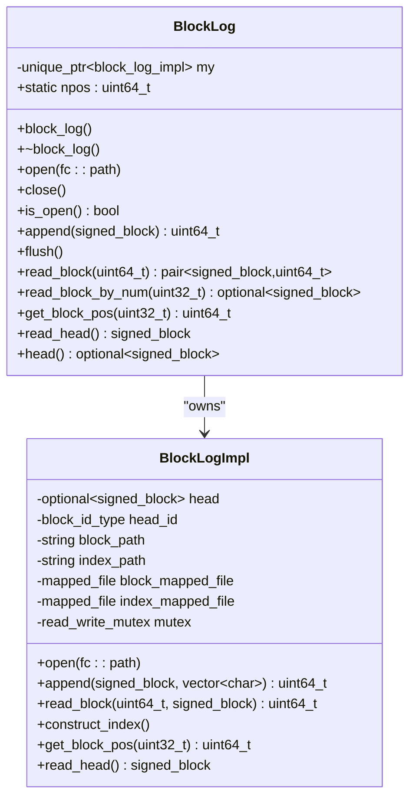
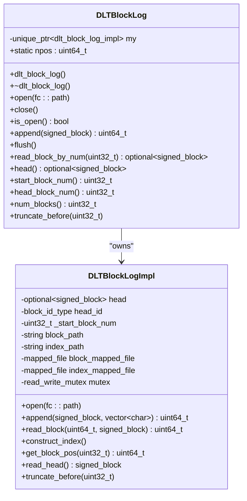
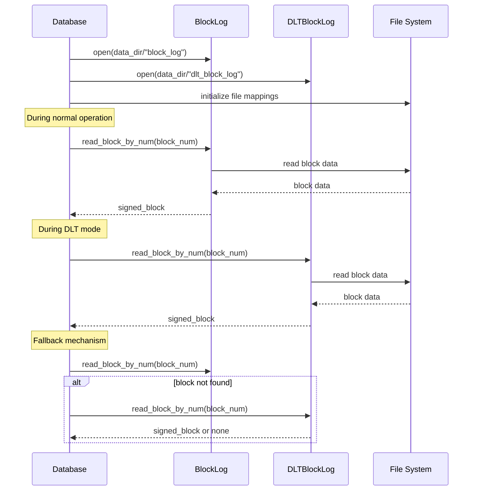
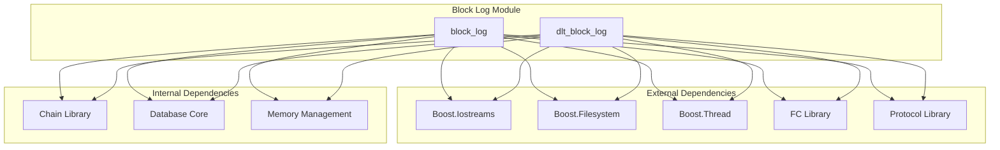

# Block Log Reader Module

<cite>
**Referenced Files in This Document**
- [block_log.hpp](file://libraries/chain/include/graphene/chain/block_log.hpp)
- [block_log.cpp](file://libraries/chain/block_log.cpp)
- [dlt_block_log.hpp](file://libraries/chain/include/graphene/chain/dlt_block_log.hpp)
- [dlt_block_log.cpp](file://libraries/chain/dlt_block_log.cpp)
- [database.hpp](file://libraries/chain/include/graphene/chain/database.hpp)
- [database.cpp](file://libraries/chain/database.cpp)
- [test_block_log.cpp](file://programs/util/test_block_log.cpp)
- [plugin.cpp](file://plugins/debug_node/plugin.cpp)
</cite>

## Table of Contents
1. [Introduction](#introduction)
2. [Project Structure](#project-structure)
3. [Core Components](#core-components)
4. [Architecture Overview](#architecture-overview)
5. [Detailed Component Analysis](#detailed-component-analysis)
6. [Dependency Analysis](#dependency-analysis)
7. [Performance Considerations](#performance-considerations)
8. [Troubleshooting Guide](#troubleshooting-guide)
9. [Conclusion](#conclusion)

## Introduction
The Block Log Reader Module is a critical component of the VIZ CPP Node that provides efficient access to blockchain data stored in append-only block log files. This module serves two primary purposes: traditional block log storage for full nodes and DLT (Snapshot-based) block log storage for lightweight nodes. The module implements memory-mapped file access patterns to achieve high-performance block retrieval while maintaining data integrity through robust validation mechanisms.

The module consists of two main classes: `block_log` for standard blockchain nodes and `dlt_block_log` for snapshot-based nodes. Both classes provide thread-safe access to block data through memory-mapped files, enabling fast random access to blocks by number and sequential traversal capabilities.

## Project Structure
The Block Log Reader Module is organized within the VIZ blockchain implementation under the chain library. The structure follows a clear separation of concerns with interface definitions in header files and implementation details in source files.

**Diagram sources**
- [block_log.hpp:1-75](file://libraries/chain/include/graphene/chain/block_log.hpp#L1-L75)
- [block_log.cpp:1-302](file://libraries/chain/block_log.cpp#L1-L302)
- [dlt_block_log.hpp:1-76](file://libraries/chain/include/graphene/chain/dlt_block_log.hpp#L1-L76)
- [dlt_block_log.cpp:1-414](file://libraries/chain/dlt_block_log.cpp#L1-L414)

**Section sources**
- [block_log.hpp:1-75](file://libraries/chain/include/graphene/chain/block_log.hpp#L1-L75)
- [dlt_block_log.hpp:1-76](file://libraries/chain/include/graphene/chain/dlt_block_log.hpp#L1-L76)

## Core Components
The Block Log Reader Module comprises two primary components that work together to provide comprehensive block storage and retrieval capabilities:

### Standard Block Log (`block_log`)
The standard block log provides traditional blockchain storage with a complete append-only log of all blocks. It supports:
- Memory-mapped file access for high performance
- Random access by block number through index files
- Sequential traversal capabilities
- Automatic index reconstruction when corrupted
- Thread-safe operations with reader-writer locks

### DLT Block Log (`dlt_block_log`)
The DLT block log is designed specifically for snapshot-based nodes that maintain only a rolling window of recent blocks. It provides:
- Offset-aware indexing for arbitrary starting block numbers
- Rolling window capability with configurable block limits
- Efficient truncation operations to manage storage
- Specialized handling for snapshot-loaded states
- Optimized for lightweight node operations

**Section sources**
- [block_log.hpp:38-71](file://libraries/chain/include/graphene/chain/block_log.hpp#L38-L71)
- [dlt_block_log.hpp:35-72](file://libraries/chain/include/graphene/chain/dlt_block_log.hpp#L35-L72)

## Architecture Overview
The Block Log Reader Module integrates deeply with the VIZ blockchain database system, providing essential block storage and retrieval capabilities. The architecture follows a layered approach with clear separation between storage, access, and application layers.

**Diagram sources**
- [database.cpp:229-231](file://libraries/chain/database.cpp#L229-L231)
- [database.cpp:569-580](file://libraries/chain/database.cpp#L569-L580)
- [block_log.cpp:134-193](file://libraries/chain/block_log.cpp#L134-L193)
- [dlt_block_log.cpp:161-209](file://libraries/chain/dlt_block_log.cpp#L161-L209)

The architecture ensures that block data is consistently available across different operational modes, supporting both full nodes with complete block histories and lightweight nodes with rolling block windows.

**Section sources**
- [database.hpp:567-568](file://libraries/chain/include/graphene/chain/database.hpp#L567-L568)
- [database.cpp:229-231](file://libraries/chain/database.cpp#L229-L231)

## Detailed Component Analysis

### Block Log Implementation Analysis
The block_log class implements a sophisticated memory-mapped file system for efficient block storage and retrieval. The implementation uses a doubly-linked list structure where each block is followed by its position in the file, enabling both forward and backward traversal.

**Diagram sources**
- [block_log.hpp:38-71](file://libraries/chain/include/graphene/chain/block_log.hpp#L38-L71)
- [block_log.cpp:15-227](file://libraries/chain/block_log.cpp#L15-L227)

The implementation employs several key design patterns:

#### Memory-Mapped File Access
The module uses Boost's memory-mapped file functionality to achieve zero-copy block access. This approach eliminates the overhead of traditional file I/O operations and enables direct memory access to block data.

#### Index-Based Random Access
The block log maintains a separate index file containing file positions for each block. This allows O(1) random access by block number through direct index calculation rather than sequential scanning.

#### Automatic Recovery Mechanisms
The implementation includes comprehensive recovery mechanisms that automatically detect and repair inconsistencies between block files and index files during initialization.

**Section sources**
- [block_log.cpp:105-113](file://libraries/chain/block_log.cpp#L105-L113)
- [block_log.cpp:115-132](file://libraries/chain/block_log.cpp#L115-L132)
- [block_log.cpp:134-193](file://libraries/chain/block_log.cpp#L134-L193)

### DLT Block Log Implementation Analysis
The dlt_block_log class extends the standard block log concept to support snapshot-based nodes with rolling window capabilities. Unlike the standard block log, it maintains an offset-aware index that can start from arbitrary block numbers.

**Diagram sources**
- [dlt_block_log.hpp:35-72](file://libraries/chain/include/graphene/chain/dlt_block_log.hpp#L35-L72)
- [dlt_block_log.cpp:18-277](file://libraries/chain/dlt_block_log.cpp#L18-L277)

The DLT implementation introduces several specialized features:

#### Offset-Aware Indexing
The index header stores the starting block number, enabling the calculation of index positions for any block within the rolling window. This design allows the log to maintain gaps at the beginning when blocks are truncated.

#### Rolling Window Management
The module supports dynamic truncation of old blocks while maintaining the rolling window constraint. This is essential for lightweight nodes that need to limit storage consumption.

#### Snapshot Mode Compatibility
The DLT block log is specifically designed to work with snapshot-based node operations where the main blockchain state is loaded from a snapshot rather than replaying the entire block history.

**Section sources**
- [dlt_block_log.cpp:161-209](file://libraries/chain/dlt_block_log.cpp#L161-L209)
- [dlt_block_log.cpp:356-411](file://libraries/chain/dlt_block_log.cpp#L356-L411)

### Database Integration Analysis
The Block Log Reader Module integrates seamlessly with the VIZ database system, providing transparent access to block data regardless of the operational mode.

**Diagram sources**
- [database.cpp:229-231](file://libraries/chain/database.cpp#L229-L231)
- [database.cpp:569-580](file://libraries/chain/database.cpp#L569-L580)
- [database.cpp:623-640](file://libraries/chain/database.cpp#L623-L640)

The integration provides several key benefits:

#### Transparent Fallback Mechanism
The database automatically attempts to retrieve blocks from the standard block log first, falling back to the DLT block log if the standard log doesn't contain the requested block. This design ensures compatibility across different node configurations.

#### Mode-Specific Behavior
The module adapts its behavior based on whether the node is operating in normal mode or DLT mode, optimizing performance and resource usage accordingly.

#### Consistent API Interface
Both block log implementations expose identical APIs, allowing the database to treat them uniformly regardless of the underlying storage mechanism.

**Section sources**
- [database.cpp:229-231](file://libraries/chain/database.cpp#L229-L231)
- [database.cpp:569-580](file://libraries/chain/database.cpp#L569-L580)
- [database.cpp:623-640](file://libraries/chain/database.cpp#L623-L640)

## Dependency Analysis
The Block Log Reader Module has well-defined dependencies that contribute to its modularity and maintainability. Understanding these dependencies is crucial for effective integration and troubleshooting.

**Diagram sources**
- [block_log.cpp:1-6](file://libraries/chain/block_log.cpp#L1-L6)
- [dlt_block_log.cpp:1-6](file://libraries/chain/dlt_block_log.cpp#L1-L6)

The dependency structure reveals several important characteristics:

### External Library Dependencies
The module relies on several Boost libraries for core functionality:
- **Boost.Iostreams**: Provides memory-mapped file capabilities essential for high-performance block access
- **Boost.Filesystem**: Handles file system operations including path manipulation and file existence checks
- **Boost.Thread**: Enables thread-safe operations through shared mutexes and RAII-based locking

### Internal Library Dependencies
The module integrates with VIZ's internal libraries:
- **FC Library**: Provides fundamental data structures and utilities used throughout the blockchain implementation
- **Protocol Library**: Defines the block structure and serialization formats used for block storage and retrieval

### Design Benefits
The dependency structure supports several design goals:
- **Modularity**: Clear separation between external and internal dependencies enables easier maintenance
- **Portability**: Minimal external dependencies reduce portability challenges
- **Performance**: Direct integration with VIZ's optimized data structures maximizes efficiency

**Section sources**
- [block_log.cpp:1-6](file://libraries/chain/block_log.cpp#L1-L6)
- [dlt_block_log.cpp:1-6](file://libraries/chain/dlt_block_log.cpp#L1-L6)

## Performance Considerations
The Block Log Reader Module is designed with performance as a primary concern, implementing several optimization strategies to minimize latency and maximize throughput.

### Memory-Mapped File Performance
The use of memory-mapped files eliminates the overhead of traditional file I/O operations by allowing direct memory access to block data. This approach provides several performance benefits:

- **Zero-Copy Access**: Blocks can be accessed directly from memory without additional copying operations
- **Predictable Latency**: Memory-mapped access provides consistent performance characteristics regardless of file size
- **Reduced System Calls**: Eliminates the overhead of frequent system calls associated with traditional file I/O

### Index-Based Random Access
The dual-file architecture with separate data and index files enables O(1) random access to blocks by number. The index file contains pre-calculated positions for each block, eliminating the need for sequential scanning.

### Thread-Safe Operations
The implementation uses reader-writer locks to balance concurrent access patterns:
- **Read Operations**: Multiple readers can access the block log simultaneously without blocking
- **Write Operations**: Exclusive access ensures data consistency during block appends
- **Lock Granularity**: Fine-grained locking minimizes contention in high-concurrency scenarios

### Storage Optimization Strategies
Several strategies are employed to optimize storage usage and access patterns:

#### Block Size Limits
The implementation enforces maximum block size limits to prevent memory allocation issues and ensure predictable performance characteristics.

#### File Resizing Operations
Blocks are appended using efficient file resizing operations that minimize fragmentation and maintain optimal file system performance.

#### Index Reconstruction Efficiency
When index corruption is detected, the reconstruction process is optimized to minimize downtime and ensure data integrity.

**Section sources**
- [block_log.cpp:73-88](file://libraries/chain/block_log.cpp#L73-L88)
- [dlt_block_log.cpp:83-98](file://libraries/chain/dlt_block_log.cpp#L83-L98)

## Troubleshooting Guide
The Block Log Reader Module includes comprehensive error handling and diagnostic capabilities to facilitate troubleshooting and maintenance operations.

### Common Issues and Solutions

#### Block Log Corruption Detection
The module implements automatic detection of block log corruption through multiple validation mechanisms:

**File Size Validation**: Ensures minimum file sizes are maintained to prevent access violations
**Position Verification**: Validates block positions using embedded position markers
**Index Consistency Checks**: Verifies that index entries correspond to actual block data

#### Recovery Procedures
When corruption is detected, the module follows systematic recovery procedures:

**Index Reconstruction**: Automatically rebuilds corrupted index files by scanning the main data file
**File Reinitialization**: Recreates missing or damaged files with appropriate initialization
**State Validation**: Verifies recovered state against expected block log characteristics

#### Performance Monitoring
The module provides several mechanisms for monitoring and diagnosing performance issues:

**Operation Timing**: Logs timing information for critical operations to identify performance bottlenecks
**Memory Usage Tracking**: Monitors memory-mapped file usage to prevent excessive memory consumption
**File System Health**: Continuously monitors file system health and reports potential issues

### Diagnostic Tools and Utilities
Several tools and utilities are available for troubleshooting block log issues:

#### Test Harness
The module includes a comprehensive test harness that demonstrates proper usage and validates functionality across different scenarios.

#### Debug Plugin Integration
The debug plugin provides interactive access to block log functionality, enabling developers to inspect block data and diagnose issues in real-time.

#### Logging and Monitoring
Extensive logging is implemented throughout the module to provide detailed information about operations, errors, and performance characteristics.

**Section sources**
- [block_log.cpp:115-132](file://libraries/chain/block_log.cpp#L115-L132)
- [dlt_block_log.cpp:125-159](file://libraries/chain/dlt_block_log.cpp#L125-L159)
- [test_block_log.cpp:1-54](file://programs/util/test_block_log.cpp#L1-L54)

## Conclusion
The Block Log Reader Module represents a sophisticated implementation of blockchain data storage and retrieval systems. Its dual-mode architecture supports both traditional full nodes and modern snapshot-based lightweight nodes, providing flexibility while maintaining high performance standards.

The module's design emphasizes several key principles:
- **Performance**: Memory-mapped files and index-based access enable fast block retrieval
- **Reliability**: Comprehensive error handling and automatic recovery mechanisms ensure data integrity
- **Flexibility**: Support for multiple operational modes accommodates diverse deployment scenarios
- **Maintainability**: Clean separation of concerns and modular design facilitate ongoing development and maintenance

The implementation demonstrates best practices in systems programming, combining low-level file system operations with high-level abstractions to create a robust and efficient block storage solution. The module serves as a foundation for the broader VIZ blockchain infrastructure, enabling reliable and scalable blockchain operations across various node configurations.

Future enhancements could focus on additional performance optimizations, expanded monitoring capabilities, and further simplification of the dual-mode architecture to reduce complexity while maintaining compatibility with existing deployments.