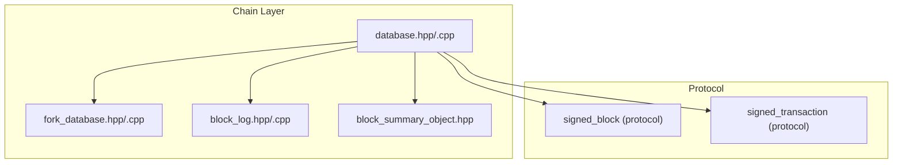
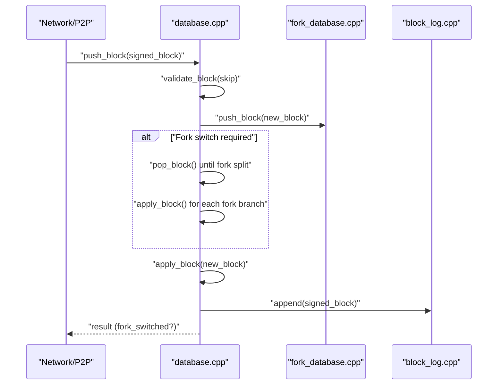
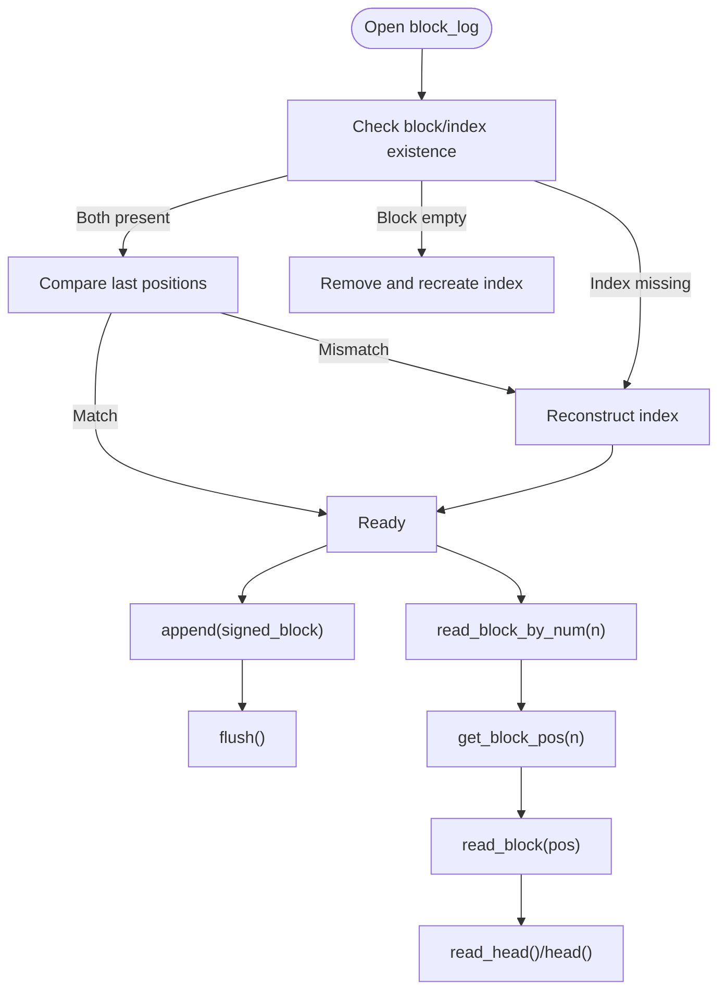
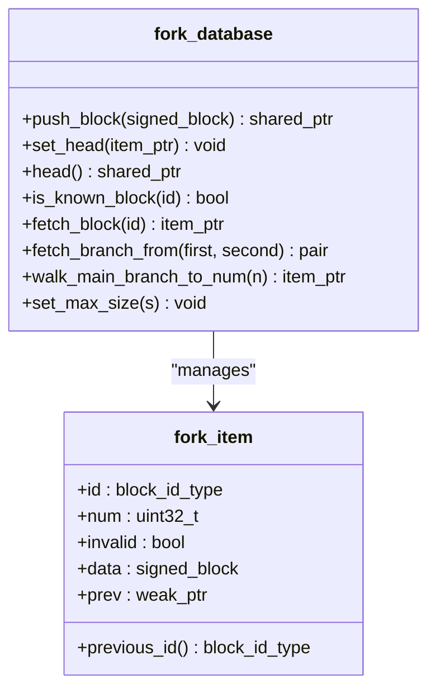
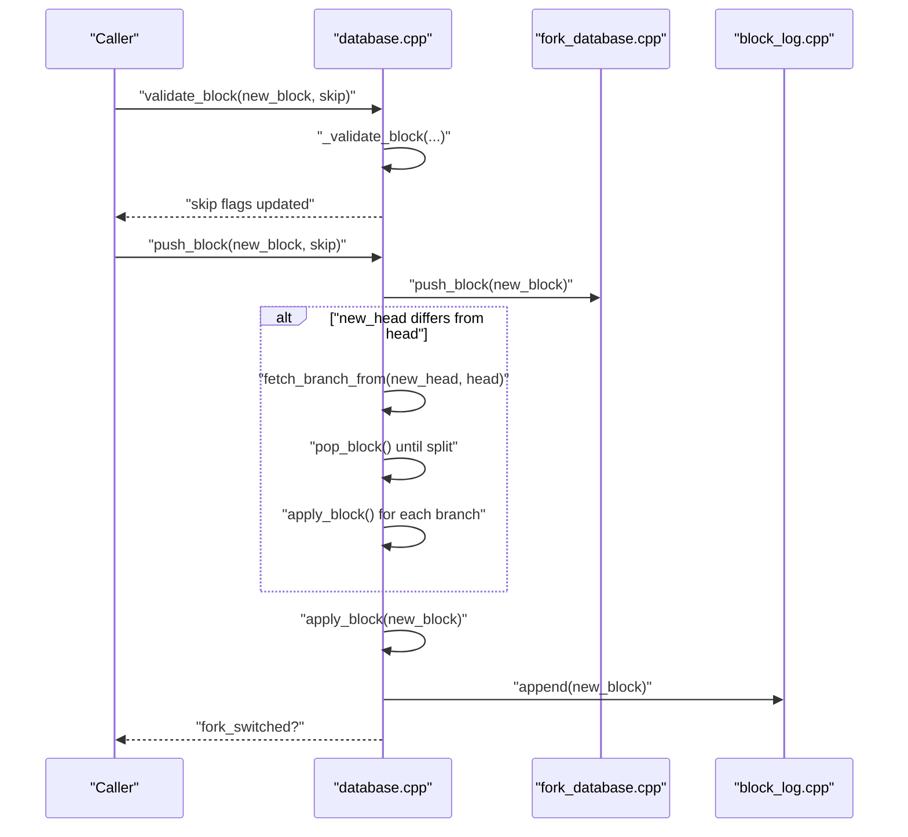
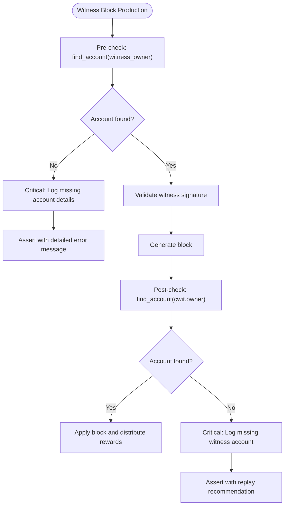
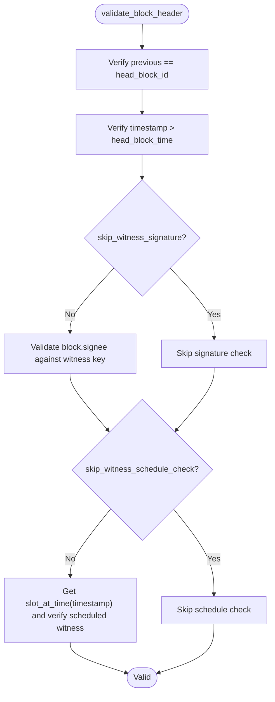
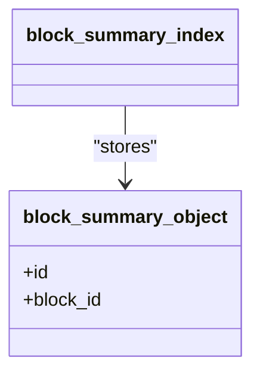
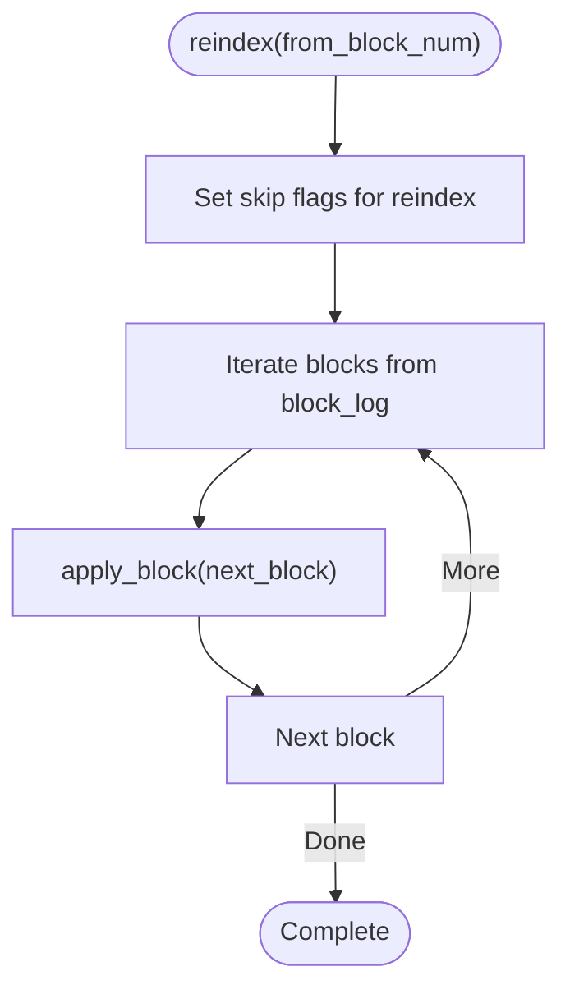
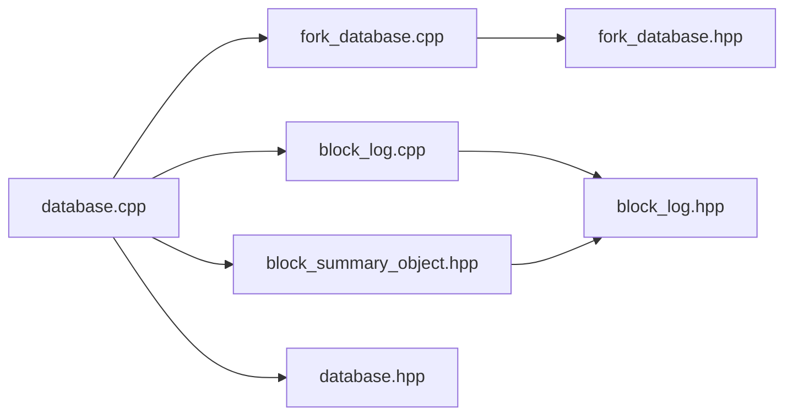

# Block Processing and Validation

<cite>
**Referenced Files in This Document**
- [block_log.hpp](file://libraries/chain/include/graphene/chain/block_log.hpp)
- [block_log.cpp](file://libraries/chain/block_log.cpp)
- [block_summary_object.hpp](file://libraries/chain/include/graphene/chain/block_summary_object.hpp)
- [fork_database.hpp](file://libraries/chain/include/graphene/chain/fork_database.hpp)
- [fork_database.cpp](file://libraries/chain/fork_database.cpp)
- [database.hpp](file://libraries/chain/include/graphene/chain/database.hpp)
- [database.cpp](file://libraries/chain/database.cpp)
</cite>

## Update Summary
**Changes Made**
- Enhanced witness account validation section with comprehensive pre-check mechanisms
- Added documentation for graceful handling of missing witness accounts using find_account()
- Updated witness production validation workflow to prevent exceptions during block generation
- Improved error handling documentation for shared memory corruption scenarios

## Table of Contents
1. [Introduction](#introduction)
2. [Project Structure](#project-structure)
3. [Core Components](#core-components)
4. [Architecture Overview](#architecture-overview)
5. [Detailed Component Analysis](#detailed-component-analysis)
6. [Dependency Analysis](#dependency-analysis)
7. [Performance Considerations](#performance-considerations)
8. [Troubleshooting Guide](#troubleshooting-guide)
9. [Conclusion](#conclusion)

## Introduction
This document explains the Block Processing and Validation system responsible for accepting incoming blocks, validating their integrity and consensus compliance, applying state changes, and maintaining blockchain consistency. It focuses on:
- Efficient block storage and retrieval via the block log
- The block validation pipeline (header, size, merkle, witness scheduling)
- The push_block() and validate_block() orchestration
- Block summary object creation and witness participation tracking
- Block replay for synchronization and state reconstruction
- Integration with fork database, witness scheduling, and state persistence
- Block size limits, transaction ordering, and consensus enforcement

## Project Structure
The block processing pipeline spans several core modules:
- Chain database: orchestrates validation, fork selection, state application, and persistence
- Fork database: manages canonical chain and forks for reorganization decisions
- Block log: persistent append-only storage enabling fast replay and random access
- Block summary and witness schedule: support consensus checks and participation metrics

**Diagram sources**
- [database.hpp:36-200](file://libraries/chain/include/graphene/chain/database.hpp#L36-L200)
- [fork_database.hpp:53-122](file://libraries/chain/include/graphene/chain/fork_database.hpp#L53-L122)
- [block_log.hpp:38-71](file://libraries/chain/include/graphene/chain/block_log.hpp#L38-L71)
- [block_summary_object.hpp:19-42](file://libraries/chain/include/graphene/chain/block_summary_object.hpp#L19-L42)

**Section sources**
- [database.hpp:36-200](file://libraries/chain/include/graphene/chain/database.hpp#L36-L200)
- [fork_database.hpp:53-122](file://libraries/chain/include/graphene/chain/fork_database.hpp#L53-L122)
- [block_log.hpp:38-71](file://libraries/chain/include/graphene/chain/block_log.hpp#L38-L71)
- [block_summary_object.hpp:19-42](file://libraries/chain/include/graphene/chain/block_summary_object.hpp#L19-L42)

## Core Components
- Block log: Append-only, memory-mapped storage with an auxiliary index for O(1) random access by block number. Supports reading head, reading by position, and reconstructing the index if inconsistent.
- Fork database: Maintains a linked tree of candidate blocks, supports pushing blocks, fetching branches, and selecting the heaviest chain head.
- Database: Implements validate_block(), push_block(), and apply_block() to enforce consensus rules, apply state changes, and persist blocks.

Key responsibilities:
- validate_block(): Validates Merkle root, block size, and optionally witness signature and schedule alignment
- push_block(): Coordinates fork selection, reorganization, and state application
- apply_block(): Applies all transactions and operations, updates dynamic properties, and creates block summaries
- block_log: Provides deterministic replay and persistence

**Section sources**
- [block_log.hpp:38-71](file://libraries/chain/include/graphene/chain/block_log.hpp#L38-L71)
- [block_log.cpp:134-193](file://libraries/chain/block_log.cpp#L134-L193)
- [fork_database.hpp:53-122](file://libraries/chain/include/graphene/chain/fork_database.hpp#L53-L122)
- [fork_database.cpp:33-90](file://libraries/chain/fork_database.cpp#L33-L90)
- [database.hpp:193-196](file://libraries/chain/include/graphene/chain/database.hpp#L193-L196)
- [database.cpp:737-792](file://libraries/chain/database.cpp#L737-L792)

## Architecture Overview
The block processing flow integrates validation, fork management, state application, and persistence.

**Diagram sources**
- [database.cpp:800-925](file://libraries/chain/database.cpp#L800-L925)
- [fork_database.cpp:33-90](file://libraries/chain/fork_database.cpp#L33-L90)
- [block_log.cpp:253-257](file://libraries/chain/block_log.cpp#L253-L257)

## Detailed Component Analysis

### Block Log: Storage, Retrieval, and Replay
The block log provides:
- Append-only persistence of signed blocks
- Random access by block number via an index file
- Head traversal and index reconstruction
- Memory-mapped IO for performance

Implementation highlights:
- Open/close lifecycle with index consistency checks
- Index reconstruction if mismatched with head position
- Safe read with bounds and endianness-aware position reads
- Append with packed serialization and position linking

**Diagram sources**
- [block_log.cpp:134-193](file://libraries/chain/block_log.cpp#L134-L193)
- [block_log.cpp:195-226](file://libraries/chain/block_log.cpp#L195-L226)
- [block_log.cpp:263-299](file://libraries/chain/block_log.cpp#L263-L299)

**Section sources**
- [block_log.hpp:38-71](file://libraries/chain/include/graphene/chain/block_log.hpp#L38-L71)
- [block_log.cpp:134-193](file://libraries/chain/block_log.cpp#L134-L193)
- [block_log.cpp:195-226](file://libraries/chain/block_log.cpp#L195-L226)
- [block_log.cpp:263-299](file://libraries/chain/block_log.cpp#L263-L299)

### Fork Database: Canonical Chain and Reorganization
The fork database maintains:
- Linked tree of blocks with previous-id linkage
- Heaviest chain head selection
- Fetching branches from divergent heads
- Unlinkable block caching and DFS insertion

Key behaviors:
- push_block() inserts and links; marks invalid blocks to prevent chaining
- fetch_branch_from() returns branches to a common ancestor
- walk_main_branch_to_num() and fetch_block_on_main_branch_by_number() resolve main-chain blocks by number

**Diagram sources**
- [fork_database.hpp:53-122](file://libraries/chain/include/graphene/chain/fork_database.hpp#L53-L122)
- [fork_database.cpp:33-90](file://libraries/chain/fork_database.cpp#L33-L90)

**Section sources**
- [fork_database.hpp:53-122](file://libraries/chain/include/graphene/chain/fork_database.hpp#L53-L122)
- [fork_database.cpp:33-90](file://libraries/chain/fork_database.cpp#L33-L90)

### Database: Validation Pipeline and Block Application
The database coordinates validation and application:
- validate_block(): Enforces Merkle root, block size, and optionally witness signature and schedule alignment
- push_block(): Orchestrates fork selection and reorganization; calls apply_block() on success
- apply_block(): Applies all transactions and operations, updates dynamic properties, and creates block summaries

**Diagram sources**
- [database.cpp:737-792](file://libraries/chain/database.cpp#L737-L792)
- [database.cpp:800-925](file://libraries/chain/database.cpp#L800-L925)
- [fork_database.cpp:33-90](file://libraries/chain/fork_database.cpp#L33-L90)
- [block_log.cpp:253-257](file://libraries/chain/block_log.cpp#L253-L257)

Validation steps:
- Merkle root verification against transaction set
- Block size enforcement against dynamic maximum
- Optional witness signature validation
- Optional witness schedule alignment (slot correctness)

Fork selection:
- If new head extends beyond current head, compute branches and switch if heavier
- On failure, mark block invalid and restore good fork

State application:
- apply_block() applies all operations and transactions
- Updates dynamic global properties (participation, sizes, reserve ratios)
- Creates block summary entries for TaPOS

**Section sources**
- [database.hpp:193-196](file://libraries/chain/include/graphene/chain/database.hpp#L193-L196)
- [database.cpp:737-792](file://libraries/chain/database.cpp#L737-L792)
- [database.cpp:847-925](file://libraries/chain/database.cpp#L847-L925)
- [database.cpp:3443-3500](file://libraries/chain/database.cpp#L3443-L3500)
- [database.cpp:3723-3748](file://libraries/chain/database.cpp#L3723-L3748)
- [database.cpp:3750-3757](file://libraries/chain/database.cpp#L3750-L3757)
- [database.cpp:3759-3873](file://libraries/chain/database.cpp#L3759-L3873)

### Enhanced Witness Account Validation and Graceful Error Handling

**Updated** Enhanced witness account validation during block production with comprehensive pre-check mechanisms

The system now performs preliminary verification using find_account() calls instead of relying solely on get_account() which would throw exceptions if accounts are missing. This ensures graceful handling of missing witness accounts and prevents node crashes during block production.

Key improvements:
- Pre-check mechanism using find_account() before block generation
- Graceful error handling with critical logging for shared memory corruption detection
- Prevention of exceptions during block production when witness accounts are missing
- Comprehensive error reporting with witness metadata for debugging

**Diagram sources**
- [database.cpp:1294-1311](file://libraries/chain/database.cpp#L1294-L1311)
- [database.cpp:2824-2837](file://libraries/chain/database.cpp#L2824-L2837)
- [database.cpp:2871-2884](file://libraries/chain/database.cpp#L2871-L2884)

**Section sources**
- [database.cpp:1294-1311](file://libraries/chain/database.cpp#L1294-L1311)
- [database.cpp:2824-2837](file://libraries/chain/database.cpp#L2824-L2837)
- [database.cpp:2871-2884](file://libraries/chain/database.cpp#L2871-L2884)
- [database.hpp:185-187](file://libraries/chain/include/graphene/chain/database.hpp#L185-L187)

### Block Header Validation and Witness Scheduling
Header validation ensures:
- Previous block ID matches current head
- Timestamp monotonicity
- Witness signature verification (optional)
- Witness schedule alignment (slot correctness)

Witness participation tracking:
- Missed block counters and penalties
- Participation rate computation via recent slots
- Irreversible block updates based on validator majorities

**Diagram sources**
- [database.cpp:3724-3748](file://libraries/chain/database.cpp#L3724-L3748)
- [database.cpp:3759-3873](file://libraries/chain/database.cpp#L3759-L3873)

**Section sources**
- [database.cpp:3724-3748](file://libraries/chain/database.cpp#L3724-L3748)
- [database.cpp:3759-3873](file://libraries/chain/database.cpp#L3759-L3873)

### Block Summary Object and TaPOS
Block summary objects store minimal per-block identifiers used for TaPOS (Transaction as Proof of Stake). They enable transactions to reference recent block hashes and timestamps for validity and expiration checks.

**Diagram sources**
- [block_summary_object.hpp:19-42](file://libraries/chain/include/graphene/chain/block_summary_object.hpp#L19-L42)

**Section sources**
- [block_summary_object.hpp:19-42](file://libraries/chain/include/graphene/chain/block_summary_object.hpp#L19-L42)

### Block Replay Mechanism
Replay reconstructs chain state by iterating blocks from the block log:
- Start from genesis or configured block number
- Apply each block in sequence, updating state and dynamic properties
- Skip heavy validations during reindex to accelerate replay
- Ensure chainbase revision matches head block number

**Diagram sources**
- [database.cpp:270-300](file://libraries/chain/database.cpp#L270-L300)
- [database.cpp:250-257](file://libraries/chain/database.cpp#L250-L257)

**Section sources**
- [database.cpp:270-300](file://libraries/chain/database.cpp#L270-L300)
- [database.cpp:250-257](file://libraries/chain/database.cpp#L250-L257)

## Dependency Analysis
The following diagram shows module-level dependencies among the core components involved in block processing.

**Diagram sources**
- [database.hpp:3-8](file://libraries/chain/include/graphene/chain/database.hpp#L3-L8)
- [fork_database.hpp:3-18](file://libraries/chain/include/graphene/chain/fork_database.hpp#L3-L18)
- [block_log.hpp:3-9](file://libraries/chain/include/graphene/chain/block_log.hpp#L3-L9)

**Section sources**
- [database.hpp:3-8](file://libraries/chain/include/graphene/chain/database.hpp#L3-L8)
- [fork_database.hpp:3-18](file://libraries/chain/include/graphene/chain/fork_database.hpp#L3-L18)
- [block_log.hpp:3-9](file://libraries/chain/include/graphene/chain/block_log.hpp#L3-L9)

## Performance Considerations
- Memory-mapped IO: The block log uses memory-mapped files for efficient random access and streaming reads/writes.
- Index reconstruction: On mismatch, the index is reconstructed by scanning the entire block log; this is expensive but safe.
- Skip flags: During reindex or trusted operations, validations can be selectively skipped to improve throughput.
- Undo sessions: State changes are wrapped in undo sessions to support rollback on errors and efficient reversion during forks.
- Pending transactions: During block generation, transactions are re-applied to reflect time-dependent semantics and respect block size limits.
- **Enhanced witness validation**: Pre-check mechanisms using find_account() avoid exception overhead and improve block production reliability.

## Troubleshooting Guide
Common issues and remedies:
- Block log/head mismatch: The block log automatically detects inconsistencies and reconstructs the index. If repeated failures occur, inspect logs around index construction and ensure proper shutdown procedures.
- Fork reorganization failures: If applying a fork branch fails, the system removes invalid blocks from the fork database, restores the good fork, and rethrows the error. Review the failing block and witness participation.
- Excessive memory usage during replay: The database reserves memory and resizes shared memory if allocation fails mid-replay. Monitor logs for forced resizing events.
- Invalid witness schedule: If a block's timestamp slot does not align with the scheduled witness, validation fails. Verify time synchronization and witness schedules.
- **Missing witness accounts**: Enhanced pre-check mechanisms now detect missing witness accounts gracefully, logging critical details and preventing node crashes. Such issues typically indicate shared memory corruption requiring node restart with replay.

**Section sources**
- [block_log.cpp:134-193](file://libraries/chain/block_log.cpp#L134-L193)
- [database.cpp:847-925](file://libraries/chain/database.cpp#L847-L925)
- [database.cpp:804-823](file://libraries/chain/database.cpp#L804-L823)
- [database.cpp:3724-3748](file://libraries/chain/database.cpp#L3724-L3748)
- [database.cpp:1294-1311](file://libraries/chain/database.cpp#L1294-L1311)

## Conclusion
The Block Processing and Validation system integrates robust storage (block log), fork management (fork database), and strict consensus validation (database) to ensure blockchain consistency. The validate_block() and push_block() methods coordinate header checks, witness scheduling, Merkle roots, and block size limits. The system supports efficient replay for synchronization and maintains witness participation metrics to enforce consensus.

**Enhanced witness account validation** provides improved reliability during block production by performing preliminary verification using find_account() calls instead of relying on get_account() which would throw exceptions. This change ensures graceful handling of missing witness accounts and prevents node crashes, while maintaining comprehensive error reporting for debugging shared memory corruption scenarios.

Proper use of skip flags, memory mapping, and undo sessions yields strong performance and reliability, making the system resilient to various operational challenges while maintaining strict consensus enforcement.