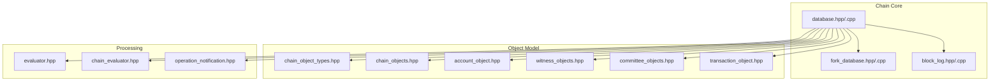
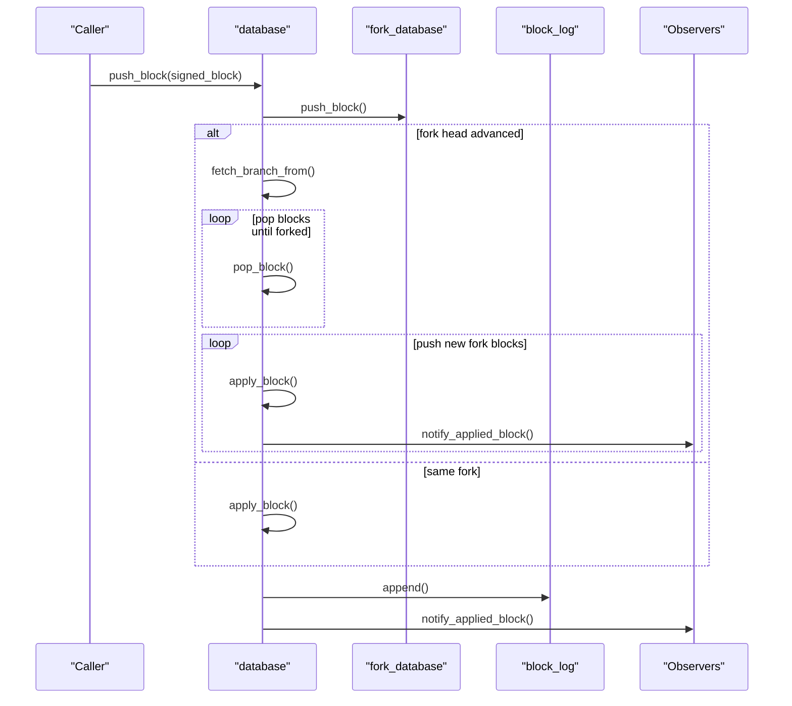
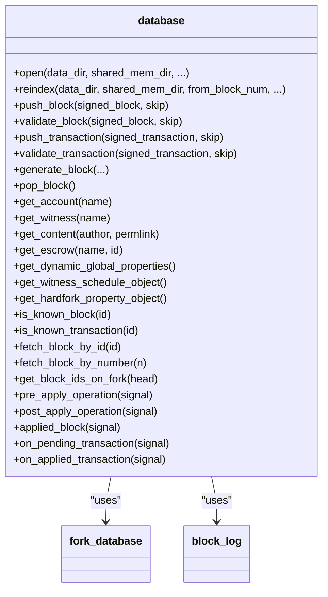
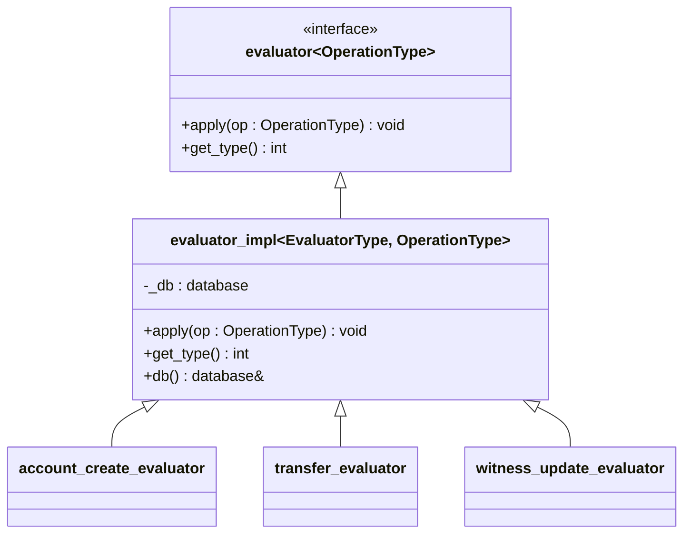
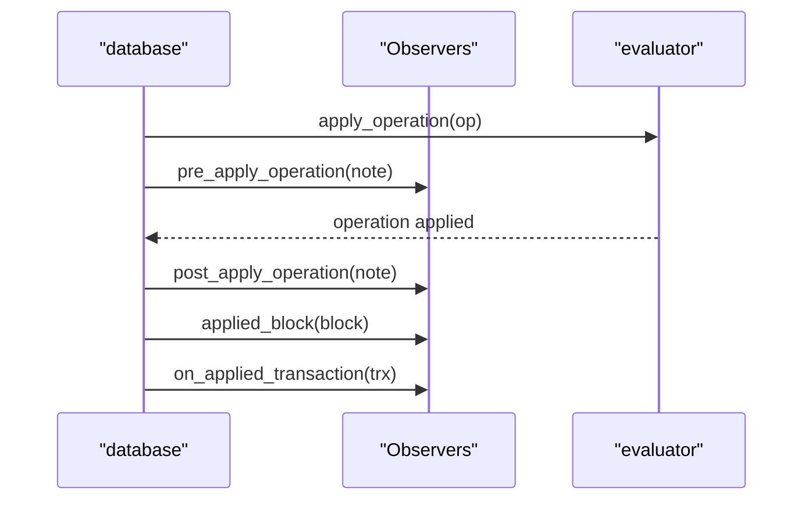
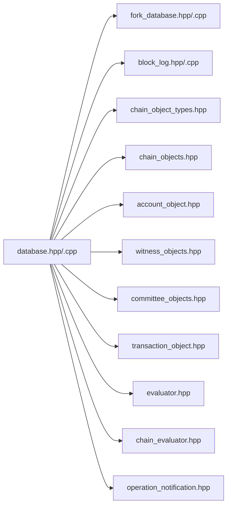

# Chain Library

<cite>
**Referenced Files in This Document**
- [database.hpp](file://libraries/chain/include/graphene/chain/database.hpp)
- [database.cpp](file://libraries/chain/database.cpp)
- [chain_object_types.hpp](file://libraries/chain/include/graphene/chain/chain_object_types.hpp)
- [chain_objects.hpp](file://libraries/chain/include/graphene/chain/chain_objects.hpp)
- [fork_database.hpp](file://libraries/chain/include/graphene/chain/fork_database.hpp)
- [fork_database.cpp](file://libraries/chain/fork_database.cpp)
- [block_log.hpp](file://libraries/chain/include/graphene/chain/block_log.hpp)
- [block_log.cpp](file://libraries/chain/block_log.cpp)
- [account_object.hpp](file://libraries/chain/include/graphene/chain/account_object.hpp)
- [witness_objects.hpp](file://libraries/chain/include/graphene/chain/witness_objects.hpp)
- [committee_objects.hpp](file://libraries/chain/include/graphene/chain/committee_objects.hpp)
- [transaction_object.hpp](file://libraries/chain/include/graphene/chain/transaction_object.hpp)
- [evaluator.hpp](file://libraries/chain/include/graphene/chain/evaluator.hpp)
- [chain_evaluator.hpp](file://libraries/chain/include/graphene/chain/chain_evaluator.hpp)
- [operation_notification.hpp](file://libraries/chain/include/graphene/chain/operation_notification.hpp)
</cite>

## Table of Contents
1. [Introduction](#introduction)
2. [Project Structure](#project-structure)
3. [Core Components](#core-components)
4. [Architecture Overview](#architecture-overview)
5. [Detailed Component Analysis](#detailed-component-analysis)
6. [Dependency Analysis](#dependency-analysis)
7. [Performance Considerations](#performance-considerations)
8. [Troubleshooting Guide](#troubleshooting-guide)
9. [Conclusion](#conclusion)
10. [Appendices](#appendices)

## Introduction
This document describes the Chain Library, the core blockchain state management system. It explains how the database persists blockchain state, validates blocks and transactions, resolves forks, and stores blocks efficiently. It also documents the data model (objects and indices), the evaluator system for operation processing, and the observer pattern used for event-driven notifications. Practical examples and performance optimization techniques are included to help developers integrate and operate the Chain Library effectively.

## Project Structure
The Chain Library is organized around a central database class that orchestrates:
- State persistence and indexing via ChainBase
- Fork handling with a fork database
- Block log for durable storage
- Object model definitions for accounts, witnesses, committee requests, and more
- Evaluator registry for operation processing
- Observer signals for event-driven integrations



**Diagram sources**
- [database.hpp](file://libraries/chain/include/graphene/chain/database.hpp#L36-L561)
- [database.cpp](file://libraries/chain/database.cpp#L206-L456)
- [fork_database.hpp](file://libraries/chain/include/graphene/chain/fork_database.hpp#L53-L125)
- [fork_database.cpp](file://libraries/chain/fork_database.cpp#L1-L245)
- [block_log.hpp](file://libraries/chain/include/graphene/chain/block_log.hpp#L1-L200)
- [block_log.cpp](file://libraries/chain/block_log.cpp#L230-L302)
- [chain_object_types.hpp](file://libraries/chain/include/graphene/chain/chain_object_types.hpp#L44-L146)
- [chain_objects.hpp](file://libraries/chain/include/graphene/chain/chain_objects.hpp#L20-L226)
- [account_object.hpp](file://libraries/chain/include/graphene/chain/account_object.hpp#L20-L143)
- [witness_objects.hpp](file://libraries/chain/include/graphene/chain/witness_objects.hpp#L27-L132)
- [committee_objects.hpp](file://libraries/chain/include/graphene/chain/committee_objects.hpp#L15-L47)
- [transaction_object.hpp](file://libraries/chain/include/graphene/chain/transaction_object.hpp#L19-L56)
- [evaluator.hpp](file://libraries/chain/include/graphene/chain/evaluator.hpp#L11-L45)
- [chain_evaluator.hpp](file://libraries/chain/include/graphene/chain/chain_evaluator.hpp#L14-L79)
- [operation_notification.hpp](file://libraries/chain/include/graphene/chain/operation_notification.hpp#L11-L26)

**Section sources**
- [database.hpp](file://libraries/chain/include/graphene/chain/database.hpp#L36-L561)
- [database.cpp](file://libraries/chain/database.cpp#L206-L456)

## Core Components
- Database: Central state manager that opens/closes the chain, replays history, pushes blocks and transactions, manages undo sessions, and emits observer signals.
- Fork Database: Maintains a tree of candidate blocks, supports branch resolution, and selects the longest chain.
- Block Log: Provides durable, memory-mapped storage for blocks and an index for fast random access.
- Object Model: Defines all persistent objects (accounts, witnesses, committee requests, transactions, etc.) and their multi-index containers.
- Evaluator System: Registry and base classes for operation processing with a standardized interface.
- Observer Pattern: Signals for pre/post operation application, applied block, and transaction events.

Key responsibilities:
- Persistence: ChainBase-backed storage with configurable shared memory sizing and periodic revision alignment.
- Validation: Block and transaction validation with configurable skip flags for reindexing and specialized scenarios.
- Consensus: Fork selection and irreversible block updates.
- Eventing: Notifications for plugins and observers.

**Section sources**
- [database.hpp](file://libraries/chain/include/graphene/chain/database.hpp#L56-L110)
- [database.cpp](file://libraries/chain/database.cpp#L206-L350)
- [fork_database.hpp](file://libraries/chain/include/graphene/chain/fork_database.hpp#L53-L125)
- [block_log.hpp](file://libraries/chain/include/graphene/chain/block_log.hpp#L1-L200)
- [evaluator.hpp](file://libraries/chain/include/graphene/chain/evaluator.hpp#L11-L45)

## Architecture Overview
The Chain Library composes several subsystems:
- database orchestrates state transitions and emits signals
- fork_database maintains candidate chains
- block_log provides durable storage
- object model defines schema and indices
- evaluators apply operations atomically within undo sessions



**Diagram sources**
- [database.cpp](file://libraries/chain/database.cpp#L800-L925)
- [fork_database.cpp](file://libraries/chain/fork_database.cpp#L33-L90)
- [block_log.cpp](file://libraries/chain/block_log.cpp#L253-L257)

**Section sources**
- [database.cpp](file://libraries/chain/database.cpp#L800-L925)
- [fork_database.cpp](file://libraries/chain/fork_database.cpp#L168-L210)
- [block_log.cpp](file://libraries/chain/block_log.cpp#L253-L257)

## Detailed Component Analysis

### Database: State Management, Validation, and Events
The database class extends ChainBase and encapsulates:
- Opening/closing the database and block log
- Reindexing from block log
- Pushing blocks and transactions with configurable validation
- Undo sessions for atomic state transitions
- Observer signals for operations and blocks

Notable APIs:
- Block lifecycle: validate_block, push_block, pop_block, generate_block
- Transaction lifecycle: validate_transaction, push_transaction
- Queries: get_account, get_witness, get_content, get_escrow, get_dynamic_global_properties, get_witness_schedule_object, get_hardfork_property_object
- Fork and block log helpers: is_known_block, is_known_transaction, fetch_block_by_id, fetch_block_by_number, get_block_ids_on_fork
- Observers: pre_apply_operation, post_apply_operation, applied_block, on_pending_transaction, on_applied_transaction

Validation flags allow skipping expensive checks during reindexing or trusted operations.



**Diagram sources**
- [database.hpp](file://libraries/chain/include/graphene/chain/database.hpp#L111-L558)
- [database.cpp](file://libraries/chain/database.cpp#L206-L456)
- [fork_database.hpp](file://libraries/chain/include/graphene/chain/fork_database.hpp#L53-L125)
- [block_log.hpp](file://libraries/chain/include/graphene/chain/block_log.hpp#L1-L200)

**Section sources**
- [database.hpp](file://libraries/chain/include/graphene/chain/database.hpp#L111-L558)
- [database.cpp](file://libraries/chain/database.cpp#L206-L456)

### Fork Database: Fork Resolution and Branch Selection
The fork database maintains a tree of candidate blocks:
- push_block inserts a block and links it to previous if possible
- fetch_branch_from computes divergent branches to resolve forks
- walk_main_branch_to_num and fetch_block_on_main_branch_by_number resolve canonical chain membership
- set_max_size prunes old blocks to bound memory growth


**Diagram sources**
- [fork_database.cpp](file://libraries/chain/fork_database.cpp#L33-L90)

**Section sources**
- [fork_database.hpp](file://libraries/chain/include/graphene/chain/fork_database.hpp#L53-L125)
- [fork_database.cpp](file://libraries/chain/fork_database.cpp#L47-L90)

### Block Log: Efficient Storage and Retrieval
The block log provides:
- Memory-mapped files for blocks and an index
- Random access by block number via index
- Append-only writes with position tracking
- Robust startup logic to reconcile head positions and reconstruct index if needed


**Diagram sources**
- [block_log.cpp](file://libraries/chain/block_log.cpp#L134-L194)
- [block_log.cpp](file://libraries/chain/block_log.cpp#L195-L227)
- [block_log.cpp](file://libraries/chain/block_log.cpp#L270-L285)

**Section sources**
- [block_log.hpp](file://libraries/chain/include/graphene/chain/block_log.hpp#L1-L200)
- [block_log.cpp](file://libraries/chain/block_log.cpp#L134-L194)
- [block_log.cpp](file://libraries/chain/block_log.cpp#L270-L285)

### Data Model: Objects and Indices
The object model defines persistent entities and their indices:
- Object types enumerate all managed object kinds
- Account, witness, committee request/vote, transaction, escrow, vesting delegation, and more
- Multi-index containers provide unique and composite keys for efficient lookups

Representative object categories:
- Accounts: balances, vesting shares, delegation, auction metadata, bandwidth tracking
- Witnesses: votes, virtual scheduling, signing keys, version/hardfork votes
- Committee: requests with statuses, funding, payouts
- Transactions: deduplication and expiration tracking
- Escrow and routes: multi-signature transfers and routing

```mermaid
erDiagram
ACCOUNT {
name : string
balance : asset
vesting_shares : asset
delegated_vesting_shares : asset
received_vesting_shares : asset
energy : int16
last_vote_time : time_point_sec
}
WITNESS {
owner : account_name_type
votes : share_type
signing_key : public_key_type
running_version : version
hardfork_version_vote : hardfork_version
hardfork_time_vote : time_point_sec
}
COMMITTEE_REQUEST {
request_id : uint32
creator : account_name_type
worker : account_name_type
required_amount_min : asset
required_amount_max : asset
status : uint16
start_time : time_point_sec
end_time : time_point_sec
payout_amount : asset
remain_payout_amount : asset
}
TRANSACTION_OBJECT {
trx_id : transaction_id_type
expiration : time_point_sec
}
ESCROW {
escrow_id : uint32
from : account_name_type
to : account_name_type
agent : account_name_type
ratification_deadline : time_point_sec
escrow_expiration : time_point_sec
token_balance : asset
pending_fee : asset
to_approved : bool
agent_approved : bool
disputed : bool
}
ACCOUNT ||--o{ WITNESS_VOTE : "votes_for"
ACCOUNT ||--o{ ESCROW : "escrows"
ACCOUNT ||--o{ COMMITTEE_VOTE : "votes"
COMMITTEE_REQUEST ||--o{ COMMITTEE_VOTE : "votes"
TRANSACTION_OBJECT ||--|| BLOCK : "referenced_in"
```

**Diagram sources**
- [chain_object_types.hpp](file://libraries/chain/include/graphene/chain/chain_object_types.hpp#L44-L146)
- [account_object.hpp](file://libraries/chain/include/graphene/chain/account_object.hpp#L20-L143)
- [witness_objects.hpp](file://libraries/chain/include/graphene/chain/witness_objects.hpp#L27-L132)
- [committee_objects.hpp](file://libraries/chain/include/graphene/chain/committee_objects.hpp#L15-L47)
- [transaction_object.hpp](file://libraries/chain/include/graphene/chain/transaction_object.hpp#L19-L56)
- [chain_objects.hpp](file://libraries/chain/include/graphene/chain/chain_objects.hpp#L20-L141)

**Section sources**
- [chain_object_types.hpp](file://libraries/chain/include/graphene/chain/chain_object_types.hpp#L44-L146)
- [account_object.hpp](file://libraries/chain/include/graphene/chain/account_object.hpp#L20-L143)
- [witness_objects.hpp](file://libraries/chain/include/graphene/chain/witness_objects.hpp#L27-L132)
- [committee_objects.hpp](file://libraries/chain/include/graphene/chain/committee_objects.hpp#L15-L47)
- [transaction_object.hpp](file://libraries/chain/include/graphene/chain/transaction_object.hpp#L19-L56)
- [chain_objects.hpp](file://libraries/chain/include/graphene/chain/chain_objects.hpp#L20-L141)

### Evaluator System: Operation Processing
The evaluator system provides a uniform mechanism to apply operations:
- Base evaluator interface with apply and type identification
- Evaluator implementations for each operation type
- Registry-driven dispatch to the appropriate evaluator



**Diagram sources**
- [evaluator.hpp](file://libraries/chain/include/graphene/chain/evaluator.hpp#L11-L45)
- [chain_evaluator.hpp](file://libraries/chain/include/graphene/chain/chain_evaluator.hpp#L14-L79)

**Section sources**
- [evaluator.hpp](file://libraries/chain/include/graphene/chain/evaluator.hpp#L11-L45)
- [chain_evaluator.hpp](file://libraries/chain/include/graphene/chain/chain_evaluator.hpp#L14-L79)

### Observer Pattern: Event-Driven Architecture
The database emits signals for:
- Pre/post operation application
- Applied block
- Pending/applied transactions

Plugins and observers can subscribe to these signals to react to state changes without tight coupling.



**Diagram sources**
- [database.hpp](file://libraries/chain/include/graphene/chain/database.hpp#L252-L286)
- [operation_notification.hpp](file://libraries/chain/include/graphene/chain/operation_notification.hpp#L11-L26)
- [database.cpp](file://libraries/chain/database.cpp#L1158-L1198)

**Section sources**
- [database.hpp](file://libraries/chain/include/graphene/chain/database.hpp#L252-L286)
- [operation_notification.hpp](file://libraries/chain/include/graphene/chain/operation_notification.hpp#L11-L26)
- [database.cpp](file://libraries/chain/database.cpp#L1158-L1198)

## Dependency Analysis
The database depends on:
- fork_database for chain selection
- block_log for durable storage
- object model headers for schema definitions
- evaluator registry for operation application
- observer signals for event emission



**Diagram sources**
- [database.hpp](file://libraries/chain/include/graphene/chain/database.hpp#L1-L561)
- [database.cpp](file://libraries/chain/database.cpp#L1-L200)
- [fork_database.hpp](file://libraries/chain/include/graphene/chain/fork_database.hpp#L1-L125)
- [block_log.hpp](file://libraries/chain/include/graphene/chain/block_log.hpp#L1-L200)
- [chain_object_types.hpp](file://libraries/chain/include/graphene/chain/chain_object_types.hpp#L1-L246)
- [chain_objects.hpp](file://libraries/chain/include/graphene/chain/chain_objects.hpp#L1-L226)
- [account_object.hpp](file://libraries/chain/include/graphene/chain/account_object.hpp#L1-L565)
- [witness_objects.hpp](file://libraries/chain/include/graphene/chain/witness_objects.hpp#L1-L313)
- [committee_objects.hpp](file://libraries/chain/include/graphene/chain/committee_objects.hpp#L1-L137)
- [transaction_object.hpp](file://libraries/chain/include/graphene/chain/transaction_object.hpp#L1-L56)
- [evaluator.hpp](file://libraries/chain/include/graphene/chain/evaluator.hpp#L1-L62)
- [chain_evaluator.hpp](file://libraries/chain/include/graphene/chain/chain_evaluator.hpp#L1-L80)
- [operation_notification.hpp](file://libraries/chain/include/graphene/chain/operation_notification.hpp#L1-L27)

**Section sources**
- [database.hpp](file://libraries/chain/include/graphene/chain/database.hpp#L1-L561)
- [database.cpp](file://libraries/chain/database.cpp#L1-L200)

## Performance Considerations
- Shared memory sizing and auto-resize: Configure minimum free memory thresholds and incremental growth to avoid frequent resizes during heavy load.
- Block log I/O: Memory-mapped files reduce syscall overhead; ensure adequate OS page cache and avoid fragmentation.
- Fork pruning: Limit fork cache size to bound memory usage; prune old blocks when head advances significantly.
- Validation flags: During reindexing, skip expensive checks (signatures, merkle, authority) to accelerate replay.
- Bandwidth accounting: Efficient per-account bandwidth calculations prevent excessive CPU usage on producers.
- Undo sessions: Use short-lived sessions to minimize rollback overhead; squash temporary sessions after successful application.

[No sources needed since this section provides general guidance]

## Troubleshooting Guide
Common issues and remedies:
- Chain mismatch after restart: The database verifies revision against head block number; if inconsistent, a specific exception is thrown indicating the mismatch.
- Block log/head mismatch: On open, the database validates that the block log head matches the chain head; if not, a specific exception instructs reindexing.
- Memory pressure: Monitor free memory and trigger auto-resize when thresholds are met; periodically print free memory status.
- Fork collisions: When multiple blocks are produced at the same slot, warnings are logged; ensure correct fork resolution and head updates.
- Bad allocation during block push: On memory exhaustion, the system attempts to resize shared memory and retry.

**Section sources**
- [database.cpp](file://libraries/chain/database.cpp#L232-L248)
- [database.cpp](file://libraries/chain/database.cpp#L270-L350)
- [database.cpp](file://libraries/chain/database.cpp#L368-L430)
- [database.cpp](file://libraries/chain/database.cpp#L832-L844)

## Conclusion
The Chain Library provides a robust, modular framework for blockchain state management. Its design separates concerns across database orchestration, fork handling, durable storage, typed object models, operation processing, and event-driven observation. By leveraging ChainBase for persistence, fork_database for consensus, and block_log for storage, it achieves high throughput and reliability. Developers can extend functionality via evaluators and observe state changes through signals, enabling flexible plugin architectures.

[No sources needed since this section summarizes without analyzing specific files]

## Appendices

### Common Database Operations and Examples
- Open and replay:
  - Open database and block log, initialize indexes and evaluators, then start block log and rewind undo state.
  - Reindex from a specified block number with skip flags to bypass validations.
- Push block:
  - Validate block (merkle and size), push to fork database, resolve forks if needed, apply block, persist to block log, emit applied block signal.
- Push transaction:
  - Validate transaction size, apply within a pending session, record changes, and emit pending/applied transaction signals.
- Query state:
  - Retrieve account, witness, content, escrow, dynamic global properties, witness schedule, and hardfork property objects by name or identifier.
- Fork resolution:
  - Compute branches from current head to a candidate fork head, pop blocks until common ancestor, then push new fork blocks.

**Section sources**
- [database.cpp](file://libraries/chain/database.cpp#L206-L350)
- [database.cpp](file://libraries/chain/database.cpp#L800-L925)
- [database.cpp](file://libraries/chain/database.cpp#L936-L970)
- [database.hpp](file://libraries/chain/include/graphene/chain/database.hpp#L136-L169)

### Performance Optimization Techniques
- Tune shared memory growth: Set minimum free memory and increment sizes to avoid frequent resizing.
- Use skip flags during reindexing: Disable signature and authority checks to accelerate replay.
- Monitor and log memory: Periodic logs help detect approaching limits before failures.
- Keep fork cache bounded: Adjust maximum fork size to control memory footprint.
- Batch operations: Group related operations to minimize undo session overhead.

**Section sources**
- [database.cpp](file://libraries/chain/database.cpp#L368-L430)
- [fork_database.cpp](file://libraries/chain/fork_database.cpp#L92-L124)