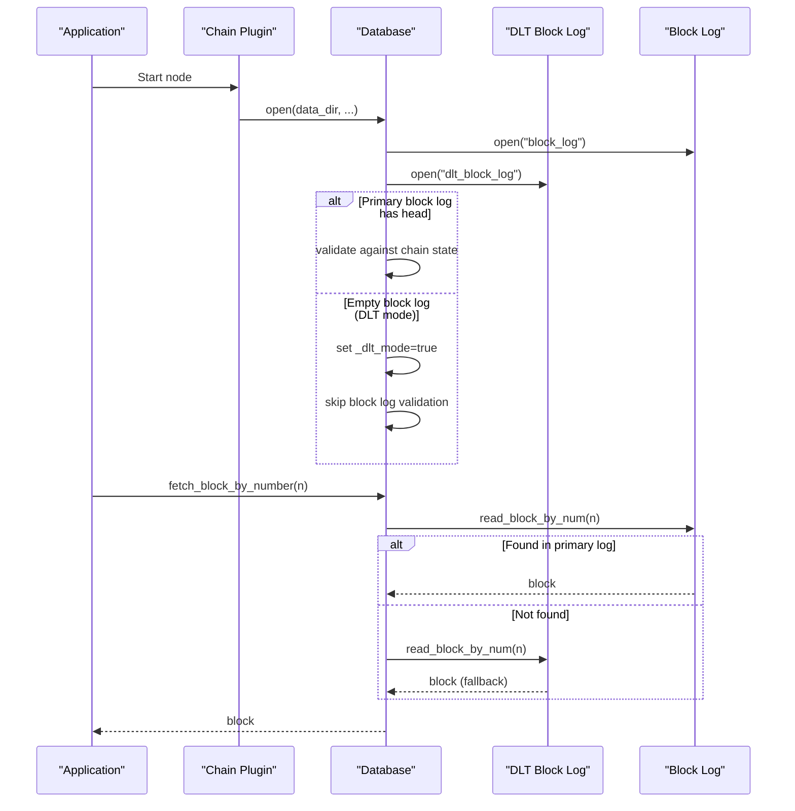
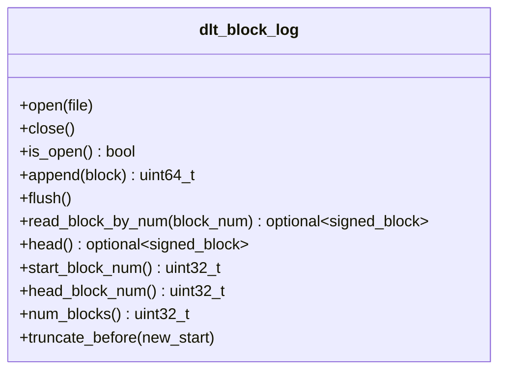
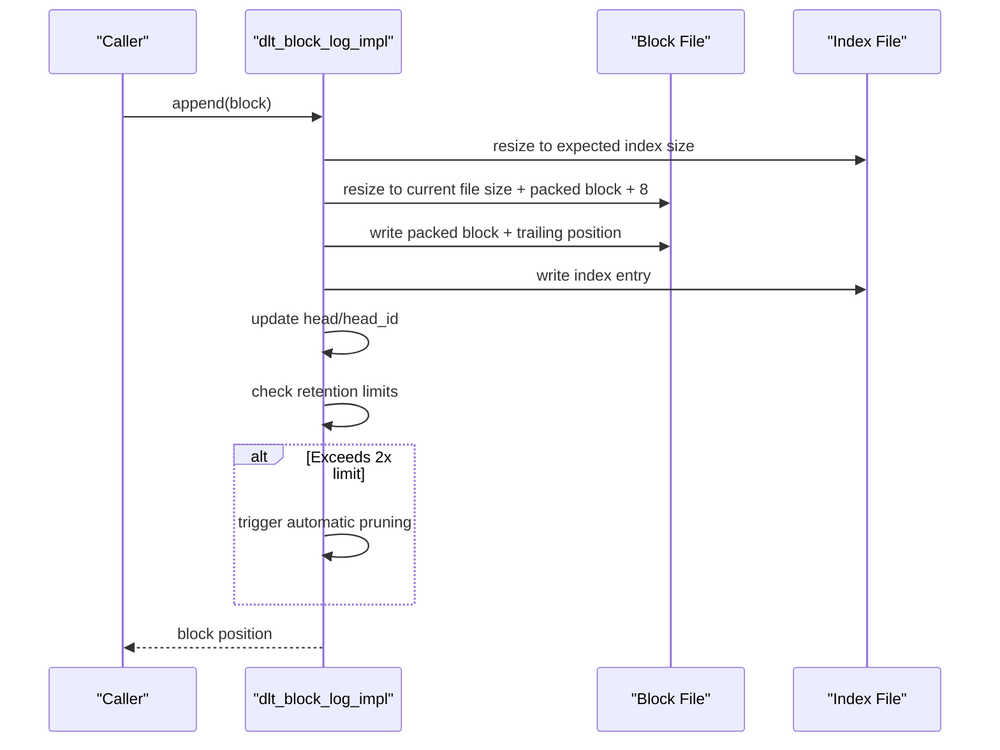
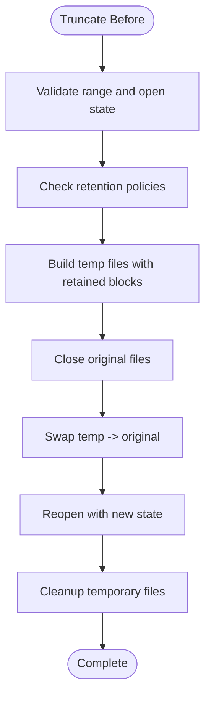
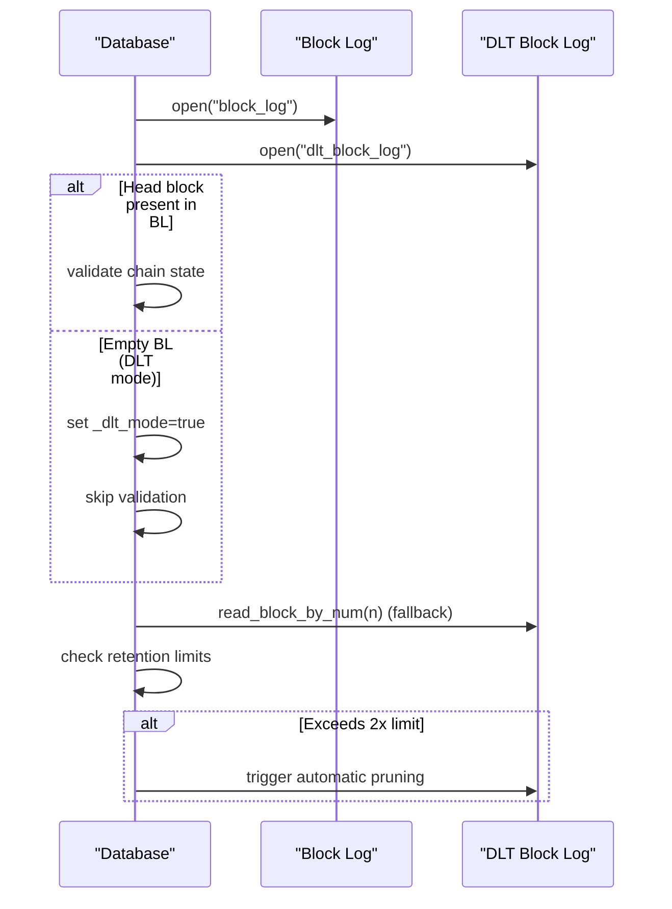
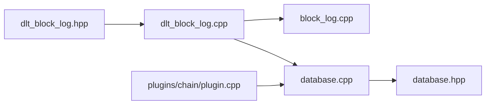

# DLT Rolling Block Log

<cite>
**Referenced Files in This Document**
- [dlt_block_log.hpp](file://libraries/chain/include/graphene/chain/dlt_block_log.hpp)
- [dlt_block_log.cpp](file://libraries/chain/dlt_block_log.cpp)
- [block_log.cpp](file://libraries/chain/block_log.cpp)
- [database.cpp](file://libraries/chain/database.cpp)
- [plugin.cpp](file://plugins/chain/plugin.cpp)
- [database.hpp](file://libraries/chain/include/graphene/chain/database.hpp)
</cite>

## Update Summary
**Changes Made**
- Enhanced DLT mode support documentation with comprehensive rolling block log implementation
- Added detailed coverage of selective retention policies and automatic pruning capabilities
- Expanded configuration management section with runtime parameter documentation
- Updated architecture diagrams to reflect integrated DLT mode operation
- Added troubleshooting guidance for DLT-specific scenarios

## Table of Contents
1. [Introduction](#introduction)
2. [Project Structure](#project-structure)
3. [Core Components](#core-components)
4. [Architecture Overview](#architecture-overview)
5. [Detailed Component Analysis](#detailed-component-analysis)
6. [Selective Retention Policies](#selective-retention-policies)
7. [Automatic Pruning Capabilities](#automatic-pruning-capabilities)
8. [Configuration Management](#configuration-management)
9. [Dependency Analysis](#dependency-analysis)
10. [Performance Considerations](#performance-considerations)
11. [Troubleshooting Guide](#troubleshooting-guide)
12. [Conclusion](#conclusion)

## Introduction
This document explains the comprehensive DLT (Data Ledger Technology) Rolling Block Log implementation used by VIZ blockchain nodes to maintain a sliding window of recent irreversible blocks with selective retention policies and automatic pruning capabilities. The DLT mode provides advanced support for snapshot-based nodes, enabling efficient serving of recent blocks to P2P peers while maintaining configurable retention windows and automated cleanup mechanisms.

## Project Structure
The DLT rolling block log is implemented as a standalone component with comprehensive integration into the main database system. It operates alongside the traditional block log while providing specialized functionality for snapshot-based ("DLT") nodes with selective retention and automatic pruning capabilities.

```mermaid
graph TB
subgraph "Chain Layer"
DLT["dlt_block_log.hpp/.cpp"]
BL["block_log.cpp"]
DB["database.cpp"]
END
subgraph "Plugins"
CP["plugins/chain/plugin.cpp"]
END
subgraph "Config"
DH["database.hpp"]
END
CP --> DB
DB --> DLT
DB --> BL
DLT -.-> BL
CP --> DH
```

**Diagram sources**
- [dlt_block_log.hpp:1-76](file://libraries/chain/include/graphene/chain/dlt_block_log.hpp#L1-L76)
- [dlt_block_log.cpp:1-414](file://libraries/chain/dlt_block_log.cpp#L1-L414)
- [block_log.cpp:1-302](file://libraries/chain/block_log.cpp#L1-L302)
- [database.cpp:220-271](file://libraries/chain/database.cpp#L220-L271)
- [plugin.cpp:320-330](file://plugins/chain/plugin.cpp#L320-L330)
- [database.hpp:60-70](file://libraries/chain/include/graphene/chain/database.hpp#L60-L70)

**Section sources**
- [dlt_block_log.hpp:1-76](file://libraries/chain/include/graphene/chain/dlt_block_log.hpp#L1-L76)
- [dlt_block_log.cpp:1-414](file://libraries/chain/dlt_block_log.cpp#L1-L414)
- [block_log.cpp:1-302](file://libraries/chain/block_log.cpp#L1-L302)
- [database.cpp:220-271](file://libraries/chain/database.cpp#L220-L271)
- [plugin.cpp:320-330](file://plugins/chain/plugin.cpp#L320-L330)
- [database.hpp:60-70](file://libraries/chain/include/graphene/chain/database.hpp#L60-L70)

## Core Components
- **DLT Rolling Block Log API**: Provides comprehensive methods for opening/closing, appending blocks, selective reading by block number, querying head/start/end indices, and intelligent truncation with retention policies.
- **Advanced Internal Implementation**: Manages sophisticated memory-mapped files for data and offset-aware index storage, maintains head state with automatic validation, reconstructs indexes when inconsistencies are detected, and performs safe truncation with temporary files and atomic operations.
- **Integrated Database System**: Seamlessly opens both DLT rolling block log and primary block log during normal and snapshot modes, implements fallback block retrieval when primary block log is empty, and coordinates DLT mode detection and operation.
- **Comprehensive Chain Plugin Configuration**: Exposes runtime options for configuring maximum blocks to retain, selective retention policies, and automatic pruning thresholds with flexible parameter management.

**Enhanced Key Capabilities**:
- Offset-aware index layout supporting arbitrary start block numbers with intelligent retention policies
- Append-only storage with position checks ensuring sequential integrity and selective block management
- Automatic index reconstruction with conflict resolution and selective retention enforcement
- Safe truncation with temporary files, atomic swapping, and intelligent pruning based on configured limits
- Comprehensive DLT mode support with fallback mechanisms and selective block serving

**Section sources**
- [dlt_block_log.hpp:35-72](file://libraries/chain/include/graphene/chain/dlt_block_log.hpp#L35-L72)
- [dlt_block_log.cpp:18-278](file://libraries/chain/dlt_block_log.cpp#L18-L278)
- [database.cpp:230-231](file://libraries/chain/database.cpp#L230-L231)
- [plugin.cpp:327-329](file://plugins/chain/plugin.cpp#L327-L329)

## Architecture Overview
The DLT rolling block log operates in conjunction with the primary block log, providing comprehensive support for snapshot-based nodes with selective retention policies and automatic pruning. During normal operation, the database opens both logs and validates them. In DLT mode (after snapshot import), the primary block log remains empty while the database holds state; the DLT rolling block log serves as a fallback with intelligent retention management.



**Diagram sources**
- [database.cpp:230-268](file://libraries/chain/database.cpp#L230-L268)
- [database.cpp:560-627](file://libraries/chain/database.cpp#L560-L627)
- [block_log.cpp:238-241](file://libraries/chain/block_log.cpp#L238-L241)
- [dlt_block_log.cpp:313-328](file://libraries/chain/dlt_block_log.cpp#L313-L328)

## Detailed Component Analysis

### DLT Rolling Block Log API
The public interface defines comprehensive lifecycle, append, read, and maintenance operations with thread-safe access via read/write locks, supporting selective retention policies and automatic pruning capabilities.



**Diagram sources**
- [dlt_block_log.hpp:35-72](file://libraries/chain/include/graphene/chain/dlt_block_log.hpp#L35-L72)

**Section sources**
- [dlt_block_log.hpp:35-72](file://libraries/chain/include/graphene/chain/dlt_block_log.hpp#L35-L72)

### Advanced Internal Implementation Details
The implementation manages sophisticated memory-mapped files with comprehensive error handling, intelligent validation, and automatic recovery mechanisms. It enforces strict position checks, implements selective retention policies, and provides automatic pruning capabilities.

**Key Advanced Behaviors**:
- Sophisticated memory-mapped files for zero-copy reads with comprehensive error handling
- Offset-aware index with intelligent header management and selective entry tracking
- Strict position validation during append operations with conflict resolution
- Intelligent index reconstruction with selective retention enforcement
- Safe truncation using temporary files with atomic swap and comprehensive validation
- Automatic pruning based on configured retention limits with selective block management


**Diagram sources**
- [dlt_block_log.cpp:161-209](file://libraries/chain/dlt_block_log.cpp#L161-L209)
- [dlt_block_log.cpp:125-159](file://libraries/chain/dlt_block_log.cpp#L125-L159)

**Section sources**
- [dlt_block_log.cpp:18-278](file://libraries/chain/dlt_block_log.cpp#L18-L278)

### Enhanced Append Operation Flow
The append operation validates sequential positioning with intelligent conflict resolution, writes block data with trailing position markers, updates the index with selective retention enforcement, and maintains head state with automatic pruning triggers.



**Diagram sources**
- [dlt_block_log.cpp:211-268](file://libraries/chain/dlt_block_log.cpp#L211-L268)

**Section sources**
- [dlt_block_log.cpp:211-268](file://libraries/chain/dlt_block_log.cpp#L211-L268)

### Intelligent Truncation Process
Truncation creates temporary files containing only retained blocks with selective retention enforcement, then atomically replaces the original files with comprehensive validation and automatic cleanup.



**Diagram sources**
- [dlt_block_log.cpp:356-411](file://libraries/chain/dlt_block_log.cpp#L356-L411)

**Section sources**
- [dlt_block_log.cpp:356-411](file://libraries/chain/dlt_block_log.cpp#L356-L411)

### Integrated Database Operations
The database seamlessly integrates DLT block log alongside block_log.cpp, coordinating fallback retrieval, DLT mode detection, selective retention enforcement, and automatic pruning with comprehensive state management.



**Diagram sources**
- [database.cpp:230-268](file://libraries/chain/database.cpp#L230-L268)
- [database.cpp:560-627](file://libraries/chain/database.cpp#L560-L627)

**Section sources**
- [database.cpp:230-268](file://libraries/chain/database.cpp#L230-L268)
- [database.cpp:560-627](file://libraries/chain/database.cpp#L560-L627)

## Selective Retention Policies
The DLT rolling block log implements sophisticated selective retention policies that allow fine-grained control over which blocks are maintained and when automatic pruning occurs. These policies ensure optimal disk usage while maintaining serviceability for P2P peers.

**Retention Policy Features**:
- Configurable maximum block retention with runtime parameter control
- Intelligent pruning threshold management (2x limit vs. configured retention)
- Selective block preservation based on last irreversible block (LIB) boundaries
- Automatic cleanup of obsolete blocks while preserving serviceable ranges
- Flexible retention window adjustment for different operational requirements

**Section sources**
- [plugin.cpp:327-329](file://plugins/chain/plugin.cpp#L327-L329)
- [database.cpp:4005-4036](file://libraries/chain/database.cpp#L4005-L4036)
- [database.cpp:4170-4172](file://libraries/chain/database.cpp#L4170-L4172)
- [database.cpp:4392-4394](file://libraries/chain/database.cpp#L4392-L4394)

## Automatic Pruning Capabilities
The DLT rolling block log provides comprehensive automatic pruning capabilities that maintain optimal performance and disk usage through intelligent block lifecycle management and selective cleanup operations.

**Pruning Mechanism Features**:
- Automatic pruning triggered when block count exceeds 2x configured retention limit
- Intelligent block range calculation based on head block number and retention policy
- Atomic file replacement with temporary file management for data integrity
- Comprehensive validation and cleanup of temporary files after successful pruning
- Selective pruning that preserves serviceable blocks while removing obsolete data

**Section sources**
- [database.cpp:4043-4047](file://libraries/chain/database.cpp#L4043-L4047)
- [database.cpp:4189-4192](file://libraries/chain/database.cpp#L4189-L4192)
- [database.cpp:4419-4421](file://libraries/chain/database.cpp#L4419-L4421)

## Configuration Management
The chain plugin provides comprehensive runtime configuration management for DLT rolling block log operations, allowing flexible control over retention policies, pruning thresholds, and operational parameters.

**Configuration Parameters**:
- `dlt-block-log-max-blocks`: Maximum number of recent blocks to keep in the rolling DLT block log (default: 100,000)
- Runtime parameter validation and enforcement
- Integration with database state management for seamless operation
- Support for disabling DLT block log functionality (0 = disabled)

**Section sources**
- [plugin.cpp:233-236](file://plugins/chain/plugin.cpp#L233-L236)
- [plugin.cpp:326-329](file://plugins/chain/plugin.cpp#L326-L329)

## Dependency Analysis
The DLT rolling block log implementation has comprehensive dependencies across multiple system components, providing robust integration with the blockchain infrastructure while maintaining separation of concerns.

**Core Dependencies**:
- dlt_block_log.hpp/cpp depends on:
  - Protocol block definitions for signed blocks with comprehensive serialization
  - Boost iostreams for advanced memory-mapped file access with error handling
  - Boost filesystem for sophisticated file operations and cleanup
  - FC library for comprehensive assertions, data streams, and logging
- database.cpp integrates DLT block log with comprehensive fallback mechanisms and state management
- plugin.cpp configures DLT rolling block log with runtime parameter management and validation



**Diagram sources**
- [dlt_block_log.hpp:1-10](file://libraries/chain/include/graphene/chain/dlt_block_log.hpp#L1-L10)
- [dlt_block_log.cpp:1-7](file://libraries/chain/dlt_block_log.cpp#L1-L7)
- [block_log.cpp:1-6](file://libraries/chain/block_log.cpp#L1-L6)
- [database.cpp:1-10](file://libraries/chain/database.cpp#L1-L10)
- [plugin.cpp:1-10](file://plugins/chain/plugin.cpp#L1-L10)
- [database.hpp:60-70](file://libraries/chain/include/graphene/chain/database.hpp#L60-L70)

**Section sources**
- [dlt_block_log.hpp:1-10](file://libraries/chain/include/graphene/chain/dlt_block_log.hpp#L1-L10)
- [dlt_block_log.cpp:1-7](file://libraries/chain/dlt_block_log.cpp#L1-L7)
- [block_log.cpp:1-6](file://libraries/chain/block_log.cpp#L1-L6)
- [database.cpp:1-10](file://libraries/chain/database.cpp#L1-L10)
- [plugin.cpp:1-10](file://plugins/chain/plugin.cpp#L1-L10)
- [database.hpp:60-70](file://libraries/chain/include/graphene/chain/database.hpp#L60-L70)

## Performance Considerations
The DLT rolling block log implementation provides optimized performance characteristics through advanced memory management, intelligent caching strategies, and efficient I/O operations designed for high-throughput blockchain operations.

**Performance Optimizations**:
- Sophisticated memory-mapped files enabling zero-copy reads with comprehensive error handling
- Offset-aware index allowing O(1) lookup performance with intelligent caching
- Batched write operations with selective retention enforcement for optimal throughput
- Intelligent truncation scheduling during low-traffic periods to minimize latency impact
- Configurable retention limits preventing excessive disk usage and rebuild overhead
- Automatic pruning reduces fragmentation and maintains optimal file system performance

## Troubleshooting Guide
Comprehensive troubleshooting guidance for DLT-specific scenarios, retention policy issues, automatic pruning failures, and configuration problems with systematic diagnostic approaches.

**Common DLT Mode Issues**:
- Index mismatch detection and automatic reconstruction with selective retention enforcement
- Empty block log in DLT mode validation and fallback mechanism verification
- Truncation failures with temporary file cleanup and atomic operation validation
- Retention policy violations with selective block preservation and pruning triggers
- Configuration parameter validation and runtime parameter enforcement

**Section sources**
- [dlt_block_log.cpp:161-209](file://libraries/chain/dlt_block_log.cpp#L161-L209)
- [dlt_block_log.cpp:356-411](file://libraries/chain/dlt_block_log.cpp#L356-L411)
- [database.cpp:259-268](file://libraries/chain/database.cpp#L259-L268)

## Conclusion
The DLT Rolling Block Log provides a comprehensive, offset-aware append-only storage mechanism specifically designed for snapshot-based nodes with advanced selective retention policies and automatic pruning capabilities. Its sophisticated integration with the database ensures seamless fallback when the primary block log is empty, while configurable limits, intelligent retention enforcement, and automatic cleanup mechanisms help manage disk usage efficiently. The implementation leverages advanced memory-mapped files, strict position validation, and comprehensive error handling to deliver reliable performance and data integrity for modern blockchain operations.