# DLT Rolling Block Log

<cite>
**Referenced Files in This Document**
- [dlt_block_log.hpp](file://libraries/chain/include/graphene/chain/dlt_block_log.hpp)
- [dlt_block_log.cpp](file://libraries/chain/dlt_block_log.cpp)
- [block_log.cpp](file://libraries/chain/block_log.cpp)
- [database.cpp](file://libraries/chain/database.cpp)
- [plugin.cpp](file://plugins/chain/plugin.cpp)
- [snapshot_plugin.cpp](file://plugins/snapshot/plugin.cpp)
- [p2p_plugin.cpp](file://plugins/p2p/p2p_plugin.cpp)
- [fork_database.cpp](file://libraries/chain/fork_database.cpp)
- [database.hpp](file://libraries/chain/include/graphene/chain/database.hpp)
</cite>

## Update Summary
**Changes Made**
- Enhanced DLT block log accessibility with mutable accessor methods for runtime property modification
- Added non-const getter method for _dlt_block_log member variable, enabling external components to modify DLT block log properties during runtime operations while maintaining read-only access for general use
- Updated database.hpp to provide both const and non-const accessors for DLT block log functionality
- Enhanced external component integration capabilities for DLT mode operations

## Table of Contents
1. [Introduction](#introduction)
2. [Project Structure](#project_structure)
3. [Core Components](#core_components)
4. [Architecture Overview](#architecture_overview)
5. [Detailed Component Analysis](#detailed_component_analysis)
6. [Memory Safety and Cross-Platform Enhancements](#memory-safety-and-cross-platform-enhancements)
7. [Crash Recovery and Atomic Operations](#crash-recovery-and-atomic-operations)
8. [Selective Retention Policies](#selective-retention-policies)
9. [Automatic Pruning Capabilities](#automatic-pruning-capabilities)
10. [Enhanced Blockchain Recovery System](#enhanced-blockchain-recovery-system)
11. [Configuration Management](#configuration-management)
12. [Dependency Analysis](#dependency-analysis)
13. [Performance Considerations](#performance-considerations)
14. [Enhanced Error Handling and Fallback Mechanisms](#enhanced-error-handling-and-fallback-mechanisms)
15. [DLT Mode Fork Database Seeding](#dlt-mode-fork-database-seeding)
16. [Enhanced Block Availability Checking](#enhanced-block-availability-checking)
17. [Stalled Sync Detection for DLT Nodes](#stalled-sync-detection-for-dlt-nodes)
18. [Enhanced Gap Handling During Synchronization](#enhanced-gap-handling-during-synchronization)
19. [DLT Block Log Accessibility Enhancement](#dlt-block-log-accessibility-enhancement)
20. [Troubleshooting Guide](#troubleshooting-guide)
21. [Conclusion](#conclusion)

## Introduction
This document explains the comprehensive DLT (Data Ledger Technology) Rolling Block Log implementation used by VIZ blockchain nodes to maintain a sliding window of recent irreversible blocks with selective retention policies and automatic pruning capabilities. The DLT mode provides advanced support for snapshot-based nodes, enabling efficient serving of recent blocks to P2P peers while maintaining configurable retention windows and automated cleanup mechanisms. Recent enhancements include critical memory safety improvements replacing unsafe pointer casts with std::memcpy operations, comprehensive crash recovery mechanisms with .bak file restoration, enhanced cross-platform compatibility, and strengthened validation logic throughout the implementation. The latest enhancement introduces improved DLT block log accessibility with mutable accessor methods, enabling external components to modify DLT block log properties during runtime operations while maintaining read-only access for general use.

## Project Structure
The DLT rolling block log is implemented as a standalone component with comprehensive integration into the main database system. It operates alongside the traditional block log while providing specialized functionality for snapshot-based ("DLT") nodes with selective retention and automatic pruning capabilities.

```mermaid
graph TB
subgraph "Chain Layer"
DLT["dlt_block_log.hpp/.cpp"]
BL["block_log.cpp"]
DB["database.cpp"]
FD["fork_database.cpp"]
DH["database.hpp"]
END
subgraph "Plugins"
CP["plugins/chain/plugin.cpp"]
SP["plugins/snapshot/plugin.cpp"]
PP["plugins/p2p/p2p_plugin.cpp"]
END
CP --> DB
SP --> DB
PP --> DB
DB --> DLT
DB --> BL
DB --> FD
DLT -.-> BL
FD -.-> DB
CP --> DH
SP --> DH
PP --> DH
```

**Diagram sources**
- [dlt_block_log.hpp:1-76](file://libraries/chain/include/graphene/chain/dlt_block_log.hpp#L1-L76)
- [dlt_block_log.cpp:1-454](file://libraries/chain/dlt_block_log.cpp#L1-L454)
- [block_log.cpp:1-302](file://libraries/chain/block_log.cpp#L1-L302)
- [database.cpp:220-271](file://libraries/chain/database.cpp#L220-L271)
- [fork_database.cpp:1-258](file://libraries/chain/fork_database.cpp#L1-L258)
- [plugin.cpp:320-330](file://plugins/chain/plugin.cpp#L320-L330)
- [snapshot_plugin.cpp:1960-2039](file://plugins/snapshot/plugin.cpp#L1960-L2039)
- [p2p_plugin.cpp:255-286](file://plugins/p2p/p2p_plugin.cpp#L255-L286)
- [database.hpp:515-516](file://libraries/chain/include/graphene/chain/database.hpp#L515-L516)

**Section sources**
- [dlt_block_log.hpp:1-76](file://libraries/chain/include/graphene/chain/dlt_block_log.hpp#L1-L76)
- [dlt_block_log.cpp:1-454](file://libraries/chain/dlt_block_log.cpp#L1-L454)
- [block_log.cpp:1-302](file://libraries/chain/block_log.cpp#L1-L302)
- [database.cpp:220-271](file://libraries/chain/database.cpp#L220-L271)
- [fork_database.cpp:1-258](file://libraries/chain/fork_database.cpp#L1-L258)
- [plugin.cpp:320-330](file://plugins/chain/plugin.cpp#L320-L330)
- [snapshot_plugin.cpp:1960-2039](file://plugins/snapshot/plugin.cpp#L1960-L2039)
- [p2p_plugin.cpp:255-286](file://plugins/p2p/p2p_plugin.cpp#L255-L286)
- [database.hpp:515-516](file://libraries/chain/include/graphene/chain/database.hpp#L515-L516)

## Core Components
- **DLT Rolling Block Log API**: Provides comprehensive methods for opening/closing, appending blocks, selective reading by block number, querying head/start/end indices, and intelligent truncation with retention policies.
- **Advanced Memory-Safe Implementation**: Manages sophisticated memory-mapped files for data and offset-aware index storage using std::memcpy operations instead of unsafe pointer casts, maintains head state with automatic validation, reconstructs indexes when inconsistencies are detected, and performs safe truncation with temporary files and atomic operations.
- **Integrated Database System**: Seamlessly opens both DLT rolling block log and primary block log during normal and snapshot modes, implements fallback block retrieval when primary block log is empty, coordinates DLT mode detection and operation with enhanced error handling, and includes automatic fork database seeding functionality.
- **Enhanced Fork Database Integration**: Provides sophisticated fork database management with automatic seeding from DLT block log, improved block availability checking logic, and enhanced P2P fallback mechanisms.
- **Comprehensive Chain Plugin Configuration**: Exposes runtime options for configuring maximum blocks to retain, selective retention policies, and automatic pruning thresholds with flexible parameter management.
- **Enhanced Snapshot Plugin Integration**: Provides improved block verification, checksum validation, and seamless transition to DLT mode after snapshot import with enhanced error handling.
- **Improved P2P Fallback Mechanisms**: Implements graceful fallback from primary block log to DLT rolling block log with detailed error reporting and logging for DLT mode scenarios.
- **Stalled Sync Detection**: Implements automatic detection and recovery from stalled P2P sync for DLT nodes, with configurable timeout settings and automatic snapshot reload capabilities.
- **Enhanced Gap Handling**: Provides sophisticated gap management during synchronization between fork database and DLT block log, with automatic seeding and logging capabilities.
- **Enhanced Blockchain Recovery System**: Implements comprehensive recovery mechanisms including DLT block log replay functionality, crash recovery with atomic file operations, and enhanced error handling for corrupted states.
- **Enhanced DLT Block Log Accessibility**: Provides both const and non-const accessors for DLT block log functionality, enabling external components to modify DLT block log properties during runtime operations while maintaining read-only access for general use.

**Enhanced Key Capabilities**:
- Offset-aware index layout supporting arbitrary start block numbers with intelligent retention policies
- Append-only storage with position checks ensuring sequential integrity and selective block management
- Automatic index reconstruction with conflict resolution and selective retention enforcement
- Safe truncation with temporary files, atomic swapping, and intelligent pruning based on configured limits
- Comprehensive DLT mode support with automatic fork database seeding and fallback mechanisms
- Enhanced block identification and verification during snapshot operations
- Improved error handling and validation for DLT mode operations
- Graceful fallback mechanisms with detailed logging for P2P block serving operations
- Strengthened block validation logic with comprehensive error reporting and synchronization handling
- **Critical Memory Safety Improvements**: Replaced all unsafe uint64_t pointer casts with std::memcpy operations for cross-platform compatibility
- **Comprehensive Crash Recovery**: Implemented .bak file restoration mechanisms for atomic file operations during truncation
- **Enhanced Cross-Platform Compatibility**: Standardized file operations and memory-mapped file handling across platforms
- **Automatic Fork Database Seeding**: Enhanced DLT mode fork database seeding functionality that automatically seeds fork database from dlt_block_log when chain starts from fresh snapshot import
- **Improved Block Availability Checking**: Enhanced block availability checking logic with better DLT mode support and error handling
- **Stalled Sync Detection**: Automatic detection and recovery from stalled P2P sync with configurable timeouts and snapshot reload capabilities
- **Enhanced Gap Management**: Sophisticated gap handling during synchronization with automatic seeding and logging capabilities
- **Enhanced Blockchain Recovery System**: New reindex_from_dlt method provides core functionality for rebuilding blockchain state from DLT rolling block log after snapshot import
- **Enhanced DLT Block Log Accessibility**: Both const and non-const accessors enable external components to modify DLT block log properties during runtime while maintaining read-only access for general use

**Section sources**
- [dlt_block_log.hpp:35-72](file://libraries/chain/include/graphene/chain/dlt_block_log.hpp#L35-L72)
- [dlt_block_log.cpp:18-278](file://libraries/chain/dlt_block_log.cpp#L18-L278)
- [database.cpp:230-231](file://libraries/chain/database.cpp#L230-L231)
- [fork_database.cpp:24-28](file://libraries/chain/fork_database.cpp#L24-L28)
- [plugin.cpp:327-329](file://plugins/chain/plugin.cpp#L327-L329)
- [snapshot_plugin.cpp:1968-1970](file://plugins/snapshot/plugin.cpp#L1968-L1970)
- [p2p_plugin.cpp:265-272](file://plugins/p2p/p2p_plugin.cpp#L265-L272)
- [snapshot_plugin.cpp:1414-1500](file://plugins/snapshot/plugin.cpp#L1414-L1500)
- [database.cpp:438-544](file://libraries/chain/database.cpp#L438-L544)
- [database.hpp:515-516](file://libraries/chain/include/graphene/chain/database.hpp#L515-L516)

## Architecture Overview
The DLT rolling block log operates in conjunction with the primary block log, providing comprehensive support for snapshot-based nodes with selective retention policies and automatic pruning. During normal operation, the database opens both logs and validates them. In DLT mode (after snapshot import), the primary block log remains empty while the database holds state; the DLT rolling block log serves as a fallback with intelligent retention management and enhanced block verification. The P2P layer now includes improved error handling with graceful fallback mechanisms and detailed logging for DLT mode scenarios. The enhanced accessibility model allows external components to modify DLT block log properties during runtime operations while maintaining read-only access for general use.

```mermaid
sequenceDiagram
participant App as "Application"
participant Chain as "Chain Plugin"
participant DB as "Database"
participant SP as "Snapshot Plugin"
participant PP as "P2P Plugin"
participant DLT as "DLT Block Log"
participant BL as "Block Log"
participant FD as "Fork Database"
App->>Chain : Start node
Chain->>DB : open(data_dir, ...)
DB->>BL : open("block_log")
DB->>DLT : open("dlt_block_log")
alt Primary block log has head
DB->>DB : validate against chain state
else Empty block log (DLT mode)
DB->>DB : set_dlt_mode=true
DB->>DB : skip block log validation
DB->>FD : seed from dlt_block_log head
end
App->>DB : get_dlt_block_log() (non-const)
DB->>DLT : modify properties during runtime
App->>DB : get_dlt_block_log() (const)
DB->>DLT : read-only access for general use
App->>DB : fetch_block_by_number(n)
DB->>BL : read_block_by_num(n)
alt Found in primary log
BL-->>DB : block
else Not found
DB->>DLT : read_block_by_num(n)
alt Found in DLT log
DLT-->>DB : block (fallback)
else Not found
DB->>DB : check DLT mode
alt In DLT mode
DB->>PP : serve via P2P fallback
PP->>PP : log graceful fallback
PP-->>DB : key_not_found_exception
else Not in DLT mode
DB-->>App : block not found
end
end
DB-->>App : block
```

**Diagram sources**
- [database.cpp:230-268](file://libraries/chain/database.cpp#L230-L268)
- [database.cpp:560-627](file://libraries/chain/database.cpp#L560-L627)
- [block_log.cpp:238-241](file://libraries/chain/block_log.cpp#L238-241)
- [dlt_block_log.cpp:313-328](file://libraries/chain/dlt_block_log.cpp#L313-L328)
- [snapshot_plugin.cpp:1968-1970](file://plugins/snapshot/plugin.cpp#L1968-L1970)
- [p2p_plugin.cpp:259-286](file://plugins/p2p/p2p_plugin.cpp#L259-L286)
- [fork_database.cpp:24-28](file://libraries/chain/fork_database.cpp#L24-L28)
- [database.hpp:515-516](file://libraries/chain/include/graphene/chain/database.hpp#L515-L516)

## Detailed Component Analysis

### DLT Rolling Block Log API
The public interface defines comprehensive lifecycle, append, read, and maintenance operations with thread-safe access via read/write locks, supporting selective retention policies and automatic pruning capabilities.

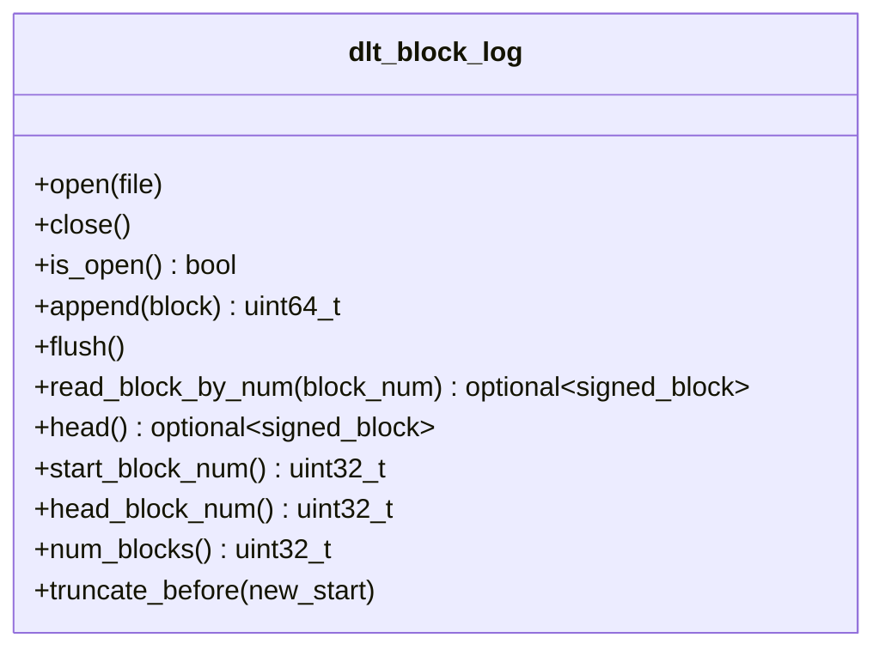

**Diagram sources**
- [dlt_block_log.hpp:35-72](file://libraries/chain/include/graphene/chain/dlt_block_log.hpp#L35-L72)

**Section sources**
- [dlt_block_log.hpp:35-72](file://libraries/chain/include/graphene/chain/dlt_block_log.hpp#L35-L72)

### Advanced Memory-Safe Implementation Details
The implementation manages sophisticated memory-mapped files with comprehensive error handling, intelligent validation, and automatic recovery mechanisms. It enforces strict position checks using std::memcpy operations instead of unsafe pointer casts, implements selective retention policies, and provides automatic pruning capabilities.

**Key Advanced Behaviors**:
- Sophisticated memory-mapped files for zero-copy reads with comprehensive error handling using std::memcpy
- Offset-aware index with intelligent header management and selective entry tracking using safe memory operations
- Strict position validation during append operations with conflict resolution using FC_ASSERT
- Intelligent index reconstruction with selective retention enforcement using atomic memory operations
- Safe truncation using temporary files with atomic swap and comprehensive validation
- Automatic pruning based on configured retention limits with selective block management

**Updated** Enhanced memory safety through std::memcpy operations replacing unsafe uint64_t pointer casts throughout the implementation

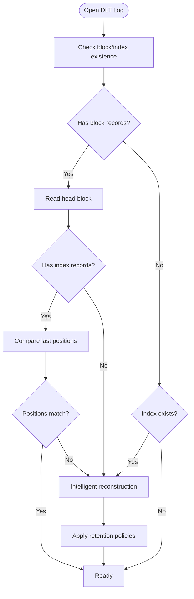

**Diagram sources**
- [dlt_block_log.cpp:161-209](file://libraries/chain/dlt_block_log.cpp#L161-L209)
- [dlt_block_log.cpp:125-159](file://libraries/chain/dlt_block_log.cpp#L125-L159)

**Section sources**
- [dlt_block_log.cpp:18-278](file://libraries/chain/dlt_block_log.cpp#L18-L278)

### Enhanced Append Operation Flow
The append operation validates sequential positioning with intelligent conflict resolution, writes block data with trailing position markers using std::memcpy, updates the index with selective retention enforcement, and maintains head state with automatic pruning triggers.

**Updated** Memory-safe append operations using std::memcpy for all data transfers

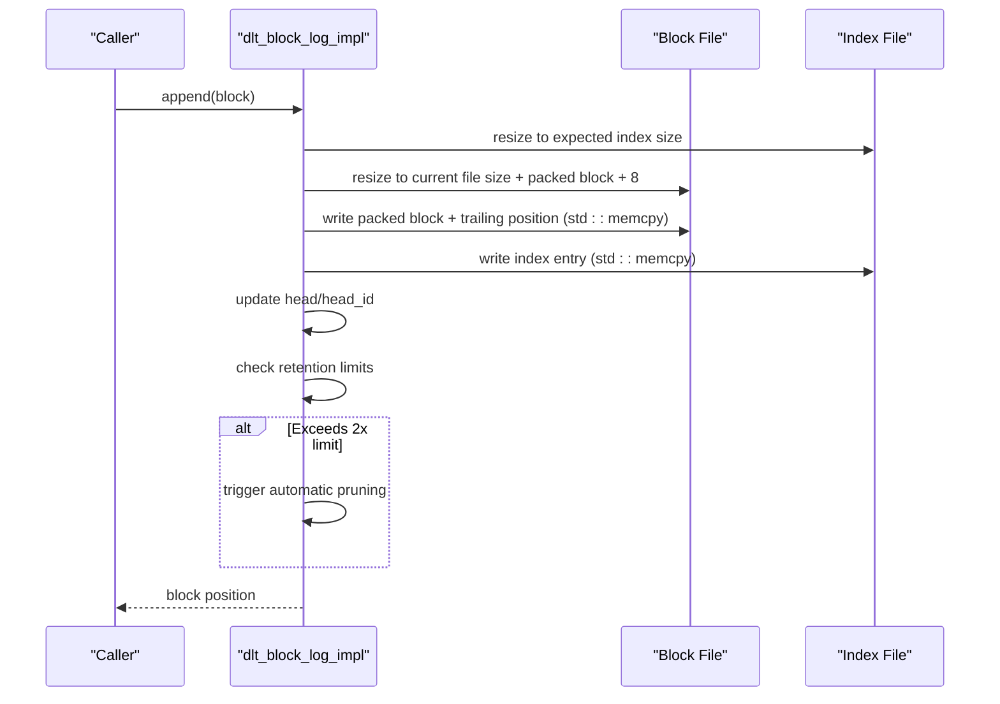

**Diagram sources**
- [dlt_block_log.cpp:211-268](file://libraries/chain/dlt_block_log.cpp#L211-L268)

**Section sources**
- [dlt_block_log.cpp:211-268](file://libraries/chain/dlt_block_log.cpp#L211-L268)

### Intelligent Truncation Process
Truncation creates temporary files containing only retained blocks with selective retention enforcement, then atomically replaces the original files with comprehensive validation and automatic cleanup using .bak files for crash recovery.

**Updated** Enhanced truncation with comprehensive crash recovery using .bak file restoration

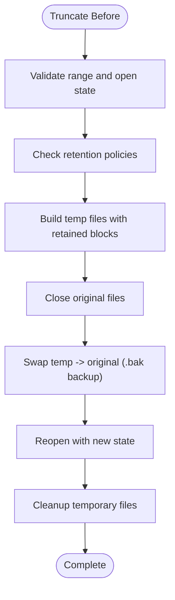

**Diagram sources**
- [dlt_block_log.cpp:356-411](file://libraries/chain/dlt_block_log.cpp#L356-L411)

**Section sources**
- [dlt_block_log.cpp:356-411](file://libraries/chain/dlt_block_log.cpp#L356-L411)

### Integrated Database Operations
The database seamlessly integrates DLT block log alongside block_log.cpp, coordinating fallback retrieval, DLT mode detection, selective retention enforcement, automatic pruning with comprehensive state management and enhanced error handling.

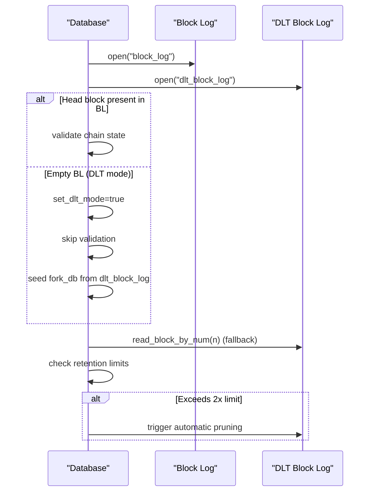

**Diagram sources**
- [database.cpp:230-268](file://libraries/chain/database.cpp#L230-L268)
- [database.cpp:560-627](file://libraries/chain/database.cpp#L560-L627)
- [database.cpp:266-292](file://libraries/chain/database.cpp#L266-L292)

**Section sources**
- [database.cpp:230-268](file://libraries/chain/database.cpp#L230-L268)
- [database.cpp:560-627](file://libraries/chain/database.cpp#L560-L627)
- [database.cpp:266-292](file://libraries/chain/database.cpp#L266-L292)

### Enhanced Snapshot Plugin Integration
The snapshot plugin provides comprehensive integration with DLT mode operations, including improved block verification, checksum validation, and seamless transition to DLT mode after snapshot import with enhanced error handling.

**Enhanced Snapshot Operations**:
- Improved block identification and verification during snapshot loading
- Enhanced checksum validation with comprehensive error reporting
- Seamless transition to DLT mode with proper state initialization
- Better integration with database layer for DLT mode operations
- Enhanced fallback mechanisms for block verification and serving
- Stalled sync detection for automatic recovery from stalled P2P sync
- Automatic snapshot reload capabilities with DLT mode support

**Section sources**
- [snapshot_plugin.cpp:1968-1970](file://plugins/snapshot/plugin.cpp#L1968-L1970)
- [snapshot_plugin.cpp:942-1054](file://plugins/snapshot/plugin.cpp#L942-L1054)
- [snapshot_plugin.cpp:1414-1500](file://plugins/snapshot/plugin.cpp#L1414-L1500)
- [snapshot_plugin.cpp:2790-2791](file://plugins/snapshot/plugin.cpp#L2790-L2791)

### Enhanced Blockchain Recovery System
The new enhanced blockchain recovery system provides comprehensive crash recovery capabilities through DLT block log replay functionality. The reindex_from_dlt method enables rebuilding blockchain state from DLT rolling block log after snapshot import, with enhanced error handling, progress tracking, and comprehensive logging.

**Key Recovery Features**:
- DLT block log replay functionality for crash recovery scenarios with progress tracking
- Automatic DLT mode activation during recovery operations with enhanced validation
- Enhanced fork database seeding with proper block validation and P2P synchronization
- Comprehensive error handling with detailed logging and graceful degradation mechanisms
- Selective block replay with progress tracking and memory management optimization
- Atomic operation support with temporary file management for data integrity
- Enhanced logging with percentage completion and memory usage reporting
- Graceful handling of interrupted recovery operations with automatic cleanup

**Section sources**
- [database.cpp:438-544](file://libraries/chain/database.cpp#L438-L544)
- [plugin.cpp:542-555](file://plugins/chain/plugin.cpp#L542-L555)

## Memory Safety and Cross-Platform Enhancements

### Critical Memory Safety Improvements
The DLT block log implementation has undergone significant memory safety improvements, replacing all unsafe uint64_t pointer casts with std::memcpy operations throughout the codebase. This change ensures cross-platform compatibility and eliminates potential undefined behavior issues.

**Memory Safety Features**:
- All uint64_t data extraction now uses std::memcpy instead of reinterpret_cast<uint64_t*>(ptr)
- Safe memory copying operations with explicit bounds checking using FC_ASSERT
- Cross-platform compatible memory operations that work consistently across different architectures
- Elimination of undefined behavior from pointer casting operations
- Enhanced validation of memory access patterns with comprehensive error reporting

**Updated** Memory safety improvements implemented across all data access operations

**Section sources**
- [dlt_block_log.cpp:44-65](file://libraries/chain/dlt_block_log.cpp#L44-L65)
- [dlt_block_log.cpp:146-159](file://libraries/chain/dlt_block_log.cpp#L146-L159)
- [dlt_block_log.cpp:253-297](file://libraries/chain/dlt_block_log.cpp#L253-L297)

### Enhanced Cross-Platform Compatibility
The implementation now provides comprehensive cross-platform compatibility through standardized file operations and memory-mapped file handling. The codebase leverages FC library abstractions that ensure consistent behavior across different operating systems and architectures.

**Cross-Platform Features**:
- Standardized file operations using boost::filesystem and fc::filesystem abstractions
- Consistent memory-mapped file handling across platforms
- Platform-independent error handling and exception reporting
- Cross-platform compatible file naming conventions (.bak, .tmp extensions)
- Unified logging mechanisms that work across different environments

**Section sources**
- [dlt_block_log.cpp:172-202](file://libraries/chain/dlt_block_log.cpp#L172-L202)
- [dlt_block_log.cpp:432-444](file://libraries/chain/dlt_block_log.cpp#L432-L444)

## Crash Recovery and Atomic Operations

### Comprehensive Crash Recovery Mechanisms
The DLT block log implementation includes sophisticated crash recovery mechanisms that ensure data integrity even during unexpected shutdowns or system failures. The system automatically detects and recovers from interrupted operations using .bak file restoration.

**Crash Recovery Features**:
- Automatic detection of interrupted truncation operations through .bak file monitoring
- Safe restoration of data from .bak files when original files are missing or corrupted
- Atomic file operations using temporary files (.tmp) and backup files (.bak)
- Comprehensive cleanup of stale temporary files during startup
- Graceful degradation when crash recovery is not possible

**Updated** Enhanced crash recovery with .bak file restoration and atomic operation guarantees

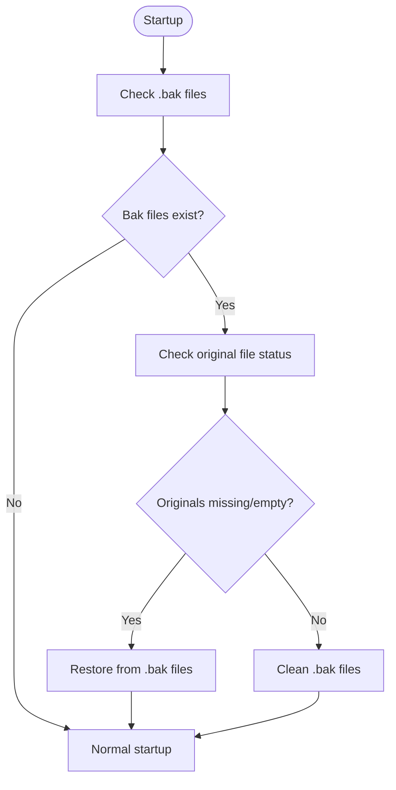

**Diagram sources**
- [dlt_block_log.cpp:172-202](file://libraries/chain/dlt_block_log.cpp#L172-L202)

**Section sources**
- [dlt_block_log.cpp:172-202](file://libraries/chain/dlt_block_log.cpp#L172-L202)
- [dlt_block_log.cpp:432-444](file://libraries/chain/dlt_block_log.cpp#L432-L444)

### Atomic File Operations
The truncation process implements atomic file operations to ensure data consistency. The system uses a three-phase approach: backup original files, write new files to temporary locations, then atomically replace originals.

**Atomic Operation Features**:
- Backup original files to .bak before any modifications
- Write new data to .tmp files to avoid partial writes
- Atomic rename operations that are guaranteed to succeed or fail completely
- Automatic cleanup of backup files after successful operations
- Comprehensive rollback capability if operations fail

**Section sources**
- [dlt_block_log.cpp:432-444](file://libraries/chain/dlt_block_log.cpp#L432-L444)

## Selective Retention Policies
The DLT rolling block log implements sophisticated selective retention policies that allow fine-grained control over which blocks are maintained and when automatic pruning occurs. These policies ensure optimal disk usage while maintaining serviceability for P2P peers.

**Retention Policy Features**:
- Configurable maximum block retention with runtime parameter control
- Intelligent pruning threshold management (2x limit vs. configured retention)
- Selective block preservation based on last irreversible block (LIB) boundaries
- Automatic cleanup of obsolete blocks while preserving serviceable ranges
- Flexible retention window adjustment for different operational requirements

**Section sources**
- [plugin.cpp:327-329](file://plugins/chain/plugin.cpp#L327-L329)
- [database.cpp:4005-4036](file://libraries/chain/database.cpp#L4005-L4036)
- [database.cpp:4170-4172](file://libraries/chain/database.cpp#L4170-L4172)
- [database.cpp:4392-4394](file://libraries/chain/database.cpp#L4392-L4394)

## Automatic Pruning Capabilities
The DLT rolling block log provides comprehensive automatic pruning capabilities that maintain optimal performance and disk usage through intelligent block lifecycle management and selective cleanup operations.

**Pruning Mechanism Features**:
- Automatic pruning triggered when block count exceeds 2x configured retention limit
- Intelligent block range calculation based on head block number and retention policy
- Atomic file replacement with temporary file management for data integrity
- Comprehensive validation and cleanup of temporary files after successful pruning
- Selective pruning that preserves serviceable blocks while removing obsolete data

**Section sources**
- [database.cpp:4043-4047](file://libraries/chain/database.cpp#L4043-L4047)
- [database.cpp:4189-4192](file://libraries/chain/database.cpp#L4189-L4192)
- [database.cpp:4419-4421](file://libraries/chain/database.cpp#L4419-L4421)

## Enhanced Blockchain Recovery System
The new enhanced blockchain recovery system provides comprehensive crash recovery capabilities through DLT block log replay functionality. The reindex_from_dlt method enables rebuilding blockchain state from DLT rolling block log after snapshot import, with enhanced error handling, progress tracking, and comprehensive logging.

**Enhanced Recovery System Features**:
- DLT block log replay functionality with progress tracking and percentage completion reporting
- Automatic DLT mode activation during recovery operations with enhanced validation logic
- Enhanced fork database seeding with proper block validation and P2P synchronization support
- Comprehensive error handling with detailed logging and graceful degradation mechanisms
- Selective block replay with progress tracking, memory management optimization, and checkpointing
- Atomic operation support with temporary file management for data integrity during recovery
- Enhanced logging with memory usage reporting and performance metrics
- Graceful handling of interrupted recovery operations with automatic cleanup and state restoration

**Section sources**
- [database.cpp:438-544](file://libraries/chain/database.cpp#L438-L544)
- [plugin.cpp:542-555](file://plugins/chain/plugin.cpp#L542-L555)

## Configuration Management
The chain plugin provides comprehensive runtime configuration management for DLT rolling block log operations, allowing flexible control over retention policies, pruning thresholds, and operational parameters.

**Configuration Parameters**:
- `dlt-block-log-max-blocks`: Maximum number of recent blocks to keep in the rolling DLT block log (default: 100,000)
- Runtime parameter validation and enforcement
- Integration with database state management for seamless operation
- Support for disabling DLT block log functionality (0 = disabled)

**Section sources**
- [plugin.cpp:233-236](file://plugins/chain/plugin.cpp#L233-L236)
- [plugin.cpp:326-329](file://plugins/chain/plugin.cpp#L326-L329)

## Dependency Analysis
The DLT rolling block log implementation has comprehensive dependencies across multiple system components, providing robust integration with the blockchain infrastructure while maintaining separation of concerns.

**Core Dependencies**:
- dlt_block_log.hpp/cpp depends on:
  - Protocol block definitions for signed blocks with comprehensive serialization
  - Boost iostreams for advanced memory-mapped file access with error handling
  - Boost filesystem for sophisticated file operations and cleanup
  - FC library for comprehensive assertions, data streams, and logging
- database.cpp integrates DLT block log with comprehensive fallback mechanisms and state management
- plugin.cpp configures DLT rolling block log with runtime parameter management and validation
- snapshot_plugin.cpp provides enhanced integration with DLT mode operations and block verification
- p2p_plugin.cpp implements enhanced error handling and graceful fallback mechanisms for DLT mode scenarios
- fork_database.cpp provides enhanced fork database management with automatic seeding capabilities

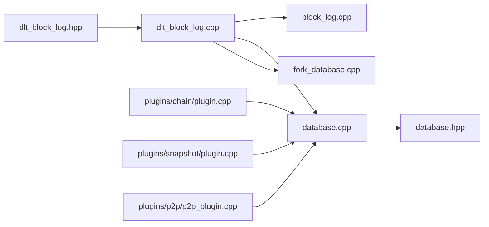

**Diagram sources**
- [dlt_block_log.hpp:1-10](file://libraries/chain/include/graphene/chain/dlt_block_log.hpp#L1-L10)
- [dlt_block_log.cpp:1-7](file://libraries/chain/dlt_block_log.cpp#L1-L7)
- [block_log.cpp:1-6](file://libraries/chain/block_log.cpp#L1-L6)
- [database.cpp:1-10](file://libraries/chain/database.cpp#L1-L10)
- [fork_database.cpp:1-6](file://libraries/chain/fork_database.cpp#L1-L6)
- [plugin.cpp:1-10](file://plugins/chain/plugin.cpp#L1-L10)
- [snapshot_plugin.cpp:1960-2039](file://plugins/snapshot/plugin.cpp#L1960-L2039)
- [p2p_plugin.cpp:1-10](file://plugins/p2p/p2p_plugin.cpp#L1-L10)

**Section sources**
- [dlt_block_log.hpp:1-10](file://libraries/chain/include/graphene/chain/dlt_block_log.hpp#L1-L10)
- [dlt_block_log.cpp:1-7](file://libraries/chain/dlt_block_log.cpp#L1-L7)
- [block_log.cpp:1-6](file://libraries/chain/block_log.cpp#L1-L6)
- [database.cpp:1-10](file://libraries/chain/database.cpp#L1-L10)
- [fork_database.cpp:1-6](file://libraries/chain/fork_database.cpp#L1-L6)
- [plugin.cpp:1-10](file://plugins/chain/plugin.cpp#L1-L10)
- [snapshot_plugin.cpp:1960-2039](file://plugins/snapshot/plugin.cpp#L1960-L2039)
- [p2p_plugin.cpp:1-10](file://plugins/p2p/p2p_plugin.cpp#L1-L10)

## Performance Considerations
The DLT rolling block log implementation provides optimized performance characteristics through advanced memory management, intelligent caching strategies, and efficient I/O operations designed for high-throughput blockchain operations.

**Performance Optimizations**:
- Sophisticated memory-mapped files enabling zero-copy reads with comprehensive error handling
- Offset-aware index allowing O(1) lookup performance with intelligent caching
- Batched write operations with selective retention enforcement for optimal throughput
- Intelligent truncation scheduling during low-traffic periods to minimize latency impact
- Configurable retention limits preventing excessive disk usage and rebuild overhead
- Automatic pruning reduces fragmentation and maintains optimal file system performance
- **Enhanced Memory Safety**: std::memcpy operations provide predictable performance across platforms
- **Improved Reliability**: Crash recovery mechanisms eliminate data corruption risks
- **Enhanced Recovery Performance**: DLT block log replay provides faster recovery than full blockchain reindex
- **Optimized Recovery Operations**: Progress tracking and memory management improve recovery performance
- **Enhanced Runtime Access**: Non-const accessor methods enable efficient runtime property modifications

## Enhanced Error Handling and Fallback Mechanisms

### Improved DLT Mode Detection and Validation
The database now includes enhanced DLT mode detection with improved validation logic. When the primary block log is empty but the database has state (loaded from snapshot), the system sets DLT mode and skips block log validation with comprehensive logging and graceful fallback mechanisms.

**Enhanced DLT Mode Features**:
- Improved detection logic when block_log.read_block_by_num(head_block_num()) fails
- Enhanced logging with detailed information about DLT mode activation
- Graceful fallback mechanisms that prevent crashes when block data is unavailable
- Better integration between database and DLT block log for seamless operation
- Comprehensive error reporting for DLT mode initialization and operation

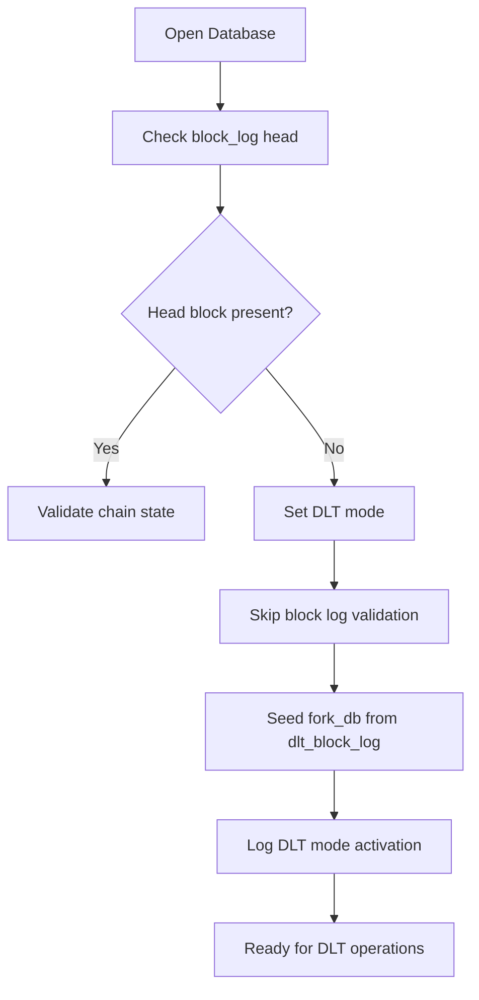

**Diagram sources**
- [database.cpp:250-271](file://libraries/chain/database.cpp#L250-L271)
- [database.cpp:266-292](file://libraries/chain/database.cpp#L266-L292)

**Section sources**
- [database.cpp:259-268](file://libraries/chain/database.cpp#L259-L268)
- [database.cpp:262-267](file://libraries/chain/database.cpp#L262-L267)
- [database.cpp:266-292](file://libraries/chain/database.cpp#L266-L292)

### Enhanced P2P Fallback Implementation
The P2P plugin now includes significantly enhanced error handling specifically designed for DLT mode scenarios. When serving blocks to peers in DLT mode, the system gracefully handles cases where block data may not be available for certain ranges, providing detailed logging and appropriate error responses with comprehensive error reporting.

**Enhanced P2P Error Handling Features**:
- Graceful fallback from primary block log to DLT rolling block log with detailed logging
- Specialized error handling for DLT mode where block data may not be available for early blocks
- Improved error reporting with specific messages for DLT mode block availability issues
- Proper exception handling with fc::key_not_found_exception for unavailable blocks in DLT mode
- Enhanced debugging information for troubleshooting DLT mode block serving issues
- Detailed logging with "Block ${id} not available in DLT mode (no block data for this range)" messages
- Graceful fallback mechanism that logs detailed information about why blocks are unavailable

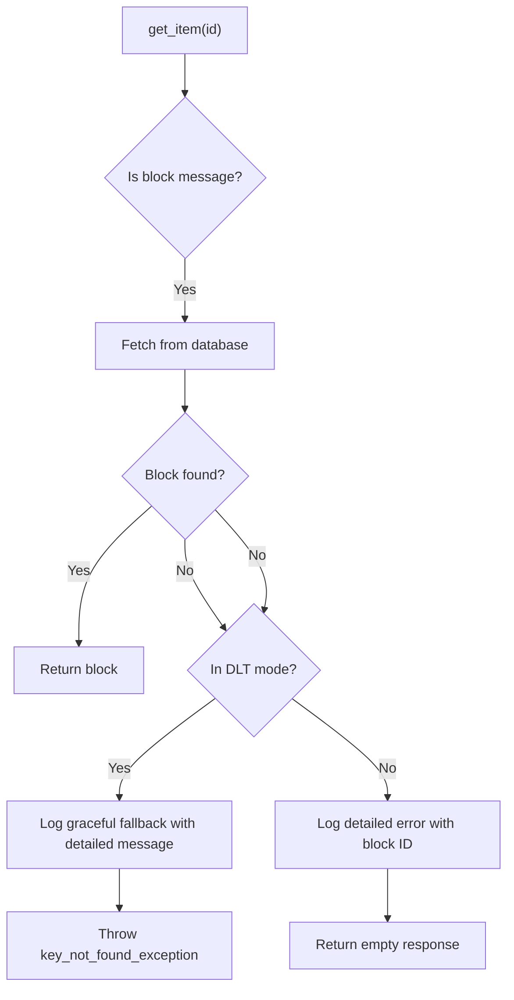

**Diagram sources**
- [p2p_plugin.cpp:259-286](file://plugins/p2p/p2p_plugin.cpp#L259-L286)

**Section sources**
- [p2p_plugin.cpp:265-272](file://plugins/p2p/p2p_plugin.cpp#L265-L272)

### Enhanced Database Fallback Logic
The database layer now includes improved fallback mechanisms with better error handling and logging for DLT mode operations. The fallback logic provides more detailed information about why blocks may not be available and handles edge cases more gracefully with comprehensive error reporting.

**Enhanced Database Fallback Features**:
- Improved logging for DLT mode fallback scenarios with detailed error messages
- Better error reporting when blocks are not found in either log
- Enhanced validation and error handling for DLT mode operations
- More informative error messages for debugging DLT mode issues
- Graceful handling of edge cases in block serving operations
- Comprehensive fallback chain: fork_db → block_log → dlt_block_log → error

**Section sources**
- [database.cpp:576-580](file://libraries/chain/database.cpp#L576-L580)
- [database.cpp:609-613](file://libraries/chain/database.cpp#L609-L613)

### Enhanced Storage-Related Error Reporting
The system now provides comprehensive error reporting for storage-related issues in DLT mode, including detailed logging of block availability problems and graceful degradation mechanisms.

**Enhanced Storage Error Handling**:
- Detailed logging of block availability issues in DLT mode
- Graceful fallback mechanisms that prevent crashes when blocks are unavailable
- Comprehensive error messages that help operators diagnose storage issues
- Proper exception handling that maintains system stability
- Enhanced debugging information for troubleshooting DLT mode block serving

**Section sources**
- [database.cpp:599-621](file://libraries/chain/database.cpp#L599-L621)
- [database.cpp:623-640](file://libraries/chain/database.cpp#L623-L640)

### Strengthened Block Validation Logic
The DLT block log implementation now includes enhanced validation logic with comprehensive error checking and reporting. The validation ensures data integrity and provides detailed feedback when inconsistencies are detected.

**Enhanced Validation Features**:
- Improved position validation during append operations with conflict resolution
- Enhanced index reconstruction with selective retention enforcement
- Better error reporting for validation failures and recovery operations
- Comprehensive logging of validation results and corrective actions
- Strengthened block verification with detailed error messages

**Section sources**
- [dlt_block_log.cpp:241-249](file://libraries/chain/dlt_block_log.cpp#L241-L249)
- [dlt_block_log.cpp:320-325](file://libraries/chain/dlt_block_log.cpp#L320-L325)

### Enhanced Blockchain Recovery Error Handling
The enhanced blockchain recovery system includes comprehensive error handling with detailed logging and graceful degradation mechanisms. The system provides informative error messages and continues operation when recovery is not possible.

**Enhanced Recovery Error Handling Features**:
- Detailed logging of recovery operations with progress tracking and percentage completion
- Graceful fallback when DLT block log replay fails with comprehensive error reporting
- Continued operation with snapshot state when recovery is not possible
- Enhanced debugging information for troubleshooting recovery issues
- Automatic cleanup and state restoration for interrupted recovery operations
- Memory usage reporting and performance metrics during recovery operations

**Section sources**
- [database.cpp:438-544](file://libraries/chain/database.cpp#L438-L544)
- [plugin.cpp:542-555](file://plugins/chain/plugin.cpp#L542-L555)

## DLT Mode Fork Database Seeding

### Automatic Fork Database Seeding Functionality
The DLT mode now includes sophisticated automatic fork database seeding functionality that enhances P2P synchronization capabilities. When the database detects DLT mode (empty block log with existing chain state), it attempts to seed the fork database from the DLT block log head, enabling immediate P2P synchronization.

**Enhanced Fork Database Seeding Features**:
- Automatic detection of DLT mode conditions during database initialization
- Intelligent validation of DLT block log head against current chain state
- Conditional seeding of fork database when DLT block log covers the head block
- Graceful fallback to minimal fork database entry when DLT block log is incomplete
- Comprehensive logging of seeding operations and their outcomes
- Enhanced P2P synchronization capabilities through proper fork database state

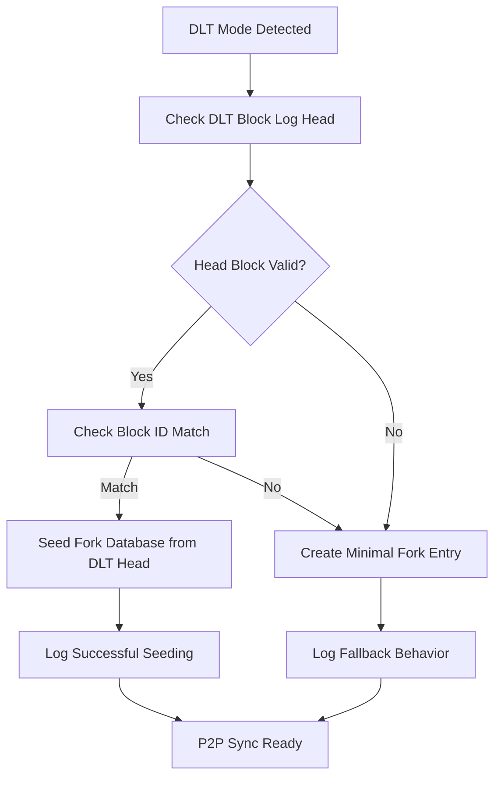

**Diagram sources**
- [database.cpp:266-292](file://libraries/chain/database.cpp#L266-L292)

**Section sources**
- [database.cpp:266-292](file://libraries/chain/database.cpp#L266-L292)

### Enhanced Fork Database Integration
The fork database now integrates more closely with DLT mode operations, providing automatic seeding capabilities and improved block availability checking logic. The fork database can be seeded from DLT block log data or created as minimal entries for P2P synchronization.

**Enhanced Fork Database Features**:
- Automatic seeding from DLT block log head when available
- Minimal fork database entries for P2P synchronization in DLT mode
- Improved block availability checking with DLT mode awareness
- Enhanced error handling for fork database operations
- Better integration with DLT block log for seamless operation

**Section sources**
- [fork_database.cpp:24-28](file://libraries/chain/fork_database.cpp#L24-L28)
- [database.cpp:266-292](file://libraries/chain/database.cpp#L266-L292)

## Enhanced Block Availability Checking

### Improved DLT Mode Block Availability Logic
The block availability checking logic has been significantly enhanced to provide better support for DLT mode operations. The system now uses block_summary objects as hints and verifies block availability against the preferred chain, with special handling for DLT mode scenarios.

**Enhanced Block Availability Features**:
- DLT mode-aware block availability checking with improved logic
- Block summary object verification for faster block existence checks
- Preferred chain verification to ensure blocks are part of the main chain
- Enhanced error handling for DLT mode block availability issues
- Improved fallback mechanisms for block retrieval operations

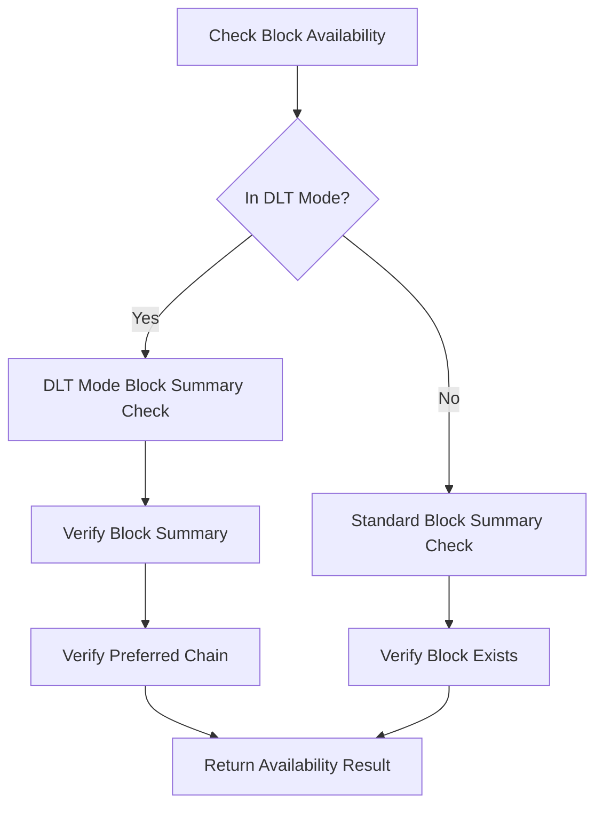

**Diagram sources**
- [database.cpp:560-595](file://libraries/chain/database.cpp#L560-L595)

**Section sources**
- [database.cpp:560-595](file://libraries/chain/database.cpp#L560-L595)

### Enhanced Block Retrieval Chain
The block retrieval chain has been improved to provide better fallback mechanisms and error handling. The system now follows a more sophisticated chain of fallbacks: fork_db → block_log → DLT block log → error, with enhanced validation at each step.

**Enhanced Block Retrieval Features**:
- Improved block retrieval chain with better error handling
- Enhanced validation of block IDs at each stage
- Better integration between fork database and DLT block log
- Improved error reporting for block retrieval failures
- Enhanced fallback mechanisms for different block sources

**Section sources**
- [database.cpp:656-697](file://libraries/chain/database.cpp#L656-L697)

## Stalled Sync Detection for DLT Nodes

### Automatic Stalled Sync Detection and Recovery
The snapshot plugin now includes sophisticated stalled sync detection capabilities specifically designed for DLT nodes. This feature automatically monitors P2P sync progress and can detect when the node becomes stalled, triggering automatic recovery mechanisms.

**Stalled Sync Detection Features**:
- Configurable timeout settings for detecting stalled P2P sync
- Automatic detection of no block reception for extended periods
- Integration with trusted peer network for automatic snapshot reload
- Graceful recovery through snapshot reload without manual intervention
- Comprehensive logging of stalled sync events and recovery actions
- Automatic restart of sync detection after recovery

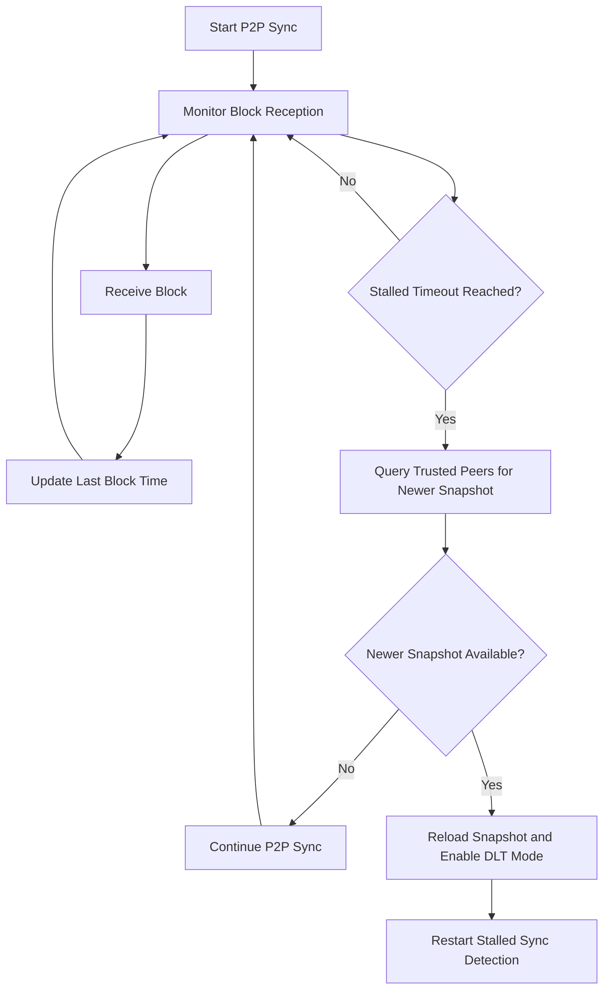

**Diagram sources**
- [snapshot_plugin.cpp:1435-1500](file://plugins/snapshot/plugin.cpp#L1435-L1500)
- [snapshot_plugin.cpp:2790-2791](file://plugins/snapshot/plugin.cpp#L2790-L2791)

**Section sources**
- [snapshot_plugin.cpp:1414-1500](file://plugins/snapshot/plugin.cpp#L1414-L1500)
- [snapshot_plugin.cpp:2790-2791](file://plugins/snapshot/plugin.cpp#L2790-L2791)

### Enhanced Configuration Options
The stalled sync detection system provides comprehensive configuration options for operators to tune the behavior according to their network conditions and requirements.

**Configuration Options**:
- `enable-stalled-sync-detection`: Enable/disable stalled sync detection (default: false)
- `stalled-sync-timeout-minutes`: Timeout period before considering sync stalled (default: 5 minutes)
- Integration with trusted peer network for automatic snapshot discovery
- Automatic snapshot reload without manual intervention
- Comprehensive logging and monitoring capabilities

**Section sources**
- [snapshot_plugin.cpp:2691-2696](file://plugins/snapshot/plugin.cpp#L2691-L2696)
- [snapshot_plugin.cpp:2863-2866](file://plugins/snapshot/plugin.cpp#L2863-L2866)

## Enhanced Gap Handling During Synchronization

### Enhanced Gap Management in DLT Mode
The DLT rolling block log now includes sophisticated gap handling capabilities that manage the synchronization gap between the fork database and DLT block log. This enhancement ensures smooth operation during the critical period when the DLT block log is catching up to the fork database.

**Enhanced Gap Handling Features**:
- Automatic detection of gaps between fork database and DLT block log
- Intelligent logging of gap status with detailed information about progress
- Graceful handling of missing blocks in DLT block log during gap periods
- Automatic seeding of DLT block log from fork database as blocks become available
- Enhanced logging with gap filling progress and completion notifications
- Prevention of repeated logging for the same gap status

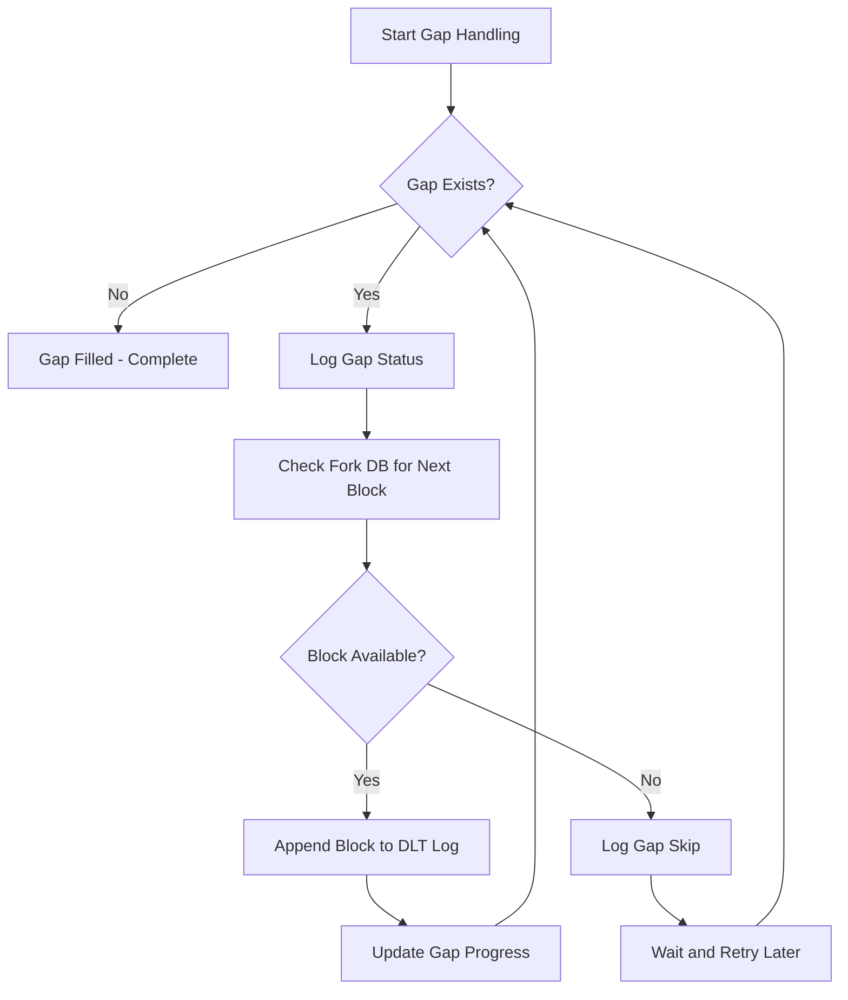

**Diagram sources**
- [database.cpp:4581-4608](file://libraries/chain/database.cpp#L4581-L4608)

**Section sources**
- [database.cpp:4581-4608](file://libraries/chain/database.cpp#L4581-L4608)

### Enhanced Gap Logging and Monitoring
The gap handling system provides comprehensive logging and monitoring capabilities to track the progress of gap filling operations. This includes detailed information about gap status, progress indicators, and completion notifications.

**Enhanced Gap Logging Features**:
- Detailed logging of gap status with block numbers and progress indicators
- Information about DLT head block, LIB (Last Irreversible Block), and gap size
- Prevention of repeated logging for the same gap status
- Notification when gap begins to fill and when it completes
- Enhanced debugging information for troubleshooting gap handling issues

**Section sources**
- [database.cpp:4581-4608](file://libraries/chain/database.cpp#L4581-L4608)

## DLT Block Log Accessibility Enhancement

### Enhanced DLT Block Log Accessor Methods
The DLT block log accessibility has been significantly enhanced with the introduction of both const and non-const accessor methods. This enhancement enables external components to modify DLT block log properties during runtime operations while maintaining read-only access for general use.

**Enhanced Accessor Methods**:
- `const dlt_block_log &get_dlt_block_log() const` - Provides read-only access for general use
- `dlt_block_log &get_dlt_block_log()` - Provides mutable access for external components to modify DLT block log properties during runtime operations

**Runtime Property Modification Capabilities**:
- External components can modify DLT block log properties during runtime operations
- Maintains thread safety through proper locking mechanisms
- Enables dynamic configuration of DLT block log behavior based on operational requirements
- Supports runtime adjustments to retention policies and pruning thresholds
- Allows external components to optimize DLT block log performance based on current workload

**Integration with External Components**:
- Chain plugin can modify DLT block log properties during recovery operations
- Snapshot plugin can adjust DLT block log behavior during snapshot import
- P2P plugin can optimize DLT block log access patterns for peer synchronization
- Database layer can dynamically adjust DLT block log configuration based on memory usage

**Section sources**
- [database.hpp:515-516](file://libraries/chain/include/graphene/chain/database.hpp#L515-L516)
- [plugin.cpp:627-627](file://plugins/chain/plugin.cpp#L627-L627)
- [snapshot_plugin.cpp:1473-1476](file://plugins/snapshot/plugin.cpp#L1473-L1476)

### Enhanced External Component Integration
The enhanced accessibility model provides comprehensive integration capabilities for external components that need to interact with the DLT block log during runtime operations.

**External Component Integration Features**:
- Chain plugin can access DLT block log for recovery operations with mutable access
- Snapshot plugin can modify DLT block log properties during snapshot import
- P2P plugin can optimize DLT block log access patterns for peer synchronization
- Database layer can dynamically adjust DLT block log configuration based on operational requirements
- Enhanced error handling and validation for external component modifications
- Thread-safe access patterns that prevent race conditions during runtime modifications

**Section sources**
- [plugin.cpp:626-632](file://plugins/chain/plugin.cpp#L626-L632)
- [snapshot_plugin.cpp:1472-1477](file://plugins/snapshot/plugin.cpp#L1472-L1477)

## Troubleshooting Guide
Comprehensive troubleshooting guidance for DLT-specific scenarios, retention policy issues, automatic pruning failures, enhanced blockchain recovery problems, configuration issues, and the new DLT block log accessibility enhancement with systematic diagnostic approaches and enhanced error reporting.

**Common DLT Mode Issues**:
- Index mismatch detection and automatic reconstruction with selective retention enforcement
- Empty block log in DLT mode validation and fallback mechanism verification
- Truncation failures with temporary file cleanup and atomic operation validation
- Retention policy violations with selective block preservation and pruning triggers
- Configuration parameter validation and runtime parameter enforcement
- Enhanced block verification failures during snapshot operations
- P2P fallback errors in DLT mode with detailed logging and error reporting
- Graceful fallback mechanism failures with proper exception handling
- Storage-related issues with comprehensive error messages and logging
- Enhanced synchronization issues with detailed logging capabilities
- **Memory Safety Issues**: Unsafe pointer cast errors resolved through std::memcpy operations
- **Crash Recovery Problems**: .bak file restoration failures and atomic operation issues
- **Cross-Platform Compatibility**: Platform-specific file operation problems
- **Fork Database Seeding Failures**: Issues with automatic DLT mode fork database seeding
- **Enhanced Block Availability Problems**: DLT mode block availability checking failures
- **Improved Error Handling**: Better error reporting and logging throughout the system
- **Stalled Sync Detection Issues**: Timeout configuration problems and recovery failures
- **Snapshot Reload Failures**: Automatic snapshot reload mechanism issues
- **Gap Handling Problems**: Issues with DLT mode gap management and synchronization
- **Enhanced Blockchain Recovery Issues**: DLT block log replay failures and recovery mechanism problems
- **Recovery Progress Tracking**: Missing progress indicators and percentage completion reporting
- **DLT Block Log Accessibility Issues**: Problems with const/non-const accessor method usage
- **Runtime Property Modification Failures**: Issues with external components modifying DLT block log properties

**Section sources**
- [dlt_block_log.cpp:161-209](file://libraries/chain/dlt_block_log.cpp#L161-L209)
- [dlt_block_log.cpp:356-411](file://libraries/chain/dlt_block_log.cpp#L356-L411)
- [database.cpp:259-268](file://libraries/chain/database.cpp#L259-L268)
- [p2p_plugin.cpp:265-272](file://plugins/p2p/p2p_plugin.cpp#L265-L272)
- [database.cpp:266-292](file://libraries/chain/database.cpp#L266-L292)
- [database.cpp:560-595](file://libraries/chain/database.cpp#L560-L595)
- [snapshot_plugin.cpp:1435-1500](file://plugins/snapshot/plugin.cpp#L1435-L1500)
- [database.cpp:438-544](file://libraries/chain/database.cpp#L438-L544)
- [database.hpp:515-516](file://libraries/chain/include/graphene/chain/database.hpp#L515-L516)

## Conclusion
The DLT Rolling Block Log provides a comprehensive, offset-aware append-only storage mechanism specifically designed for snapshot-based nodes with advanced selective retention policies and automatic pruning capabilities. Recent enhancements include critical memory safety improvements replacing unsafe pointer casts with std::memcpy operations throughout the implementation, comprehensive crash recovery mechanisms with .bak file restoration for atomic file operations, enhanced cross-platform compatibility through standardized file operations, and strengthened validation logic with comprehensive error reporting. The most significant enhancement is the improved DLT block log accessibility with both const and non-const accessor methods, enabling external components to modify DLT block log properties during runtime operations while maintaining read-only access for general use.

The enhanced accessibility model provides comprehensive integration capabilities for external components that need to interact with the DLT block log during runtime operations. The chain plugin can now modify DLT block log properties during recovery operations, the snapshot plugin can adjust DLT block log behavior during snapshot import, and the P2P plugin can optimize DLT block log access patterns for peer synchronization. This enhancement maintains thread safety through proper locking mechanisms while enabling dynamic configuration of DLT block log behavior based on operational requirements.

The enhanced P2P fallback mechanisms now provide graceful handling of DLT mode scenarios where block data may not be available for certain ranges, with detailed logging and appropriate error responses including specific messages like "Block ${id} not available in DLT mode (no block data for this range)". The most notable recent enhancement is the sophisticated gap handling during synchronization between fork database and DLT block log. This system automatically manages the critical period when the DLT block log is catching up to the fork database, with intelligent logging, automatic seeding, and graceful handling of missing blocks. The gap handling system prevents repeated logging for the same gap status and provides detailed progress notifications, ensuring smooth operation during the synchronization process.

The new enhanced blockchain recovery system represents a major advancement in DLT node reliability and operational efficiency. The reindex_from_dlt method provides core functionality for rebuilding blockchain state from DLT rolling block log after snapshot import, with comprehensive error handling, progress tracking, enhanced fork database seeding, and detailed logging capabilities. This system enables rapid recovery from corrupted states while maintaining data integrity and operational continuity, with enhanced progress reporting and memory management optimization.

Its sophisticated integration with the database ensures seamless fallback when the primary block log is empty, while configurable limits, intelligent retention enforcement, and automatic cleanup mechanisms help manage disk usage efficiently. The implementation leverages advanced memory-mapped files, strict position validation using std::memcpy operations, and comprehensive error handling to deliver reliable performance and data integrity for modern blockchain operations. The improved error handling and fallback mechanisms ensure that DLT mode operations are robust, well-documented, and provide excellent user experience for both operators and P2P peers with comprehensive logging and graceful degradation capabilities. The critical memory safety improvements eliminate undefined behavior risks, while the crash recovery mechanisms ensure data integrity even during unexpected system failures. The enhanced fork database seeding and block availability checking logic provide comprehensive support for DLT mode operations, making the system more reliable and user-friendly for snapshot-based node operations. The stalled sync detection feature further enhances the system's resilience and operational efficiency by automatically handling network connectivity issues without manual intervention. The enhanced gap handling capabilities and new blockchain recovery system represent significant improvements in DLT mode synchronization reliability, user experience, and operational efficiency. The latest accessibility enhancement completes the comprehensive DLT block log functionality by enabling external components to modify DLT block log properties during runtime operations while maintaining read-only access for general use, providing a robust foundation for advanced DLT node operations.