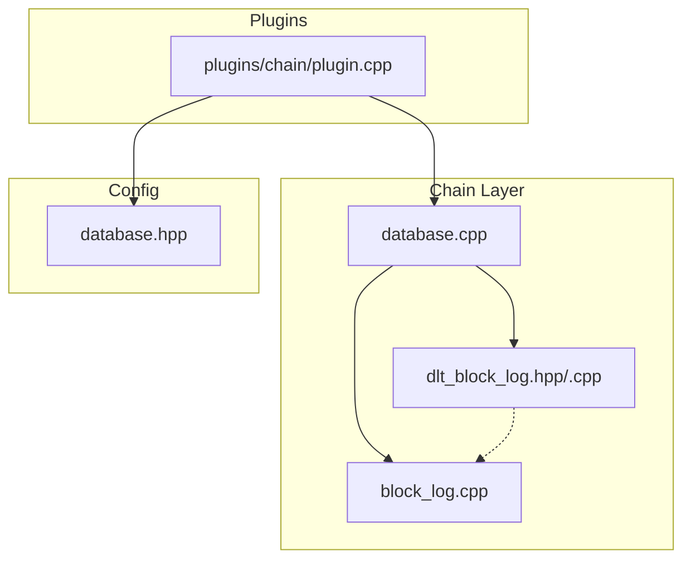
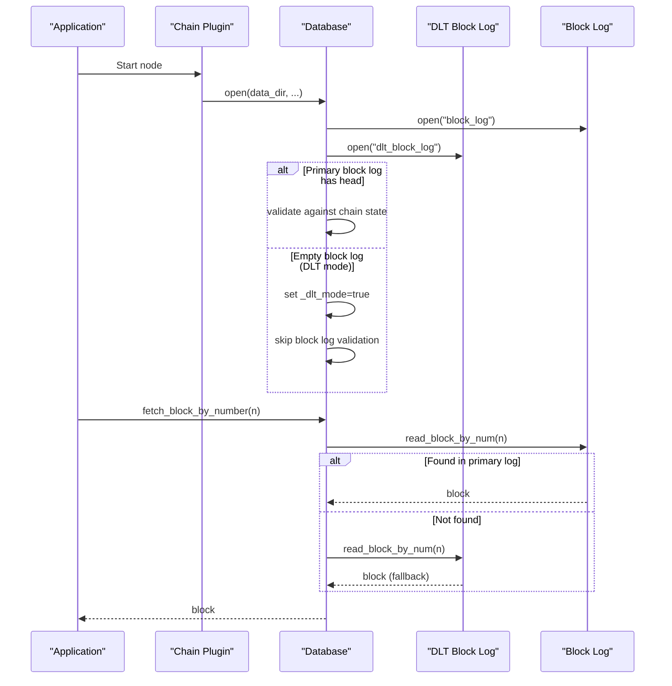
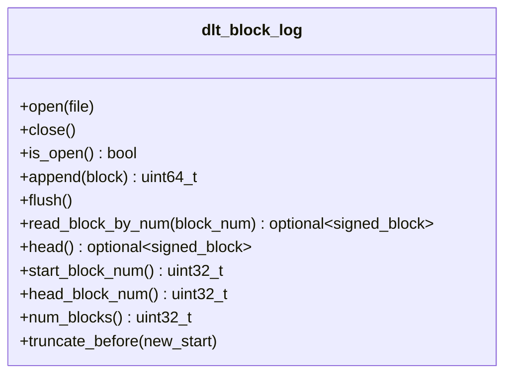
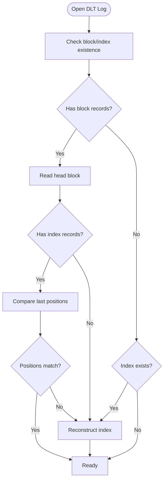
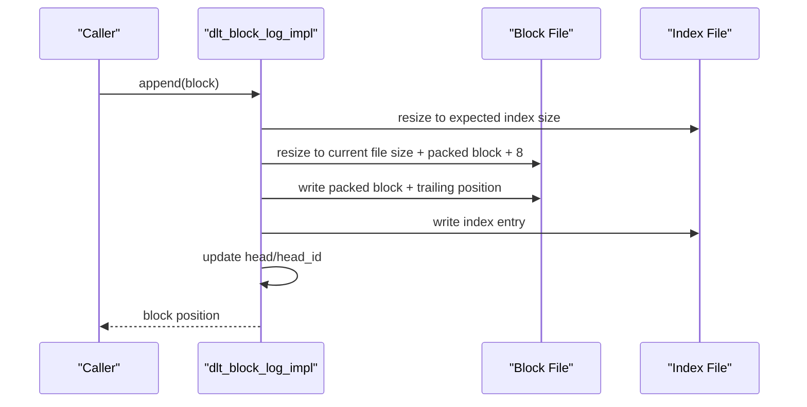
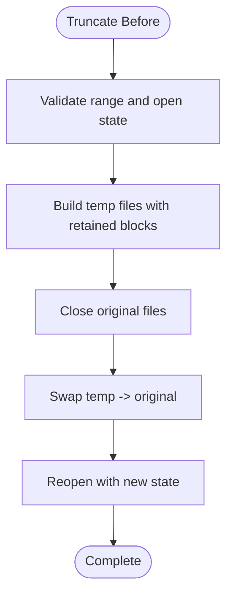
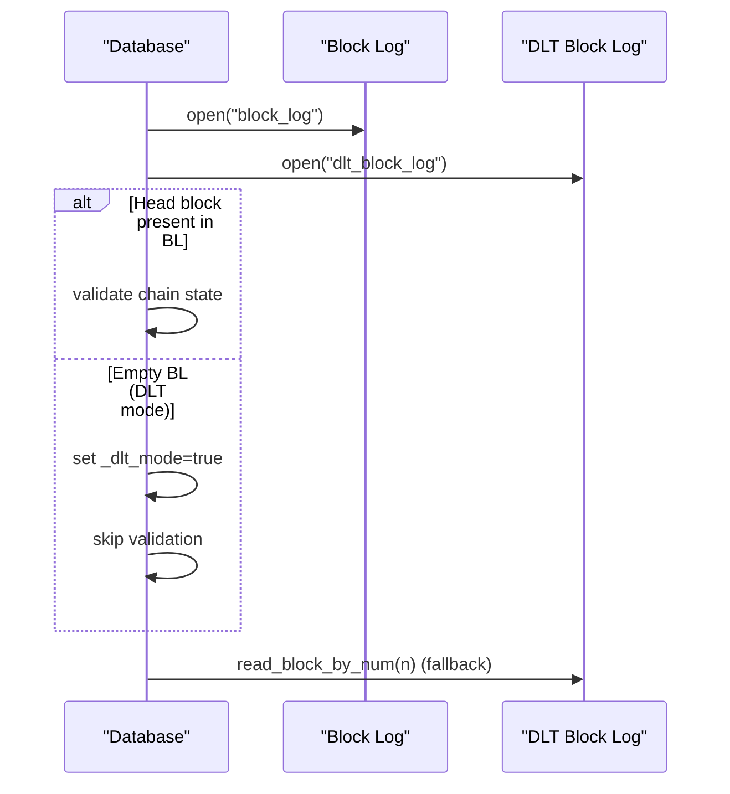
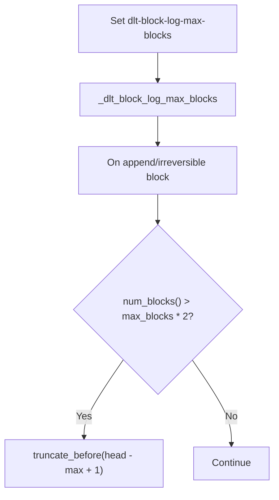
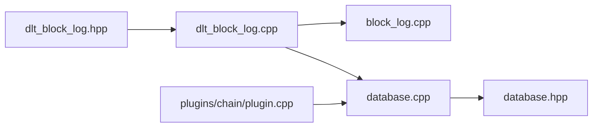

# DLT Rolling Block Log

<cite>
**Referenced Files in This Document**
- [dlt_block_log.hpp](file://libraries/chain/include/graphene/chain/dlt_block_log.hpp)
- [dlt_block_log.cpp](file://libraries/chain/dlt_block_log.cpp)
- [block_log.cpp](file://libraries/chain/block_log.cpp)
- [database.cpp](file://libraries/chain/database.cpp)
- [plugin.cpp](file://plugins/chain/plugin.cpp)
- [database.hpp](file://libraries/chain/include/graphene/chain/database.hpp)
</cite>

## Table of Contents
1. [Introduction](#introduction)
2. [Project Structure](#project-structure)
3. [Core Components](#core-components)
4. [Architecture Overview](#architecture-overview)
5. [Detailed Component Analysis](#detailed-component-analysis)
6. [Dependency Analysis](#dependency-analysis)
7. [Performance Considerations](#performance-considerations)
8. [Troubleshooting Guide](#troubleshooting-guide)
9. [Conclusion](#conclusion)

## Introduction
This document explains the DLT Rolling Block Log implementation used by VIZ blockchain nodes to maintain a sliding window of recent irreversible blocks. Unlike the traditional block log, the DLT rolling block log supports an offset-aware index that can start from an arbitrary block number, enabling efficient serving of recent blocks to P2P peers in snapshot-based ("DLT") nodes.

## Project Structure
The DLT rolling block log is implemented as a standalone component with a thin interface and a robust internal implementation. It integrates with the main database to provide fallback block retrieval when the primary block log is empty (e.g., after snapshot import).

**Diagram sources**
- [dlt_block_log.hpp:1-76](file://libraries/chain/include/graphene/chain/dlt_block_log.hpp#L1-L76)
- [dlt_block_log.cpp:1-414](file://libraries/chain/dlt_block_log.cpp#L1-L414)
- [block_log.cpp:1-302](file://libraries/chain/block_log.cpp#L1-L302)
- [database.cpp:220-271](file://libraries/chain/database.cpp#L220-L271)
- [plugin.cpp:320-330](file://plugins/chain/plugin.cpp#L320-L330)
- [database.hpp:60-70](file://libraries/chain/include/graphene/chain/database.hpp#L60-L70)

**Section sources**
- [dlt_block_log.hpp:1-76](file://libraries/chain/include/graphene/chain/dlt_block_log.hpp#L1-L76)
- [dlt_block_log.cpp:1-414](file://libraries/chain/dlt_block_log.cpp#L1-L414)
- [block_log.cpp:1-302](file://libraries/chain/block_log.cpp#L1-L302)
- [database.cpp:220-271](file://libraries/chain/database.cpp#L220-L271)
- [plugin.cpp:320-330](file://plugins/chain/plugin.cpp#L320-L330)
- [database.hpp:60-70](file://libraries/chain/include/graphene/chain/database.hpp#L60-L70)

## Core Components
- DLT Rolling Block Log API: Provides methods to open/close, append blocks, read by block number, query head/start/end indices, and truncate old blocks.
- Internal Implementation: Manages memory-mapped files for data and index, maintains head state, validates positions, reconstructs index when needed, and performs safe truncation with temporary files.
- Integration with Database: Opens both the DLT rolling block log and the primary block log during normal and snapshot modes, and falls back to DLT when the primary block log is empty.
- Chain Plugin Configuration: Exposes a runtime option to cap the number of blocks maintained by the DLT rolling block log.

Key capabilities:
- Offset-aware index layout supporting arbitrary start block numbers.
- Append-only storage with position checks to ensure sequential integrity.
- Automatic index reconstruction if inconsistencies are detected.
- Safe truncation that preserves only blocks from a specified start number onward.

**Section sources**
- [dlt_block_log.hpp:35-72](file://libraries/chain/include/graphene/chain/dlt_block_log.hpp#L35-L72)
- [dlt_block_log.cpp:18-278](file://libraries/chain/dlt_block_log.cpp#L18-L278)
- [database.cpp:230-231](file://libraries/chain/database.cpp#L230-L231)
- [plugin.cpp:327-329](file://plugins/chain/plugin.cpp#L327-L329)

## Architecture Overview
The DLT rolling block log operates alongside the primary block log. During normal operation, the database opens both logs and validates them. In DLT mode (after snapshot import), the primary block log remains empty while the database holds state; the DLT rolling block log serves as a fallback for block retrieval.

**Diagram sources**
- [database.cpp:230-268](file://libraries/chain/database.cpp#L230-L268)
- [database.cpp:560-627](file://libraries/chain/database.cpp#L560-L627)
- [block_log.cpp:238-241](file://libraries/chain/block_log.cpp#L238-L241)
- [dlt_block_log.cpp:313-328](file://libraries/chain/dlt_block_log.cpp#L313-L328)

## Detailed Component Analysis

### DLT Rolling Block Log API
The public interface defines lifecycle, append, read, and maintenance operations with thread-safe access via read/write locks.

**Diagram sources**
- [dlt_block_log.hpp:35-72](file://libraries/chain/include/graphene/chain/dlt_block_log.hpp#L35-L72)

**Section sources**
- [dlt_block_log.hpp:35-72](file://libraries/chain/include/graphene/chain/dlt_block_log.hpp#L35-L72)

### Internal Implementation Details
The implementation manages two memory-mapped files: one for block data and one for an offset-aware index. It enforces strict position checks to ensure sequential integrity and reconstructs the index if mismatches are detected.

Key behaviors:
- Memory-mapped files for zero-copy reads and efficient random access.
- Index header stores the first block number; entries are 8-byte offsets.
- Position validation during append to prevent gaps.
- Index reconstruction by scanning the data file when inconsistencies are found.
- Safe truncation using temporary files and atomic swap.

**Diagram sources**
- [dlt_block_log.cpp:161-209](file://libraries/chain/dlt_block_log.cpp#L161-L209)
- [dlt_block_log.cpp:125-159](file://libraries/chain/dlt_block_log.cpp#L125-L159)

**Section sources**
- [dlt_block_log.cpp:18-278](file://libraries/chain/dlt_block_log.cpp#L18-L278)

### Append Operation Flow
The append operation validates sequential positioning, writes block data followed by a trailing position marker, updates the index, and maintains head state.

**Diagram sources**
- [dlt_block_log.cpp:211-268](file://libraries/chain/dlt_block_log.cpp#L211-L268)

**Section sources**
- [dlt_block_log.cpp:211-268](file://libraries/chain/dlt_block_log.cpp#L211-L268)

### Truncation Process
Truncation creates temporary files containing only the retained blocks, then atomically replaces the original files. It recalculates the index header and validates the new state.

**Diagram sources**
- [dlt_block_log.cpp:356-411](file://libraries/chain/dlt_block_log.cpp#L356-L411)

**Section sources**
- [dlt_block_log.cpp:356-411](file://libraries/chain/dlt_block_log.cpp#L356-L411)

### Database Integration
The database opens both logs during normal and snapshot modes. In DLT mode, it skips block log validation and relies on the DLT rolling block log for block retrieval.

**Diagram sources**
- [database.cpp:230-268](file://libraries/chain/database.cpp#L230-L268)
- [database.cpp:560-627](file://libraries/chain/database.cpp#L560-L627)

**Section sources**
- [database.cpp:230-268](file://libraries/chain/database.cpp#L230-L268)
- [database.cpp:560-627](file://libraries/chain/database.cpp#L560-L627)

### Configuration and Limits
The chain plugin exposes a runtime option to cap the maximum number of blocks stored by the DLT rolling block log. The database maintains this limit and triggers truncation when the window exceeds twice the configured size.

**Diagram sources**
- [plugin.cpp:327-329](file://plugins/chain/plugin.cpp#L327-L329)
- [database.cpp:4005-4036](file://libraries/chain/database.cpp#L4005-L4036)
- [database.cpp:4170-4172](file://libraries/chain/database.cpp#L4170-L4172)
- [database.cpp:4392-4394](file://libraries/chain/database.cpp#L4392-L4394)

**Section sources**
- [plugin.cpp:327-329](file://plugins/chain/plugin.cpp#L327-L329)
- [database.cpp:4005-4036](file://libraries/chain/database.cpp#L4005-L4036)
- [database.cpp:4170-4172](file://libraries/chain/database.cpp#L4170-L4172)
- [database.cpp:4392-4394](file://libraries/chain/database.cpp#L4392-L4394)

## Dependency Analysis
- dlt_block_log.hpp/cpp depends on:
  - Protocol block definitions for signed blocks.
  - Boost iostreams for memory-mapped file access.
  - Boost filesystem for file operations.
  - FC library for assertions and data streams.
- database.cpp integrates DLT block log alongside block_log.cpp, coordinating fallback retrieval and DLT mode detection.
- plugin.cpp configures the DLT rolling block log limit via runtime options.

**Diagram sources**
- [dlt_block_log.hpp:1-10](file://libraries/chain/include/graphene/chain/dlt_block_log.hpp#L1-L10)
- [dlt_block_log.cpp:1-7](file://libraries/chain/dlt_block_log.cpp#L1-L7)
- [block_log.cpp:1-6](file://libraries/chain/block_log.cpp#L1-L6)
- [database.cpp:1-10](file://libraries/chain/database.cpp#L1-L10)
- [plugin.cpp:1-10](file://plugins/chain/plugin.cpp#L1-L10)
- [database.hpp:60-70](file://libraries/chain/include/graphene/chain/database.hpp#L60-L70)

**Section sources**
- [dlt_block_log.hpp:1-10](file://libraries/chain/include/graphene/chain/dlt_block_log.hpp#L1-L10)
- [dlt_block_log.cpp:1-7](file://libraries/chain/dlt_block_log.cpp#L1-L7)
- [block_log.cpp:1-6](file://libraries/chain/block_log.cpp#L1-L6)
- [database.cpp:1-10](file://libraries/chain/database.cpp#L1-L10)
- [plugin.cpp:1-10](file://plugins/chain/plugin.cpp#L1-L10)
- [database.hpp:60-70](file://libraries/chain/include/graphene/chain/database.hpp#L60-L70)

## Performance Considerations
- Memory-mapped files enable zero-copy reads and efficient random access, minimizing overhead for block retrieval.
- The offset-aware index allows O(1) lookup per block by computing the entry position from the header and block number.
- Append operations are linear-time with respect to the number of appended blocks; ensure batched writes when possible.
- Truncation involves copying retained blocks to temporary files and atomic replacement; schedule during low-traffic periods to avoid latency spikes.
- Keep the DLT rolling block log size within configured limits to prevent excessive disk usage and rebuild overhead.

## Troubleshooting Guide
Common issues and resolutions:
- Index mismatch: If the last positions in the data and index files do not match, the implementation reconstructs the index automatically. Verify disk integrity and ensure no concurrent writers.
- Empty block log in DLT mode: After snapshot import, the primary block log is intentionally empty. Confirm DLT mode is active and that the DLT rolling block log is being populated with irreversible blocks.
- Truncation failures: Ensure sufficient disk space for temporary files during truncation. The process removes old files only after successful completion of the new files.
- Validation errors: If the database detects inconsistencies during open, review logs for reconstruction messages and consider re-indexing if problems persist.

**Section sources**
- [dlt_block_log.cpp:161-209](file://libraries/chain/dlt_block_log.cpp#L161-L209)
- [dlt_block_log.cpp:356-411](file://libraries/chain/dlt_block_log.cpp#L356-L411)
- [database.cpp:259-268](file://libraries/chain/database.cpp#L259-L268)

## Conclusion
The DLT Rolling Block Log provides a robust, offset-aware append-only storage mechanism tailored for snapshot-based nodes. Its integration with the database ensures seamless fallback when the primary block log is empty, while configurable limits and safe truncation help manage disk usage efficiently. The design leverages memory-mapped files and strict position validation to deliver reliable performance and data integrity.