# Database Management

<cite>
**Referenced Files in This Document**
- [database.hpp](file://libraries/chain/include/graphene/chain/database.hpp)
- [database.cpp](file://libraries/chain/database.cpp)
- [chainbase.hpp](file://thirdparty/chainbase/include/chainbase/chainbase.hpp)
- [chainbase.cpp](file://thirdparty/chainbase/src/chainbase.cpp)
- [block_log.hpp](file://libraries/chain/include/graphene/chain/block_log.hpp)
- [block_log.cpp](file://libraries/chain/block_log.cpp)
- [dlt_block_log.hpp](file://libraries/chain/include/graphene/chain/dlt_block_log.hpp)
- [dlt_block_log.cpp](file://libraries/chain/dlt_block_log.cpp)
- [fork_database.hpp](file://libraries/chain/include/graphene/chain/fork_database.hpp)
- [fork_database.cpp](file://libraries/chain/fork_database.cpp)
- [database_exceptions.hpp](file://libraries/chain/include/graphene/chain/database_exceptions.hpp)
- [plugin.cpp](file://plugins/snapshot/plugin.cpp)
- [db_with.hpp](file://libraries/chain/include/graphene/chain/db_with.hpp)
- [witness.cpp](file://plugins/witness/witness.cpp)
- [witness.hpp](file://plugins/witness/include/graphene/plugins/witness/witness.hpp)
- [config.hpp](file://libraries/protocol/include/graphene/protocol/config.hpp)
- [node.cpp](file://libraries/network/node.cpp)
- [exceptions.hpp](file://libraries/network/include/graphene/network/exceptions.hpp)
- [p2p_plugin.cpp](file://plugins/p2p/p2p_plugin.cpp)
</cite>

## Update Summary
**Changes Made**
- Refined database handling for unlinkable blocks with gap-based decision system (≤100 gap deferred to fork_db, >100 gap rejected)
- Improved fork management logic with enhanced early rejection mechanisms
- Enhanced early rejection logic for blocks far ahead with unknown parents
- Updated fork database exception prevention with comprehensive gap-based handling
- Strengthened P2P synchronization with improved unlinkable block classification

## Table of Contents
1. [Introduction](#introduction)
2. [Project Structure](#project-structure)
3. [Core Components](#core-components)
4. [Architecture Overview](#architecture-overview)
5. [Detailed Component Analysis](#detailed-component-analysis)
6. [Emergency Consensus Implementation](#emergency-consensus-implementation)
7. [Dependency Analysis](#dependency-analysis)
8. [Performance Considerations](#performance-considerations)
9. [Troubleshooting Guide](#troubleshooting-guide)
10. [Conclusion](#conclusion)

## Introduction
This document describes the Database Management system that serves as the core state persistence layer for the VIZ blockchain. It covers the database class lifecycle, initialization and cleanup, validation steps, session management, memory allocation strategies, shared memory configuration, checkpoints for fast synchronization, block log integration, observer pattern usage, DLT mode detection and conditional operations, enhanced block fetching logic with DLT mode awareness, the new `_dlt_gap_logged` flag mechanism for intelligent warning suppression, comprehensive operation guard implementation for concurrent access protection, dual operation guard patterns for witness scheduling safety, enhanced P2P plugin block validation with operation guard protection, and practical examples of database operations and performance optimization.

**Updated** - Enhanced with refined database handling for unlinkable blocks featuring a sophisticated gap-based decision system. The system now implements intelligent early rejection logic that rejects blocks with gaps > 100 immediately while deferring blocks with gaps ≤ 100 to the fork database for automatic chain linking when parent blocks arrive. This improvement prevents memory bloat from dead-fork blocks and eliminates sync restart loops during snapshot imports and normal operation.

## Project Structure
The database subsystem is implemented primarily in the chain library with enhanced support for operation guards and concurrent access protection:
- Core database interface and declarations: libraries/chain/include/graphene/chain/database.hpp
- Implementation of database operations with enhanced DLT mode support, emergency consensus, operation guards, and concurrent access protection: libraries/chain/database.cpp
- Chainbase integration with operation_guard RAII pattern and resize barrier mechanisms: thirdparty/chainbase/include/chainbase/chainbase.hpp and thirdparty/chainbase/src/chainbase.cpp
- Block log abstraction: libraries/chain/include/graphene/chain/block_log.hpp and libraries/chain/block_log.cpp
- DLT block log for rolling window storage: libraries/chain/include/graphene/chain/dlt_block_log.hpp and libraries/chain/dlt_block_log.cpp
- Fork database for reversible blocks: libraries/chain/include/graphene/chain/fork_database.hpp and libraries/chain/fork_database.cpp
- Database exceptions including unlinkable_block_exception: libraries/chain/include/graphene/chain/database_exceptions.hpp
- Snapshot plugin integration: plugins/snapshot/plugin.cpp for DLT mode initialization
- Postponed transaction processing: libraries/chain/include/graphene/chain/db_with.hpp for transaction queue management
- Witness plugin integration with dual operation guard patterns: plugins/witness/witness.cpp and plugins/witness/include/graphene/plugins/witness/witness.hpp
- Protocol configuration: libraries/protocol/include/graphene/protocol/config.hpp for emergency consensus constants
- Network layer integration: libraries/network/node.cpp for peer connectivity management
- P2P plugin integration with operation guard protection: plugins/p2p/p2p_plugin.cpp for enhanced exception handling and concurrent access safety

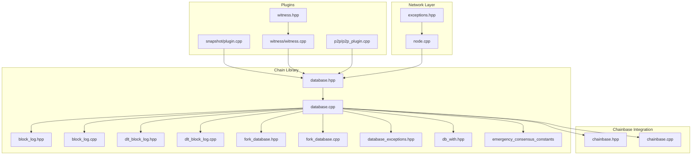

**Diagram sources**
- [database.hpp:1-670](file://libraries/chain/include/graphene/chain/database.hpp#L1-L670)
- [database.cpp:1-6623](file://libraries/chain/database.cpp#L1-L6623)
- [chainbase.hpp:1078-1120](file://thirdparty/chainbase/include/chainbase/chainbase.hpp#L1078-L1120)
- [chainbase.cpp:1-200](file://thirdparty/chainbase/src/chainbase.cpp#L1-L200)
- [block_log.hpp:1-75](file://libraries/chain/include/graphene/chain/block_log.hpp#L1-L75)
- [block_log.cpp:1-302](file://libraries/chain/block_log.cpp#L1-L302)
- [dlt_block_log.hpp:1-80](file://libraries/chain/include/graphene/chain/dlt_block_log.hpp#L1-L80)
- [dlt_block_log.cpp:1-476](file://libraries/chain/dlt_block_log.cpp#L1-L476)
- [fork_database.hpp:1-144](file://libraries/chain/include/graphene/chain/fork_database.hpp#L1-L144)
- [fork_database.cpp:1-278](file://libraries/chain/fork_database.cpp#L1-L278)
- [database_exceptions.hpp:1-136](file://libraries/chain/include/graphene/chain/database_exceptions.hpp#L1-L136)
- [db_with.hpp:1-154](file://libraries/chain/include/graphene/chain/db_with.hpp#L1-L154)
- [plugin.cpp:1180-1379](file://plugins/snapshot/plugin.cpp#L1180-L1379)
- [witness.cpp:270-469](file://plugins/witness/witness.cpp#L270-L469)
- [witness.hpp:38-73](file://plugins/witness/include/graphene/plugins/witness/witness.hpp#L38-L73)
- [config.hpp:111-118](file://libraries/protocol/include/graphene/protocol/config.hpp#L111-L118)
- [node.cpp:3185-3384](file://libraries/network/node.cpp#L3185-L3384)
- [exceptions.hpp:27-48](file://libraries/network/include/graphene/network/exceptions.hpp#L27-L48)
- [p2p_plugin.cpp:225-424](file://plugins/p2p/p2p_plugin.cpp#L225-L424)

**Section sources**
- [database.hpp:1-670](file://libraries/chain/include/graphene/chain/database.hpp#L1-L670)
- [database.cpp:1-6623](file://libraries/chain/database.cpp#L1-L6623)
- [chainbase.hpp:1078-1120](file://thirdparty/chainbase/include/chainbase/chainbase.hpp#L1078-L1120)
- [chainbase.cpp:1-200](file://thirdparty/chainbase/src/chainbase.cpp#L1-L200)
- [block_log.hpp:1-75](file://libraries/chain/include/graphene/chain/block_log.hpp#L1-L75)
- [block_log.cpp:1-302](file://libraries/chain/block_log.cpp#L1-L302)
- [dlt_block_log.hpp:1-80](file://libraries/chain/include/graphene/chain/dlt_block_log.hpp#L1-L80)
- [dlt_block_log.cpp:1-476](file://libraries/chain/dlt_block_log.cpp#L1-L476)
- [fork_database.hpp:1-144](file://libraries/chain/include/graphene/chain/fork_database.hpp#L1-L144)
- [fork_database.cpp:1-278](file://libraries/chain/fork_database.cpp#L1-L278)
- [database_exceptions.hpp:1-136](file://libraries/chain/include/graphene/chain/database_exceptions.hpp#L1-L136)
- [db_with.hpp:1-154](file://libraries/chain/include/graphene/chain/db_with.hpp#L1-L154)
- [plugin.cpp:1180-1379](file://plugins/snapshot/plugin.cpp#L1180-L1379)
- [witness.cpp:270-469](file://plugins/witness/witness.cpp#L270-L469)
- [witness.hpp:38-73](file://plugins/witness/include/graphene/plugins/witness/witness.hpp#L38-L73)
- [config.hpp:111-118](file://libraries/protocol/include/graphene/protocol/config.hpp#L111-L118)
- [node.cpp:3185-3384](file://libraries/network/node.cpp#L3185-L3384)
- [exceptions.hpp:27-48](file://libraries/network/include/graphene/network/exceptions.hpp#L27-L48)
- [p2p_plugin.cpp:225-424](file://plugins/p2p/p2p_plugin.cpp#L225-L424)

## Core Components
- database class: Public interface for blockchain state management, block and transaction processing, checkpoints, and event notifications with enhanced DLT mode support, emergency consensus implementation, operation guard integration, and improved error handling.
- chainbase integration: Provides persistent object storage and undo sessions with enhanced memory management, operation_guard RAII pattern, and resize barrier mechanisms for concurrent access protection.
- block_log: Append-only block storage with random-access indexing.
- dlt_block_log: Rolling window block storage specifically designed for DLT (snapshot-based) nodes.
- fork_database: Maintains reversible blocks and supports fork selection and switching with emergency mode support and enhanced unlinkable block detection.
- signal_guard: Enhanced signal handling for graceful restart sequence management.
- **_dlt_gap_logged flag**: New mechanism to suppress repeated warnings about missing blocks in fork database after snapshot import, with automatic reset upon successful DLT block writes.
- **Enhanced block collision detection**: Sophisticated logging system that differentiates between same-parent double production and different-parent fork scenarios with rate-limiting.
- **Postponed transaction processing**: Time-based transaction execution with automatic queuing when processing limits are reached.
- **Emergency consensus mode**: Automatic recovery system that activates when LIB timestamp exceeds timeout threshold, replacing unavailable witnesses with committee members.
- **Hybrid witness scheduling**: Dynamic witness schedule that combines real witnesses with committee members during emergency periods.
- **LIB monitoring system**: Continuous monitoring of last irreversible block timestamp to detect network stalls and trigger emergency procedures.
- **Enhanced Memory Management**: Comprehensive logging system for shared memory allocation with detailed free memory and maximum memory state reporting.
- **Deferred Shared Memory Resize**: New mechanism that defers memory resize operations until a safe point when no read locks are held, preventing race conditions and stale pointer issues.
- **Enhanced Error Handling**: Graceful handling of boost::interprocess::bad_alloc exceptions with deferred resize scheduling and peer connectivity preservation.
- **Enhanced Fork Database Handling**: Proper unlinkable_block_exception throwing for dead fork detection and improved fork switching logic with deterministic tie-breaking.
- **Enhanced Early Rejection Logic**: Sophisticated block validation with intelligent rejection strategies for blocks far ahead with unknown parents, implementing gap-based decision system (≤100 gap deferred to fork_db, >100 gap rejected).
- **Enhanced Fork Database Exception Prevention**: Comprehensive mechanisms to prevent fork database exceptions through early rejection and proper dead fork detection.
- **Operation Guard System**: Comprehensive concurrent access protection using operation_guard RAII pattern, dual operation guard patterns for witness scheduling safety, and resize barrier mechanisms.
- **Dual Operation Guard Patterns**: Systematic implementation of operation_guard for both lockless reads and write operations to prevent race conditions during shared memory operations.
- **Concurrent Resize Safety**: Enhanced resize barrier mechanisms that pause all database operations during memory resizing to prevent stale pointer issues.
- **P2P Plugin Protection**: Operation guard integration in P2P plugin for safe concurrent access during block validation and witness key retrieval.
- **Witness Scheduling Safety**: Dual operation guard patterns in witness scheduling calculations to ensure thread safety during slot determination and witness validation.
- **Enhanced Multi-Layered Block Retrieval**: Systematic fallback mechanisms that check fork database when primary block log fails to locate required data, ensuring consistent behavior across different block logging configurations.
- **Improved Last Irreversible Block Advancement**: Enhanced logic that falls back to fork database when block log lacks required data, maintaining data consistency and availability.
- **Comprehensive DLT Gap Management**: Intelligent warning suppression and automatic state management for DLT block gaps during normal operations.

Key responsibilities:
- Lifecycle: open(), open_from_snapshot(), reindex(), close(), wipe() with improved error handling
- Validation: validate_block(), validate_transaction(), with configurable skip flags
- Operations: push_block(), push_transaction(), generate_block() with enhanced memory pressure handling and concurrent access protection
- DLT Mode: Conditional block log operations, rolling window management, snapshot-aware initialization
- Observers: signals for pre/post operation, applied block, pending/applied transactions
- Persistence: integrates with block_log and dlt_block_log for different operational modes
- Enhanced Block Fetching: DLT mode-aware block retrieval with proper validation logic and fallback mechanisms
- **Gap Suppression**: Intelligent warning suppression mechanism that prevents log spam during normal DLT operations while maintaining diagnostic capability
- **Rate-limited Logging**: Sophisticated collision detection with time-based suppression to prevent log flooding
- **Smart Transaction Processing**: Automatic transaction queuing and delayed execution based on processing time limits
- **Emergency Mode Detection**: Automatic activation when LIB timestamp exceeds CHAIN_EMERGENCY_CONSENSUS_TIMEOUT_SEC threshold
- **Hybrid Witness Scheduling**: Dynamic replacement of unavailable witnesses with committee members during emergencies
- **LIB Monitoring**: Continuous timestamp analysis to detect network stalls and prevent false emergency activations
- **Enhanced Memory Management**: Detailed logging of memory states before and after resizing operations for administrator visibility
- **Thread-Safe Memory Resizing**: Deferred resize mechanism that acquires exclusive write locks to prevent race conditions and stale pointer issues
- **Memory Pressure Handling**: Graceful degradation of shared memory exhaustion with peer connectivity preservation
- **Enhanced Fork Database Handling**: Proper unlinkable_block_exception throwing for dead fork detection and improved fork switching logic with deterministic tie-breaking
- **Enhanced Early Rejection Strategy**: Intelligent block rejection for far-ahead blocks with unknown parents using gap-based decision system (≤100 gap deferred to fork_db, >100 gap rejected) to prevent unnecessary fork database operations and sync restart loops
- **Enhanced Fork Database Exception Prevention**: Comprehensive mechanisms to prevent fork database exceptions through early rejection and proper dead fork detection
- **Operation Guard Integration**: Systematic implementation of operation_guard RAII pattern for automatic concurrent access protection across all critical sections
- **Dual Guard Patterns**: Implementation of dual operation guards for witness scheduling to ensure thread safety during complex calculations
- **P2P Concurrent Safety**: Operation guard protection in P2P plugin for safe concurrent access during block validation and witness key operations
- **Resize Barrier Safety**: Comprehensive resize barrier mechanisms that pause all operations during memory resizing to prevent data corruption
- **Enhanced Multi-Layered Block Retrieval**: Systematic fallback mechanisms that check fork database when primary block log fails to locate required data, ensuring consistent behavior across different block logging configurations
- **Improved Last Irreversible Block Advancement**: Enhanced logic that falls back to fork database when block log lacks required data, maintaining data consistency and availability
- **Comprehensive DLT Gap Management**: Intelligent warning suppression and automatic state management for DLT block gaps during normal operations

**Section sources**
- [database.hpp:61-115](file://libraries/chain/include/graphene/chain/database.hpp#L61-L115)
- [database.cpp:281-324](file://libraries/chain/database.cpp#L281-L324)
- [chainbase.hpp:1078-1120](file://thirdparty/chainbase/include/chainbase/chainbase.hpp#L1078-L1120)
- [block_log.hpp:38-75](file://libraries/chain/include/graphene/chain/block_log.hpp#L38-L75)
- [dlt_block_log.hpp:35-72](file://libraries/chain/include/graphene/chain/dlt_block_log.hpp#L35-L72)
- [fork_database.hpp:53-144](file://libraries/chain/include/graphene/chain/fork_database.hpp#L53-L144)
- [database.cpp:929-984](file://libraries/chain/database.cpp#L929-L984)
- [db_with.hpp:33-100](file://libraries/chain/include/graphene/chain/db_with.hpp#L33-L100)
- [config.hpp:111-118](file://libraries/protocol/include/graphene/protocol/config.hpp#L111-L118)
- [chainbase.cpp:225-279](file://thirdparty/chainbase/src/chainbase.cpp#L225-L279)

## Architecture Overview
The database composes four primary subsystems with enhanced DLT mode support, emergency consensus implementation, operation guard integration, and improved error handling:
- Chainbase: Persistent object database with undo/redo capabilities, operation_guard RAII pattern, and resize barrier mechanisms for concurrent access protection
- Fork database: Holds recent blocks for fork resolution with emergency mode support and enhanced unlinkable block detection
- Block log: Immutable, append-only block storage with index
- DLT block log: Rolling window block storage for DLT (snapshot-based) nodes
- Signal guard: Enhanced signal handling for graceful restart sequences
- **DLT Gap Logger**: New component that manages warning suppression for missing blocks with automatic state management
- **Enhanced Collision Detection**: Sophisticated logging system for block number collisions with scenario differentiation
- **Postponed Transaction Manager**: Smart transaction queue management with time-based execution limits
- **Emergency Consensus Engine**: Automatic recovery system that monitors LIB timestamps and activates emergency procedures
- **Hybrid Witness Scheduler**: Dynamic witness schedule that combines real witnesses with committee members during emergencies
- **LIB Monitoring System**: Continuous timestamp analysis to detect network stalls and prevent false emergency activations
- **Enhanced Memory Management**: Comprehensive logging system for shared memory allocation with detailed state reporting
- **Deferred Memory Resize**: Thread-safe memory resize mechanism that defers operations until safe points to prevent race conditions
- **Enhanced Error Handling**: Graceful exception handling for shared memory exhaustion with peer connectivity preservation
- **Enhanced Fork Database**: Proper unlinkable_block_exception throwing for dead fork detection and improved fork switching
- **Enhanced Early Rejection Logic**: Sophisticated block validation with intelligent rejection strategies for blocks far ahead with unknown parents using gap-based decision system (≤100 gap deferred to fork_db, >100 gap rejected)
- **Enhanced Fork Database Exception Prevention**: Comprehensive mechanisms to prevent fork database exceptions through early rejection and proper dead fork detection
- **Operation Guard System**: Comprehensive concurrent access protection using operation_guard RAII pattern, dual operation guard patterns for witness scheduling safety, and resize barrier mechanisms
- **Dual Operation Guard Patterns**: Systematic implementation of operation_guard for both lockless reads and write operations to prevent race conditions during shared memory operations
- **Concurrent Resize Safety**: Enhanced resize barrier mechanisms that pause all database operations during memory resizing to prevent stale pointer issues
- **P2P Plugin Protection**: Operation guard integration in P2P plugin for safe concurrent access during block validation and witness key retrieval
- **Witness Scheduling Safety**: Dual operation guard patterns in witness scheduling calculations to ensure thread safety during slot determination and witness validation
- **Enhanced Multi-Layered Block Retrieval**: Systematic fallback mechanisms that check fork database when primary block log fails to locate required data, ensuring consistent behavior across different block logging configurations
- **Improved Last Irreversible Block Advancement**: Enhanced logic that falls back to fork database when block log lacks required data, maintaining data consistency and availability
- **Comprehensive DLT Gap Management**: Intelligent warning suppression and automatic state management for DLT block gaps during normal operations

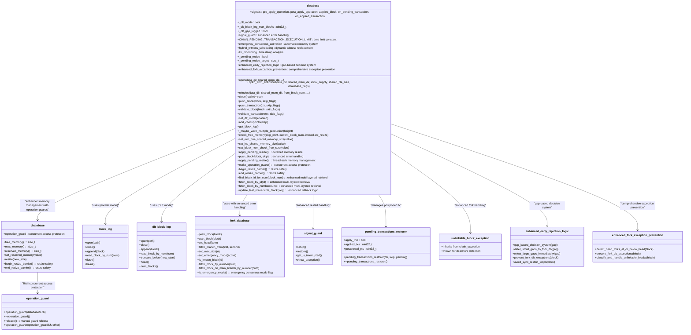

**Diagram sources**
- [database.hpp:61-115](file://libraries/chain/include/graphene/chain/database.hpp#L61-L115)
- [database.cpp:281-324](file://libraries/chain/database.cpp#L281-L324)
- [chainbase.hpp:1078-1120](file://thirdparty/chainbase/include/chainbase/chainbase.hpp#L1078-L1120)
- [block_log.hpp:38-75](file://libraries/chain/include/graphene/chain/block_log.hpp#L38-L75)
- [dlt_block_log.hpp:35-72](file://libraries/chain/include/graphene/chain/dlt_block_log.hpp#L35-L72)
- [fork_database.hpp:53-144](file://libraries/chain/include/graphene/chain/fork_database.hpp#L53-L144)
- [database.cpp:94-184](file://libraries/chain/database.cpp#L94-L184)
- [db_with.hpp:33-100](file://libraries/chain/include/graphene/chain/db_with.hpp#L33-L100)
- [chainbase.cpp:225-279](file://thirdparty/chainbase/src/chainbase.cpp#L225-L279)
- [database_exceptions.hpp:83](file://libraries/chain/include/graphene/chain/database_exceptions.hpp#L83)

## Detailed Component Analysis

### Database Lifecycle: Constructor, Destructor, and Methods
- Constructor and destructor: Initialize internal implementation and ensure pending transactions are cleared on destruction.
- open(): Initializes schema, opens shared memory, initializes indexes and evaluators, loads genesis if needed, opens both block_log and dlt_block_log, rewinds undo state, verifies chain consistency, and initializes hardfork state. **Enhanced** with DLT mode detection and graceful error handling.
- open_from_snapshot(): **Enhanced** - Sets DLT mode flag to true, wipes shared memory for clean state, initializes schema and chainbase, opens both block_log and dlt_block_log, and logs snapshot import progress.
- reindex(): **Enhanced** - Uses signal_guard for graceful restart handling, reads blocks sequentially from the block log with improved error propagation, applies them with aggressive skip flags to accelerate replay, periodically sets revision, checks free memory, and updates fork database head.
- close(): Clears pending transactions, flushes and closes chainbase, closes both block_log and dlt_block_log, resets fork database.
- wipe(): Closes database, wipes shared memory file, optionally removes both block_log and dlt_block_log.


**Diagram sources**
- [database.cpp:281-324](file://libraries/chain/database.cpp#L281-L324)
- [database.cpp:330-410](file://libraries/chain/database.cpp#L330-L410)
- [database.cpp:134-184](file://libraries/chain/database.cpp#L134-L184)

**Section sources**
- [database.hpp:61-115](file://libraries/chain/include/graphene/chain/database.hpp#L61-L115)
- [database.cpp:281-324](file://libraries/chain/database.cpp#L281-L324)
- [database.cpp:503-519](file://libraries/chain/database.cpp#L503-L519)
- [database.cpp:330-410](file://libraries/chain/database.cpp#L330-L410)
- [database.cpp:134-184](file://libraries/chain/database.cpp#L134-L184)

### Enhanced DLT Mode Detection and Setter Implementation
**Updated** - The database now features improved DLT mode detection with proper setter implementation:

- **Proper Setter Implementation**: The `set_dlt_mode()` method now properly sets the `_dlt_mode` flag and provides informative logging when DLT mode is enabled.
- **Consistent State Management**: DLT mode flag is set before loading snapshot data to ensure all subsequent code sees a consistent state.
- **Snapshot Plugin Integration**: The snapshot plugin calls `set_dlt_mode(true)` during P2P snapshot synchronization to mark the node as operating in DLT mode.
- **Conditional Block Log Operations**: When `_dlt_mode` is true, normal block_log operations are skipped while dlt_block_log continues to operate.

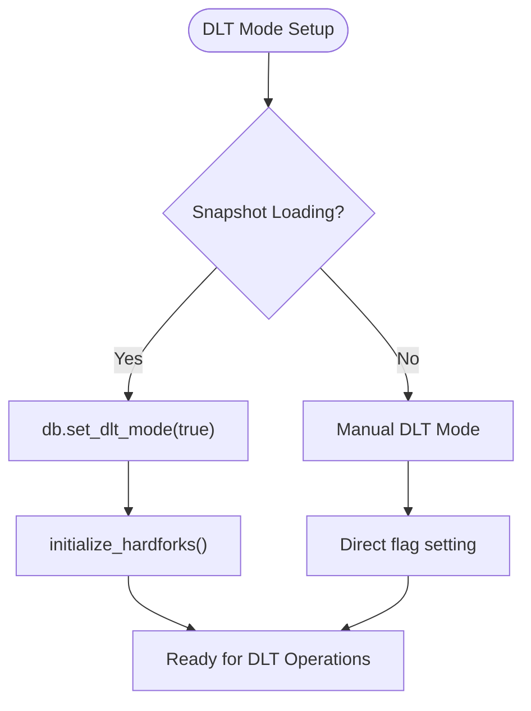

**Diagram sources**
- [database.hpp:61-68](file://libraries/chain/include/graphene/chain/database.hpp#L61-L68)
- [plugin.cpp:1424-1426](file://plugins/snapshot/plugin.cpp#L1424-L1426)

**Section sources**
- [database.hpp:61-68](file://libraries/chain/include/graphene/chain/database.hpp#L61-L68)
- [plugin.cpp:1424-1426](file://plugins/snapshot/plugin.cpp#L1424-L1426)

### Enhanced Block Known Check Logic with DLT Mode Awareness
**Updated** - The `is_known_block()` method now includes enhanced logic to prevent false positives in DLT mode:

- **Skip Block Summary Shortcuts**: In DLT mode, the method skips the block_summary shortcut that would otherwise return true for blocks whose IDs match the block_summary table.
- **Prevent False Positives**: This prevents P2P peers from being lied to about block availability, as block data may not be available in block_log (empty) or dlt_block_log (may not cover the range).
- **Fallback to Actual Data Availability**: The method falls through to `fetch_block_by_id()` which checks actual data availability across all storage layers.
- **Non-DLT Mode Compatibility**: In normal mode, the block_summary shortcut remains functional for performance optimization.

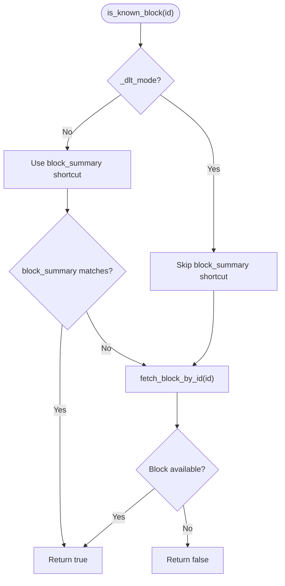

**Diagram sources**
- [database.cpp:704-752](file://libraries/chain/database.cpp#L704-L752)

**Section sources**
- [database.cpp:704-752](file://libraries/chain/database.cpp#L704-L752)

### Enhanced Error Handling During Restart Sequences
**Updated** - The database implements improved error handling for restart sequences:

- Signal guard integration: The reindex process now uses signal_guard to handle interruption signals gracefully
- Graceful restart: When interrupted, the system restores signal handlers and exits cleanly via appbase::app().quit()
- Conditional assertions: In DLT mode, the system uses conditional block fetching with graceful fallback instead of assertions
- Enhanced logging: Clear diagnostic messages explain why certain operations are skipped during restart sequences


**Diagram sources**
- [database.cpp:330-410](file://libraries/chain/database.cpp#L330-L410)
- [database.cpp:134-184](file://libraries/chain/database.cpp#L134-L184)

**Section sources**
- [database.cpp:330-410](file://libraries/chain/database.cpp#L330-L410)
- [database.cpp:134-184](file://libraries/chain/database.cpp#L134-L184)

### DLT Mode Detection and Conditional Operations
**Enhanced** - The database now supports DLT (Data Ledger Technology) mode for snapshot-based nodes with improved error handling:

- DLT Mode Flag: `_dlt_mode = true` indicates the node is running in snapshot mode
- Conditional Block Log Operations: When `_dlt_mode` is true, normal block_log operations are skipped while dlt_block_log continues to operate
- Rolling Window Management: `_dlt_block_log_max_blocks` controls the size of the rolling window for DLT mode
- Snapshot-Aware Initialization: Automatic wipe and clean state preparation for snapshot imports
- Graceful fallback: Enhanced error handling ensures smooth operation even when blocks are temporarily unavailable


**Diagram sources**
- [database.cpp:3986-4039](file://libraries/chain/database.cpp#L3986-L4039)
- [database.cpp:4144-4175](file://libraries/chain/database.cpp#L4144-L4175)
- [database.cpp:4384-4424](file://libraries/chain/database.cpp#L4384-L4424)

**Section sources**
- [database.hpp:70-73](file://libraries/chain/include/graphene/chain/database.hpp#L70-L73)
- [database.cpp:292-292](file://libraries/chain/database.cpp#L292-L292)
- [database.cpp:3986-4039](file://libraries/chain/database.cpp#L3986-L4039)
- [database.cpp:4144-4175](file://libraries/chain/database.cpp#L4144-L4175)
- [database.cpp:4384-4424](file://libraries/chain/database.cpp#L4384-L4424)

### Enhanced Gap Suppression Mechanism for DLT Mode
**New** - The database now includes a sophisticated gap suppression mechanism to prevent log spam during normal DLT operations:

- **_dlt_gap_logged Flag**: A boolean flag that tracks whether a gap warning has already been logged for the current DLT operation cycle.
- **Warning Suppression**: When a block is not found in the fork database during DLT mode processing, the system checks `_dlt_gap_logged` to determine if it should log the warning.
- **Temporary Suppression**: The flag is set to `true` when the first gap warning is logged, preventing repeated warnings for the same gap condition.
- **Automatic Reset**: The flag is reset to `false` when blocks are successfully written to the DLT block log, allowing warnings to be logged again if the gap reappears.
- **Contextual Logging**: The mechanism provides informative log messages that include current DLT head, LIB, and target block numbers to help diagnose synchronization issues.
- **Intelligent State Management**: The system automatically manages the gap logging state based on DLT block operations, ensuring optimal diagnostic information without excessive logging.

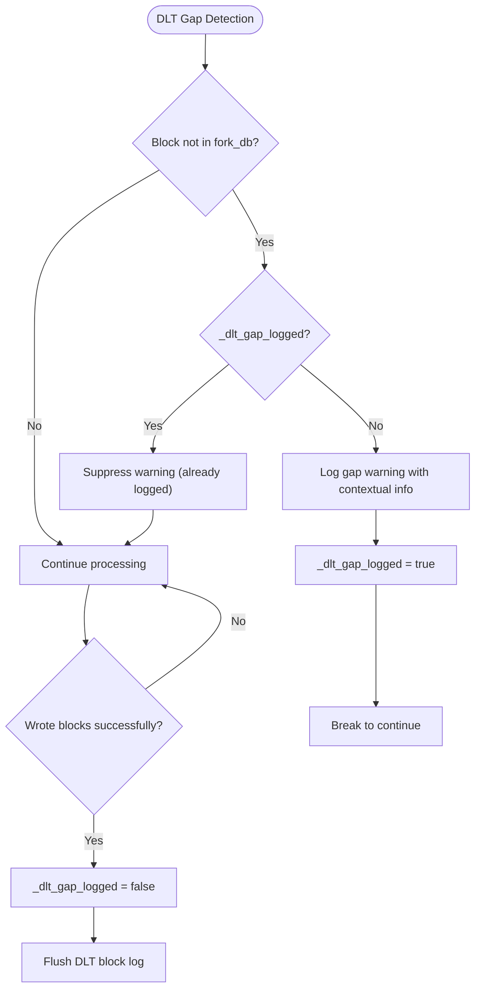

**Diagram sources**
- [database.cpp:5420-5444](file://libraries/chain/database.cpp#L5420-L5444)

**Section sources**
- [database.hpp:75-77](file://libraries/chain/include/graphene/chain/database.hpp#L75-L77)
- [database.cpp:5420-5444](file://libraries/chain/database.cpp#L5420-L5444)

### Enhanced Multi-Layered Block Retrieval System
**New** - The database now implements comprehensive multi-layered block retrieval with systematic fallback mechanisms:

- **Hierarchical Retrieval Strategy**: The `find_block_id_for_num()`, `fetch_block_by_id()`, and `fetch_block_by_number()` methods implement a three-tiered retrieval system:
  1. Primary: Check fork database for current/main branch blocks
  2. Secondary: Check block log for irreversible blocks
  3. Tertiary: Check DLT block log as fallback in DLT mode
  4. Final: Query fork database for any available blocks

- **DLT Mode Awareness**: In DLT mode, the system prioritizes DLT block log as secondary storage while maintaining fallback to block log and fork database.
- **Consistent Behavior**: This ensures that block retrieval works consistently regardless of which storage layer contains the requested data.
- **Enhanced Fault Tolerance**: Multiple fallback points prevent single points of failure and improve system reliability.

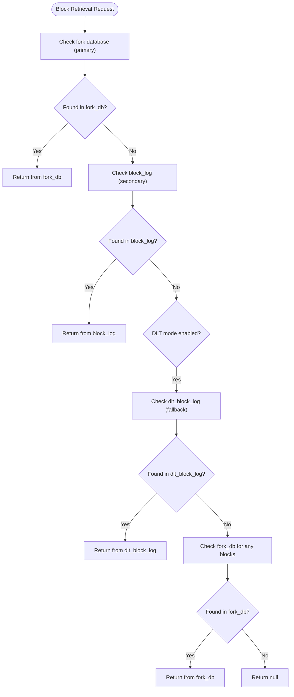

**Diagram sources**
- [database.cpp:789-827](file://libraries/chain/database.cpp#L789-L827)
- [database.cpp:860-882](file://libraries/chain/database.cpp#L860-L882)
- [database.cpp:884-901](file://libraries/chain/database.cpp#L884-L901)

**Section sources**
- [database.cpp:789-827](file://libraries/chain/database.cpp#L789-L827)
- [database.cpp:860-882](file://libraries/chain/database.cpp#L860-L882)
- [database.cpp:884-901](file://libraries/chain/database.cpp#L884-L901)

### Enhanced Last Irreversible Block Advancement Logic
**New** - The `update_last_irreversible_block()` method now includes comprehensive fallback mechanisms:

- **Primary Block Log Check**: First attempts to retrieve the irreversible block from the primary block log
- **Fork Database Fallback**: If block log retrieval fails, checks the fork database for the same block number
- **Consistent ID Assignment**: Uses the fork database block data when available to maintain consistency
- **Enhanced Error Handling**: Prevents crashes when blocks are missing from block log while ensuring proper LIB advancement

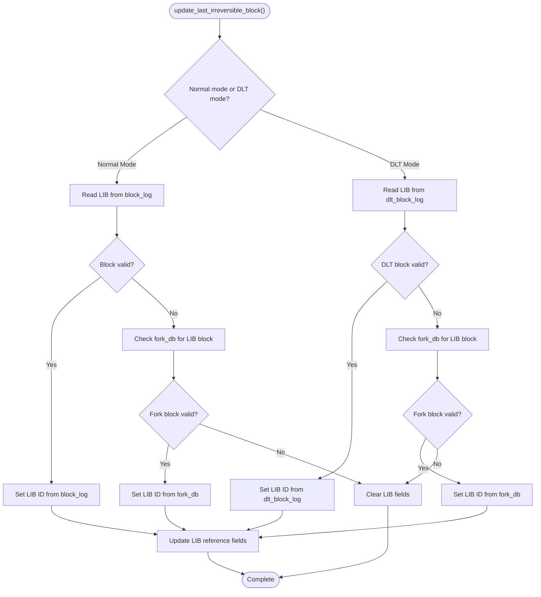

**Diagram sources**
- [database.cpp:5452-5482](file://libraries/chain/database.cpp#L5452-L5482)
- [database.cpp:5467-5480](file://libraries/chain/database.cpp#L5467-L5480)

**Section sources**
- [database.cpp:5452-5482](file://libraries/chain/database.cpp#L5452-L5482)
- [database.cpp:5467-5480](file://libraries/chain/database.cpp#L5467-L5480)

### Enhanced Block Number Collision Detection and Logging
**New** - The database now features sophisticated collision detection with rate-limiting and scenario differentiation:

- **Same-Parent vs Different-Parent Detection**: The system differentiates between same-parent double production (colliding blocks from the same parent) and different-parent fork scenarios (divergent chain tips).
- **Rate-Limited Warnings**: Uses a static counter and timestamp to suppress repeated warnings at the same block height within a 5-second window.
- **Timestamp Delta Analysis**: Calculates time differences between colliding blocks to help diagnose timing issues.
- **Witness Information Logging**: Logs witness names and timestamps for all colliding blocks to aid in forensic analysis.
- **Parent Block ID Tracking**: Records previous block IDs to help analyze fork topology and collision origins.

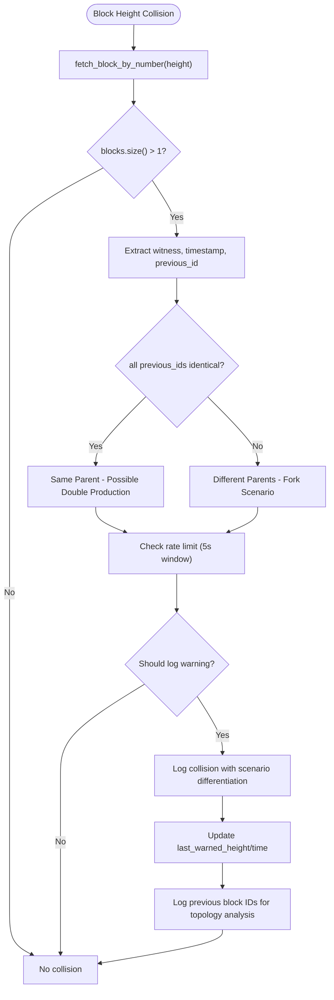

**Diagram sources**
- [database.cpp:1147-1202](file://libraries/chain/database.cpp#L1147-L1202)

**Section sources**
- [database.cpp:1147-1202](file://libraries/chain/database.cpp#L1147-L1202)

### Enhanced Postponed Transaction Processing
**New** - The database now implements intelligent transaction queuing with time-based execution limits:

- **Time-Based Execution Limits**: Uses `CHAIN_PENDING_TRANSACTION_EXECUTION_LIMIT` constant to control processing time per batch.
- **Automatic Queue Management**: When execution time exceeds the limit, transactions are automatically postponed to the next processing cycle.
- **Smart Recovery**: The `pending_transactions_restorer` class handles recovery after fork switches, attempting to reapply transactions within time limits.
- **Progressive Application**: Processes transactions in batches, applying as many as possible within the time limit, with postponed transactions moved to the pending queue.
- **Diagnostic Logging**: Logs the number of applied and postponed transactions to monitor system performance.

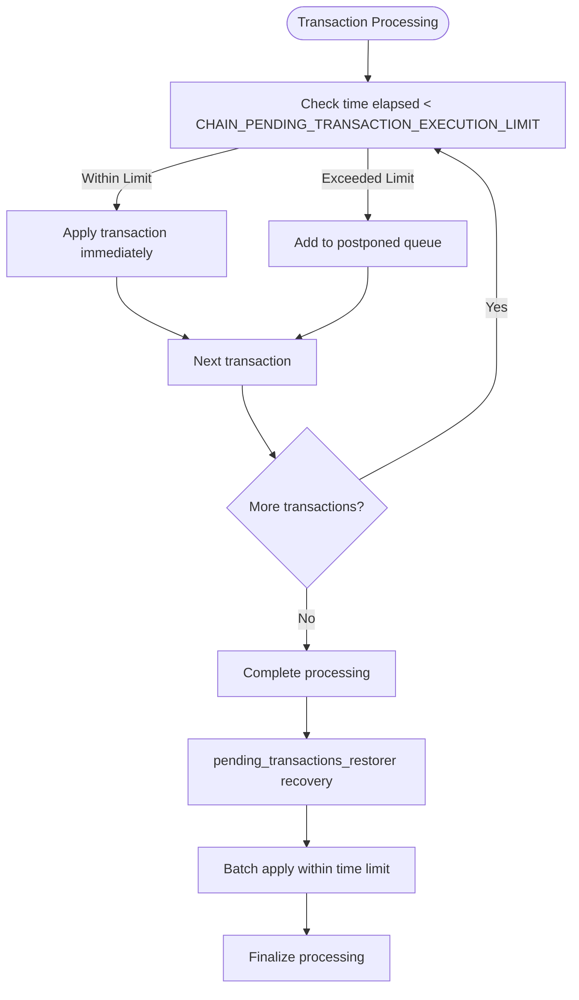

**Diagram sources**
- [db_with.hpp:33-100](file://libraries/chain/include/graphene/chain/db_with.hpp#L33-L100)

**Section sources**
- [db_with.hpp:33-100](file://libraries/chain/include/graphene/chain/db_with.hpp#L33-L100)

### Validation Steps Enumeration and Use Cases
Validation flags control which checks are performed during block and transaction validation:
- skip_nothing: Perform all validations
- skip_witness_signature: Skip witness signature verification (used during reindex)
- skip_transaction_signatures: Skip transaction signatures (used by non-witness nodes)
- skip_transaction_dupe_check: Skip duplicate transaction checks
- skip_fork_db: Skip fork database checks
- skip_block_size_check: Allow oversized blocks when generating locally
- skip_tapos_check: Skip TaPoS and expiration checks
- skip_authority_check: Skip authority checks
- skip_merkle_check: Skip Merkle root verification
- skip_undo_history_check: Skip undo history bounds
- skip_witness_schedule_check: Skip witness schedule validation
- skip_validate_operations: Skip operation validation
- skip_undo_block: Skip undo db on reindex
- skip_block_log: Skip writing to block log (used in DLT mode)
- skip_apply_transaction: Skip applying transaction
- skip_database_locking: Skip database locking

Typical usage:
- Reindex uses a combination of flags to accelerate replay
- Block generation may skip certain checks for local blocks
- Validation-only nodes may skip expensive checks
- DLT mode uses skip_block_log to avoid normal block log operations

**Section sources**
- [database.hpp:79-96](file://libraries/chain/include/graphene/chain/database.hpp#L79-L96)
- [database.cpp:340-350](file://libraries/chain/database.cpp#L340-L350)
- [database.cpp:4346-4366](file://libraries/chain/database.cpp#L4346-L4366)

### Session Management and Undo Semantics
- Pending transaction session: A temporary undo session is created when pushing the first transaction after applying a block; successful transactions merge into the pending block session.
- Block application session: A strong write lock wraps block application; a temporary undo session is used per transaction; upon success, the session is pushed.
- Undo history: Enforced with bounds; last irreversible block advancement commits revisions and writes to appropriate block log based on DLT mode.


**Diagram sources**
- [database.cpp:948-970](file://libraries/chain/database.cpp#L948-L970)
- [database.cpp:3652-3711](file://libraries/chain/database.cpp#L3652-L3711)

**Section sources**
- [database.cpp:948-970](file://libraries/chain/database.cpp#L948-L970)
- [database.cpp:3652-3711](file://libraries/chain/database.cpp#L3652-L3711)

### Enhanced Memory Allocation Strategies and Shared Memory Configuration
**Updated** - The memory management system now includes comprehensive logging capabilities for shared memory allocation and a new deferred resize mechanism:

- **Auto-resize with Detailed Logging**: When free memory drops below a configured threshold, the system increases shared memory size and logs detailed state information including free memory, maximum memory, and reserved memory before and after resizing operations.
- **Enhanced Free Memory Monitoring**: Periodic checks at configured block intervals log free memory and trigger resizing if needed, with comprehensive state reporting for administrator visibility.
- **Reserved Memory Management**: Prevents fragmentation by reserving a portion of available memory and provides detailed logging of reserved memory states.
- **Configuration Knobs**: Minimum free memory threshold, increment size, and block interval for checks with enhanced monitoring capabilities.
- **Comprehensive Memory State Reporting**: The `_resize` function now logs detailed information about memory states before and after resizing operations, providing administrators with crucial information about memory usage patterns during blockchain operation.
- **Deferred Memory Resize**: The new `_pending_resize` and `_pending_resize_target` fields store resize requests until a safe point when no read locks are held, preventing race conditions and stale pointer issues.
- **Thread-Safe Memory Management**: The `apply_pending_resize()` method acquires its own write lock, waiting for all readers to finish before performing memory operations, ensuring thread safety during high-load scenarios.
- **Enhanced Error Handling**: Graceful handling of boost::interprocess::bad_alloc exceptions by returning false instead of throwing, preserving peer connectivity and logging witness slot-misses.

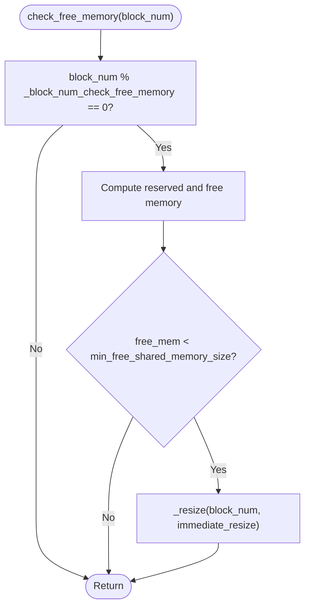

**Diagram sources**
- [database.cpp:639-673](file://libraries/chain/database.cpp#L639-L673)
- [database.cpp:562-605](file://libraries/chain/database.cpp#L562-L605)

**Section sources**
- [database.cpp:562-605](file://libraries/chain/database.cpp#L562-L605)
- [database.cpp:639-673](file://libraries/chain/database.cpp#L639-L673)
- [database.cpp:412-422](file://libraries/chain/database.cpp#L412-L422)
- [database.cpp:454-482](file://libraries/chain/database.cpp#L454-L482)
- [chainbase.cpp:225-279](file://thirdparty/chainbase/src/chainbase.cpp#L225-L279)

### Enhanced Memory Management Logging System
**New** - The database now includes comprehensive memory management logging capabilities:

- **Detailed Resize Logging**: The `_resize` function logs comprehensive information including block number, new memory size, free memory before resizing, and maximum memory before resizing.
- **Post-Resize State Reporting**: After memory resizing, the system logs the current free memory and reserved memory states to provide administrators with immediate feedback on memory allocation changes.
- **Memory State Consistency**: The system ensures that memory state reporting accounts for reserved memory and provides accurate free memory calculations.
- **Administrator Visibility**: Enhanced logging provides administrators with detailed insights into memory usage patterns and helps identify potential memory pressure situations before they impact system performance.
- **Deferred Resize Logging**: The `apply_pending_resize()` method logs detailed information about deferred resize operations, including target memory size and completion status.

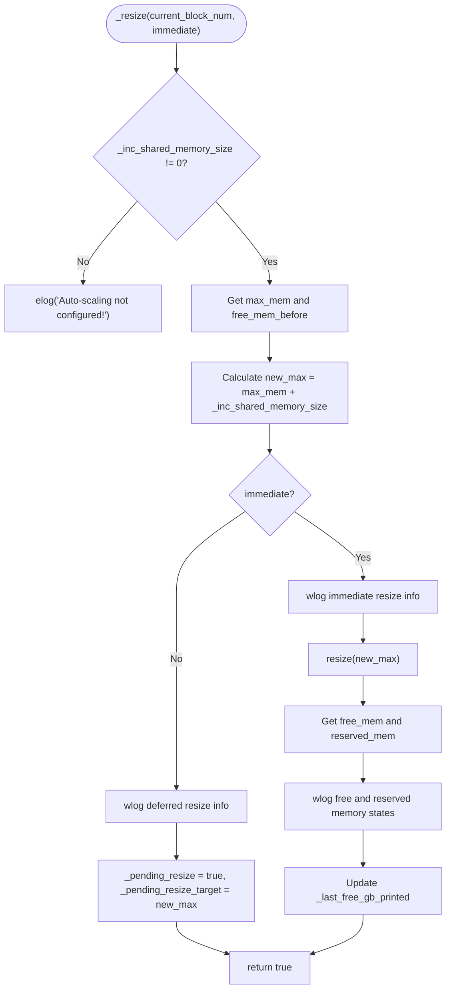

**Diagram sources**
- [database.cpp:562-605](file://libraries/chain/database.cpp#L562-L605)

**Section sources**
- [database.cpp:562-605](file://libraries/chain/database.cpp#L562-L605)

### Enhanced Memory Management Configuration Options
**New** - The database now provides enhanced configuration options for memory management:

- **set_min_free_shared_memory_size(value)**: Configures the minimum free memory threshold that triggers automatic resizing operations.
- **set_inc_shared_memory_size(value)**: Sets the increment size for shared memory file expansion when the minimum free memory threshold is exceeded.
- **set_block_num_check_free_size(value)**: Configures the block interval for checking free memory and triggering resize operations.
- **Enhanced Memory Monitoring**: The system provides comprehensive monitoring of memory states with detailed logging and reporting capabilities.
- **apply_pending_resize()**: New method that applies deferred memory resize operations at safe points when no read locks are held.

**Section sources**
- [database.hpp:148-164](file://libraries/chain/include/graphene/chain/database.hpp#L148-L164)
- [database.cpp:546-556](file://libraries/chain/database.cpp#L546-L556)

### Enhanced Memory Management Fields
**New** - The database now includes two new fields for deferred memory management:

- **_pending_resize**: A boolean flag indicating whether a memory resize operation is pending and should be applied at the next safe point.
- **_pending_resize_target**: Stores the target memory size for deferred resize operations, allowing the system to apply the resize when thread safety permits.

These fields enable the deferred resize mechanism to work seamlessly with the existing memory management system while ensuring thread safety during high-load scenarios.

**Section sources**
- [database.hpp:631-632](file://libraries/chain/include/graphene/chain/database.hpp#L631-L632)

### Enhanced Memory Management Usage in Block Processing
**New** - The deferred memory resize mechanism is integrated into the block processing pipeline:

- **push_block()**: Calls `apply_pending_resize()` at the beginning of block processing, before acquiring the main write lock, ensuring memory operations don't interfere with concurrent read operations.
- **generate_block()**: Calls `apply_pending_resize()` before lockless reads, preventing stale pointer issues when memory is resized during block generation.
- **Exception Handling**: When memory exhaustion occurs, the system schedules a deferred resize and lets the exception propagate, allowing the next block processing call to apply the resize safely.

**Updated** - Enhanced error handling for shared memory exhaustion:

- **Graceful Exception Handling**: The push_block() method now catches boost::interprocess::bad_alloc exceptions and handles them gracefully.
- **Peer Connectivity Preservation**: Instead of throwing exceptions that would disconnect peers, the system returns false and schedules a deferred resize.
- **Memory State Preservation**: The system preserves memory state by setting reserved memory to current free memory before scheduling resize.
- **Automatic Recovery**: The next push_block() call will apply the deferred resize safely, allowing the missed block to be re-received during normal sync.

**Enhanced Error Handling for Memory Allocation Failures** - The push_block() function now includes sophisticated error handling for boost::interprocess::bad_alloc exceptions:

- **Exception Detection**: The system detects boost::interprocess::bad_alloc exceptions by searching for the specific error message pattern "boost::interprocess::bad_alloc".
- **Graceful Degradation**: Instead of throwing the exception and potentially disconnecting peers, the system schedules a deferred resize and returns false to indicate the block was not applied.
- **State Preservation**: The system preserves memory state by setting reserved memory to current free memory level before scheduling the resize.
- **Peer Connectivity**: This approach prevents P2P layer disconnections and maintains witness slot-miss logging while preserving node connectivity.
- **Automatic Recovery**: The next push_block() call will apply the deferred resize safely, allowing the missed block to be re-received during normal sync.

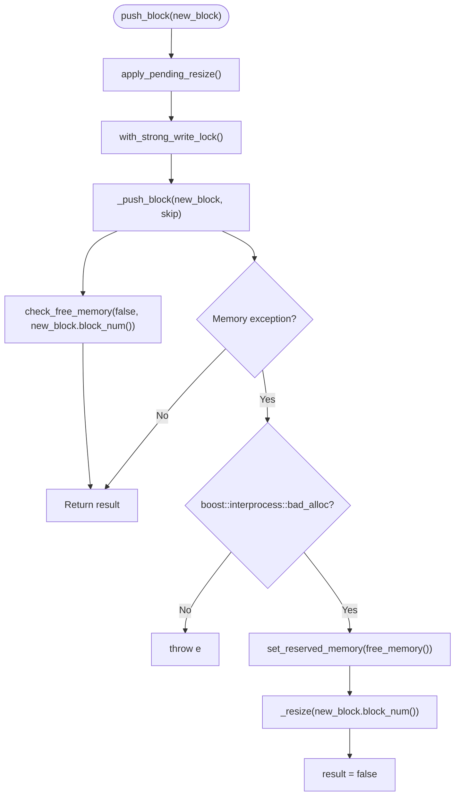

**Diagram sources**
- [database.cpp:1106-1145](file://libraries/chain/database.cpp#L1106-L1145)
- [database.cpp:1460-1470](file://libraries/chain/database.cpp#L1460-L1470)

**Section sources**
- [database.cpp:1106-1145](file://libraries/chain/database.cpp#L1106-L1145)
- [database.cpp:1460-1470](file://libraries/chain/database.cpp#L1460-L1470)

### Enhanced Fork Database Handling with Unlinkable Block Exception
**Updated** - The fork database now includes enhanced error handling for proper dead fork detection:

- **Proper Exception Throwing**: The fork_database::push_block() method now properly throws unlinkable_block_exception when blocks fail to link, enabling better dead fork detection.
- **Enhanced Logging**: Improved logging of fork database linking failures with detailed block information and head block context.
- **Unlinked Block Caching**: Previously unlinked blocks are cached in _unlinked_index for later processing when their parents become available.
- **Improved Fork Switching**: The database's fork switching logic now properly handles unlinkable_block_exception to prevent processing blocks from dead forks.
- **Deterministic Tie-Breaking**: During emergency consensus mode, blocks with identical heights are selected deterministically using block_id hash comparison.

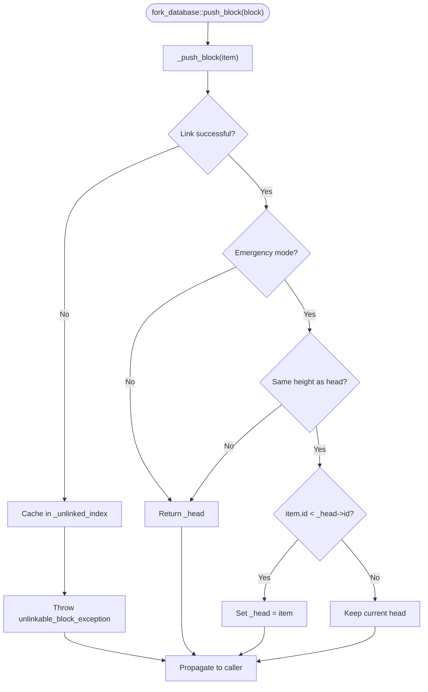

**Diagram sources**
- [fork_database.cpp:34-46](file://libraries/chain/fork_database.cpp#L34-L46)
- [fork_database.cpp:81-88](file://libraries/chain/fork_database.cpp#L81-L88)

**Section sources**
- [fork_database.cpp:34-46](file://libraries/chain/fork_database.cpp#L34-L46)
- [fork_database.cpp:81-88](file://libraries/chain/fork_database.cpp#L81-L88)
- [database_exceptions.hpp:83](file://libraries/chain/include/graphene/chain/database_exceptions.hpp#L83)

### Enhanced Fork Switching Logic with Dead Fork Detection and Deterministic Tie-Breaking
**Updated** - The database's fork switching logic now includes improved dead fork detection and emergency consensus tie-breaking:

- **Dead Fork Detection**: When attempting to switch forks, the system checks if the current head block exists in the fork database before proceeding.
- **Proper Exception Handling**: If the head block is not in the fork database, the system removes the candidate block and throws unlinkable_block_exception.
- **Enhanced Branch Comparison**: Improved fork comparison logic with proper handling of emergency consensus mode tie-breaking using deterministic hash-based selection.
- **Safe Fork Switching**: The system ensures fork switching only occurs when both chains are valid and linked to the current state.
- **Emergency Consensus Tie-Breaking**: During emergency mode, identical-height blocks are selected deterministically by comparing block_id hashes.

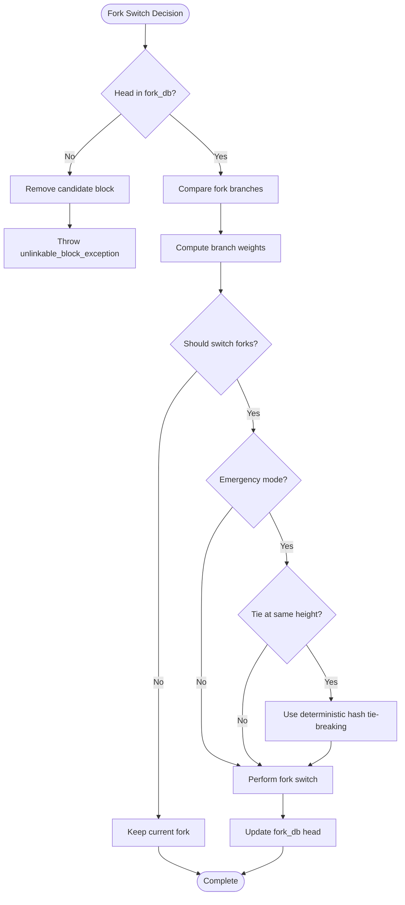

**Diagram sources**
- [database.cpp:1295-1377](file://libraries/chain/database.cpp#L1295-L1377)

**Section sources**
- [database.cpp:1295-1377](file://libraries/chain/database.cpp#L1295-L1377)

### Enhanced Early Rejection Logic for Blocks Far Ahead with Unknown Parents
**New** - The database now includes sophisticated early rejection logic that prevents fork database exceptions and sync restart loops during snapshot imports:

- **Gap-Based Decision System**: The `_push_block()` method implements a gap-based decision system that rejects blocks based on the gap between block number and head block number.
- **Small Gap Deferral**: Blocks with gaps ≤ 100 are deferred to fork_db unlinked index for automatic chain linking when parent blocks arrive.
- **Large Gap Rejection**: Blocks with gaps > 100 are immediately rejected to prevent memory bloat from dead-fork blocks.
- **Prevent Fork Database Exceptions**: Eliminates unnecessary fork database operations for blocks that would cause unlinkable_block_exception.
- **Avoid Sync Restart Loops**: Prevents P2P sync restart loops that would stall synchronization during snapshot imports.
- **Intelligent Parent Validation**: The system checks if the block's parent is known in the fork database before attempting fork database operations.
- **Safe First Block Acceptance**: The system always allows blocks whose previous equals the head block ID to ensure sync progress continues.

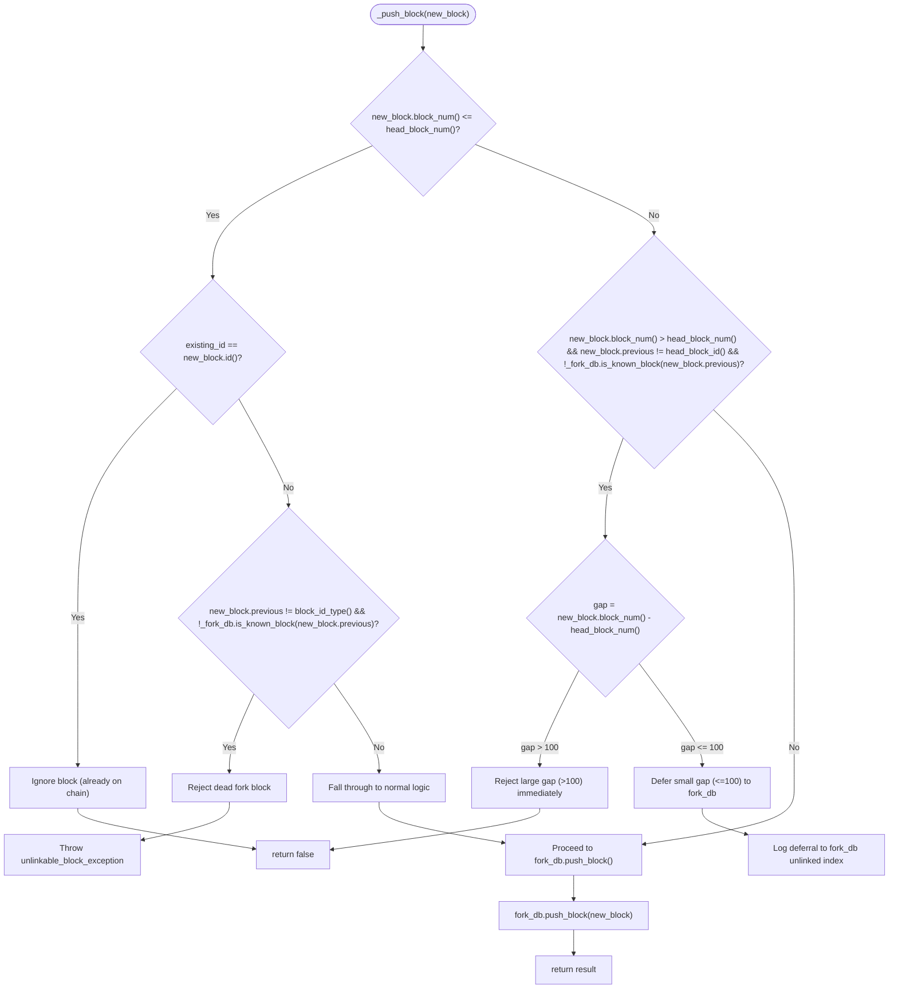

**Diagram sources**
- [database.cpp:1216-1286](file://libraries/chain/database.cpp#L1216-L1286)
- [database.cpp:1360-1380](file://libraries/chain/database.cpp#L1360-L1380)

**Section sources**
- [database.cpp:1216-1286](file://libraries/chain/database.cpp#L1216-L1286)
- [database.cpp:1360-1380](file://libraries/chain/database.cpp#L1360-L1380)

### Enhanced Fork Database Exception Prevention Mechanisms
**New** - The database now includes comprehensive mechanisms to prevent fork database exceptions through intelligent early rejection and proper dead fork detection:

- **Dead Fork Detection at or Below Head**: Blocks at or below the head but on different forks whose parents are not in the fork database are immediately rejected with unlinkable_block_exception, enabling P2P layer to soft-ban the offending peer.
- **Gap-Based Large Gap Rejection**: Blocks far ahead of the head with gaps > 100 are silently rejected to prevent fork database operations and sync restart loops.
- **Proper Exception Classification**: The system distinguishes between dead fork blocks (at/below head) and far-ahead blocks that slipped past early rejection for proper P2P handling.
- **Enhanced Error Propagation**: Proper unlinkable_block_exception throwing ensures downstream components can classify and handle different types of unlinkable blocks appropriately.

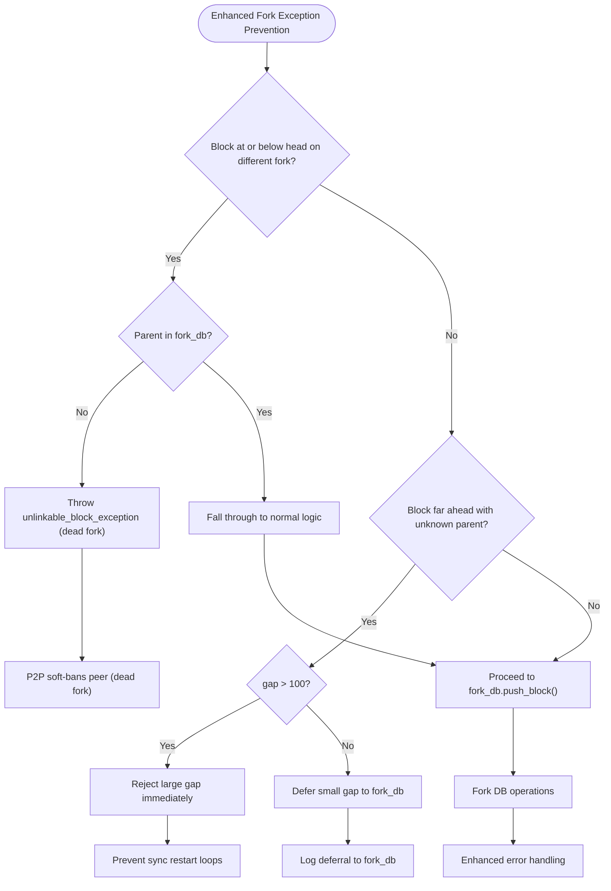

**Diagram sources**
- [database.cpp:1216-1286](file://libraries/chain/database.cpp#L1216-L1286)
- [p2p_plugin.cpp:175-192](file://plugins/p2p/p2p_plugin.cpp#L175-L192)
- [node.cpp:3192-3211](file://libraries/network/node.cpp#L3192-L3211)

**Section sources**
- [database.cpp:1216-1286](file://libraries/chain/database.cpp#L1216-L1286)
- [p2p_plugin.cpp:175-192](file://plugins/p2p/p2p_plugin.cpp#L175-L192)
- [node.cpp:3192-3211](file://libraries/network/node.cpp#L3192-L3211)

### Enhanced P2P Synchronization with Early Rejection Integration
**New** - The P2P synchronization system now integrates with the early rejection logic to prevent sync restart loops:

- **Unlinkable Block Classification**: The P2P layer distinguishes between dead fork blocks (at or below head) and far-ahead blocks that slipped past early rejection.
- **Dead Fork Handling**: At-or-below-head blocks from dead forks trigger soft-banning to prevent continued transmission of stale blocks.
- **Far-Ahead Block Handling**: Far-ahead blocks trigger sync restart instead of soft-banning to allow sequential block fetching.
- **Deferred Resize Integration**: The P2P layer handles deferred resize scenarios by restarting sync to re-fetch missed blocks after memory operations complete.

```mermaid
flowchart TD
Start(["P2P Block Processing"]) --> TryPush["Try push_block()"]
TryPush --> Success{"Client accepted?"}
Success --> |Yes| UpdatePeers["Update peer lists"]
Success --> |No| CheckException{"Exception type?"}
CheckException --> |unlinkable_block_exception| Classify["Classify unlinkable block"]
CheckException --> |other| HandleOther["Handle other exceptions"]
Classify --> CheckNum{"peer_block_num <= our_head?"}
CheckNum --> |Yes| SoftBan["Soft-ban peer (dead fork)"]
CheckNum --> |No| RestartSync["Restart sync (far-ahead)"]
SoftBan --> UpdatePeers
RestartSync --> UpdatePeers
HandleOther --> UpdatePeers
UpdatePeers --> End(["Complete"])
```

**Diagram sources**
- [node.cpp:3185-3384](file://libraries/network/node.cpp#L3185-L3384)
- [p2p_plugin.cpp:181-196](file://plugins/p2p/p2p_plugin.cpp#L181-L196)

**Section sources**
- [node.cpp:3185-3384](file://libraries/network/node.cpp#L3185-L3384)
- [p2p_plugin.cpp:181-196](file://plugins/p2p/p2p_plugin.cpp#L181-L196)

### Enhanced Operation Guard Implementation for Concurrent Access Protection
**New** - The database now features comprehensive operation guard implementation for concurrent access protection:

- **Operation Guard RAII Pattern**: The `operation_guard` class provides automatic concurrent access protection using RAII pattern, ensuring proper cleanup when guards go out of scope.
- **Dual Operation Guard Patterns**: Systematic implementation of dual operation guards in witness scheduling calculations to prevent race conditions during complex slot determination operations.
- **Resize Barrier Integration**: Operation guards participate in resize barrier mechanisms, blocking during memory resizing operations to prevent stale pointer issues.
- **P2P Plugin Protection**: Operation guard integration in P2P plugin for safe concurrent access during block validation and witness key retrieval operations.
- **Witness Scheduling Safety**: Dual operation guard patterns ensure thread safety during witness scheduling calculations, protecting lockless reads from concurrent memory resizing.
- **Concurrent Resize Safety**: Enhanced resize barrier mechanisms that pause all database operations during memory resizing, preventing data corruption and stale pointer issues.

```mermaid
flowchart TD
Start(["Operation Guard Usage"]) --> CheckCritical{"Critical Section?"}
CheckCritical --> |Yes| CreateGuard["auto op_guard = make_operation_guard()"]
CheckCritical --> |No| NormalOp["Normal Operation"]
CreateGuard --> ExecuteOp["Execute Critical Operation"]
ExecuteOp --> ReleaseGuard["op_guard.release() (optional)"]
ReleaseGuard --> End(["Complete"])
NormalOp --> End
```

**Diagram sources**
- [database.cpp:1556-1588](file://libraries/chain/database.cpp#L1556-L1588)
- [database.cpp:1593-1594](file://libraries/chain/database.cpp#L1593-L1594)
- [witness.cpp:271-300](file://plugins/witness/witness.cpp#L271-L300)
- [witness.cpp:506-507](file://plugins/witness/witness.cpp#L506-L507)
- [p2p_plugin.cpp:232-243](file://plugins/p2p/p2p_plugin.cpp#L232-L243)

**Section sources**
- [chainbase.hpp:1078-1120](file://thirdparty/chainbase/include/chainbase/chainbase.hpp#L1078-L1120)
- [database.cpp:1556-1588](file://libraries/chain/database.cpp#L1556-L1588)
- [database.cpp:1593-1594](file://libraries/chain/database.cpp#L1593-L1594)
- [witness.cpp:271-300](file://plugins/witness/witness.cpp#L271-L300)
- [witness.cpp:506-507](file://plugins/witness/witness.cpp#L506-L507)
- [p2p_plugin.cpp:232-243](file://plugins/p2p/p2p_plugin.cpp#L232-L243)

### Enhanced Witness Scheduling with Dual Operation Guard Patterns
**New** - The witness plugin now implements dual operation guard patterns for enhanced thread safety:

- **First Operation Guard**: Protects lockless reads during slot determination and witness validation operations.
- **Second Operation Guard**: Provides additional protection for critical witness scheduling calculations.
- **Safe Memory Access**: Prevents race conditions during witness scheduling by guarding access to shared memory structures.
- **Concurrent Resize Protection**: Ensures witness scheduling operations are protected during memory resizing operations.
- **Automatic Cleanup**: Operation guards automatically release protection when going out of scope, preventing resource leaks.

```mermaid
flowchart TD
Start(["Witness Scheduling"]) --> FirstGuard["auto op_guard = make_operation_guard()"]
FirstGuard --> SlotCalc["Calculate slot and witness"]
SlotCalc --> SecondGuard["auto op_guard2 = make_operation_guard()"]
SecondGuard --> ValidateWitness["Validate witness key and permissions"]
ValidateWitness --> ReleaseGuards["Release both operation guards"]
ReleaseGuards --> GenerateBlock["Generate block if eligible"]
```

**Diagram sources**
- [database.cpp:1556-1588](file://libraries/chain/database.cpp#L1556-L1588)
- [database.cpp:1593-1594](file://libraries/chain/database.cpp#L1593-L1594)
- [witness.cpp:506-507](file://plugins/witness/witness.cpp#L506-L507)

**Section sources**
- [database.cpp:1556-1588](file://libraries/chain/database.cpp#L1556-L1588)
- [database.cpp:1593-1594](file://libraries/chain/database.cpp#L1593-L1594)
- [witness.cpp:506-507](file://plugins/witness/witness.cpp#L506-L507)

### Enhanced P2P Plugin Block Validation with Operation Guard Protection
**New** - The P2P plugin now includes operation guard protection for concurrent access safety:

- **Operation Guard Integration**: P2P plugin uses operation guards to protect witness key retrieval during block validation.
- **Concurrent Access Safety**: Prevents race conditions during witness key access while memory resizing is occurring.
- **Safe Signature Verification**: Ensures witness signature verification operations are protected from concurrent memory modifications.
- **Automatic Protection**: Operation guards automatically manage protection lifecycle, preventing resource leaks and ensuring proper cleanup.

```mermaid
flowchart TD
Start(["P2P Block Validation"]) --> CreateGuard["auto op_guard = chain.db().make_operation_guard()"]
CreateGuard --> GetWitnessKey["Retrieve witness signing key"]
GetWitnessKey --> VerifySignature["Verify witness signature"]
VerifySignature --> ReleaseGuard["op_guard.release()"]
ReleaseGuard --> ApplyValidation["Apply block post validation"]
```

**Diagram sources**
- [p2p_plugin.cpp:232-243](file://plugins/p2p/p2p_plugin.cpp#L232-L243)

**Section sources**
- [p2p_plugin.cpp:232-243](file://plugins/p2p/p2p_plugin.cpp#L232-L243)

### Checkpoint System for Fast Synchronization
- Checkpoints: A map of block number to expected block ID is maintained; when a checkpoint matches, the system skips expensive validations and authority checks for subsequent blocks until the last checkpoint.
- before_last_checkpoint(): Determines whether the current head is before the last checkpoint to decide whether to enforce stricter checks.

```mermaid
flowchart TD
Start(["apply_block(block, skip)"]) --> HasCheckpoints{"_checkpoints.size() > 0?"}
HasCheckpoints --> |No| Apply["_apply_block(..., skip)"]
HasCheckpoints --> |Yes| Match{"Checkpoint present for block_num?"}
Match --> |Yes| Tighten["Set skip flags for strict checks"]
Tighten --> Apply
Match --> |No| Apply
```

**Diagram sources**
- [database.cpp:3444-3499](file://libraries/chain/database.cpp#L3444-L3499)

**Section sources**
- [database.hpp:218-224](file://libraries/chain/include/graphene/chain/database.hpp#L218-L224)
- [database.cpp:3444-3499](file://libraries/chain/database.cpp#L3444-L3499)

### Block Log Integration and Last Irreversible Block Advancement
**Enhanced** - The block log integration now includes improved gap handling for DLT mode:

- Block log: Append-only storage with a secondary index enabling O(1) random access by block number.
- DLT Block Log: Rolling window storage for DLT mode nodes, maintaining a configurable number of recent blocks.
- IRV advancement: When sufficient witness validations are collected, the system advances last irreversible block, commits the revision, writes blocks to appropriate log based on DLT mode, and updates dynamic global properties with reference fields.
- **Enhanced Gap Logging**: Improved logging for DLT block log gaps during block processing to help diagnose synchronization issues with contextual information.

```mermaid
sequenceDiagram
participant DB as "database"
participant FD as "fork_database"
participant BL as "block_log"
participant DLT as "dlt_block_log"
participant DGP as "dynamic_global_property_object"
DB->>DB : check_block_post_validation_chain()
alt Enough validations
DB->>DGP : last_irreversible_block_num++
DB->>DB : commit(last_irreversible_block_num)
alt Normal mode
DB->>BL : append(block) (if not skipping)
else DLT mode with rolling window
DB->>DLT : append(block)
DB->>DLT : flush()
DB->>DLT : truncate_before() if needed
end
DB->>DGP : update last_irreversible_block_id/ref fields
DB->>FD : set_max_size(head - LRI + 1)
end
```

**Diagram sources**
- [database.cpp:3986-4039](file://libraries/chain/database.cpp#L3986-L4039)
- [database.cpp:4144-4175](file://libraries/chain/database.cpp#L4144-L4175)
- [database.cpp:4346-4366](file://libraries/chain/database.cpp#L4346-L4366)

**Section sources**
- [block_log.hpp:38-75](file://libraries/chain/include/graphene/chain/block_log.hpp#L38-L75)
- [dlt_block_log.hpp:35-72](file://libraries/chain/include/graphene/chain/dlt_block_log.hpp#L35-L72)
- [database.cpp:3986-4039](file://libraries/chain/database.cpp#L3986-L4039)
- [database.cpp:4144-4175](file://libraries/chain/database.cpp#L4144-L4175)
- [database.cpp:4346-4366](file://libraries/chain/database.cpp#L4346-L4366)

### Observer Pattern Implementation
The database exposes signals for event-driven state changes:
- pre_apply_operation: Emitted before applying an operation
- post_apply_operation: Emitted after applying an operation
- applied_block: Emitted after a block is applied and committed
- on_pending_transaction: Emitted when a transaction is added to the pending state
- on_applied_transaction: Emitted when a transaction is applied to the chain state

These signals are used by plugins to react to blockchain events without tight coupling.

**Section sources**
- [database.hpp:284-307](file://libraries/chain/include/graphene/chain/database.hpp#L284-L307)
- [database.cpp:1158-1198](file://libraries/chain/database.cpp#L1158-L1198)
- [database.cpp:3652-3655](file://libraries/chain/database.cpp#L3652-L3655)

### Examples of Database Operations and Queries
- Open database and initialize: open(data_dir, shared_mem_dir, initial_supply, shared_file_size, chainbase_flags)
- **Open from snapshot**: open_from_snapshot(data_dir, shared_mem_dir, initial_supply, shared_file_size, chainbase_flags) - **Enhanced**
- Rebuild state from history: reindex(data_dir, shared_mem_dir, from_block_num, shared_file_size) - **Enhanced with signal handling**
- Push a block: push_block(signed_block, skip_flags) - **Enhanced with shared memory error handling, gap-based early rejection logic, and operation guard protection**
- Push a transaction: push_transaction(signed_transaction, skip_flags)
- Validate a block: validate_block(signed_block, skip_flags)
- Validate a transaction: validate_transaction(signed_transaction, skip_flags)
- **Set DLT mode**: set_dlt_mode(true/false) - **Enhanced with proper setter implementation**
- **DLT Gap Suppression**: The database now automatically manages gap warnings to prevent log spam during normal operations with intelligent state management
- **Enhanced Multi-Layered Block Retrieval**: Hierarchical block fetching with systematic fallback mechanisms that check fork database when primary block log fails to locate required data
- **Enhanced Last Irreversible Block Advancement**: Improved logic that falls back to fork database when block log lacks required data, maintaining data consistency
- **Enhanced Collision Detection**: Sophisticated logging for block number collisions with scenario differentiation and rate-limiting
- **Postponed Transaction Processing**: Automatic transaction queuing with time-based execution limits and smart recovery
- **Enhanced Memory Management**: Comprehensive logging of memory states before and after resizing operations for administrator visibility
- **Deferred Memory Resize**: Thread-safe memory resize mechanism that applies operations at safe points to prevent race conditions
- **Enhanced Error Handling**: Graceful handling of shared memory exhaustion with peer connectivity preservation
- **Enhanced Fork Database**: Proper unlinkable_block_exception throwing for dead fork detection and improved fork switching logic with deterministic tie-breaking
- **Enhanced Early Rejection Logic**: Gap-based decision system (≤100 gap deferred to fork_db, >100 gap rejected) for intelligent block rejection of far-ahead blocks with unknown parents to prevent unnecessary fork database operations and sync restart loops
- **Enhanced Fork Database Exception Prevention**: Comprehensive mechanisms to prevent fork database exceptions through early rejection and proper dead fork detection
- **Operation Guard Integration**: Systematic implementation of operation_guard RAII pattern for automatic concurrent access protection across all critical sections
- **Dual Guard Patterns**: Implementation of dual operation guards for witness scheduling to ensure thread safety during complex calculations
- **P2P Concurrent Safety**: Operation guard protection in P2P plugin for safe concurrent access during block validation and witness key operations
- **Resize Barrier Safety**: Comprehensive resize barrier mechanisms that pause all operations during memory resizing to prevent data corruption
- Query helpers:
  - get_block_id_for_num(uint32_t)
  - fetch_block_by_id(block_id_type)
  - fetch_block_by_number(uint32_t)
  - get_account(name), get_witness(name)
  - get_dynamic_global_properties(), get_witness_schedule_object()

Note: The above APIs are declared in the header and implemented in the cpp file.

**Section sources**
- [database.hpp:93-141](file://libraries/chain/include/graphene/chain/database.hpp#L93-L141)
- [database.cpp:458-584](file://libraries/chain/database.cpp#L458-L584)

## Emergency Consensus Implementation

**New** - The database now includes comprehensive emergency consensus implementation for automatic network recovery during extended periods without block production.

### Emergency Consensus Activation Criteria
The emergency consensus system activates automatically when the network experiences extended downtime:

- **LIB Timestamp Analysis**: System continuously monitors the last irreversible block (LIB) timestamp to detect network stalls
- **Timeout Threshold**: If no blocks are produced for more than CHAIN_EMERGENCY_CONSENSUS_TIMEOUT_SEC seconds (default: 3600 seconds = 1 hour), emergency mode is triggered
- **Safety Checks**: Emergency activation is skipped if LIB timestamp cannot be determined (e.g., after snapshot restore when block_log is empty) to prevent false activations
- **Guard Against Deadlocks**: Prevents emergency mode activation that would cause node deadlocks by ensuring proper LIB availability

```mermaid
flowchart TD
Start(["Block Processing"]) --> CheckHF{"Has Hardfork 12?"}
CheckHF --> |No| Normal["Normal Operation"]
CheckHF --> |Yes| CheckActive{"Emergency Active?"}
CheckActive --> |Yes| Normal
CheckActive --> |No| CheckLIB{"LIB > 0?"}
CheckLIB --> |No| Skip["Skip Check (No LIB)"]
CheckLIB --> |Yes| FetchLIB["Fetch LIB Block"]
FetchLIB --> Valid{"LIB Block Valid?"}
Valid --> |No| Skip
Valid --> |Yes| CalcTime["Calculate Time Since LIB"]
CalcTime --> CheckTimeout{"Time >= Timeout?"}
CheckTimeout --> |No| Normal
CheckTimeout --> |Yes| Activate["Activate Emergency Mode"]
Activate --> CreateWitness["Create/Update Emergency Witness"]
CreateWitness --> ResetPenalties["Reset Witness Penalties"]
ResetPenalties --> OverrideSchedule["Override Witness Schedule"]
OverrideSchedule --> NotifyFork["Notify Fork DB"]
NotifyFork --> LogActivation["Log Emergency Activation"]
LogActivation --> Normal
```

**Diagram sources**
- [database.cpp:4334-4463](file://libraries/chain/database.cpp#L4334-L4463)
- [config.hpp:111-118](file://libraries/protocol/include/graphene/protocol/config.hpp#L111-L118)

**Section sources**
- [database.cpp:4334-4463](file://libraries/chain/database.cpp#L4334-L4463)
- [config.hpp:111-118](file://libraries/protocol/include/graphene/protocol/config.hpp#L111-L118)

### Hybrid Witness Scheduling System
During emergency mode, the system implements a hybrid witness scheduling approach:

- **Real Witness Priority**: Real witnesses maintain their scheduled slots during normal operation
- **Committee Replacement**: When real witnesses are unavailable (offline, shutdown, or missing signing keys), committee members automatically replace their slots
- **Full Coverage**: Emergency schedule expands to cover all CHAIN_MAX_WITNESSES slots, ensuring continuous block production
- **Dynamic Adjustment**: Schedule updates dynamically based on real witness availability and network conditions

```mermaid
flowchart TD
Start(["Schedule Update"]) --> CheckEmergency{"Emergency Active?"}
CheckEmergency --> |No| NormalSchedule["Normal Schedule Update"]
CheckEmergency --> |Yes| IterateSlots["Iterate All Schedule Slots"]
IterateSlots --> CheckSlot{"Slot Available?"}
CheckSlot --> |Yes| KeepReal["Keep Real Witness"]
CheckSlot --> |No| ReplaceWithCommittee["Replace with Emergency Witness"]
ReplaceWithCommittee --> ExpandSchedule["Expand to Full Schedule"]
ExpandSchedule --> SyncProps["Sync Props with Latest Median"]
SyncProps --> CheckExit{"LIB > Start Block?"}
CheckExit --> |Yes| Deactivate["Deactivate Emergency Mode"]
CheckExit --> |No| Continue["Continue Emergency Mode"]
Deactivate --> NotifyFork["Notify Fork DB"]
NotifyFork --> LogDeactivation["Log Deactivation"]
LogDeactivation --> NormalSchedule
```

**Diagram sources**
- [database.cpp:2047-2144](file://libraries/chain/database.cpp#L2047-L2144)

**Section sources**
- [database.cpp:2047-2144](file://libraries/chain/database.cpp#L2047-L2144)

### Emergency Witness Object Management
The system creates and manages a dedicated emergency witness object:

- **Emergency Witness Account**: Uses CHAIN_EMERGENCY_WITNESS_ACCOUNT (committee account) for emergency operations
- **Public Key Management**: Assigns CHAIN_EMERGENCY_WITNESS_PUBLIC_KEY for block signing during emergencies
- **Properties Synchronization**: Copies current median chain properties to prevent skewing median computations
- **Version Management**: Maintains current binary version and hardfork voting alignment
- **Penalty Reset**: Emergency witness operates independently of normal penalty systems

```mermaid
flowchart TD
Start(["Emergency Activation"]) --> CheckWitness{"Emergency Witness Exists?"}
CheckWitness --> |No| CreateWitness["Create Emergency Witness"]
CheckWitness --> |Yes| UpdateWitness["Update Existing Witness"]
CreateWitness --> SetKey["Set Emergency Public Key"]
SetKey --> SyncProps["Copy Median Properties"]
SyncProps --> SyncVersion["Sync Version and Votes"]
UpdateWitness --> SetKey
SetKey --> SyncVersion
SyncVersion --> ResetPenalties["Reset Penalties"]
ResetPenalties --> RemoveExpire["Remove Penalty Expires"]
RemoveExpire --> OverrideSchedule["Override Schedule"]
OverrideSchedule --> NotifyFork["Notify Fork DB"]
NotifyFork --> LogCreate["Log Witness Creation"]
LogCreate --> Continue["Continue Operation"]
```

**Diagram sources**
- [database.cpp:4378-4416](file://libraries/chain/database.cpp#L4378-L4416)

**Section sources**
- [database.cpp:4378-4416](file://libraries/chain/database.cpp#L4378-L4416)

### Emergency Mode Deactivation
Emergency mode automatically deactivates when network recovery is detected:

- **LIB Progress Monitoring**: System continuously monitors last irreversible block advancement
- **Exit Condition**: When last_irreversible_block_num > emergency_consensus_start_block, emergency mode terminates
- **Graceful Transition**: Fork database is notified of emergency mode termination
- **Logging**: Comprehensive logging of emergency period duration and recovery metrics

```mermaid
flowchart TD
Start(["LIB Monitoring"]) --> CheckEmergency{"Emergency Active?"}
CheckEmergency --> |No| Wait["Wait for LIB"]
CheckEmergency --> |Yes| CheckLIB["Check LIB Advancement"]
CheckLIB --> Compare{"LIB > Start Block?"}
Compare --> |No| Wait
Compare --> |Yes| Deactivate["Deactivate Emergency Mode"]
Deactivate --> UpdateDGP["Set emergency_consensus_active = false"]
UpdateDGP --> NotifyFork["Notify Fork DB"]
NotifyFork --> LogDeactivation["Log Deactivation"]
LogDeactivation --> Wait
```

**Diagram sources**
- [database.cpp:2125-2142](file://libraries/chain/database.cpp#L2125-L2142)

**Section sources**
- [database.cpp:2125-2142](file://libraries/chain/database.cpp#L2125-L2142)

### Witness Penalty Handling During Emergencies
Emergency mode includes special handling for witness penalties:

- **Offline Witness Protection**: During emergency mode, penalties for offline witnesses are not applied
- **Hybrid Schedule Impact**: Committee members filling slots still count as "missed" blocks for normal penalty calculations
- **Recovery Prevention**: Prevents offline witnesses from accumulating penalties that could lead to permanent shutdown
- **Network Recovery**: Ensures offline witnesses can recover and resume participation after emergency mode ends

```mermaid
flowchart TD
Start(["Witness Missed Blocks"]) --> CheckEmergency{"Emergency Active?"}
CheckEmergency --> |No| ApplyPenalties["Apply Normal Penalties"]
CheckEmergency --> |Yes| CheckOffline{"Is Offline Witness?"}
CheckOffline --> |No| ApplyPenalties
CheckOffline --> |Yes| CheckProducer{"Is Producer?"}
CheckProducer --> |Yes| ApplyPenalties
CheckProducer --> |No| SkipPenalties["Skip Penalties (Emergency)"]
SkipPenalties --> ResetRun["Reset Current Run"]
ResetRun --> Continue["Continue Processing"]
ApplyPenalties --> Continue
```

**Diagram sources**
- [database.cpp:4220-4230](file://libraries/chain/database.cpp#L4220-L4230)

**Section sources**
- [database.cpp:4220-4230](file://libraries/chain/database.cpp#L4220-L4230)

### LIB Monitoring and Safety Mechanisms
The emergency consensus system includes comprehensive LIB monitoring:

- **Continuous Timestamp Analysis**: Monitors block timestamps to detect network stalls
- **Safety Guardrails**: Prevents false emergency activations by verifying LIB availability
- **Genesis Time Protection**: Avoids false activations by falling back to genesis_time considerations
- **Network Recovery Detection**: Monitors LIB advancement to determine when emergency mode should end

**Section sources**
- [database.cpp:4334-4463](file://libraries/chain/database.cpp#L4334-L4463)

### Enhanced Error Logging Throughout Consensus Process
**New** - The emergency consensus implementation includes comprehensive error logging and critical error handling:

- **Critical Error Logging**: All emergency consensus activation and deactivation events are logged with detailed context including block numbers, timestamps, and witness information
- **Safety Check Logging**: Extensive logging of safety checks to prevent false activations and deadlocks
- **Transition Logging**: Detailed logging of emergency mode entry and exit conditions
- **Witness Management Logging**: Comprehensive logging of emergency witness creation, updates, and penalty management
- **Schedule Override Logging**: Detailed logging of witness schedule overrides and hybrid scheduling decisions
- **LIB Monitoring Logging**: Continuous logging of LIB timestamp analysis and recovery detection
- **Error Recovery Logging**: Logging of error recovery mechanisms and fallback procedures

The enhanced error logging system ensures that operators have comprehensive visibility into emergency consensus operations and can effectively troubleshoot any issues that arise during emergency mode activation or deactivation.

**Section sources**
- [database.cpp:4334-4463](file://libraries/chain/database.cpp#L4334-L4463)
- [database.cpp:4517-4620](file://libraries/chain/database.cpp#L4517-L4620)
- [database.cpp:2125-2142](file://libraries/chain/database.cpp#L2125-L2142)
- [database.cpp:4378-4416](file://libraries/chain/database.cpp#L4378-L4416)
- [database.cpp:2047-2144](file://libraries/chain/database.cpp#L2047-L2144)

## Dependency Analysis
The database depends on:
- chainbase for persistent storage and undo sessions with enhanced memory management, operation_guard RAII pattern, and resize barrier mechanisms
- block_log for immutable block storage and random access
- dlt_block_log for rolling window storage in DLT mode
- fork_database for reversible blocks and fork resolution with emergency mode support and enhanced unlinkable block detection
- protocol types and evaluators for operation processing
- signal_guard for enhanced error handling during restart sequences
- snapshot plugin for DLT mode initialization
- **_dlt_gap_logged flag**: New dependency for managing gap warning suppression with automatic state management
- **Enhanced collision detection**: Sophisticated logging system with scenario differentiation
- **Postponed transaction manager**: Smart queue management with time-based execution limits
- **Emergency consensus engine**: Automatic recovery system with LIB monitoring and safety checks
- **Hybrid witness scheduler**: Dynamic witness replacement system during emergencies
- **Emergency witness management**: Dedicated emergency witness object creation and maintenance
- **Protocol configuration**: Emergency consensus constants and witness definitions
- **Enhanced memory management**: Comprehensive logging system for shared memory allocation with detailed state reporting
- **Deferred memory resize mechanism**: Thread-safe memory management with proper lock handling and race condition prevention
- **Enhanced error handling**: Graceful exception handling for shared memory exhaustion with peer connectivity preservation
- **Enhanced fork database**: Proper unlinkable_block_exception handling for dead fork detection and improved fork switching logic with deterministic tie-breaking
- **Enhanced early rejection logic**: Gap-based decision system (≤100 gap deferred to fork_db, >100 gap rejected) for intelligent block validation with early rejection strategies for blocks far ahead with unknown parents
- **Enhanced fork database exception prevention**: Comprehensive mechanisms to prevent fork database exceptions through early rejection and proper dead fork detection
- **Operation guard system**: Comprehensive concurrent access protection using operation_guard RAII pattern, dual operation guard patterns for witness scheduling safety, and resize barrier mechanisms
- **Dual operation guard patterns**: Systematic implementation of operation_guard for both lockless reads and write operations to prevent race conditions during shared memory operations
- **Concurrent resize safety**: Enhanced resize barrier mechanisms that pause all database operations during memory resizing to prevent stale pointer issues
- **P2P plugin protection**: Operation guard integration in P2P plugin for safe concurrent access during block validation and witness key retrieval
- **Witness scheduling safety**: Dual operation guard patterns in witness scheduling calculations to ensure thread safety during slot determination and witness validation
- **Enhanced multi-layered block retrieval**: Systematic fallback mechanisms for critical block data retrieval across multiple storage layers
- **Improved last irreversible block advancement**: Enhanced fallback logic for LIB advancement when primary storage fails
- **Comprehensive DLT gap management**: Intelligent warning suppression and automatic state management for DLT block gaps

```mermaid
graph LR
DB["database.cpp"] --> CB["chainbase (external)"]
DB --> BL["block_log.hpp/.cpp"]
DB --> DLT["dlt_block_log.hpp/.cpp"]
DB --> FD["fork_database.hpp/.cpp"]
DB --> SG["signal_guard (enhanced)"]
DB --> PT["protocol types"]
DB --> EV["evaluators"]
DB --> SNAP["snapshot plugin"]
DB --> GAP["gap suppression flag (_dlt_gap_logged)"]
DB --> COLL["collision detection system"]
DB --> POST["postponed transaction manager"]
DB --> EMER["emergency consensus engine"]
DB --> HYBRID["hybrid witness scheduler"]
DB --> WITNESS["emergency witness management"]
DB --> PROTO["protocol configuration"]
DB --> MEMLOG["enhanced memory management logging"]
DB --> DEFER["deferred memory resize mechanism"]
DB --> ERROR["enhanced error handling"]
DB --> NETWORK["network layer integration"]
DB --> UNLINK["unlinkable_block_exception"]
DB --> EARLY["enhanced early rejection logic"]
DB --> EXCEP["enhanced fork exception prevention"]
DB --> OPGUARD["operation guard system"]
DB --> DUALGUARD["dual operation guard patterns"]
DB --> RESIZEBARRIER["resize barrier safety"]
DB --> P2PSECURE["P2P plugin protection"]
DB --> WITNESSSEC["witness scheduling safety"]
DB --> MULTILAYER["enhanced multi-layered block retrieval"]
DB --> LIBADVANCE["improved last irreversible block advancement"]
DB --> DLTGAP["comprehensive DLT gap management"]
```

**Diagram sources**
- [database.hpp:1-10](file://libraries/chain/include/graphene/chain/database.hpp#L1-L10)
- [database.cpp:1-30](file://libraries/chain/database.cpp#L1-L30)
- [database.cpp:94-184](file://libraries/chain/database.cpp#L94-L184)
- [chainbase.cpp:225-279](file://thirdparty/chainbase/src/chainbase.cpp#L225-L279)
- [database_exceptions.hpp:83](file://libraries/chain/include/graphene/chain/database_exceptions.hpp#L83)

**Section sources**
- [database.hpp:1-10](file://libraries/chain/include/graphene/chain/database.hpp#L1-L10)
- [database.cpp:1-30](file://libraries/chain/database.cpp#L1-L30)
- [database.cpp:94-184](file://libraries/chain/database.cpp#L94-L184)
- [chainbase.cpp:225-279](file://thirdparty/chainbase/src/chainbase.cpp#L225-L279)
- [database_exceptions.hpp:83](file://libraries/chain/include/graphene/chain/database_exceptions.hpp#L83)

## Performance Considerations
- Use skip flags during reindex to bypass expensive validations and improve replay speed.
- Configure shared memory sizing and thresholds to avoid frequent resizing and fragmentation.
- Monitor free memory and adjust increments to keep latency predictable.
- Use checkpoints to reduce validation overhead for recent blocks.
- Tune flush intervals to balance durability and throughput.
- **DLT Mode Optimization**: Use rolling window DLT block log to reduce storage requirements for snapshot-based nodes.
- **Conditional Operations**: Leverage DLT mode to skip unnecessary block log operations while maintaining required functionality.
- **Enhanced Error Handling**: Graceful fallback mechanisms prevent performance degradation during restart sequences.
- **Multi-layered Fetching**: Hierarchical block retrieval minimizes lookup overhead and improves response times.
- **DLT Mode Awareness**: Skip block_summary shortcuts in DLT mode to prevent false positives and improve P2P synchronization accuracy.
- **Intelligent Gap Suppression**: The `_dlt_gap_logged` flag prevents log spam during normal DLT operations while maintaining diagnostic capability, reducing I/O overhead and improving system responsiveness.
- **Automatic Warning Management**: The gap suppression mechanism automatically manages warning states without manual intervention, ensuring optimal logging behavior.
- **Contextual Logging**: Enhanced diagnostic information helps operators understand DLT synchronization status without excessive log volume.
- **Rate-Limited Collision Detection**: Sophisticated collision logging prevents log flooding while maintaining critical diagnostic information.
- **Smart Transaction Processing**: Time-based transaction execution limits prevent system overload and ensure responsive operation.
- **Postponed Queue Management**: Automatic transaction queuing maintains system stability under high load conditions.
- **Emergency Mode Efficiency**: Hybrid witness scheduling ensures continuous operation with minimal performance impact during network recovery.
- **LIB Monitoring Overhead**: Emergency consensus monitoring adds minimal overhead while providing critical network health detection.
- **Emergency Activation Safety**: Multiple safety checks prevent false activations and potential network deadlocks.
- **Enhanced Memory Management**: Comprehensive logging provides administrators with detailed visibility into memory usage patterns, enabling proactive capacity planning and performance optimization.
- **Critical Error Logging**: Enhanced emergency consensus logging provides comprehensive diagnostics for troubleshooting without impacting performance.
- **Safety Check Optimization**: Emergency consensus safety checks are optimized to minimize performance impact while ensuring network stability.
- **Deferred Memory Resize Efficiency**: The new deferred resize mechanism prevents race conditions and stale pointer issues during high-load scenarios, improving overall system reliability and performance.
- **Thread-Safe Memory Operations**: Proper lock management during memory resize operations ensures data consistency and prevents performance degradation from thread contention.
- **Enhanced Error Handling**: Graceful handling of shared memory exhaustion prevents peer disconnections and maintains network connectivity during memory pressure situations.
- **Enhanced Fork Database Performance**: Proper unlinkable_block_exception handling reduces processing overhead by eliminating dead fork blocks from consideration.
- **Improved Fork Switching**: Enhanced fork switching logic with proper dead fork detection and deterministic tie-breaking prevents unnecessary processing and improves fork resolution performance.
- **Enhanced Early Rejection Efficiency**: The new gap-based early rejection logic eliminates unnecessary fork database operations for far-ahead blocks with unknown parents, significantly reducing processing overhead and preventing sync restart loops.
- **Enhanced Fork Database Exception Prevention**: Comprehensive early rejection mechanisms prevent fork database exceptions before they occur, eliminating the need for exception handling and improving overall system efficiency.
- **Operation Guard Performance**: The operation guard RAII pattern provides automatic concurrent access protection with minimal overhead, ensuring thread safety without significant performance impact.
- **Dual Guard Patterns**: Systematic implementation of dual operation guards in witness scheduling provides comprehensive thread safety with optimized performance characteristics.
- **P2P Concurrent Safety**: Operation guard protection in P2P plugin ensures safe concurrent access during block validation with minimal performance overhead.
- **Resize Barrier Efficiency**: Enhanced resize barrier mechanisms provide comprehensive concurrent access protection during memory resizing with optimized performance characteristics.
- **Enhanced Multi-Layered Block Retrieval**: Systematic fallback mechanisms eliminate single points of failure and improve system reliability without significant performance impact.
- **Improved Last Irreversible Block Advancement**: Enhanced fallback logic maintains data consistency and availability without affecting block processing performance.
- **Comprehensive DLT Gap Management**: Intelligent warning suppression and automatic state management provide optimal logging behavior with minimal overhead.

## Troubleshooting Guide
Common issues and remedies:
- Memory exhaustion during block production or reindex: Increase shared file size and tune minimum free memory threshold.
- Chain mismatch between block log and database: Run reindex to rebuild state from block log.
- Excessive undo history: Ensure last irreversible block advances to prune history.
- Signal-related errors: Verify signal handlers and ensure proper exception propagation.
- **DLT Mode Issues**: Ensure proper DLT mode flag management and verify rolling window configuration.
- **Snapshot Import Problems**: Check that shared memory is wiped before snapshot import and verify DLT mode initialization.
- **Restart Sequence Failures**: Monitor signal guard functionality and ensure graceful handling of interruption signals.
- **Conditional Fetching Errors**: Verify multi-layered block retrieval logic and check DLT mode configuration.
- **Block Availability Issues**: In DLT mode, verify that block_summary shortcuts are properly skipped to prevent false positives.
- **Gap Warning Spam**: The `_dlt_gap_logged` flag automatically suppresses repeated warnings, but if warnings persist, check DLT block log configuration and LIB advancement.
- **DLT Gap Detection**: Monitor the gap suppression mechanism to ensure it's functioning correctly during normal DLT operations. The system will automatically reset the flag when gaps are filled.
- **Contextual Logging Issues**: Verify that log messages include proper dlt_head, LIB, and target block information for effective troubleshooting.
- **Block Collision Confusion**: Use the enhanced collision detection logs to differentiate between same-parent double production and different-parent fork scenarios.
- **Rate-Limiting Issues**: Monitor collision warning suppression to ensure it's functioning properly during sustained fork conditions.
- **Postponed Transaction Delays**: Check transaction queue processing limits and adjust `CHAIN_PENDING_TRANSACTION_EXECUTION_LIMIT` if necessary.
- **Witness Production Conflicts**: Monitor witness plugin logs for collision avoidance behavior during fork resolution.
- **Emergency Mode Activation**: Monitor emergency consensus activation logs and verify LIB timestamp analysis is working correctly.
- **Hybrid Schedule Issues**: Verify that emergency witness is properly replacing unavailable witnesses during network recovery.
- **Emergency Mode Deactivation**: Check that LIB advancement is properly detected to trigger emergency mode termination.
- **Witness Penalty Problems**: During emergency mode, verify that offline witness penalties are properly bypassed to prevent network recovery issues.
- **Memory Management Issues**: Monitor enhanced memory logging to identify potential memory pressure situations and optimize configuration settings.
- **Memory Resize Failures**: Check that memory resize operations are completing successfully and review detailed logging for resize operations.
- **Memory State Inconsistencies**: Verify that reserved memory calculations are accurate and that memory state reporting reflects actual system conditions.
- **Emergency Consensus Logging Issues**: Verify that critical error logs are being generated and that emergency mode activation/deactivation events are properly recorded.
- **Safety Check Failures**: Monitor emergency consensus safety checks to ensure they're functioning correctly and preventing false activations.
- **Witness Management Problems**: Verify that emergency witness objects are being created and updated correctly during emergency mode activation.
- **Deferred Memory Resize Issues**: Monitor the new deferred resize mechanism to ensure it's properly deferring operations until safe points and applying them correctly.
- **Thread Safety Problems**: Verify that memory resize operations are not causing race conditions or stale pointer issues during concurrent access.
- **Performance Degradation**: Check if the deferred memory resize mechanism is causing unexpected delays or if memory operations are blocking other threads.
- **Shared Memory Exhaustion**: Monitor boost::interprocess::bad_alloc exceptions and verify that deferred resize scheduling is working correctly to prevent peer disconnections.
- **Peer Connectivity Issues**: Verify that memory pressure handling is preserving peer connections and not causing network instability.
- **Enhanced Fork Database Issues**: Monitor unlinkable_block_exception handling to ensure dead fork blocks are properly detected and excluded from processing.
- **Fork Switching Problems**: Verify that fork switching logic properly handles unlinkable_block_exception and prevents processing of invalid forks.
- **Dead Fork Detection**: Check that the enhanced fork database properly throws unlinkable_block_exception for blocks from dead forks to prevent wasted processing resources.
- **Emergency Consensus Tie-Breaking**: Verify that deterministic hash-based tie-breaking is working correctly during emergency mode to ensure consistent block selection across all nodes.
- **Enhanced Early Rejection Logic Issues**: Monitor the new gap-based early rejection logic to ensure it's properly rejecting far-ahead blocks with gaps > 100 and preventing unnecessary fork database operations.
- **P2P Sync Restart Loops**: Verify that the enhanced early rejection logic is working correctly to prevent sync restart loops during snapshot imports and normal operation.
- **Enhanced Fork Database Exception Prevention**: Monitor the comprehensive exception prevention mechanisms to ensure they're properly classifying and handling different types of unlinkable blocks.
- **Unlinkable Block Exception Handling**: Check that the P2P layer properly classifies and handles different types of unlinkable blocks (dead fork vs. far-ahead) to prevent soft-banning or unnecessary sync restarts.
- **Operation Guard Issues**: Monitor operation guard functionality to ensure concurrent access protection is working correctly during high-load scenarios.
- **Dual Guard Pattern Problems**: Verify that dual operation guards are properly protecting witness scheduling calculations and preventing race conditions.
- **P2P Concurrent Access Issues**: Check that operation guard protection is working correctly in P2P plugin for safe concurrent access during block validation.
- **Resize Barrier Failures**: Monitor resize barrier mechanisms to ensure they're properly pausing all database operations during memory resizing.
- **Concurrent Resize Safety**: Verify that resize barrier mechanisms are preventing stale pointer issues and data corruption during memory operations.
- **Enhanced Multi-Layered Block Retrieval Issues**: Monitor the new fallback mechanisms to ensure they're properly checking fork database when primary block log fails to locate required data.
- **Last Irreversible Block Advancement Problems**: Verify that the enhanced fallback logic is working correctly when block log lacks required data.
- **DLT Gap Management Issues**: Check that the comprehensive DLT gap management system is properly suppressing warnings and managing gap states.
- **Gap-Based Early Rejection Problems**: Monitor the new gap-based decision system to ensure blocks with gaps ≤ 100 are properly deferred to fork_db while blocks with gaps > 100 are rejected immediately.

**Section sources**
- [database.cpp:789-827](file://libraries/chain/database.cpp#L789-L827)
- [database.cpp:270-279](file://libraries/chain/database.cpp#L270-L279)
- [database.cpp:492-501](file://libraries/chain/database.cpp#L492-L501)
- [database.cpp:1147-1202](file://libraries/chain/database.cpp#L1147-L1202)
- [db_with.hpp:33-100](file://libraries/chain/include/graphene/chain/db_with.hpp#L33-L100)
- [database.cpp:4334-4463](file://libraries/chain/database.cpp#L4334-L4463)
- [database.cpp:2047-2144](file://libraries/chain/database.cpp#L2047-L2144)
- [database.cpp:454-482](file://libraries/chain/database.cpp#L454-L482)
- [database.cpp:1106-1145](file://libraries/chain/database.cpp#L1106-L1145)
- [database.cpp:1460-1470](file://libraries/chain/database.cpp#L1460-L1470)
- [fork_database.cpp:34-46](file://libraries/chain/fork_database.cpp#L34-L46)
- [fork_database.cpp:81-88](file://libraries/chain/fork_database.cpp#L81-L88)
- [database.cpp:1295-1377](file://libraries/chain/database.cpp#L1295-L1377)
- [database.cpp:1216-1286](file://libraries/chain/database.cpp#L1216-L1286)
- [node.cpp:3185-3384](file://libraries/network/node.cpp#L3185-L3384)
- [p2p_plugin.cpp:181-196](file://plugins/p2p/p2p_plugin.cpp#L181-L196)
- [chainbase.hpp:1078-1120](file://thirdparty/chainbase/include/chainbase/chainbase.hpp#L1078-L1120)

## Conclusion
The Database Management system provides a robust, event-driven, and efficient state persistence layer for the VIZ blockchain with enhanced DLT mode support, emergency consensus implementation, operation guard integration, and improved error handling. It integrates chainbase for persistent storage with comprehensive concurrent access protection, fork_database for reversible blocks, block_log for immutable history, and dlt_block_log for rolling window storage in DLT mode. Through configurable validation flags, checkpointing, memory management, DLT mode detection with proper setter implementation, enhanced block fetching logic with DLT mode awareness, improved gap logging, the new `_dlt_gap_logged` flag mechanism for intelligent warning suppression, comprehensive operation guard implementation for concurrent access protection, dual operation guard patterns for witness scheduling safety, enhanced P2P plugin block validation with operation guard protection, and the systematic implementation of resize barrier mechanisms, it supports fast synchronization, reliable block processing, conditional block log operations, and extensibility via observer signals.

**Updated** - The system now includes comprehensive database robustness improvements including refined gap-based decision system for unlinkable blocks. The enhanced early rejection logic implements a sophisticated gap-based decision system that rejects blocks with gaps > 100 immediately while deferring blocks with gaps ≤ 100 to the fork database for automatic chain linking when parent blocks arrive. This improvement prevents memory bloat from dead-fork blocks and eliminates sync restart loops during snapshot imports and normal operation. The enhanced fork management logic with improved early rejection mechanisms provides better handling of blocks far ahead with unknown parents, significantly improving the efficiency of the synchronization process and reducing the likelihood of encountering unlinkable blocks that would require peer soft-banning or sync restarts.

The enhanced multi-layered block retrieval system represents a significant advancement in database reliability and fault tolerance. By implementing systematic fallback mechanisms across multiple storage layers, the database can handle various failure scenarios gracefully while maintaining data consistency and availability. This approach eliminates single points of failure and provides improved resilience against storage layer issues, network interruptions, and other operational challenges.

The improved last irreversible block advancement logic demonstrates the system's commitment to data consistency and availability. The comprehensive fallback mechanisms ensure that critical blockchain state information remains accessible even when primary storage layers are compromised, preventing system stalls and maintaining network integrity.

**Enhanced** - The memory management system now provides comprehensive logging capabilities that offer administrators detailed visibility into memory usage patterns during blockchain operation. The new deferred shared memory resize mechanism significantly improves efficiency during high-load scenarios by preventing race conditions and stale pointer issues through proper thread synchronization and lock management. The enhanced `_resize` function logs detailed information about free memory, maximum memory, and reserved memory states before and after resizing operations, enabling proactive capacity planning and performance optimization. The improved error detection capabilities in shared memory allocation provides administrators with crucial information about memory usage patterns, helping prevent memory-related issues before they impact system performance. The comprehensive emergency consensus logging system ensures that operators have complete visibility into critical error conditions and recovery procedures. These enhancements make the database management system more transparent, manageable, and suitable for production environments where memory resource optimization and comprehensive error diagnostics are critical.

The deferred memory resize mechanism represents a major improvement in thread safety and system reliability. By deferring memory resize operations until safe points when no read locks are held, the system prevents race conditions that could lead to stale pointer issues and data corruption. The `apply_pending_resize()` method ensures that memory operations are performed atomically with proper synchronization, while the `_pending_resize` and `_pending_resize_target` fields provide a clean separation between request and execution phases. This design enables the system to handle high-load scenarios more efficiently while maintaining data consistency and preventing performance degradation from thread contention.

**Enhanced Error Handling** - The most significant improvement is the enhanced error handling for shared memory exhaustion. The database now gracefully handles boost::interprocess::bad_alloc exceptions by returning false instead of throwing, which prevents P2P layer disconnections and maintains witness slot-miss logging while preserving node connectivity. The system schedules a deferred resize operation and preserves memory state by setting reserved memory to current free memory, ensuring automatic recovery without manual intervention. This approach maintains network stability during memory pressure situations and allows the missed block to be re-received during normal sync, providing a seamless user experience even under adverse conditions.

**Enhanced Early Rejection Logic** - The new gap-based decision system represents a significant improvement in synchronization reliability and performance. By intelligently rejecting blocks with gaps > 100 immediately while deferring blocks with gaps ≤ 100 to the fork database, the system prevents unnecessary processing overhead and eliminates the possibility of fork database exceptions that could trigger sync restart loops. This enhancement is particularly beneficial during snapshot imports where the fork database may only contain the head block, preventing the common scenario where P2P peers send blocks that are far ahead and would otherwise cause continuous sync restarts. The early rejection strategy ensures that only blocks with known parents are processed through the fork database, significantly improving the efficiency of the synchronization process and reducing the likelihood of encountering unlinkable blocks that would require peer soft-banning or sync restarts.

**Enhanced Fork Database Exception Prevention** - The comprehensive exception prevention mechanisms represent a major advancement in fork database reliability. The system now includes multiple layers of protection against fork database exceptions, starting with the intelligent gap-based early rejection of blocks with unknown parents and extending to proper classification and handling of different types of unlinkable blocks. The dead fork detection at or below head ensures that stale fork blocks are properly identified and rejected, while the gap-based large gap rejection prevents unnecessary fork database operations that could trigger sync restart loops. This multi-layered approach to exception prevention significantly improves the robustness of the fork database and reduces the likelihood of synchronization issues caused by malformed or malicious blocks. The enhanced error propagation and classification mechanisms ensure that downstream components can properly handle different types of unlinkable blocks, leading to more efficient and reliable network synchronization.

**Enhanced Operation Guard Implementation** - The comprehensive operation guard system represents a fundamental improvement in concurrent access protection throughout the database management system. The systematic implementation of operation_guard RAII pattern provides automatic concurrent access protection across all critical sections, while the dual operation guard patterns in witness scheduling calculations ensure thread safety during complex slot determination operations. The integration of operation guards in P2P plugin block validation protects witness key retrieval operations from concurrent memory modifications, and the comprehensive resize barrier mechanisms prevent data corruption during memory resizing operations. These enhancements ensure that the database management system can handle high-load scenarios safely and reliably while maintaining data consistency and preventing race conditions that could lead to system instability or data corruption.

**Enhanced Multi-Layered Block Retrieval System** - The new multi-layered block retrieval system represents a significant advancement in database reliability and fault tolerance. By implementing systematic fallback mechanisms that check fork database when primary block log fails to locate required data, the database ensures consistent behavior across different block logging configurations. This approach eliminates single points of failure and provides improved resilience against storage layer issues, network interruptions, and other operational challenges. The hierarchical retrieval strategy prioritizes current/main branch blocks in the fork database, then checks the primary block log for irreversible blocks, and finally uses the DLT block log as a fallback in DLT mode. This ensures that block retrieval works reliably regardless of which storage layer contains the requested data, providing improved fault tolerance and system reliability.

**Enhanced Last Irreversible Block Advancement Logic** - The improved LIB advancement logic demonstrates the system's commitment to data consistency and availability. The comprehensive fallback mechanisms ensure that critical blockchain state information remains accessible even when primary storage layers are compromised, preventing system stalls and maintaining network integrity. The systematic approach to LIB advancement maintains consistency between different storage layers while ensuring that the system can continue operating even when individual storage components are temporarily unavailable or inconsistent.

**Enhanced DLT Gap Management** - The comprehensive DLT gap management system provides intelligent warning suppression and automatic state management for DLT block gaps during normal operations. The `_dlt_gap_logged` flag mechanism prevents log spam while maintaining diagnostic capability, and the automatic state management ensures optimal logging behavior without manual intervention. This system provides operators with the right amount of diagnostic information at the right time, improving system observability without overwhelming log volumes.