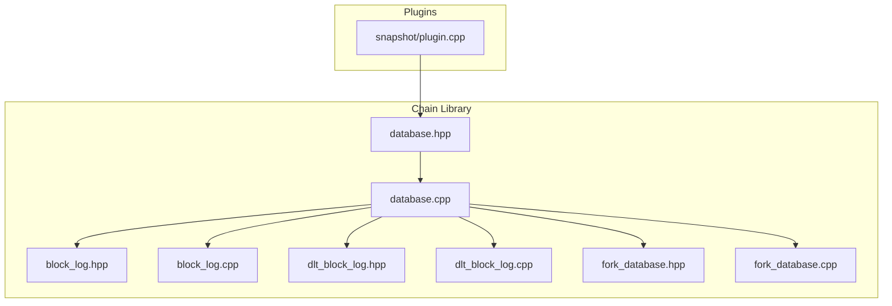
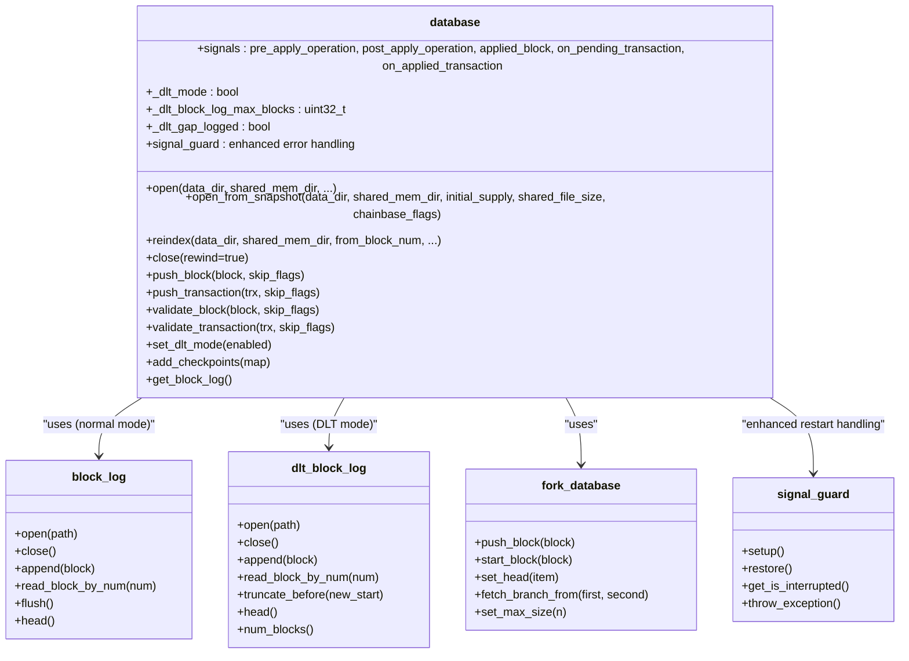
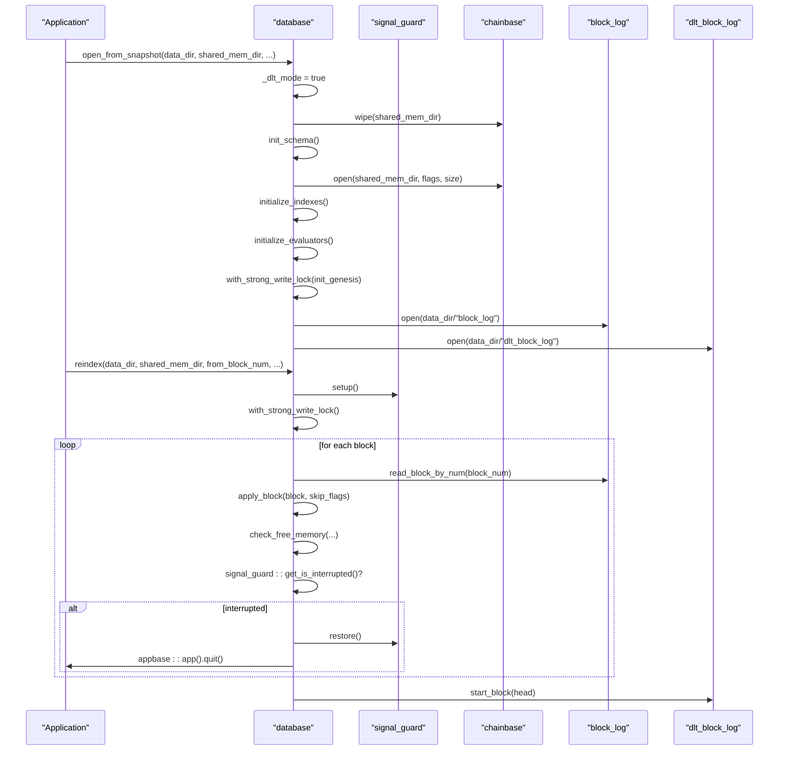
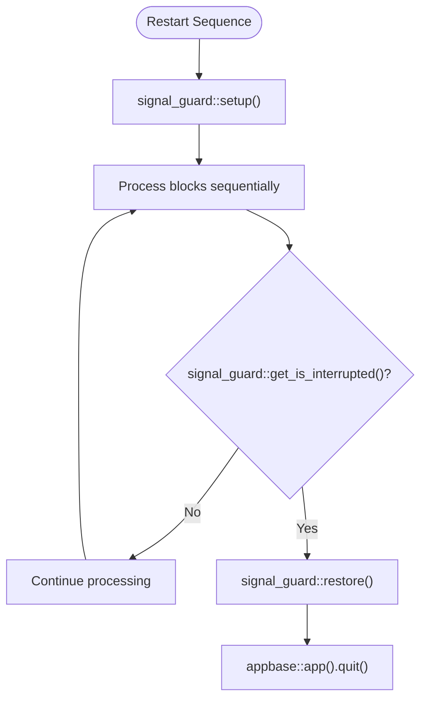
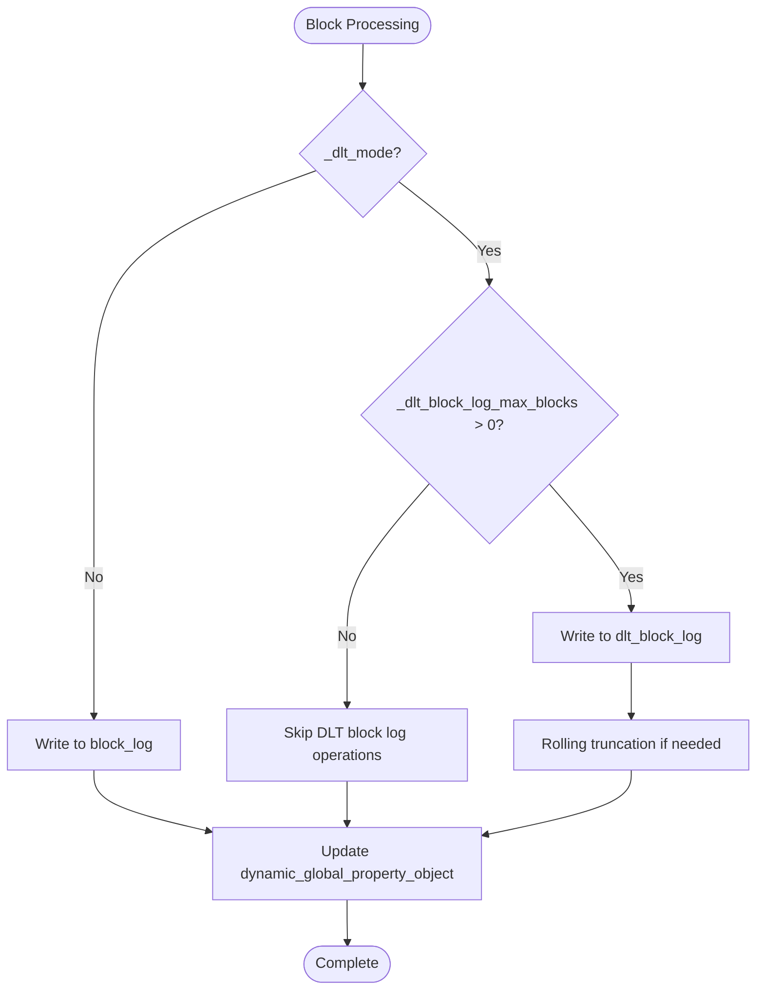
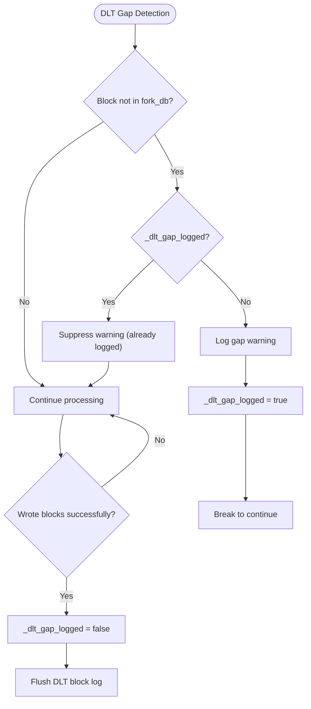
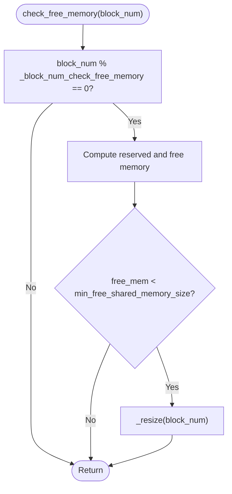
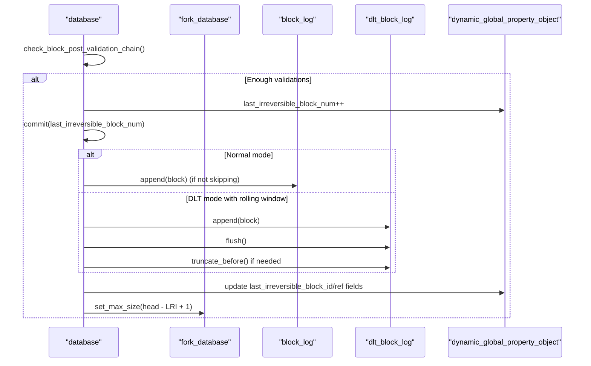
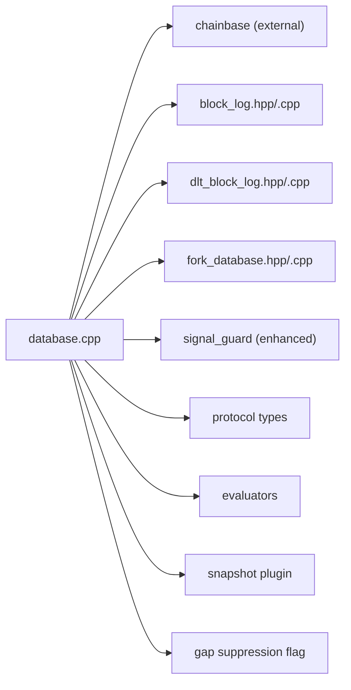

# Database Management

<cite>
**Referenced Files in This Document**
- [database.hpp](file://libraries/chain/include/graphene/chain/database.hpp)
- [database.cpp](file://libraries/chain/database.cpp)
- [block_log.hpp](file://libraries/chain/include/graphene/chain/block_log.hpp)
- [block_log.cpp](file://libraries/chain/block_log.cpp)
- [dlt_block_log.hpp](file://libraries/chain/include/graphene/chain/dlt_block_log.hpp)
- [dlt_block_log.cpp](file://libraries/chain/dlt_block_log.cpp)
- [fork_database.hpp](file://libraries/chain/include/graphene/chain/fork_database.hpp)
- [fork_database.cpp](file://libraries/chain/fork_database.cpp)
- [plugin.cpp](file://plugins/snapshot/plugin.cpp)
</cite>

## Update Summary
**Changes Made**
- Added documentation for the new `_dlt_gap_logged` flag mechanism that suppresses repeated warnings about missing blocks in fork database after snapshot import
- Enhanced DLT mode detection with proper setter implementation in set_dlt_mode() method
- Implemented skip block_summary shortcuts in is_known_block() method to prevent false positives in DLT mode
- Added enhanced logging for DLT block log gaps during block processing
- Improved conditional block fetching logic with DLT mode awareness

## Table of Contents
1. [Introduction](#introduction)
2. [Project Structure](#project-structure)
3. [Core Components](#core-components)
4. [Architecture Overview](#architecture-overview)
5. [Detailed Component Analysis](#detailed-component-analysis)
6. [Dependency Analysis](#dependency-analysis)
7. [Performance Considerations](#performance-considerations)
8. [Troubleshooting Guide](#troubleshooting-guide)
9. [Conclusion](#conclusion)

## Introduction
This document describes the Database Management system that serves as the core state persistence layer for the VIZ blockchain. It covers the database class lifecycle, initialization and cleanup, validation steps, session management, memory allocation strategies, shared memory configuration, checkpoints for fast synchronization, block log integration, observer pattern usage, DLT mode detection and conditional operations, enhanced block fetching logic with DLT mode awareness, the new `_dlt_gap_logged` flag mechanism for suppressing repeated warnings, and practical examples of database operations and performance optimization.

## Project Structure
The database subsystem is implemented primarily in the chain library with enhanced support for DLT mode and improved error handling:
- Core database interface and declarations: libraries/chain/include/graphene/chain/database.hpp
- Implementation of database operations with enhanced DLT mode support: libraries/chain/database.cpp
- Block log abstraction: libraries/chain/include/graphene/chain/block_log.hpp and libraries/chain/block_log.cpp
- DLT block log for rolling window storage: libraries/chain/include/graphene/chain/dlt_block_log.hpp and libraries/chain/dlt_block_log.cpp
- Fork database for reversible blocks: libraries/chain/include/graphene/chain/fork_database.hpp and libraries/chain/fork_database.cpp
- Snapshot plugin integration: plugins/snapshot/plugin.cpp for DLT mode initialization

**Diagram sources**
- [database.hpp:1-615](file://libraries/chain/include/graphene/chain/database.hpp#L1-L615)
- [database.cpp:1-5551](file://libraries/chain/database.cpp#L1-L5551)
- [block_log.hpp:1-75](file://libraries/chain/include/graphene/chain/block_log.hpp#L1-L75)
- [block_log.cpp:1-302](file://libraries/chain/block_log.cpp#L1-L302)
- [dlt_block_log.hpp:1-76](file://libraries/chain/include/graphene/chain/dlt_block_log.hpp#L1-L76)
- [dlt_block_log.cpp:1-414](file://libraries/chain/dlt_block_log.cpp#L1-L414)
- [fork_database.hpp:1-125](file://libraries/chain/include/graphene/chain/fork_database.hpp#L1-L125)
- [fork_database.cpp:1-245](file://libraries/chain/fork_database.cpp#L1-L245)
- [plugin.cpp:2130-2140](file://plugins/snapshot/plugin.cpp#L2130-L2140)

**Section sources**
- [database.hpp:1-615](file://libraries/chain/include/graphene/chain/database.hpp#L1-L615)
- [database.cpp:1-5551](file://libraries/chain/database.cpp#L1-L5551)
- [block_log.hpp:1-75](file://libraries/chain/include/graphene/chain/block_log.hpp#L1-L75)
- [block_log.cpp:1-302](file://libraries/chain/block_log.cpp#L1-L302)
- [dlt_block_log.hpp:1-76](file://libraries/chain/include/graphene/chain/dlt_block_log.hpp#L1-L76)
- [dlt_block_log.cpp:1-414](file://libraries/chain/dlt_block_log.cpp#L1-L414)
- [fork_database.hpp:1-125](file://libraries/chain/include/graphene/chain/fork_database.hpp#L1-L125)
- [fork_database.cpp:1-245](file://libraries/chain/fork_database.cpp#L1-L245)
- [plugin.cpp:2130-2140](file://plugins/snapshot/plugin.cpp#L2130-L2140)

## Core Components
- database class: Public interface for blockchain state management, block and transaction processing, checkpoints, and event notifications with enhanced DLT mode support and improved error handling.
- block_log: Append-only block storage with random-access indexing.
- dlt_block_log: Rolling window block storage specifically designed for DLT (snapshot-based) nodes.
- fork_database: Maintains reversible blocks and supports fork selection and switching.
- chainbase integration: Provides persistent object storage and undo sessions.
- signal_guard: Enhanced signal handling for graceful restart sequence management.
- **_dlt_gap_logged flag**: New mechanism to suppress repeated warnings about missing blocks in fork database after snapshot import.

Key responsibilities:
- Lifecycle: open(), open_from_snapshot(), reindex(), close(), wipe() with improved error handling
- Validation: validate_block(), validate_transaction(), with configurable skip flags
- Operations: push_block(), push_transaction(), generate_block()
- DLT Mode: Conditional block log operations, rolling window management, snapshot-aware initialization
- Observers: signals for pre/post operation, applied block, pending/applied transactions
- Persistence: integrates with block_log and dlt_block_log for different operational modes
- Enhanced Block Fetching: DLT mode-aware block retrieval with proper validation logic
- **Gap Suppression**: Prevents log spam during normal operations by suppressing repeated warnings about missing blocks

**Section sources**
- [database.hpp:61-115](file://libraries/chain/include/graphene/chain/database.hpp#L61-L115)
- [database.cpp:281-324](file://libraries/chain/database.cpp#L281-L324)
- [block_log.hpp:38-75](file://libraries/chain/include/graphene/chain/block_log.hpp#L38-L75)
- [dlt_block_log.hpp:35-72](file://libraries/chain/include/graphene/chain/dlt_block_log.hpp#L35-L72)
- [fork_database.hpp:53-125](file://libraries/chain/include/graphene/chain/fork_database.hpp#L53-L125)

## Architecture Overview
The database composes four primary subsystems with enhanced DLT mode support and improved error handling:
- Chainbase: Persistent object database with undo/redo capabilities
- Fork database: Holds recent blocks for fork resolution
- Block log: Immutable, append-only block storage with index
- DLT block log: Rolling window block storage for DLT (snapshot-based) nodes
- Signal guard: Enhanced signal handling for graceful restart sequences
- **DLT Gap Logger**: New component that manages warning suppression for missing blocks

**Diagram sources**
- [database.hpp:61-115](file://libraries/chain/include/graphene/chain/database.hpp#L61-L115)
- [database.cpp:281-324](file://libraries/chain/database.cpp#L281-L324)
- [block_log.hpp:38-75](file://libraries/chain/include/graphene/chain/block_log.hpp#L38-L75)
- [dlt_block_log.hpp:35-72](file://libraries/chain/include/graphene/chain/dlt_block_log.hpp#L35-L72)
- [fork_database.hpp:53-125](file://libraries/chain/include/graphene/chain/fork_database.hpp#L53-L125)
- [database.cpp:94-184](file://libraries/chain/database.cpp#L94-L184)

## Detailed Component Analysis

### Database Lifecycle: Constructor, Destructor, and Methods
- Constructor and destructor: Initialize internal implementation and ensure pending transactions are cleared on destruction.
- open(): Initializes schema, opens shared memory, initializes indexes and evaluators, loads genesis if needed, opens both block_log and dlt_block_log, rewinds undo state, verifies chain consistency, and initializes hardfork state. **Enhanced** with DLT mode detection and graceful error handling.
- open_from_snapshot(): **Enhanced** - Sets DLT mode flag to true, wipes shared memory for clean state, initializes schema and chainbase, opens both block_log and dlt_block_log, and logs snapshot import progress.
- reindex(): **Enhanced** - Uses signal_guard for graceful restart handling, reads blocks sequentially from the block log with improved error propagation, applies them with aggressive skip flags to accelerate replay, periodically sets revision, checks free memory, and updates fork database head.
- close(): Clears pending transactions, flushes and closes chainbase, closes both block_log and dlt_block_log, resets fork database.
- wipe(): Closes database, wipes shared memory file, optionally removes both block_log and dlt_block_log.

**Diagram sources**
- [database.cpp:281-324](file://libraries/chain/database.cpp#L281-L324)
- [database.cpp:330-410](file://libraries/chain/database.cpp#L330-L410)
- [database.cpp:134-184](file://libraries/chain/database.cpp#L134-L184)

**Section sources**
- [database.hpp:61-115](file://libraries/chain/include/graphene/chain/database.hpp#L61-L115)
- [database.cpp:281-324](file://libraries/chain/database.cpp#L281-L324)
- [database.cpp:503-519](file://libraries/chain/database.cpp#L503-L519)
- [database.cpp:330-410](file://libraries/chain/database.cpp#L330-L410)
- [database.cpp:134-184](file://libraries/chain/database.cpp#L134-L184)

### Enhanced DLT Mode Detection and Setter Implementation
**Updated** - The database now features improved DLT mode detection with proper setter implementation:

- **Proper Setter Implementation**: The `set_dlt_mode()` method now properly sets the `_dlt_mode` flag and provides informative logging when DLT mode is enabled.
- **Consistent State Management**: DLT mode flag is set before loading snapshot data to ensure all subsequent code sees a consistent state.
- **Snapshot Plugin Integration**: The snapshot plugin calls `set_dlt_mode(true)` during P2P snapshot synchronization to mark the node as operating in DLT mode.
- **Conditional Block Log Operations**: When `_dlt_mode` is true, normal block_log operations are skipped while dlt_block_log continues to operate.

**Diagram sources**
- [database.hpp:61-68](file://libraries/chain/include/graphene/chain/database.hpp#L61-L68)
- [plugin.cpp:2135-2136](file://plugins/snapshot/plugin.cpp#L2135-L2136)

**Section sources**
- [database.hpp:61-68](file://libraries/chain/include/graphene/chain/database.hpp#L61-L68)
- [plugin.cpp:2135-2136](file://plugins/snapshot/plugin.cpp#L2135-L2136)

### Enhanced Block Known Check Logic with DLT Mode Awareness
**Updated** - The `is_known_block()` method now includes enhanced logic to prevent false positives in DLT mode:

- **Skip Block Summary Shortcuts**: In DLT mode, the method skips the block_summary shortcut that would otherwise return true for blocks whose IDs match the block_summary table.
- **Prevent False Positives**: This prevents P2P peers from being lied to about block availability, as block data may not be available in block_log (empty) or dlt_block_log (may not cover the range).
- **Fallback to Actual Data Availability**: The method falls through to `fetch_block_by_id()` which checks actual data availability across all storage layers.
- **Non-DLT Mode Compatibility**: In normal mode, the block_summary shortcut remains functional for performance optimization.

**Diagram sources**
- [database.cpp:521-542](file://libraries/chain/database.cpp#L521-L542)

**Section sources**
- [database.cpp:521-542](file://libraries/chain/database.cpp#L521-L542)

### Enhanced Error Handling During Restart Sequences
**Updated** - The database implements improved error handling for restart sequences:

- Signal guard integration: The reindex process now uses signal_guard to handle interruption signals gracefully
- Graceful restart: When interrupted, the system restores signal handlers and exits cleanly via appbase::app().quit()
- Conditional assertions: In DLT mode, the system uses conditional block fetching with graceful fallback instead of assertions
- Enhanced logging: Clear diagnostic messages explain why certain operations are skipped during restart sequences

**Diagram sources**
- [database.cpp:330-410](file://libraries/chain/database.cpp#L330-L410)
- [database.cpp:134-184](file://libraries/chain/database.cpp#L134-L184)

**Section sources**
- [database.cpp:330-410](file://libraries/chain/database.cpp#L330-L410)
- [database.cpp:134-184](file://libraries/chain/database.cpp#L134-L184)

### DLT Mode Detection and Conditional Operations
**Enhanced** - The database now supports DLT (Data Ledger Technology) mode for snapshot-based nodes with improved error handling:

- DLT Mode Flag: `_dlt_mode = true` indicates the node is running in snapshot mode
- Conditional Block Log Operations: When `_dlt_mode` is true, normal block_log operations are skipped while dlt_block_log continues to operate
- Rolling Window Management: `_dlt_block_log_max_blocks` controls the size of the rolling window for DLT mode
- Snapshot-Aware Initialization: Automatic wipe and clean state preparation for snapshot imports
- Graceful fallback: Enhanced error handling ensures smooth operation even when blocks are temporarily unavailable

**Diagram sources**
- [database.cpp:3986-4039](file://libraries/chain/database.cpp#L3986-L4039)
- [database.cpp:4144-4175](file://libraries/chain/database.cpp#L4144-L4175)
- [database.cpp:4384-4424](file://libraries/chain/database.cpp#L4384-L4424)

**Section sources**
- [database.hpp:70-73](file://libraries/chain/include/graphene/chain/database.hpp#L70-L73)
- [database.cpp:292-292](file://libraries/chain/database.cpp#L292-L292)
- [database.cpp:3986-4039](file://libraries/chain/database.cpp#L3986-L4039)
- [database.cpp:4144-4175](file://libraries/chain/database.cpp#L4144-L4175)
- [database.cpp:4384-4424](file://libraries/chain/database.cpp#L4384-L4424)

### Enhanced Gap Suppression Mechanism for DLT Mode
**New** - The database now includes a sophisticated gap suppression mechanism to prevent log spam during normal DLT operations:

- **_dlt_gap_logged Flag**: A boolean flag that tracks whether a gap warning has already been logged for the current DLT operation cycle.
- **Warning Suppression**: When a block is not found in the fork database during DLT mode processing, the system checks `_dlt_gap_logged` to determine if it should log the warning.
- **Temporary Suppression**: The flag is set to `true` when the first gap warning is logged, preventing repeated warnings for the same gap condition.
- **Automatic Reset**: The flag is reset to `false` when blocks are successfully written to the DLT block log, allowing warnings to be logged again if the gap reappears.
- **Contextual Logging**: The mechanism provides informative log messages that include current DLT head, LIB, and target block numbers to help diagnose synchronization issues.

**Diagram sources**
- [database.cpp:4426-4444](file://libraries/chain/database.cpp#L4426-L4444)

**Section sources**
- [database.hpp:75-77](file://libraries/chain/include/graphene/chain/database.hpp#L75-L77)
- [database.cpp:4426-4444](file://libraries/chain/database.cpp#L4426-L4444)

### Validation Steps Enumeration and Use Cases
Validation flags control which checks are performed during block and transaction validation:
- skip_nothing: Perform all validations
- skip_witness_signature: Skip witness signature verification (used during reindex)
- skip_transaction_signatures: Skip transaction signatures (used by non-witness nodes)
- skip_transaction_dupe_check: Skip duplicate transaction checks
- skip_fork_db: Skip fork database checks
- skip_block_size_check: Allow oversized blocks when generating locally
- skip_tapos_check: Skip TaPoS and expiration checks
- skip_authority_check: Skip authority checks
- skip_merkle_check: Skip Merkle root verification
- skip_undo_history_check: Skip undo history bounds
- skip_witness_schedule_check: Skip witness schedule validation
- skip_validate_operations: Skip operation validation
- skip_undo_block: Skip undo db on reindex
- skip_block_log: Skip writing to block log (used in DLT mode)
- skip_apply_transaction: Skip applying transaction
- skip_database_locking: Skip database locking

Typical usage:
- Reindex uses a combination of flags to accelerate replay
- Block generation may skip certain checks for local blocks
- Validation-only nodes may skip expensive checks
- DLT mode uses skip_block_log to avoid normal block log operations

**Section sources**
- [database.hpp:75-92](file://libraries/chain/include/graphene/chain/database.hpp#L75-L92)
- [database.cpp:340-350](file://libraries/chain/database.cpp#L340-L350)
- [database.cpp:4346-4366](file://libraries/chain/database.cpp#L4346-L4366)

### Session Management and Undo Semantics
- Pending transaction session: A temporary undo session is created when pushing the first transaction after applying a block; successful transactions merge into the pending block session.
- Block application session: A strong write lock wraps block application; a temporary undo session is used per transaction; upon success, the session is pushed.
- Undo history: Enforced with bounds; last irreversible block advancement commits revisions and writes to appropriate block log based on DLT mode.

**Diagram sources**
- [database.cpp:948-970](file://libraries/chain/database.cpp#L948-L970)
- [database.cpp:3652-3711](file://libraries/chain/database.cpp#L3652-L3711)

**Section sources**
- [database.cpp:948-970](file://libraries/chain/database.cpp#L948-L970)
- [database.cpp:3652-3711](file://libraries/chain/database.cpp#L3652-L3711)

### Memory Allocation Strategies and Shared Memory Configuration
- Auto-resize: When free memory drops below a configured threshold, the system increases shared memory size and logs the change.
- Free memory monitoring: Periodic checks at configured block intervals log free memory and trigger resizing if needed.
- Reserved memory: Prevents fragmentation by reserving a portion of available memory.
- Configuration knobs: Minimum free memory threshold, increment size, and block interval for checks.

**Diagram sources**
- [database.cpp:456-469](file://libraries/chain/database.cpp#L456-L469)
- [database.cpp:428-454](file://libraries/chain/database.cpp#L428-L454)

**Section sources**
- [database.cpp:428-469](file://libraries/chain/database.cpp#L428-L469)
- [database.cpp:412-422](file://libraries/chain/database.cpp#L412-L422)

### Checkpoint System for Fast Synchronization
- Checkpoints: A map of block number to expected block ID is maintained; when a checkpoint matches, the system skips expensive validations and authority checks for subsequent blocks until the last checkpoint.
- before_last_checkpoint(): Determines whether the current head is before the last checkpoint to decide whether to enforce stricter checks.

**Diagram sources**
- [database.cpp:3444-3499](file://libraries/chain/database.cpp#L3444-L3499)

**Section sources**
- [database.hpp:218-224](file://libraries/chain/include/graphene/chain/database.hpp#L218-L224)
- [database.cpp:3444-3499](file://libraries/chain/database.cpp#L3444-L3499)

### Block Log Integration and Last Irreversible Block Advancement
**Enhanced** - The block log integration now includes improved gap handling for DLT mode:

- Block log: Append-only storage with a secondary index enabling O(1) random access by block number.
- DLT Block Log: Rolling window storage for DLT mode nodes, maintaining a configurable number of recent blocks.
- IRV advancement: When sufficient witness validations are collected, the system advances last irreversible block, commits the revision, writes blocks to appropriate log based on DLT mode, and updates dynamic global properties with reference fields.
- **Enhanced Gap Logging**: Improved logging for DLT block log gaps during block processing to help diagnose synchronization issues.

**Diagram sources**
- [database.cpp:3986-4039](file://libraries/chain/database.cpp#L3986-L4039)
- [database.cpp:4144-4175](file://libraries/chain/database.cpp#L4144-L4175)
- [database.cpp:4346-4366](file://libraries/chain/database.cpp#L4346-L4366)

**Section sources**
- [block_log.hpp:38-75](file://libraries/chain/include/graphene/chain/block_log.hpp#L38-L75)
- [dlt_block_log.hpp:35-72](file://libraries/chain/include/graphene/chain/dlt_block_log.hpp#L35-L72)
- [database.cpp:3986-4039](file://libraries/chain/database.cpp#L3986-L4039)
- [database.cpp:4144-4175](file://libraries/chain/database.cpp#L4144-L4175)
- [database.cpp:4346-4366](file://libraries/chain/database.cpp#L4346-L4366)

### Observer Pattern Implementation
The database exposes signals for event-driven state changes:
- pre_apply_operation: Emitted before applying an operation
- post_apply_operation: Emitted after applying an operation
- applied_block: Emitted after a block is applied and committed
- on_pending_transaction: Emitted when a transaction is added to the pending state
- on_applied_transaction: Emitted when a transaction is applied to the chain

These signals are used by plugins to react to blockchain events without tight coupling.

**Section sources**
- [database.hpp:284-307](file://libraries/chain/include/graphene/chain/database.hpp#L284-L307)
- [database.cpp:1158-1198](file://libraries/chain/database.cpp#L1158-L1198)
- [database.cpp:3652-3655](file://libraries/chain/database.cpp#L3652-L3655)

### Examples of Database Operations and Queries
- Open database and initialize: open(data_dir, shared_mem_dir, initial_supply, shared_file_size, chainbase_flags)
- **Open from snapshot**: open_from_snapshot(data_dir, shared_mem_dir, initial_supply, shared_file_size, chainbase_flags) - **Enhanced**
- Rebuild state from history: reindex(data_dir, shared_mem_dir, from_block_num, shared_file_size) - **Enhanced with signal handling**
- Push a block: push_block(signed_block, skip_flags)
- Push a transaction: push_transaction(signed_transaction, skip_flags)
- Validate a block: validate_block(signed_block, skip_flags)
- Validate a transaction: validate_transaction(signed_signed_transaction, skip_flags)
- **Set DLT mode**: set_dlt_mode(true/false) - **Enhanced with proper setter implementation**
- **DLT Gap Suppression**: The database now automatically manages gap warnings to prevent log spam during normal operations
- Query helpers:
  - get_block_id_for_num(uint32_t)
  - fetch_block_by_id(block_id_type)
  - fetch_block_by_number(uint32_t)
  - get_account(name), get_witness(name)
  - get_dynamic_global_properties(), get_witness_schedule_object()

Note: The above APIs are declared in the header and implemented in the cpp file.

**Section sources**
- [database.hpp:93-141](file://libraries/chain/include/graphene/chain/database.hpp#L93-L141)
- [database.cpp:458-584](file://libraries/chain/database.cpp#L458-L584)

## Dependency Analysis
The database depends on:
- chainbase for persistent storage and undo sessions
- block_log for immutable block storage and random access
- dlt_block_log for rolling window storage in DLT mode
- fork_database for reversible blocks and fork resolution
- Protocol types and evaluators for operation processing
- signal_guard for enhanced error handling during restart sequences
- snapshot plugin for DLT mode initialization
- **_dlt_gap_logged flag**: New dependency for managing gap warning suppression

**Diagram sources**
- [database.hpp:1-10](file://libraries/chain/include/graphene/chain/database.hpp#L1-L10)
- [database.cpp:1-30](file://libraries/chain/database.cpp#L1-L30)
- [database.cpp:94-184](file://libraries/chain/database.cpp#L94-L184)

**Section sources**
- [database.hpp:1-10](file://libraries/chain/include/graphene/chain/database.hpp#L1-L10)
- [database.cpp:1-30](file://libraries/chain/database.cpp#L1-L30)
- [database.cpp:94-184](file://libraries/chain/database.cpp#L94-L184)

## Performance Considerations
- Use skip flags during reindex to bypass expensive validations and improve replay speed.
- Configure shared memory sizing and thresholds to avoid frequent resizing and fragmentation.
- Monitor free memory and adjust increments to keep latency predictable.
- Use checkpoints to reduce validation overhead for recent blocks.
- Tune flush intervals to balance durability and throughput.
- **DLT Mode Optimization**: Use rolling window DLT block log to reduce storage requirements for snapshot-based nodes.
- **Conditional Operations**: Leverage DLT mode to skip unnecessary block log operations while maintaining required functionality.
- **Enhanced Error Handling**: Graceful fallback mechanisms prevent performance degradation during restart sequences.
- **Multi-layered Fetching**: Hierarchical block retrieval minimizes lookup overhead and improves response times.
- **DLT Mode Awareness**: Skip block_summary shortcuts in DLT mode to prevent false positives and improve P2P synchronization accuracy.
- **Gap Suppression**: The `_dlt_gap_logged` flag prevents log spam during normal DLT operations, reducing I/O overhead and improving system responsiveness.
- **Automatic Warning Management**: The gap suppression mechanism automatically manages warning states, eliminating the need for manual intervention.

## Troubleshooting Guide
Common issues and remedies:
- Memory exhaustion during block production or reindex: Increase shared file size and tune minimum free memory threshold.
- Chain mismatch between block log and database: Run reindex to rebuild state from block log.
- Excessive undo history: Ensure last irreversible block advances to prune history.
- Signal-related errors: Verify signal handlers and ensure proper exception propagation.
- **DLT Mode Issues**: Ensure proper DLT mode flag management and verify rolling window configuration.
- **Snapshot Import Problems**: Check that shared memory is wiped before snapshot import and verify DLT mode initialization.
- **Restart Sequence Failures**: Monitor signal guard functionality and ensure graceful handling of interruption signals.
- **Conditional Fetching Errors**: Verify multi-layered block retrieval logic and check DLT mode configuration.
- **Block Availability Issues**: In DLT mode, verify that block_summary shortcuts are properly skipped to prevent false positives.
- **Gap Warning Spam**: The `_dlt_gap_logged` flag automatically suppresses repeated warnings, but if warnings persist, check DLT block log configuration and LIB advancement.
- **DLT Gap Detection**: Monitor the gap suppression mechanism to ensure it's functioning correctly during normal DLT operations.

**Section sources**
- [database.cpp:800-830](file://libraries/chain/database.cpp#L800-L830)
- [database.cpp:270-279](file://libraries/chain/database.cpp#L270-L279)
- [database.cpp:492-501](file://libraries/chain/database.cpp#L492-L501)
- [database.cpp:4016-4020](file://libraries/chain/database.cpp#L4016-L4020)
- [database.cpp:3998-4000](file://libraries/chain/database.cpp#L3998-L4000)

## Conclusion
The Database Management system provides a robust, event-driven, and efficient state persistence layer for the VIZ blockchain with enhanced DLT mode support and improved error handling. It integrates chainbase for persistent storage, fork_database for reversible blocks, block_log for immutable history, and dlt_block_log for rolling window storage in DLT mode. Through configurable validation flags, checkpointing, memory management, DLT mode detection with proper setter implementation, enhanced block fetching logic with DLT mode awareness, improved gap logging, and the new `_dlt_gap_logged` flag mechanism for suppressing repeated warnings, it supports fast synchronization, reliable block processing, conditional block log operations, and extensibility via observer signals. The snapshot-aware initialization, rolling window management, and graceful failure handling make it particularly suitable for distributed ledger applications requiring efficient synchronization, reduced storage overhead, and resilient operation during restart sequences. The enhanced DLT mode detection and block availability checking logic ensures accurate P2P synchronization and prevents false positives in block availability reporting. The new gap suppression mechanism provides intelligent warning management that prevents log spam during normal DLT operations while maintaining diagnostic capability for troubleshooting.