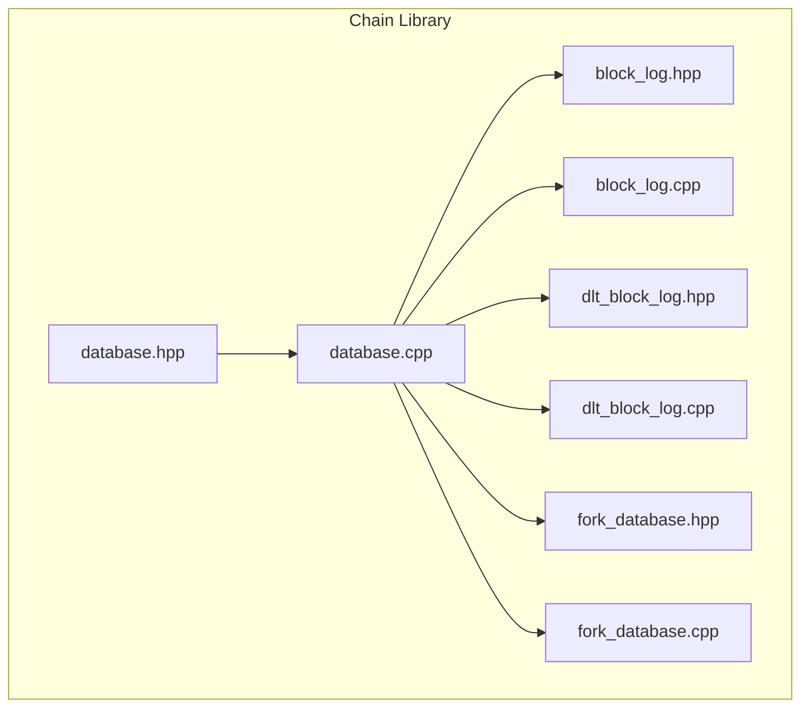
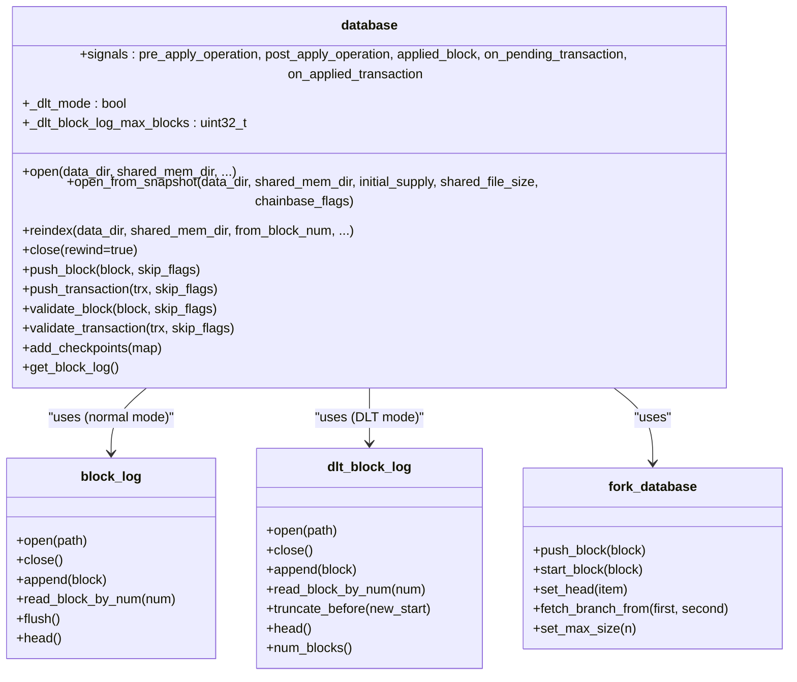
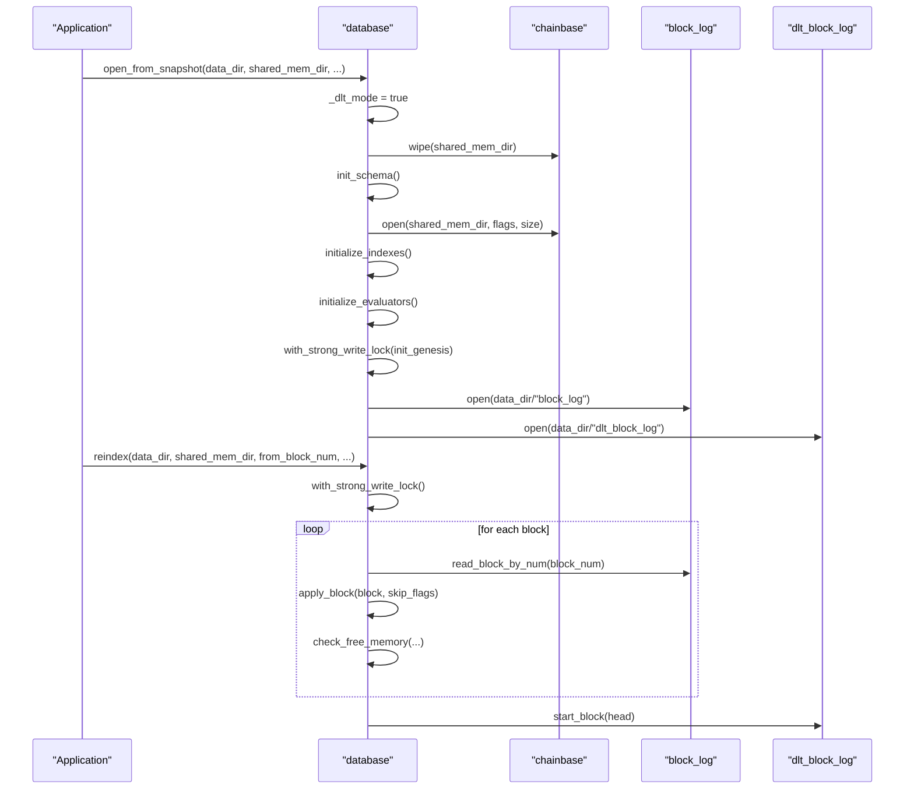
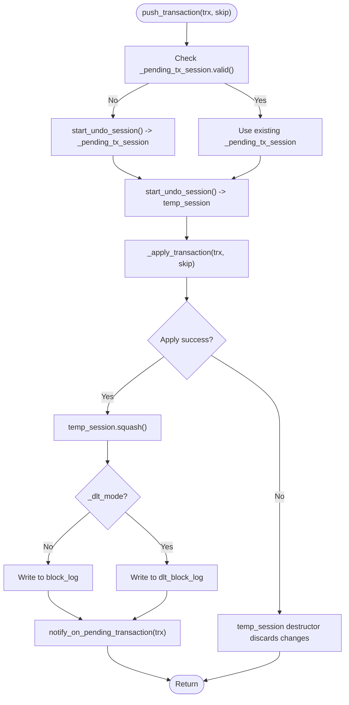
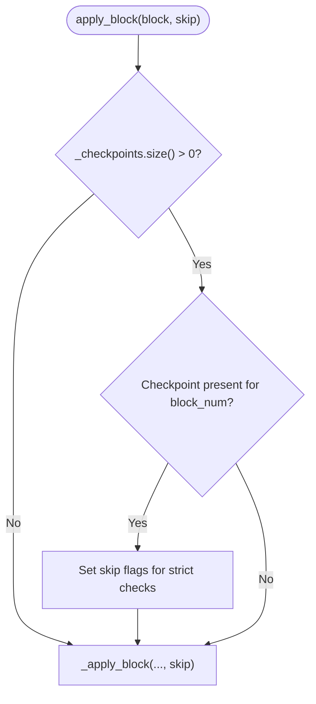
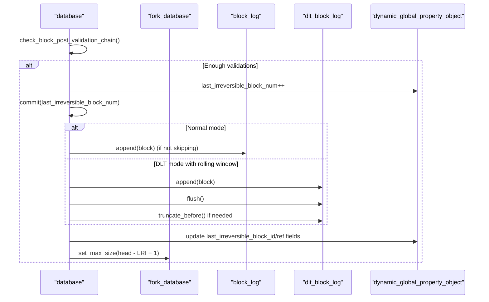
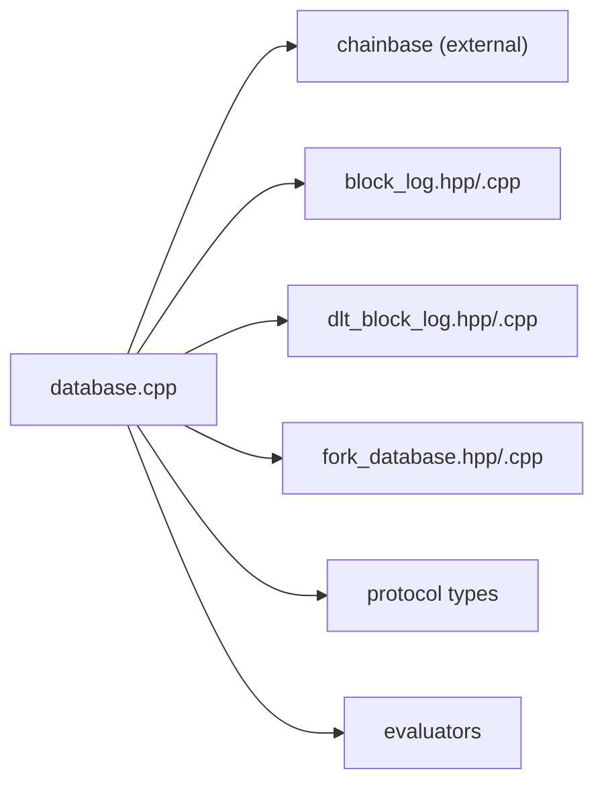

# Database Management

<cite>
**Referenced Files in This Document**
- [database.hpp](file://libraries/chain/include/graphene/chain/database.hpp)
- [database.cpp](file://libraries/chain/database.cpp)
- [block_log.hpp](file://libraries/chain/include/graphene/chain/block_log.hpp)
- [block_log.cpp](file://libraries/chain/block_log.cpp)
- [dlt_block_log.hpp](file://libraries/chain/include/graphene/chain/dlt_block_log.hpp)
- [dlt_block_log.cpp](file://libraries/chain/dlt_block_log.cpp)
- [fork_database.hpp](file://libraries/chain/include/graphene/chain/fork_database.hpp)
- [fork_database.cpp](file://libraries/chain/fork_database.cpp)
</cite>

## Update Summary
**Changes Made**
- Added comprehensive documentation for DLT (Data Ledger Technology) mode implementation
- Documented conditional block log operations and rolling DLT block log functionality
- Enhanced snapshot-aware initialization with DLT mode flag management
- Updated database lifecycle methods to include DLT mode detection and error handling
- Added detailed coverage of DLT block log integration and rolling window management

## Table of Contents
1. [Introduction](#introduction)
2. [Project Structure](#project-structure)
3. [Core Components](#core-components)
4. [Architecture Overview](#architecture-overview)
5. [Detailed Component Analysis](#detailed-component-analysis)
6. [Dependency Analysis](#dependency-analysis)
7. [Performance Considerations](#performance-considerations)
8. [Troubleshooting Guide](#troubleshooting-guide)
9. [Conclusion](#conclusion)

## Introduction
This document describes the Database Management system that serves as the core state persistence layer for the VIZ blockchain. It covers the database class lifecycle, initialization and cleanup, validation steps, session management, memory allocation strategies, shared memory configuration, checkpoints for fast synchronization, block log integration, observer pattern usage, DLT mode detection and conditional operations, and practical examples of database operations and performance optimization.

## Project Structure
The database subsystem is implemented primarily in the chain library with enhanced support for DLT mode:
- Core database interface and declarations: libraries/chain/include/graphene/chain/database.hpp
- Implementation of database operations: libraries/chain/database.cpp
- Block log abstraction: libraries/chain/include/graphene/chain/block_log.hpp and libraries/chain/block_log.cpp
- DLT block log for rolling window storage: libraries/chain/include/graphene/chain/dlt_block_log.hpp and libraries/chain/dlt_block_log.cpp
- Fork database for reversible blocks: libraries/chain/include/graphene/chain/fork_database.hpp and libraries/chain/fork_database.cpp

**Diagram sources**
- [database.hpp:1-602](file://libraries/chain/include/graphene/chain/database.hpp#L1-L602)
- [database.cpp:1-5497](file://libraries/chain/database.cpp#L1-L5497)
- [block_log.hpp:1-75](file://libraries/chain/include/graphene/chain/block_log.hpp#L1-L75)
- [block_log.cpp:1-302](file://libraries/chain/block_log.cpp#L1-L302)
- [dlt_block_log.hpp:1-76](file://libraries/chain/include/graphene/chain/dlt_block_log.hpp#L1-L76)
- [dlt_block_log.cpp:1-414](file://libraries/chain/dlt_block_log.cpp#L1-L414)
- [fork_database.hpp:1-125](file://libraries/chain/include/graphene/chain/fork_database.hpp#L1-L125)
- [fork_database.cpp:1-245](file://libraries/chain/fork_database.cpp#L1-L245)

**Section sources**
- [database.hpp:1-602](file://libraries/chain/include/graphene/chain/database.hpp#L1-L602)
- [database.cpp:1-5497](file://libraries/chain/database.cpp#L1-L5497)
- [block_log.hpp:1-75](file://libraries/chain/include/graphene/chain/block_log.hpp#L1-L75)
- [block_log.cpp:1-302](file://libraries/chain/block_log.cpp#L1-L302)
- [dlt_block_log.hpp:1-76](file://libraries/chain/include/graphene/chain/dlt_block_log.hpp#L1-L76)
- [dlt_block_log.cpp:1-414](file://libraries/chain/dlt_block_log.cpp#L1-L414)
- [fork_database.hpp:1-125](file://libraries/chain/include/graphene/chain/fork_database.hpp#L1-L125)
- [fork_database.cpp:1-245](file://libraries/chain/fork_database.cpp#L1-L245)

## Core Components
- database class: Public interface for blockchain state management, block and transaction processing, checkpoints, and event notifications with DLT mode support.
- block_log: Append-only block storage with random-access indexing.
- dlt_block_log: Rolling window block storage specifically designed for DLT (snapshot-based) nodes.
- fork_database: Maintains reversible blocks and supports fork selection and switching.
- chainbase integration: Provides persistent object storage and undo sessions.

Key responsibilities:
- Lifecycle: open(), open_from_snapshot(), reindex(), close(), wipe()
- Validation: validate_block(), validate_transaction(), with configurable skip flags
- Operations: push_block(), push_transaction(), generate_block()
- DLT Mode: Conditional block log operations, rolling window management, snapshot-aware initialization
- Observers: signals for pre/post operation, applied block, pending/applied transactions
- Persistence: integrates with block_log and dlt_block_log for different operational modes

**Section sources**
- [database.hpp:37-115](file://libraries/chain/include/graphene/chain/database.hpp#L37-L115)
- [database.cpp:281-324](file://libraries/chain/database.cpp#L281-L324)
- [block_log.hpp:38-75](file://libraries/chain/include/graphene/chain/block_log.hpp#L38-L75)
- [dlt_block_log.hpp:35-72](file://libraries/chain/include/graphene/chain/dlt_block_log.hpp#L35-L72)
- [fork_database.hpp:53-125](file://libraries/chain/include/graphene/chain/fork_database.hpp#L53-L125)

## Architecture Overview
The database composes four primary subsystems with enhanced DLT mode support:
- Chainbase: Persistent object database with undo/redo capabilities
- Fork database: Holds recent blocks for fork resolution
- Block log: Immutable, append-only block storage with index
- DLT block log: Rolling window block storage for DLT (snapshot-based) nodes

**Diagram sources**
- [database.hpp:37-115](file://libraries/chain/include/graphene/chain/database.hpp#L37-L115)
- [database.cpp:281-324](file://libraries/chain/database.cpp#L281-L324)
- [block_log.hpp:38-75](file://libraries/chain/include/graphene/chain/block_log.hpp#L38-L75)
- [dlt_block_log.hpp:35-72](file://libraries/chain/include/graphene/chain/dlt_block_log.hpp#L35-L72)
- [fork_database.hpp:53-125](file://libraries/chain/include/graphene/chain/fork_database.hpp#L53-L125)

## Detailed Component Analysis

### Database Lifecycle: Constructor, Destructor, and Methods
- Constructor and destructor: Initialize internal implementation and ensure pending transactions are cleared on destruction.
- open(): Initializes schema, opens shared memory, initializes indexes and evaluators, loads genesis if needed, opens both block_log and dlt_block_log, rewinds undo state, verifies chain consistency, and initializes hardfork state.
- open_from_snapshot(): **Enhanced** - Sets DLT mode flag to true, wipes shared memory for clean state, initializes schema and chainbase, opens both block_log and dlt_block_log, and logs snapshot import progress.
- reindex(): Reads blocks sequentially from the block log, applies them with aggressive skip flags to accelerate replay, periodically sets revision, checks free memory, and updates fork database head.
- close(): Clears pending transactions, flushes and closes chainbase, closes both block_log and dlt_block_log, resets fork database.
- wipe(): Closes database, wipes shared memory file, optionally removes both block_log and dlt_block_log.

**Diagram sources**
- [database.cpp:281-324](file://libraries/chain/database.cpp#L281-L324)

**Section sources**
- [database.hpp:37-115](file://libraries/chain/include/graphene/chain/database.hpp#L37-L115)
- [database.cpp:281-324](file://libraries/chain/database.cpp#L281-L324)
- [database.cpp:503-519](file://libraries/chain/database.cpp#L503-L519)

### DLT Mode Detection and Conditional Operations
**Enhanced** - The database now supports DLT (Data Ledger Technology) mode for snapshot-based nodes:

- DLT Mode Flag: `_dlt_mode = true` indicates the node is running in snapshot mode
- Conditional Block Log Operations: When `_dlt_mode` is true, normal block_log operations are skipped while dlt_block_log continues to operate
- Rolling Window Management: `_dlt_block_log_max_blocks` controls the size of the rolling window for DLT mode
- Snapshot-Aware Initialization: Automatic wipe and clean state preparation for snapshot imports

**Diagram sources**
- [database.cpp:3986-4039](file://libraries/chain/database.cpp#L3986-L4039)
- [database.cpp:4144-4175](file://libraries/chain/database.cpp#L4144-L4175)

**Section sources**
- [database.hpp:57-64](file://libraries/chain/include/graphene/chain/database.hpp#L57-L64)
- [database.cpp:292-292](file://libraries/chain/database.cpp#L292-L292)
- [database.cpp:3986-4039](file://libraries/chain/database.cpp#L3986-L4039)
- [database.cpp:4144-4175](file://libraries/chain/database.cpp#L4144-L4175)

### Validation Steps Enumeration and Use Cases
Validation flags control which checks are performed during block and transaction validation:
- skip_nothing: Perform all validations
- skip_witness_signature: Skip witness signature verification (used during reindex)
- skip_transaction_signatures: Skip transaction signatures (used by non-witness nodes)
- skip_transaction_dupe_check: Skip duplicate transaction checks
- skip_fork_db: Skip fork database checks
- skip_block_size_check: Allow oversized blocks when generating locally
- skip_tapos_check: Skip TaPoS and expiration checks
- skip_authority_check: Skip authority checks
- skip_merkle_check: Skip Merkle root verification
- skip_undo_history_check: Skip undo history bounds
- skip_witness_schedule_check: Skip witness schedule validation
- skip_validate_operations: Skip operation validation
- skip_undo_block: Skip undo db on reindex
- skip_block_log: Skip writing to block log (used in DLT mode)
- skip_apply_transaction: Skip applying transaction
- skip_database_locking: Skip database locking

Typical usage:
- Reindex uses a combination of flags to accelerate replay
- Block generation may skip certain checks for local blocks
- Validation-only nodes may skip expensive checks
- DLT mode uses skip_block_log to avoid normal block log operations

**Section sources**
- [database.hpp:66-83](file://libraries/chain/include/graphene/chain/database.hpp#L66-L83)
- [database.cpp:340-350](file://libraries/chain/database.cpp#L340-L350)
- [database.cpp:4346-4366](file://libraries/chain/database.cpp#L4346-L4366)

### Session Management and Undo Semantics
- Pending transaction session: A temporary undo session is created when pushing the first transaction after applying a block; successful transactions merge into the pending block session.
- Block application session: A strong write lock wraps block application; a temporary undo session is used per transaction; upon success, the session is pushed.
- Undo history: Enforced with bounds; last irreversible block advancement commits revisions and writes to appropriate block log based on DLT mode.

**Diagram sources**
- [database.cpp:948-970](file://libraries/chain/database.cpp#L948-L970)
- [database.cpp:3652-3711](file://libraries/chain/database.cpp#L3652-L3711)

**Section sources**
- [database.cpp:948-970](file://libraries/chain/database.cpp#L948-L970)
- [database.cpp:3652-3711](file://libraries/chain/database.cpp#L3652-L3711)

### Memory Allocation Strategies and Shared Memory Configuration
- Auto-resize: When free memory drops below a configured threshold, the system increases shared memory size and logs the change.
- Free memory monitoring: Periodic checks at configured block intervals log free memory and trigger resizing if needed.
- Reserved memory: Prevents fragmentation by reserving a portion of available memory.
- Configuration knobs: Minimum free memory threshold, increment size, and block interval for checks.

**Diagram sources**
- [database.cpp:456-469](file://libraries/chain/database.cpp#L456-L469)
- [database.cpp:428-454](file://libraries/chain/database.cpp#L428-L454)

**Section sources**
- [database.cpp:428-469](file://libraries/chain/database.cpp#L428-L469)
- [database.cpp:412-422](file://libraries/chain/database.cpp#L412-L422)

### Checkpoint System for Fast Synchronization
- Checkpoints: A map of block number to expected block ID is maintained; when a checkpoint matches, the system skips expensive validations and authority checks for subsequent blocks until the last checkpoint.
- before_last_checkpoint(): Determines whether the current head is before the last checkpoint to decide whether to enforce stricter checks.

**Diagram sources**
- [database.cpp:3444-3499](file://libraries/chain/database.cpp#L3444-L3499)

**Section sources**
- [database.hpp:218-224](file://libraries/chain/include/graphene/chain/database.hpp#L218-L224)
- [database.cpp:3444-3499](file://libraries/chain/database.cpp#L3444-L3499)

### Block Log Integration and Last Irreversible Block Advancement
- Block log: Append-only storage with a secondary index enabling O(1) random access by block number.
- DLT Block Log: Rolling window storage for DLT mode nodes, maintaining a configurable number of recent blocks.
- IRV advancement: When sufficient witness validations are collected, the system advances last irreversible block, commits the revision, writes blocks to appropriate log based on DLT mode, and updates dynamic global properties with reference fields.

**Diagram sources**
- [database.cpp:3986-4039](file://libraries/chain/database.cpp#L3986-L4039)
- [database.cpp:4144-4175](file://libraries/chain/database.cpp#L4144-L4175)
- [database.cpp:4346-4366](file://libraries/chain/database.cpp#L4346-L4366)

**Section sources**
- [block_log.hpp:38-75](file://libraries/chain/include/graphene/chain/block_log.hpp#L38-L75)
- [dlt_block_log.hpp:35-72](file://libraries/chain/include/graphene/chain/dlt_block_log.hpp#L35-L72)
- [database.cpp:3986-4039](file://libraries/chain/database.cpp#L3986-L4039)
- [database.cpp:4144-4175](file://libraries/chain/database.cpp#L4144-L4175)
- [database.cpp:4346-4366](file://libraries/chain/database.cpp#L4346-L4366)

### Observer Pattern Implementation
The database exposes signals for event-driven state changes:
- pre_apply_operation: Emitted before applying an operation
- post_apply_operation: Emitted after applying an operation
- applied_block: Emitted after a block is applied and committed
- on_pending_transaction: Emitted when a transaction is added to the pending state
- on_applied_transaction: Emitted when a transaction is applied to the chain

These signals are used by plugins to react to blockchain events without tight coupling.

**Section sources**
- [database.hpp:284-307](file://libraries/chain/include/graphene/chain/database.hpp#L284-L307)
- [database.cpp:1158-1198](file://libraries/chain/database.cpp#L1158-L1198)
- [database.cpp:3652-3655](file://libraries/chain/database.cpp#L3652-L3655)

### Examples of Database Operations and Queries
- Open database and initialize: open(data_dir, shared_mem_dir, initial_supply, shared_file_size, chainbase_flags)
- **Open from snapshot**: open_from_snapshot(data_dir, shared_mem_dir, initial_supply, shared_file_size, chainbase_flags) - **Enhanced**
- Rebuild state from history: reindex(data_dir, shared_mem_dir, from_block_num, shared_file_size)
- Push a block: push_block(signed_block, skip_flags)
- Push a transaction: push_transaction(signed_transaction, skip_flags)
- Validate a block: validate_block(signed_block, skip_flags)
- Validate a transaction: validate_transaction(signed_signed_transaction, skip_flags)
- Query helpers:
  - get_block_id_for_num(uint32_t)
  - fetch_block_by_id(block_id_type)
  - fetch_block_by_number(uint32_t)
  - get_account(name), get_witness(name)
  - get_dynamic_global_properties(), get_witness_schedule_object()

Note: The above APIs are declared in the header and implemented in the cpp file.

**Section sources**
- [database.hpp:93-141](file://libraries/chain/include/graphene/chain/database.hpp#L93-L141)
- [database.cpp:458-584](file://libraries/chain/database.cpp#L458-L584)

## Dependency Analysis
The database depends on:
- chainbase for persistent storage and undo sessions
- block_log for immutable block storage and random access
- dlt_block_log for rolling window storage in DLT mode
- fork_database for reversible blocks and fork resolution
- Protocol types and evaluators for operation processing

**Diagram sources**
- [database.hpp:1-10](file://libraries/chain/include/graphene/chain/database.hpp#L1-L10)
- [database.cpp:1-30](file://libraries/chain/database.cpp#L1-L30)

**Section sources**
- [database.hpp:1-10](file://libraries/chain/include/graphene/chain/database.hpp#L1-L10)
- [database.cpp:1-30](file://libraries/chain/database.cpp#L1-L30)

## Performance Considerations
- Use skip flags during reindex to bypass expensive validations and improve replay speed.
- Configure shared memory sizing and thresholds to avoid frequent resizing and fragmentation.
- Monitor free memory and adjust increments to keep latency predictable.
- Use checkpoints to reduce validation overhead for recent blocks.
- Tune flush intervals to balance durability and throughput.
- **DLT Mode Optimization**: Use rolling window DLT block log to reduce storage requirements for snapshot-based nodes.
- **Conditional Operations**: Leverage DLT mode to skip unnecessary block log operations while maintaining required functionality.

## Troubleshooting Guide
Common issues and remedies:
- Memory exhaustion during block production or reindex: Increase shared file size and tune minimum free memory threshold.
- Chain mismatch between block log and database: Run reindex to rebuild state from block log.
- Excessive undo history: Ensure last irreversible block advances to prune history.
- Signal-related errors: Verify signal handlers and ensure proper exception propagation.
- **DLT Mode Issues**: Ensure proper DLT mode flag management and verify rolling window configuration.
- **Snapshot Import Problems**: Check that shared memory is wiped before snapshot import and verify DLT mode initialization.

**Section sources**
- [database.cpp:800-830](file://libraries/chain/database.cpp#L800-L830)
- [database.cpp:270-279](file://libraries/chain/database.cpp#L270-L279)
- [database.cpp:492-501](file://libraries/chain/database.cpp#L492-L501)
- [database.cpp:4016-4020](file://libraries/chain/database.cpp#L4016-L4020)

## Conclusion
The Database Management system provides a robust, event-driven, and efficient state persistence layer for the VIZ blockchain with enhanced DLT mode support. It integrates chainbase for persistent storage, fork_database for reversible blocks, block_log for immutable history, and dlt_block_log for rolling window storage in DLT mode. Through configurable validation flags, checkpointing, memory management, and DLT mode detection, it supports fast synchronization, reliable block processing, conditional block log operations, and extensibility via observer signals. The snapshot-aware initialization and rolling window management make it particularly suitable for distributed ledger applications requiring efficient synchronization and reduced storage overhead.