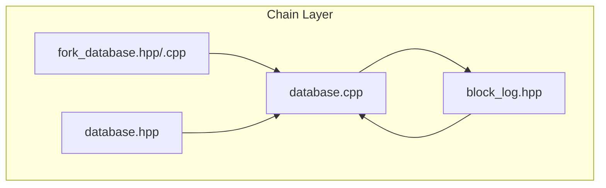
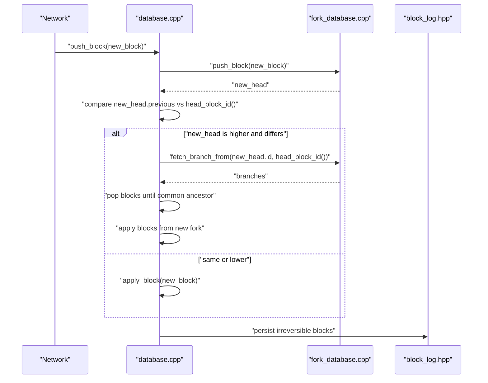
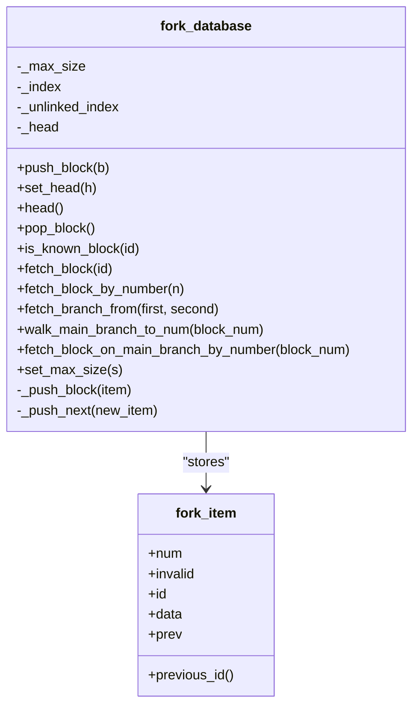
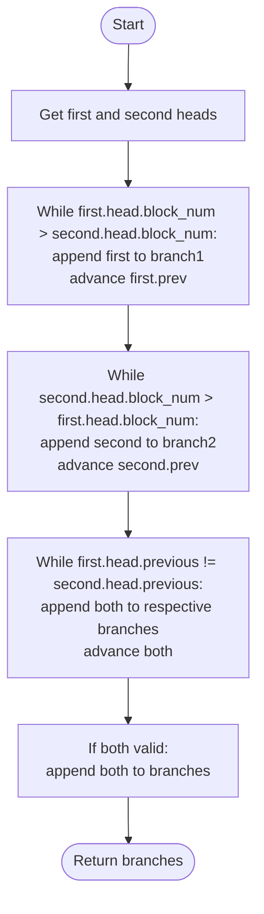
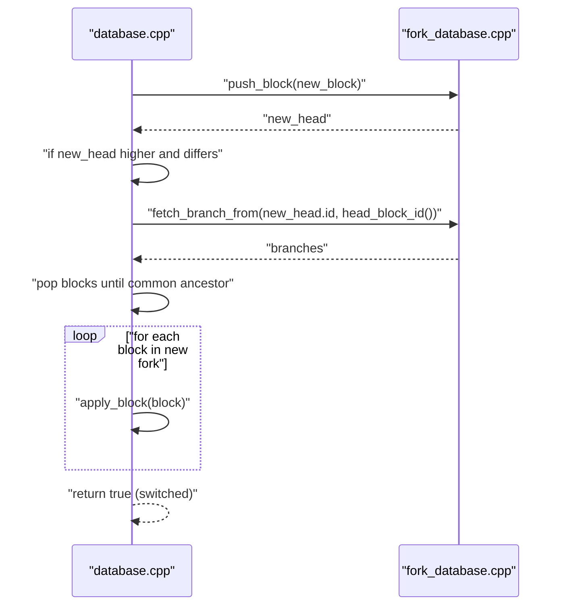
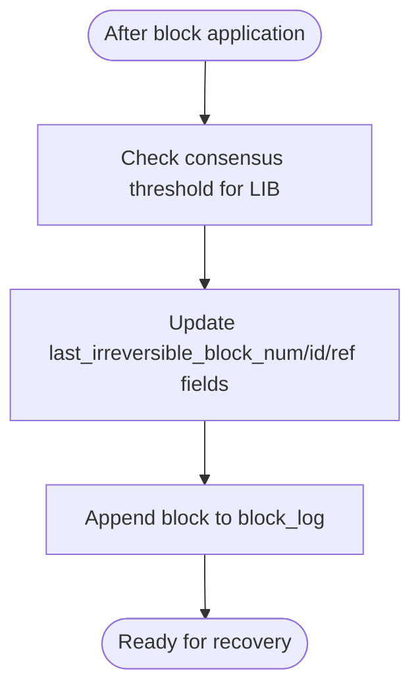
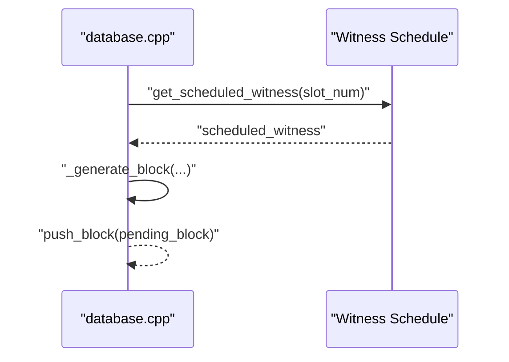
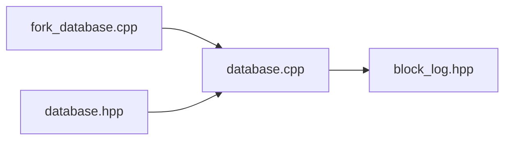

# Fork Resolution and Consensus

<cite>
**Referenced Files in This Document**
- [fork_database.hpp](file://libraries/chain/include/graphene/chain/fork_database.hpp)
- [fork_database.cpp](file://libraries/chain/fork_database.cpp)
- [database.hpp](file://libraries/chain/include/graphene/chain/database.hpp)
- [database.cpp](file://libraries/chain/database.cpp)
- [block_log.hpp](file://libraries/chain/include/graphene/chain/block_log.hpp)
</cite>

## Table of Contents
1. [Introduction](#introduction)
2. [Project Structure](#project-structure)
3. [Core Components](#core-components)
4. [Architecture Overview](#architecture-overview)
5. [Detailed Component Analysis](#detailed-component-analysis)
6. [Dependency Analysis](#dependency-analysis)
7. [Performance Considerations](#performance-considerations)
8. [Troubleshooting Guide](#troubleshooting-guide)
9. [Conclusion](#conclusion)
10. [Appendices](#appendices)

## Introduction
This document explains the Fork Resolution and Consensus system that maintains blockchain integrity and handles network partitions. It focuses on the fork_database implementation for managing fork chains, selecting the best chain, and determining irreversible blocks. It also covers witness scheduling integration, chain reorganization, persistence via the block log, and APIs for fork detection and recovery.

## Project Structure
The fork resolution and consensus logic spans several core files:
- fork_database.hpp/cpp: In-memory fork chain storage, branch selection, and common ancestor detection
- database.hpp/cpp: Blockchain database integration, block pushing, chain reorganization, and irreversible block updates
- block_log.hpp: Append-only persistence of blocks for recovery and irreversible state

**Diagram sources**
- [fork_database.hpp](file://libraries/chain/include/graphene/chain/fork_database.hpp#L53-L122)
- [fork_database.cpp](file://libraries/chain/fork_database.cpp#L1-L245)
- [database.hpp](file://libraries/chain/include/graphene/chain/database.hpp#L36-L561)
- [database.cpp](file://libraries/chain/database.cpp#L800-L925)
- [block_log.hpp](file://libraries/chain/include/graphene/chain/block_log.hpp#L38-L71)

**Section sources**
- [fork_database.hpp](file://libraries/chain/include/graphene/chain/fork_database.hpp#L1-L125)
- [fork_database.cpp](file://libraries/chain/fork_database.cpp#L1-L245)
- [database.hpp](file://libraries/chain/include/graphene/chain/database.hpp#L1-L561)
- [database.cpp](file://libraries/chain/database.cpp#L1-L800)
- [block_log.hpp](file://libraries/chain/include/graphene/chain/block_log.hpp#L1-L75)

## Core Components
- fork_database: Maintains a multi-indexed collection of fork items, supports push, branch traversal, and common ancestor detection. It enforces a maximum fork depth and tracks the current head.
- database: Integrates fork resolution into block application, performs chain reorganization when a better fork emerges, and updates last irreversible block (LIB).
- block_log: Provides persistent storage for blocks, enabling recovery and serving as the source of irreversible blocks.

Key responsibilities:
- Track reversible blocks in memory (fork DB)
- Detect and select the best chain by comparing heads
- Reorganize the chain when a higher fork becomes active
- Persist irreversible blocks to the block log
- Provide APIs to query fork branches and block IDs

**Section sources**
- [fork_database.hpp](file://libraries/chain/include/graphene/chain/fork_database.hpp#L53-L122)
- [fork_database.cpp](file://libraries/chain/fork_database.cpp#L33-L90)
- [database.cpp](file://libraries/chain/database.cpp#L847-L925)
- [block_log.hpp](file://libraries/chain/include/graphene/chain/block_log.hpp#L38-L71)

## Architecture Overview
The fork resolution pipeline integrates with block application and persistence:

**Diagram sources**
- [database.cpp](file://libraries/chain/database.cpp#L800-L925)
- [fork_database.cpp](file://libraries/chain/fork_database.cpp#L33-L90)
- [block_log.hpp](file://libraries/chain/include/graphene/chain/block_log.hpp#L50-L67)

## Detailed Component Analysis

### fork_database: Fork Chain Management
The fork database stores blocks in a multi-index container supporting:
- Hashed index by block ID
- Hashed index by previous block ID
- Ordered index by block number

It supports:
- Pushing a block and linking it to the previous block
- Tracking the current head
- Fetching branches from two heads to a common ancestor
- Walking the main branch to a given block number
- Removing blocks and limiting fork depth

**Diagram sources**
- [fork_database.hpp](file://libraries/chain/include/graphene/chain/fork_database.hpp#L20-L122)
- [fork_database.cpp](file://libraries/chain/fork_database.cpp#L33-L242)

Implementation highlights:
- Linking validation ensures each new block’s previous ID exists in the index and is not marked invalid.
- Unlinked blocks are cached and later inserted when their parent appears.
- Maximum fork depth prevents unbounded growth; older blocks are pruned.

**Section sources**
- [fork_database.hpp](file://libraries/chain/include/graphene/chain/fork_database.hpp#L53-L122)
- [fork_database.cpp](file://libraries/chain/fork_database.cpp#L33-L124)

### Branch Selection and Common Ancestor Detection
Branch selection relies on walking both branches backward until a common ancestor is found. The method returns two vectors representing the branches from each head to the common ancestor.

**Diagram sources**
- [fork_database.cpp](file://libraries/chain/fork_database.cpp#L168-L210)

**Section sources**
- [fork_database.cpp](file://libraries/chain/fork_database.cpp#L168-L210)

### Chain Reorganization Process
When a new head is higher and does not build off the current head, the database:
- Computes branches to the common ancestor
- Pops blocks until reaching the common ancestor
- Applies blocks from the new fork in reverse order
- Handles exceptions by invalidating the problematic fork and restoring the good fork

**Diagram sources**
- [database.cpp](file://libraries/chain/database.cpp#L847-L925)
- [fork_database.cpp](file://libraries/chain/fork_database.cpp#L168-L210)

**Section sources**
- [database.cpp](file://libraries/chain/database.cpp#L847-L925)

### Irreversible Block Determination and Persistence
Irreversible blocks are determined by consensus thresholds and persisted to the block log. The database updates last irreversible block (LIB) and writes blocks to the log when they become irreversible.

**Diagram sources**
- [database.cpp](file://libraries/chain/database.cpp#L3889-L3940)
- [block_log.hpp](file://libraries/chain/include/graphene/chain/block_log.hpp#L50-L67)

**Section sources**
- [database.cpp](file://libraries/chain/database.cpp#L3889-L3940)
- [block_log.hpp](file://libraries/chain/include/graphene/chain/block_log.hpp#L38-L71)

### Witness Scheduling Integration and Block Production
Witness scheduling influences block production timing and eligibility. The database coordinates:
- Scheduled witness calculation for the block slot
- Validation of witness signature and version extensions
- Generation of new blocks with correct metadata and signatures

**Diagram sources**
- [database.cpp](file://libraries/chain/database.cpp#L987-L1120)
- [database.cpp](file://libraries/chain/database.cpp#L1200-L1240)

**Section sources**
- [database.cpp](file://libraries/chain/database.cpp#L987-L1120)
- [database.cpp](file://libraries/chain/database.cpp#L1200-L1240)

### API Methods for Fork Detection, Chain Validation, and Recovery
- Fork detection and branch retrieval:
  - get_block_ids_on_fork(head_of_fork): Returns ordered list of block IDs from the fork head back to the common ancestor
  - fetch_branch_from(first, second): Returns two branches leading to a common ancestor
- Chain validation:
  - validate_block(new_block, skip): Validates block Merkle root and size
- State recovery:
  - open(): Initializes database and starts fork DB at head block
  - reindex(): Replays blocks and restarts fork DB at the new head
  - find_block_id_for_num(block_num)/get_block_id_for_num(block_num): Resolves block ID across block log, fork DB, and TAPOS buffer

**Section sources**
- [database.hpp](file://libraries/chain/include/graphene/chain/database.hpp#L111-L135)
- [database.cpp](file://libraries/chain/database.cpp#L561-L580)
- [database.cpp](file://libraries/chain/database.cpp#L738-L792)
- [database.cpp](file://libraries/chain/database.cpp#L206-L230)
- [database.cpp](file://libraries/chain/database.cpp#L476-L515)

### Examples of Fork Scenarios and Resolution Processes
- Scenario A: Out-of-order arrival of blocks
  - Behavior: New blocks are inserted into the unlinked cache and later inserted when their parent appears
  - Mechanism: _push_next iteratively inserts pending blocks whose parent now exists
- Scenario B: Network partition resolves with a longer chain
  - Behavior: The database detects a higher head, computes branches, pops blocks, and applies the new fork
  - Mechanism: fetch_branch_from and reorganization logic
- Scenario C: Invalid block on a fork
  - Behavior: The fork is invalidated and removed; the database restores the good fork and throws the exception
  - Mechanism: remove and set_head in error handling path

**Section sources**
- [fork_database.cpp](file://libraries/chain/fork_database.cpp#L79-L90)
- [database.cpp](file://libraries/chain/database.cpp#L860-L904)

## Dependency Analysis
The fork resolution system depends on:
- fork_database for in-memory fork chain management
- database for integrating fork resolution into block application and updating LIB
- block_log for persistence of irreversible blocks

**Diagram sources**
- [fork_database.cpp](file://libraries/chain/fork_database.cpp#L1-L245)
- [database.cpp](file://libraries/chain/database.cpp#L1-L800)
- [block_log.hpp](file://libraries/chain/include/graphene/chain/block_log.hpp#L1-L75)

**Section sources**
- [fork_database.cpp](file://libraries/chain/fork_database.cpp#L1-L245)
- [database.cpp](file://libraries/chain/database.cpp#L1-L800)
- [block_log.hpp](file://libraries/chain/include/graphene/chain/block_log.hpp#L1-L75)

## Performance Considerations
- Maximum fork depth: The fork database limits the maximum number of blocks that may be skipped in an out-of-order push, preventing excessive memory usage.
- Multi-index containers: Efficient lookups by block ID and previous ID minimize traversal costs.
- Pruning: set_max_size prunes old blocks from both linked and unlinked indices to keep memory bounded.
- Reorganization cost: Reorganizing across deep forks requires popping and re-applying blocks; keeping forks shallow improves responsiveness.
- Persistence overhead: Writing to the block log is required for irreversible blocks; batching and flushing strategies can mitigate latency.

[No sources needed since this section provides general guidance]

## Troubleshooting Guide
Common issues and remedies:
- Unlinkable block errors: Occur when a block does not link to a known chain; the fork DB logs and caches the block for later insertion when its parent arrives.
- Invalid fork handling: When reorganization fails, the database removes the problematic fork, restores the good fork, and rethrows the exception.
- Memory pressure: Adjust shared memory sizing and monitor free memory; the database resizes shared memory when necessary.
- Recovery mismatches: During open/reindex, the database asserts chain state consistency with the block log and resets the fork DB accordingly.

**Section sources**
- [fork_database.cpp](file://libraries/chain/fork_database.cpp#L33-L44)
- [database.cpp](file://libraries/chain/database.cpp#L876-L904)
- [database.cpp](file://libraries/chain/database.cpp#L397-L430)
- [database.cpp](file://libraries/chain/database.cpp#L206-L268)

## Conclusion
The fork resolution and consensus system combines an efficient in-memory fork database with robust chain reorganization and irreversible block persistence. It integrates tightly with witness scheduling to ensure timely and valid block production. The APIs enable reliable fork detection, chain validation, and recovery, while performance controls keep resource usage manageable.

[No sources needed since this section summarizes without analyzing specific files]

## Appendices

### Appendix A: Key Data Structures and Complexity
- fork_item: Stores block data, previous link, and invalid flag
- fork_database:
  - push_block: O(log N) average for insertions; unlinked insertion triggers iterative _push_next
  - fetch_branch_from: O(depth) to traverse both branches to common ancestor
  - walk_main_branch_to_num: O(depth) to reach a specific block number
  - set_max_size: O(N log N) worst-case pruning across indices

**Section sources**
- [fork_database.hpp](file://libraries/chain/include/graphene/chain/fork_database.hpp#L20-L122)
- [fork_database.cpp](file://libraries/chain/fork_database.cpp#L47-L124)