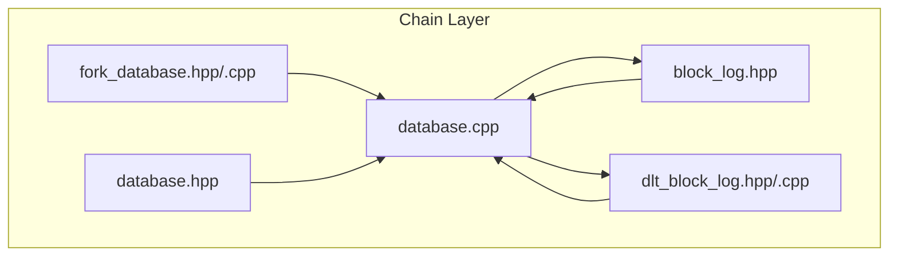
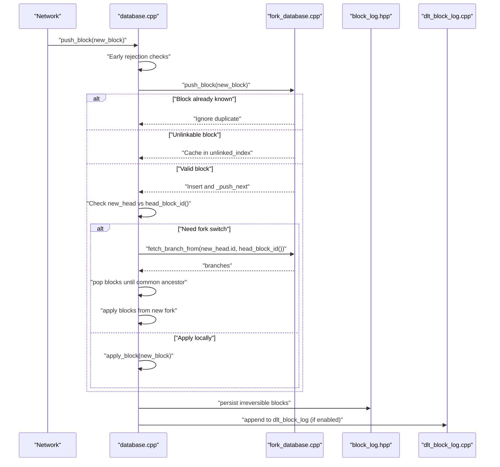
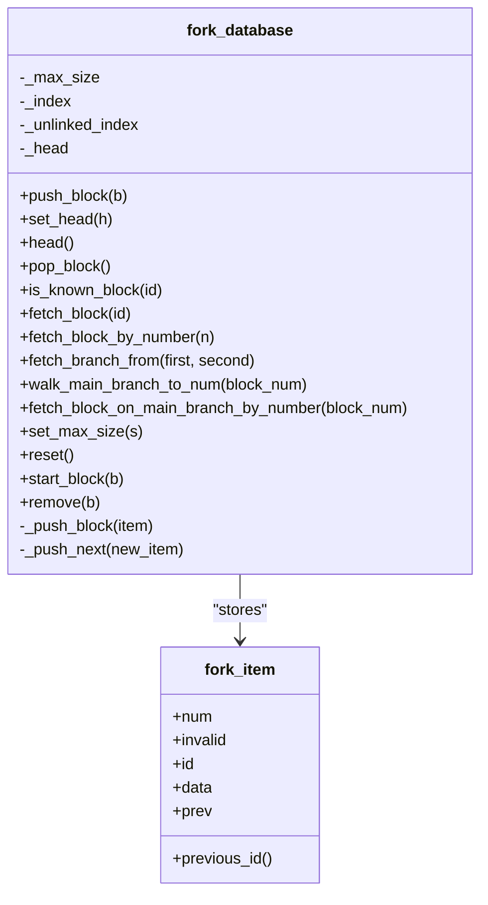
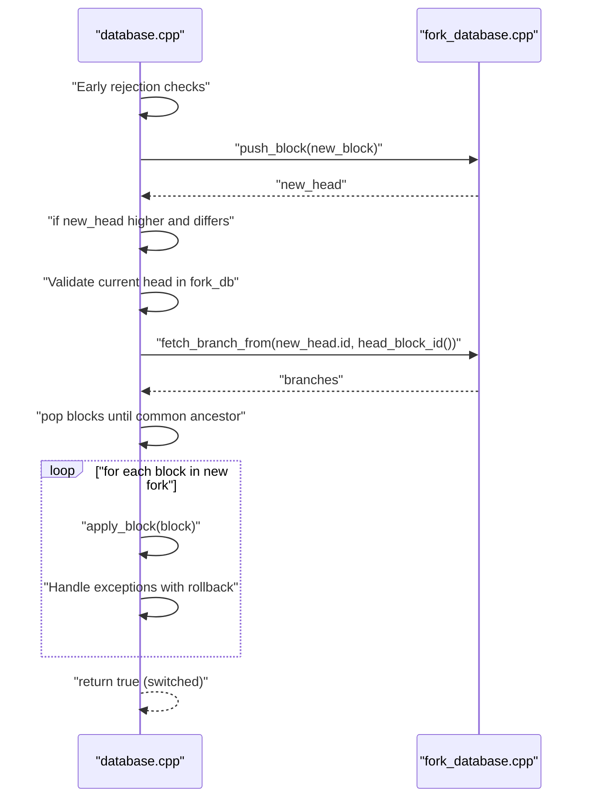
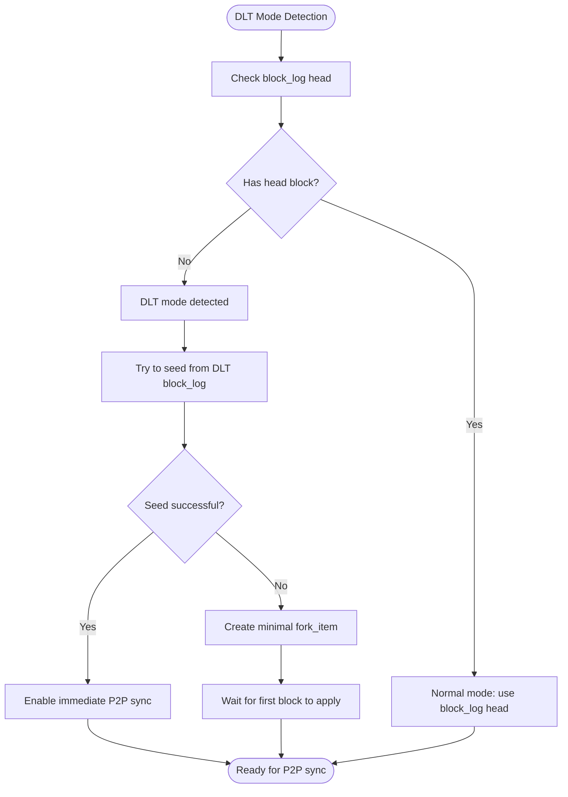
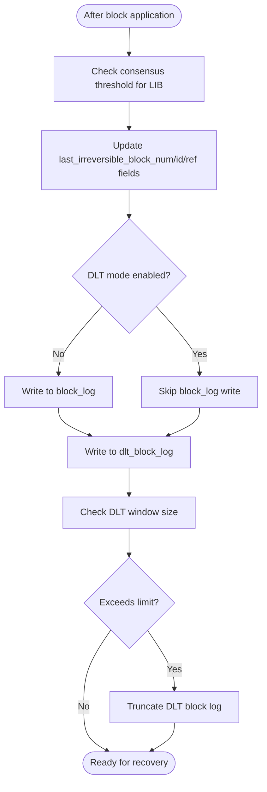
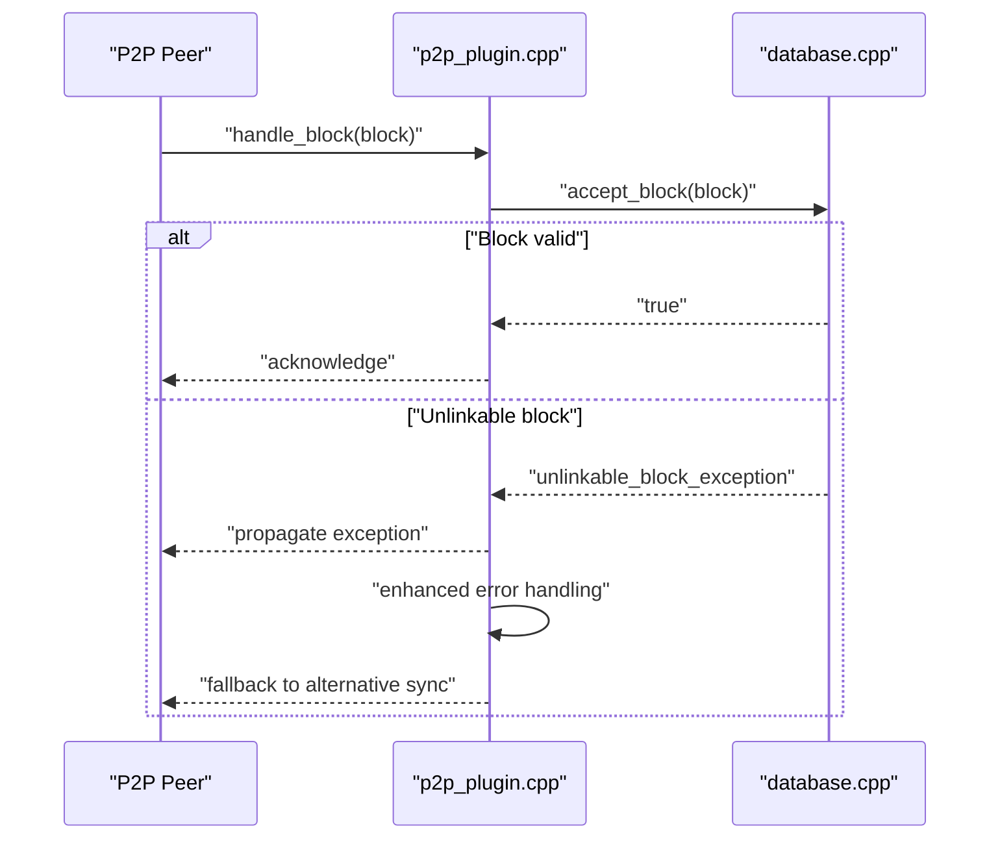
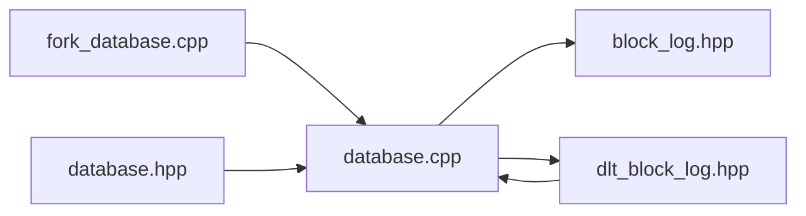

# Fork Resolution and Consensus

<cite>
**Referenced Files in This Document**
- [fork_database.hpp](file://libraries/chain/include/graphene/chain/fork_database.hpp)
- [fork_database.cpp](file://libraries/chain/fork_database.cpp)
- [database.hpp](file://libraries/chain/include/graphene/chain/database.hpp)
- [database.cpp](file://libraries/chain/database.cpp)
- [block_log.hpp](file://libraries/chain/include/graphene/chain/block_log.hpp)
- [dlt_block_log.hpp](file://libraries/chain/include/graphene/chain/dlt_block_log.hpp)
- [dlt_block_log.cpp](file://libraries/chain/dlt_block_log.cpp)
- [p2p_plugin.cpp](file://plugins/p2p/p2p_plugin.cpp)
</cite>

## Update Summary
**Changes Made**
- Enhanced fork database system with DLT mode integration for snapshot-based nodes
- Automatic seeding of fork database on fresh snapshot import to enable immediate P2P synchronization
- Improved fork resolution capabilities with enhanced duplicate detection and caching mechanisms
- Strengthened P2P fallback mechanisms for better network partition handling
- Added comprehensive DLT block log management for serving recent irreversible blocks to peers

## Table of Contents
1. [Introduction](#introduction)
2. [Project Structure](#project-structure)
3. [Core Components](#core-components)
4. [Architecture Overview](#architecture-overview)
5. [Detailed Component Analysis](#detailed-component-analysis)
6. [Dependency Analysis](#dependency-analysis)
7. [Performance Considerations](#performance-considerations)
8. [Troubleshooting Guide](#troubleshooting-guide)
9. [Conclusion](#conclusion)
10. [Appendices](#appendices)

## Introduction
This document explains the Fork Resolution and Consensus system that maintains blockchain integrity and handles network partitions. The system has been significantly enhanced with DLT (Data Ledger Technology) mode integration, automatic seeding on fresh snapshot import, improved fork resolution capabilities, and strengthened P2P fallback mechanisms. The fork_database implementation now supports snapshot-based nodes that can synchronize immediately without waiting for the block log to catch up.

## Project Structure
The fork resolution and consensus logic spans several core files with enhanced DLT support:
- fork_database.hpp/cpp: In-memory fork chain storage, branch selection, and common ancestor detection with enhanced caching mechanisms
- database.hpp/cpp: Blockchain database integration, block pushing, chain reorganization, and DLT mode management with automatic seeding
- block_log.hpp: Append-only persistence of blocks for recovery and irreversible state
- dlt_block_log.hpp/cpp: Separate rolling block log for DLT nodes to serve recent irreversible blocks to P2P peers

**Diagram sources**
- [fork_database.hpp:53-122](file://libraries/chain/include/graphene/chain/fork_database.hpp#L53-L122)
- [fork_database.cpp:1-258](file://libraries/chain/fork_database.cpp#L1-L258)
- [database.hpp:57-78](file://libraries/chain/include/graphene/chain/database.hpp#L57-L78)
- [database.cpp:250-294](file://libraries/chain/database.cpp#L250-L294)
- [dlt_block_log.hpp:35-72](file://libraries/chain/include/graphene/chain/dlt_block_log.hpp#L35-L72)

**Section sources**
- [fork_database.hpp:1-125](file://libraries/chain/include/graphene/chain/fork_database.hpp#L1-L125)
- [fork_database.cpp:1-258](file://libraries/chain/fork_database.cpp#L1-L258)
- [database.hpp:1-200](file://libraries/chain/include/graphene/chain/database.hpp#L1-L200)
- [database.cpp:1-800](file://libraries/chain/database.cpp#L1-L800)
- [dlt_block_log.hpp:1-76](file://libraries/chain/include/graphene/chain/dlt_block_log.hpp#L1-L76)
- [dlt_block_log.cpp:1-454](file://libraries/chain/dlt_block_log.cpp#L1-L454)

## Core Components
- fork_database: Maintains a multi-indexed collection of fork items with enhanced out-of-order block caching, supports push, branch traversal, and common ancestor detection. It enforces a maximum fork depth and tracks the current head with improved duplicate detection.
- database: Integrates fork resolution into block application with sophisticated early rejection logic, performs chain reorganization when a better fork emerges, and manages DLT mode for snapshot-based nodes with automatic seeding capabilities.
- block_log: Provides persistent storage for blocks, enabling recovery and serving as the source of irreversible blocks.
- dlt_block_log: Separate rolling block log for DLT nodes that maintains a sliding window of recent irreversible blocks for P2P synchronization.

Key responsibilities:
- Track reversible blocks in memory (fork DB) with enhanced caching for out-of-order blocks
- Detect and select the best chain by comparing heads with improved validation
- Reorganize the chain when a higher fork becomes active with better error recovery
- Manage DLT mode for snapshot-based nodes with automatic fork database seeding
- Persist irreversible blocks to both block_log and dlt_block_log with enhanced reliability
- Provide APIs to query fork branches and block IDs with improved duplicate handling
- Serve recent blocks to P2P peers through dlt_block_log for faster synchronization

**Section sources**
- [fork_database.hpp:53-122](file://libraries/chain/include/graphene/chain/fork_database.hpp#L53-L122)
- [fork_database.cpp:33-90](file://libraries/chain/fork_database.cpp#L33-L90)
- [database.cpp:250-294](file://libraries/chain/database.cpp#L250-L294)
- [dlt_block_log.hpp:13-33](file://libraries/chain/include/graphene/chain/dlt_block_log.hpp#L13-L33)

## Architecture Overview
The fork resolution pipeline integrates with block application and persistence with enhanced early rejection, DLT mode support, and automatic seeding mechanisms:

**Diagram sources**
- [database.cpp:1037-1177](file://libraries/chain/database.cpp#L1037-L1177)
- [fork_database.cpp:34-84](file://libraries/chain/fork_database.cpp#L34-L84)
- [dlt_block_log.cpp:336-340](file://libraries/chain/dlt_block_log.cpp#L336-L340)

## Detailed Component Analysis

### fork_database: Enhanced Fork Chain Management
The fork database stores blocks in a multi-index container supporting:
- Hashed index by block ID
- Hashed index by previous block ID
- Ordered index by block number

**Updated** Enhanced with improved out-of-order block caching, duplicate detection, and automatic seeding capabilities for DLT mode.

It supports:
- Pushing a block and linking it to the previous block with duplicate prevention
- Tracking the current head with enhanced validation
- Fetching branches from two heads to a common ancestor
- Walking the main branch to a given block number
- Removing blocks and limiting fork depth
- **New**: Iterative processing of cached unlinked blocks via `_push_next`
- **New**: Duplicate detection to prevent redundant processing during snapshot imports

**Diagram sources**
- [fork_database.hpp:20-122](file://libraries/chain/include/graphene/chain/fork_database.hpp#L20-L122)
- [fork_database.cpp:33-258](file://libraries/chain/fork_database.cpp#L33-L258)

Implementation highlights:
- **Enhanced duplicate detection**: Blocks are checked against existing IDs before insertion to prevent duplicate processing
- **Improved linking validation**: Ensures each new block's previous ID exists in the index and is not marked invalid
- **Robust unlinked block caching**: Cached blocks are processed iteratively when their parent appears via `_push_next`
- **Maximum fork depth enforcement**: Prevents unbounded growth; older blocks are pruned with enhanced cleanup
- **Better error handling**: Comprehensive exception handling for unlinkable blocks with logging
- **Automatic seeding support**: Works seamlessly with DLT mode to enable immediate P2P synchronization

**Section sources**
- [fork_database.hpp:53-122](file://libraries/chain/include/graphene/chain/fork_database.hpp#L53-L122)
- [fork_database.cpp:48-103](file://libraries/chain/fork_database.cpp#L48-L103)

### Enhanced Duplicate Block Detection and Prevention
**New Section** The fork database now includes comprehensive duplicate block detection to prevent redundant processing and improve P2P synchronization reliability.

Duplicate detection mechanisms:
- Pre-insertion ID check against existing blocks in the index
- Prevention of duplicate processing during snapshot imports and P2P re-transmissions
- Efficient early rejection of already-applied blocks

**Diagram sources**
- [fork_database.cpp:48-84](file://libraries/chain/fork_database.cpp#L48-L84)

**Section sources**
- [fork_database.cpp:48-55](file://libraries/chain/fork_database.cpp#L48-L55)

### Branch Selection and Common Ancestor Detection
Branch selection relies on walking both branches backward until a common ancestor is found. The method returns two vectors representing the branches from each head to the common ancestor.

**Diagram sources**
- [fork_database.cpp:181-223](file://libraries/chain/fork_database.cpp#L181-L223)

**Section sources**
- [fork_database.cpp:181-223](file://libraries/chain/fork_database.cpp#L181-L223)

### Enhanced Chain Reorganization Process
**Updated** The chain reorganization process now includes improved early rejection logic, better error handling, and DLT mode awareness for enhanced P2P synchronization reliability.

When a new head is higher and does not build off the current head, the database:
- Performs sophisticated early rejection checks to prevent unnecessary fork switches
- Computes branches to the common ancestor with enhanced validation
- Pops blocks until reaching the common ancestor with improved error recovery
- Applies blocks from the new fork in reverse order with comprehensive exception handling
- Handles exceptions by invalidating the problematic fork and restoring the good fork with enhanced logging
- **New**: Works seamlessly with DLT mode to maintain fork database consistency

**Diagram sources**
- [database.cpp:1037-1177](file://libraries/chain/database.cpp#L1037-L1177)
- [fork_database.cpp:181-223](file://libraries/chain/fork_database.cpp#L181-L223)

**Section sources**
- [database.cpp:1037-1177](file://libraries/chain/database.cpp#L1037-L1177)

### DLT Mode Integration and Automatic Seeding
**New Section** The database now supports DLT (Data Ledger Technology) mode for snapshot-based nodes, with automatic seeding of the fork database to enable immediate P2P synchronization.

DLT mode features:
- **Automatic seeding**: When a snapshot is imported, the fork database is automatically seeded from either the DLT block log or chain state
- **Dual block logging**: Maintains both regular block_log and DLT block_log for different use cases
- **Gap handling**: Manages gaps between DLT block log and fork database during initial synchronization
- **Rolling window**: DLT block log maintains a sliding window of recent blocks for P2P peers

**Diagram sources**
- [database.cpp:259-294](file://libraries/chain/database.cpp#L259-L294)

**Section sources**
- [database.cpp:259-294](file://libraries/chain/database.cpp#L259-L294)
- [database.hpp:57-78](file://libraries/chain/include/graphene/chain/database.hpp#L57-L78)

### Enhanced Irreversible Block Determination and Persistence
**Updated** Irreversible blocks are determined by consensus thresholds and persisted to both block_log and dlt_block_log with enhanced reliability and DLT mode awareness.

The database updates last irreversible block (LIB) and writes blocks to logs when they become irreversible:
- **DLT mode awareness**: Skips block_log writes in DLT mode while still maintaining dlt_block_log
- **Dual persistence**: Writes to both block_log and dlt_block_log for comprehensive coverage
- **Gap logging**: Suppresses repeated warnings about missing blocks in fork database during initial synchronization
- **Rolling window management**: Automatically truncates DLT block log when it exceeds configured limits

**Diagram sources**
- [database.cpp:3889-3940](file://libraries/chain/database.cpp#L3889-L3940)
- [dlt_block_log.cpp:336-340](file://libraries/chain/dlt_block_log.cpp#L336-L340)

**Section sources**
- [database.cpp:3889-3940](file://libraries/chain/database.cpp#L3889-L3940)
- [dlt_block_log.hpp:35-72](file://libraries/chain/include/graphene/chain/dlt_block_log.hpp#L35-L72)

### Enhanced P2P Fallback Mechanisms
**New Section** The P2P system now includes strengthened fallback mechanisms to handle network partitions and improve synchronization reliability.

P2P fallback features:
- **Enhanced error handling**: Better propagation of unlinkable block exceptions to network layer
- **Improved peer management**: More robust handling of disconnected peers and connection failures
- **Faster synchronization**: Automatic seeding enables immediate P2P sync for DLT nodes
- **Better network partition handling**: Enhanced mechanisms to recover from network splits

**Diagram sources**
- [p2p_plugin.cpp:118-164](file://plugins/p2p/p2p_plugin.cpp#L118-L164)

**Section sources**
- [p2p_plugin.cpp:118-164](file://plugins/p2p/p2p_plugin.cpp#L118-L164)

### Enhanced API Methods for Fork Detection, Chain Validation, and Recovery
**Updated** Enhanced with improved duplicate detection, DLT mode support, and automatic seeding capabilities.

- Fork detection and branch retrieval:
  - get_block_ids_on_fork(head_of_fork): Returns ordered list of block IDs from the fork head back to the common ancestor
  - fetch_branch_from(first, second): Returns two branches leading to a common ancestor
- Chain validation:
  - validate_block(new_block, skip): Validates block Merkle root and size
- State recovery:
  - open(): Initializes database and starts fork DB at head block with DLT mode awareness
  - reindex(): Replays blocks and restarts fork DB at the new head
  - find_block_id_for_num(block_num)/get_block_id_for_num(block_num): Resolves block ID across block log, fork DB, and TAPOS buffer with enhanced duplicate handling
- **New**: DLT mode management:
  - set_dlt_mode(enabled): Enables/disables DLT mode for snapshot-based nodes
  - open_from_snapshot(): Optimized initialization for snapshot-based nodes with automatic seeding

**Section sources**
- [database.hpp:115-128](file://libraries/chain/include/graphene/chain/database.hpp#L115-L128)
- [database.cpp:561-580](file://libraries/chain/database.cpp#L561-L580)
- [database.cpp:738-792](file://libraries/chain/database.cpp#L738-L792)
- [database.cpp:206-230](file://libraries/chain/database.cpp#L206-L230)
- [database.cpp:476-515](file://libraries/chain/database.cpp#L476-L515)

### Examples of Enhanced Fork Scenarios and Resolution Processes
**Updated** Enhanced with improved out-of-order block handling, duplicate detection, DLT mode integration, and automatic seeding capabilities.

- Scenario A: Out-of-order arrival of blocks with improved caching
  - Behavior: New blocks are inserted into the unlinked cache and later inserted when their parent appears via `_push_next`
  - Mechanism: Enhanced `_push_next` iteratively processes pending blocks whose parent now exists, with comprehensive error handling
- Scenario B: Network partition resolves with a longer chain and improved early rejection
  - Behavior: The database performs sophisticated early rejection checks, detects a higher head, computes branches, pops blocks, and applies the new fork
  - Mechanism: Enhanced early rejection logic prevents unnecessary fork switches and improves P2P synchronization reliability
- Scenario C: Invalid block on a fork with improved error handling
  - Behavior: The fork is invalidated and removed; the database restores the good fork and throws the exception with enhanced logging
  - Mechanism: Comprehensive exception handling with rollback to previous state and improved error reporting
- **New Scenario D**: Fresh snapshot import with automatic seeding
  - Behavior: DLT mode is detected, fork database is automatically seeded from DLT block log or chain state, enabling immediate P2P synchronization
  - Mechanism: Enhanced DLT mode detection and automatic seeding prevents P2P synchronization delays
- **New Scenario E**: DLT block log gap handling
  - Behavior: When DLT block log falls behind fork database, the system logs warnings once and continues operation
  - Mechanism: Gap logging suppression prevents log flooding while maintaining operational awareness

**Section sources**
- [fork_database.cpp:92-103](file://libraries/chain/fork_database.cpp#L92-L103)
- [database.cpp:1075-1087](file://libraries/chain/database.cpp#L1075-L1087)
- [database.cpp:259-294](file://libraries/chain/database.cpp#L259-L294)
- [database.cpp:4581-4594](file://libraries/chain/database.cpp#L4581-L4594)

## Dependency Analysis
**Updated** The fork resolution system now includes DLT mode dependencies and automatic seeding capabilities.

The fork resolution system depends on:
- fork_database for in-memory fork chain management with enhanced caching and duplicate detection
- database for integrating fork resolution into block application, DLT mode management, and automatic seeding with improved early rejection logic
- block_log for persistence of irreversible blocks in normal mode
- **New**: dlt_block_log for DLT mode persistence and P2P synchronization support

**Diagram sources**
- [fork_database.cpp:1-258](file://libraries/chain/fork_database.cpp#L1-L258)
- [database.cpp:1-800](file://libraries/chain/database.cpp#L1-L800)
- [dlt_block_log.cpp:1-454](file://libraries/chain/dlt_block_log.cpp#L1-L454)

**Section sources**
- [fork_database.cpp:1-258](file://libraries/chain/fork_database.cpp#L1-L258)
- [database.cpp:1-800](file://libraries/chain/database.cpp#L1-L800)
- [dlt_block_log.cpp:1-454](file://libraries/chain/dlt_block_log.cpp#L1-L454)

## Performance Considerations
**Updated** Enhanced with improved caching, duplicate detection, DLT mode integration, and automatic seeding mechanisms.

- Maximum fork depth: The fork database limits the maximum number of blocks that may be skipped in an out-of-order push, preventing excessive memory usage with enhanced cleanup
- Multi-index containers: Efficient lookups by block ID and previous ID minimize traversal costs with improved indexing
- **Enhanced caching**: Improved unlinked block caching with iterative processing via `_push_next` reduces memory pressure and improves P2P synchronization
- **Duplicate prevention**: Comprehensive duplicate detection prevents redundant processing and reduces CPU overhead
- Pruning: set_max_size prunes old blocks from both linked and unlinked indices to keep memory bounded with enhanced cleanup
- Reorganization cost: Reorganizing across deep forks requires popping and re-applying blocks; keeping forks shallow improves responsiveness with enhanced error recovery
- Persistence overhead: Writing to the block log is required for irreversible blocks; batching and flushing strategies can mitigate latency
- **Early rejection**: Sophisticated early rejection logic prevents unnecessary fork database operations and improves overall performance
- **DLT mode optimization**: Automatic seeding eliminates synchronization delays for snapshot-based nodes, improving overall network health
- **Gap handling**: DLT block log gap logging suppression prevents performance impact from excessive warning messages

[No sources needed since this section provides general guidance]

## Troubleshooting Guide
**Updated** Enhanced with improved error handling, duplicate detection, DLT mode support, and automatic seeding capabilities.

Common issues and remedies:
- **Unlinkable block errors**: Occur when a block does not link to a known chain; the fork DB logs and caches the block for later insertion when its parent arrives with enhanced logging and processing
- **Invalid fork handling**: When reorganization fails, the database removes the problematic fork, restores the good fork, and rethrows the exception with comprehensive error recovery
- **Memory pressure**: Adjust shared memory sizing and monitor free memory; the database resizes shared memory when necessary with enhanced monitoring
- **Recovery mismatches**: During open/reindex, the database asserts chain state consistency with the block log and resets the fork DB accordingly with improved validation
- **Duplicate block processing**: The fork DB now prevents duplicate block processing, reducing CPU overhead and improving synchronization reliability
- **Early rejection failures**: Enhanced early rejection logic helps prevent unnecessary fork database operations and improves overall system performance
- **DLT mode issues**: When DLT mode is enabled, verify that DLT block log is properly configured and that automatic seeding is working correctly
- **P2P synchronization delays**: Check that automatic seeding is functioning and that fork database is properly seeded from DLT block log
- **Gap logging**: Monitor DLT block log gaps and adjust configuration if gaps persist beyond acceptable limits

**Section sources**
- [fork_database.cpp:34-46](file://libraries/chain/fork_database.cpp#L34-L46)
- [database.cpp:1075-1087](file://libraries/chain/database.cpp#L1075-L1087)
- [database.cpp:259-294](file://libraries/chain/database.cpp#L259-L294)
- [database.cpp:4581-4594](file://libraries/chain/database.cpp#L4581-L4594)

## Conclusion
**Updated** The fork resolution and consensus system combines an efficient in-memory fork database with robust chain reorganization, irreversible block persistence, and comprehensive DLT mode support. The system has been significantly enhanced with improved out-of-order block caching, duplicate detection, DLT mode integration, automatic seeding capabilities, and strengthened P2P fallback mechanisms. The enhanced fork database now supports snapshot-based nodes with immediate P2P synchronization, while the DLT block log provides efficient serving of recent irreversible blocks to peers. The system integrates tightly with witness scheduling to ensure timely and valid block production, and the enhanced APIs enable reliable fork detection, chain validation, and recovery with DLT mode awareness. Performance controls keep resource usage manageable while improving synchronization reliability and network health.

[No sources needed since this section summarizes without analyzing specific files]

## Appendices

### Appendix A: Enhanced Key Data Structures and Complexity
**Updated** Enhanced with improved duplicate detection, caching mechanisms, DLT mode support, and automatic seeding capabilities.

- fork_item: Stores block data, previous link, and invalid flag
- fork_database:
  - push_block: O(log N) average for insertions; unlinked insertion triggers iterative _push_next with duplicate prevention
  - fetch_branch_from: O(depth) to traverse both branches to common ancestor
  - walk_main_branch_to_num: O(depth) to reach a specific block number
  - set_max_size: O(N log N) worst-case pruning across indices with enhanced cleanup
  - **New**: Duplicate detection: O(1) lookup for existing block IDs before insertion
  - **New**: Enhanced caching: Iterative processing of up to MAX_BLOCK_REORDERING unlinked blocks
- **New**: dlt_block_log:
  - append: O(1) for sequential writes with rolling window management
  - read_block_by_num: O(1) for random access within window
  - truncate_before: O(n) for window compaction with safe file swapping
- **New**: DLT mode integration:
  - Automatic seeding: O(1) to seed fork database from DLT block log
  - Gap handling: O(1) logging suppression with periodic re-enabling

**Section sources**
- [fork_database.hpp:20-122](file://libraries/chain/include/graphene/chain/fork_database.hpp#L20-L122)
- [fork_database.cpp:48-103](file://libraries/chain/fork_database.cpp#L48-L103)
- [dlt_block_log.hpp:35-72](file://libraries/chain/include/graphene/chain/dlt_block_log.hpp#L35-L72)
- [dlt_block_log.cpp:336-340](file://libraries/chain/dlt_block_log.cpp#L336-L340)