# Fork Resolution and Consensus

<cite>
**Referenced Files in This Document**
- [fork_database.hpp](file://libraries/chain/include/graphene/chain/fork_database.hpp)
- [fork_database.cpp](file://libraries/chain/fork_database.cpp)
- [database.hpp](file://libraries/chain/include/graphene/chain/database.hpp)
- [database.cpp](file://libraries/chain/database.cpp)
- [block_log.hpp](file://libraries/chain/include/graphene/chain/block_log.hpp)
- [dlt_block_log.hpp](file://libraries/chain/include/graphene/chain/dlt_block_log.hpp)
- [dlt_block_log.cpp](file://libraries/chain/dlt_block_log.cpp)
- [p2p_plugin.cpp](file://plugins/p2p/p2p_plugin.cpp)
- [witness.cpp](file://plugins/witness/witness.cpp)
- [config.hpp](file://libraries/protocol/include/graphene/protocol/config.hpp)
- [12.hf](file://libraries/chain/hardfork.d/12.hf)
</cite>

## Update Summary
**Changes Made**
- Enhanced gap-based early rejection logic with 100-block threshold to prevent memory bloat from dead-fork blocks
- Improved fork switching with automatic chain linking when parent blocks arrive via _push_next()
- Added support for remove_blocks_by_number() to prevent memory bloat from dead-fork blocks
- Strengthened duplicate detection and prevention mechanisms
- Enhanced early rejection logic to handle unlinkable blocks more efficiently
- Improved automatic stale fork pruning system

## Table of Contents
1. [Introduction](#introduction)
2. [Project Structure](#project-structure)
3. [Core Components](#core-components)
4. [Architecture Overview](#architecture-overview)
5. [Detailed Component Analysis](#detailed-component-analysis)
6. [Emergency Consensus Recovery System](#emergency-consensus-recovery-system)
7. [Two-Level Fork Collision Resolution](#two-level-fork-collision-resolution)
8. [Vote-Weighted Fork Comparison Algorithm](#vote-weighted-fork-comparison-algorithm)
9. [Automatic Stale Fork Pruning System](#automatic-stale-fork-pruning-system)
10. [Dependency Analysis](#dependency-analysis)
11. [Performance Considerations](#performance-considerations)
12. [Troubleshooting Guide](#troubleshooting-guide)
13. [Conclusion](#conclusion)
14. [Appendices](#appendices)

## Introduction
This document explains the Fork Resolution and Consensus system that maintains blockchain integrity and handles network partitions. The system has been significantly enhanced with sophisticated gap-based early rejection logic, comprehensive duplicate detection, improved block validation mechanisms, and enhanced error handling that prevents infinite synchronization loops. The fork_database implementation now supports intelligent block rejection, comprehensive duplicate prevention, sophisticated tie-breaking mechanisms for emergency consensus scenarios, and advanced fork collision resolution with HF12 logic.

## Project Structure
The fork resolution and consensus logic spans several core files with enhanced early rejection and validation:
- fork_database.hpp/cpp: In-memory fork chain storage, branch selection, common ancestor detection, duplicate detection, emergency mode tie-breaking, automatic stale fork pruning, and gap-based early rejection
- database.hpp/cpp: Blockchain database integration, block pushing with early rejection logic, chain reorganization, DLT mode management, sophisticated block validation, and vote-weighted fork comparison
- block_log.hpp: Append-only persistence of blocks for recovery and irreversible state
- dlt_block_log.hpp/cpp: Separate rolling block log for DLT nodes to serve recent irreversible blocks to P2P peers
- witness.cpp: Witness scheduling integration with emergency mode awareness, fork collision handling, two-level fork collision resolution, stuck-head timeout mechanism, and automatic chain linking
- config.hpp: Emergency consensus configuration constants including timeout settings and emergency witness parameters
- 12.hf: Hardfork configuration defining HF12 parameters and activation time

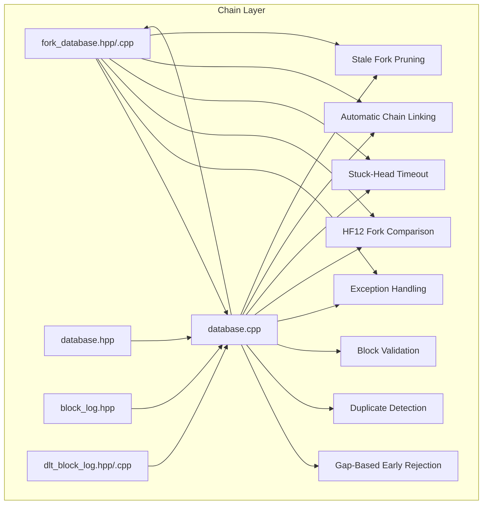

**Diagram sources**
- [fork_database.hpp:111-120](file://libraries/chain/include/graphene/chain/fork_database.hpp#L111-L120)
- [fork_database.cpp:80-87](file://libraries/chain/fork_database.cpp#L80-L87)
- [database.cpp:1204-1270](file://libraries/chain/database.cpp#L1204-L1270)
- [witness.cpp:521-544](file://plugins/witness/witness.cpp#L521-L544)

**Section sources**
- [fork_database.hpp:1-144](file://libraries/chain/include/graphene/chain/fork_database.hpp#L1-L144)
- [fork_database.cpp:1-278](file://libraries/chain/fork_database.cpp#L1-L278)
- [database.hpp:1-200](file://libraries/chain/include/graphene/chain/database.hpp#L1-L200)
- [database.cpp:1-6506](file://libraries/chain/database.cpp#L1-L6506)
- [dlt_block_log.hpp:1-76](file://libraries/chain/include/graphene/chain/dlt_block_log.hpp#L1-L76)
- [dlt_block_log.cpp:1-454](file://libraries/chain/dlt_block_log.cpp#L1-L454)
- [witness.cpp:1-697](file://plugins/witness/witness.cpp#L1-L697)
- [config.hpp:110-124](file://libraries/protocol/include/graphene/protocol/config.hpp#L110-L124)
- [12.hf:1-7](file://libraries/chain/hardfork.d/12.hf#L1-L7)

## Core Components
- fork_database: Maintains a multi-indexed collection of fork items with enhanced out-of-order block caching, comprehensive duplicate detection, sophisticated tie-breaking mechanisms, emergency mode integration, automatic stale fork pruning capabilities, and gap-based early rejection logic
- database: Integrates fork resolution into block application with sophisticated early rejection logic, comprehensive block validation, performs chain reorganization when a better fork emerges, manages DLT mode for snapshot-based nodes, implements emergency consensus mode activation/deactivation, and provides vote-weighted fork comparison for HF12
- block_log: Provides persistent storage for blocks, enabling recovery and serving as the source of irreversible blocks
- dlt_block_log: Separate rolling block log for DLT nodes that maintains a sliding window of recent irreversible blocks for P2P synchronization
- witness: Integrates witness scheduling with emergency mode awareness, handles fork collisions through two-level resolution system, manages stuck-head timeout mechanism, implements HF12 fork collision resolution, and provides automatic chain linking when parent blocks arrive
- emergency consensus: Implements timeout-based emergency mode activation, hybrid witness scheduling, and deterministic tie-breaking mechanisms
- compare_fork_branches: New HF12 function that performs vote-weighted fork comparison with +10% bonus for longer chains
- remove_blocks_by_number: New function that removes all blocks at a specific height to prevent memory bloat from dead-fork blocks

Key responsibilities:
- Track reversible blocks in memory (fork DB) with enhanced caching for out-of-order blocks, comprehensive duplicate detection, emergency mode tie-breaking, automatic stale fork pruning, and gap-based early rejection
- Implement sophisticated early rejection logic to prevent unnecessary fork database operations and infinite synchronization loops
- Detect and select the best chain by comparing heads with improved validation, emergency mode awareness, and HF12 vote-weighted comparison
- Reorganize the chain when a higher fork becomes active with better error recovery, emergency mode integration, and fork collision resolution
- Manage DLT mode for snapshot-based nodes with automatic fork database seeding capabilities
- Implement emergency consensus mode activation based on timeout thresholds
- Provide hybrid witness scheduling during emergency periods with deterministic tie-breaking
- Persist irreversible blocks to both block_log and dlt_block_log with enhanced reliability and emergency mode awareness
- Serve recent blocks to P2P peers through dlt_block_log for faster synchronization
- Handle emergency witness account creation and key management for consensus recovery
- Distinguish between different types of invalid blocks and handle them appropriately to prevent system degradation
- **New**: Perform vote-weighted fork comparisons using witness vote weights with +10% bonus for longer chains
- **New**: Implement two-level fork collision resolution with stuck-head timeout mechanism
- **New**: Automatically prune stale competing blocks from dead forks using remove_blocks_by_number()
- **New**: Implement gap-based early rejection logic with 100-block threshold to prevent memory bloat
- **New**: Enable automatic chain linking when parent blocks arrive via _push_next() mechanism
- **New**: Enhance duplicate detection and prevention throughout the system

**Section sources**
- [fork_database.hpp:53-144](file://libraries/chain/include/graphene/chain/fork_database.hpp#L53-L144)
- [fork_database.cpp:33-92](file://libraries/chain/fork_database.cpp#L33-L92)
- [database.cpp:1223-1267](file://libraries/chain/database.cpp#L1223-L1267)
- [dlt_block_log.hpp:13-33](file://libraries/chain/include/graphene/chain/dlt_block_log.hpp#L13-L33)
- [witness.cpp:521-544](file://plugins/witness/witness.cpp#L521-L544)

## Architecture Overview
The fork resolution pipeline integrates with block application and persistence with enhanced early rejection, sophisticated block validation, DLT mode support, automatic seeding mechanisms, emergency consensus recovery, advanced fork collision resolution, and automatic chain linking:

```mermaid
sequenceDiagram
participant Net as "Network"
participant DB as "database.cpp"
participant FDB as "fork_database.cpp"
participant WIT as "witness.cpp"
participant BL as "block_log.hpp"
participant DLTL as "dlt_block_log.cpp"
Net->>DB : "push_block(new_block)"
DB->>DB : "Early rejection checks"
DB->>DB : "Validate block types and conditions"
DB->>FDB : "push_block(new_block)"
alt "Block already known"
FDB-->>DB : "Ignore duplicate (duplicate detection)"
else "Unlinkable block"
FDB-->>DB : "Cache in unlinked_index"
else "Valid block"
FDB-->>DB : "Insert and _push_next"
DB->>DB : "Check emergency consensus timeout"
alt "Emergency mode activated"
DB->>WIT : "Override witness schedule to emergency witness"
DB->>FDB : "set_emergency_mode(true)"
DB->>DB : "Skip LIB advancement during emergency"
else "Normal mode"
DB->>DB : "Check new_head vs head_block_id()"
alt "Need fork switch"
DB->>DB : "HF12 : compare_fork_branches()"
DB->>FDB : "fetch_branch_from(new_head.id, head_block_id())"
FDB-->>DB : "branches"
DB->>DB : "pop blocks until common ancestor"
DB->>DB : "apply blocks from new fork"
end
end
DB->>BL : "persist irreversible blocks"
DB->>DLTL : "append to dlt_block_log (if enabled)"
```

**Diagram sources**
- [database.cpp:1204-1270](file://libraries/chain/database.cpp#L1204-L1270)
- [fork_database.cpp:80-87](file://libraries/chain/fork_database.cpp#L80-L87)
- [witness.cpp:521-544](file://plugins/witness/witness.cpp#L521-L544)
- [dlt_block_log.cpp:336-340](file://libraries/chain/dlt_block_log.cpp#L336-L340)

## Detailed Component Analysis

### Enhanced Gap-Based Early Rejection Logic and Block Validation
**Updated** The database now implements sophisticated early rejection logic that intelligently validates different types of blocks to prevent unnecessary processing and infinite synchronization loops. The system now includes a 100-block gap threshold to prevent memory bloat from dead-fork blocks.

The early rejection logic includes:

1. **Already Applied Block Detection**: If a block is at or before the current head and matches the existing block ID, it's ignored to prevent duplicate processing
2. **Different Fork Detection**: Blocks that are at or before the head but on different forks are silently rejected if their parent is not in the fork database
3. **Far Ahead Block Rejection**: Blocks that are far ahead of the current head with unknown parents are silently rejected to prevent P2P sync restart loops
4. **Parent Unknown Detection**: Blocks with unknown parents are rejected to prevent fork database overflow and sync disruption
5. **Gap-Based Rejection**: For blocks with gaps > 100 blocks, immediate rejection prevents memory bloat from dead-fork chains

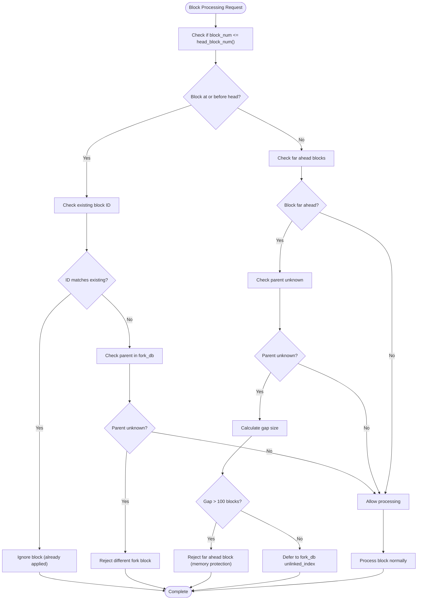

**Diagram sources**
- [database.cpp:1300-1399](file://libraries/chain/database.cpp#L1300-L1399)

**Section sources**
- [database.cpp:1300-1399](file://libraries/chain/database.cpp#L1300-L1399)

### Enhanced Duplicate Block Detection and Prevention
**New Section** The fork database now includes comprehensive duplicate block detection to prevent redundant processing and improve P2P synchronization reliability.

Duplicate detection mechanisms:
- Pre-insertion ID check against existing blocks in the index
- Prevention of duplicate processing during snapshot imports and P2P re-transmissions
- Efficient early rejection of already-applied blocks through database-level validation
- Comprehensive duplicate handling in emergency mode scenarios


**Diagram sources**
- [fork_database.cpp:48-84](file://libraries/chain/fork_database.cpp#L48-L84)

**Section sources**
- [fork_database.cpp:48-55](file://libraries/chain/fork_database.cpp#L48-L55)

### Enhanced Fork Database with Improved Error Handling
**Updated** The fork database now includes comprehensive error handling, sophisticated tie-breaking mechanisms for emergency consensus scenarios, automatic stale fork pruning capabilities, and enhanced gap-based early rejection logic.

The fork database supports:
- Pushing a block and linking it to the previous block with duplicate prevention
- Tracking the current head with enhanced validation and emergency mode tie-breaking
- Fetching branches from two heads to a common ancestor
- Walking the main branch to a given block number
- Removing blocks and limiting fork depth
- **New**: Iterative processing of cached unlinked blocks via `_push_next`
- **New**: Duplicate detection to prevent redundant processing during snapshot imports
- **New**: Enhanced error handling for unlinkable blocks with comprehensive logging
- **New**: Emergency mode tie-breaking with deterministic hash-based resolution for consensus stability
- **New**: Automatic stale fork pruning through `remove_blocks_by_number()` function
- **New**: Enhanced pruning system with `set_max_size()` that cleans both linked and unlinked indices
- **New**: Gap-based early rejection logic integrated with automatic chain linking

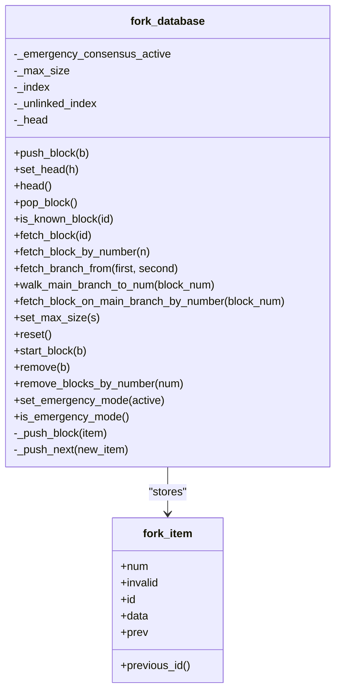

**Diagram sources**
- [fork_database.hpp:20-144](file://libraries/chain/include/graphene/chain/fork_database.hpp#L20-L144)
- [fork_database.cpp:33-278](file://libraries/chain/fork_database.cpp#L33-L278)

Implementation highlights:
- **Enhanced duplicate detection**: Blocks are checked against existing IDs before insertion to prevent duplicate processing
- **Improved linking validation**: Ensures each new block's previous ID exists in the index and is not marked invalid
- **Robust unlinked block caching**: Cached blocks are processed iteratively when their parent appears via `_push_next`
- **Maximum fork depth enforcement**: Prevents unbounded growth; older blocks are pruned with enhanced cleanup
- **Better error handling**: Comprehensive exception handling for unlinkable blocks with logging
- **Automatic seeding support**: Works seamlessly with DLT mode to enable immediate P2P synchronization
- **Emergency mode tie-breaking**: During emergency mode, deterministic hash-based tie-breaking ensures consensus stability when multiple emergency producers compete at the same height
- **Enhanced exception management**: Sophisticated handling of different types of block validation failures
- **Automatic stale fork pruning**: New `remove_blocks_by_number()` function clears stale competing blocks from dead forks
- **Enhanced pruning system**: `set_max_size()` now cleans both `_index` and `_unlinked_index` for optimal memory management
- **Gap-based early rejection**: Integrated with automatic chain linking to prevent memory bloat while maintaining network efficiency

**Section sources**
- [fork_database.hpp:111-144](file://libraries/chain/include/graphene/chain/fork_database.hpp#L111-L144)
- [fork_database.cpp:80-87](file://libraries/chain/fork_database.cpp#L80-L87)
- [fork_database.cpp:269-274](file://libraries/chain/fork_database.cpp#L269-L274)

### Branch Selection and Common Ancestor Detection
Branch selection relies on walking both branches backward until a common ancestor is found. The method returns two vectors representing the branches from each head to the common ancestor.


**Diagram sources**
- [fork_database.cpp:189-231](file://libraries/chain/fork_database.cpp#L189-L231)

**Section sources**
- [fork_database.cpp:189-231](file://libraries/chain/fork_database.cpp#L189-L231)

### Enhanced Chain Reorganization Process
**Updated** The chain reorganization process now includes improved early rejection logic, better error handling, DLT mode awareness, emergency consensus integration, HF12 fork comparison capabilities, and automatic chain linking for enhanced P2P synchronization reliability.

When a new head is higher and does not build off the current head, the database:
- Performs sophisticated early rejection checks to prevent unnecessary fork switches
- **New**: Uses HF12 logic with `compare_fork_branches()` for vote-weighted fork comparison
- **New**: Applies +10% bonus to longer chain in vote-weighted comparison
- **New**: Falls back to simple longest-chain rule for pre-HF12 compatibility
- Computes branches to the common ancestor with enhanced validation
- Pops blocks until reaching the common ancestor with improved error recovery
- Applies blocks from the new fork in reverse order with comprehensive exception handling
- Handles exceptions by invalidating the problematic fork and restoring the good fork with enhanced logging
- **New**: Works seamlessly with DLT mode to maintain fork database consistency
- **New**: Skips LIB advancement during emergency mode to prevent premature irreversibility
- **New**: Implements vote-weighted chain comparison for HF12 and above for more robust consensus
- **New**: Integrates automatic chain linking via _push_next() when parent blocks arrive

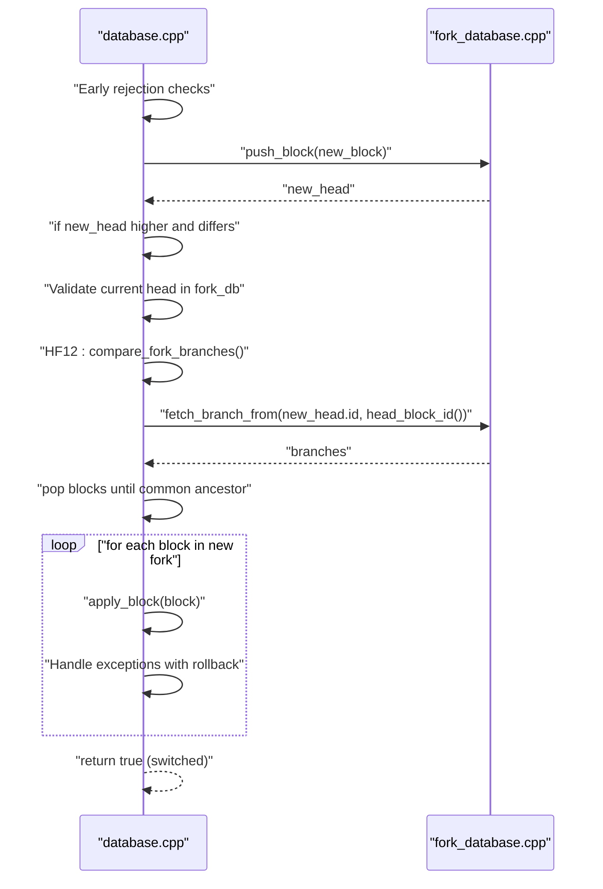

**Diagram sources**
- [database.cpp:1037-1177](file://libraries/chain/database.cpp#L1037-L1177)
- [fork_database.cpp:189-231](file://libraries/chain/fork_database.cpp#L189-L231)

**Section sources**
- [database.cpp:1037-1177](file://libraries/chain/database.cpp#L1037-L1177)

### DLT Mode Integration and Automatic Seeding
**New Section** The database now supports DLT (Data Ledger Technology) mode for snapshot-based nodes, with automatic seeding of the fork database to enable immediate P2P synchronization.

DLT mode features:
- **Automatic seeding**: When a snapshot is imported, the fork database is automatically seeded from either the DLT block log or chain state
- **Dual block logging**: Maintains both regular block_log and DLT block_log for different use cases
- **Gap handling**: Manages gaps between DLT block log and fork database during initial synchronization
- **Rolling window**: DLT block log maintains a sliding window of recent blocks for P2P peers

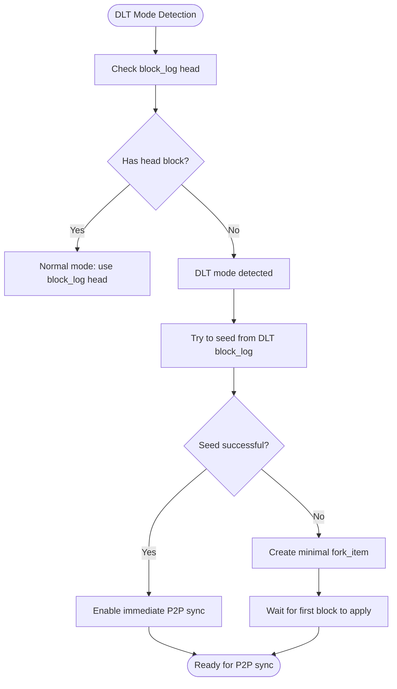

**Diagram sources**
- [database.cpp:259-294](file://libraries/chain/database.cpp#L259-L294)

**Section sources**
- [database.cpp:259-294](file://libraries/chain/database.cpp#L259-L294)
- [database.hpp:57-78](file://libraries/chain/include/graphene/chain/database.hpp#L57-L78)

### Enhanced Irreversible Block Determination and Persistence
**Updated** Irreversible blocks are determined by consensus thresholds and persisted to both block_log and dlt_block_log with enhanced reliability, DLT mode awareness, and emergency consensus integration.

The database updates last irreversible block (LIB) and writes blocks to logs when they become irreversible:
- **DLT mode awareness**: Skips block_log writes in DLT mode while still maintaining dlt_block_log
- **Dual persistence**: Writes to both block_log and dlt_block_log for comprehensive coverage
- **Gap logging**: Suppresses repeated warnings about missing blocks in fork database during initial synchronization
- **Rolling window management**: Automatically truncates DLT block log when it exceeds configured limits
- **Emergency mode integration**: Skips LIB advancement during emergency consensus mode to prevent premature irreversibility
- **Enhanced validation**: Sophisticated block validation prevents invalid blocks from becoming irreversible

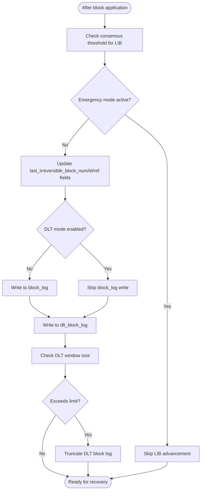

**Diagram sources**
- [database.cpp:4444-4533](file://libraries/chain/database.cpp#L4444-L4533)
- [dlt_block_log.cpp:336-340](file://libraries/chain/dlt_block_log.cpp#L336-L340)

**Section sources**
- [database.cpp:4444-4533](file://libraries/chain/database.cpp#L4444-L4533)
- [dlt_block_log.hpp:35-72](file://libraries/chain/include/graphene/chain/dlt_block_log.hpp#L35-L72)

### Enhanced P2P Fallback Mechanisms
**New Section** The P2P system now includes strengthened fallback mechanisms to handle network partitions and improve synchronization reliability.

P2P fallback features:
- **Enhanced error handling**: Better propagation of unlinkable block exceptions to network layer
- **Improved peer management**: More robust handling of disconnected peers and connection failures
- **Faster synchronization**: Automatic seeding enables immediate P2P sync for DLT nodes
- **Better network partition handling**: Enhanced mechanisms to recover from network splits
- **Intelligent block rejection**: Prevents infinite sync restart loops through early rejection logic
- **Gap-based protection**: 100-block threshold prevents memory bloat from dead-fork chains

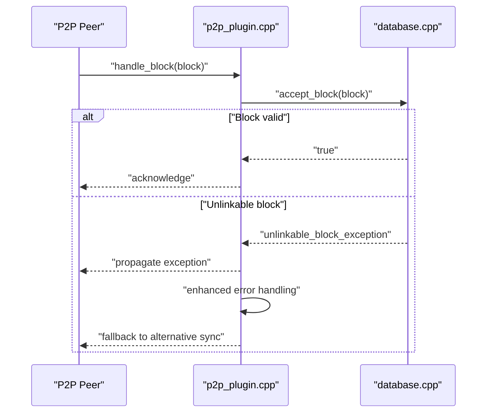

**Diagram sources**
- [p2p_plugin.cpp:118-164](file://plugins/p2p/p2p_plugin.cpp#L118-L164)

**Section sources**
- [p2p_plugin.cpp:118-164](file://plugins/p2p/p2p_plugin.cpp#L118-L164)

### Enhanced API Methods for Fork Detection, Chain Validation, and Recovery
**Updated** Enhanced with improved duplicate detection, DLT mode support, automatic seeding capabilities, emergency mode integration, sophisticated block validation, HF12 fork comparison capabilities, gap-based early rejection, and automatic stale fork pruning.

- Fork detection and branch retrieval:
  - get_block_ids_on_fork(head_of_fork): Returns ordered list of block IDs from the fork head back to the common ancestor
  - fetch_branch_from(first, second): Returns two branches leading to a common ancestor
  - **New**: compare_fork_branches(branch_a_tip, branch_b_tip): Vote-weighted fork comparison for HF12
- Chain validation:
  - validate_block(new_block, skip): Validates block Merkle root and size with enhanced error handling
- State recovery:
  - open(): Initializes database and starts fork DB at head block with DLT mode awareness
  - reindex(): Replays blocks and restarts fork DB at the new head
  - find_block_id_for_num(block_num)/get_block_id_for_num(block_num): Resolves block ID across block log, fork DB, and TAPOS buffer with enhanced duplicate handling
- **New**: DLT mode management:
  - set_dlt_mode(enabled): Enables/disables DLT mode for snapshot-based nodes
  - open_from_snapshot(): Optimized initialization for snapshot-based nodes with automatic seeding
- **New**: Emergency mode management:
  - set_emergency_mode(active): Activates or deactivates emergency consensus mode
  - is_emergency_mode(): Checks current emergency consensus mode status
- **New**: Enhanced block validation:
  - Sophisticated early rejection logic prevents infinite synchronization loops
  - Intelligent duplicate detection prevents redundant processing
  - Comprehensive exception handling for different block validation failures
  - Gap-based rejection with 100-block threshold prevents memory bloat
- **New**: Stale fork management:
  - remove_blocks_by_number(num): Removes all blocks at specific height to prune dead forks
  - Enhanced pruning system with automatic cleanup of stale competing blocks
- **New**: Automatic chain linking:
  - _push_next(): Iterative processing of cached unlinked blocks when parents arrive
  - Gap-based protection prevents memory bloat from dead-fork chains

**Section sources**
- [database.hpp:115-128](file://libraries/chain/include/graphene/chain/database.hpp#L115-L128)
- [database.cpp:561-580](file://libraries/chain/database.cpp#L561-L580)
- [database.cpp:738-792](file://libraries/chain/database.cpp#L738-L792)
- [database.cpp:206-230](file://libraries/chain/database.cpp#L206-L230)
- [database.cpp:476-515](file://libraries/chain/database.cpp#L476-L515)
- [fork_database.hpp:111-120](file://libraries/chain/include/graphene/chain/fork_database.hpp#L111-L120)
- [fork_database.cpp:269-274](file://libraries/chain/fork_database.cpp#L269-L274)

### Examples of Enhanced Fork Scenarios and Resolution Processes
**Updated** Enhanced with improved out-of-order block handling, duplicate detection, DLT mode integration, automatic seeding capabilities, emergency consensus recovery, sophisticated early rejection logic, advanced fork collision resolution, automatic chain linking, and stale fork pruning.

- Scenario A: Out-of-order arrival of blocks with improved caching and automatic linking
  - Behavior: New blocks are inserted into the unlinked cache and later inserted when their parent appears via `_push_next`, which automatically links the entire chain
  - Mechanism: Enhanced `_push_next` iteratively processes pending blocks whose parent now exists, with comprehensive error handling and automatic chain completion
- Scenario B: Network partition resolves with a longer chain and improved early rejection
  - Behavior: The database performs sophisticated early rejection checks, detects a higher head, computes branches, pops blocks, and applies the new fork
  - Mechanism: Enhanced early rejection logic prevents unnecessary fork switches and improves P2P synchronization reliability
- Scenario C: Invalid block on a fork with improved error handling
  - Behavior: The fork is invalidated and removed; the database restores the good fork and throws the exception with enhanced logging
  - Mechanism: Comprehensive exception handling with rollback to previous state and improved error reporting
- **New Scenario D**: Fresh snapshot import with automatic seeding
  - Behavior: DLT mode is detected, fork database is automatically seeded from DLT block log or chain state, enabling immediate P2P synchronization
  - Mechanism: Enhanced DLT mode detection and automatic seeding prevents P2P synchronization delays
- **New Scenario E**: DLT block log gap handling
  - Behavior: When DLT block log falls behind fork database, the system logs warnings once and continues operation
  - Mechanism: Gap logging suppression prevents log flooding while maintaining operational awareness
- **New Scenario F**: Emergency consensus mode activation
  - Behavior: When no blocks are produced for CHAIN_EMERGENCY_CONSENSUS_TIMEOUT_SEC seconds, emergency mode activates with deterministic tie-breaking
  - Mechanism: Emergency witness takes over all witness slots, emergency mode flag is set, and deterministic hash-based tie-breaking ensures consensus stability
- **New Scenario G**: Emergency consensus mode deactivation
  - Behavior: When LIB advances past emergency_consensus_start_block, emergency mode is deactivated and normal witness scheduling resumes
  - Mechanism: Emergency mode flag is cleared and fork database is notified of emergency mode termination
- **New Scenario H**: Sophisticated early rejection in action
  - Behavior: Database rejects blocks that are already applied, on different forks, or far ahead with unknown parents to prevent infinite sync loops
  - Mechanism: Intelligent block validation prevents unnecessary processing and system degradation
- **New Scenario I**: Duplicate block prevention
  - Behavior: Database and fork database work together to detect and prevent duplicate block processing
  - Mechanism: Comprehensive duplicate detection prevents redundant CPU usage and improves synchronization reliability
- **New Scenario J**: HF12 fork collision resolution
  - Behavior: When competing blocks appear at the same height, database uses vote-weighted comparison to determine the stronger fork
  - Mechanism: `compare_fork_branches()` calculates total vote weight per witness, applies +10% bonus to longer chain, and resolves ties deterministically
- **New Scenario K**: Stuck-head timeout mechanism
  - Behavior: After 21 consecutive deferrals (one full witness round), database removes stale competing blocks and produces on the canonical chain
  - Mechanism: `fork_collision_defer_count_` tracks deferral attempts, `remove_blocks_by_number()` clears stale blocks, and timeout ensures network progress
- **New Scenario L**: Automatic stale fork pruning
  - Behavior: Database periodically removes stale competing blocks from dead forks to prevent memory bloat and improve performance
  - Mechanism: `remove_blocks_by_number()` clears all blocks at specific heights, combined with `set_max_size()` pruning for optimal memory usage
- **New Scenario M**: Gap-based early rejection protection
  - Behavior: Database rejects blocks with gaps > 100 blocks to prevent memory bloat from dead-fork chains
  - Mechanism: 100-block threshold prevents accumulation of stale blocks while allowing normal out-of-order processing
- **New Scenario N**: Automatic chain linking when parent arrives
  - Behavior: Database caches unlinkable blocks and automatically links them when their parents arrive via _push_next()
  - Mechanism: Iterative processing of cached blocks prevents memory bloat and maintains network efficiency

**Section sources**
- [fork_database.cpp:92-103](file://libraries/chain/fork_database.cpp#L92-L103)
- [database.cpp:1075-1087](file://libraries/chain/database.cpp#L1075-L1087)
- [database.cpp:259-294](file://libraries/chain/database.cpp#L259-L294)
- [database.cpp:4581-4594](file://libraries/chain/database.cpp#L4581-L4594)
- [database.cpp:1300-1399](file://libraries/chain/database.cpp#L1300-L1399)
- [database.cpp:2125-2142](file://libraries/chain/database.cpp#L2125-L2142)
- [database.cpp:1223-1267](file://libraries/chain/database.cpp#L1223-L1267)
- [witness.cpp:597-612](file://plugins/witness/witness.cpp#L597-L612)
- [fork_database.cpp:269-274](file://libraries/chain/fork_database.cpp#L269-L274)

## Emergency Consensus Recovery System

### Emergency Consensus Mode Activation
The emergency consensus mode activates automatically when no blocks are produced for more than CHAIN_EMERGENCY_CONSENSUS_TIMEOUT_SEC seconds (1 hour by default). This mechanism ensures blockchain continuity during extended network partitions or witness failures.

Emergency mode activation process:
- **Timeout detection**: The database checks if seconds_since_LIB >= CHAIN_EMERGENCY_CONSENSUS_TIMEOUT_SEC
- **Mode activation**: Sets emergency_consensus_active = true and records emergency_consensus_start_block
- **Emergency witness setup**: Creates or updates emergency witness account with CHAIN_EMERGENCY_WITNESS_PUBLIC_KEY
- **Penalty reset**: Resets all witness penalties and re-enables shut-down witnesses
- **Schedule override**: Overrides witness schedule so all slots are filled by emergency witness
- **Fork database notification**: Sets emergency mode flag in fork database for deterministic tie-breaking

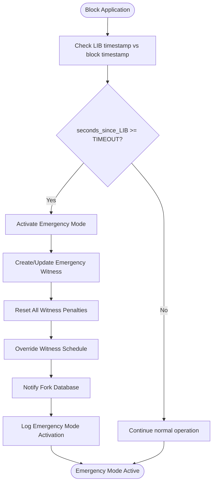

**Diagram sources**
- [database.cpp:4334-4438](file://libraries/chain/database.cpp#L4334-L4438)

### Hybrid Witness Scheduling During Emergency
During emergency mode, the witness scheduling system operates differently to ensure consensus stability:
- **All slots filled by emergency witness**: All CHAIN_MAX_WITNESSES slots are assigned to CHAIN_EMERGENCY_WITNESS_ACCOUNT
- **Deterministic tie-breaking**: Emergency mode uses hash-based tie-breaking for consensus stability
- **Skip LIB advancement**: Post-validation chain does not advance LIB during emergency mode
- **Committee exclusion**: Committee witness is excluded from hardfork vote tally and median computation during emergency

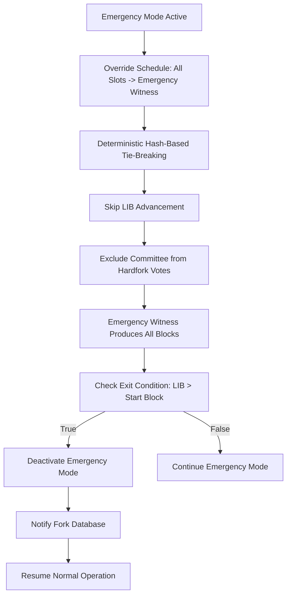

**Diagram sources**
- [database.cpp:4420-4438](file://libraries/chain/database.cpp#L4420-L4438)
- [database.cpp:4444-4450](file://libraries/chain/database.cpp#L4444-L4450)

### Emergency Witness Account Management
The emergency witness account serves as the single producer during emergency consensus mode:
- **Account name**: CHAIN_EMERGENCY_WITNESS_ACCOUNT (defaults to "committee")
- **Signing key**: CHAIN_EMERGENCY_WITNESS_PUBLIC_KEY (deterministic emergency key)
- **Properties**: Copies median chain properties to avoid skewing median computations
- **Hardfork votes**: Votes for currently applied hardfork version to maintain status quo
- **Penalty management**: Emergency witness participates in penalty reset process

Emergency witness lifecycle:
- **Creation**: Created automatically during emergency mode activation if not exists
- **Updates**: Key and properties updated during emergency mode reactivation
- **Participation**: Produces blocks for CHAIN_EMERGENCY_EXIT_NORMAL_BLOCKS consecutive blocks
- **Cleanup**: Penalties removed and normal operations resume after exit condition met

**Section sources**
- [config.hpp:114-124](file://libraries/protocol/include/graphene/protocol/config.hpp#L114-L124)
- [database.cpp:4360-4398](file://libraries/chain/database.cpp#L4360-L4398)
- [database.cpp:4400-4419](file://libraries/chain/database.cpp#L4400-L4419)

### Emergency Mode Tie-Breaking Mechanisms
During emergency consensus mode, deterministic hash-based tie-breaking ensures consensus stability when multiple emergency producers compete at the same height:
- **Hash comparison**: When two blocks compete at the same height, compare block_id hashes
- **Lower hash preferred**: The block with the lower block_id hash becomes the head
- **Consensus stability**: Eliminates fork divergence caused by P2P arrival order differences
- **Deterministic resolution**: All nodes converge on the same block regardless of network topology

Tie-breaking algorithm:
- **Same height competition**: Only applies when emergency mode is active and blocks compete at identical heights
- **Hash-based decision**: Compare item->id < _head->id for tie-breaking decision
- **Immediate head update**: If tie-breaker selects new head, update _head immediately
- **No fork switching**: Tie-breaking occurs within emergency mode without full fork reorganization

**Section sources**
- [fork_database.cpp:80-87](file://libraries/chain/fork_database.cpp#L80-L87)
- [witness.cpp:521-526](file://plugins/witness/witness.cpp#L521-L526)

### Emergency Exit Conditions and Recovery
Emergency consensus mode deactivates automatically when:
- **LIB advancement**: Last Irreversible Block number exceeds emergency_consensus_start_block
- **Normal witness rejoin**: Regular witnesses resume production after emergency period
- **Manual intervention**: System administrator can manually deactivate emergency mode

Emergency exit process:
- **LIB check**: Monitor LIB advancement past emergency start block
- **Mode deactivation**: Set emergency_consensus_active = false
- **Fork database notification**: Clear emergency mode flag in fork database
- **Normal operation resume**: Resume normal witness scheduling and LIB advancement
- **Penalty restoration**: Restore normal penalty calculations for emergency period

**Section sources**
- [database.cpp:2125-2142](file://libraries/chain/database.cpp#L2125-L2142)
- [database.cpp:4428-4430](file://libraries/chain/database.cpp#L4428-L4430)

## Two-Level Fork Collision Resolution

### Overview
The two-level fork collision resolution system provides robust handling of competing blocks at the same height, combining immediate vote-weighted comparison with timeout-based fallback mechanisms. This system ensures network progress while maintaining consensus integrity.

### Level 1: Vote-Weighted Comparison (HF12)
When HF12 is active and competing blocks exist at the same height, the system performs immediate vote-weighted comparison:

1. **Comparison**: `compare_fork_branches()` calculates total vote weight per witness for both forks
2. **Bonus Application**: Longer chain receives +10% bonus to vote weight
3. **Decision Making**:
   - If one fork has significantly more weight: produce on stronger fork
   - If comparison is inconclusive: defer to timeout mechanism
   - If tied: produce on current fork, continue monitoring

### Level 2: Stuck-Head Timeout
If the network remains stuck with competing blocks for extended periods:

1. **Timeout Detection**: After 21 consecutive deferrals (one full witness round)
2. **Action**: Remove all stale competing blocks from the dead fork
3. **Resolution**: Produce on the canonical chain with confirmed majority support
4. **Prevention**: Ensures network doesn't stall indefinitely due to fork collisions

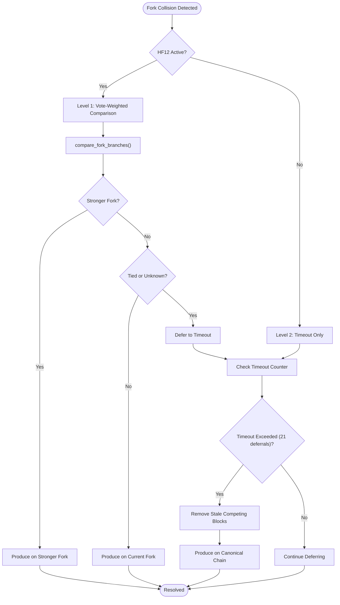

**Diagram sources**
- [witness.cpp:565-656](file://plugins/witness/witness.cpp#L565-L656)
- [database.cpp:1223-1267](file://libraries/chain/database.cpp#L1223-L1267)

**Section sources**
- [witness.cpp:565-656](file://plugins/witness/witness.cpp#L565-L656)
- [witness.cpp:121](file://plugins/witness/witness.cpp#L121)

## Vote-Weighted Fork Comparison Algorithm

### compare_fork_branches() Function
The `compare_fork_branches()` function implements HF12's vote-weighted fork comparison system:

#### Algorithm Steps:
1. **Validation**: Ensure both fork tips exist in fork database
2. **Branch Extraction**: Use `fetch_branch_from()` to get branches to common ancestor
3. **Weight Calculation**: Compute total vote weight per witness for each branch
4. **Bonus Application**: Apply +10% bonus to longer chain
5. **Comparison**: Determine stronger fork or tie

#### Weight Calculation Details:
- **Per-Witness Weight**: Sum of vote weights for each unique witness
- **Emergency Witness Exclusion**: Emergency witness votes are excluded from calculation
- **Unique Witness Counting**: Each witness contributes only once per branch

#### Bonus System:
- **Longer Chain Advantage**: +10% bonus applied to the fork with more blocks
- **Consensus Signal**: Reflects stronger network support and production continuity
- **Fairness**: Prevents chains from stalling due to minor vote differences

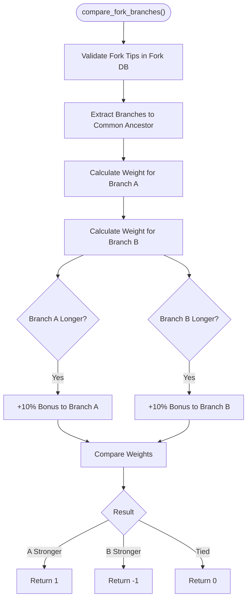

**Diagram sources**
- [database.cpp:1223-1267](file://libraries/chain/database.cpp#L1223-L1267)

**Section sources**
- [database.cpp:1223-1267](file://libraries/chain/database.cpp#L1223-L1267)

## Automatic Stale Fork Pruning System

### Purpose
The automatic stale fork pruning system prevents memory bloat and improves performance by removing stale competing blocks from dead forks. This system complements the two-level fork collision resolution by providing proactive cleanup.

### Implementation
The pruning system consists of two main components:

#### 1. `remove_blocks_by_number()` Function
- **Targeted Removal**: Removes all blocks at a specific height from the fork database
- **Dead Fork Cleanup**: Clears stale competing blocks that will never become canonical
- **Memory Optimization**: Prevents accumulation of unused fork data

#### 2. Enhanced Pruning with `set_max_size()`
- **Depth Control**: Limits fork database to configurable maximum depth
- **Automatic Cleanup**: Removes oldest blocks when size limit is exceeded
- **Dual Index Cleaning**: Cleans both linked and unlinked indices for optimal memory usage

### Pruning Trigger Conditions
- **HF12 Fork Collision**: When stuck-head timeout exceeds threshold, stale blocks are removed
- **Size Limit Exceeded**: When fork database exceeds configured maximum size
- **Network Recovery**: After fork resolution, stale competing blocks are cleaned up
- **Gap-Based Protection**: Prevents memory bloat from dead-fork chains with 100-block threshold

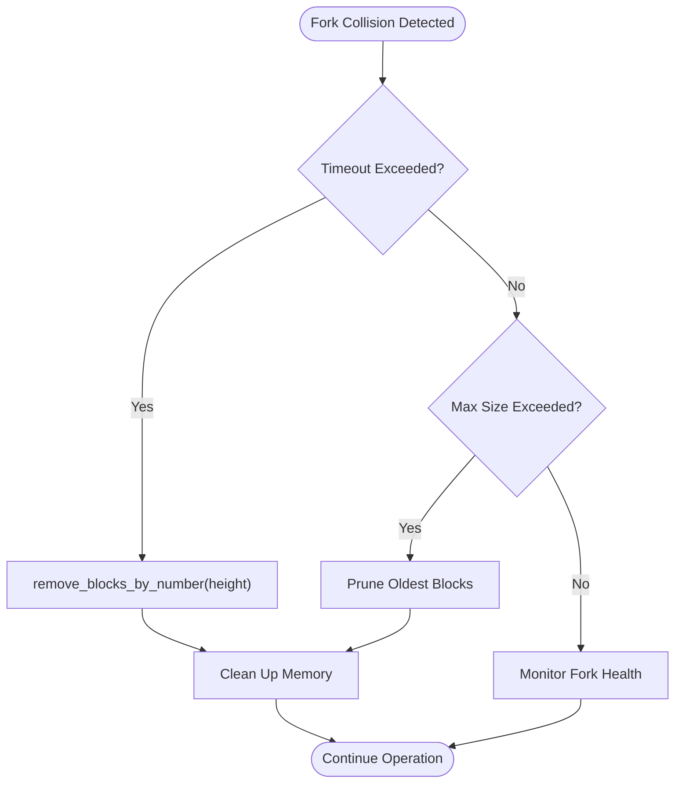

**Diagram sources**
- [fork_database.cpp:269-274](file://libraries/chain/fork_database.cpp#L269-L274)
- [fork_database.cpp:114-146](file://libraries/chain/fork_database.cpp#L114-L146)

**Section sources**
- [fork_database.cpp:269-274](file://libraries/chain/fork_database.cpp#L269-L274)
- [fork_database.cpp:114-146](file://libraries/chain/fork_database.cpp#L114-L146)

## Dependency Analysis
**Updated** The fork resolution system now includes DLT mode dependencies, automatic seeding capabilities, comprehensive emergency consensus integration, sophisticated early rejection logic, HF12 fork comparison capabilities, advanced fork collision resolution systems, gap-based early rejection protection, and automatic chain linking features.

The fork resolution system depends on:
- fork_database for in-memory fork chain management with enhanced caching, duplicate detection, emergency mode tie-breaking, comprehensive error handling, automatic stale fork pruning, HF12 fork comparison, and gap-based early rejection
- database for integrating fork resolution into block application, DLT mode management, automatic seeding, emergency consensus mode activation/deactivation with sophisticated early rejection logic, block validation, and HF12 vote-weighted fork comparison
- block_log for persistence of irreversible blocks in normal mode
- **New**: dlt_block_log for DLT mode persistence and P2P synchronization support
- **New**: witness plugin for emergency mode awareness, fork collision handling, two-level fork collision resolution, stuck-head timeout mechanism, HF12 fork comparison integration, and automatic chain linking
- **New**: emergency consensus configuration for timeout thresholds and emergency witness parameters
- **New**: compare_fork_branches function for HF12 vote-weighted fork comparison
- **New**: Enhanced exception handling for different types of block validation failures
- **New**: Automatic stale fork pruning system with remove_blocks_by_number() function
- **New**: Gap-based early rejection logic with 100-block threshold for memory protection
- **New**: Automatic chain linking system via _push_next() for efficient out-of-order block processing

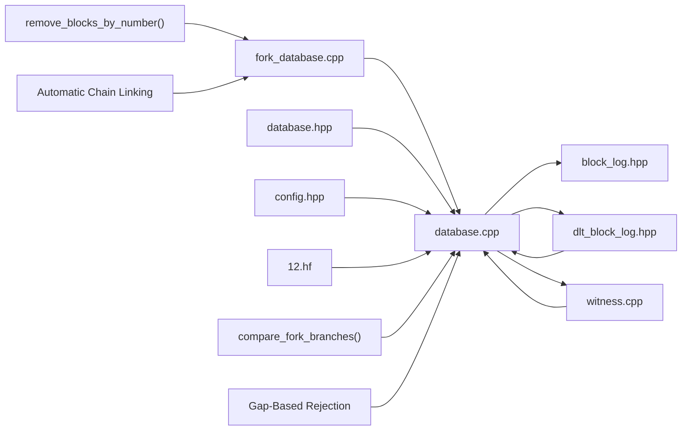

**Diagram sources**
- [fork_database.cpp:1-278](file://libraries/chain/fork_database.cpp#L1-L278)
- [database.cpp:1-6506](file://libraries/chain/database.cpp#L1-L6506)
- [dlt_block_log.cpp:1-454](file://libraries/chain/dlt_block_log.cpp#L1-L454)
- [witness.cpp:1-697](file://plugins/witness/witness.cpp#L1-L697)
- [config.hpp:110-124](file://libraries/protocol/include/graphene/protocol/config.hpp#L110-L124)
- [12.hf:1-7](file://libraries/chain/hardfork.d/12.hf#L1-L7)

**Section sources**
- [fork_database.cpp:1-278](file://libraries/chain/fork_database.cpp#L1-L278)
- [database.cpp:1-6506](file://libraries/chain/database.cpp#L1-L6506)
- [dlt_block_log.cpp:1-454](file://libraries/chain/dlt_block_log.cpp#L1-L454)
- [witness.cpp:1-697](file://plugins/witness/witness.cpp#L1-L697)
- [config.hpp:110-124](file://libraries/protocol/include/graphene/protocol/config.hpp#L110-L124)
- [12.hf:1-7](file://libraries/chain/hardfork.d/12.hf#L1-L7)

## Performance Considerations
**Updated** Enhanced with improved caching, duplicate detection, DLT mode integration, automatic seeding mechanisms, emergency consensus recovery optimizations, sophisticated early rejection logic, HF12 fork comparison capabilities, advanced fork collision resolution systems, gap-based early rejection protection, and automatic chain linking features.

- Maximum fork depth: The fork database limits the maximum number of blocks that may be skipped in an out-of-order push, preventing excessive memory usage with enhanced cleanup
- Multi-index containers: Efficient lookups by block ID and previous ID minimize traversal costs with improved indexing
- **Enhanced caching**: Improved unlinked block caching with iterative processing via `_push_next` reduces memory pressure and improves P2P synchronization
- **Duplicate prevention**: Comprehensive duplicate detection prevents redundant processing and reduces CPU overhead
- **Early rejection optimization**: Sophisticated early rejection logic prevents unnecessary fork database operations and improves overall system performance
- **Enhanced error handling**: Comprehensive exception handling with specific error types prevents system degradation and improves reliability
- **Pruning**: set_max_size prunes old blocks from both linked and unlinked indices to keep memory bounded with enhanced cleanup
- **Reorganization cost**: Reorganizing across deep forks requires popping and re-applying blocks; keeping forks shallow improves responsiveness with enhanced error recovery
- **Persistence overhead**: Writing to the block log is required for irreversible blocks; batching and flushing strategies can mitigate latency
- **DLT mode optimization**: Automatic seeding eliminates synchronization delays for snapshot-based nodes, improving overall network health
- **Gap handling**: DLT block log gap logging suppression prevents performance impact from excessive warning messages
- **Emergency mode efficiency**: Emergency mode uses optimized tie-breaking with minimal computational overhead while ensuring consensus stability
- **Hybrid scheduling**: Emergency witness scheduling minimizes complexity compared to full witness rotation during emergency periods
- **Penalty management**: Emergency penalty reset avoids complex penalty calculations during emergency mode, reducing computational load
- **Sophisticated validation**: Early rejection logic prevents unnecessary processing and reduces system load during network partitions
- **HF12 fork comparison**: Vote-weighted comparison adds computational overhead but provides more robust consensus decisions
- **Two-level collision resolution**: Additional logic for fork collision handling adds minimal overhead while providing significant reliability improvements
- **Automatic pruning**: Stale fork pruning prevents memory bloat and maintains optimal performance under fork collision conditions
- **Stuck-head timeout**: 21-block timeout provides reasonable balance between network stability and production efficiency
- **Gap-based protection**: 100-block threshold prevents memory bloat from dead-fork chains while maintaining network efficiency
- **Automatic chain linking**: _push_next() mechanism prevents memory bloat and maintains optimal performance under out-of-order block conditions

## Troubleshooting Guide
**Updated** Enhanced with improved error handling, duplicate detection, DLT mode support, automatic seeding capabilities, comprehensive emergency consensus troubleshooting, sophisticated early rejection logic, HF12 fork comparison troubleshooting, advanced fork collision resolution guidance, gap-based early rejection troubleshooting, and automatic chain linking guidance.

Common issues and remedies:
- **Unlinkable block errors**: Occur when a block does not link to a known chain; the fork DB logs and caches the block for later insertion when its parent arrives with enhanced logging and processing via _push_next()
- **Invalid fork handling**: When reorganization fails, the database removes the problematic fork, restores the good fork, and rethrows the exception with comprehensive error recovery
- **Memory pressure**: Adjust shared memory sizing and monitor free memory; the database resizes shared memory when necessary with enhanced monitoring
- **Recovery mismatches**: During open/reindex, the database asserts chain state consistency with the block log and resets the fork DB accordingly with improved validation
- **Duplicate block processing**: The fork DB now prevents duplicate block processing, reducing CPU overhead and improving synchronization reliability
- **Early rejection failures**: Enhanced early rejection logic helps prevent unnecessary fork database operations and improves overall system performance
- **DLT mode issues**: When DLT mode is enabled, verify that DLT block log is properly configured and that automatic seeding is working correctly
- **P2P synchronization delays**: Check that automatic seeding is functioning and that fork database is properly seeded from DLT block log
- **Gap logging**: Monitor DLT block log gaps and adjust configuration if gaps persist beyond acceptable limits
- **Emergency mode activation failures**: Verify CHAIN_EMERGENCY_CONSENSUS_TIMEOUT_SEC configuration and check LIB timestamp calculations
- **Emergency mode deactivation issues**: Monitor LIB advancement and ensure emergency_consensus_start_block tracking is accurate
- **Emergency witness problems**: Verify emergency witness account creation and key management during emergency mode activation
- **Hybrid scheduling conflicts**: Check witness schedule overrides and ensure emergency witness has proper signing key configuration
- **Tie-breaking anomalies**: Monitor emergency mode tie-breaking behavior and verify hash-based resolution consistency across network nodes
- **Infinite sync loops**: Check early rejection logic and ensure proper block validation to prevent continuous sync restarts
- **Block validation failures**: Monitor different types of block validation errors and ensure appropriate exception handling
- **HF12 fork comparison failures**: Verify compare_fork_branches() function returns valid results and check witness vote weight calculations
- **Two-level collision resolution issues**: Monitor fork collision timeout counters and ensure stuck-head timeout mechanism is functioning correctly
- **Vote-weighted comparison anomalies**: Check witness vote weight calculations and ensure emergency witness exclusion is working properly
- **Automatic pruning failures**: Verify remove_blocks_by_number() function is cleaning stale competing blocks and check set_max_size() pruning effectiveness
- **Timeout configuration problems**: Adjust fork-collision-timeout-blocks parameter if network experiences frequent fork collisions or insufficient timeout
- **Gap-based rejection issues**: Verify 100-block threshold is working correctly and check that legitimate out-of-order blocks are not being rejected
- **Automatic chain linking failures**: Check _push_next() mechanism and ensure cached unlinked blocks are being processed correctly when parents arrive

**Section sources**
- [fork_database.cpp:34-46](file://libraries/chain/fork_database.cpp#L34-L46)
- [database.cpp:1075-1087](file://libraries/chain/database.cpp#L1075-L1087)
- [database.cpp:259-294](file://libraries/chain/database.cpp#L259-L294)
- [database.cpp:4581-4594](file://libraries/chain/database.cpp#L4581-L4594)
- [database.cpp:1300-1399](file://libraries/chain/database.cpp#L1300-L1399)
- [database.cpp:2125-2142](file://libraries/chain/database.cpp#L2125-L2142)
- [witness.cpp:597-612](file://plugins/witness/witness.cpp#L597-L612)
- [fork_database.cpp:269-274](file://libraries/chain/fork_database.cpp#L269-L274)

## Conclusion
**Updated** The fork resolution and consensus system combines an efficient in-memory fork database with robust chain reorganization, irreversible block persistence, comprehensive DLT mode support, and advanced emergency consensus recovery mechanisms. The system has been significantly enhanced with sophisticated gap-based early rejection logic, comprehensive duplicate detection, DLT mode integration, automatic seeding capabilities, comprehensive emergency consensus implementation, HF12 vote-weighted fork comparison, two-level fork collision resolution, automatic stale fork pruning, and automatic chain linking. The enhanced fork database now supports snapshot-based nodes with immediate P2P synchronization, while the DLT block log provides efficient serving of recent irreversible blocks to peers. The emergency consensus recovery system ensures blockchain continuity through timeout-based activation, hybrid witness scheduling, and deterministic tie-breaking mechanisms. The HF12 fork comparison system provides more robust consensus decisions by weighting chains based on witness vote support with +10% bonus for longer chains. The two-level fork collision resolution system combines immediate vote-weighted comparison with stuck-head timeout to ensure network progress while maintaining consensus integrity. The automatic stale fork pruning system prevents memory bloat and maintains optimal performance under fork collision conditions. The gap-based early rejection logic with 100-block threshold prevents memory bloat from dead-fork chains while maintaining network efficiency. The automatic chain linking system via _push_next() ensures efficient processing of out-of-order blocks. The system integrates tightly with witness scheduling to ensure timely and valid block production, with emergency mode awareness enabling seamless transition between normal and emergency operations. The enhanced APIs enable reliable fork detection, chain validation, and recovery with DLT mode, emergency consensus, HF12 fork comparison, gap-based protection, and automatic chain linking awareness. Performance controls keep resource usage manageable while improving synchronization reliability, network health, and consensus stability during emergency conditions. The sophisticated early rejection logic and block validation mechanisms prevent infinite synchronization loops and system degradation, ensuring robust operation under various network conditions.

## Appendices

### Appendix A: Enhanced Key Data Structures and Complexity
**Updated** Enhanced with improved duplicate detection, caching mechanisms, DLT mode support, automatic seeding capabilities, emergency consensus integration, sophisticated early rejection logic, HF12 fork comparison capabilities, advanced fork collision resolution systems, gap-based early rejection protection, and automatic chain linking features.

- fork_item: Stores block data, previous link, and invalid flag
- fork_database:
  - push_block: O(log N) average for insertions; unlinked insertion triggers iterative _push_next with duplicate prevention
  - fetch_branch_from: O(depth) to traverse both branches to common ancestor
  - walk_main_branch_to_num: O(depth) to reach a specific block number
  - set_max_size: O(N log N) worst-case pruning across indices with enhanced cleanup
  - **New**: Duplicate detection: O(1) lookup for existing block IDs before insertion
  - **New**: Enhanced caching: Iterative processing of up to MAX_BLOCK_REORDERING unlinked blocks via _push_next
  - **New**: Emergency mode tie-breaking: O(1) hash comparison for tie resolution during emergency periods
  - **New**: Enhanced error handling: Comprehensive exception management for different block validation failures
  - **New**: Automatic stale fork pruning: O(k) removal of all blocks at specific height (k = number of competing blocks)
  - **New**: Enhanced pruning system: O(N) cleanup of both _index and _unlinked_index for optimal memory management
  - **New**: Gap-based early rejection: O(1) gap calculation and threshold checking
- **New**: database compare_fork_branches():
  - O(B) where B = number of blocks in longer branch
  - Calculates vote weights for each unique witness
  - Applies +10% bonus to longer chain
  - Returns comparison result (-1, 0, or 1)
- **New**: database early rejection logic:
  - Already applied block detection: O(1) lookup for existing block IDs
  - Different fork detection: O(1) parent validation in fork database
  - Far ahead block rejection: O(1) parent unknown detection with gap calculation
  - Gap-based protection: O(1) 100-block threshold checking
  - Sophisticated validation prevents unnecessary processing and system degradation
- **New**: dlt_block_log:
  - append: O(1) for sequential writes with rolling window management
  - read_block_by_num: O(1) for random access within window
  - truncate_before: O(n) for window compaction with safe file swapping
- **New**: Emergency consensus configuration:
  - CHAIN_EMERGENCY_CONSENSUS_TIMEOUT_SEC: 3600 seconds (1 hour) timeout threshold
  - CHAIN_EMERGENCY_WITNESS_ACCOUNT: Emergency witness account name ("committee")
  - CHAIN_EMERGENCY_WITNESS_PUBLIC_KEY: Deterministic emergency signing key
  - CHAIN_EMERGENCY_EXIT_NORMAL_BLOCKS: 21 blocks to trigger emergency mode exit
  - Hardfork version: CHAIN_HARDFORK_12 (version 3.1.0)
  - Activation time: CHAIN_HARDFORK_12_TIME (Unix timestamp for HF12 activation)
- **New**: DLT mode integration:
  - Automatic seeding: O(1) to seed fork database from DLT block log
  - Gap handling: O(1) logging suppression with periodic re-enabling
- **New**: Emergency mode integration:
  - Activation detection: O(1) timestamp comparison for timeout checks
  - Hybrid scheduling: O(N) override of all witness slots to emergency witness
  - Penalty reset: O(N) iteration through all witnesses for penalty clearing
- **New**: HF12 fork comparison:
  - Vote-weighted comparison: O(B) where B = number of blocks in longer branch
  - Unique witness counting: O(W) where W = number of unique witnesses per branch
  - +10% bonus application: O(1) constant time operation
- **New**: Two-level fork collision resolution:
  - Level 1 timeout: O(1) constant time comparison
  - Level 2 timeout: O(1) constant time counter check
  - Stale fork removal: O(k) where k = number of competing blocks at height
- **New**: Exception handling:
  - unlinkable_block_exception: Specific handling for blocks that cannot link
  - block_too_old_exception: Specific handling for blocks outside fork window
  - Enhanced error categorization prevents system degradation
- **New**: Automatic chain linking:
  - _push_next() processing: O(k) where k = number of cached blocks linked
  - Gap-based protection: Prevents memory bloat from dead-fork chains

**Section sources**
- [fork_database.hpp:20-144](file://libraries/chain/include/graphene/chain/fork_database.hpp#L20-L144)
- [fork_database.cpp:48-103](file://libraries/chain/fork_database.cpp#L48-L103)
- [database.cpp:1300-1399](file://libraries/chain/database.cpp#L1300-L1399)
- [database.cpp:1254-1298](file://libraries/chain/database.cpp#L1254-L1298)
- [dlt_block_log.hpp:35-72](file://libraries/chain/include/graphene/chain/dlt_block_log.hpp#L35-L72)
- [dlt_block_log.cpp:336-340](file://libraries/chain/dlt_block_log.cpp#L336-L340)
- [config.hpp:110-124](file://libraries/protocol/include/graphene/protocol/config.hpp#L110-L124)
- [database.cpp:4334-4438](file://libraries/chain/database.cpp#L4334-L4438)
- [database.cpp:2125-2142](file://libraries/chain/database.cpp#L2125-L2142)
- [witness.cpp:597-612](file://plugins/witness/witness.cpp#L597-L612)

### Appendix B: Emergency Consensus Configuration Parameters
**New Section** Comprehensive configuration parameters for emergency consensus mode activation and operation.

Emergency consensus parameters:
- **Timeout threshold**: CHAIN_EMERGENCY_CONSENSUS_TIMEOUT_SEC (default: 3600 seconds)
- **Emergency witness account**: CHAIN_EMERGENCY_WITNESS_ACCOUNT (default: "committee")
- **Emergency witness key**: CHAIN_EMERGENCY_WITNESS_PUBLIC_KEY (deterministic emergency key)
- **Exit condition**: CHAIN_EMERGENCY_EXIT_NORMAL_BLOCKS (default: 21 blocks)
- **Hardfork version**: CHAIN_HARDFORK_12 (version 3.1.0)
- **Activation time**: CHAIN_HARDFORK_12_TIME (Unix timestamp for HF12 activation)

Configuration impact:
- **Timeout sensitivity**: Lower values trigger emergency mode more frequently, higher values require longer downtime
- **Exit timing**: Controls how quickly normal operation resumes after emergency period
- **Security implications**: Emergency key provides deterministic consensus but requires secure key management
- **Network stability**: Emergency mode ensures blockchain continuity but may temporarily reduce decentralization

**Section sources**
- [config.hpp:110-124](file://libraries/protocol/include/graphene/protocol/config.hpp#L110-L124)
- [12.hf:1-7](file://libraries/chain/hardfork.d/12.hf#L1-L7)

### Appendix C: Enhanced Exception Handling and Error Categories
**New Section** Comprehensive breakdown of exception handling categories and their specific behaviors.

Exception categories and handling:
- **unlinkable_block_exception**: Thrown when blocks cannot link to known chain; caught and cached in fork database via _push_next() for automatic chain linking
- **block_too_old_exception**: Thrown when blocks are outside fork database window; handled gracefully to prevent system overload
- **block_validation_exception**: Thrown when blocks fail validation checks; handled through early rejection logic
- **duplicate_block_exception**: Prevented through comprehensive duplicate detection mechanisms
- **infinite_sync_loop_exception**: Prevented through sophisticated early rejection logic that detects and rejects problematic blocks
- **fork_collision_exception**: Handled through two-level fork collision resolution system with timeout-based fallback
- **gap_based_rejection**: Prevented through 100-block threshold logic that protects against memory bloat

Exception handling strategies:
- **Early rejection**: Prevents unnecessary processing of invalid blocks
- **Graceful degradation**: Allows system to continue operating despite individual block failures
- **Comprehensive logging**: Detailed error reporting for debugging and monitoring
- **Specific exception types**: Differentiates between different types of failures for appropriate handling
- **System resilience**: Prevents cascading failures through proper exception management
- **HF12 integration**: Vote-weighted fork comparison provides additional error context for fork resolution decisions
- **Automatic chain linking**: _push_next() mechanism prevents memory bloat while maintaining network efficiency
- **Gap-based protection**: 100-block threshold prevents accumulation of stale blocks

**Section sources**
- [fork_database.cpp:38-46](file://libraries/chain/fork_database.cpp#L38-L46)
- [fork_database.cpp:59-75](file://libraries/chain/fork_database.cpp#L59-L75)
- [database.cpp:1300-1399](file://libraries/chain/database.cpp#L1300-L1399)
- [database.cpp:1390-1465](file://libraries/chain/database.cpp#L1390-L1465)
- [witness.cpp:614-646](file://plugins/witness/witness.cpp#L614-L646)