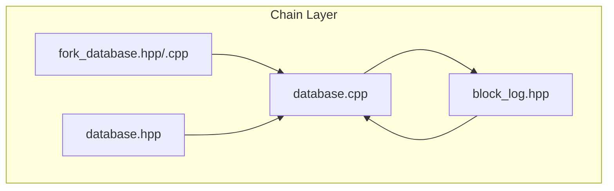
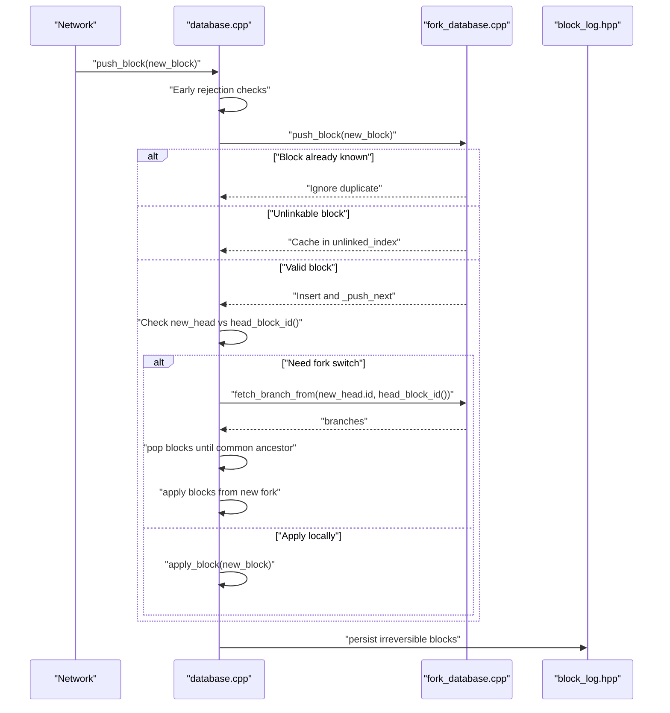
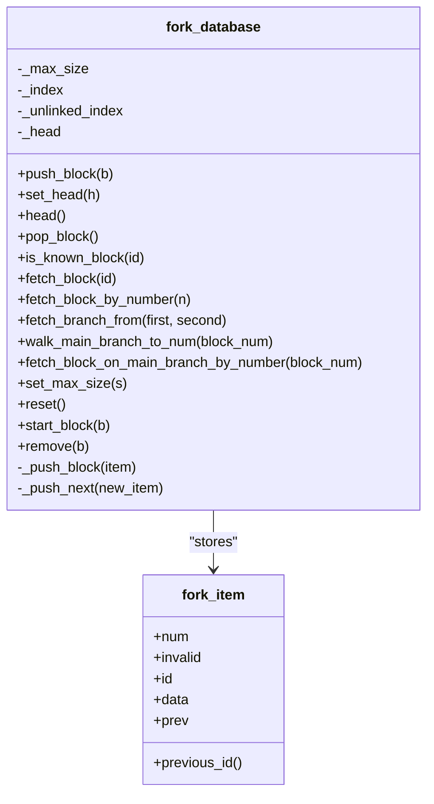
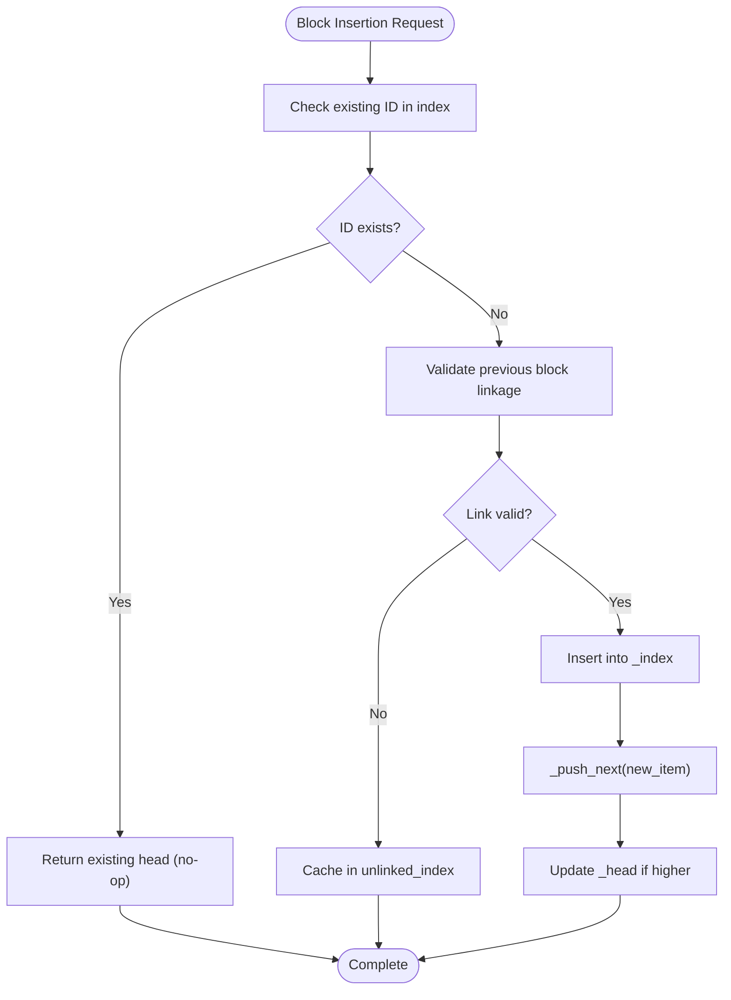
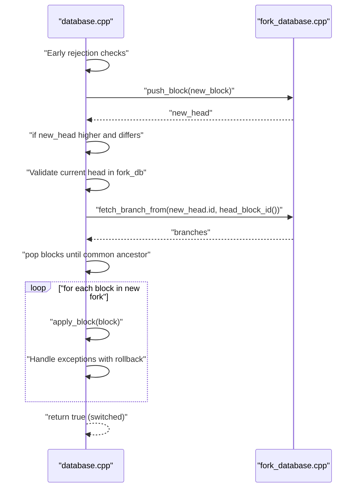
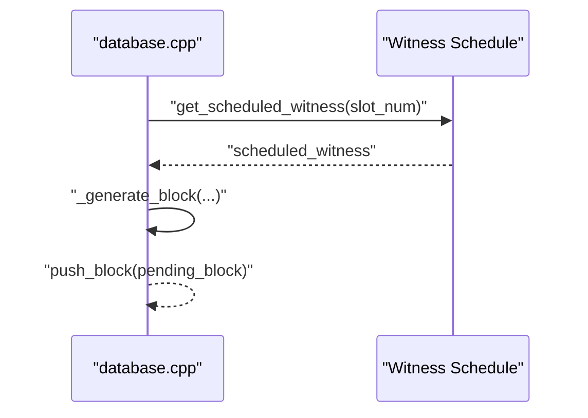
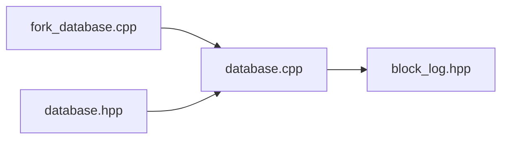

# Fork Resolution and Consensus

<cite>
**Referenced Files in This Document**
- [fork_database.hpp](file://libraries/chain/include/graphene/chain/fork_database.hpp)
- [fork_database.cpp](file://libraries/chain/fork_database.cpp)
- [database.hpp](file://libraries/chain/include/graphene/chain/database.hpp)
- [database.cpp](file://libraries/chain/database.cpp)
- [block_log.hpp](file://libraries/chain/include/graphene/chain/block_log.hpp)
</cite>

## Update Summary
**Changes Made**
- Enhanced out-of-order block caching and processing with improved `_push_next` mechanism
- Added comprehensive duplicate block detection and prevention
- Fixed dead code issues and improved error handling
- Strengthened fork database reliability for P2P synchronization
- Updated fork resolution logic with better early rejection mechanisms

## Table of Contents
1. [Introduction](#introduction)
2. [Project Structure](#project-structure)
3. [Core Components](#core-components)
4. [Architecture Overview](#architecture-overview)
5. [Detailed Component Analysis](#detailed-component-analysis)
6. [Dependency Analysis](#dependency-analysis)
7. [Performance Considerations](#performance-considerations)
8. [Troubleshooting Guide](#troubleshooting-guide)
9. [Conclusion](#conclusion)
10. [Appendices](#appendices)

## Introduction
This document explains the Fork Resolution and Consensus system that maintains blockchain integrity and handles network partitions. It focuses on the fork_database implementation for managing fork chains, selecting the best chain, and determining irreversible blocks. The system has been significantly enhanced with improved out-of-order block caching, duplicate block detection, and robust error handling to ensure reliable P2P synchronization.

## Project Structure
The fork resolution and consensus logic spans several core files:
- fork_database.hpp/cpp: In-memory fork chain storage, branch selection, and common ancestor detection with enhanced caching mechanisms
- database.hpp/cpp: Blockchain database integration, block pushing, chain reorganization, and irreversible block updates with improved early rejection logic
- block_log.hpp: Append-only persistence of blocks for recovery and irreversible state

**Diagram sources**
- [fork_database.hpp:53-122](file://libraries/chain/include/graphene/chain/fork_database.hpp#L53-L122)
- [fork_database.cpp:1-258](file://libraries/chain/fork_database.cpp#L1-L258)
- [database.hpp:36-561](file://libraries/chain/include/graphene/chain/database.hpp#L36-L561)
- [database.cpp:800-925](file://libraries/chain/database.cpp#L800-L925)
- [block_log.hpp:38-71](file://libraries/chain/include/graphene/chain/block_log.hpp#L38-L71)

**Section sources**
- [fork_database.hpp:1-125](file://libraries/chain/include/graphene/chain/fork_database.hpp#L1-L125)
- [fork_database.cpp:1-258](file://libraries/chain/fork_database.cpp#L1-L258)
- [database.hpp:1-561](file://libraries/chain/include/graphene/chain/database.hpp#L1-L561)
- [database.cpp:1-800](file://libraries/chain/database.cpp#L1-L800)
- [block_log.hpp:1-75](file://libraries/chain/include/graphene/chain/block_log.hpp#L1-L75)

## Core Components
- fork_database: Maintains a multi-indexed collection of fork items with enhanced out-of-order block caching, supports push, branch traversal, and common ancestor detection. It enforces a maximum fork depth and tracks the current head with improved duplicate detection.
- database: Integrates fork resolution into block application with sophisticated early rejection logic, performs chain reorganization when a better fork emerges, and updates last irreversible block (LIB) with enhanced error handling.
- block_log: Provides persistent storage for blocks, enabling recovery and serving as the source of irreversible blocks.

Key responsibilities:
- Track reversible blocks in memory (fork DB) with enhanced caching for out-of-order blocks
- Detect and select the best chain by comparing heads with improved validation
- Reorganize the chain when a higher fork becomes active with better error recovery
- Persist irreversible blocks to the block log with enhanced reliability
- Provide APIs to query fork branches and block IDs with improved duplicate handling

**Section sources**
- [fork_database.hpp:53-122](file://libraries/chain/include/graphene/chain/fork_database.hpp#L53-L122)
- [fork_database.cpp:33-90](file://libraries/chain/fork_database.cpp#L33-L90)
- [database.cpp:847-925](file://libraries/chain/database.cpp#L847-L925)
- [block_log.hpp:38-71](file://libraries/chain/include/graphene/chain/block_log.hpp#L38-L71)

## Architecture Overview
The fork resolution pipeline integrates with block application and persistence with enhanced early rejection and caching mechanisms:

**Diagram sources**
- [database.cpp:1037-1177](file://libraries/chain/database.cpp#L1037-L1177)
- [fork_database.cpp:34-84](file://libraries/chain/fork_database.cpp#L34-L84)
- [block_log.hpp:50-67](file://libraries/chain/include/graphene/chain/block_log.hpp#L50-L67)

## Detailed Component Analysis

### fork_database: Enhanced Fork Chain Management
The fork database stores blocks in a multi-index container supporting:
- Hashed index by block ID
- Hashed index by previous block ID
- Ordered index by block number

**Updated** Enhanced with improved out-of-order block caching and duplicate detection mechanisms.

It supports:
- Pushing a block and linking it to the previous block with duplicate prevention
- Tracking the current head with enhanced validation
- Fetching branches from two heads to a common ancestor
- Walking the main branch to a given block number
- Removing blocks and limiting fork depth
- **New**: Iterative processing of cached unlinked blocks via `_push_next`

**Diagram sources**
- [fork_database.hpp:20-122](file://libraries/chain/include/graphene/chain/fork_database.hpp#L20-L122)
- [fork_database.cpp:33-258](file://libraries/chain/fork_database.cpp#L33-L258)

Implementation highlights:
- **Enhanced duplicate detection**: Blocks are checked against existing IDs before insertion to prevent duplicate processing
- **Improved linking validation**: Ensures each new block's previous ID exists in the index and is not marked invalid
- **Robust unlinked block caching**: Cached blocks are processed iteratively when their parent appears via `_push_next`
- **Maximum fork depth enforcement**: Prevents unbounded growth; older blocks are pruned with enhanced cleanup
- **Better error handling**: Comprehensive exception handling for unlinkable blocks with logging

**Section sources**
- [fork_database.hpp:53-122](file://libraries/chain/include/graphene/chain/fork_database.hpp#L53-L122)
- [fork_database.cpp:34-103](file://libraries/chain/fork_database.cpp#L34-L103)

### Enhanced Duplicate Block Detection and Prevention
**New Section** The fork database now includes comprehensive duplicate block detection to prevent redundant processing and improve P2P synchronization reliability.

Duplicate detection mechanisms:
- Pre-insertion ID check against existing blocks in the index
- Prevention of duplicate processing during snapshot imports and P2P re-transmissions
- Efficient early rejection of already-applied blocks

**Diagram sources**
- [fork_database.cpp:48-84](file://libraries/chain/fork_database.cpp#L48-L84)

**Section sources**
- [fork_database.cpp:48-55](file://libraries/chain/fork_database.cpp#L48-L55)

### Branch Selection and Common Ancestor Detection
Branch selection relies on walking both branches backward until a common ancestor is found. The method returns two vectors representing the branches from each head to the common ancestor.

**Diagram sources**
- [fork_database.cpp:181-223](file://libraries/chain/fork_database.cpp#L181-L223)

**Section sources**
- [fork_database.cpp:181-223](file://libraries/chain/fork_database.cpp#L181-L223)

### Enhanced Chain Reorganization Process
**Updated** The chain reorganization process now includes improved early rejection logic and better error handling for enhanced P2P synchronization reliability.

When a new head is higher and does not build off the current head, the database:
- Performs sophisticated early rejection checks to prevent unnecessary fork switches
- Computes branches to the common ancestor with enhanced validation
- Pops blocks until reaching the common ancestor with improved error recovery
- Applies blocks from the new fork in reverse order with comprehensive exception handling
- Handles exceptions by invalidating the problematic fork and restoring the good fork with enhanced logging

**Diagram sources**
- [database.cpp:1037-1177](file://libraries/chain/database.cpp#L1037-L1177)
- [fork_database.cpp:181-223](file://libraries/chain/fork_database.cpp#L181-L223)

**Section sources**
- [database.cpp:1037-1177](file://libraries/chain/database.cpp#L1037-L1177)

### Irreversible Block Determination and Persistence
Irreversible blocks are determined by consensus thresholds and persisted to the block log. The database updates last irreversible block (LIB) and writes blocks to the log when they become irreversible.

**Diagram sources**
- [database.cpp:3889-3940](file://libraries/chain/database.cpp#L3889-L3940)
- [block_log.hpp:50-67](file://libraries/chain/include/graphene/chain/block_log.hpp#L50-L67)

**Section sources**
- [database.cpp:3889-3940](file://libraries/chain/database.cpp#L3889-L3940)
- [block_log.hpp:38-71](file://libraries/chain/include/graphene/chain/block_log.hpp#L38-L71)

### Witness Scheduling Integration and Block Production
Witness scheduling influences block production timing and eligibility. The database coordinates:
- Scheduled witness calculation for the block slot
- Validation of witness signature and version extensions
- Generation of new blocks with correct metadata and signatures

**Diagram sources**
- [database.cpp:987-1120](file://libraries/chain/database.cpp#L987-L1120)
- [database.cpp:1200-1240](file://libraries/chain/database.cpp#L1200-L1240)

**Section sources**
- [database.cpp:987-1120](file://libraries/chain/database.cpp#L987-L1120)
- [database.cpp:1200-1240](file://libraries/chain/database.cpp#L1200-L1240)

### Enhanced API Methods for Fork Detection, Chain Validation, and Recovery
**Updated** Enhanced with improved duplicate detection and better early rejection logic.

- Fork detection and branch retrieval:
  - get_block_ids_on_fork(head_of_fork): Returns ordered list of block IDs from the fork head back to the common ancestor
  - fetch_branch_from(first, second): Returns two branches leading to a common ancestor
- Chain validation:
  - validate_block(new_block, skip): Validates block Merkle root and size
- State recovery:
  - open(): Initializes database and starts fork DB at head block
  - reindex(): Replays blocks and restarts fork DB at the new head
  - find_block_id_for_num(block_num)/get_block_id_for_num(block_num): Resolves block ID across block log, fork DB, and TAPOS buffer with enhanced duplicate handling

**Section sources**
- [database.hpp:111-135](file://libraries/chain/include/graphene/chain/database.hpp#L111-L135)
- [database.cpp:561-580](file://libraries/chain/database.cpp#L561-L580)
- [database.cpp:738-792](file://libraries/chain/database.cpp#L738-L792)
- [database.cpp:206-230](file://libraries/chain/database.cpp#L206-L230)
- [database.cpp:476-515](file://libraries/chain/database.cpp#L476-L515)

### Examples of Enhanced Fork Scenarios and Resolution Processes
**Updated** Enhanced with improved out-of-order block handling and duplicate detection.

- Scenario A: Out-of-order arrival of blocks with improved caching
  - Behavior: New blocks are inserted into the unlinked cache and later inserted when their parent appears via `_push_next`
  - Mechanism: Enhanced `_push_next` iteratively processes pending blocks whose parent now exists, with comprehensive error handling
- Scenario B: Network partition resolves with a longer chain and improved early rejection
  - Behavior: The database performs sophisticated early rejection checks, detects a higher head, computes branches, pops blocks, and applies the new fork
  - Mechanism: Enhanced early rejection logic prevents unnecessary fork switches and improves P2P synchronization reliability
- Scenario C: Invalid block on a fork with improved error handling
  - Behavior: The fork is invalidated and removed; the database restores the good fork and throws the exception with enhanced logging
  - Mechanism: Comprehensive exception handling with rollback to previous state and improved error reporting

**Section sources**
- [fork_database.cpp:92-103](file://libraries/chain/fork_database.cpp#L92-L103)
- [database.cpp:1075-1087](file://libraries/chain/database.cpp#L1075-L1087)

## Dependency Analysis
The fork resolution system depends on:
- fork_database for in-memory fork chain management with enhanced caching and duplicate detection
- database for integrating fork resolution into block application and updating LIB with improved early rejection logic
- block_log for persistence of irreversible blocks

**Diagram sources**
- [fork_database.cpp:1-258](file://libraries/chain/fork_database.cpp#L1-L258)
- [database.cpp:1-800](file://libraries/chain/database.cpp#L1-L800)
- [block_log.hpp:1-75](file://libraries/chain/include/graphene/chain/block_log.hpp#L1-L75)

**Section sources**
- [fork_database.cpp:1-258](file://libraries/chain/fork_database.cpp#L1-L258)
- [database.cpp:1-800](file://libraries/chain/database.cpp#L1-L800)
- [block_log.hpp:1-75](file://libraries/chain/include/graphene/chain/block_log.hpp#L1-L75)

## Performance Considerations
**Updated** Enhanced with improved caching and duplicate detection mechanisms.

- Maximum fork depth: The fork database limits the maximum number of blocks that may be skipped in an out-of-order push, preventing excessive memory usage with enhanced cleanup
- Multi-index containers: Efficient lookups by block ID and previous ID minimize traversal costs with improved indexing
- **Enhanced caching**: Improved unlinked block caching with iterative processing via `_push_next` reduces memory pressure and improves P2P synchronization
- **Duplicate prevention**: Comprehensive duplicate detection prevents redundant processing and reduces CPU overhead
- Pruning: set_max_size prunes old blocks from both linked and unlinked indices to keep memory bounded with enhanced cleanup
- Reorganization cost: Reorganizing across deep forks requires popping and re-applying blocks; keeping forks shallow improves responsiveness with enhanced error recovery
- Persistence overhead: Writing to the block log is required for irreversible blocks; batching and flushing strategies can mitigate latency
- **Early rejection**: Sophisticated early rejection logic prevents unnecessary fork database operations and improves overall performance

[No sources needed since this section provides general guidance]

## Troubleshooting Guide
**Updated** Enhanced with improved error handling and duplicate detection.

Common issues and remedies:
- **Unlinkable block errors**: Occur when a block does not link to a known chain; the fork DB logs and caches the block for later insertion when its parent arrives with enhanced logging and processing
- **Invalid fork handling**: When reorganization fails, the database removes the problematic fork, restores the good fork, and rethrows the exception with comprehensive error recovery
- **Memory pressure**: Adjust shared memory sizing and monitor free memory; the database resizes shared memory when necessary with enhanced monitoring
- **Recovery mismatches**: During open/reindex, the database asserts chain state consistency with the block log and resets the fork DB accordingly with improved validation
- **Duplicate block processing**: The fork DB now prevents duplicate block processing, reducing CPU overhead and improving synchronization reliability
- **Early rejection failures**: Enhanced early rejection logic helps prevent unnecessary fork database operations and improves overall system performance

**Section sources**
- [fork_database.cpp:34-46](file://libraries/chain/fork_database.cpp#L34-L46)
- [database.cpp:1075-1087](file://libraries/chain/database.cpp#L1075-L1087)
- [database.cpp:876-904](file://libraries/chain/database.cpp#L876-L904)
- [database.cpp:397-430](file://libraries/chain/database.cpp#L397-L430)
- [database.cpp:206-268](file://libraries/chain/database.cpp#L206-L268)

## Conclusion
**Updated** The fork resolution and consensus system combines an efficient in-memory fork database with robust chain reorganization and irreversible block persistence. The system has been significantly enhanced with improved out-of-order block caching, duplicate detection, and comprehensive error handling to ensure reliable P2P synchronization. It integrates tightly with witness scheduling to ensure timely and valid block production. The enhanced APIs enable reliable fork detection, chain validation, and recovery, while performance controls keep resource usage manageable with improved reliability and synchronization capabilities.

[No sources needed since this section summarizes without analyzing specific files]

## Appendices

### Appendix A: Enhanced Key Data Structures and Complexity
**Updated** Enhanced with improved duplicate detection and caching mechanisms.

- fork_item: Stores block data, previous link, and invalid flag
- fork_database:
  - push_block: O(log N) average for insertions; unlinked insertion triggers iterative _push_next with duplicate prevention
  - fetch_branch_from: O(depth) to traverse both branches to common ancestor
  - walk_main_branch_to_num: O(depth) to reach a specific block number
  - set_max_size: O(N log N) worst-case pruning across indices with enhanced cleanup
  - **New**: Duplicate detection: O(1) lookup for existing block IDs before insertion
  - **New**: Enhanced caching: Iterative processing of up to MAX_BLOCK_REORDERING unlinked blocks

**Section sources**
- [fork_database.hpp:20-122](file://libraries/chain/include/graphene/chain/fork_database.hpp#L20-L122)
- [fork_database.cpp:48-103](file://libraries/chain/fork_database.cpp#L48-L103)