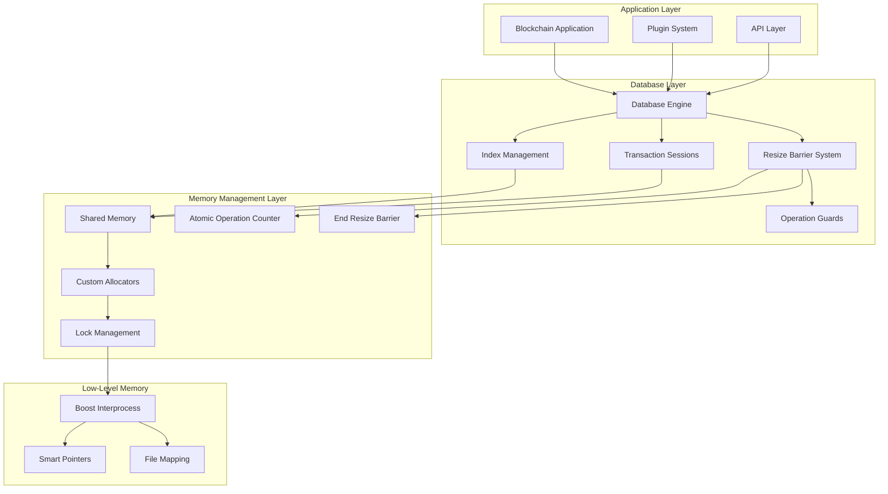
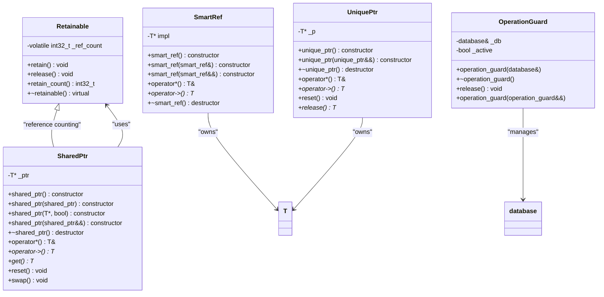
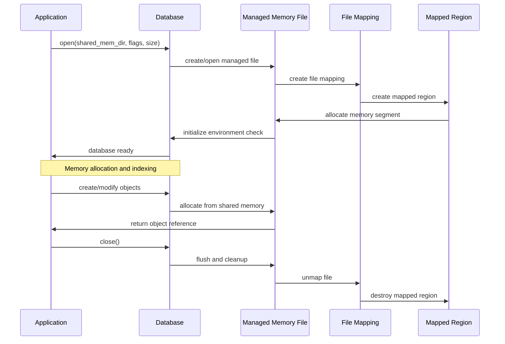
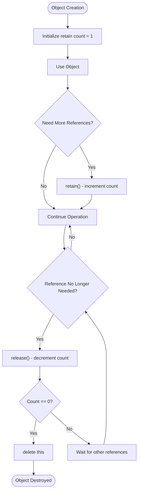
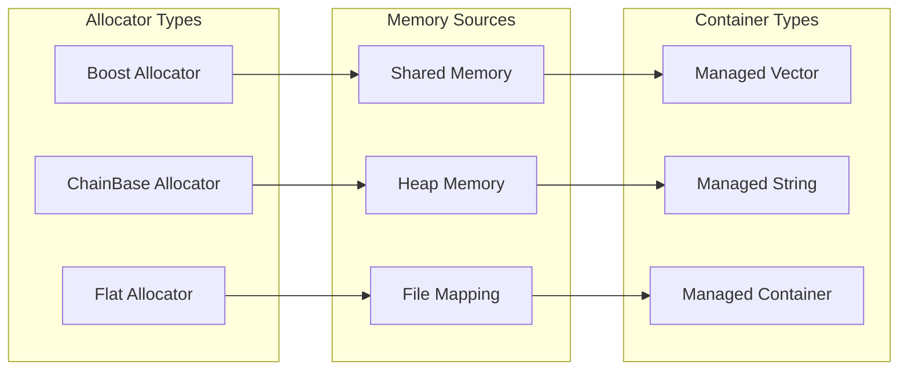
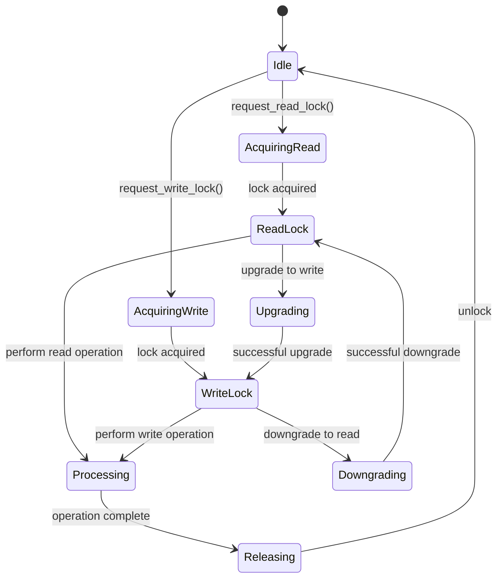
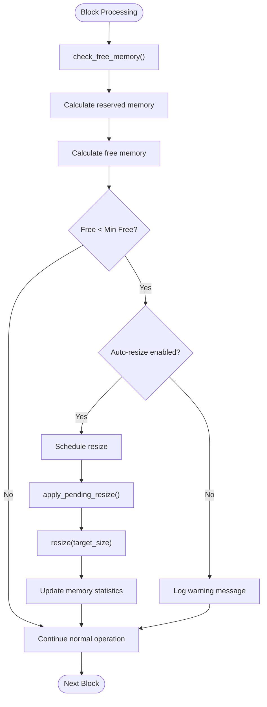
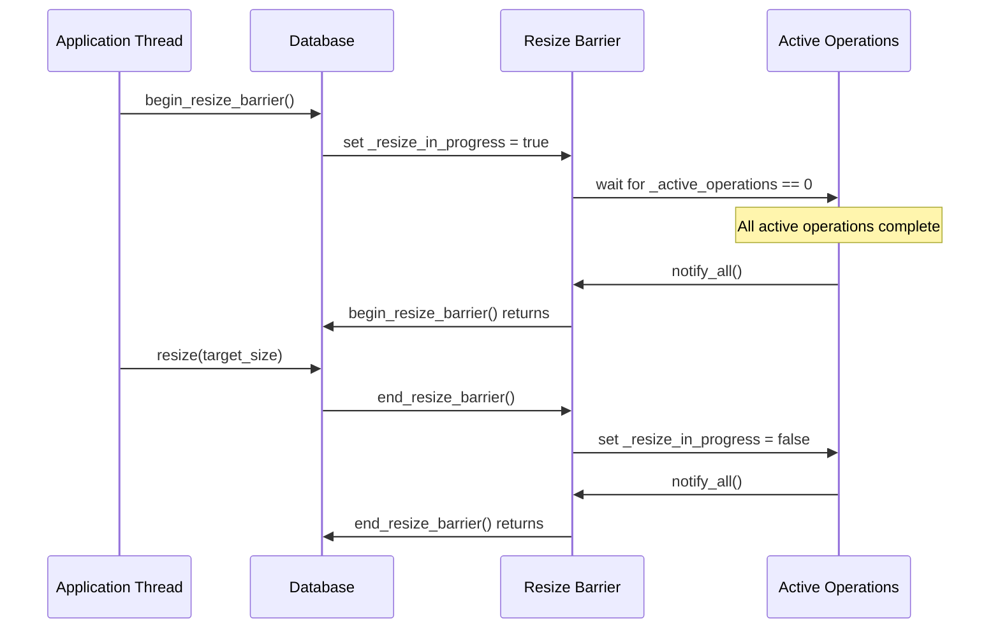
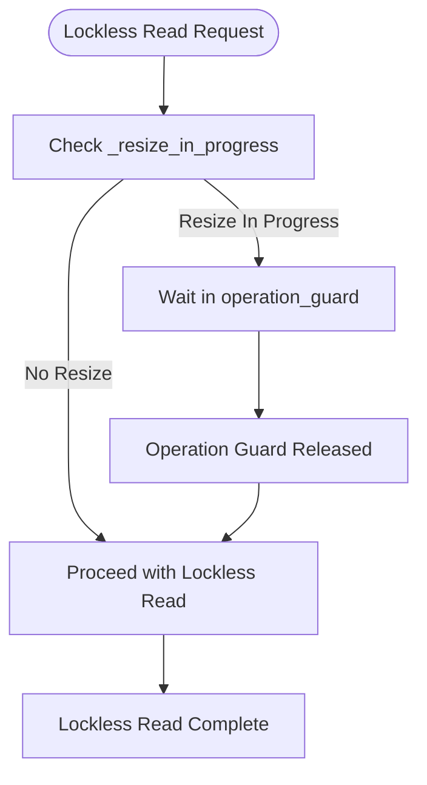
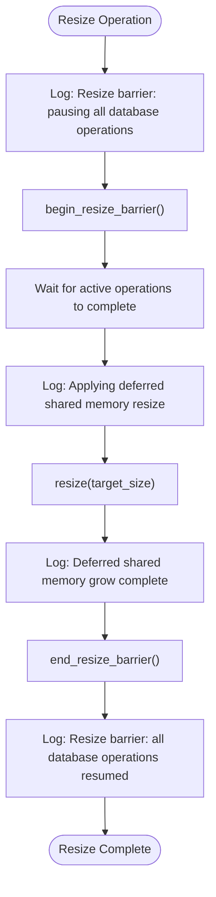

# Memory Management System

<cite>
**Referenced Files in This Document**
- [chainbase.hpp](file://thirdparty/chainbase/include/chainbase/chainbase.hpp)
- [chainbase.cpp](file://thirdparty/chainbase/src/chainbase.cpp)
- [database.cpp](file://libraries/chain/database.cpp)
- [plugin.cpp](file://plugins/chain/plugin.cpp)
- [shared_ptr.hpp](file://thirdparty/fc/include/fc/shared_ptr.hpp)
- [shared_ptr.cpp](file://thirdparty/fc/src/shared_ptr.cpp)
- [smart_ref_fwd.hpp](file://thirdparty/fc/include/fc/smart_ref_fwd.hpp)
- [smart_ref_impl.hpp](file://thirdparty/fc/include/fc/smart_ref_impl.hpp)
- [unique_ptr.hpp](file://thirdparty/fc/include/fc/unique_ptr.hpp)
- [file_mapping.hpp](file://thirdparty/fc/include/fc/interprocess/file_mapping.hpp)
- [file_mapping.cpp](file://thirdparty/fc/src/interprocess/file_mapping.cpp)
- [mmap_struct.hpp](file://thirdparty/fc/include/fc/interprocess/mmap_struct.hpp)
- [mmap_struct.cpp](file://thirdparty/fc/src/interprocess/mmap_struct.cpp)
- [flat.hpp](file://thirdparty/fc/include/fc/container/flat.hpp)
- [thread_specific.hpp](file://thirdparty/fc/include/fc/thread/thread_specific.hpp)
- [scoped_exit.hpp](file://thirdparty/fc/include/fc/scoped_exit.hpp)
- [aligned.hpp](file://thirdparty/fc/include/fc/aligned.hpp)
- [witness.cpp](file://plugins/witness/witness.cpp)
</cite>

## Update Summary
**Changes Made**
- Added comprehensive documentation for the new shared memory resize barrier system
- Documented the sophisticated atomic operation counter system
- Added detailed coverage of begin_resize_barrier() and end_resize_barrier() functions
- Documented operation guards for lockless reads and their role in preventing shared memory corruption
- Enhanced logging capabilities for resize barrier state transitions
- Updated memory monitoring and resizing sections with new barrier-based approach

## Table of Contents
1. [Introduction](#introduction)
2. [System Architecture](#system-architecture)
3. [Memory Management Components](#memory-management-components)
4. [Shared Memory System](#shared-memory-system)
5. [Reference Counting](#reference-counting)
6. [Smart Pointers and RAII](#smart-pointers-and-raii)
7. [Memory Allocation Strategies](#memory-allocation-strategies)
8. [Locking and Concurrency](#locking-and-concurrency)
9. [Memory Monitoring and Resizing](#memory-monitoring-and-resizing)
10. [Resize Barrier System](#resize-barrier-system)
11. [Operation Guards](#operation-guards)
12. [Enhanced Logging and Diagnostics](#enhanced-logging-and-diagnostics)
13. [Best Practices](#best-practices)
14. [Troubleshooting Guide](#troubleshooting-guide)
15. [Conclusion](#conclusion)

## Introduction

The VIZ CPP Node memory management system is built around a sophisticated shared memory architecture that enables high-performance blockchain operations. The system combines traditional C++ memory management with advanced inter-process shared memory techniques, providing both safety and performance for blockchain state persistence and concurrent access.

The memory management system centers on ChainBase, a specialized database framework that uses Boost.Interprocess for shared memory management, combined with FC library utilities for smart pointers, RAII patterns, and memory-safe operations. This architecture supports the demanding requirements of blockchain applications, including persistent state, concurrent access, and automatic memory management.

**Updated** The system now includes a sophisticated resize barrier mechanism that provides atomic operations during shared memory resizing, preventing corruption and ensuring data consistency during memory expansion operations.

## System Architecture

The memory management system follows a layered architecture that separates concerns between low-level memory management, database operations, and application-level abstractions.



**Diagram sources**
- [chainbase.hpp:1319-1328](file://thirdparty/chainbase/include/chainbase/chainbase.hpp#L1319-L1328)
- [database.cpp:613-653](file://libraries/chain/database.cpp#L613-L653)
- [witness.cpp:503-507](file://plugins/witness/witness.cpp#L503-L507)

## Memory Management Components

### Core Memory Management Classes

The system provides several fundamental memory management components that work together to provide robust memory handling:



**Diagram sources**
- [shared_ptr.hpp:13-64](file://thirdparty/fc/include/fc/shared_ptr.hpp#L13-L64)
- [smart_ref_fwd.hpp:9-52](file://thirdparty/fc/include/fc/smart_ref_fwd.hpp#L9-L52)
- [unique_ptr.hpp:7-66](file://thirdparty/fc/include/fc/unique_ptr.hpp#L7-L66)
- [chainbase.hpp:1078-1111](file://thirdparty/chainbase/include/chainbase/chainbase.hpp#L1078-L1111)

**Section sources**
- [shared_ptr.hpp:1-64](file://thirdparty/fc/include/fc/shared_ptr.hpp#L1-L64)
- [smart_ref_fwd.hpp:1-53](file://thirdparty/fc/include/fc/smart_ref_fwd.hpp#L1-L53)
- [unique_ptr.hpp:1-68](file://thirdparty/fc/include/fc/unique_ptr.hpp#L1-L68)
- [chainbase.hpp:1078-1111](file://thirdparty/chainbase/include/chainbase/chainbase.hpp#L1078-L1111)

## Shared Memory System

### Managed Memory File Architecture

The shared memory system uses Boost.Interprocess to create and manage memory-mapped files that serve as the foundation for the database storage:



**Diagram sources**
- [chainbase.cpp:70-102](file://thirdparty/chainbase/src/chainbase.cpp#L70-L102)
- [file_mapping.cpp:9-41](file://thirdparty/fc/src/interprocess/file_mapping.cpp#L9-L41)
- [mmap_struct.cpp:20-44](file://thirdparty/fc/src/interprocess/mmap_struct.cpp#L20-L44)

### Memory Layout and Organization

The shared memory system organizes data in a structured manner optimized for blockchain operations:

| Memory Segment | Purpose | Size | Protection |
|----------------|---------|------|------------|
| Environment Check | System compatibility verification | Fixed size | Read-only |
| Index Tables | Object indexing structures | Dynamic | Read-write |
| Object Storage | Actual blockchain data | Dynamic | Read-write |
| Undo Buffers | Transaction rollback support | Dynamic | Read-write |
| Lock Information | Concurrency control data | Fixed size | Read-write |
| Resize Barrier State | Atomic operation counters | Fixed size | Read-write |

**Section sources**
- [chainbase.cpp:70-102](file://thirdparty/chainbase/src/chainbase.cpp#L70-L102)
- [chainbase.hpp:1189-1193](file://thirdparty/chainbase/include/chainbase/chainbase.hpp#L1189-L1193)
- [chainbase.hpp:1319-1328](file://thirdparty/chainbase/include/chainbase/chainbase.hpp#L1319-L1328)

## Reference Counting

### Retainable Object Pattern

The reference counting system uses the retainable pattern to provide automatic memory management for shared objects:



**Diagram sources**
- [shared_ptr.cpp:16-25](file://thirdparty/fc/src/shared_ptr.cpp#L16-L25)

### Thread-Safe Reference Operations

The reference counting implementation ensures thread safety through atomic operations and memory barriers:

| Operation | Memory Ordering | Purpose |
|-----------|----------------|---------|
| retain() | relaxed | Increment reference count |
| release() | release | Decrement count with acquire barrier |
| retain_count() | acquire | Read current count safely |

**Section sources**
- [shared_ptr.cpp:1-30](file://thirdparty/fc/src/shared_ptr.cpp#L1-L30)
- [shared_ptr.hpp:13-28](file://thirdparty/fc/include/fc/shared_ptr.hpp#L13-L28)

## Smart Pointers and RAII

### Smart Pointer Implementation

The FC library provides several smart pointer implementations that enhance memory safety:

```mermaid
classDiagram
class SmartRef {
-T* impl
+smart_ref(U&&) constructor
+smart_ref(const smart_ref&) constructor
+smart_ref(smart_ref&&) constructor
+operator*() T&
+operator->() T*
+operator=(smart_ref&&) T&
+~smart_ref() destructor
}
class ScopedExit {
-Callback callback
+scoped_exit(C&&) constructor
+~scoped_exit() destructor
+operator=(scoped_exit&&) scoped_exit&
}
class Aligned {
-union { T _align; char _data[S]; } _store
+operator char*()
+operator const char*() const
}
SmartRef --> T : "heap allocated"
ScopedExit --> Callback : "executes on destruction"
Aligned --> T : "aligned storage"
```

**Diagram sources**
- [smart_ref_impl.hpp:40-134](file://thirdparty/fc/include/fc/smart_ref_impl.hpp#L40-L134)
- [scoped_exit.hpp:5-40](file://thirdparty/fc/include/fc/scoped_exit.hpp#L5-L40)
- [aligned.hpp:4-21](file://thirdparty/fc/include/fc/aligned.hpp#L4-L21)

### RAII Resource Management

The scoped_exit pattern ensures proper resource cleanup:

**Section sources**
- [smart_ref_fwd.hpp:1-53](file://thirdparty/fc/include/fc/smart_ref_fwd.hpp#L1-L53)
- [smart_ref_impl.hpp:1-136](file://thirdparty/fc/include/fc/smart_ref_impl.hpp#L1-L136)
- [scoped_exit.hpp:1-40](file://thirdparty/fc/include/fc/scoped_exit.hpp#L1-L40)
- [aligned.hpp:1-21](file://thirdparty/fc/include/fc/aligned.hpp#L1-L21)

## Memory Allocation Strategies

### Custom Allocators

ChainBase uses custom allocators that integrate with the shared memory system:



**Diagram sources**
- [chainbase.hpp:53-59](file://thirdparty/chainbase/include/chainbase/chainbase.hpp#L53-L59)
- [flat.hpp:1-140](file://thirdparty/fc/include/fc/container/flat.hpp#L1-L140)

### Memory Alignment and Padding

The aligned storage template ensures proper memory alignment for different data types:

**Section sources**
- [chainbase.hpp:53-59](file://thirdparty/chainbase/include/chainbase/chainbase.hpp#L53-L59)
- [flat.hpp:1-140](file://thirdparty/fc/include/fc/container/flat.hpp#L1-L140)
- [aligned.hpp:1-21](file://thirdparty/fc/include/fc/aligned.hpp#L1-L21)

## Locking and Concurrency

### Reader-Writer Lock System

The database implements a sophisticated locking mechanism to handle concurrent access:



**Diagram sources**
- [chainbase.hpp:1070-1167](file://thirdparty/chainbase/include/chainbase/chainbase.hpp#L1070-L1167)

### Lock Timeout and Retry Mechanisms

The system implements configurable timeout and retry mechanisms for lock acquisition:

| Lock Type | Default Wait Time | Max Retries | Behavior |
|-----------|------------------|-------------|----------|
| Weak Read | 500,000 μs | 3 | Fail after retries |
| Strong Read | 1,000,000 μs | 100,000 | Extended wait period |
| Weak Write | 500,000 μs | 3 | Fail after retries |
| Strong Write | 1,000,000 μs | 100,000 | Extended wait period |

**Section sources**
- [chainbase.hpp:1070-1167](file://thirdparty/chainbase/include/chainbase/chainbase.hpp#L1070-L1167)

## Memory Monitoring and Resizing

### Automatic Memory Management

The database includes sophisticated memory monitoring and automatic resizing capabilities:



**Diagram sources**
- [database.cpp:648-682](file://libraries/chain/database.cpp#L648-L682)
- [database.cpp:609-646](file://libraries/chain/database.cpp#L609-L646)

### Memory Configuration Options

The system provides extensive configuration options for memory management:

| Configuration | Default Value | Description |
|---------------|---------------|-------------|
| shared-file-dir | "state" | Location of shared memory files |
| shared-file-size | "2G" | Initial shared memory size |
| inc-shared-file-size | "2G" | Increment size for growth |
| min-free-shared-file-size | Configurable | Minimum free memory threshold |
| read_wait_micro | 500,000 | Read lock wait time |
| max_read_wait_retries | 3 | Read lock retry attempts |
| write_wait_micro | 500,000 | Write lock wait time |
| max_write_wait_retries | 3 | Write lock retry attempts |

**Section sources**
- [plugin.cpp:199-211](file://plugins/chain/plugin.cpp#L199-L211)
- [database.cpp:648-682](file://libraries/chain/database.cpp#L648-L682)

## Resize Barrier System

### Atomic Operation Counter System

The resize barrier system introduces a sophisticated atomic operation counter that tracks active database operations during memory resizing:



**Diagram sources**
- [chainbase.cpp:295-310](file://thirdparty/chainbase/src/chainbase.cpp#L295-L310)
- [chainbase.hpp:1319-1323](file://thirdparty/chainbase/include/chainbase/chainbase.hpp#L1319-L1323)

### Resize Barrier Implementation Details

The resize barrier system provides atomic operations during shared memory resizing:

| Component | Data Type | Purpose |
|-----------|-----------|---------|
| _resize_in_progress | std::atomic<bool> | Indicates resize operation status |
| _active_operations | std::atomic<int32_t> | Counts currently active operations |
| _resize_barrier_mutex | std::mutex | Synchronization primitive |
| _resize_barrier_cv | std::condition_variable | Condition variable for blocking |

**Section sources**
- [chainbase.cpp:295-310](file://thirdparty/chainbase/src/chainbase.cpp#L295-L310)
- [chainbase.hpp:1319-1323](file://thirdparty/chainbase/include/chainbase/chainbase.hpp#L1319-L1323)

## Operation Guards

### Lockless Read Protection

Operation guards provide protection for lockless reads that do not acquire chainbase locks, preventing shared memory corruption during resize operations:



**Diagram sources**
- [chainbase.hpp:1078-1111](file://thirdparty/chainbase/include/chainbase/chainbase.hpp#L1078-L1111)
- [database.cpp:1554-1556](file://libraries/chain/database.cpp#L1554-L1556)

### Operation Guard Lifecycle

Operation guards participate in the resize barrier system:

1. **Construction**: Calls `enter_operation()` which blocks if resize is in progress
2. **Destruction**: Calls `exit_operation()` which decrements counter and notifies resize thread
3. **Manual Release**: Can be explicitly released before scope exit

**Section sources**
- [chainbase.hpp:1078-1111](file://thirdparty/chainbase/include/chainbase/chainbase.hpp#L1078-L1111)
- [chainbase.cpp:278-293](file://thirdparty/chainbase/src/chainbase.cpp#L278-L293)
- [database.cpp:1554-1556](file://libraries/chain/database.cpp#L1554-L1556)

## Enhanced Logging and Diagnostics

### Resize Barrier State Transition Logging

The system provides enhanced logging capabilities for resize barrier state transitions:



**Diagram sources**
- [database.cpp:624-652](file://libraries/chain/database.cpp#L624-L652)

### Diagnostic Information

The resize barrier system logs comprehensive information about memory usage and resize operations:

- **Current block number**: Tracks resize timing relative to blockchain progress
- **Used memory before/after**: Shows actual memory consumption changes
- **Target size**: Displays planned resize target
- **Free memory**: Monitors available memory after resize

**Section sources**
- [database.cpp:624-652](file://libraries/chain/database.cpp#L624-L652)
- [database.cpp:577-610](file://libraries/chain/database.cpp#L577-L610)

## Best Practices

### Memory Management Guidelines

1. **Use Smart Pointers**: Prefer smart pointers over raw pointers for automatic memory management
2. **Implement RAII**: Ensure resources are properly cleaned up using RAII patterns
3. **Monitor Memory Usage**: Regularly check memory usage and implement appropriate resizing strategies
4. **Use Appropriate Locking**: Choose the right lock type based on operation requirements
5. **Handle Exceptions**: Ensure proper cleanup in exception scenarios using scoped_exit patterns
6. **Respect Resize Barriers**: Always use operation guards for lockless reads during resize operations
7. **Implement Proper Synchronization**: Use resize barriers for all shared memory modifications

### Performance Optimization Tips

1. **Batch Operations**: Group related operations to minimize lock contention
2. **Efficient Allocators**: Use appropriate allocators for different data types
3. **Memory Alignment**: Ensure proper alignment for optimal performance
4. **Undo Buffer Management**: Monitor and manage undo buffer sizes appropriately
5. **Operation Guard Usage**: Use operation guards strategically to prevent shared memory corruption
6. **Resize Timing**: Schedule resizes during maintenance windows when possible

## Troubleshooting Guide

### Common Memory Issues

**Memory Exhaustion Errors**
- Check free memory thresholds and adjust `min-free-shared-file-size`
- Review application memory usage patterns
- Consider implementing more aggressive garbage collection
- Monitor resize barrier operations for blocking issues

**Lock Contention Problems**
- Analyze lock wait times and adjust timeouts
- Review concurrent access patterns
- Consider reducing lock scope where possible
- Check operation guard usage for proper synchronization

**Shared Memory Corruption**
- Verify environment compatibility checks pass
- Check file permissions and disk space
- Review concurrent access patterns for race conditions
- Monitor resize barrier state transitions

**Resize Barrier Deadlocks**
- Ensure all operation guards are properly released
- Check for nested resize operations
- Verify atomic operation counter integrity
- Monitor condition variable notifications

### Diagnostic Tools

The system provides several diagnostic capabilities:

- Memory usage logging with periodic updates
- Lock contention monitoring
- Environment compatibility verification
- Automatic memory resizing notifications
- Resize barrier state transition logging
- Operation guard lifecycle tracking

**Section sources**
- [database.cpp:648-682](file://libraries/chain/database.cpp#L648-L682)
- [chainbase.cpp:80-89](file://thirdparty/chainbase/src/chainbase.cpp#L80-L89)
- [database.cpp:624-652](file://libraries/chain/database.cpp#L624-L652)

## Conclusion

The VIZ CPP Node memory management system represents a sophisticated approach to handling blockchain-specific memory requirements. By combining shared memory architectures with modern C++ memory management techniques, the system achieves both high performance and reliability.

**Updated** The recent addition of the resize barrier system significantly enhances the system's ability to handle dynamic memory growth while maintaining data integrity and preventing corruption during shared memory modifications.

Key strengths of the system include:

- **High Performance**: Shared memory eliminates context switching overhead
- **Reliability**: Comprehensive error checking and recovery mechanisms
- **Scalability**: Automatic memory resizing and monitoring with atomic operations
- **Safety**: Extensive use of RAII and smart pointers with operation guard protection
- **Flexibility**: Configurable parameters for different deployment scenarios
- **Atomic Operations**: Sophisticated resize barrier system with atomic operation counters
- **Enhanced Diagnostics**: Comprehensive logging for resize barrier state transitions

The system successfully balances the competing demands of blockchain applications: maintaining fast access to persistent state while ensuring data integrity, providing mechanisms for graceful degradation under memory pressure, and protecting against corruption during critical memory operations.

The resize barrier system, with its atomic operation counter and operation guard mechanism, provides a robust foundation for safe shared memory resizing operations, making the system more resilient to memory pressure and enabling seamless scaling of blockchain state storage.