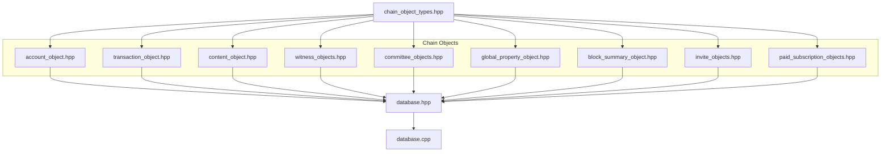
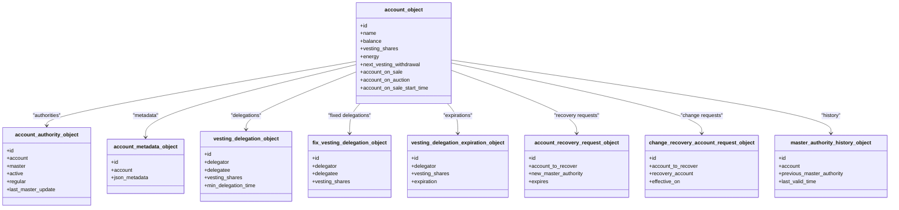
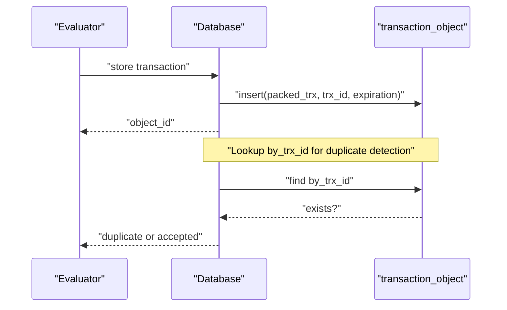
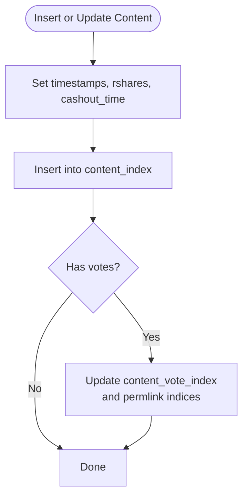
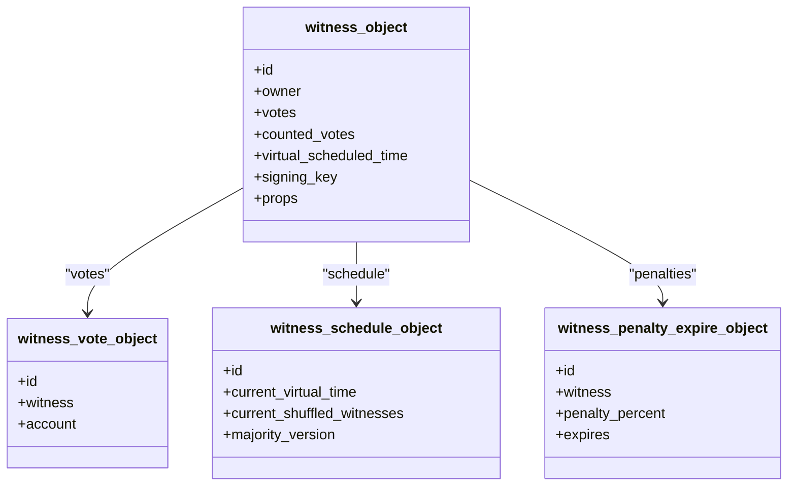
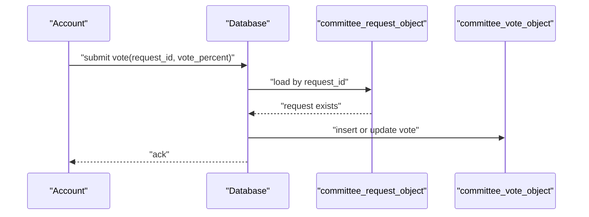
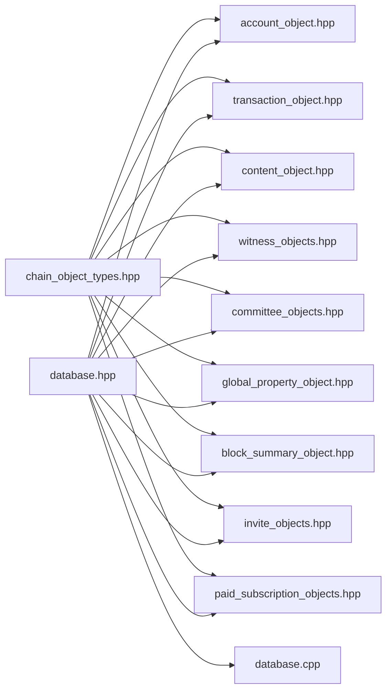

# Object Model and Persistence

<cite>
**Referenced Files in This Document**
- [chain_object_types.hpp](file://libraries/chain/include/graphene/chain/chain_object_types.hpp)
- [account_object.hpp](file://libraries/chain/include/graphene/chain/account_object.hpp)
- [transaction_object.hpp](file://libraries/chain/include/graphene/chain/transaction_object.hpp)
- [content_object.hpp](file://libraries/chain/include/graphene/chain/content_object.hpp)
- [witness_objects.hpp](file://libraries/chain/include/graphene/chain/witness_objects.hpp)
- [committee_objects.hpp](file://libraries/chain/include/graphene/chain/committee_objects.hpp)
- [database.hpp](file://libraries/chain/include/graphene/chain/database.hpp)
- [database.cpp](file://libraries/chain/database.cpp)
- [global_property_object.hpp](file://libraries/chain/include/graphene/chain/global_property_object.hpp)
- [block_summary_object.hpp](file://libraries/chain/include/graphene/chain/block_summary_object.hpp)
- [invite_objects.hpp](file://libraries/chain/include/graphene/chain/invite_objects.hpp)
- [paid_subscription_objects.hpp](file://libraries/chain/include/graphene/chain/paid_subscription_objects.hpp)
- [chain_objects.cpp](file://libraries/chain/chain_objects.cpp)
</cite>

## Table of Contents
1. [Introduction](#introduction)
2. [Project Structure](#project-structure)
3. [Core Components](#core-components)
4. [Architecture Overview](#architecture-overview)
5. [Detailed Component Analysis](#detailed-component-analysis)
6. [Dependency Analysis](#dependency-analysis)
7. [Performance Considerations](#performance-considerations)
8. [Troubleshooting Guide](#troubleshooting-guide)
9. [Conclusion](#conclusion)
10. [Appendices](#appendices)

## Introduction
This document describes the Object Model and Persistence system that defines the complete blockchain data structure in the VIZ C++ node. It documents the object types (account_object, transaction_object, content_object, witness_object, committee_object, and related objects), their schemas, field types, and validation rules as defined in the chain object type registry. It explains lifecycle management (creation, modification, deletion), indexing strategies via multi-index containers, serialization/deserialization, and persistence mechanisms. It also covers relationships among object types, practical examples of object creation/query/manipulation, and considerations for versioning and schema evolution.

## Project Structure
The object model and persistence are primarily defined in the Chain library under libraries/chain. Key areas:
- Object type registry and shared types: libraries/chain/include/graphene/chain/chain_object_types.hpp
- Object schemas and indices: libraries/chain/include/graphene/chain/*.hpp
- Database interface and persistence: libraries/chain/include/graphene/chain/database.hpp and implementation libraries/chain/database.cpp
- Supporting property and summary objects: libraries/chain/include/graphene/chain/global_property_object.hpp, block_summary_object.hpp, etc.

**Diagram sources**
- [chain_object_types.hpp](file://libraries/chain/include/graphene/chain/chain_object_types.hpp#L44-L144)
- [account_object.hpp](file://libraries/chain/include/graphene/chain/account_object.hpp#L20-L565)
- [transaction_object.hpp](file://libraries/chain/include/graphene/chain/transaction_object.hpp#L19-L56)
- [content_object.hpp](file://libraries/chain/include/graphene/chain/content_object.hpp#L56-L270)
- [witness_objects.hpp](file://libraries/chain/include/graphene/chain/witness_objects.hpp#L27-L313)
- [committee_objects.hpp](file://libraries/chain/include/graphene/chain/committee_objects.hpp#L15-L137)
- [global_property_object.hpp](file://libraries/chain/include/graphene/chain/global_property_object.hpp#L24-L180)
- [block_summary_object.hpp](file://libraries/chain/include/graphene/chain/block_summary_object.hpp#L19-L49)
- [invite_objects.hpp](file://libraries/chain/include/graphene/chain/invite_objects.hpp#L14-L72)
- [paid_subscription_objects.hpp](file://libraries/chain/include/graphene/chain/paid_subscription_objects.hpp#L15-L121)
- [database.hpp](file://libraries/chain/include/graphene/chain/database.hpp#L36-L200)
- [database.cpp](file://libraries/chain/database.cpp#L198-L200)

**Section sources**
- [chain_object_types.hpp](file://libraries/chain/include/graphene/chain/chain_object_types.hpp#L44-L144)
- [database.hpp](file://libraries/chain/include/graphene/chain/database.hpp#L36-L200)

## Core Components
This section summarizes the primary object types and their roles in the blockchain state.

- Dynamic Global Property
  - Purpose: Tracks global blockchain state (head block, supply, witness participation, reserve ratios).
  - Schema: See [dynamic_global_property_object](file://libraries/chain/include/graphene/chain/global_property_object.hpp#L24-L133).
  - Index: Single-entry unique index by id.

- Account and Related Entities
  - account_object: Core account state (balances, vesting, voting power, auction fields).
  - account_authority_object: Master/Active/Regular authorities with updates.
  - account_metadata_object: JSON metadata per account.
  - Vesting delegation objects: Delegation, fixed delegation, and expiration.
  - Recovery and master authority history objects.
  - References: [account_object.hpp](file://libraries/chain/include/graphene/chain/account_object.hpp#L20-L565).

- Transaction
  - transaction_object: Deduplication and expiration tracking for transactions.
  - Index: by_id (unique), by_trx_id (hashed), by_expiration (ordered).
  - Reference: [transaction_object.hpp](file://libraries/chain/include/graphene/chain/transaction_object.hpp#L19-L56).

- Content and Discussions
  - content_object: Post/article state (timestamps, rshares, cashout, payouts).
  - content_type_object: Title/body/metadata for content.
  - content_vote_object: Per-voter per-content vote records.
  - Indices: by_id, by_cashout_time, by_permlink, by_root, by_parent, and more; plus content_vote indices.
  - Reference: [content_object.hpp](file://libraries/chain/include/graphene/chain/content_object.hpp#L56-L270).

- Witnesses and Voting
  - witness_object: Witness identity, votes, virtual scheduling, signing key, props.
  - witness_vote_object: Voter-to-witness mapping.
  - witness_schedule_object: Current shuffled witnesses and majority version.
  - References: [witness_objects.hpp](file://libraries/chain/include/graphene/chain/witness_objects.hpp#L27-L313).

- Committee and Proposals
  - committee_request_object: Request metadata, amounts, timing, status, payouts.
  - committee_vote_object: Voter support per request.
  - References: [committee_objects.hpp](file://libraries/chain/include/graphene/chain/committee_objects.hpp#L15-L137).

- Block Summary
  - block_summary_object: Minimal info for TaPOS checks.
  - Reference: [block_summary_object.hpp](file://libraries/chain/include/graphene/chain/block_summary_object.hpp#L19-L49).

- Invites and Paid Subscriptions
  - invite_object: Invite issuance, keys, balances, status.
  - paid_subscription_object and paid_subscribe_object: Creator subscriptions and subscriber records.
  - References: [invite_objects.hpp](file://libraries/chain/include/graphene/chain/invite_objects.hpp#L14-L72), [paid_subscription_objects.hpp](file://libraries/chain/include/graphene/chain/paid_subscription_objects.hpp#L15-L121).

**Section sources**
- [global_property_object.hpp](file://libraries/chain/include/graphene/chain/global_property_object.hpp#L24-L180)
- [account_object.hpp](file://libraries/chain/include/graphene/chain/account_object.hpp#L20-L565)
- [transaction_object.hpp](file://libraries/chain/include/graphene/chain/transaction_object.hpp#L19-L56)
- [content_object.hpp](file://libraries/chain/include/graphene/chain/content_object.hpp#L56-L270)
- [witness_objects.hpp](file://libraries/chain/include/graphene/chain/witness_objects.hpp#L27-L313)
- [committee_objects.hpp](file://libraries/chain/include/graphene/chain/committee_objects.hpp#L15-L137)
- [block_summary_object.hpp](file://libraries/chain/include/graphene/chain/block_summary_object.hpp#L19-L49)
- [invite_objects.hpp](file://libraries/chain/include/graphene/chain/invite_objects.hpp#L14-L72)
- [paid_subscription_objects.hpp](file://libraries/chain/include/graphene/chain/paid_subscription_objects.hpp#L15-L121)

## Architecture Overview
The persistence layer is built on chainbase, which provides a typed object store with multi-index containers. The database class extends chainbase::database and exposes blockchain-specific operations. Object schemas are declared with Boost.MultiIndex indices; serialization is handled by fc::raw and reflection macros.

```mermaid
classDiagram
class Database {
+open(data_dir, shared_mem_dir, ...)
+reindex(...)
+push_block(...)
+push_transaction(...)
+get_account(name)
+get_content(author, permlink)
+get_witness(owner)
+get_dynamic_global_properties()
}
class Object {
+id
}
class dynamic_global_property_object
class account_object
class account_authority_object
class witness_object
class transaction_object
class content_object
class content_type_object
class content_vote_object
class witness_vote_object
class witness_schedule_object
class committee_request_object
class committee_vote_object
class block_summary_object
class invite_object
class paid_subscription_object
class paid_subscribe_object
Database --> dynamic_global_property_object : "manages"
Database --> account_object : "manages"
Database --> witness_object : "manages"
Database --> transaction_object : "manages"
Database --> content_object : "manages"
Database --> content_type_object : "manages"
Database --> content_vote_object : "manages"
Database --> witness_vote_object : "manages"
Database --> witness_schedule_object : "manages"
Database --> committee_request_object : "manages"
Database --> committee_vote_object : "manages"
Database --> block_summary_object : "manages"
Database --> invite_object : "manages"
Database --> paid_subscription_object : "manages"
Database --> paid_subscribe_object : "manages"
```

**Diagram sources**
- [database.hpp](file://libraries/chain/include/graphene/chain/database.hpp#L36-L200)
- [global_property_object.hpp](file://libraries/chain/include/graphene/chain/global_property_object.hpp#L24-L180)
- [account_object.hpp](file://libraries/chain/include/graphene/chain/account_object.hpp#L20-L565)
- [witness_objects.hpp](file://libraries/chain/include/graphene/chain/witness_objects.hpp#L27-L313)
- [transaction_object.hpp](file://libraries/chain/include/graphene/chain/transaction_object.hpp#L19-L56)
- [content_object.hpp](file://libraries/chain/include/graphene/chain/content_object.hpp#L56-L270)
- [committee_objects.hpp](file://libraries/chain/include/graphene/chain/committee_objects.hpp#L15-L137)
- [block_summary_object.hpp](file://libraries/chain/include/graphene/chain/block_summary_object.hpp#L19-L49)
- [invite_objects.hpp](file://libraries/chain/include/graphene/chain/invite_objects.hpp#L14-L72)
- [paid_subscription_objects.hpp](file://libraries/chain/include/graphene/chain/paid_subscription_objects.hpp#L15-L121)

## Detailed Component Analysis

### Object Type Registry and Shared Types
- Defines the canonical object_type enumeration and shared type aliases (object_id<>).
- Declares shared_string and buffer_type and provides fc::variant/raw serialization hooks for object_id and buffers.
- Provides FC_REFLECT_ENUM for object_type and FC_REFLECT_TYPENAME registrations.

Key references:
- Enumerations and aliases: [chain_object_types.hpp](file://libraries/chain/include/graphene/chain/chain_object_types.hpp#L44-L144)
- Serialization helpers: [chain_object_types.hpp](file://libraries/chain/include/graphene/chain/chain_object_types.hpp#L151-L207)

**Section sources**
- [chain_object_types.hpp](file://libraries/chain/include/graphene/chain/chain_object_types.hpp#L44-L144)
- [chain_object_types.hpp](file://libraries/chain/include/graphene/chain/chain_object_types.hpp#L151-L207)

### Account Object Lifecycle and Indices
- Creation: Constructed via constructor templates; stored via chainbase insert/update.
- Modification: Fields updated by evaluators; indices maintained automatically.
- Deletion: Removed when account is deleted or merged.
- Indices:
  - by_id (unique)
  - by_name (unique, lexicographic)
  - by_account_on_sale/by_account_on_auction/by_subaccount_on_sale (non-unique booleans)
  - by_account_on_sale_start_time (non-unique)
  - by_next_vesting_withdrawal (composite: next_vesting_withdrawal + id)
- Related objects:
  - account_authority_object (by_account composite)
  - account_metadata_object (by_account)
  - vesting_delegation_object (by_delegation, by_received)
  - fix_vesting_delegation_object (by_id)
  - vesting_delegation_expiration_object (by_expiration, by_account_expiration)
  - account_recovery_request_object (by_expiration)
  - change_recovery_account_request_object (by_effective_date)
  - master_authority_history_object (by_account composite)

References:
- [account_object.hpp](file://libraries/chain/include/graphene/chain/account_object.hpp#L20-L565)

**Diagram sources**
- [account_object.hpp](file://libraries/chain/include/graphene/chain/account_object.hpp#L20-L565)

**Section sources**
- [account_object.hpp](file://libraries/chain/include/graphene/chain/account_object.hpp#L20-L565)

### Transaction Object Lifecycle and Indices
- Purpose: Detect duplicates and enforce expiration.
- Indices:
  - by_id (unique)
  - by_trx_id (hashed unique)
  - by_expiration (non-unique)
- Serialization: object_id and buffer_type raw pack/unpack helpers.

References:
- [transaction_object.hpp](file://libraries/chain/include/graphene/chain/transaction_object.hpp#L19-L56)
- [chain_object_types.hpp](file://libraries/chain/include/graphene/chain/chain_object_types.hpp#L170-L207)

**Diagram sources**
- [transaction_object.hpp](file://libraries/chain/include/graphene/chain/transaction_object.hpp#L39-L49)
- [chain_object_types.hpp](file://libraries/chain/include/graphene/chain/chain_object_types.hpp#L170-L207)

**Section sources**
- [transaction_object.hpp](file://libraries/chain/include/graphene/chain/transaction_object.hpp#L19-L56)
- [chain_object_types.hpp](file://libraries/chain/include/graphene/chain/chain_object_types.hpp#L170-L207)

### Content Object Lifecycle and Indices
- Purpose: Store content metadata, voting stats, payout tracking, and permlink hierarchy.
- Indices:
  - by_id (unique)
  - by_cashout_time (composite)
  - by_permlink (composite: author + permlink)
  - by_root (composite)
  - by_parent (composite)
  - by_last_update and by_author_last_update (non-consensus)
  - content_vote indices: by_content_voter, by_voter_content, by_voter_last_update, by_content_weight_voter
  - content_type_object: by_id, by_content
- Validation rules:
  - String comparisons use custom comparator to support shared_string.
  - Composite keys ensure uniqueness and efficient range scans.

References:
- [content_object.hpp](file://libraries/chain/include/graphene/chain/content_object.hpp#L56-L270)

**Diagram sources**
- [content_object.hpp](file://libraries/chain/include/graphene/chain/content_object.hpp#L197-L248)
- [content_object.hpp](file://libraries/chain/include/graphene/chain/content_object.hpp#L144-L184)

**Section sources**
- [content_object.hpp](file://libraries/chain/include/graphene/chain/content_object.hpp#L56-L270)

### Witness Object Lifecycle and Indices
- Purpose: Track witness identities, votes, virtual scheduling, and penalties.
- Indices:
  - witness_index: by_id, by_work, by_name, by_vote_name, by_counted_vote_name, by_schedule_time
  - witness_vote_index: by_id, by_account_witness, by_witness_account
  - witness_schedule_index: by_id
  - witness_penalty_expire_index: by_id, by_account, by_expiration
- Scheduling: Virtual time algorithm uses fc::uint128_t fields to compute scheduling order.

References:
- [witness_objects.hpp](file://libraries/chain/include/graphene/chain/witness_objects.hpp#L27-L313)

**Diagram sources**
- [witness_objects.hpp](file://libraries/chain/include/graphene/chain/witness_objects.hpp#L27-L313)

**Section sources**
- [witness_objects.hpp](file://libraries/chain/include/graphene/chain/witness_objects.hpp#L27-L313)

### Committee Objects Lifecycle and Indices
- Purpose: Manage committee requests and votes for funding/work proposals.
- Indices:
  - committee_request_index: by_id, by_request_id, by_status, by_creator, by_worker, by_creator_url
  - committee_vote_index: by_id, by_voter, by_request_id

References:
- [committee_objects.hpp](file://libraries/chain/include/graphene/chain/committee_objects.hpp#L15-L137)

**Diagram sources**
- [committee_objects.hpp](file://libraries/chain/include/graphene/chain/committee_objects.hpp#L87-L122)

**Section sources**
- [committee_objects.hpp](file://libraries/chain/include/graphene/chain/committee_objects.hpp#L15-L137)

### Additional Objects
- Block Summary: Minimal per-block info for TaPOS.
  - Reference: [block_summary_object.hpp](file://libraries/chain/include/graphene/chain/block_summary_object.hpp#L19-L49)
- Invites: Invite issuance, keys, balances, status.
  - Reference: [invite_objects.hpp](file://libraries/chain/include/graphene/chain/invite_objects.hpp#L14-L72)
- Paid Subscriptions: Creator plans and subscriber records.
  - Reference: [paid_subscription_objects.hpp](file://libraries/chain/include/graphene/chain/paid_subscription_objects.hpp#L15-L121)

**Section sources**
- [block_summary_object.hpp](file://libraries/chain/include/graphene/chain/block_summary_object.hpp#L19-L49)
- [invite_objects.hpp](file://libraries/chain/include/graphene/chain/invite_objects.hpp#L14-L72)
- [paid_subscription_objects.hpp](file://libraries/chain/include/graphene/chain/paid_subscription_objects.hpp#L15-L121)

## Dependency Analysis
The object model relies on:
- chainbase for persistent storage and object lifecycle.
- Boost.MultiIndex for multi-dimensional indexing.
- fc::raw and fc::variant for serialization/deserialization.
- Protocol types (asset, price, authority, operation) for cross-object references.

**Diagram sources**
- [chain_object_types.hpp](file://libraries/chain/include/graphene/chain/chain_object_types.hpp#L44-L144)
- [database.hpp](file://libraries/chain/include/graphene/chain/database.hpp#L36-L200)
- [database.cpp](file://libraries/chain/database.cpp#L198-L200)

**Section sources**
- [chain_object_types.hpp](file://libraries/chain/include/graphene/chain/chain_object_types.hpp#L44-L144)
- [database.hpp](file://libraries/chain/include/graphene/chain/database.hpp#L36-L200)

## Performance Considerations
- Multi-index containers provide O(log n) insertion/search for each index; choose indices carefully to avoid excessive duplication.
- Hashed indices (e.g., by_trx_id) offer near O(1) lookup for deduplication.
- Composite indices enable efficient range queries and uniqueness constraints for complex relationships.
- Shared memory layout and allocation via chainbase minimize memory fragmentation.
- Virtual scheduling for witnesses uses large integer arithmetic; keep computations localized to reduce overhead.

[No sources needed since this section provides general guidance]

## Troubleshooting Guide
Common issues and diagnostics:
- Duplicate transaction detection: Verify by_trx_id index presence and expiration cleanup.
  - Reference: [transaction_object.hpp](file://libraries/chain/include/graphene/chain/transaction_object.hpp#L39-L49)
- Missing account or authority: Check by_name and composite indices.
  - Reference: [account_object.hpp](file://libraries/chain/include/graphene/chain/account_object.hpp#L291-L315)
- Content not found by permlink: Confirm by_permlink index and string comparison behavior.
  - Reference: [content_object.hpp](file://libraries/chain/include/graphene/chain/content_object.hpp#L210-L226)
- Witness scheduling anomalies: Inspect virtual_scheduled_time and vote indices.
  - Reference: [witness_objects.hpp](file://libraries/chain/include/graphene/chain/witness_objects.hpp#L183-L219)
- Committee vote conflicts: Ensure by_voter and by_request_id uniqueness.
  - Reference: [committee_objects.hpp](file://libraries/chain/include/graphene/chain/committee_objects.hpp#L107-L122)

**Section sources**
- [transaction_object.hpp](file://libraries/chain/include/graphene/chain/transaction_object.hpp#L39-L49)
- [account_object.hpp](file://libraries/chain/include/graphene/chain/account_object.hpp#L291-L315)
- [content_object.hpp](file://libraries/chain/include/graphene/chain/content_object.hpp#L210-L226)
- [witness_objects.hpp](file://libraries/chain/include/graphene/chain/witness_objects.hpp#L183-L219)
- [committee_objects.hpp](file://libraries/chain/include/graphene/chain/committee_objects.hpp#L107-L122)

## Conclusion
The VIZ blockchain object model leverages a robust registry of object types, multi-index containers for efficient querying, and chainbase-backed persistence. The design cleanly separates consensus-critical indices from API-friendly ones, supports complex relationships (accounts, content, witnesses, committees), and provides strong serialization hooks. Proper index selection and lifecycle management are key to maintaining performance and correctness.

[No sources needed since this section summarizes without analyzing specific files]

## Appendices

### Example Workflows

- Create and query an account
  - Insert: Use account_object construction and store via chainbase insert.
  - Query: Lookup by_name index for fast account retrieval.
  - References: [account_object.hpp](file://libraries/chain/include/graphene/chain/account_object.hpp#L291-L315)

- Submit a transaction
  - Pack transaction, store transaction_object, detect duplicates via by_trx_id.
  - References: [transaction_object.hpp](file://libraries/chain/include/graphene/chain/transaction_object.hpp#L39-L49)

- Record a content vote
  - Insert or update content_vote_object; maintain content_index and permlink indices.
  - References: [content_object.hpp](file://libraries/chain/include/graphene/chain/content_object.hpp#L144-L184)

- Vote for a witness
  - Insert witness_vote_object; update witness_object votes and virtual scheduling.
  - References: [witness_objects.hpp](file://libraries/chain/include/graphene/chain/witness_objects.hpp#L224-L248)

- Committee voting
  - Insert committee_vote_object keyed by voter and request_id.
  - References: [committee_objects.hpp](file://libraries/chain/include/graphene/chain/committee_objects.hpp#L107-L122)

### Versioning and Schema Evolution
- Object type registry: New object types are added to the enumeration and type aliases.
  - Reference: [chain_object_types.hpp](file://libraries/chain/include/graphene/chain/chain_object_types.hpp#L44-L144)
- Reflection and raw serialization: FC_REFLECT and FC_REFLECT_TYPENAME declarations define wire format; changes require careful migration.
  - Reference: [chain_object_types.hpp](file://libraries/chain/include/graphene/chain/chain_object_types.hpp#L209-L246)
- Hardfork handling: Database may evolve indices and fields across hardforks; consult hardfork-aware code paths.
  - Reference: [database.cpp](file://libraries/chain/database.cpp#L91-L92)

**Section sources**
- [chain_object_types.hpp](file://libraries/chain/include/graphene/chain/chain_object_types.hpp#L44-L144)
- [chain_object_types.hpp](file://libraries/chain/include/graphene/chain/chain_object_types.hpp#L209-L246)
- [database.cpp](file://libraries/chain/database.cpp#L91-L92)