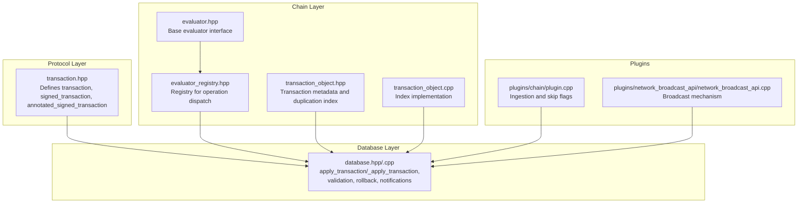
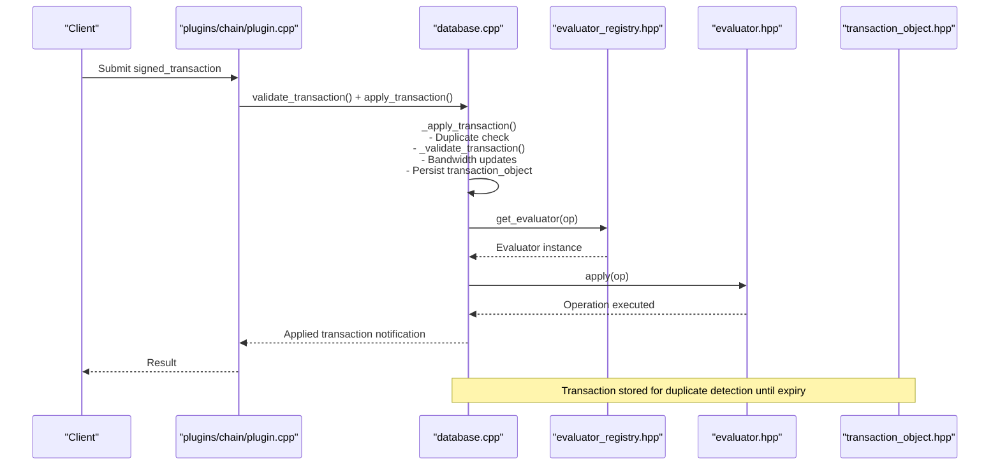
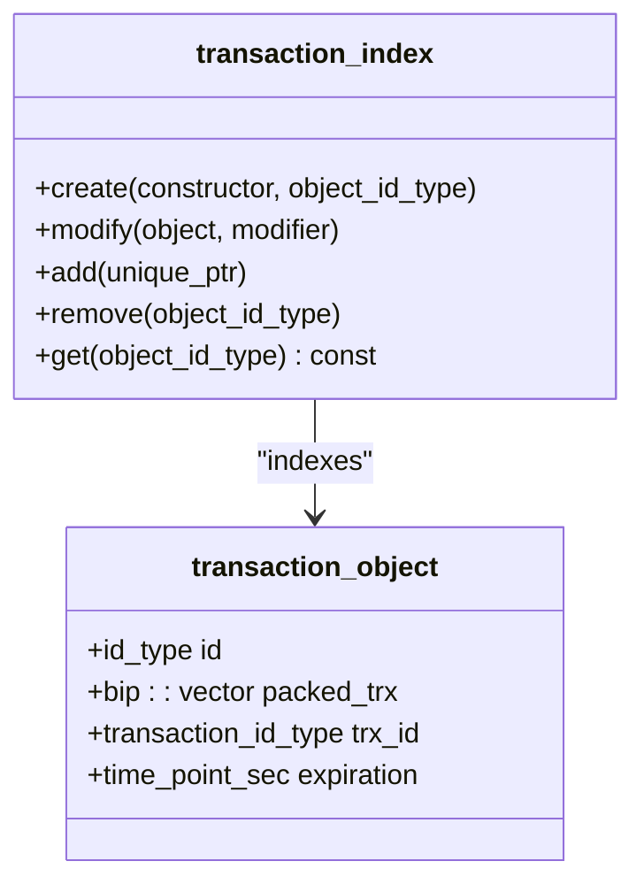
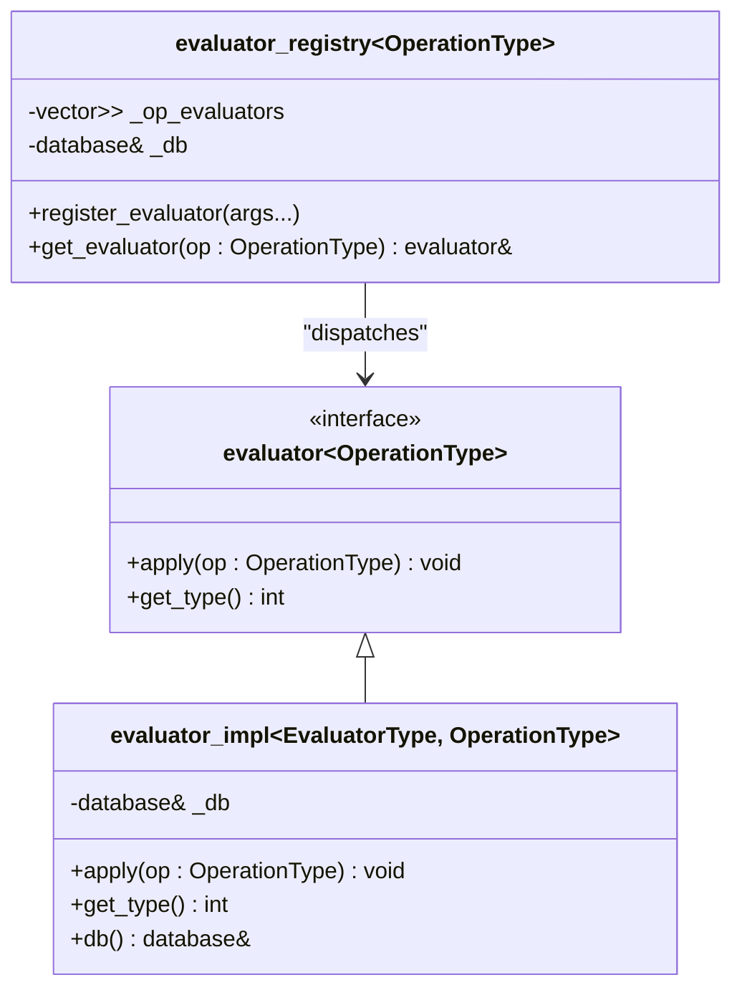
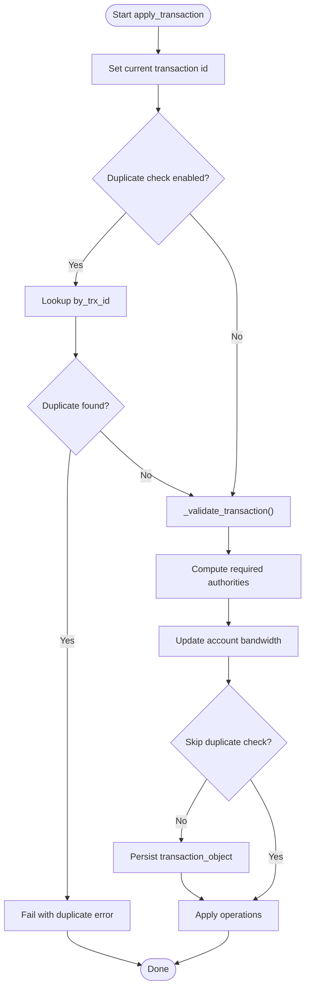
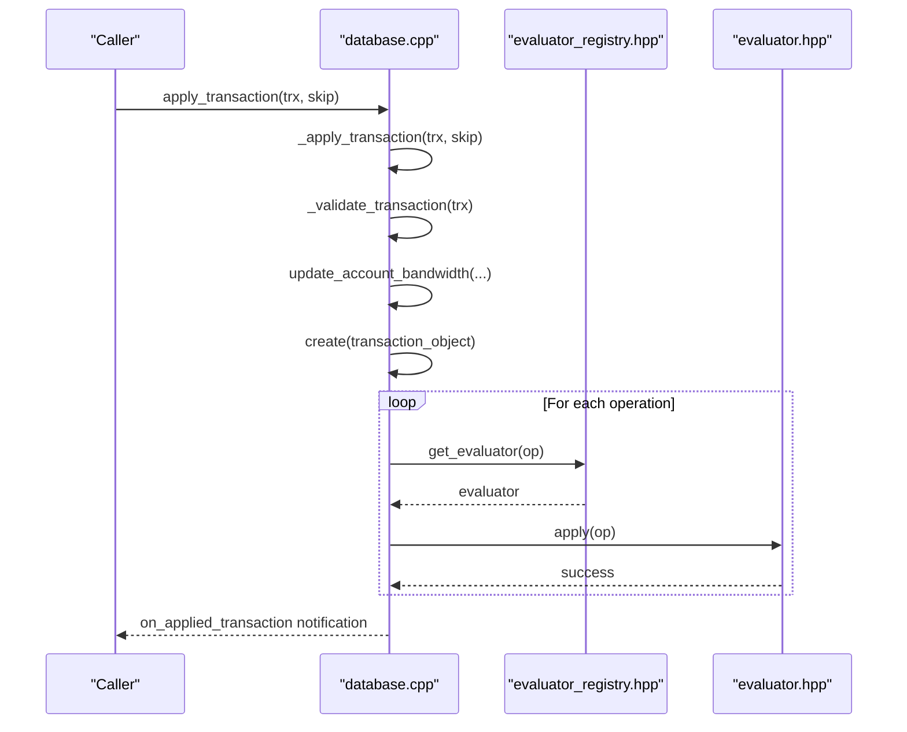
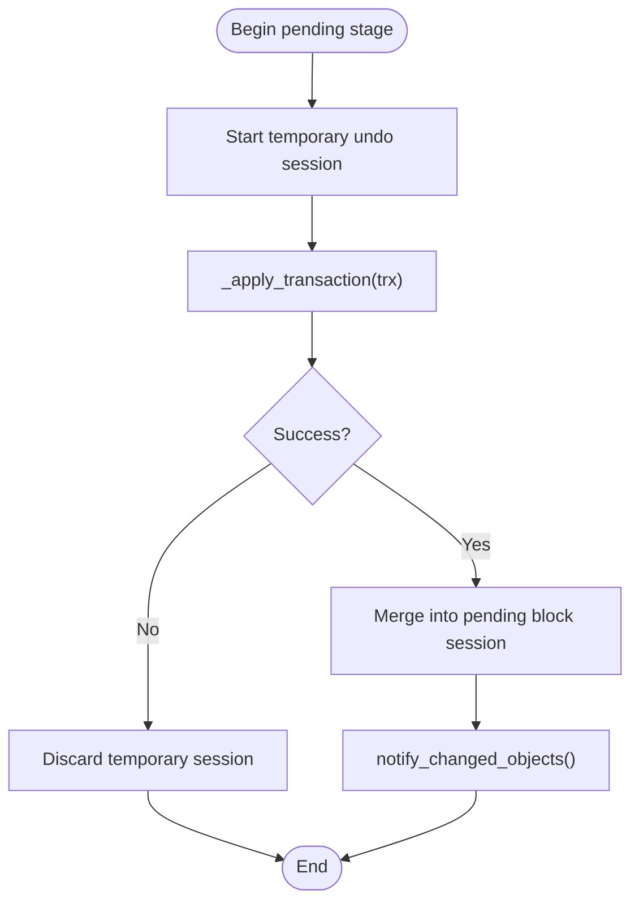
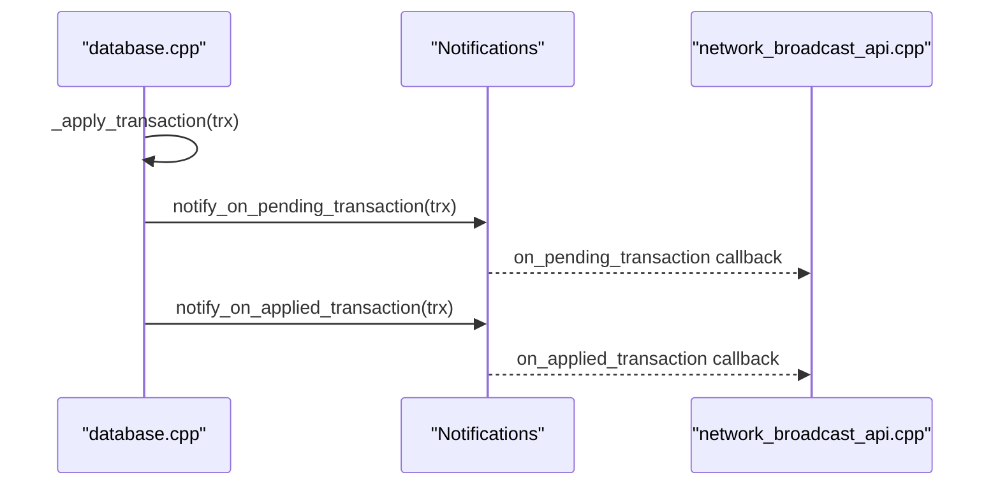
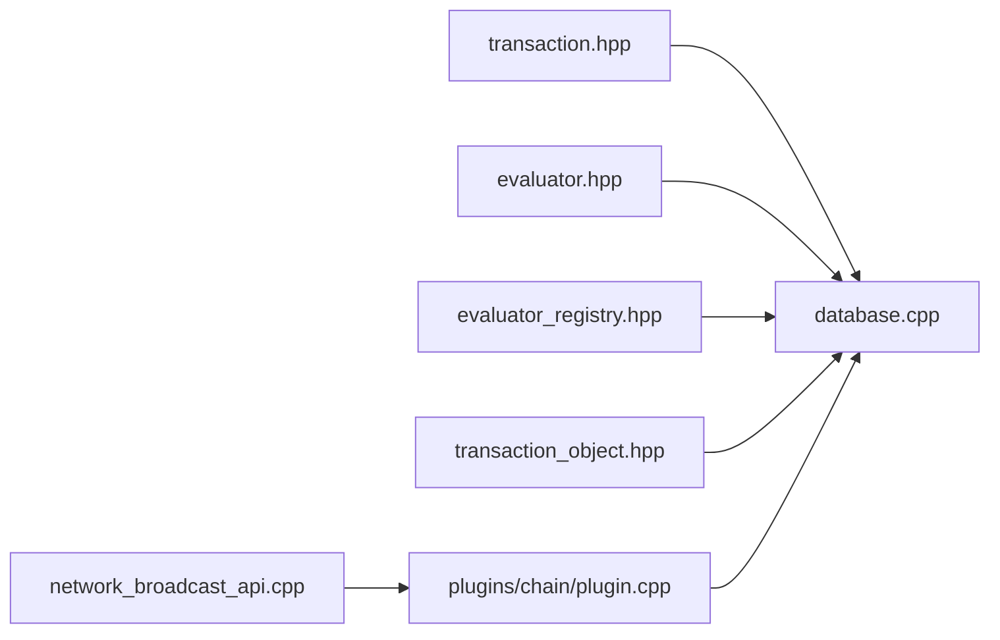

# Transaction Processing

<cite>
**Referenced Files in This Document**
- [transaction_object.hpp](file://libraries/chain/include/graphene/chain/transaction_object.hpp)
- [transaction_object.cpp](file://libraries/chain/transaction_object.cpp)
- [evaluator.hpp](file://libraries/chain/include/graphene/chain/evaluator.hpp)
- [evaluator_registry.hpp](file://libraries/chain/include/graphene/chain/evaluator_registry.hpp)
- [transaction.hpp](file://libraries/protocol/include/graphene/protocol/transaction.hpp)
- [database.hpp](file://libraries/chain/include/graphene/chain/database.hpp)
- [database.cpp](file://libraries/chain/database.cpp)
- [plugin.cpp](file://plugins/chain/plugin.cpp)
- [network_broadcast_api.cpp](file://plugins/network_broadcast_api/network_broadcast_api.cpp)
</cite>

## Table of Contents
1. [Introduction](#introduction)
2. [Project Structure](#project-structure)
3. [Core Components](#core-components)
4. [Architecture Overview](#architecture-overview)
5. [Detailed Component Analysis](#detailed-component-analysis)
6. [Dependency Analysis](#dependency-analysis)
7. [Performance Considerations](#performance-considerations)
8. [Troubleshooting Guide](#troubleshooting-guide)
9. [Conclusion](#conclusion)

## Introduction
This document explains the Transaction Processing system responsible for validating and executing blockchain operations. It covers:
- Transaction metadata and duplication detection via transaction_object
- Evaluator system for operation interpretation
- Validation pipeline including signature verification, authority checks, and operation validation
- Execution context and rollback mechanisms for apply_transaction() and _apply_transaction()
- Pending transaction management, transaction pool operations, and broadcast mechanisms
- Examples of transaction processing workflows, operation evaluation, and error handling
- Interactions with witness scheduling, fee markets, and state transitions
- Transaction size limits, priority handling, and performance optimization strategies

## Project Structure
The transaction processing logic spans several core modules:
- Protocol-level transaction and signed transaction definitions
- Chain-level evaluator and registry for operation dispatch
- Database-level transaction validation, execution, and persistence
- Plugins for chain ingestion and network broadcast

**Diagram sources**
- [transaction.hpp](file://libraries/protocol/include/graphene/protocol/transaction.hpp#L12-L136)
- [evaluator.hpp](file://libraries/chain/include/graphene/chain/evaluator.hpp#L11-L62)
- [evaluator_registry.hpp](file://libraries/chain/include/graphene/chain/evaluator_registry.hpp#L8-L44)
- [transaction_object.hpp](file://libraries/chain/include/graphene/chain/transaction_object.hpp#L19-L56)
- [transaction_object.cpp](file://libraries/chain/transaction_object.cpp#L6-L73)
- [database.hpp](file://libraries/chain/include/graphene/chain/database.hpp)
- [database.cpp](file://libraries/chain/database.cpp#L3651-L3722)
- [plugin.cpp](file://plugins/chain/plugin.cpp#L148-L148)
- [network_broadcast_api.cpp](file://plugins/network_broadcast_api/network_broadcast_api.cpp)

**Section sources**
- [transaction_object.hpp](file://libraries/chain/include/graphene/chain/transaction_object.hpp#L1-L56)
- [transaction_object.cpp](file://libraries/chain/transaction_object.cpp#L1-L73)
- [evaluator.hpp](file://libraries/chain/include/graphene/chain/evaluator.hpp#L1-L62)
- [evaluator_registry.hpp](file://libraries/chain/include/graphene/chain/evaluator_registry.hpp#L1-L44)
- [transaction.hpp](file://libraries/protocol/include/graphene/protocol/transaction.hpp#L1-L136)
- [database.cpp](file://libraries/chain/database.cpp#L3651-L3722)
- [plugin.cpp](file://plugins/chain/plugin.cpp#L148-L148)

## Core Components
- Transaction metadata and duplication detection
  - transaction_object stores packed transaction bytes, transaction ID, and expiration, enabling duplicate detection and expiry-based cleanup.
  - Multi-index container supports by_id, by_trx_id, and by_expiration indices.

- Evaluator system
  - Base evaluator interface defines apply() and get_type().
  - evaluator_impl provides a template wrapper that routes operations to do_apply() of concrete evaluators.
  - evaluator_registry maps operation types to registered evaluators and performs dispatch.

- Transaction validation and execution
  - apply_transaction() and _apply_transaction() orchestrate validation, duplicate checks, bandwidth updates, persistence, and operation application.
  - apply_operation() notifies pre/post hooks and delegates to the evaluator registry.

- Pending transactions and broadcasting
  - Pending transactions are staged with temporary undo sessions; successful application merges into the pending block session.
  - Notifications are emitted for pending and applied transactions; plugins broadcast transactions.

**Section sources**
- [transaction_object.hpp](file://libraries/chain/include/graphene/chain/transaction_object.hpp#L19-L56)
- [transaction_object.cpp](file://libraries/chain/transaction_object.cpp#L6-L73)
- [evaluator.hpp](file://libraries/chain/include/graphene/chain/evaluator.hpp#L11-L62)
- [evaluator_registry.hpp](file://libraries/chain/include/graphene/chain/evaluator_registry.hpp#L8-L44)
- [database.cpp](file://libraries/chain/database.cpp#L3651-L3722)
- [transaction.hpp](file://libraries/protocol/include/graphene/protocol/transaction.hpp#L57-L136)

## Architecture Overview
The transaction processing pipeline integrates protocol, chain, and database layers with plugin-driven ingestion and broadcasting.

**Diagram sources**
- [plugin.cpp](file://plugins/chain/plugin.cpp#L148-L148)
- [database.cpp](file://libraries/chain/database.cpp#L3651-L3722)
- [evaluator_registry.hpp](file://libraries/chain/include/graphene/chain/evaluator_registry.hpp#L23-L36)
- [evaluator.hpp](file://libraries/chain/include/graphene/chain/evaluator.hpp#L29-L41)
- [transaction_object.hpp](file://libraries/chain/include/graphene/chain/transaction_object.hpp#L19-L56)

## Detailed Component Analysis

### Transaction Metadata and Duplication Detection
- Purpose: Detect duplicate transactions and manage expiry windows.
- Storage: transaction_object holds packed_trx, trx_id, and expiration.
- Indexing: Multi-index supports fast lookup by ID, transaction ID, and expiration ordering.
- Lifecycle: After block processing, expired entries are removed from the index.

**Diagram sources**
- [transaction_object.hpp](file://libraries/chain/include/graphene/chain/transaction_object.hpp#L19-L56)
- [transaction_object.cpp](file://libraries/chain/transaction_object.cpp#L6-L73)

**Section sources**
- [transaction_object.hpp](file://libraries/chain/include/graphene/chain/transaction_object.hpp#L19-L56)
- [transaction_object.cpp](file://libraries/chain/transaction_object.cpp#L6-L73)

### Evaluator System
- Base evaluator: Virtual apply() and get_type() define the contract.
- Template evaluator_impl: Wraps concrete evaluators, casting operation to the specific type and invoking do_apply().
- Registry: Stores evaluators per operation type; get_evaluator() returns the appropriate evaluator instance.

**Diagram sources**
- [evaluator.hpp](file://libraries/chain/include/graphene/chain/evaluator.hpp#L11-L62)
- [evaluator_registry.hpp](file://libraries/chain/include/graphene/chain/evaluator_registry.hpp#L8-L44)

**Section sources**
- [evaluator.hpp](file://libraries/chain/include/graphene/chain/evaluator.hpp#L11-L62)
- [evaluator_registry.hpp](file://libraries/chain/include/graphene/chain/evaluator_registry.hpp#L8-L44)

### Transaction Validation Pipeline
- Signature verification and authority checks are performed during _validate_transaction().
- Required authorities are computed from the transaction; bandwidth updates are applied per account and operation type.
- Duplicate transaction detection uses the by_trx_id index; if a duplicate exists, the assertion fails.
- After validation, the transaction is persisted as a transaction_object with expiration.

**Diagram sources**
- [database.cpp](file://libraries/chain/database.cpp#L3657-L3711)

**Section sources**
- [database.cpp](file://libraries/chain/database.cpp#L3657-L3711)

### apply_transaction() and _apply_transaction() Methods
- apply_transaction(): Public entrypoint that calls _apply_transaction() and emits on_applied_transaction notification.
- _apply_transaction():
  - Sets execution context (_current_trx_id, _current_virtual_op, _current_op_in_trx)
  - Performs duplicate check and validation
  - Updates bandwidth accounting for required authorities
  - Persists transaction_object (unless skip flag is set)
  - Iterates operations and applies via apply_operation()

**Diagram sources**
- [database.cpp](file://libraries/chain/database.cpp#L3651-L3722)
- [evaluator_registry.hpp](file://libraries/chain/include/graphene/chain/evaluator_registry.hpp#L23-L36)
- [evaluator.hpp](file://libraries/chain/include/graphene/chain/evaluator.hpp#L29-L41)

**Section sources**
- [database.cpp](file://libraries/chain/database.cpp#L3651-L3722)

### Rollback Mechanisms
- Pending transactions are staged within a temporary undo session created before applying each transaction.
- On success, the temporary session is merged into the pending block session.
- On failure, the temporary session is discarded, preserving the previous clean state.
- During block generation, pending transactions are re-applied with the new block time context; invalid/expired transactions are skipped or postponed.

**Diagram sources**
- [database.cpp](file://libraries/chain/database.cpp#L950-L970)

**Section sources**
- [database.cpp](file://libraries/chain/database.cpp#L950-L970)

### Pending Transaction Management and Broadcasting
- Pending transactions are appended to an internal list after successful application and merged into the pending block session.
- Notifications are emitted for on_pending_transaction and on_applied_transaction.
- Plugins listen to these notifications to broadcast transactions to peers.

**Diagram sources**
- [database.cpp](file://libraries/chain/database.cpp#L960-L970)
- [database.cpp](file://libraries/chain/database.cpp#L1192-L1198)
- [network_broadcast_api.cpp](file://plugins/network_broadcast_api/network_broadcast_api.cpp)

**Section sources**
- [database.cpp](file://libraries/chain/database.cpp#L960-L970)
- [database.cpp](file://libraries/chain/database.cpp#L1192-L1198)

### Relationship with Witness Scheduling, Fee Markets, and State Transitions
- Witness scheduling: The database computes scheduled witnesses and validates block headers; transaction processing occurs within the context of block production and validation.
- Fee markets and state transitions: Operations modify state objects (e.g., balances, vesting shares, reward funds). Bandwidth accounting influences fee market dynamics indirectly by controlling resource usage and reserve ratios.

[No sources needed since this section synthesizes relationships without analyzing specific files]

### Transaction Size Limits, Priority Handling, and Performance Optimization
- Block size limits: During block generation, transactions are included until maximum_block_size is reached; oversized transactions are postponed with a configurable limit.
- Priority handling: Transactions are included in the order they are applied within the pending pool; no explicit prioritization mechanism is shown in the analyzed code.
- Performance optimizations:
  - Temporary undo sessions isolate failed transactions without committing state changes.
  - Bandwidth updates are applied per-account and per-operation type to prevent excessive data operations.
  - Duplicate detection avoids reprocessing identical transactions.

**Section sources**
- [database.cpp](file://libraries/chain/database.cpp#L1036-L1063)
- [database.cpp](file://libraries/chain/database.cpp#L3675-L3698)

## Dependency Analysis
The transaction processing system exhibits clear layering:
- Protocol layer defines transaction structures and authority verification helpers.
- Chain layer provides evaluator abstractions and registry for operation dispatch.
- Database layer orchestrates validation, execution, persistence, and notifications.
- Plugins integrate ingestion and broadcasting.

**Diagram sources**
- [transaction.hpp](file://libraries/protocol/include/graphene/protocol/transaction.hpp#L12-L136)
- [evaluator.hpp](file://libraries/chain/include/graphene/chain/evaluator.hpp#L11-L62)
- [evaluator_registry.hpp](file://libraries/chain/include/graphene/chain/evaluator_registry.hpp#L8-L44)
- [transaction_object.hpp](file://libraries/chain/include/graphene/chain/transaction_object.hpp#L19-L56)
- [database.cpp](file://libraries/chain/database.cpp#L3651-L3722)
- [plugin.cpp](file://plugins/chain/plugin.cpp#L148-L148)
- [network_broadcast_api.cpp](file://plugins/network_broadcast_api/network_broadcast_api.cpp)

**Section sources**
- [database.cpp](file://libraries/chain/database.cpp#L3651-L3722)
- [plugin.cpp](file://plugins/chain/plugin.cpp#L148-L148)

## Performance Considerations
- Minimize redundant validations by leveraging skip flags appropriately.
- Use temporary undo sessions to avoid expensive rollbacks after failures.
- Monitor average block size and reserve ratio adjustments to tune network capacity.
- Apply bandwidth updates early to prevent oversized operations from consuming resources unnecessarily.

[No sources needed since this section provides general guidance]

## Troubleshooting Guide
Common issues and diagnostics:
- Duplicate transaction errors: Occur when by_trx_id lookup finds an existing transaction_object.
- Validation failures: Thrown by _validate_transaction() during signature verification or authority checks.
- Expiry-related problems: Expired transactions are skipped; ensure proper time synchronization.
- Bandwidth throttling: Excessive data operations may incur additional bandwidth penalties.

Mitigations:
- Verify transaction signatures and required authorities before submission.
- Monitor pending transaction notifications and error logs.
- Adjust skip flags only when necessary and understood.

**Section sources**
- [database.cpp](file://libraries/chain/database.cpp#L3665-L3667)
- [database.cpp](file://libraries/chain/database.cpp#L3669-L3669)

## Conclusion
The Transaction Processing system integrates protocol-level transaction definitions, a flexible evaluator registry, and robust database orchestration to validate and execute blockchain operations reliably. It supports duplication detection, bandwidth accounting, rollback via undo sessions, and plugin-driven broadcasting. Understanding the execution context, validation pipeline, and performance characteristics enables effective tuning and troubleshooting of transaction throughput and reliability.