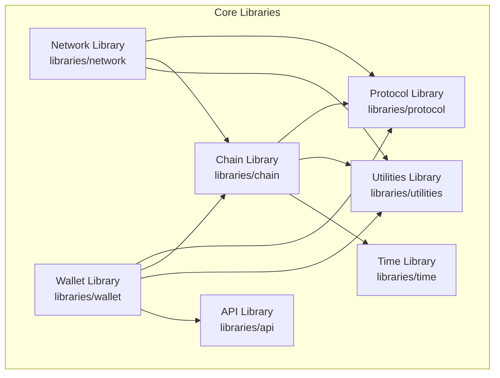
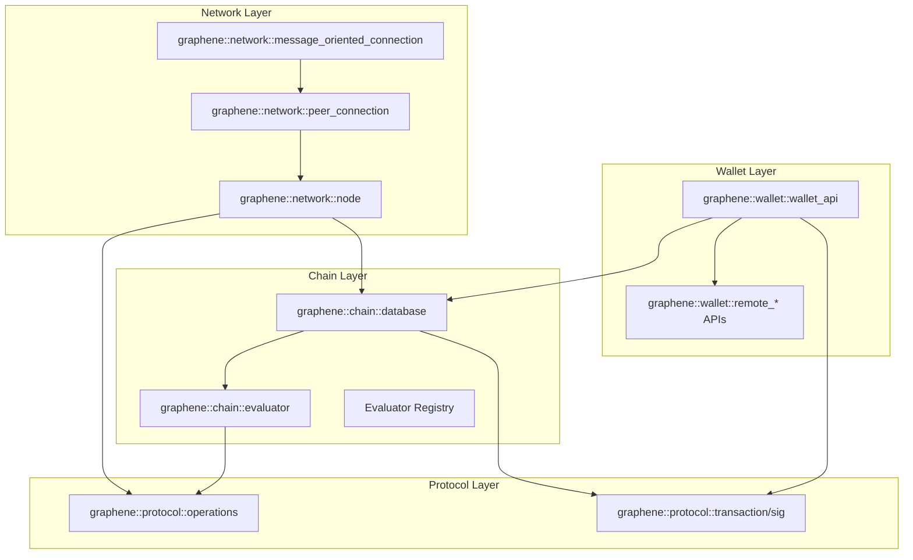
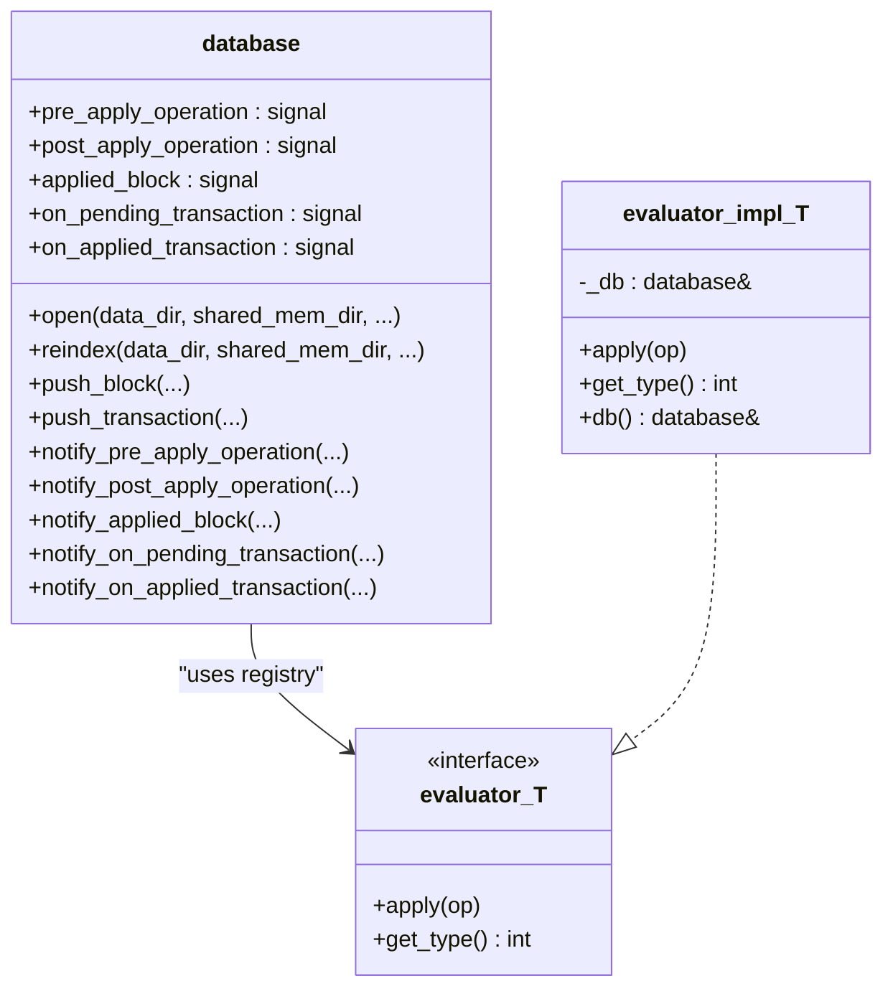
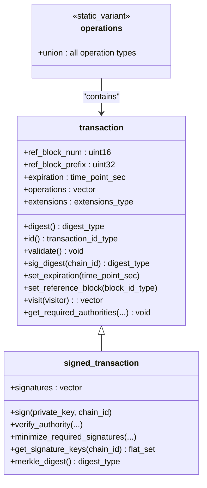
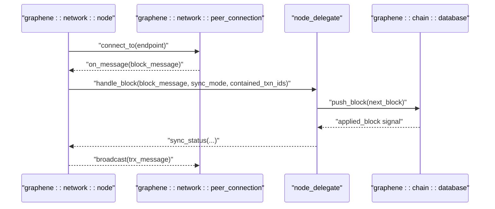
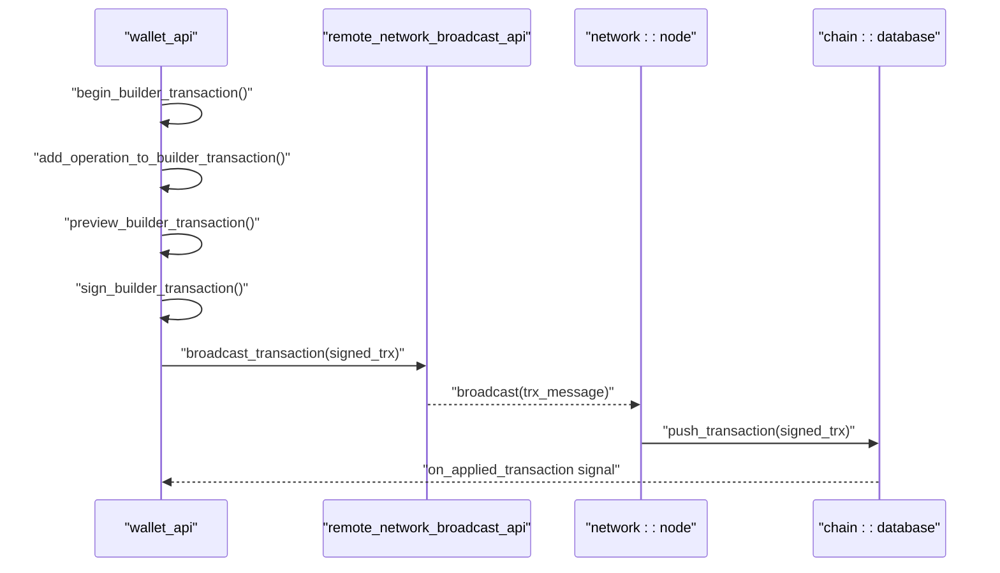
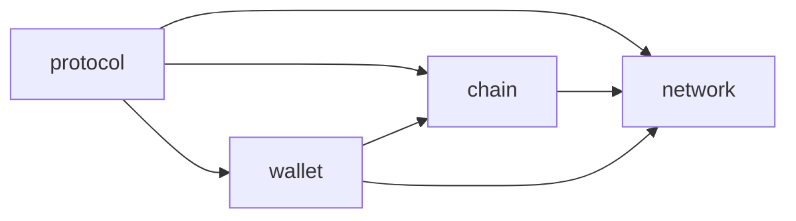

# Core Libraries

<cite>
**Referenced Files in This Document**
- [CMakeLists.txt](file://libraries/CMakeLists.txt)
- [database.hpp](file://libraries/chain/include/graphene/chain/database.hpp)
- [evaluator.hpp](file://libraries/chain/include/graphene/chain/evaluator.hpp)
- [chain_evaluator.hpp](file://libraries/chain/include/graphene/chain/chain_evaluator.hpp)
- [operations.hpp](file://libraries/protocol/include/graphene/protocol/operations.hpp)
- [transaction.hpp](file://libraries/protocol/include/graphene/protocol/transaction.hpp)
- [node.hpp](file://libraries/network/include/graphene/network/node.hpp)
- [peer_connection.hpp](file://libraries/network/include/graphene/network/peer_connection.hpp)
- [message_oriented_connection.hpp](file://libraries/network/include/graphene/network/message_oriented_connection.hpp)
- [wallet.hpp](file://libraries/wallet/include/graphene/wallet/wallet.hpp)
- [remote_node_api.hpp](file://libraries/wallet/include/graphene/wallet/remote_node_api.hpp)
</cite>

## Table of Contents
1. [Introduction](#introduction)
2. [Project Structure](#project-structure)
3. [Core Components](#core-components)
4. [Architecture Overview](#architecture-overview)
5. [Detailed Component Analysis](#detailed-component-analysis)
6. [Dependency Analysis](#dependency-analysis)
7. [Performance Considerations](#performance-considerations)
8. [Troubleshooting Guide](#troubleshooting-guide)
9. [Conclusion](#conclusion)

## Introduction
This document explains the four fundamental library layers that underpin the blockchain node:
- Chain library: blockchain state management, validation, and consensus integration
- Protocol library: operation definitions, transactions, and cryptographic primitives
- Network library: peer-to-peer communication, synchronization, and message transport
- Wallet library: transaction signing, key management, and user-facing APIs

It documents the architectural patterns used in each layer (observer pattern for event handling, factory-like registries for evaluators), the separation of concerns, and how these libraries integrate to deliver complete blockchain functionality. The design rationale for C++ is grounded in performance and deterministic behavior for cryptographic and consensus-critical operations.

## Project Structure
The core libraries are organized as independent modules under libraries/, each exporting headers and implementations that are consumed by higher-level applications and plugins.

**Diagram sources**
- [CMakeLists.txt](file://libraries/CMakeLists.txt#L1-L8)

**Section sources**
- [CMakeLists.txt](file://libraries/CMakeLists.txt#L1-L8)

## Core Components
- Chain library
  - Provides the blockchain state machine, fork resolution, block and transaction validation, and event signaling for observers.
  - Exposes APIs to push blocks/transactions, query chain state, and subscribe to lifecycle events.
- Protocol library
  - Defines the canonical operation types, transaction structure, and cryptographic primitives (signatures, digests).
  - Supplies helpers for authority verification and signature minimization.
- Network library
  - Implements a peer-to-peer node with message-oriented transport, peer connection management, and synchronization protocols.
  - Offers a delegate interface for integrating chain logic into network callbacks.
- Wallet library
  - Offers a high-level API for building, signing, and broadcasting transactions.
  - Integrates with remote node APIs via typed remote interfaces and exposes signals for UI updates.

**Section sources**
- [database.hpp](file://libraries/chain/include/graphene/chain/database.hpp#L36-L561)
- [operations.hpp](file://libraries/protocol/include/graphene/protocol/operations.hpp#L13-L102)
- [transaction.hpp](file://libraries/protocol/include/graphene/protocol/transaction.hpp#L12-L136)
- [node.hpp](file://libraries/network/include/graphene/network/node.hpp#L190-L355)
- [wallet.hpp](file://libraries/wallet/include/graphene/wallet/wallet.hpp#L96-L1067)

## Architecture Overview
The libraries collaborate through well-defined interfaces and event channels:
- The Chain library emits signals for block application, transaction lifecycle, and operation application.
- The Network library invokes the Chain library’s validation and push routines via a node delegate interface.
- The Protocol library defines the shared data structures and cryptographic semantics used across Chain, Network, and Wallet.
- The Wallet library composes transactions using Protocol types, signs them, and broadcasts via Network or remote node APIs.

**Diagram sources**
- [node.hpp](file://libraries/network/include/graphene/network/node.hpp#L190-L355)
- [peer_connection.hpp](file://libraries/network/include/graphene/network/peer_connection.hpp#L79-L355)
- [message_oriented_connection.hpp](file://libraries/network/include/graphene/network/message_oriented_connection.hpp#L44-L85)
- [database.hpp](file://libraries/chain/include/graphene/chain/database.hpp#L36-L561)
- [evaluator.hpp](file://libraries/chain/include/graphene/chain/evaluator.hpp#L11-L62)
- [operations.hpp](file://libraries/protocol/include/graphene/protocol/operations.hpp#L13-L102)
- [transaction.hpp](file://libraries/protocol/include/graphene/protocol/transaction.hpp#L12-L136)
- [wallet.hpp](file://libraries/wallet/include/graphene/wallet/wallet.hpp#L96-L1067)
- [remote_node_api.hpp](file://libraries/wallet/include/graphene/wallet/remote_node_api.hpp#L44-L175)

## Detailed Component Analysis

### Chain Library
- Responsibilities
  - Manage blockchain state, fork database, block log, and hardfork transitions.
  - Validate blocks and transactions according to configurable skip flags.
  - Apply operations via evaluators and emit signals for observers.
- Architectural patterns
  - Observer pattern: Signals for pre/post operation application, applied block, pending/applied transactions.
  - Factory/registry pattern: Evaluator registry and custom operation interpreter registry enable extensibility without modifying core logic.
- Key interfaces
  - database: open/reindex, push_block/push_transaction, notify_* signals, get_* queries.
  - evaluator<T>: polymorphic apply() with static dispatch to concrete operation types.
  - chain_evaluator: macro-generated evaluator declarations for each operation.

**Diagram sources**
- [database.hpp](file://libraries/chain/include/graphene/chain/database.hpp#L36-L561)
- [evaluator.hpp](file://libraries/chain/include/graphene/chain/evaluator.hpp#L11-L62)
- [chain_evaluator.hpp](file://libraries/chain/include/graphene/chain/chain_evaluator.hpp#L14-L80)

**Section sources**
- [database.hpp](file://libraries/chain/include/graphene/chain/database.hpp#L56-L561)
- [evaluator.hpp](file://libraries/chain/include/graphene/chain/evaluator.hpp#L11-L62)
- [chain_evaluator.hpp](file://libraries/chain/include/graphene/chain/chain_evaluator.hpp#L14-L80)

### Protocol Library
- Responsibilities
  - Define canonical operation types and transaction structure.
  - Provide cryptographic helpers: digests, signature computation, authority verification, and signature minimization.
- Architectural patterns
  - Static variant for operation union enables efficient dispatch and serialization.
  - Visitor-style visit() on transactions to apply visitor to each contained operation.
- Key interfaces
  - operations: static_variant union of all operations.
  - transaction/sig: structure with operations, extensions, and signature handling.

**Diagram sources**
- [operations.hpp](file://libraries/protocol/include/graphene/protocol/operations.hpp#L13-L102)
- [transaction.hpp](file://libraries/protocol/include/graphene/protocol/transaction.hpp#L12-L136)

**Section sources**
- [operations.hpp](file://libraries/protocol/include/graphene/protocol/operations.hpp#L13-L131)
- [transaction.hpp](file://libraries/protocol/include/graphene/protocol/transaction.hpp#L12-L136)

### Network Library
- Responsibilities
  - Peer-to-peer connectivity, message transport, and blockchain synchronization.
  - Delegate-driven integration with chain logic for handling blocks, transactions, and sync status.
- Architectural patterns
  - Observer pattern: delegate callbacks for block, transaction, message handling, sync status, and connection count changes.
  - Message-oriented abstraction: message_oriented_connection encapsulates socket I/O and message framing.
  - Factory-like peer connection management: peer_connection maintains queues and negotiation states.
- Key interfaces
  - node: listen/connect, add_node, broadcast, sync_from, delegate registration.
  - peer_connection: connection states, inventory tracking, message queuing.
  - message_oriented_connection: socket binding, sending/receiving messages.

**Diagram sources**
- [node.hpp](file://libraries/network/include/graphene/network/node.hpp#L190-L355)
- [peer_connection.hpp](file://libraries/network/include/graphene/network/peer_connection.hpp#L79-L355)
- [message_oriented_connection.hpp](file://libraries/network/include/graphene/network/message_oriented_connection.hpp#L44-L85)
- [database.hpp](file://libraries/chain/include/graphene/chain/database.hpp#L252-L275)

**Section sources**
- [node.hpp](file://libraries/network/include/graphene/network/node.hpp#L190-L355)
- [peer_connection.hpp](file://libraries/network/include/graphene/network/peer_connection.hpp#L79-L355)
- [message_oriented_connection.hpp](file://libraries/network/include/graphene/network/message_oriented_connection.hpp#L44-L85)

### Wallet Library
- Responsibilities
  - Build, sign, and propose transactions; manage keys and credentials; expose user-facing APIs.
  - Integrate with remote node APIs for read/write operations and broadcasting.
- Architectural patterns
  - Remote API façades: typed remote_* structs define method signatures for remote plugins.
  - Observer pattern: signals for lock state and quit command.
  - Builder pattern: transaction builder handles composing operations and previewing before signing.
- Key interfaces
  - wallet_api: transaction builder, signing, account/history queries, memo encryption/decryption.
  - remote_* APIs: remote_database_api, remote_network_broadcast_api, etc.

**Diagram sources**
- [wallet.hpp](file://libraries/wallet/include/graphene/wallet/wallet.hpp#L96-L1067)
- [remote_node_api.hpp](file://libraries/wallet/include/graphene/wallet/remote_node_api.hpp#L122-L126)
- [node.hpp](file://libraries/network/include/graphene/network/node.hpp#L258-L262)
- [database.hpp](file://libraries/chain/include/graphene/chain/database.hpp#L268-L275)

**Section sources**
- [wallet.hpp](file://libraries/wallet/include/graphene/wallet/wallet.hpp#L96-L1067)
- [remote_node_api.hpp](file://libraries/wallet/include/graphene/wallet/remote_node_api.hpp#L44-L175)

## Dependency Analysis
- Inter-library dependencies
  - Chain depends on Protocol for operation and transaction types.
  - Network depends on Protocol for chain_id and types; integrates with Chain via node delegate.
  - Wallet depends on Protocol for transaction types and on Network/Remote APIs for broadcasting.
- Coupling and cohesion
  - Loose coupling is achieved via delegate interfaces (node_delegate) and typed remote APIs.
  - Cohesion is maintained by keeping each library focused on a single responsibility.

**Diagram sources**
- [database.hpp](file://libraries/chain/include/graphene/chain/database.hpp#L3-L8)
- [node.hpp](file://libraries/network/include/graphene/network/node.hpp#L26-L30)
- [wallet.hpp](file://libraries/wallet/include/graphene/wallet/wallet.hpp#L18-L20)

**Section sources**
- [database.hpp](file://libraries/chain/include/graphene/chain/database.hpp#L3-L8)
- [node.hpp](file://libraries/network/include/graphene/network/node.hpp#L26-L30)
- [wallet.hpp](file://libraries/wallet/include/graphene/wallet/wallet.hpp#L18-L20)

## Performance Considerations
- C++ choice
  - Deterministic memory layout, zero-overhead abstractions, and fine-grained control over threading and concurrency are essential for cryptographic operations and consensus-critical paths.
- Event-driven design
  - Signal emissions in Chain and Wallet avoid synchronous callbacks, reducing contention and enabling asynchronous observers.
- Message-oriented networking
  - Encapsulation of socket I/O and message framing reduces overhead and simplifies protocol handling.
- Signature verification and authority checks
  - Protocol-level helpers minimize redundant computations and support signature minimization to reduce verification cost.

[No sources needed since this section provides general guidance]

## Troubleshooting Guide
- Validation failures
  - Chain library exposes skip flags to bypass expensive checks during reindexing or local operations. Use appropriate skip masks to diagnose validation bottlenecks.
- Transaction signing issues
  - Wallet relies on remote node APIs for signature discovery and verification. Confirm remote node connectivity and that required keys are present in the wallet.
- Network synchronization
  - Use node delegate callbacks to monitor sync progress and connection counts. Investigate peer inventory lists and sync item requests to identify stalled peers.

**Section sources**
- [database.hpp](file://libraries/chain/include/graphene/chain/database.hpp#L56-L73)
- [wallet.hpp](file://libraries/wallet/include/graphene/wallet/wallet.hpp#L929-L931)
- [node.hpp](file://libraries/network/include/graphene/network/node.hpp#L143-L148)

## Conclusion
The four core libraries form a cohesive, loosely coupled architecture:
- Chain manages state and validation with observer-driven notifications
- Protocol defines shared data structures and cryptographic semantics
- Network provides robust peer-to-peer transport and synchronization
- Wallet offers a practical interface for signing and broadcasting transactions

This layered design, combined with C++’s performance characteristics, enables a high-throughput, extensible blockchain node capable of evolving with new operations, network protocols, and wallet features.