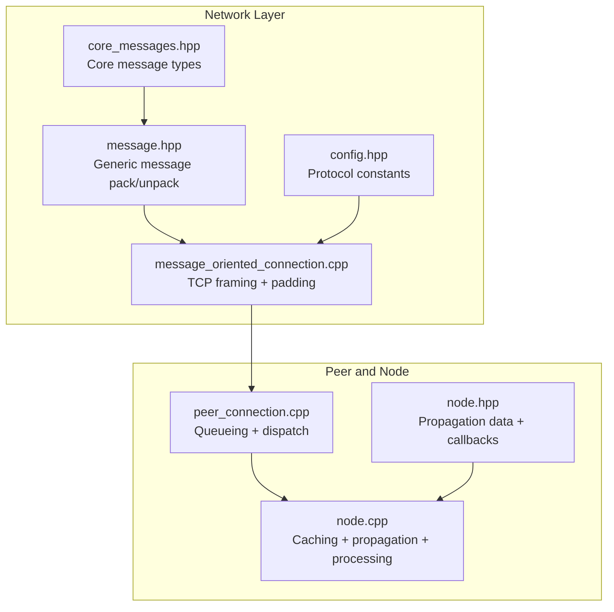
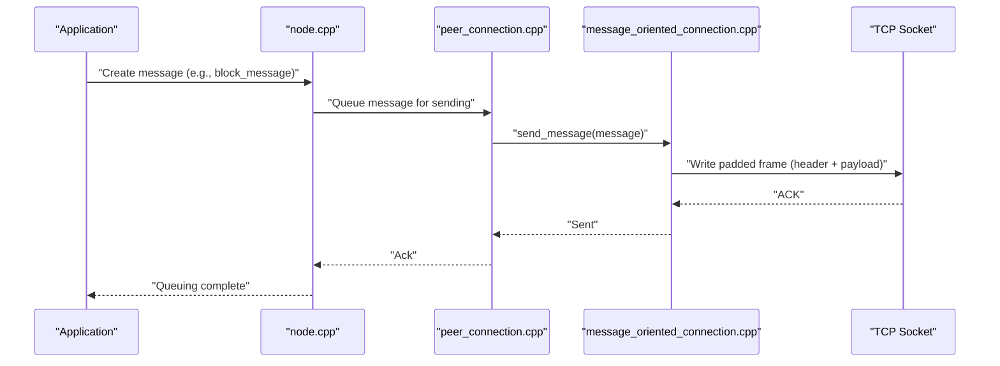
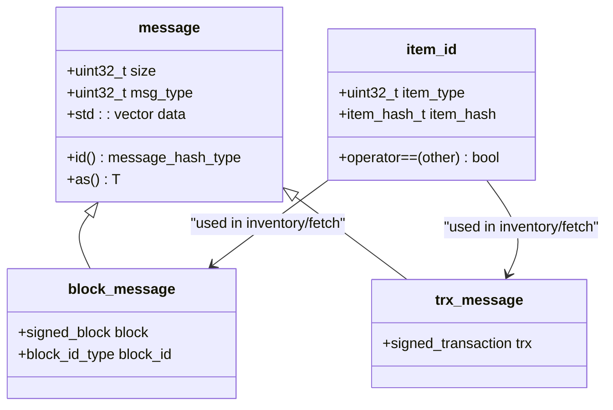
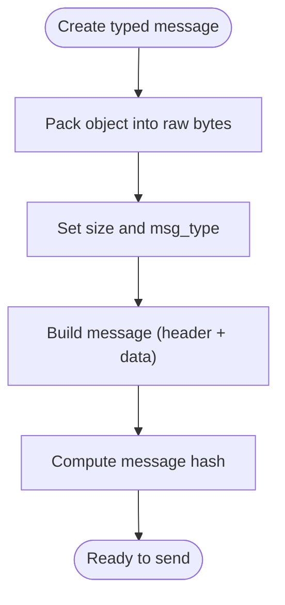
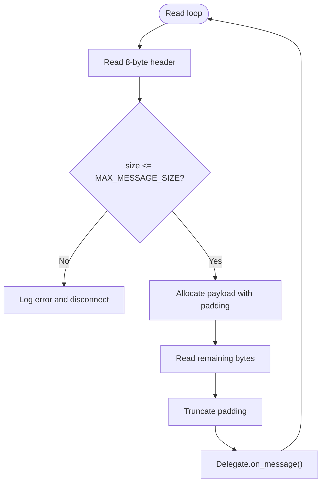
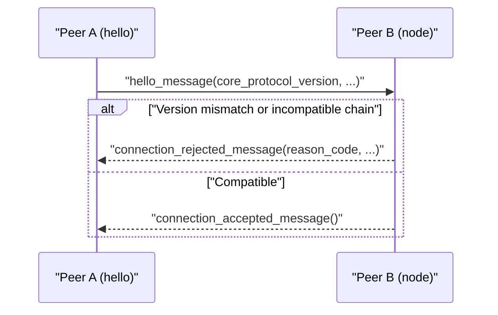
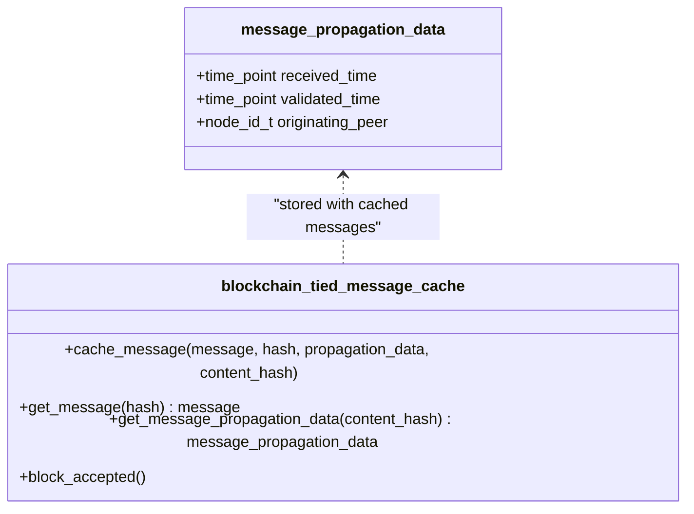
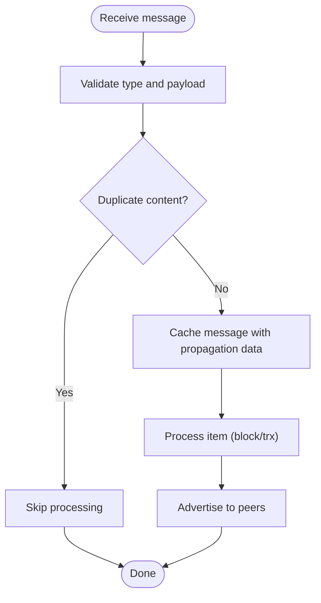
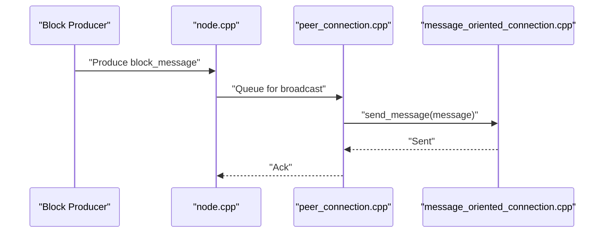
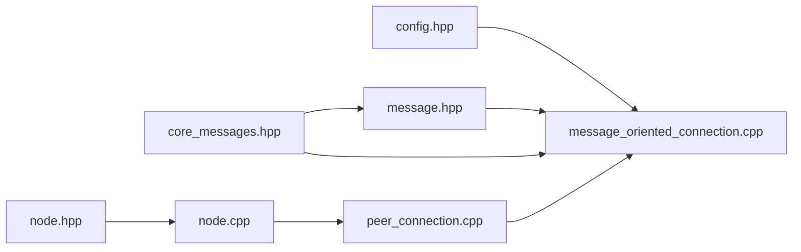

# Message Handling and Protocol

<cite>
**Referenced Files in This Document**
- [core_messages.hpp](file://libraries/network/include/graphene/network/core_messages.hpp)
- [core_messages.cpp](file://libraries/network/core_messages.cpp)
- [message.hpp](file://libraries/network/include/graphene/network/message.hpp)
- [message_oriented_connection.cpp](file://libraries/network/message_oriented_connection.cpp)
- [config.hpp](file://libraries/network/include/graphene/network/config.hpp)
- [node.hpp](file://libraries/network/include/graphene/network/node.hpp)
- [node.cpp](file://libraries/network/node.cpp)
- [peer_connection.cpp](file://libraries/network/peer_connection.cpp)
</cite>

## Table of Contents
1. [Introduction](#introduction)
2. [Project Structure](#project-structure)
3. [Core Components](#core-components)
4. [Architecture Overview](#architecture-overview)
5. [Detailed Component Analysis](#detailed-component-analysis)
6. [Dependency Analysis](#dependency-analysis)
7. [Performance Considerations](#performance-considerations)
8. [Troubleshooting Guide](#troubleshooting-guide)
9. [Conclusion](#conclusion)
10. [Appendices](#appendices)

## Introduction
This document describes the network message handling and protocol layer used by the node. It focuses on:
- Standard network message types for blocks and transactions
- Generic message packaging, serialization, and deserialization
- Protocol versioning and compliance validation
- Message routing, delivery guarantees, ordering, propagation tracking, and duplicate detection
- Practical patterns for message creation, transmission, and processing
- Compression, fragmentation, and protocol upgrade mechanisms
- Guidance for extending the protocol with custom message types

## Project Structure
The messaging stack spans several files:
- Core message type definitions and constants
- Generic message container and serializer
- TCP transport abstraction with message framing and padding
- Node-level message caching, propagation tracking, and processing
- Peer connection orchestration and queueing

**Diagram sources**
- [core_messages.hpp](file://libraries/network/include/graphene/network/core_messages.hpp#L42-L573)
- [message.hpp](file://libraries/network/include/graphene/network/message.hpp#L33-L114)
- [message_oriented_connection.cpp](file://libraries/network/message_oriented_connection.cpp#L148-L235)
- [config.hpp](file://libraries/network/include/graphene/network/config.hpp#L26-L106)
- [peer_connection.cpp](file://libraries/network/peer_connection.cpp#L244-L300)
- [node.cpp](file://libraries/network/node.cpp#L112-L200)
- [node.hpp](file://libraries/network/include/graphene/network/node.hpp#L48-L54)

**Section sources**
- [core_messages.hpp](file://libraries/network/include/graphene/network/core_messages.hpp#L42-L573)
- [message.hpp](file://libraries/network/include/graphene/network/message.hpp#L33-L114)
- [message_oriented_connection.cpp](file://libraries/network/message_oriented_connection.cpp#L148-L235)
- [config.hpp](file://libraries/network/include/graphene/network/config.hpp#L26-L106)
- [peer_connection.cpp](file://libraries/network/peer_connection.cpp#L244-L300)
- [node.cpp](file://libraries/network/node.cpp#L112-L200)
- [node.hpp](file://libraries/network/include/graphene/network/node.hpp#L48-L54)

## Core Components
- Core message types: block_message, trx_message, item_id, and many handshake/control messages
- Generic message: message_header + payload + hash
- Transport: message_oriented_connection with fixed-size padding and bounds checking
- Node-level caching and propagation metadata
- Peer queueing and dispatch

Key responsibilities:
- Define standardized message envelopes and types
- Pack/unpack messages with reflection-based raw serialization
- Enforce protocol version and message size limits
- Track message propagation and deduplicate via caches keyed by hashes

**Section sources**
- [core_messages.hpp](file://libraries/network/include/graphene/network/core_messages.hpp#L54-L151)
- [message.hpp](file://libraries/network/include/graphene/network/message.hpp#L42-L106)
- [message_oriented_connection.cpp](file://libraries/network/message_oriented_connection.cpp#L160-L183)
- [node.cpp](file://libraries/network/node.cpp#L112-L176)

## Architecture Overview
The system separates concerns across layers:
- Protocol types live in core_messages.hpp
- Generic message packaging is in message.hpp
- Transport framing and padding are in message_oriented_connection.cpp
- Node-level caching and propagation tracking are in node.cpp and node.hpp
- Peer queueing and dispatch are in peer_connection.cpp

**Diagram sources**
- [message.hpp](file://libraries/network/include/graphene/network/message.hpp#L70-L105)
- [message_oriented_connection.cpp](file://libraries/network/message_oriented_connection.cpp#L237-L283)
- [peer_connection.cpp](file://libraries/network/peer_connection.cpp#L272-L297)
- [node.cpp](file://libraries/network/node.cpp#L1372-L1380)

## Detailed Component Analysis

### Core Message Types: block_message, trx_message, item_id
- item_id: identifies items by type and hash
- block_message: carries a signed block plus its block_id
- trx_message: carries a signed transaction
- Additional core_message_type_enum entries cover inventory, fetch, hello, and connection lifecycle messages

**Diagram sources**
- [core_messages.hpp](file://libraries/network/include/graphene/network/core_messages.hpp#L54-L125)
- [message.hpp](file://libraries/network/include/graphene/network/message.hpp#L42-L106)

**Section sources**
- [core_messages.hpp](file://libraries/network/include/graphene/network/core_messages.hpp#L54-L125)
- [core_messages.cpp](file://libraries/network/core_messages.cpp#L30-L49)

### Generic Message Packaging and Serialization
- message_header: size and msg_type
- message: extends header with payload data
- Constructor packs a typed object into raw bytes
- as<T>() validates msg_type and unpacks the payload
- id() computes a deterministic hash of the serialized payload

**Diagram sources**
- [message.hpp](file://libraries/network/include/graphene/network/message.hpp#L70-L105)

**Section sources**
- [message.hpp](file://libraries/network/include/graphene/network/message.hpp#L42-L106)

### Transport Framing, Padding, and Bounds Checking
- Fixed 8-byte header with size and msg_type
- Read loop reads header, validates size against MAX_MESSAGE_SIZE, allocates payload with padding, reads remainder, truncates padding
- Send pads total frame length to 16-byte multiples
- Thread-safety guard prevents concurrent sends

**Diagram sources**
- [message_oriented_connection.cpp](file://libraries/network/message_oriented_connection.cpp#L160-L183)
- [config.hpp](file://libraries/network/include/graphene/network/config.hpp#L38-L39)

**Section sources**
- [message_oriented_connection.cpp](file://libraries/network/message_oriented_connection.cpp#L148-L235)
- [config.hpp](file://libraries/network/include/graphene/network/config.hpp#L38-L39)

### Protocol Versioning and Compliance Validation
- Protocol version constant is defined centrally
- hello_message and connection_rejected_message carry core_protocol_version
- Rejection reasons include client_too_old and different_chain

**Diagram sources**
- [core_messages.hpp](file://libraries/network/include/graphene/network/core_messages.hpp#L233-L306)
- [config.hpp](file://libraries/network/include/graphene/network/config.hpp#L26-L26)

**Section sources**
- [core_messages.hpp](file://libraries/network/include/graphene/network/core_messages.hpp#L96-L98)
- [core_messages.hpp](file://libraries/network/include/graphene/network/core_messages.hpp#L233-L306)

### Message Routing, Delivery Guarantees, Ordering, and Propagation Tracking
- Peer queueing ensures ordered transmission per peer
- Node maintains a blockchain-tied message cache keyed by message hash and content hash
- message_propagation_data tracks received_time, validated_time, and originating_peer
- Duplicate detection uses message hash and content hash indices

**Diagram sources**
- [node.hpp](file://libraries/network/include/graphene/network/node.hpp#L48-L54)
- [node.cpp](file://libraries/network/node.cpp#L112-L176)

**Section sources**
- [node.hpp](file://libraries/network/include/graphene/network/node.hpp#L48-L54)
- [node.cpp](file://libraries/network/node.cpp#L112-L200)

### Message Validation Workflows and Duplicate Detection
- On receipt, message is validated and processed
- Duplicate detection leverages content hash index to avoid reprocessing identical transactions/blocks
- Propagation metadata is recorded for analytics and debugging

**Diagram sources**
- [node.cpp](file://libraries/network/node.cpp#L187-L200)
- [node.cpp](file://libraries/network/node.cpp#L729-L745)

**Section sources**
- [node.cpp](file://libraries/network/node.cpp#L187-L200)
- [node.cpp](file://libraries/network/node.cpp#L729-L745)

### Examples of Message Creation, Transmission, and Processing Patterns
- Creating a block_message: construct with a signed_block; message wrapper sets msg_type and serializes
- Queuing for sending: peer_connection queues messages; send loop transmits with padding
- Processing: node delegates to appropriate handler; for blocks, it may trigger fork selection and broadcasting

**Diagram sources**
- [message.hpp](file://libraries/network/include/graphene/network/message.hpp#L70-L75)
- [peer_connection.cpp](file://libraries/network/peer_connection.cpp#L272-L297)
- [message_oriented_connection.cpp](file://libraries/network/message_oriented_connection.cpp#L237-L283)

**Section sources**
- [message.hpp](file://libraries/network/include/graphene/network/message.hpp#L70-L75)
- [peer_connection.cpp](file://libraries/network/peer_connection.cpp#L272-L297)
- [node.cpp](file://libraries/network/node.cpp#L1372-L1380)

### Compression, Fragmentation Handling, and Protocol Upgrade Mechanisms
- Compression: not implemented in the referenced files; payload is raw serialized data
- Fragmentation: handled by fixed-size padding and bounded reads/writes; MAX_MESSAGE_SIZE enforces upper bound
- Protocol upgrades: controlled by core_protocol_version; peers exchange hello and reject incompatible versions

**Section sources**
- [config.hpp](file://libraries/network/include/graphene/network/config.hpp#L38-L39)
- [core_messages.hpp](file://libraries/network/include/graphene/network/core_messages.hpp#L233-L306)

### Implementing Custom Message Types and Extension Points
- Define a new struct with a static type member matching a core_message_type_enum value
- Reflect the struct for serialization
- Ensure msg_type is registered and handled in the node’s dispatcher
- Consider adding to inventory/fetch workflows if the item should be gossiped

Guidance:
- Keep msg_type unique within the core_message_type_enum range
- Use FC_REFLECT macros for serialization compatibility
- Respect MAX_MESSAGE_SIZE and avoid excessive payloads
- For gossipable items, integrate with inventory and fetch handlers

**Section sources**
- [core_messages.hpp](file://libraries/network/include/graphene/network/core_messages.hpp#L72-L95)
- [core_messages.cpp](file://libraries/network/core_messages.cpp#L30-L49)
- [core_messages.hpp](file://libraries/network/include/graphene/network/core_messages.hpp#L478-L560)

## Dependency Analysis
- core_messages.hpp depends on protocol types and reflection
- message.hpp depends on raw serialization and hashing
- message_oriented_connection.cpp depends on config constants and socket I/O
- node.cpp depends on peer_connection and message propagation metadata
- node.hpp defines the propagation data structure and delegate callbacks

**Diagram sources**
- [config.hpp](file://libraries/network/include/graphene/network/config.hpp#L26-L106)
- [message.hpp](file://libraries/network/include/graphene/network/message.hpp#L33-L114)
- [core_messages.hpp](file://libraries/network/include/graphene/network/core_messages.hpp#L26-L50)
- [message_oriented_connection.cpp](file://libraries/network/message_oriented_connection.cpp#L29-L31)
- [peer_connection.cpp](file://libraries/network/peer_connection.cpp#L24-L29)
- [node.cpp](file://libraries/network/node.cpp#L64-L66)
- [node.hpp](file://libraries/network/include/graphene/network/node.hpp#L48-L54)

**Section sources**
- [config.hpp](file://libraries/network/include/graphene/network/config.hpp#L26-L106)
- [core_messages.hpp](file://libraries/network/include/graphene/network/core_messages.hpp#L26-L50)
- [message.hpp](file://libraries/network/include/graphene/network/message.hpp#L33-L114)
- [message_oriented_connection.cpp](file://libraries/network/message_oriented_connection.cpp#L29-L31)
- [peer_connection.cpp](file://libraries/network/peer_connection.cpp#L24-L29)
- [node.cpp](file://libraries/network/node.cpp#L64-L66)
- [node.hpp](file://libraries/network/include/graphene/network/node.hpp#L48-L54)

## Performance Considerations
- Fixed 16-byte padding reduces alignment overhead but increases bandwidth; acceptable given MAX_MESSAGE_SIZE is enforced
- Message size validation prevents oversized packets
- Queueing and per-peer send guards reduce contention
- Blockchain-tied cache evicts based on block clock to bound memory

[No sources needed since this section provides general guidance]

## Troubleshooting Guide
Common issues and diagnostics:
- Oversized messages: MAX_MESSAGE_SIZE exceeded triggers logs; inspect payload sizes
- Type mismatches: as<T>() throws if msg_type does not match expected type
- Connection closure: read_loop handles EOF and exceptions, invoking on_connection_closed
- Send concurrency: assertion prevents concurrent send_message invocations

Actions:
- Verify protocol version compatibility in hello messages
- Monitor logs for “message transmission failed” and “disconnected”
- Confirm queue sizes and cache eviction behavior

**Section sources**
- [message_oriented_connection.cpp](file://libraries/network/message_oriented_connection.cpp#L168-L169)
- [message.hpp](file://libraries/network/include/graphene/network/message.hpp#L87-L104)
- [message_oriented_connection.cpp](file://libraries/network/message_oriented_connection.cpp#L190-L234)

## Conclusion
The messaging layer provides a robust, extensible foundation for network communication:
- Strong typing and reflection-based serialization
- Reliable framing with bounds checking and padding
- Clear protocol versioning and rejection semantics
- Built-in propagation tracking and duplicate detection
- Practical patterns for broadcasting and processing

[No sources needed since this section summarizes without analyzing specific files]

## Appendices

### Appendix A: Message Lifecycle Summary
- Creation: Construct typed message; message wrapper serializes and sets type
- Framing: Header + padded payload written to socket
- Reception: Header read, payload read, padding truncated, type checked
- Processing: Delegate invoked; node caches and tracks propagation
- Broadcasting: Inventory and fetch messages coordinate propagation

**Section sources**
- [message.hpp](file://libraries/network/include/graphene/network/message.hpp#L70-L105)
- [message_oriented_connection.cpp](file://libraries/network/message_oriented_connection.cpp#L160-L183)
- [node.cpp](file://libraries/network/node.cpp#L112-L176)