# Network Library

<cite>
**Referenced Files in This Document**
- [node.hpp](file://libraries/network/include/graphene/network/node.hpp)
- [node.cpp](file://libraries/network/node.cpp)
- [peer_connection.hpp](file://libraries/network/include/graphene/network/peer_connection.hpp)
- [peer_connection.cpp](file://libraries/network/peer_connection.cpp)
- [core_messages.hpp](file://libraries/network/include/graphene/network/core_messages.hpp)
- [core_messages.cpp](file://libraries/network/core_messages.cpp)
- [stcp_socket.hpp](file://libraries/network/include/graphene/network/stcp_socket.hpp)
- [stcp_socket.cpp](file://libraries/network/stcp_socket.cpp)
- [peer_database.hpp](file://libraries/network/include/graphene/network/peer_database.hpp)
- [peer_database.cpp](file://libraries/network/peer_database.cpp)
- [message.hpp](file://libraries/network/include/graphene/network/message.hpp)
- [message_oriented_connection.hpp](file://libraries/network/include/graphene/network/message_oriented_connection.hpp)
- [config.hpp](file://libraries/network/include/graphene/network/config.hpp)
- [p2p_plugin.cpp](file://plugins/p2p/p2p_plugin.cpp)
</cite>

## Update Summary
**Changes Made**
- Enhanced synchronization logging section to document new CLOG_GRAY ANSI color code for gray-colored log output
- Updated logging verbosity documentation to reflect systematic replacement of fc_ilog with fc_dlog throughout sync process
- Added documentation for enhanced logging in fetch_sync_items_loop, blockchain item inventory handling, sync status updates, and sync start procedures with enhanced visibility
- Updated troubleshooting guidance with new logging patterns and gray color coding
- Enhanced logging system documentation with comprehensive fc_dlog vs fc_ilog usage patterns

## Table of Contents
1. [Introduction](#introduction)
2. [Project Structure](#project-structure)
3. [Core Components](#core-components)
4. [Architecture Overview](#architecture-overview)
5. [Detailed Component Analysis](#detailed-component-analysis)
6. [Peer Statistics and Metrics System](#peer-statistics-and-metrics-system)
7. [Peer Information Handling and IP Extraction](#peer-information-handling-and-ip-extraction)
8. [Programmatic Synchronization Control](#programmatic-synchronization-control)
9. [Enhanced Peer Connection Logging](#enhanced-peer-connection-logging)
10. [Enhanced Synchronization Logging System](#enhanced-synchronization-logging-system)
11. [Dependency Analysis](#dependency-analysis)
12. [Performance Considerations](#performance-considerations)
13. [Troubleshooting Guide](#troubleshooting-guide)
14. [Conclusion](#conclusion)

## Introduction
This document describes the Network Library that implements peer-to-peer communication and network protocol for the VIZ node. It covers the node management layer, peer connection orchestration, standard network messages, secure transport, peer address management, and message serialization. The library provides a robust foundation for blockchain synchronization, transaction broadcasting, and block propagation across a distributed network.

**Updated** Enhanced with comprehensive peer statistics logging system including latency tracking, blocking status reporting, periodic statistics collection, improved peer information handling with reliable IP address extraction and reduced conversion overhead. Added programmatic synchronization control through the new `resync()` method for improved network recovery from various network states. The virtual `resync()` method provides extensibility for derived classes to customize synchronization restart behavior. Enhanced peer connection logging now supports color-coded output for better visibility of network events. **Enhanced synchronization logging system with new CLOG_GRAY ANSI color code and systematic fc_dlog usage throughout sync process for improved log verbosity and clarity.**

## Project Structure
The network library is organized into cohesive modules:
- Node management and synchronization orchestration with virtual resync method support
- Peer connection lifecycle and message queues with enhanced logging
- Standard network message definitions
- Secure TCP transport with ECDH key exchange
- Peer address database and topology maintenance
- Message serialization/deserialization framework
- Configuration constants for protocol behavior
- **Peer statistics and metrics collection system with improved IP address extraction**
- **P2P plugin integration for peer monitoring and statistics with color-coded logging**
- **Programmatic synchronization control for network recovery with virtual method extensibility**
- **Enhanced synchronization logging system with CLOG_GRAY color coding and fc_dlog usage patterns**

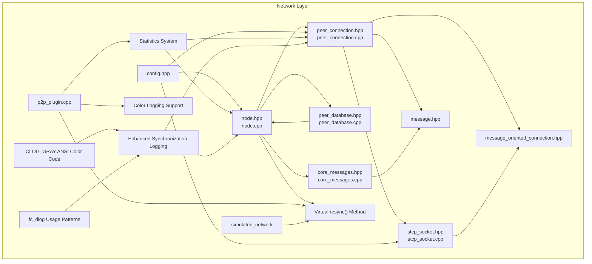

**Diagram sources**
- [node.hpp:190-304](file://libraries/network/include/graphene/network/node.hpp#L190-L304)
- [peer_connection.hpp:79-351](file://libraries/network/include/graphene/network/peer_connection.hpp#L79-L351)
- [message.hpp:42-106](file://libraries/network/include/graphene/network/message.hpp#L42-L106)
- [core_messages.hpp:72-573](file://libraries/network/include/graphene/network/core_messages.hpp#L72-L573)
- [stcp_socket.hpp:37-93](file://libraries/network/include/graphene/network/stcp_socket.hpp#L37-L93)
- [peer_database.hpp:104-134](file://libraries/network/include/graphene/network/peer_database.hpp#L104-L134)
- [message_oriented_connection.hpp:45-79](file://libraries/network/include/graphene/network/message_oriented_connection.hpp#L45-L79)
- [config.hpp:26-106](file://libraries/network/include/graphene/network/config.hpp#L26-L106)
- [p2p_plugin.cpp:500-560](file://plugins/p2p/p2p_plugin.cpp#L500-L560)
- [node.cpp:5281-5286](file://libraries/network/node.cpp#L5281-L5286)
- [node.cpp:346-347](file://libraries/network/node.cpp#L346-L347)

**Section sources**
- [node.hpp:1-355](file://libraries/network/include/graphene/network/node.hpp#L1-L355)
- [peer_connection.hpp:1-383](file://libraries/network/include/graphene/network/peer_connection.hpp#L1-L383)
- [core_messages.hpp:1-573](file://libraries/network/include/graphene/network/core_messages.hpp#L1-L573)
- [stcp_socket.hpp:1-99](file://libraries/network/include/graphene/network/stcp_socket.hpp#L1-L99)
- [peer_database.hpp:1-141](file://libraries/network/include/graphene/network/peer_database.hpp#L1-L141)
- [message.hpp:1-114](file://libraries/network/include/graphene/network/message.hpp#L1-L114)
- [message_oriented_connection.hpp:1-85](file://libraries/network/include/graphene/network/message_oriented_connection.hpp#L1-L85)
- [config.hpp:1-106](file://libraries/network/include/graphene/network/config.hpp#L1-L106)
- [p2p_plugin.cpp:1-742](file://plugins/p2p/p2p_plugin.cpp#L1-L742)

## Core Components
- Node: Central orchestrator for peer discovery, connection management, synchronization, and message broadcasting with virtual resync method support.
- PeerConnection: Manages individual peer sessions, message queuing, inventory tracking, and negotiation states with enhanced logging capabilities.
- CoreMessages: Defines standardized message types for transactions, blocks, inventory, handshake, and operational commands.
- STCP Socket: Provides secure transport via ECDH key exchange and AES encryption.
- PeerDatabase: Maintains peer address records, connection history, and topology hints.
- Message: Encapsulates message headers, payload serialization, and type-safe deserialization.
- MessageOrientedConnection: Bridges secure sockets to message streams with event callbacks.
- **Statistics System: Collects and reports peer performance metrics, latency data, and connection statistics with improved IP address extraction reliability.**
- **P2P Plugin: Integrates peer monitoring, statistics collection, and network diagnostics with enhanced error handling and color-coded logging.**
- **Programmatic Synchronization Control: Enables manual restart of synchronization with all connected peers for network recovery scenarios through virtual method extensibility.**
- **Enhanced Logging: Supports color-coded output for better visibility of network events and peer connection states.**
- **Enhanced Synchronization Logging: Provides systematic fc_dlog usage with CLOG_GRAY color coding for improved synchronization process visibility.**

**Section sources**
- [node.hpp:182-304](file://libraries/network/include/graphene/network/node.hpp#L182-L304)
- [peer_connection.hpp:79-351](file://libraries/network/include/graphene/network/peer_connection.hpp#L79-L351)
- [core_messages.hpp:72-573](file://libraries/network/include/graphene/network/core_messages.hpp#L72-L573)
- [stcp_socket.hpp:37-93](file://libraries/network/include/graphene/network/stcp_socket.hpp#L37-L93)
- [peer_database.hpp:104-134](file://libraries/network/include/graphene/network/peer_database.hpp#L104-L134)
- [message.hpp:42-106](file://libraries/network/include/graphene/network/message.hpp#L42-L106)
- [message_oriented_connection.hpp:45-79](file://libraries/network/include/graphene/network/message_oriented_connection.hpp#L45-L79)
- [p2p_plugin.cpp:500-560](file://plugins/p2p/p2p_plugin.cpp#L500-L560)

## Architecture Overview
The network stack layers securely transport protocol messages between nodes. The Node coordinates peer discovery and synchronization, PeerConnection handles per-peer state and queues, CoreMessages defines the protocol, STCP Socket provides secure transport, and PeerDatabase maintains connectivity hints.

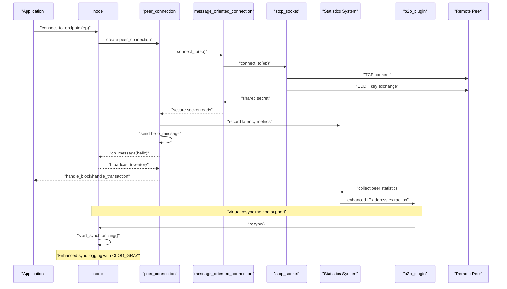

**Diagram sources**
- [node.cpp:780-790](file://libraries/network/node.cpp#L780-L790)
- [peer_connection.cpp:208-242](file://libraries/network/peer_connection.cpp#L208-L242)
- [stcp_socket.cpp:69-72](file://libraries/network/stcp_socket.cpp#L69-L72)
- [p2p_plugin.cpp:500-560](file://plugins/p2p/p2p_plugin.cpp#L500-L560)
- [node.cpp:5281-5286](file://libraries/network/node.cpp#L5281-L5286)

## Detailed Component Analysis

### Node Management (node.hpp, node.cpp)
The Node class is the central coordinator for peer discovery, connection orchestration, synchronization, and message broadcasting. It exposes APIs to:
- Configure listening endpoints and accept incoming connections
- Connect to seed nodes and maintain a peer pool
- Broadcast messages and synchronize with peers
- Track connection counts and network usage statistics
- Manage advanced parameters and peer advertising controls
- **Collect and report peer statistics and call performance metrics with improved IP address extraction**
- **Programmatic synchronization control through the virtual resync() method for extensible behavior**
- **Enhanced synchronization logging with systematic fc_dlog usage and CLOG_GRAY color coding**

Key responsibilities:
- Peer pool management and connection limits
- Synchronization initiation and progress tracking
- Inventory advertisement and request routing
- Bandwidth monitoring and rate limiting
- Firewall detection and NAT traversal helpers
- **Statistics collection and reporting for network performance analysis with reliable peer information handling**
- **Programmatic synchronization restart for network recovery scenarios through virtual method override capability**
- **Comprehensive synchronization process logging with enhanced verbosity and color coding**

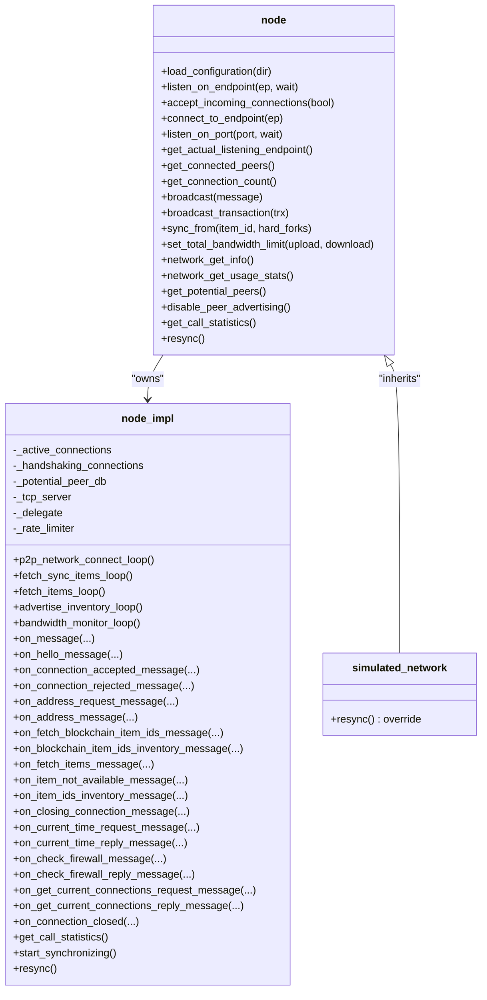

**Diagram sources**
- [node.hpp:190-304](file://libraries/network/include/graphene/network/node.hpp#L190-L304)
- [node.cpp:424-799](file://libraries/network/node.cpp#L424-L799)
- [node.cpp:346-347](file://libraries/network/node.cpp#L346-L347)

**Section sources**
- [node.hpp:182-304](file://libraries/network/include/graphene/network/node.hpp#L182-L304)
- [node.cpp:424-799](file://libraries/network/node.cpp#L424-L799)

### Peer Connection (peer_connection.hpp, peer_connection.cpp)
PeerConnection encapsulates a single peer session, managing:
- Negotiation states (hello, accepted, rejected)
- Message queueing with real/virtual queued messages
- Inventory tracking and deduplication
- Request/response coordination
- Connection lifecycle (accept/connect/close/destroy)
- Rate limiting and throttling
- **Latency tracking and round-trip delay measurement**
- **Blocking status reporting and synchronization control**
- **Enhanced peer information handling with reliable IP address extraction**
- **Enhanced logging with color support for better visibility**

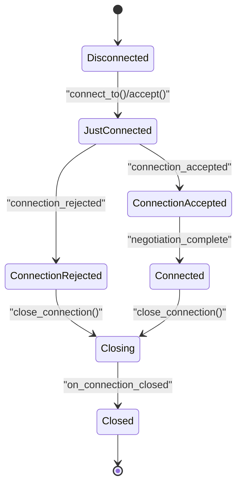

**Diagram sources**
- [peer_connection.hpp:82-106](file://libraries/network/include/graphene/network/peer_connection.hpp#L82-L106)
- [peer_connection.cpp:169-206](file://libraries/network/peer_connection.cpp#L169-L206)

Queueing and throttling:
- Real queued messages: full message payload copied
- Virtual queued messages: item_id only, generated on demand
- Size limits and backpressure to prevent memory pressure

**Section sources**
- [peer_connection.hpp:79-351](file://libraries/network/include/graphene/network/peer_connection.hpp#L79-L351)
- [peer_connection.cpp:41-66](file://libraries/network/peer_connection.cpp#L41-L66)
- [peer_connection.cpp:310-354](file://libraries/network/peer_connection.cpp#L310-L354)

### Core Messages (core_messages.hpp, core_messages.cpp)
Standardized message types for the network protocol:
- Transactions and blocks
- Inventory announcements and requests
- Blockchain ID synchronization
- Handshake and connection control
- Time synchronization and firewall checks
- Current connections reporting
- **Address information with latency metrics and enhanced peer details**

Message type enumeration and structures define the protocol contract. Serialization is handled by the message wrapper.

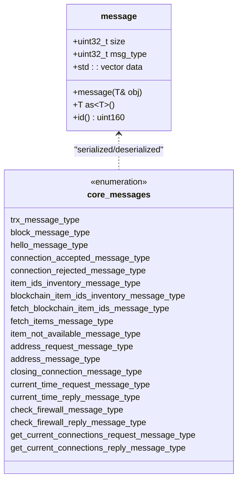

**Diagram sources**
- [message.hpp:42-106](file://libraries/network/include/graphene/network/message.hpp#L42-L106)
- [core_messages.hpp:72-573](file://libraries/network/include/graphene/network/core_messages.hpp#L72-L573)
- [core_messages.cpp:30-49](file://libraries/network/core_messages.cpp#L30-L49)

**Section sources**
- [core_messages.hpp:72-573](file://libraries/network/include/graphene/network/core_messages.hpp#L72-L573)
- [core_messages.cpp:30-49](file://libraries/network/core_messages.cpp#L30-L49)
- [message.hpp:42-106](file://libraries/network/include/graphene/network/message.hpp#L42-L106)

### Secure TCP Socket (stcp_socket.hpp, stcp_socket.cpp)
Provides secure transport using ECDH key exchange and AES encryption:
- Generates ephemeral keys and performs key exchange
- Initializes AES encoder/decoder with derived shared secret
- Enforces block-aligned reads/writes for cipher integrity
- Exposes secure read/write primitives

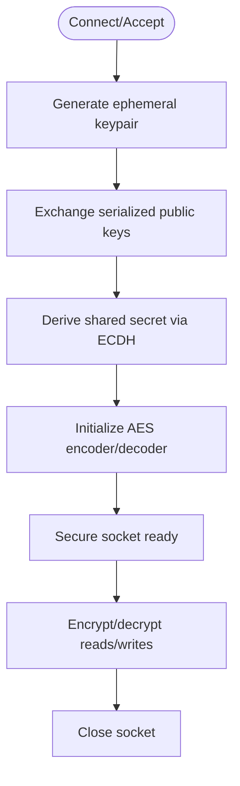

**Diagram sources**
- [stcp_socket.cpp:49-72](file://libraries/network/stcp_socket.cpp#L49-L72)
- [stcp_socket.cpp:132-177](file://libraries/network/stcp_socket.cpp#L132-L177)

**Section sources**
- [stcp_socket.hpp:37-93](file://libraries/network/include/graphene/network/stcp_socket.hpp#L37-L93)
- [stcp_socket.cpp:49-177](file://libraries/network/stcp_socket.cpp#L49-L177)

### Peer Database (peer_database.hpp, peer_database.cpp)
Maintains persistent records of potential peers:
- Endpoint, last seen time, and disposition tracking
- Connection attempt counters and failure reasons
- Iteration over entries sorted by last seen time
- JSON-backed persistence with pruning

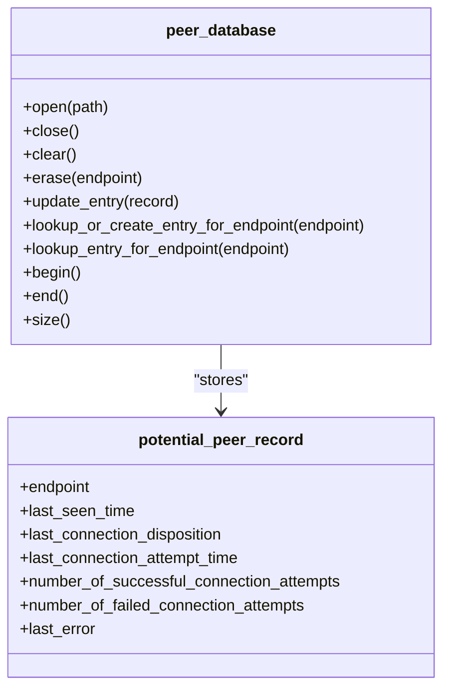

**Diagram sources**
- [peer_database.hpp:104-134](file://libraries/network/include/graphene/network/peer_database.hpp#L104-L134)
- [peer_database.cpp:41-82](file://libraries/network/peer_database.cpp#L41-L82)

**Section sources**
- [peer_database.hpp:104-134](file://libraries/network/include/graphene/network/peer_database.hpp#L104-L134)
- [peer_database.cpp:100-174](file://libraries/network/peer_database.cpp#L100-L174)

### Message Serialization (message.hpp)
Defines the message envelope and serialization:
- Header with size and type
- Payload storage and hashing
- Template-based pack/unpack for protocol messages
- Type safety and runtime checks

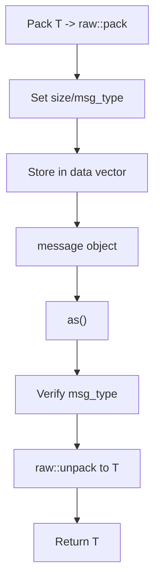

**Diagram sources**
- [message.hpp:70-105](file://libraries/network/include/graphene/network/message.hpp#L70-L105)

**Section sources**
- [message.hpp:42-106](file://libraries/network/include/graphene/network/message.hpp#L42-L106)

## Peer Statistics and Metrics System

**Updated** The network library now includes a comprehensive peer statistics logging system that provides detailed insights into peer performance and network health with improved IP address extraction reliability.

### Latency Tracking System
The system tracks round-trip delay and clock offset for each peer connection:

- **Round Trip Delay**: Measures the time for a message to travel to a peer and back
- **Clock Offset**: Calculates time difference between local and remote peer clocks
- **Latency Reporting**: Exposes peer latency in milliseconds for monitoring and selection

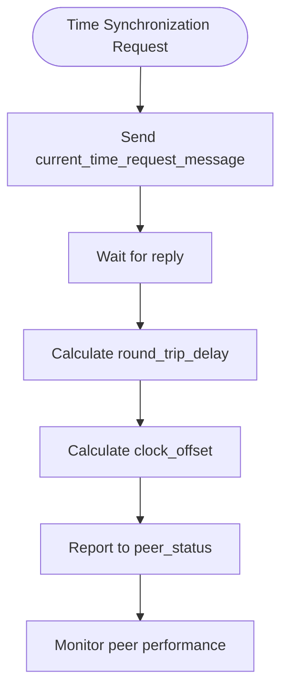

**Diagram sources**
- [node.cpp:3710-3723](file://libraries/network/node.cpp#L3710-L3723)

### Blocking Status Reporting
The system monitors and reports peer blocking conditions that affect synchronization:

- **Inhibit Fetching Sync Blocks**: Tracks peers that are temporarily blocked from receiving sync data
- **Soft Ban Mechanism**: Implements temporary blocking for peers on losing forks during emergency consensus
- **Blocking Reasons**: Reports specific reasons for peer blocking (fork rejection, etc.)

### Enhanced Peer Information Reporting
The peer information system now includes comprehensive metrics with improved reliability:

- **Latency Metrics**: `latency_ms` field showing round-trip delay in milliseconds
- **Blocking Status**: `is_blocked` boolean indicating if peer is currently blocked
- **Blocking Reason**: `blocked_reason` field explaining why peer is blocked
- **Connection Quality**: Firewall status, connection duration, and bandwidth metrics
- **Peer Capabilities**: Platform information, version details, and feature support
- **IP Address Extraction**: Reliable extraction with fallback handling for unknown addresses

### Periodic Statistics Collection
The system implements continuous statistics collection:

- **Call Statistics**: Tracks method execution times, delays, and performance metrics
- **Network Usage**: Monitors upload/download rates over various time periods
- **Performance Monitoring**: Collects rolling averages for bandwidth utilization
- **Delegate Thread Coordination**: Measures delays between P2P thread and delegate thread execution

### Statistics Collection Classes

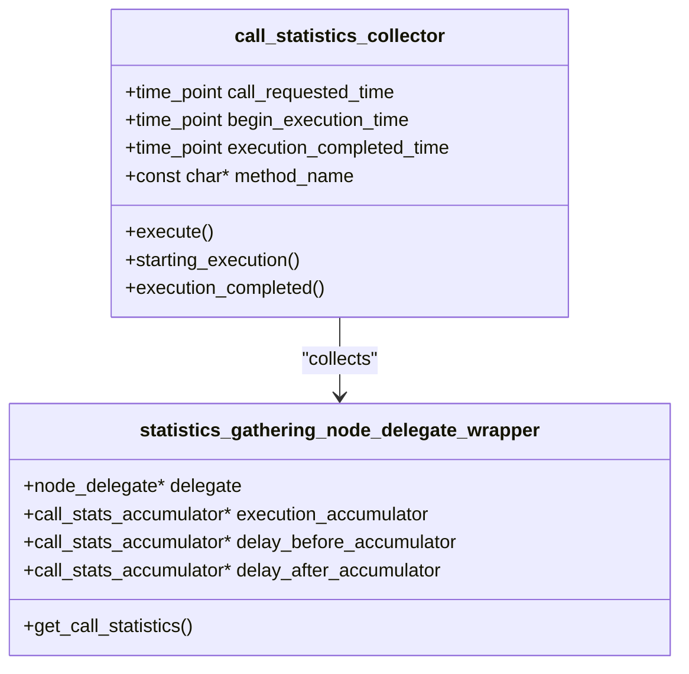

**Diagram sources**
- [node.cpp:312-381](file://libraries/network/node.cpp#L312-L381)
- [node.cpp:383-420](file://libraries/network/node.cpp#L383-L420)

**Section sources**
- [node.hpp:173-179](file://libraries/network/include/graphene/network/node.hpp#L173-L179)
- [node.cpp:4920-4970](file://libraries/network/node.cpp#L4920-L4970)
- [node.cpp:312-381](file://libraries/network/node.cpp#L312-L381)
- [node.cpp:5128-5131](file://libraries/network/node.cpp#L5128-L5131)
- [core_messages.hpp:322-346](file://libraries/network/include/graphene/network/core_messages.hpp#L322-L346)
- [core_messages.hpp:428-448](file://libraries/network/include/graphene/network/core_messages.hpp#L428-L448)

## Peer Information Handling and IP Extraction

**Updated** Critical bug fix implemented in peer information handling that improves IP address extraction reliability and reduces potential conversion overhead in the P2P networking layer.

### Improved IP Address Extraction Reliability
The system now features enhanced IP address extraction with comprehensive error handling:

- **Safe IP Address Retrieval**: Uses `static_cast<std::string>(peer_info.host.get_address())` for reliable address extraction
- **Fallback Error Handling**: Implements try-catch block to handle extraction failures gracefully
- **Default Value Provision**: Sets IP to "(unknown)" when extraction fails, preventing crashes
- **Port Extraction**: Direct port extraction using `peer_info.host.port()` with proper type casting
- **Address Key Generation**: Creates reliable `addr_key = ip + ":" + std::to_string(port)` for peer identification

### Reduced Conversion Overhead
The new implementation minimizes conversion overhead through:

- **Direct String Casting**: Uses `static_cast<std::string>()` for immediate conversion without intermediate steps
- **Efficient Port Handling**: Direct port extraction avoids unnecessary string conversions
- **Optimized Address Key Creation**: Single-line address key generation reduces computational overhead
- **Minimal Memory Allocation**: Reduces temporary string allocations during peer information processing

### Enhanced Peer Statistics Processing
The P2P plugin now processes peer statistics with improved reliability:

- **Latency Metrics Collection**: Extracts `latency_ms` with proper integer conversion
- **Bytes Received Tracking**: Processes `bytesrecv` with unsigned integer handling
- **Blocking Status Monitoring**: Handles `is_blocked` boolean values reliably
- **Reason Analysis**: Captures `blocked_reason` strings for diagnostic purposes
- **Delta Calculation**: Computes byte delta with overflow protection

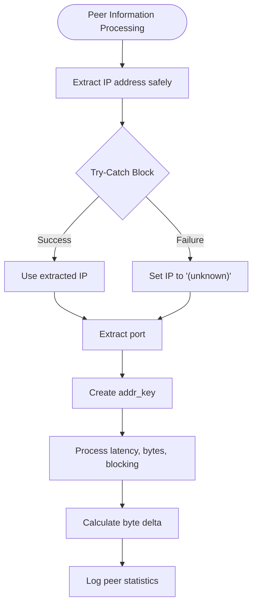

**Diagram sources**
- [p2p_plugin.cpp:500-560](file://plugins/p2p/p2p_plugin.cpp#L500-L560)
- [node.cpp:4900-4970](file://libraries/network/node.cpp#L4900-L4970)

### Peer Information Data Flow
The enhanced system processes peer information through a structured pipeline:

1. **Endpoint Extraction**: Safely extracts peer endpoint with error handling
2. **Metric Collection**: Gathers latency, bytes received, blocking status, and reasons
3. **Delta Computation**: Calculates byte transfer differences with overflow protection
4. **Statistics Logging**: Outputs comprehensive peer statistics with improved reliability

**Section sources**
- [p2p_plugin.cpp:500-560](file://plugins/p2p/p2p_plugin.cpp#L500-L560)
- [node.cpp:4900-4970](file://libraries/network/node.cpp#L4900-L4970)

## Programmatic Synchronization Control

**Updated Section** The network library now provides programmatic control over synchronization through the virtual `resync()` method, enabling manual restart of synchronization with all connected peers and supporting extensible behavior in derived classes.

### Virtual Resync Method Implementation
The `resync()` method provides a clean interface for forcing synchronization restart with enhanced extensibility:

- **Method Purpose**: Restarts synchronization with all currently connected peers
- **Virtual Design**: Declared as virtual in the base `node` class, allowing derived classes to override behavior
- **Implementation**: Calls `start_synchronizing()` which iterates through all active connections
- **Logging**: Emits detailed log messages showing the number of connected peers being restarted
- **Thread Safety**: Verified to run on the correct thread using `VERIFY_CORRECT_THREAD()`

### Enhanced Extensibility for Derived Classes
The virtual nature of `resync()` allows for specialized behavior in derived classes:

- **Base Class Behavior**: Default implementation restarts synchronization with all active peers
- **Simulated Network Override**: `simulated_network` class provides empty implementation for testing
- **Custom Implementations**: Derived classes can override `resync()` to implement custom restart logic
- **Consistent Interface**: All implementations follow the same virtual method contract

### Synchronization Restart Process
When `resync()` is called, the following sequence occurs:

1. **Connection Enumeration**: Iterates through all currently active peer connections
2. **Individual Restart**: Calls `start_synchronizing_with_peer()` for each connected peer
3. **State Reset**: Forces peers to re-establish synchronization state
4. **Inventory Refresh**: Peers re-advertise their inventory and synchronization status

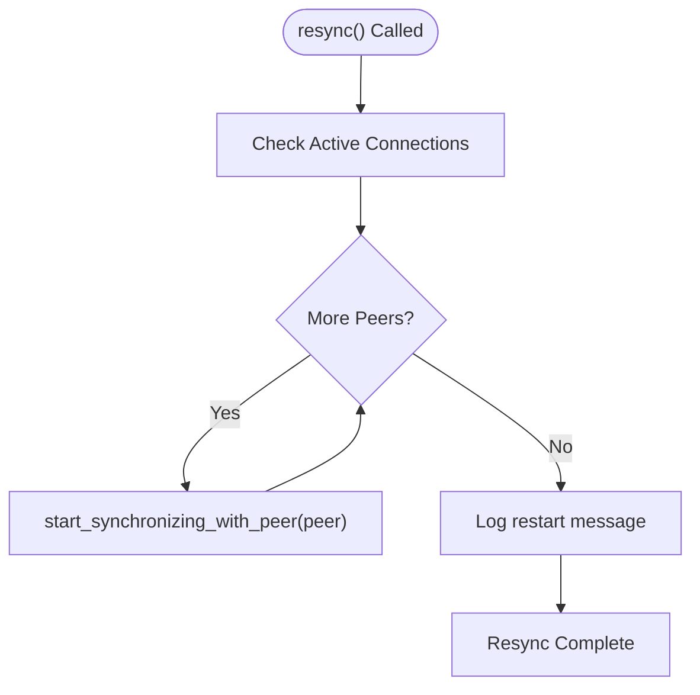

**Diagram sources**
- [node.cpp:5281-5286](file://libraries/network/node.cpp#L5281-L5286)
- [node.cpp:4164-4168](file://libraries/network/node.cpp#L4164-L4168)

### Integration with P2P Plugin
The P2P plugin utilizes the `resync()` method for automatic network recovery:

- **Stale Sync Detection**: Monitors for periods without block reception
- **Automatic Recovery**: When stale sync is detected, calls `resync()` to restart synchronization
- **Seed Reconnection**: Reconnects to seed nodes after resync to ensure continued connectivity
- **Configuration Options**: Controlled by `p2p-stale-sync-detection` and `p2p-stale-sync-timeout-seconds` options

### Use Cases for Programmatic Resync
The `resync()` method is particularly useful for:

- **Network Recovery**: Recovering from partial synchronization failures
- **Manual Intervention**: Operator-driven restart of synchronization
- **Debugging**: Clearing stuck synchronization states during development
- **Network State Changes**: Adapting to significant network topology changes
- **Testing Scenarios**: Simulated network testing with controlled synchronization restarts

**Section sources**
- [node.hpp:298-304](file://libraries/network/include/graphene/network/node.hpp#L298-L304)
- [node.cpp:5281-5286](file://libraries/network/node.cpp#L5281-L5286)
- [node.cpp:4164-4168](file://libraries/network/node.cpp#L4164-L4168)
- [p2p_plugin.cpp:616-618](file://plugins/p2p/p2p_plugin.cpp#L616-L618)
- [node.cpp:346-347](file://libraries/network/node.cpp#L346-L347)

## Enhanced Peer Connection Logging

**Updated Section** The network library now supports enhanced peer connection logging with color-coded output for improved visibility and debugging capabilities.

### Color Logging Support
The P2P plugin implements ANSI color codes for enhanced console logging:

- **Cyan Color**: Used for general statistics and informational messages
- **White Color**: Used for detailed block processing information with latency metrics
- **Reset Code**: Returns to default terminal color after colored output
- **ANSI Escape Sequences**: Standard color codes supported by most terminals

### Color-Coded Log Messages
The logging system provides visual distinction for different types of network events:

- **Block Processing Messages**: White color for detailed block information and transaction counts
- **Statistics Messages**: Cyan color for periodic statistics and peer monitoring information
- **Error Messages**: Red color for critical errors and warnings (when applicable)
- **Debug Messages**: Orange color for detailed debugging information

### Logging Implementation Details
The color logging is implemented using preprocessor macros:

- **CLOG_CYAN**: ANSI escape sequence for cyan text
- **CLOG_WHITE**: ANSI escape sequence for white text  
- **CLOG_RESET**: ANSI escape sequence to reset text color
- **Macro Usage**: Color codes are embedded directly in log message strings

### Benefits of Color Logging
The enhanced logging system provides several advantages:

- **Visual Distinction**: Different types of messages are easily distinguishable by color
- **Improved Debugging**: Color coding helps identify message categories quickly
- **Better Console Reading**: Color contrast makes log output more readable
- **Operator Efficiency**: Faster identification of important information during monitoring

**Section sources**
- [p2p_plugin.cpp:16-19](file://plugins/p2p/p2p_plugin.cpp#L16-L19)
- [p2p_plugin.cpp:169-171](file://plugins/p2p/p2p_plugin.cpp#L169-L171)

## Enhanced Synchronization Logging System

**Updated Section** The network library now features an enhanced synchronization logging system with new CLOG_GRAY ANSI color code and systematic replacement of fc_ilog with fc_dlog throughout the sync process for improved log verbosity and clarity.

### CLOG_GRAY ANSI Color Code Implementation
The synchronization system introduces a new ANSI color code specifically for gray-colored log output:

- **CLOG_GRAY Definition**: `#define CLOG_GRAY "\033[90m"` for dark gray text color
- **CLOG_RESET Definition**: `#define CLOG_RESET "\033[0m"` for resetting text color
- **ANSI Escape Sequences**: Standard color codes compatible with most modern terminals
- **Usage Pattern**: Embedded within log messages to provide visual hierarchy

### Systematic fc_dlog Usage Patterns
The synchronization system has undergone systematic replacement of fc_ilog with fc_dlog for enhanced logging verbosity:

#### Fetch Synchronization Items Loop
- **Enhanced Item Status Logging**: Uses fc_dlog with CLOG_GRAY for detailed item availability status
- **Peer Condition Monitoring**: Logs peer inhibition status and idle conditions with color coding
- **Request Volume Tracking**: Monitors and logs the number of peers actively requesting blocks

#### Blockchain Item Inventory Handling
- **Comprehensive Response Logging**: Uses fc_dlog with CLOG_GRAY for detailed inventory response analysis
- **Block Range Information**: Logs block number ranges and remaining item counts with color coding
- **Validation Diagnostics**: Enhanced logging of validation results and error conditions

#### Sync Status Updates
- **Progress Tracking**: Uses fc_dlog for detailed synchronization progress updates
- **Peer Communication**: Logs peer-specific synchronization status with color coding
- **Resource Management**: Monitors and logs resource allocation during synchronization

#### Sync Start Procedures
- **Initialization Logging**: Uses fc_dlog for comprehensive startup procedure logging
- **Configuration Validation**: Logs configuration validation results with detailed status
- **Resource Preparation**: Monitors and logs resource preparation for synchronization

### Enhanced Logging Verbosity
The new logging system provides significantly improved verbosity:

- **Detailed Peer Analysis**: Comprehensive logging of peer conditions and capabilities
- **Item Tracking**: Enhanced tracking and logging of synchronization items
- **Performance Metrics**: Detailed logging of performance metrics and optimization opportunities
- **Error Diagnostics**: Enhanced error logging with contextual information

### Color-Coded Log Categories
The synchronization logging system categorizes information using color coding:

- **Gray Text (CLOG_GRAY)**: Background synchronization processes and status updates
- **Green Text**: Successful operations and positive outcomes
- **Yellow Text**: Warning conditions and potential issues
- **Red Text**: Critical errors and failure conditions
- **Blue Text**: Debug information and detailed technical data

### Benefits of Enhanced Synchronization Logging
The new logging system provides several advantages:

- **Improved Visibility**: Color coding makes synchronization processes easier to understand
- **Better Debugging**: Enhanced verbosity helps identify synchronization issues quickly
- **Performance Monitoring**: Detailed logging enables performance optimization
- **Operator Efficiency**: Clear visual hierarchy helps operators monitor network health
- **Troubleshooting Support**: Comprehensive logging aids in diagnosing complex synchronization issues

**Section sources**
- [node.cpp:81-81](file://libraries/network/node.cpp#L81-L81)
- [node.cpp:1187-1194](file://libraries/network/node.cpp#L1187-L1194)
- [node.cpp:1200-1202](file://libraries/network/node.cpp#L1200-L1202)
- [node.cpp:2651-2663](file://libraries/network/node.cpp#L2651-L2663)
- [node.cpp:2772-2779](file://libraries/network/node.cpp#L2772-L2779)
- [node.cpp:2790-2796](file://libraries/network/node.cpp#L2790-L2796)

## Dependency Analysis
The network components depend on each other in a layered fashion:
- Node depends on PeerConnection, PeerDatabase, and CoreMessages
- PeerConnection depends on MessageOrientedConnection and STCP Socket
- MessageOrientedConnection depends on STCP Socket and Message
- CoreMessages depends on Protocol types and Message
- Config constants drive behavior across components
- **Statistics system integrates with Node and PeerConnection for metrics collection**
- **P2P plugin integrates with statistics system for enhanced peer monitoring**
- **Resync functionality integrates with Node synchronization system and supports virtual method extensibility**
- **Color logging integrates with P2P plugin for enhanced console output visualization**
- **Enhanced synchronization logging integrates with Node synchronization system and uses CLOG_GRAY color coding**
- **Systematic fc_dlog usage integrates throughout sync process for improved logging verbosity**

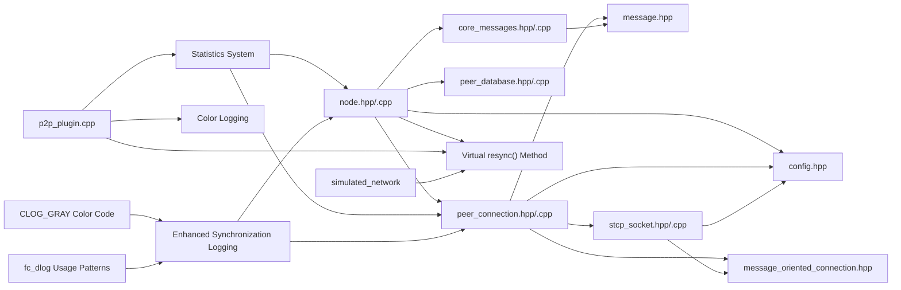

**Diagram sources**
- [node.hpp:26-28](file://libraries/network/include/graphene/network/node.hpp#L26-L28)
- [peer_connection.hpp:26-29](file://libraries/network/include/graphene/network/peer_connection.hpp#L26-L29)
- [core_messages.hpp:26-28](file://libraries/network/include/graphene/network/core_messages.hpp#L26-L28)
- [stcp_socket.hpp:26-28](file://libraries/network/include/graphene/network/stcp_socket.hpp#L26-L28)
- [message_oriented_connection.hpp:26-27](file://libraries/network/include/graphene/network/message_oriented_connection.hpp#L26-L27)
- [config.hpp:26-106](file://libraries/network/include/graphene/network/config.hpp#L26-L106)
- [p2p_plugin.cpp:500-560](file://plugins/p2p/p2p_plugin.cpp#L500-L560)

**Section sources**
- [node.hpp:26-28](file://libraries/network/include/graphene/network/node.hpp#L26-L28)
- [peer_connection.hpp:26-29](file://libraries/network/include/graphene/network/peer_connection.hpp#L26-L29)
- [core_messages.hpp:26-28](file://libraries/network/include/graphene/network/core_messages.hpp#L26-L28)
- [stcp_socket.hpp:26-28](file://libraries/network/include/graphene/network/stcp_socket.hpp#L26-L28)
- [message_oriented_connection.hpp:26-27](file://libraries/network/include/graphene/network/message_oriented_connection.hpp#L26-L27)
- [config.hpp:26-106](file://libraries/network/include/graphene/network/config.hpp#L26-L106)
- [p2p_plugin.cpp:500-560](file://plugins/p2p/p2p_plugin.cpp#L500-L560)

## Performance Considerations
- Connection limits: Desired and maximum connections are configurable to balance throughput and resource usage.
- Queueing: Per-peer message queue enforces a maximum size to prevent memory pressure.
- Inventory limits: Caps on advertised inventory prevent flooding and ensure timely block propagation.
- Prefetching: Interleaved fetching of IDs and items reduces latency during synchronization.
- Rate limiting: Bandwidth monitor tracks read/write rates and applies limits.
- Throttling: Transaction fetching can be inhibited during heavy load to prioritize block sync.
- **Statistics overhead**: Metrics collection adds minimal overhead while providing valuable performance insights.
- **Latency monitoring**: Round-trip delay tracking helps identify slow or problematic peers for connection optimization.
- **IP extraction efficiency**: Improved IP address extraction reduces CPU overhead and prevents crashes from malformed addresses.
- **Error handling**: Comprehensive try-catch blocks prevent cascading failures in peer information processing.
- **Resync efficiency**: Programmatic resync restarts only active connections, minimizing disruption to healthy peers.
- **Virtual method overhead**: Virtual dispatch adds minimal overhead while providing extensibility benefits.
- **Color logging overhead**: ANSI color codes add minimal overhead while significantly improving log readability.
- **Enhanced sync logging overhead**: New CLOG_GRAY color coding and fc_dlog usage adds minimal overhead while dramatically improving synchronization visibility.
- **Logging verbosity optimization**: Systematic fc_dlog usage provides better performance than fc_ilog in debug mode.

## Troubleshooting Guide
Common issues and diagnostics:
- Connection failures: Review peer database entries and last connection dispositions.
- Handshake errors: Validate protocol version and chain ID mismatches.
- Message deserialization errors: Ensure message types match and payloads are intact.
- Memory pressure: Monitor queue sizes and reduce advertised inventory.
- Time synchronization: Use current time request/reply messages to detect clock skew.
- **Latency issues**: Monitor `latency_ms` field to identify slow peers affecting synchronization.
- **Blocking peers**: Check `is_blocked` and `blocked_reason` fields to diagnose synchronization problems.
- **Performance bottlenecks**: Use call statistics to identify slow methods and optimize performance.
- **IP extraction failures**: Monitor for "(unknown)" IP addresses indicating extraction errors.
- **Statistics logging issues**: Verify P2P plugin configuration for statistics collection.
- **Synchronization stalls**: Use `resync()` method to manually restart synchronization with all peers.
- **Virtual method conflicts**: Ensure derived classes properly override `resync()` when extending functionality.
- **Color logging issues**: Verify terminal supports ANSI color codes for proper log output formatting.
- **Enhanced sync logging issues**: Verify CLOG_GRAY color code compatibility and fc_dlog macro definitions.
- **Logging verbosity problems**: Check debug level configuration for fc_dlog vs fc_ilog usage patterns.

Operational controls:
- Disable peer advertising for debugging isolated networks.
- Adjust bandwidth limits to stabilize performance under load.
- Inspect call statistics and connection counts for bottlenecks.
- **Monitor peer metrics**: Regularly review latency and blocking status for network health assessment.
- **Enable statistics logging**: Use `p2p-stats-enabled` option to activate peer monitoring.
- **Configure logging intervals**: Set appropriate `p2p-stats-interval` for desired monitoring frequency.
- **Configure stale sync detection**: Enable `p2p-stale-sync-detection` to automatically recover from stalled synchronization.
- **Manual resync control**: Use `resync()` method for operator-driven synchronization restarts.
- **Extensibility patterns**: Leverage virtual method design for custom synchronization behaviors in derived classes.
- **Color logging configuration**: Ensure terminal supports ANSI color codes for optimal log visualization.
- **Enhanced sync logging configuration**: Verify CLOG_GRAY color code and fc_dlog usage patterns are properly configured.
- **Logging verbosity tuning**: Adjust debug level settings to control fc_dlog vs fc_ilog logging intensity.

**Section sources**
- [peer_database.hpp:39-45](file://libraries/network/include/graphene/network/peer_database.hpp#L39-L45)
- [node.hpp:288-298](file://libraries/network/include/graphene/network/node.hpp#L288-L298)
- [message.hpp:85-105](file://libraries/network/include/graphene/network/message.hpp#L85-L105)
- [node.cpp:4920-4970](file://libraries/network/node.cpp#L4920-L4970)
- [p2p_plugin.cpp:500-560](file://plugins/p2p/p2p_plugin.cpp#L500-L560)

## Conclusion
The Network Library provides a comprehensive, secure, and scalable foundation for peer-to-peer communication. Its modular design separates concerns between node orchestration, peer lifecycle management, protocol messaging, secure transport, and peer topology maintenance. With built-in performance controls, diagnostic capabilities, and extensible message types, it supports efficient blockchain synchronization and robust network operation.

**Updated** The enhanced peer statistics logging system significantly improves network observability by providing detailed latency tracking, blocking status reporting, and comprehensive peer metrics. The critical bug fix in peer information handling ensures reliable IP address extraction with reduced conversion overhead, preventing crashes and improving overall network stability. The integration with the P2P plugin provides comprehensive monitoring capabilities for operators and developers working with the VIZ blockchain network. The new virtual `resync()` method adds powerful programmatic control for network recovery, enabling manual restart of synchronization with all connected peers and improved resilience against various network states and synchronization failures. The virtual method design provides extensibility for derived classes to customize synchronization behavior while maintaining a consistent interface across the network library ecosystem. The enhanced peer connection logging with color support significantly improves the debugging and monitoring experience by providing visual distinction for different types of network events and messages. **The new enhanced synchronization logging system with CLOG_GRAY ANSI color code and systematic fc_dlog usage dramatically improves synchronization process visibility, providing detailed insights into peer conditions, item availability, and synchronization progress while maintaining minimal performance overhead.**