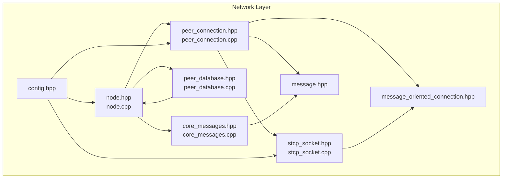
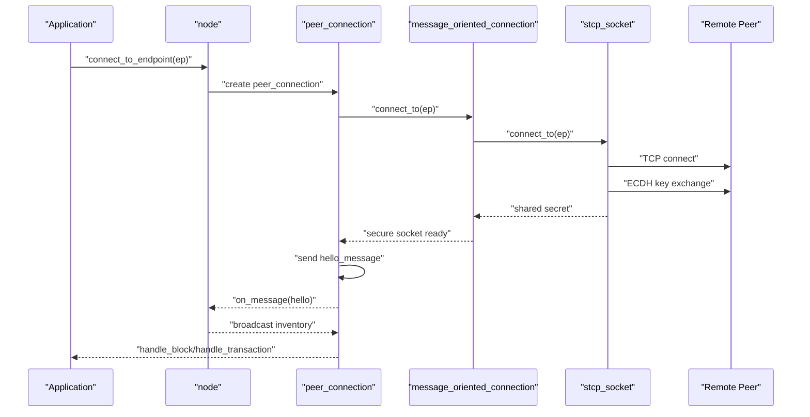
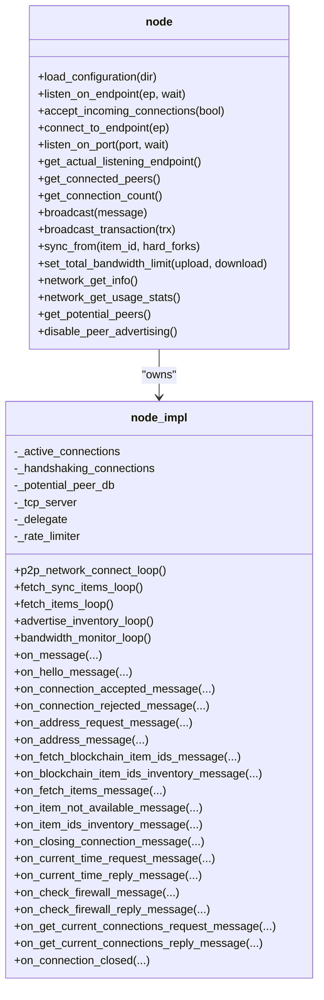
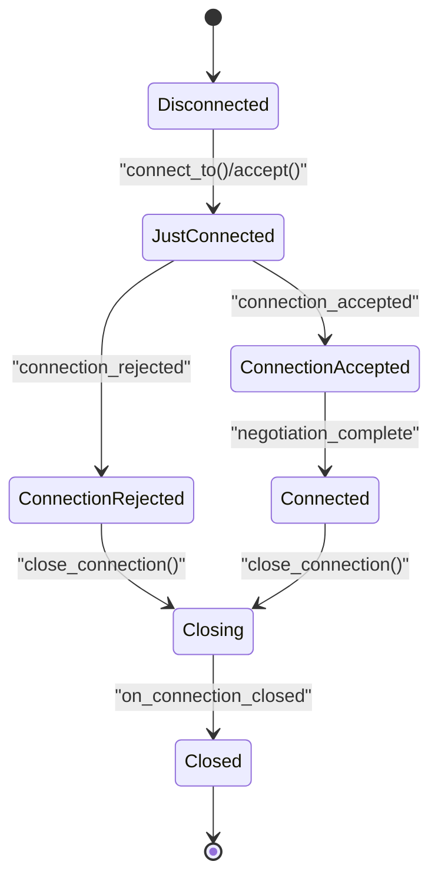
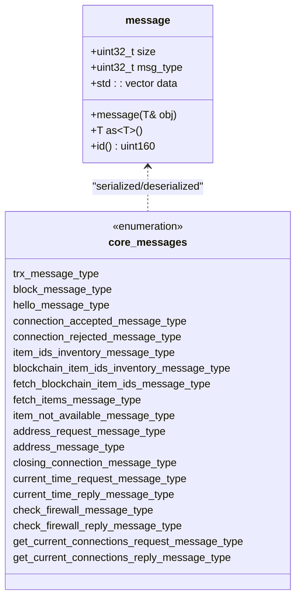
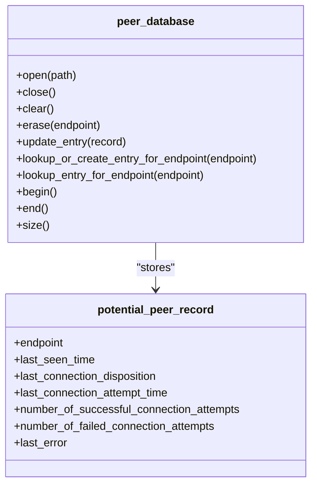
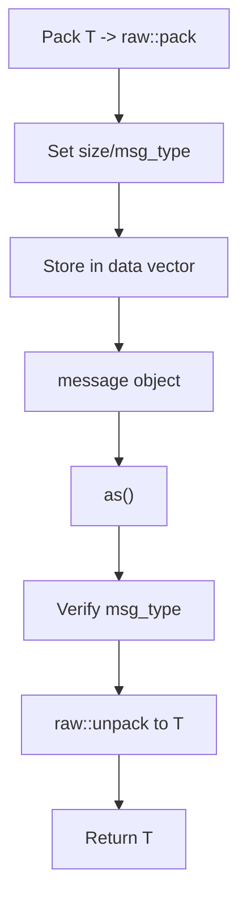
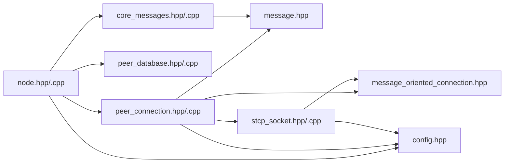

# Network Library

<cite>
**Referenced Files in This Document**
- [node.hpp](file://libraries/network/include/graphene/network/node.hpp)
- [node.cpp](file://libraries/network/node.cpp)
- [peer_connection.hpp](file://libraries/network/include/graphene/network/peer_connection.hpp)
- [peer_connection.cpp](file://libraries/network/peer_connection.cpp)
- [core_messages.hpp](file://libraries/network/include/graphene/network/core_messages.hpp)
- [core_messages.cpp](file://libraries/network/core_messages.cpp)
- [stcp_socket.hpp](file://libraries/network/include/graphene/network/stcp_socket.hpp)
- [stcp_socket.cpp](file://libraries/network/stcp_socket.cpp)
- [peer_database.hpp](file://libraries/network/include/graphene/network/peer_database.hpp)
- [peer_database.cpp](file://libraries/network/peer_database.cpp)
- [message.hpp](file://libraries/network/include/graphene/network/message.hpp)
- [message_oriented_connection.hpp](file://libraries/network/include/graphene/network/message_oriented_connection.hpp)
- [config.hpp](file://libraries/network/include/graphene/network/config.hpp)
</cite>

## Table of Contents
1. [Introduction](#introduction)
2. [Project Structure](#project-structure)
3. [Core Components](#core-components)
4. [Architecture Overview](#architecture-overview)
5. [Detailed Component Analysis](#detailed-component-analysis)
6. [Dependency Analysis](#dependency-analysis)
7. [Performance Considerations](#performance-considerations)
8. [Troubleshooting Guide](#troubleshooting-guide)
9. [Conclusion](#conclusion)

## Introduction
This document describes the Network Library that implements peer-to-peer communication and network protocol for the VIZ node. It covers the node management layer, peer connection orchestration, standard network messages, secure transport, peer address management, and message serialization. The library provides a robust foundation for blockchain synchronization, transaction broadcasting, and block propagation across a distributed network.

## Project Structure
The network library is organized into cohesive modules:
- Node management and synchronization orchestration
- Peer connection lifecycle and message queues
- Standard network message definitions
- Secure TCP transport with ECDH key exchange
- Peer address database and topology maintenance
- Message serialization/deserialization framework
- Configuration constants for protocol behavior

**Diagram sources**
- [node.hpp](file://libraries/network/include/graphene/network/node.hpp#L190-L304)
- [peer_connection.hpp](file://libraries/network/include/graphene/network/peer_connection.hpp#L79-L351)
- [message.hpp](file://libraries/network/include/graphene/network/message.hpp#L42-L106)
- [core_messages.hpp](file://libraries/network/include/graphene/network/core_messages.hpp#L72-L573)
- [stcp_socket.hpp](file://libraries/network/include/graphene/network/stcp_socket.hpp#L37-L93)
- [peer_database.hpp](file://libraries/network/include/graphene/network/peer_database.hpp#L104-L134)
- [message_oriented_connection.hpp](file://libraries/network/include/graphene/network/message_oriented_connection.hpp#L45-L79)
- [config.hpp](file://libraries/network/include/graphene/network/config.hpp#L26-L106)

**Section sources**
- [node.hpp](file://libraries/network/include/graphene/network/node.hpp#L1-L355)
- [peer_connection.hpp](file://libraries/network/include/graphene/network/peer_connection.hpp#L1-L380)
- [core_messages.hpp](file://libraries/network/include/graphene/network/core_messages.hpp#L1-L573)
- [stcp_socket.hpp](file://libraries/network/include/graphene/network/stcp_socket.hpp#L1-L99)
- [peer_database.hpp](file://libraries/network/include/graphene/network/peer_database.hpp#L1-L141)
- [message.hpp](file://libraries/network/include/graphene/network/message.hpp#L1-L114)
- [message_oriented_connection.hpp](file://libraries/network/include/graphene/network/message_oriented_connection.hpp#L1-L85)
- [config.hpp](file://libraries/network/include/graphene/network/config.hpp#L1-L106)

## Core Components
- Node: Central orchestrator for peer discovery, connection management, synchronization, and message broadcasting.
- PeerConnection: Manages individual peer sessions, message queuing, inventory tracking, and negotiation states.
- CoreMessages: Defines standardized message types for transactions, blocks, inventory, handshake, and operational commands.
- STCP Socket: Provides secure transport via ECDH key exchange and AES encryption.
- PeerDatabase: Maintains peer address records, connection history, and topology hints.
- Message: Encapsulates message headers, payload serialization, and type-safe deserialization.
- MessageOrientedConnection: Bridges secure sockets to message streams with event callbacks.

**Section sources**
- [node.hpp](file://libraries/network/include/graphene/network/node.hpp#L182-L304)
- [peer_connection.hpp](file://libraries/network/include/graphene/network/peer_connection.hpp#L79-L351)
- [core_messages.hpp](file://libraries/network/include/graphene/network/core_messages.hpp#L72-L573)
- [stcp_socket.hpp](file://libraries/network/include/graphene/network/stcp_socket.hpp#L37-L93)
- [peer_database.hpp](file://libraries/network/include/graphene/network/peer_database.hpp#L104-L134)
- [message.hpp](file://libraries/network/include/graphene/network/message.hpp#L42-L106)
- [message_oriented_connection.hpp](file://libraries/network/include/graphene/network/message_oriented_connection.hpp#L45-L79)

## Architecture Overview
The network stack layers securely transport protocol messages between nodes. The Node coordinates peer discovery and synchronization, PeerConnection handles per-peer state and queues, CoreMessages defines the protocol, STCP Socket provides secure transport, and PeerDatabase maintains connectivity hints.

**Diagram sources**
- [node.cpp](file://libraries/network/node.cpp#L780-L790)
- [peer_connection.cpp](file://libraries/network/peer_connection.cpp#L208-L242)
- [stcp_socket.cpp](file://libraries/network/stcp_socket.cpp#L69-L72)

## Detailed Component Analysis

### Node Management (node.hpp, node.cpp)
The Node class is the central coordinator for peer discovery, connection orchestration, synchronization, and message broadcasting. It exposes APIs to:
- Configure listening endpoints and accept incoming connections
- Connect to seed nodes and maintain a peer pool
- Broadcast messages and synchronize with peers
- Track connection counts and network usage statistics
- Manage advanced parameters and peer advertising controls

Key responsibilities:
- Peer pool management and connection limits
- Synchronization initiation and progress tracking
- Inventory advertisement and request routing
- Bandwidth monitoring and rate limiting
- Firewall detection and NAT traversal helpers

**Diagram sources**
- [node.hpp](file://libraries/network/include/graphene/network/node.hpp#L190-L304)
- [node.cpp](file://libraries/network/node.cpp#L424-L799)

**Section sources**
- [node.hpp](file://libraries/network/include/graphene/network/node.hpp#L182-L304)
- [node.cpp](file://libraries/network/node.cpp#L424-L799)

### Peer Connection (peer_connection.hpp, peer_connection.cpp)
PeerConnection encapsulates a single peer session, managing:
- Negotiation states (hello, accepted, rejected)
- Message queueing with real/virtual queued messages
- Inventory tracking and deduplication
- Request/response coordination
- Connection lifecycle (accept/connect/close/destroy)
- Rate limiting and throttling

**Diagram sources**
- [peer_connection.hpp](file://libraries/network/include/graphene/network/peer_connection.hpp#L82-L106)
- [peer_connection.cpp](file://libraries/network/peer_connection.cpp#L169-L206)

Queueing and throttling:
- Real queued messages: full message payload copied
- Virtual queued messages: item_id only, generated on demand
- Size limits and backpressure to prevent memory pressure

**Section sources**
- [peer_connection.hpp](file://libraries/network/include/graphene/network/peer_connection.hpp#L79-L351)
- [peer_connection.cpp](file://libraries/network/peer_connection.cpp#L41-L66)
- [peer_connection.cpp](file://libraries/network/peer_connection.cpp#L310-L354)

### Core Messages (core_messages.hpp, core_messages.cpp)
Standardized message types for the network protocol:
- Transactions and blocks
- Inventory announcements and requests
- Blockchain ID synchronization
- Handshake and connection control
- Time synchronization and firewall checks
- Current connections reporting

Message type enumeration and structures define the protocol contract. Serialization is handled by the message wrapper.

**Diagram sources**
- [message.hpp](file://libraries/network/include/graphene/network/message.hpp#L42-L106)
- [core_messages.hpp](file://libraries/network/include/graphene/network/core_messages.hpp#L72-L573)
- [core_messages.cpp](file://libraries/network/core_messages.cpp#L30-L49)

**Section sources**
- [core_messages.hpp](file://libraries/network/include/graphene/network/core_messages.hpp#L72-L573)
- [core_messages.cpp](file://libraries/network/core_messages.cpp#L30-L49)
- [message.hpp](file://libraries/network/include/graphene/network/message.hpp#L42-L106)

### Secure TCP Socket (stcp_socket.hpp, stcp_socket.cpp)
Provides secure transport using ECDH key exchange and AES encryption:
- Generates ephemeral keys and performs key exchange
- Initializes AES encoder/decoder with derived shared secret
- Enforces block-aligned reads/writes for cipher integrity
- Exposes secure read/write primitives

**Diagram sources**
- [stcp_socket.cpp](file://libraries/network/stcp_socket.cpp#L49-L72)
- [stcp_socket.cpp](file://libraries/network/stcp_socket.cpp#L132-L177)

**Section sources**
- [stcp_socket.hpp](file://libraries/network/include/graphene/network/stcp_socket.hpp#L37-L93)
- [stcp_socket.cpp](file://libraries/network/stcp_socket.cpp#L49-L177)

### Peer Database (peer_database.hpp, peer_database.cpp)
Maintains persistent records of potential peers:
- Endpoint, last seen time, and disposition tracking
- Connection attempt counters and failure reasons
- Iteration over entries sorted by last seen time
- JSON-backed persistence with pruning

**Diagram sources**
- [peer_database.hpp](file://libraries/network/include/graphene/network/peer_database.hpp#L104-L134)
- [peer_database.cpp](file://libraries/network/peer_database.cpp#L41-L82)

**Section sources**
- [peer_database.hpp](file://libraries/network/include/graphene/network/peer_database.hpp#L104-L134)
- [peer_database.cpp](file://libraries/network/peer_database.cpp#L100-L174)

### Message Serialization (message.hpp)
Defines the message envelope and serialization:
- Header with size and type
- Payload storage and hashing
- Template-based pack/unpack for protocol messages
- Type safety and runtime checks

**Diagram sources**
- [message.hpp](file://libraries/network/include/graphene/network/message.hpp#L70-L105)

**Section sources**
- [message.hpp](file://libraries/network/include/graphene/network/message.hpp#L42-L106)

## Dependency Analysis
The network components depend on each other in a layered fashion:
- Node depends on PeerConnection, PeerDatabase, and CoreMessages
- PeerConnection depends on MessageOrientedConnection and STCP Socket
- MessageOrientedConnection depends on STCP Socket and Message
- CoreMessages depends on Protocol types and Message
- Config constants drive behavior across components

**Diagram sources**
- [node.hpp](file://libraries/network/include/graphene/network/node.hpp#L26-L28)
- [peer_connection.hpp](file://libraries/network/include/graphene/network/peer_connection.hpp#L26-L29)
- [core_messages.hpp](file://libraries/network/include/graphene/network/core_messages.hpp#L26-L28)
- [stcp_socket.hpp](file://libraries/network/include/graphene/network/stcp_socket.hpp#L26-L28)
- [message_oriented_connection.hpp](file://libraries/network/include/graphene/network/message_oriented_connection.hpp#L26-L27)
- [config.hpp](file://libraries/network/include/graphene/network/config.hpp#L26-L106)

**Section sources**
- [node.hpp](file://libraries/network/include/graphene/network/node.hpp#L26-L28)
- [peer_connection.hpp](file://libraries/network/include/graphene/network/peer_connection.hpp#L26-L29)
- [core_messages.hpp](file://libraries/network/include/graphene/network/core_messages.hpp#L26-L28)
- [stcp_socket.hpp](file://libraries/network/include/graphene/network/stcp_socket.hpp#L26-L28)
- [message_oriented_connection.hpp](file://libraries/network/include/graphene/network/message_oriented_connection.hpp#L26-L27)
- [config.hpp](file://libraries/network/include/graphene/network/config.hpp#L26-L106)

## Performance Considerations
- Connection limits: Desired and maximum connections are configurable to balance throughput and resource usage.
- Queueing: Per-peer message queue enforces a maximum size to prevent memory pressure.
- Inventory limits: Caps on advertised inventory prevent flooding and ensure timely block propagation.
- Prefetching: Interleaved fetching of IDs and items reduces latency during synchronization.
- Rate limiting: Bandwidth monitor tracks read/write rates and applies limits.
- Throttling: Transaction fetching can be inhibited during heavy load to prioritize block sync.

[No sources needed since this section provides general guidance]

## Troubleshooting Guide
Common issues and diagnostics:
- Connection failures: Review peer database entries and last connection dispositions.
- Handshake errors: Validate protocol version and chain ID mismatches.
- Message deserialization errors: Ensure message types match and payloads are intact.
- Memory pressure: Monitor queue sizes and reduce advertised inventory.
- Time synchronization: Use current time request/reply messages to detect clock skew.

Operational controls:
- Disable peer advertising for debugging isolated networks.
- Adjust bandwidth limits to stabilize performance under load.
- Inspect call statistics and connection counts for bottlenecks.

**Section sources**
- [peer_database.hpp](file://libraries/network/include/graphene/network/peer_database.hpp#L39-L45)
- [node.hpp](file://libraries/network/include/graphene/network/node.hpp#L288-L298)
- [message.hpp](file://libraries/network/include/graphene/network/message.hpp#L85-L105)

## Conclusion
The Network Library provides a comprehensive, secure, and scalable foundation for peer-to-peer communication. Its modular design separates concerns between node orchestration, peer lifecycle management, protocol messaging, secure transport, and peer topology maintenance. With built-in performance controls, diagnostic capabilities, and extensible message types, it supports efficient blockchain synchronization and robust network operation.