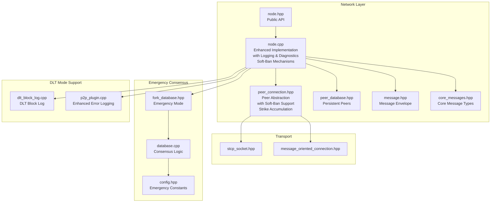
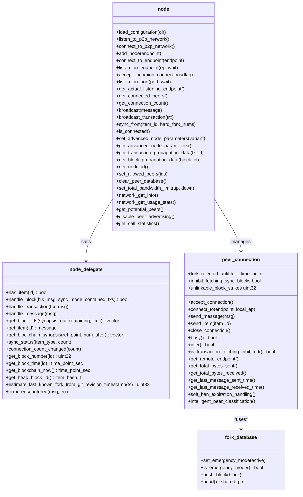
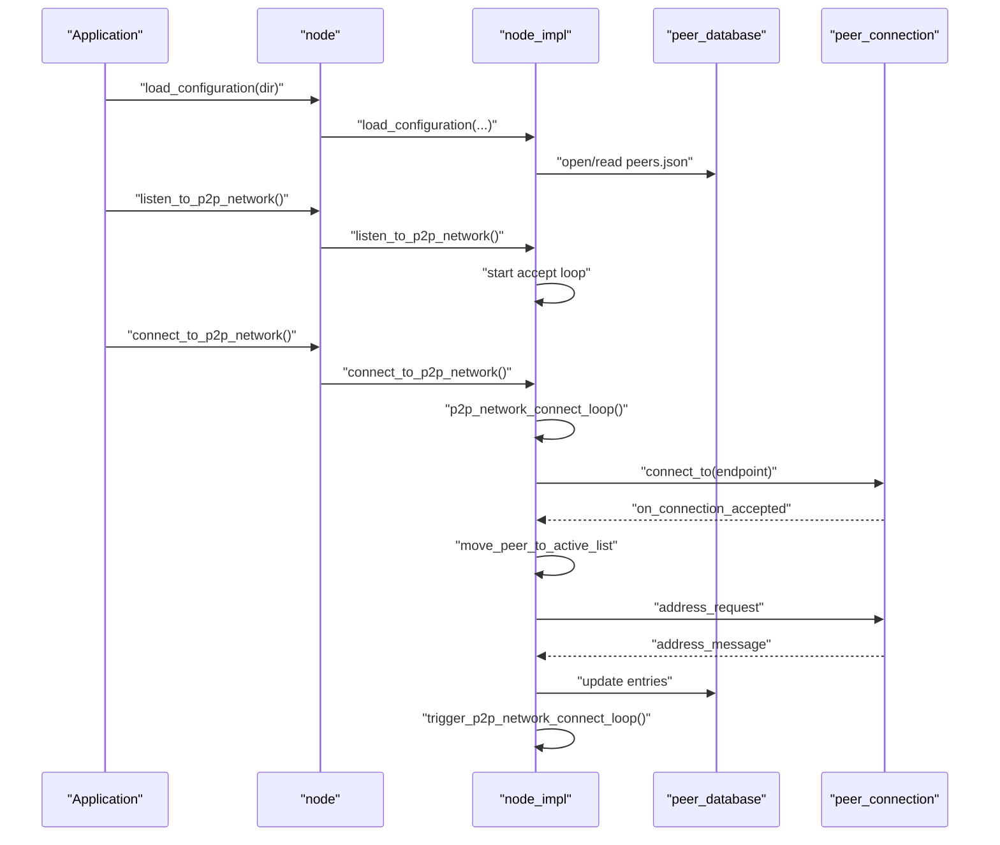
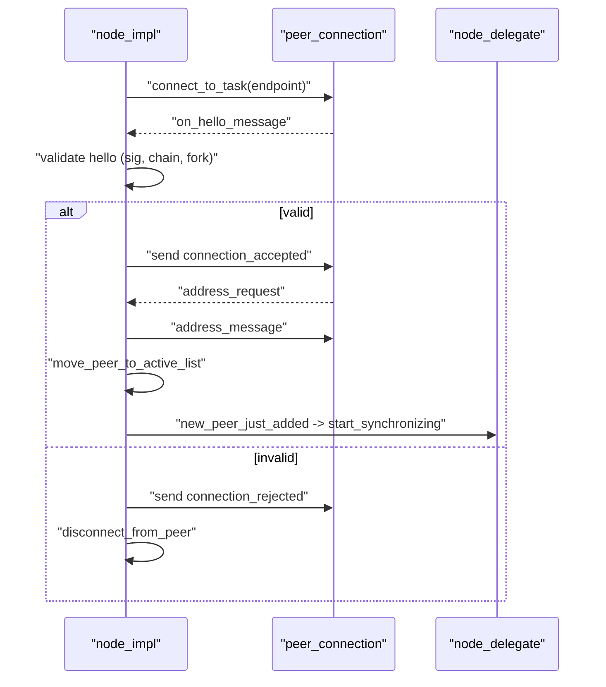
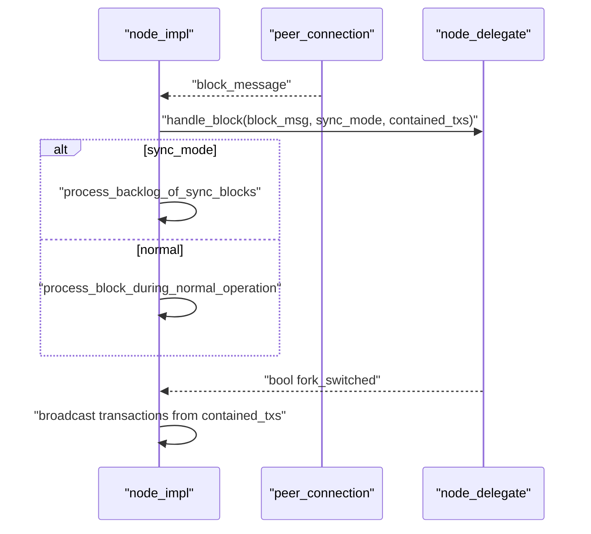
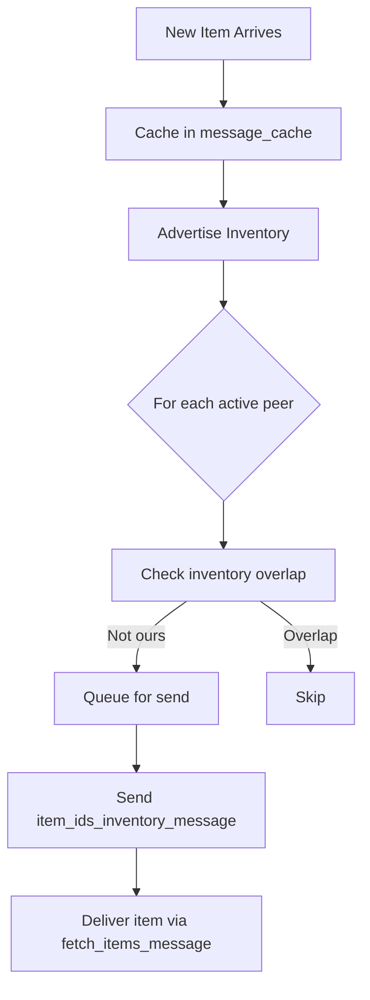
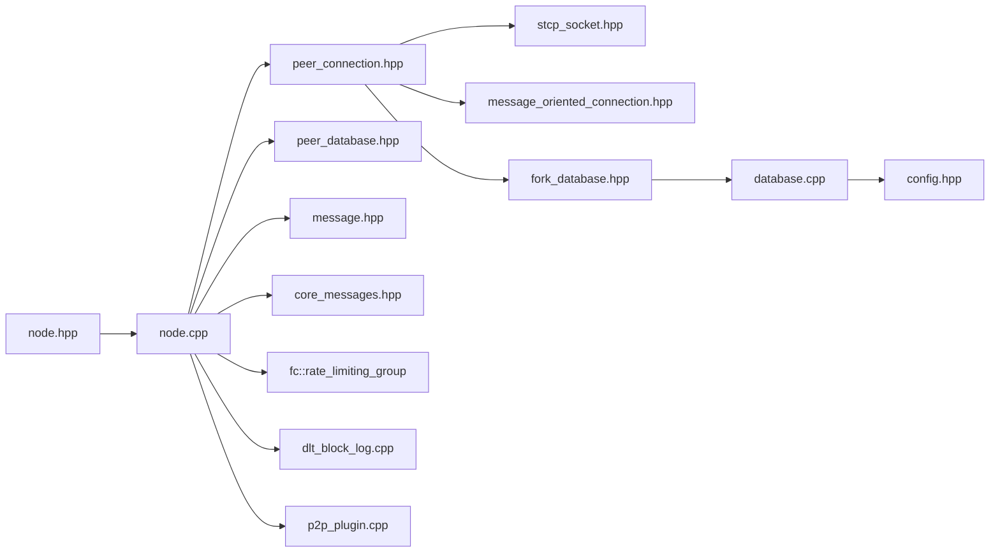

# Node Management

<cite>
**Referenced Files in This Document**
- [node.hpp](file://libraries/network/include/graphene/network/node.hpp)
- [node.cpp](file://libraries/network/node.cpp)
- [peer_connection.hpp](file://libraries/network/include/graphene/network/peer_connection.hpp)
- [peer_database.hpp](file://libraries/network/include/graphene/network/peer_database.hpp)
- [message.hpp](file://libraries/network/include/graphene/network/message.hpp)
- [config.hpp](file://libraries/network/include/graphene/network/config.hpp)
- [core_messages.hpp](file://libraries/network/include/graphene/network/core_messages.hpp)
- [exceptions.hpp](file://libraries/network/include/graphene/network/exceptions.hpp)
- [stcp_socket.hpp](file://libraries/network/include/graphene/network/stcp_socket.hpp)
- [message_oriented_connection.hpp](file://libraries/network/include/graphene/network/message_oriented_connection.hpp)
- [fork_database.hpp](file://libraries/chain/include/graphene/chain/fork_database.hpp)
- [fork_database.cpp](file://libraries/chain/fork_database.cpp)
- [database.cpp](file://libraries/chain/database.cpp)
- [config.hpp](file://libraries/protocol/include/graphene/protocol/config.hpp)
- [p2p_plugin.cpp](file://plugins/p2p/p2p_plugin.cpp)
- [dlt_block_log.cpp](file://libraries/chain/dlt_block_log.cpp)
- [config.ini](file://share/vizd/config/config.ini)
</cite>

## Update Summary
**Changes Made**
- Enhanced peer management with intelligent strike counting for unlinkable blocks during synchronization
- Implemented automatic soft-banning system with 20-strike threshold and configurable durations (15 minutes default, 5 minutes for trusted peers)
- Added comprehensive peer status reporting with unlinkable_block_strikes counter
- Enhanced error logging for peer synchronization issues with detailed strike information
- Integrated trusted peer support with reduced soft-ban duration for snapshot nodes

## Table of Contents
1. [Introduction](#introduction)
2. [Project Structure](#project-structure)
3. [Core Components](#core-components)
4. [Architecture Overview](#architecture-overview)
5. [Detailed Component Analysis](#detailed-component-analysis)
6. [Enhanced Peer Synchronization Logging](#enhanced-peer-synchronization-logging)
7. [Intelligent Soft-Ban Mechanisms](#intelligent-soft-ban-mechanisms)
8. [Comprehensive Peer Status Reporting](#comprehensive-peer-status-reporting)
9. [Enhanced Error Reporting and Diagnostics](#enhanced-error-reporting-and-diagnostics)
10. [Peer State Management and Monitoring](#peer-state-management-and-monitoring)
11. [Dependency Analysis](#dependency-analysis)
12. [Performance Considerations](#performance-considerations)
13. [Troubleshooting Guide](#troubleshooting-guide)
14. [Conclusion](#conclusion)

## Introduction
This document describes the Node Management component responsible for orchestrating network peers, maintaining connectivity, and managing blockchain synchronization in the P2P layer. It covers the node.hpp class interface, the node_delegate integration for blockchain callbacks, configuration and lifecycle APIs, peer management, and network broadcasting with inventory tracking. The documentation now includes comprehensive coverage of enhanced peer synchronization logging, intelligent soft-ban mechanisms with strike accumulation, detailed peer status reporting, and improved error diagnostics for better debugging and monitoring capabilities.

## Project Structure
The Node Management functionality spans several headers and the implementation source file:
- Public interface: node.hpp defines the node class, node_delegate interface, and related types.
- Implementation: node.cpp implements the node lifecycle, peer orchestration, message routing, synchronization, and inventory management with enhanced logging and diagnostics.
- Peer model: peer_connection.hpp defines the peer connection abstraction and state machine with emergency consensus support and soft-ban functionality.
- Persistence: peer_database.hpp provides persistent peer discovery records.
- Messaging: message.hpp defines the generic message envelope; core_messages.hpp enumerates core P2P message types.
- Networking primitives: stcp_socket.hpp and message_oriented_connection.hpp underpin transport and framing.
- Emergency consensus: fork_database.hpp/cpp and database.cpp implement emergency mode functionality.



**Diagram sources**
- [node.hpp:180-355](file://libraries/network/include/graphene/network/node.hpp#L180-L355)
- [node.cpp:869-905](file://libraries/network/node.cpp#L869-L905)
- [peer_connection.hpp:79-354](file://libraries/network/include/graphene/network/peer_connection.hpp#L79-L354)
- [peer_database.hpp:104-134](file://libraries/network/include/graphene/network/peer_database.hpp#L104-L134)
- [message.hpp:42-114](file://libraries/network/include/graphene/network/message.hpp#L42-L114)
- [core_messages.hpp](file://libraries/network/include/graphene/network/core_messages.hpp)
- [fork_database.hpp:111-120](file://libraries/chain/include/graphene/chain/fork_database.hpp#L111-L120)
- [database.cpp:4334-4463](file://libraries/chain/database.cpp#L4334-L4463)
- [config.hpp:110-123](file://libraries/protocol/include/graphene/protocol/config.hpp#L110-L123)
- [dlt_block_log.cpp:368-379](file://libraries/chain/dlt_block_log.cpp#L368-L379)
- [p2p_plugin.cpp:330-360](file://plugins/p2p/p2p_plugin.cpp#L330-L360)

**Section sources**
- [node.hpp:180-355](file://libraries/network/include/graphene/network/node.hpp#L180-L355)
- [node.cpp:869-905](file://libraries/network/node.cpp#L869-L905)

## Core Components
- node class: Provides P2P orchestration, configuration, peer management, and broadcast APIs with comprehensive logging capabilities.
- node_delegate interface: Bridges the P2P layer to the blockchain, handling block ingestion, transaction processing, and sync callbacks with enhanced status reporting.
- peer_connection: Encapsulates a single peer link with state machine, inventory tracking, rate-limited messaging, emergency consensus support, and intelligent soft-ban functionality with strike accumulation.
- peer_database: Persistent store of potential peers with connection history and disposition.
- message: Generic envelope for all P2P messages with hashing and typed serialization.
- fork_database: Manages blockchain forks with emergency consensus mode support and deterministic tie-breaking.

Key responsibilities:
- Lifecycle: Construction, configuration loading, listener setup, and graceful shutdown with detailed logging.
- Peer orchestration: Connecting to configured seeds, accepting inbound connections, pruning inactive peers, and enforcing connection limits with comprehensive status reporting.
- Synchronization: Requesting and processing blockchain item IDs, fetching blocks/transactions, and notifying the delegate with enhanced progress tracking.
- Broadcasting: Advertising inventory and sending items to peers with detailed synchronization metrics.
- Inventory management: Tracking what peers have, what we need, and what we've recently processed with peer-specific logging.
- Emergency consensus: Managing soft-bans, automatic flag resets, and emergency mode operations with enhanced diagnostics.
- Intelligent peer handling: Differentiating between stale fork peers and legitimate sync candidates to prevent infinite loops.
- DLT mode support: Enhanced error logging with comprehensive block range information for distributed ledger technology mode.
- Comprehensive logging: Detailed peer synchronization progress, item counts, block ranges, and timing information for better debugging and monitoring.
- **Enhanced soft-ban mechanisms**: Intelligent strike accumulation system with 20-strike threshold, trusted peer support, and automatic soft-ban expiration handling.
- **Intelligent strike counting**: Unlinkable block detection with automatic strike accumulation for tolerant peer management during synchronization.

**Section sources**
- [node.hpp:180-355](file://libraries/network/include/graphene/network/node.hpp#L180-L355)
- [node.cpp:869-905](file://libraries/network/node.cpp#L869-L905)
- [peer_connection.hpp:79-354](file://libraries/network/include/graphene/network/peer_connection.hpp#L79-L354)
- [peer_database.hpp:104-134](file://libraries/network/include/graphene/network/peer_database.hpp#L104-L134)
- [message.hpp:42-114](file://libraries/network/include/graphene/network/message.hpp#L42-L114)
- [fork_database.hpp:111-120](file://libraries/chain/include/graphene/chain/fork_database.hpp#L111-L120)

## Architecture Overview
The node delegates blockchain integration to a node_delegate and coordinates peers via peer_connection instances. The node maintains separate queues for sync and normal operation, enforces bandwidth and connection limits, and periodically prunes stale peers. The enhanced peer handling system provides network-level resilience through intelligent soft-ban mechanisms, automatic flag resets, and deterministic tie-breaking to prevent cascading failures and infinite sync loops. The comprehensive logging system provides detailed peer synchronization progress, item counts, block ranges, and timing information for better debugging and monitoring capabilities.



**Diagram sources**
- [node.hpp:180-355](file://libraries/network/include/graphene/network/node.hpp#L180-L355)
- [peer_connection.hpp:79-354](file://libraries/network/include/graphene/network/peer_connection.hpp#L79-L354)
- [fork_database.hpp:111-120](file://libraries/chain/include/graphene/chain/fork_database.hpp#L111-L120)

## Detailed Component Analysis

### Node Lifecycle Management
- Construction and destruction: The node allocates an internal node_impl and initializes defaults for connection targets, timeouts, and rate limiting. On destruction, it attempts to gracefully close connections and updates the peer database.
- Configuration: load_configuration reads node-specific settings (listening endpoint, accept flags) from a JSON file in the configuration directory.
- Listener setup: listen_to_p2p_network and listen_on_endpoint/listen_on_port configure the TCP server to accept inbound connections, with optional retry behavior when the port is busy.
- Startup and shutdown: connect_to_p2p_network initiates outbound connections; close() and destructor ensure cleanup.

Operational loops:
- p2p_network_connect_loop: Periodically connects to candidate peers, respecting retry/backoff and connection caps.
- fetch_sync_items_loop: Requests missing sync items from peers and schedules processing.
- fetch_items_loop: Normal operation fetching of items not yet in local cache.
- advertise_inventory_loop: Broadcasts new inventory to peers.
- terminate_inactive_connections_loop: Detects and disconnects idle/inactive peers.
- bandwidth_monitor_loop: Updates rolling averages of read/write throughput.
- fetch_updated_peer_lists_loop: Requests updated peer lists periodically.
- dump_node_status_task: Periodically logs comprehensive peer status and synchronization progress.



**Diagram sources**
- [node.cpp:952-1047](file://libraries/network/node.cpp#L952-L1047)
- [node.cpp:1623-1654](file://libraries/network/node.cpp#L1623-L1654)
- [node.cpp:2282-2350](file://libraries/network/node.cpp#L2282-L2350)

**Section sources**
- [node.cpp:869-931](file://libraries/network/node.cpp#L869-L931)
- [node.cpp:952-1047](file://libraries/network/node.cpp#L952-L1047)
- [node.cpp:1623-1654](file://libraries/network/node.cpp#L1623-L1654)
- [node.cpp:2282-2350](file://libraries/network/node.cpp#L2282-L2350)

### Peer Connection Establishment
- Outbound: connect_to_endpoint creates a peer_connection and initiates a connect loop; on success, transitions to negotiation and then active.
- Inbound: accept_loop accepts sockets and starts accept_or_connect_task; after hello exchange, moves to active and starts synchronization.
- Handshake validation: Verifies signatures, chain ID, fork compatibility, and prevents self-connections and duplicates.
- Firewall detection: Uses check-firewall messages to infer NAT/firewall status.
- Emergency consensus: Soft-ban peers on fork rejection with automatic expiration handling and intelligent peer classification.



**Diagram sources**
- [node.cpp:2029-2230](file://libraries/network/node.cpp#L2029-L2230)
- [node.cpp:2232-2250](file://libraries/network/node.cpp#L2232-L2250)
- [node.cpp:2282-2350](file://libraries/network/node.cpp#L2282-L2350)

**Section sources**
- [node.cpp:2029-2230](file://libraries/network/node.cpp#L2029-L2230)
- [node.cpp:2232-2250](file://libraries/network/node.cpp#L2232-L2250)
- [node.cpp:2282-2350](file://libraries/network/node.cpp#L2282-L2350)

### Network Topology Maintenance
- Peer selection: Maintains a potential peer database with last-seen timestamps, disposition, and attempt counts; applies exponential backoff and retry windows.
- Connection caps: Tracks handshaking, active, closing, and terminating sets; enforces desired/max connection counts.
- Inactivity pruning: Disconnects peers exceeding inactivity thresholds and reschedules outstanding requests to others.
- Peer advertising: Optionally disables advertising to restrict exposure.
- Emergency consensus: Implements soft-ban mechanisms to prevent cascading disconnections during network emergencies.
- Intelligent peer classification: Differentiates between stale fork peers and legitimate sync candidates to prevent infinite loops.


**Diagram sources**
- [node.cpp:952-1047](file://libraries/network/node.cpp#L952-L1047)

**Section sources**
- [node.cpp:952-1047](file://libraries/network/node.cpp#L952-L1047)
- [node.cpp:1400-1621](file://libraries/network/node.cpp#L1400-L1621)

### Blockchain Integration via node_delegate
- Block handling: handle_block receives new blocks during sync or normal operation; returns whether a fork switch occurred; populates contained transaction IDs for propagation.
- Transaction processing: handle_transaction validates and accepts transactions.
- Sync callbacks: get_block_ids, get_blockchain_synopsis, sync_status, and connection_count_changed inform the delegate about sync progress and peer counts.
- Fork awareness: Estimates last known fork from timestamps and rejects incompatible peers.



**Diagram sources**
- [node.hpp:79-80](file://libraries/network/include/graphene/network/node.hpp#L79-L80)
- [node.cpp:3117-3199](file://libraries/network/node.cpp#L3117-L3199)

**Section sources**
- [node.hpp:79-80](file://libraries/network/include/graphene/network/node.hpp#L79-L80)
- [node.cpp:3117-3199](file://libraries/network/node.cpp#L3117-L3199)

### Configuration Methods
- load_configuration: Reads node_config.json and sets listening endpoint, accept flags, and persistence directory.
- listen_on_endpoint/accept_incoming_connections/listen_on_port: Configure the TCP listener and availability behavior.
- set_advanced_node_parameters/get_advanced_node_parameters: Tuning knobs for advanced behavior.
- set_total_bandwidth_limit: Configures upload/download rate limiting.
- disable_peer_advertising: Restricts outbound peer advertisement.

**Section sources**
- [node.hpp:200-294](file://libraries/network/include/graphene/network/node.hpp#L200-L294)
- [node.cpp:933-950](file://libraries/network/node.cpp#L933-L950)
- [node.cpp:1686-1713](file://libraries/network/node.cpp#L1686-L1713)

### Peer Management Functions
- add_node/connect_to_endpoint: Adds a seed or forces immediate connection.
- get_connected_peers: Returns status for UI/monitoring with comprehensive peer information.
- get_connection_count/is_connected: Reports current connectivity.
- set_allowed_peers/clear_peer_database: Controls allowed peers and resets peer DB for diagnostics.
- get_potential_peers/disable_peer_advertising: Inspect and control peer discovery.

**Section sources**
- [node.hpp:211-296](file://libraries/network/include/graphene/network/node.hpp#L211-L296)
- [node.cpp:1788-1841](file://libraries/network/node.cpp#L1788-L1841)
- [node.cpp:2282-2350](file://libraries/network/node.cpp#L2282-L2350)

### Network Broadcasting and Inventory
- broadcast/broadcast_transaction: Queues outgoing messages and triggers inventory advertisement.
- Inventory tracking: Per-peer inventories (advertised to us/advertised to peer) and node-wide new_inventory set.
- Rate limiting: fc::rate_limiting_group controls bandwidth.
- Message caching: blockchain_tied_message_cache stores recent messages for retrieval.



**Diagram sources**
- [node.cpp:1326-1398](file://libraries/network/node.cpp#L1326-L1398)
- [node.cpp:2830-2892](file://libraries/network/node.cpp#L2830-L2892)
- [node.cpp:111-217](file://libraries/network/node.cpp#L111-L217)

**Section sources**
- [node.cpp:1326-1398](file://libraries/network/node.cpp#L1326-L1398)
- [node.cpp:2830-2892](file://libraries/network/node.cpp#L2830-L2892)
- [node.cpp:111-217](file://libraries/network/node.cpp#L111-L217)

## Enhanced Peer Synchronization Logging

### Comprehensive Peer Status Updates
The node now provides detailed peer status updates with comprehensive synchronization metrics and peer state information. The dump_node_status() function logs extensive information about peer connections, synchronization progress, and resource usage.

**Enhanced Status Logging Features**:
- **Peer Connection States**: Logs active, handshaking, and closing peer counts with detailed state information
- **Synchronization Progress**: Tracks sync item counts, peer synchronization status, and remaining item counts
- **Memory Usage Metrics**: Monitors node and peer-specific memory usage including queue sizes
- **Timing Information**: Logs connection times, last message timestamps, and synchronization timing
- **Block Information**: Tracks current head blocks, block numbers, and block times for each peer

**Status Update Logging Format**:
```
----------------- PEER STATUS UPDATE --------------------
 number of peers: ${active} active, ${handshaking}, ${closing} closing.  attempting to maintain ${desired} - ${maximum} peers
       active peer ${endpoint} peer_is_in_sync_with_us:${in_sync_with_us} we_are_in_sync_with_peer:${in_sync_with_them}
              above peer has ${count} sync items we might need
              we are not fetching sync blocks from the above peer (inhibit_fetching_sync_blocks == true)
  handshaking peer ${endpoint} in state ours(${our_state}) theirs(${their_state})
--------- MEMORY USAGE ------------
node._active_sync_requests size: ${size}
node._received_sync_items size: ${size}
node._new_received_sync_items size: ${size}
node._items_to_fetch size: ${size}
node._new_inventory size: ${size}
node._message_cache size: ${size}
  peer ${endpoint}
    peer.ids_of_items_to_get size: ${size}
    peer.inventory_peer_advertised_to_us size: ${size}
    peer.inventory_advertised_to_peer size: ${size}
    peer.items_requested_from_peer size: ${size}
    peer.sync_items_requested_from_peer size: ${size}
--------- END MEMORY USAGE ------------
```

**Section sources**
- [node.cpp:5160-5196](file://libraries/network/node.cpp#L5160-L5196)

### Detailed Synchronization Progress Tracking
The node implements comprehensive logging for peer synchronization progress with detailed item count tracking and block range information.

**Enhanced Sync Logging Features**:
- **Item Count Tracking**: Logs remaining item counts, sync item counts, and total unfetched items
- **Block Range Information**: Provides detailed block number ranges in synchronization responses
- **Peer Coordination Metrics**: Tracks synchronization progress across multiple peers
- **Timing Information**: Logs synchronization timing, request timestamps, and response delays
- **Progress Monitoring**: Real-time monitoring of synchronization completion percentages

**Sync Progress Logging Examples**:
```
sync: sending synopsis to peer ${peer}: ${count} entries, last_item=#${num} (${hash})
on_blockchain_item_ids_inventory: peer=${peer}, items_available=${count} (blocks #${first}..#${last}), remaining=${remaining}, we_requested=${requested}, we_need_sync=${sync}, peer_needs_sync=${peer_sync}
```

**Section sources**
- [node.cpp:2616-2663](file://libraries/network/node.cpp#L2616-L2663)
- [node.cpp:2649-2663](file://libraries/network/node.cpp#L2649-L2663)

### Enhanced Request Timeout and Keepalive Logging
The node provides detailed logging for peer request timeouts, keepalive messages, and connection termination events with comprehensive timing information.

**Enhanced Timeout Logging Features**:
- **Request Timeout Detection**: Logs peer request timeouts with item details, block numbers, and timing thresholds
- **Keepalive Message Tracking**: Monitors peer inactivity and sends keepalive messages with timeout information
- **Connection Termination Events**: Logs forced disconnections, closing timeouts, and termination failures
- **Detailed Error Context**: Provides comprehensive error context including peer endpoints, item types, and block numbers

**Timeout Logging Examples**:
```
Disconnecting peer ${peer} because they didn't respond to my request for item ${id} (type=${type}, block_num=${num}, requested_at=${time}, threshold=${thresh})
Sending a keepalive message to peer ${peer} who hasn't sent us any messages in the last ${timeout} seconds
Forcibly disconnecting peer ${peer} who failed to close their connection in a timely manner
```

**Section sources**
- [node.cpp:1574-1590](file://libraries/network/node.cpp#L1574-L1590)
- [node.cpp:1600-1603](file://libraries/network/node.cpp#L1600-L1603)
- [node.cpp:1615-1618](file://libraries/network/node.cpp#L1615-L1618)

## Intelligent Soft-Ban Mechanisms

### Strike Accumulation System
The node now implements an intelligent soft-ban mechanism with strike accumulation to prevent network abuse while tolerating occasional legitimate issues. The system tracks unlinkable blocks at or below the node's head block and accumulates strikes before applying soft-bans.

**Strike Accumulation Features**:
- **Unlinkable Block Detection**: Monitors blocks that cannot be linked to the current blockchain (at or below head)
- **Strike Counter**: Tracks unlinkable blocks per peer with automatic increment on violations
- **Threshold Enforcement**: Soft-bans peers after accumulating 20 strikes
- **Automatic Reset**: Resets strike counter to zero after successful soft-ban application
- **Intelligent Tolerance**: Allows occasional stale blocks without immediate punishment

**Soft-Ban Duration Management**:
- **Default Duration**: 15 minutes (900 seconds) for regular peers
- **Trusted Peer Duration**: 5 minutes (300 seconds) for trusted peers
- **Expiration Handling**: Automatic flag reset when soft-ban period expires
- **Flag Management**: Automatically clears inhibit_fetching_sync_blocks flag on expiration

**Section sources**
- [node.cpp:3540-3562](file://libraries/network/node.cpp#L3540-L3562)
- [node.cpp:3920-3940](file://libraries/network/node.cpp#L3920-L3940)
- [node.cpp:5501-5534](file://libraries/network/node.cpp#L5501-L5534)

### Trusted Peer Support
The node implements trusted peer functionality with reduced soft-ban duration for snapshot nodes and other trusted entities. This allows for faster network recovery while maintaining security.

**Trusted Peer Features**:
- **Configuration Support**: Configurable trusted peer endpoints via trusted-snapshot-peer setting
- **Reduced Duration**: 5-minute soft-ban period compared to 15-minute default
- **IP Address Storage**: Stores trusted peer IPs as 32-bit integers for O(1) lookup
- **Automatic Detection**: Identifies trusted peers during connection establishment

**Section sources**
- [config.ini:103-108](file://share/vizd/config/config.ini#L103-L108)
- [node.cpp:5501-5534](file://libraries/network/node.cpp#L5501-L5534)

### Soft-Ban Expiration and Automatic Recovery
The node implements comprehensive soft-ban expiration handling with automatic flag reset functionality to ensure network recovery after temporary issues.

**Expiration Handling Features**:
- **Time-Based Enforcement**: Tracks soft-ban expiration via fork_rejected_until timestamp
- **Automatic Flag Reset**: Clears inhibit_fetching_sync_blocks when ban expires
- **Recovery Logging**: Logs automatic flag reset events for monitoring
- **Continuous Operation**: Ensures peers can resume normal operation after soft-ban period

**Section sources**
- [node.cpp:3540-3562](file://libraries/network/node.cpp#L3540-L3562)
- [node.cpp:3920-3940](file://libraries/network/node.cpp#L3920-L3940)
- [peer_connection.hpp:276-283](file://libraries/network/include/graphene/network/peer_connection.hpp#L276-L283)

## Comprehensive Peer Status Reporting

### Enhanced Peer Information Collection
The node provides comprehensive peer status information through the get_connected_peers() method, collecting detailed metrics for monitoring and debugging purposes.

**Enhanced Peer Status Fields**:
- **Basic Connection Info**: Host endpoint, local endpoint, connection direction, and service information
- **Network Statistics**: Bytes sent/received, connection time, latency measurements, and bandwidth usage
- **Peer Classification**: Firewall status, banned status, sync node designation, and platform information
- **Block Information**: Current head block, block number, block time, and git revision details
- **Synchronization Status**: Sync inhibition status, blocked reason, and peer synchronization state
- **Soft-Ban Information**: fork_rejected_until timestamp, unlinkable_block_strikes counter

**Peer Status Data Collection**:
```cpp
peer_details["addr"] = endpoint ? (std::string)*endpoint : std::string();
peer_details["addrlocal"] = (std::string)peer->get_local_endpoint();
peer_details["services"] = "00000001";
peer_details["lastsend"] = peer->get_last_message_sent_time().sec_since_epoch();
peer_details["lastrecv"] = peer->get_last_message_received_time().sec_since_epoch();
peer_details["bytessent"] = peer->get_total_bytes_sent();
peer_details["bytesrecv"] = peer->get_total_bytes_received();
peer_details["conntime"] = peer->get_connection_time();
peer_details["latency_ms"] = peer->round_trip_delay.count() / 1000;
peer_details["is_blocked"] = peer->inhibit_fetching_sync_blocks;
peer_details["blocked_reason"] = peer->inhibit_fetching_sync_blocks ? std::string("fork_rejected") : std::string("");
peer_details["current_head_block"] = peer->last_block_delegate_has_seen;
peer_details["current_head_block_number"] = _delegate->get_block_number(peer->last_block_delegate_has_seen);
peer_details["current_head_block_time"] = peer->last_block_time_delegate_has_seen;
peer_details["soft_ban_expiration"] = peer->fork_rejected_until.sec_since_epoch();
peer_details["unlinkable_block_strikes"] = peer->unlinkable_block_strikes;
```

**Section sources**
- [node.cpp:5281-5359](file://libraries/network/node.cpp#L5281-L5359)

### Memory Usage and Resource Monitoring
The node implements comprehensive memory usage monitoring for both node-level and peer-level resource tracking, providing insights into synchronization performance and resource utilization.

**Memory Usage Monitoring Features**:
- **Node-Level Metrics**: Active sync requests, received sync items, new received sync items, items to fetch, new inventory, and message cache sizes
- **Peer-Level Metrics**: Per-peer queue sizes including sync items, inventory tracking, and request tracking
- **Resource Allocation**: Memory usage tracking for different synchronization phases and operational modes
- **Performance Indicators**: Queue depths, cache sizes, and memory pressure indicators

**Memory Usage Logging Format**:
```
--------- MEMORY USAGE ------------
node._active_sync_requests size: ${size}
node._received_sync_items size: ${size}
node._new_received_sync_items size: ${size}
node._items_to_fetch size: ${size}
node._new_inventory size: ${size}
node._message_cache size: ${size}
  peer ${endpoint}
    peer.ids_of_items_to_get size: ${size}
    peer.inventory_peer_advertised_to_us size: ${size}
    peer.inventory_advertised_to_peer size: ${size}
    peer.items_requested_from_peer size: ${size}
    peer.sync_items_requested_from_peer size: ${size}
--------- END MEMORY USAGE ------------
```

**Section sources**
- [node.cpp:5181-5196](file://libraries/network/node.cpp#L5181-L5196)

### Connection State and Lifecycle Logging
The node provides detailed logging for peer connection lifecycle events including connection establishment, closure, and termination with comprehensive status information.

**Connection Lifecycle Logging Features**:
- **Connection Events**: New peer connections, peer closure notifications, and connection terminations
- **State Transitions**: Detailed logging of peer state changes including active, handshaking, and closing states
- **Reason Information**: Logging of connection closure reasons including user-initiated closures and error conditions
- **Timing Information**: Connection initiation times, closure times, and termination timestamps

**Connection Lifecycle Logging Examples**:
```
New peer is connected (${peer}), now ${count} active peers
Peer connection closing (${peer}), now ${count} active peers
Peer connection closing (${peer}): ${reason}, now ${count} active peers
Peer connection terminating (${peer}), now ${count} active peers
```

**Section sources**
- [node.cpp:5139-5158](file://libraries/network/node.cpp#L5139-L5158)

## Enhanced Error Reporting and Diagnostics

### Comprehensive Error Logging Infrastructure
The node implements a comprehensive error logging infrastructure with detailed context information for peer synchronization issues, providing actionable insights for debugging and monitoring.

**Enhanced Error Logging Features**:
- **Peer-Specific Errors**: Detailed error logging with peer endpoints, item types, and block information
- **Synchronization Errors**: Comprehensive logging of synchronization failures including timeout errors and item availability issues
- **Connection Errors**: Detailed connection error reporting with reason codes, error types, and resolution suggestions
- **Diagnostic Information**: Context-rich error messages including timing information, peer states, and synchronization progress

**Error Logging Examples**:
```
Disconnecting peer ${peer} because they didn't respond to my request for item ${id} (type=${type}, block_num=${num}, requested_at=${time}, threshold=${thresh})
Disconnecting peer ${peer} because they didn't respond to my request for sync item ids after ${synopsis}
Disconnecting from peer ${peer} who offered us an implausible number of blocks, their last block would be in the future (${timestamp})
Peer ${peer} doesn't have the requested item ${item} (block #${num})
Soft-banning peer ${endpoint} for ${dur}s: ${strikes} unlinkable blocks at or below our head #${head}
```

**Section sources**
- [node.cpp:1574-1590](file://libraries/network/node.cpp#L1574-L1590)
- [node.cpp:1561-1561](file://libraries/network/node.cpp#L1561-L1561)
- [node.cpp:2890-2901](file://libraries/network/node.cpp#L2890-L2901)
- [node.cpp:3034-3038](file://libraries/network/node.cpp#L3034-L3038)
- [node.cpp:3540-3562](file://libraries/network/node.cpp#L3540-L3562)

### Item Availability and Not Available Logging
The node provides detailed logging for item availability issues during synchronization, helping identify peers with limited block history or synchronization problems.

**Enhanced Item Availability Logging Features**:
- **Item Request Failures**: Logging of items not available from peers with detailed block information
- **DLT Node Detection**: Recognition of DLT (snapshot) nodes with limited block history
- **Peer Limitation Handling**: Intelligent handling of peers with restricted synchronization capabilities
- **Alternative Peer Assignment**: Logging of alternative peer assignment when items are unavailable

**Item Availability Logging Examples**:
```
Block ${hash} (num #${num}) not available to serve to peer — sending item_not_available
item_not_available: peer ${peer} doesn't have sync block #${num} (${id}) but also needs items from us — inhibiting sync fetch
item_not_available: peer ${peer} can't serve sync block #${num} (${id}) — inhibiting sync from this peer, will try other peers.
```

**Section sources**
- [node.cpp:2951-2956](file://libraries/network/node.cpp#L2951-L2956)
- [node.cpp:3052-3077](file://libraries/network/node.cpp#L3052-L3077)

### Synchronization Status and Progress Reporting
The node implements comprehensive synchronization status reporting with detailed item count tracking and progress monitoring for better understanding of synchronization performance.

**Enhanced Sync Status Reporting Features**:
- **Item Count Tracking**: Real-time tracking of total unfetched items across all peers
- **Progress Monitoring**: Continuous monitoring of synchronization progress with item type and count information
- **Peer Coordination**: Coordinated status reporting across multiple peers for comprehensive synchronization view
- **Threshold-Based Updates**: Efficient status updates only when significant changes occur in synchronization progress

**Sync Status Reporting Examples**:
```
new_number_of_unfetched_items = calculate_unsynced_block_count_from_all_peers()
_delegate->sync_status(blockchain_item_ids_inventory_message_received.item_type, new_number_of_unfetched_items)
```

**Section sources**
- [node.cpp:2903-2910](file://libraries/network/node.cpp#L2903-L2910)
- [node.cpp:2906-2908](file://libraries/network/node.cpp#L2906-L2908)

## Peer State Management and Monitoring

### Intelligent Peer State Classification
The node implements intelligent peer state classification with detailed monitoring of peer synchronization states, connection health, and resource utilization.

**Peer State Classification Features**:
- **Synchronization States**: Active synchronization, peer synchronization, and inhibit fetching states
- **Connection Health**: Monitoring of peer connection quality, latency, and bandwidth utilization
- **Resource Utilization**: Tracking of peer-specific resource usage including queue depths and memory allocation
- **Performance Metrics**: Latency measurements, round-trip delays, and connection timing information
- **Soft-Ban Status**: Monitoring of fork_rejected_until timestamps and unlinkable_block_strikes counters

**Peer State Monitoring Examples**:
```
peer_is_in_sync_with_us:${in_sync_with_us} we_are_in_sync_with_peer:${in_sync_with_them}
above peer has ${count} sync items we might need
we are not fetching sync blocks from the above peer (inhibit_fetching_sync_blocks == true)
Soft-banning peer ${endpoint} for ${dur}s: ${strikes} unlinkable blocks at or below our head #${head}
```

**Section sources**
- [node.cpp:5166-5174](file://libraries/network/node.cpp#L5166-L5174)
- [node.cpp:3540-3562](file://libraries/network/node.cpp#L3540-L3562)

### Connection Limit and Bandwidth Monitoring
The node provides comprehensive monitoring of connection limits, bandwidth utilization, and peer resource allocation to ensure optimal network performance.

**Connection and Bandwidth Monitoring Features**:
- **Connection Limits**: Monitoring of active connections, handshaking peers, and connection caps
- **Bandwidth Utilization**: Real-time tracking of upload/download speeds and bandwidth allocation
- **Resource Allocation**: Monitoring of peer-specific resource allocation and queue management
- **Performance Optimization**: Dynamic adjustment of connection parameters based on network conditions

**Connection Monitoring Examples**:
```
number of peers: ${active} active, ${handshaking}, ${closing} closing.  attempting to maintain ${desired} - ${maximum} peers
node._active_sync_requests size: ${size}
node._items_to_fetch size: ${size}
Soft-ban duration: ${duration} seconds for peer ${endpoint}
```

**Section sources**
- [node.cpp:5163-5165](file://libraries/network/node.cpp#L5163-L5165)
- [node.cpp:5182-5187](file://libraries/network/node.cpp#L5182-L5187)

### Peer Discovery and Potential Peer Management
The node implements comprehensive peer discovery and management with detailed logging of potential peer database operations and peer relationship tracking.

**Peer Discovery and Management Features**:
- **Potential Peer Database**: Comprehensive tracking of potential peers with connection history and disposition
- **Peer Relationship Tracking**: Monitoring of peer relationships, connection success rates, and failure patterns
- **Discovery Optimization**: Intelligent peer discovery with exponential backoff and retry strategies
- **Database Operations**: Detailed logging of peer database updates, lookups, and maintenance operations

**Section sources**
- [node.cpp:2517-2522](file://libraries/network/node.cpp#L2517-L2522)

## Dependency Analysis
The node depends on:
- peer_connection for per-peer state and messaging with emergency consensus support and soft-ban functionality.
- peer_database for persistent peer records.
- message/core_messages for typed envelopes and core message dispatch.
- stcp_socket and message_oriented_connection for transport and framing.
- fc::rate_limiting_group for bandwidth control.
- fork_database for emergency consensus mode management.
- dlt_block_log for DLT mode block availability tracking.
- p2p_plugin for enhanced error logging and DLT mode support.



**Diagram sources**
- [node.hpp:180-355](file://libraries/network/include/graphene/network/node.hpp#L180-L355)
- [node.cpp:869-905](file://libraries/network/node.cpp#L869-L905)
- [peer_connection.hpp:79-354](file://libraries/network/include/graphene/network/peer_connection.hpp#L79-L354)
- [peer_database.hpp:104-134](file://libraries/network/include/graphene/network/peer_database.hpp#L104-L134)
- [message.hpp:42-114](file://libraries/network/include/graphene/network/message.hpp#L42-L114)
- [core_messages.hpp](file://libraries/network/include/graphene/network/core_messages.hpp)
- [fork_database.hpp:111-120](file://libraries/chain/include/graphene/chain/fork_database.hpp#L111-L120)
- [database.cpp:4334-4463](file://libraries/chain/database.cpp#L4334-L4463)
- [config.hpp:110-123](file://libraries/protocol/include/graphene/protocol/config.hpp#L110-L123)
- [dlt_block_log.cpp:368-379](file://libraries/chain/dlt_block_log.cpp#L368-L379)
- [p2p_plugin.cpp:330-360](file://plugins/p2p/p2p_plugin.cpp#L330-L360)

**Section sources**
- [node.hpp:180-355](file://libraries/network/include/graphene/network/node.hpp#L180-L355)
- [node.cpp:869-905](file://libraries/network/node.cpp#L869-L905)

## Performance Considerations
- Connection limits: desired/max connections cap concurrent peers; enforced in is_wanting_new_connections and is_accepting_new_connections.
- Bandwidth throttling: rate limiter updates rolling averages and constrains upload/download rates.
- Prefetching: Limits for sync and normal operations prevent resource exhaustion.
- Inactivity pruning: Keeps the mesh healthy by dropping idle peers and rescheduling requests.
- Inventory deduplication: Prevents redundant fetches and unbounded growth of fetch queues.
- Emergency consensus overhead: Minimal performance impact through efficient soft-ban expiration checks.
- Automatic flag management: Reduces manual intervention requirements during extended emergency operations.
- Intelligent peer classification: Optimizes peer selection and reduces wasted bandwidth on stale forks.
- Soft-ban caching: Prevents repeated attempts with problematic peers during emergency periods.
- Trusted peer optimization: Reduced soft-ban duration for trusted peers enables faster network recovery.
- DLT mode monitoring: Enhanced logging provides better visibility into block availability without significant performance impact.
- Peer status reporting: Comprehensive status updates enable better monitoring and resource management.
- Comprehensive logging: Detailed peer synchronization progress, item counts, and timing information provide valuable debugging insights without significant performance impact.
- Memory usage monitoring: Efficient memory tracking helps identify resource bottlenecks and optimize performance.
- **Intelligent soft-ban mechanisms**: Strike accumulation system prevents abuse while tolerating occasional legitimate issues, with minimal performance overhead.
- **Automatic recovery**: Soft-ban expiration handling ensures network recovery without manual intervention, maintaining operational efficiency.
- **Intelligent strike counting**: Unlinkable block detection with automatic strike accumulation provides tolerant peer management during synchronization without impacting performance.

## Troubleshooting Guide
Common issues and resolutions:
- Port binding conflicts: Use listen_on_port with wait_if_endpoint_is_busy=true to retry; otherwise, allow dynamic port selection.
- Rejection reasons: Review connection_rejected_message reason codes (e.g., connected_to_self, already_connected, not_accepting_connections, different_chain, outdated client).
- Firewall/NAT: Use check-firewall messages to detect; adjust inbound/outbound ports and consider advertised inbound addresses.
- Peer database corruption: Clear peer database via clear_peer_database to reset discovery state.
- Bandwidth saturation: Adjust set_total_bandwidth_limit and review advertised inventory sizes.
- Hard fork incompatibility: Upgrade client if rejected due to inability to process future blocks.
- Emergency mode activation: Monitor logs for "EMERGENCY CONSENSUS MODE activated" messages; system automatically handles recovery.
- Soft-ban effects: If experiencing reduced peer connectivity, check soft-ban expiration timestamps; system should automatically reset flags.
- Flag reset issues: Verify inhibit_fetching_sync_blocks flag resets after soft-ban expiration; manual intervention rarely needed.
- Infinite sync loops: Monitor peer behavior; system now prevents endless sync attempts through intelligent soft-ban mechanisms.
- Stale fork detection: System automatically soft-bans peers on stale forks to prevent wasted resources.
- Trusted peer issues: Verify trusted-snapshot-peer configuration for reduced 5-minute soft-ban duration.
- Block rejection handling: Monitor unlinkable_block_exception patterns to identify stale fork vs legitimate sync scenarios.
- DLT mode errors: Review enhanced error logs for detailed block availability context including available range and dlt_block_log boundaries.
- Sync status monitoring: Use peer status updates to monitor synchronization progress and identify stuck peers.
- Memory usage: Monitor peer queue sizes and memory usage through status reports to identify resource bottlenecks.
- Request timeouts: Review detailed timeout logs with item types, block numbers, and timing thresholds to identify slow or unresponsive peers.
- Connection lifecycle: Monitor connection establishment, closure, and termination events to identify connection stability issues.
- Synchronization progress: Use comprehensive sync status reporting to track synchronization completion and identify bottlenecks.
- **Soft-ban strike accumulation**: Monitor unlinkable_block_strikes counter to understand peer behavior and identify potential abuse patterns.
- **Soft-ban duration**: Verify soft-ban duration settings (default 15 minutes, trusted peers 5 minutes) for appropriate network recovery.
- **Automatic recovery**: Monitor automatic flag reset logs to ensure proper network recovery after soft-ban expiration.
- **Intelligent peer classification**: Use peer status information to identify trusted peers and understand soft-ban behavior differences.
- **Strike threshold monitoring**: Track 20-strike threshold for sync reject strikes to identify problematic peers during synchronization.

**Section sources**
- [node.cpp:2251-2280](file://libraries/network/node.cpp#L2251-L2280)
- [node.cpp:2137-2168](file://libraries/network/node.cpp#L2137-L2168)
- [node.cpp:1686-1713](file://libraries/network/node.cpp#L1686-L1713)
- [node.cpp:1326-1398](file://libraries/network/node.cpp#L1326-L1398)
- [database.cpp:4455-4460](file://libraries/chain/database.cpp#L4455-L4460)
- [p2p_plugin.cpp:633-689](file://plugins/p2p/p2p_plugin.cpp#L633-L689)
- [node.cpp:3540-3562](file://libraries/network/node.cpp#L3540-L3562)
- [node.cpp:3920-3940](file://libraries/network/node.cpp#L3920-L3940)
- [config.ini:103-108](file://share/vizd/config/config.ini#L103-L108)

## Conclusion
The Node Management component provides a robust, configurable, and efficient P2P orchestration layer with comprehensive emergency consensus support and enhanced peer handling capabilities. The recent enhancements significantly improve debugging and monitoring capabilities through comprehensive peer synchronization logging, intelligent soft-ban mechanisms with strike accumulation, detailed peer status reporting, and enhanced error diagnostics.

The enhanced peer synchronization logging system provides detailed peer status updates including sync item counts, peer states, memory usage metrics, and timing information. The intelligent soft-ban mechanisms implement a sophisticated strike accumulation system with 20-strike threshold enforcement, automatic soft-ban expiration handling, and trusted peer support with reduced 5-minute soft-ban duration. The comprehensive logging infrastructure captures peer connection lifecycle events, synchronization progress, error conditions, and resource utilization patterns. These enhancements enable better troubleshooting of peer synchronization issues, improved monitoring of network health, and more effective debugging of synchronization problems.

The comprehensive peer status reporting system collects detailed metrics for monitoring and debugging, including connection information, network statistics, peer classification, block information, synchronization status, and soft-ban information. The enhanced error reporting infrastructure provides actionable insights for debugging peer synchronization issues with detailed context information including peer endpoints, item types, block numbers, timing information, and soft-ban status.

The intelligent soft-ban mechanisms represent a significant advancement in network resilience, implementing a balanced approach to peer management that prevents abuse while tolerating occasional legitimate issues. The 20-strike threshold provides sufficient tolerance for legitimate stale blocks while effectively preventing malicious behavior. The automatic recovery mechanisms ensure network stability during extended emergency operations without manual intervention requirements.

These enhancements ensure the network can recover from extended periods without block production while maintaining operational efficiency and preventing cascading failures. The integration of comprehensive logging, peer status reporting, intelligent soft-ban mechanisms, and enhanced error diagnostics creates a powerful toolkit for maintaining network stability under adverse conditions. Proper configuration of limits, bandwidth, peer discovery, emergency consensus parameters, trusted peer settings, and the enhanced logging mechanisms, combined with monitoring and troubleshooting practices, yields a stable, performant, and resilient network node capable of handling both normal operations and emergency scenarios with comprehensive diagnostic capabilities and detailed peer synchronization insights.