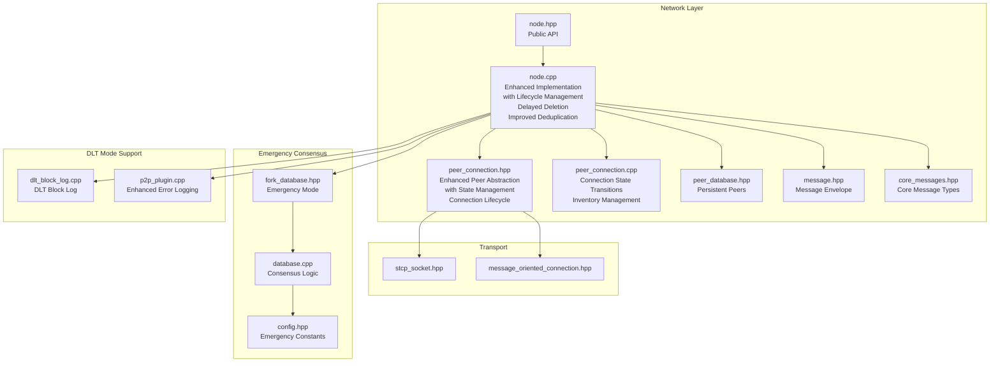
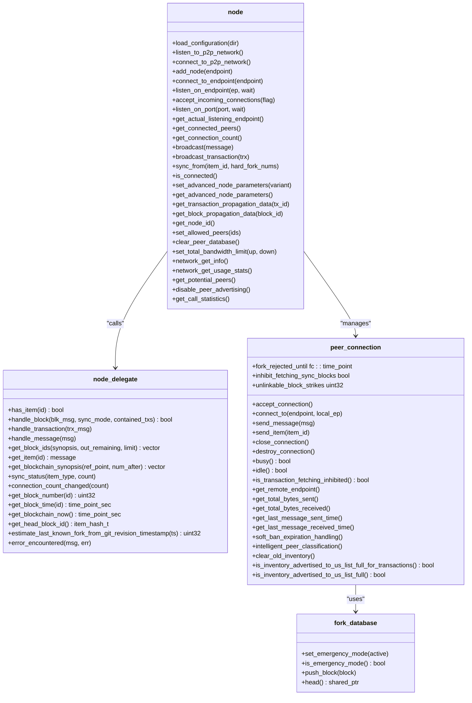
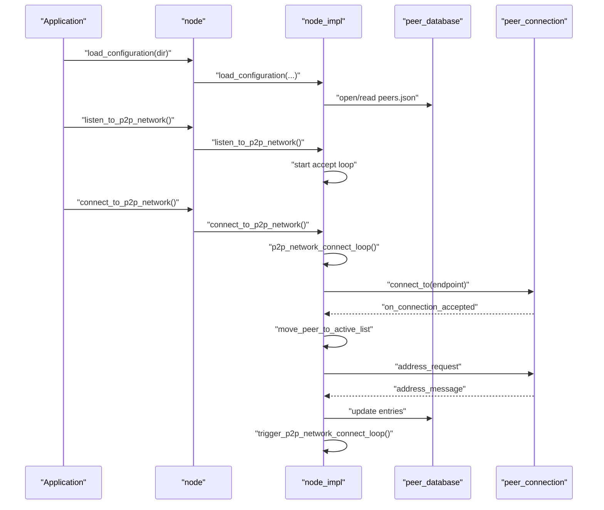
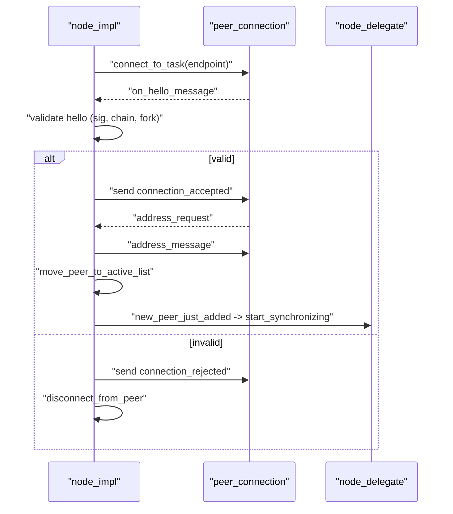
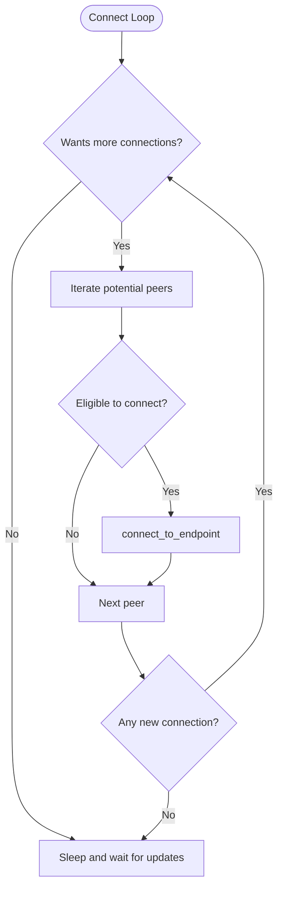
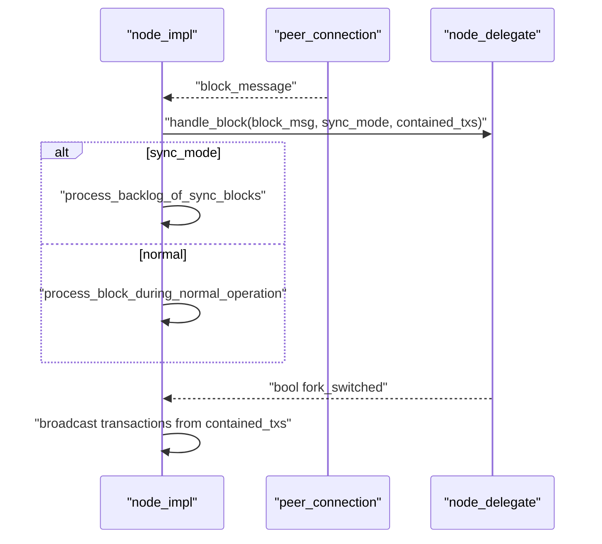
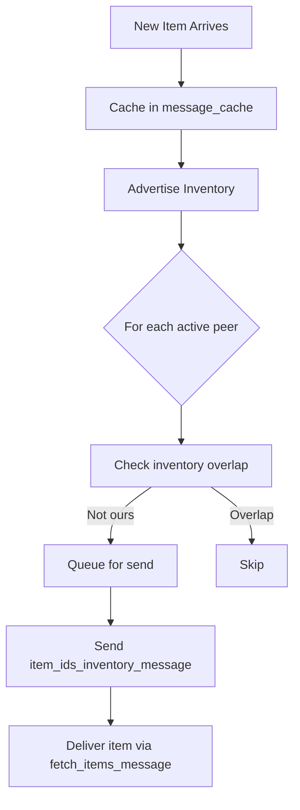

# Node Management

<cite>
**Referenced Files in This Document**
- [node.hpp](file://libraries/network/include/graphene/network/node.hpp)
- [node.cpp](file://libraries/network/node.cpp)
- [peer_connection.hpp](file://libraries/network/include/graphene/network/peer_connection.hpp)
- [peer_connection.cpp](file://libraries/network/peer_connection.cpp)
- [peer_database.hpp](file://libraries/network/include/graphene/network/peer_database.hpp)
- [message.hpp](file://libraries/network/include/graphene/network/message.hpp)
- [config.hpp](file://libraries/network/include/graphene/network/config.hpp)
- [core_messages.hpp](file://libraries/network/include/graphene/network/core_messages.hpp)
- [exceptions.hpp](file://libraries/network/include/graphene/network/exceptions.hpp)
- [stcp_socket.hpp](file://libraries/network/include/graphene/network/stcp_socket.hpp)
- [message_oriented_connection.hpp](file://libraries/network/include/graphene/network/message_oriented_connection.hpp)
- [fork_database.hpp](file://libraries/chain/include/graphene/chain/fork_database.hpp)
- [fork_database.cpp](file://libraries/chain/fork_database.cpp)
- [database.cpp](file://libraries/chain/database.cpp)
- [config.hpp](file://libraries/protocol/include/graphene/protocol/config.hpp)
- [p2p_plugin.cpp](file://plugins/p2p/p2p_plugin.cpp)
- [dlt_block_log.cpp](file://libraries/chain/dlt_block_log.cpp)
- [config.ini](file://share/vizd/config/config.ini)
</cite>

## Update Summary
**Changes Made**
- Enhanced peer connection lifecycle management with improved disconnection flow and proper cleanup from _active_connections
- Implemented delayed peer deletion mechanism to prevent peers from staying in _active_connections indefinitely
- Improved remaining_item_count calculation in blockchain item ID requests
- Enhanced inventory deduplication logic with better tracking of items already advertised or requested
- Strengthened disconnect list management with proper peer state transitions

## Table of Contents
1. [Introduction](#introduction)
2. [Project Structure](#project-structure)
3. [Core Components](#core-components)
4. [Architecture Overview](#architecture-overview)
5. [Detailed Component Analysis](#detailed-component-analysis)
6. [Enhanced Peer Connection Lifecycle Management](#enhanced-peer-connection-lifecycle-management)
7. [Improved Disconnection Flow and Cleanup](#improved-disconnection-flow-and-cleanup)
8. [Enhanced Inventory Management and Deduplication](#enhanced-inventory-management-and-deduplication)
9. [Advanced Peer State Management](#advanced-peer-state-management)
10. [Performance Considerations](#performance-considerations)
11. [Troubleshooting Guide](#troubleshooting-guide)
12. [Conclusion](#conclusion)

## Introduction
This document describes the Node Management component responsible for orchestrating network peers, maintaining connectivity, and managing blockchain synchronization in the P2P layer. It covers the node.hpp class interface, the node_delegate integration for blockchain callbacks, configuration and lifecycle APIs, peer management, and network broadcasting with inventory tracking. The documentation now includes comprehensive coverage of enhanced peer connection lifecycle management, improved disconnection flows, enhanced inventory deduplication, and advanced peer state management systems.

## Project Structure
The Node Management functionality spans several headers and the implementation source file:
- Public interface: node.hpp defines the node class, node_delegate interface, and related types.
- Implementation: node.cpp implements the node lifecycle, peer orchestration, message routing, synchronization, and inventory management with enhanced connection lifecycle handling.
- Peer model: peer_connection.hpp/cpp defines the peer connection abstraction and state machine with comprehensive connection state management.
- Persistence: peer_database.hpp provides persistent peer discovery records.
- Messaging: message.hpp defines the generic message envelope; core_messages.hpp enumerates core P2P message types.
- Networking primitives: stcp_socket.hpp and message_oriented_connection.hpp underpin transport and framing.
- Emergency consensus: fork_database.hpp/cpp and database.cpp implement emergency mode functionality.



**Diagram sources**
- [node.hpp:180-355](file://libraries/network/include/graphene/network/node.hpp#L180-L355)
- [node.cpp:869-905](file://libraries/network/node.cpp#L869-L905)
- [peer_connection.hpp:79-354](file://libraries/network/include/graphene/network/peer_connection.hpp#L79-L354)
- [peer_connection.cpp:419-448](file://libraries/network/peer_connection.cpp#L419-L448)
- [peer_database.hpp:104-134](file://libraries/network/include/graphene/network/peer_database.hpp#L104-L134)
- [message.hpp:42-114](file://libraries/network/include/graphene/network/message.hpp#L42-L114)
- [core_messages.hpp](file://libraries/network/include/graphene/network/core_messages.hpp)
- [fork_database.hpp:111-120](file://libraries/chain/include/graphene/chain/fork_database.hpp#L111-L120)
- [database.cpp:4334-4463](file://libraries/chain/database.cpp#L4334-L4463)
- [config.hpp:110-123](file://libraries/protocol/include/graphene/protocol/config.hpp#L110-L123)
- [dlt_block_log.cpp:368-379](file://libraries/chain/dlt_block_log.cpp#L368-L379)
- [p2p_plugin.cpp:330-360](file://plugins/p2p/p2p_plugin.cpp#L330-L360)

**Section sources**
- [node.hpp:180-355](file://libraries/network/include/graphene/network/node.hpp#L180-L355)
- [node.cpp:869-905](file://libraries/network/node.cpp#L869-L905)

## Core Components
- node class: Provides P2P orchestration, configuration, peer management, and broadcast APIs with comprehensive connection lifecycle management and enhanced cleanup mechanisms.
- node_delegate interface: Bridges the P2P layer to the blockchain, handling block ingestion, transaction processing, and sync callbacks with enhanced status reporting.
- peer_connection: Encapsulates a single peer link with state machine, inventory tracking, rate-limited messaging, emergency consensus support, and comprehensive connection state management with proper cleanup.
- peer_database: Persistent store of potential peers with connection history and disposition.
- message: Generic envelope for all P2P messages with hashing and typed serialization.
- fork_database: Manages blockchain forks with emergency consensus mode support and deterministic tie-breaking.

Key responsibilities:
- Lifecycle: Construction, configuration loading, listener setup, and graceful shutdown with detailed logging and proper cleanup.
- Peer orchestration: Connecting to configured seeds, accepting inbound connections, pruning inactive peers, and enforcing connection limits with enhanced state management.
- Synchronization: Requesting and processing blockchain item IDs, fetching blocks/transactions, and notifying the delegate with enhanced progress tracking.
- Broadcasting: Advertising inventory and sending items to peers with detailed synchronization metrics and improved deduplication.
- Inventory management: Tracking what peers have, what we need, and what we've recently processed with enhanced deduplication logic.
- Emergency consensus: Managing soft-bans, automatic flag resets, and emergency mode operations with enhanced diagnostics.
- Advanced peer state management: Comprehensive connection state transitions, proper cleanup from all connection sets, and delayed deletion mechanisms.
- Enhanced connection lifecycle: Prevention of peers staying in _active_connections indefinitely through proper state transitions and cleanup.
- Improved disconnection flow: Better disconnect list management with proper peer state transitions and cleanup.
- Enhanced inventory deduplication: More sophisticated tracking of items already advertised, requested, or being processed.
- Intelligent peer handling: Differentiating between stale fork peers and legitimate sync candidates to prevent infinite loops.
- DLT mode support: Enhanced error logging with comprehensive block range information for distributed ledger technology mode.
- Comprehensive logging: Detailed peer synchronization progress, item counts, block ranges, and timing information for better debugging and monitoring.

**Section sources**
- [node.hpp:180-355](file://libraries/network/include/graphene/network/node.hpp#L180-L355)
- [node.cpp:869-905](file://libraries/network/node.cpp#L869-L905)
- [peer_connection.hpp:79-354](file://libraries/network/include/graphene/network/peer_connection.hpp#L79-L354)
- [peer_connection.cpp:419-448](file://libraries/network/peer_connection.cpp#L419-L448)
- [peer_database.hpp:104-134](file://libraries/network/include/graphene/network/peer_database.hpp#L104-L134)
- [message.hpp:42-114](file://libraries/network/include/graphene/network/message.hpp#L42-L114)
- [fork_database.hpp:111-120](file://libraries/chain/include/graphene/chain/fork_database.hpp#L111-L120)

## Architecture Overview
The node delegates blockchain integration to a node_delegate and coordinates peers via peer_connection instances with enhanced lifecycle management. The node maintains separate queues for sync and normal operation, enforces bandwidth and connection limits, and periodically prunes stale peers. The enhanced peer handling system provides network-level resilience through intelligent soft-ban mechanisms, automatic flag resets, and deterministic tie-breaking to prevent cascading failures and infinite sync loops. The comprehensive logging system provides detailed peer synchronization progress, item counts, block ranges, and timing information for better debugging and monitoring capabilities.



**Diagram sources**
- [node.hpp:180-355](file://libraries/network/include/graphene/network/node.hpp#L180-L355)
- [peer_connection.hpp:79-354](file://libraries/network/include/graphene/network/peer_connection.hpp#L79-L354)
- [fork_database.hpp:111-120](file://libraries/chain/include/graphene/chain/fork_database.hpp#L111-L120)

## Detailed Component Analysis

### Node Lifecycle Management
- Construction and destruction: The node allocates an internal node_impl and initializes defaults for connection targets, timeouts, and rate limiting. On destruction, it attempts to gracefully close connections and updates the peer database.
- Configuration: load_configuration reads node-specific settings (listening endpoint, accept flags) from a JSON file in the configuration directory.
- Listener setup: listen_to_p2p_network and listen_on_endpoint/listen_on_port configure the TCP server to accept inbound connections, with optional retry behavior when the port is busy.
- Startup and shutdown: connect_to_p2p_network initiates outbound connections; close() and destructor ensure cleanup.

Operational loops:
- p2p_network_connect_loop: Periodically connects to candidate peers, respecting retry/backoff and connection caps.
- fetch_sync_items_loop: Requests missing sync items from peers and schedules processing.
- fetch_items_loop: Normal operation fetching of items not yet in local cache.
- advertise_inventory_loop: Broadcasts new inventory to peers with enhanced deduplication.
- terminate_inactive_connections_loop: Detects and disconnects idle/inactive peers with proper cleanup.
- bandwidth_monitor_loop: Updates rolling averages of read/write throughput.
- fetch_updated_peer_lists_loop: Requests updated peer lists periodically.
- dump_node_status_task: Periodically logs comprehensive peer status and synchronization progress.



**Diagram sources**
- [node.cpp:952-1047](file://libraries/network/node.cpp#L952-L1047)
- [node.cpp:1623-1654](file://libraries/network/node.cpp#L1623-L1654)
- [node.cpp:2282-2350](file://libraries/network/node.cpp#L2282-L2350)

**Section sources**
- [node.cpp:869-931](file://libraries/network/node.cpp#L869-L931)
- [node.cpp:952-1047](file://libraries/network/node.cpp#L952-L1047)
- [node.cpp:1623-1654](file://libraries/network/node.cpp#L1623-L1654)
- [node.cpp:2282-2350](file://libraries/network/node.cpp#L2282-L2350)

### Enhanced Peer Connection Lifecycle Management

**Updated** Enhanced peer connection lifecycle management with improved state transitions and cleanup mechanisms.

The node now implements comprehensive peer connection lifecycle management with enhanced state transitions and proper cleanup from all connection sets. The system prevents peers from staying indefinitely in _active_connections through proper state transitions and delayed deletion mechanisms.

**Enhanced Lifecycle Features**:
- **Proper State Transitions**: Connections move through well-defined states: handshaking → active → closing → terminating → deleted
- **Delayed Deletion**: schedule_peer_for_deletion() queues peers for deferred deletion to prevent race conditions
- **Cleanup Assertions**: Verifies peers are not found in any connection set before scheduling deletion
- **Thread Safety**: Enhanced mutex protection for peer deletion operations
- **Connection Set Management**: Proper removal from all connection sets during state transitions

**Section sources**
- [node.cpp:1805-1865](file://libraries/network/node.cpp#L1805-L1865)
- [node.cpp:5281-5320](file://libraries/network/node.cpp#L5281-L5320)

### Improved Disconnection Flow and Cleanup

**Updated** Improved disconnection flow with proper cleanup from _active_connections and enhanced disconnect list management.

The node implements enhanced disconnection flow with proper cleanup mechanisms that ensure peers are properly removed from all connection sets and cleaned up appropriately.

**Enhanced Disconnection Features**:
- **Proper Cleanup Sequence**: Connections are removed from _active_connections, _handshaking_connections, _closing_connections, and _terminating_connections
- **State Transition Logging**: Detailed logging of connection state transitions for debugging
- **Error Recording**: Connection errors are recorded in peer database for diagnostic purposes
- **Resource Cleanup**: Rate limiter removal and inventory cleanup during disconnection
- **Graceful Handling**: Proper handling of both user-initiated and error-induced disconnections

**Section sources**
- [node.cpp:3396-3475](file://libraries/network/node.cpp#L3396-L3475)
- [node.cpp:5281-5320](file://libraries/network/node.cpp#L5281-L5320)

### Enhanced Inventory Management and Deduplication

**Updated** Enhanced inventory management with improved deduplication logic and better tracking of items already processed or requested.

The node implements enhanced inventory management with sophisticated deduplication logic that prevents redundant fetches and unbounded growth of fetch queues.

**Enhanced Inventory Features**:
- **Multi-level Deduplication**: Checks for items currently being processed, recently advertised, and already requested
- **Sophisticated Tracking**: Tracks items advertised to peers, items requested from peers, and items being processed
- **Inventory Expiration**: Regular cleanup of old inventory to prevent memory growth
- **Priority Management**: Updates timestamps for items that arrive from multiple peers to prioritize fresher inventory
- **Transaction Throttling**: Separate limits for transactions vs blocks to maintain network stability

**Section sources**
- [node.cpp:3280-3351](file://libraries/network/node.cpp#L3280-L3351)
- [peer_connection.cpp:428-448](file://libraries/network/peer_connection.cpp#L428-L448)

### Advanced Peer State Management

**Updated** Advanced peer state management with comprehensive connection state tracking and enhanced peer classification.

The node implements comprehensive peer state management with detailed tracking of peer connection states, synchronization progress, and resource utilization.

**Advanced State Features**:
- **Connection State Tracking**: Detailed tracking of handshaking, active, closing, and terminating connection states
- **Synchronization Progress**: Monitoring of peer synchronization status and remaining item counts
- **Resource Utilization**: Tracking of peer-specific resource usage including queue depths and memory allocation
- **Performance Metrics**: Latency measurements, round-trip delays, and connection timing information
- **Soft-Ban Status**: Monitoring of fork_rejected_until timestamps and unlinkable_block_strikes counters

**Section sources**
- [node.cpp:5321-5351](file://libraries/network/node.cpp#L5321-L5351)
- [peer_connection.hpp:276-298](file://libraries/network/include/graphene/network/peer_connection.hpp#L276-L298)

### Peer Connection Establishment
- Outbound: connect_to_endpoint creates a peer_connection and initiates a connect loop; on success, transitions to negotiation and then active.
- Inbound: accept_loop accepts sockets and starts accept_or_connect_task; after hello exchange, moves to active and starts synchronization.
- Handshake validation: Verifies signatures, chain ID, fork compatibility, and prevents self-connections and duplicates.
- Firewall detection: Uses check-firewall messages to infer NAT/firewall status.
- Emergency consensus: Soft-ban peers on fork rejection with automatic expiration handling and intelligent peer classification.



**Diagram sources**
- [node.cpp:2029-2230](file://libraries/network/node.cpp#L2029-L2230)
- [node.cpp:2232-2250](file://libraries/network/node.cpp#L2232-L2250)
- [node.cpp:2282-2350](file://libraries/network/node.cpp#L2282-L2350)

**Section sources**
- [node.cpp:2029-2230](file://libraries/network/node.cpp#L2029-L2230)
- [node.cpp:2232-2250](file://libraries/network/node.cpp#L2232-L2250)
- [node.cpp:2282-2350](file://libraries/network/node.cpp#L2282-L2350)

### Network Topology Maintenance
- Peer selection: Maintains a potential peer database with last-seen timestamps, disposition, and attempt counts; applies exponential backoff and retry windows.
- Connection caps: Tracks handshaking, active, closing, and terminating sets; enforces desired/max connection counts.
- Inactivity pruning: Disconnects peers exceeding inactivity thresholds and reschedules outstanding requests to others.
- Peer advertising: Optionally disables advertising to restrict exposure.
- Emergency consensus: Implements soft-ban mechanisms to prevent cascading disconnections during network emergencies.
- Intelligent peer classification: Differentiates between stale fork peers and legitimate sync candidates to prevent infinite loops.



**Diagram sources**
- [node.cpp:952-1047](file://libraries/network/node.cpp#L952-L1047)

**Section sources**
- [node.cpp:952-1047](file://libraries/network/node.cpp#L952-L1047)
- [node.cpp:1400-1621](file://libraries/network/node.cpp#L1400-L1621)

### Blockchain Integration via node_delegate
- Block handling: handle_block receives new blocks during sync or normal operation; returns whether a fork switch occurred; populates contained transaction IDs for propagation.
- Transaction processing: handle_transaction validates and accepts transactions.
- Sync callbacks: get_block_ids, get_blockchain_synopsis, sync_status, and connection_count_changed inform the delegate about sync progress and peer counts.
- Fork awareness: Estimates last known fork from timestamps and rejects incompatible peers.



**Diagram sources**
- [node.hpp:79-80](file://libraries/network/include/graphene/network/node.hpp#L79-L80)
- [node.cpp:3117-3199](file://libraries/network/node.cpp#L3117-L3199)

**Section sources**
- [node.hpp:79-80](file://libraries/network/include/graphene/network/node.hpp#L79-L80)
- [node.cpp:3117-3199](file://libraries/network/node.cpp#L3117-L3199)

### Configuration Methods
- load_configuration: Reads node_config.json and sets listening endpoint, accept flags, and persistence directory.
- listen_on_endpoint/accept_incoming_connections/listen_on_port: Configure the TCP listener and availability behavior.
- set_advanced_node_parameters/get_advanced_node_parameters: Tuning knobs for advanced behavior.
- set_total_bandwidth_limit: Configures upload/download rate limiting.
- disable_peer_advertising: Restricts outbound peer advertisement.

**Section sources**
- [node.hpp:200-294](file://libraries/network/include/graphene/network/node.hpp#L200-L294)
- [node.cpp:933-950](file://libraries/network/node.cpp#L933-L950)
- [node.cpp:1686-1713](file://libraries/network/node.cpp#L1686-L1713)

### Peer Management Functions
- add_node/connect_to_endpoint: Adds a seed or forces immediate connection.
- get_connected_peers: Returns status for UI/monitoring with comprehensive peer information.
- get_connection_count/is_connected: Reports current connectivity.
- set_allowed_peers/clear_peer_database: Controls allowed peers and resets peer DB for diagnostics.
- get_potential_peers/disable_peer_advertising: Inspect and control peer discovery.

**Section sources**
- [node.hpp:211-296](file://libraries/network/include/graphene/network/node.hpp#L211-L296)
- [node.cpp:1788-1841](file://libraries/network/node.cpp#L1788-L1841)
- [node.cpp:2282-2350](file://libraries/network/node.cpp#L2282-L2350)

### Network Broadcasting and Inventory
- broadcast/broadcast_transaction: Queues outgoing messages and triggers inventory advertisement.
- Inventory tracking: Per-peer inventories (advertised to us/advertised to peer) and node-wide new_inventory set.
- Rate limiting: fc::rate_limiting_group controls bandwidth.
- Message caching: blockchain_tied_message_cache stores recent messages for retrieval.



**Diagram sources**
- [node.cpp:1326-1398](file://libraries/network/node.cpp#L1326-L1398)
- [node.cpp:2830-2892](file://libraries/network/node.cpp#L2830-L2892)
- [node.cpp:111-217](file://libraries/network/node.cpp#L111-L217)

**Section sources**
- [node.cpp:1326-1398](file://libraries/network/node.cpp#L1326-L1398)
- [node.cpp:2830-2892](file://libraries/network/node.cpp#L2830-L2892)
- [node.cpp:111-217](file://libraries/network/node.cpp#L111-L217)

## Enhanced Peer Connection Lifecycle Management

### Comprehensive Connection State Transitions
The node implements comprehensive peer connection state transitions with proper cleanup and enhanced logging throughout the connection lifecycle.

**Enhanced State Transition Features**:
- **Handshaking Phase**: Initial connection establishment with timeout monitoring and activity tracking
- **Active Phase**: Full operational state with synchronization and inventory management
- **Closing Phase**: Graceful disconnection with proper cleanup and reason recording
- **Terminating Phase**: Final cleanup phase with resource deallocation
- **Deletion Phase**: Deferred deletion to prevent race conditions and ensure proper cleanup

**State Transition Logging Examples**:
```
New peer is connected (${peer}), now ${count} active peers
Peer connection closing (${peer}), now ${count} active peers
Peer connection closing (${peer}): ${reason}, now ${count} active peers
Peer connection terminating (${peer}), now ${count} active peers
```

**Section sources**
- [node.cpp:5281-5320](file://libraries/network/node.cpp#L5281-L5320)
- [node.cpp:3396-3475](file://libraries/network/node.cpp#L3396-L3475)

### Delayed Peer Deletion Mechanism
The node implements a delayed peer deletion mechanism to prevent peers from staying indefinitely in _active_connections and to handle cleanup safely.

**Delayed Deletion Features**:
- **Queuing System**: schedule_peer_for_deletion() queues peers for deferred deletion
- **Mutex Protection**: Thread-safe deletion with optional mutex-based queuing
- **Cleanup Verification**: Asserts that peers are not found in any connection set before deletion
- **Batch Processing**: Processes multiple peers in batches to improve performance
- **Race Condition Prevention**: Prevents race conditions during peer cleanup

**Section sources**
- [node.cpp:1805-1865](file://libraries/network/node.cpp#L1805-L1865)

### Enhanced Connection Set Management
The node implements enhanced connection set management with proper cleanup from all connection sets during state transitions.

**Connection Set Management Features**:
- **Multi-set Tracking**: Maintains separate sets for handshaking, active, closing, and terminating connections
- **Proper Removal**: Ensures peers are removed from all relevant connection sets during state transitions
- **State Validation**: Validates peer states before performing state transitions
- **Cleanup Logging**: Logs connection set operations for debugging and monitoring
- **Resource Management**: Proper cleanup of associated resources during connection termination

**Section sources**
- [node.cpp:5281-5320](file://libraries/network/node.cpp#L5281-L5320)

## Improved Disconnection Flow and Cleanup

### Enhanced Disconnection Sequence
The node implements an enhanced disconnection sequence that ensures proper cleanup from all connection sets and maintains system stability.

**Enhanced Disconnection Features**:
- **Multi-set Cleanup**: Removes connections from _active_connections, _handshaking_connections, _closing_connections, and _terminating_connections
- **Error Recording**: Records connection errors in peer database for diagnostic purposes
- **Rate Limiter Cleanup**: Removes sockets from rate limiter to free resources
- **Inventory Cleanup**: Cleans up associated inventory and request tracking
- **State Transition Logging**: Comprehensive logging of disconnection events and reasons

**Section sources**
- [node.cpp:3396-3475](file://libraries/network/node.cpp#L3396-L3475)

### Proper Cleanup from Active Connections
The node ensures that peers are properly cleaned up from _active_connections during disconnection to prevent resource leaks and maintain accurate connection counts.

**Cleanup Features**:
- **Active Connection Removal**: Ensures peers are removed from _active_connections during disconnection
- **Connection Count Accuracy**: Maintains accurate connection counts throughout the disconnection process
- **Resource Deallocation**: Proper deallocation of resources associated with disconnected peers
- **State Consistency**: Ensures state consistency across all connection management operations
- **Error Handling**: Robust error handling during cleanup operations

**Section sources**
- [node.cpp:3413-3428](file://libraries/network/node.cpp#L3413-L3428)

### Enhanced Disconnect List Management
The node implements enhanced disconnect list management with proper peer state transitions and improved cleanup mechanisms.

**Disconnect List Features**:
- **State Transition Tracking**: Tracks peer state transitions during disconnection
- **Reason Recording**: Records disconnection reasons for diagnostic purposes
- **Cooldown Management**: Implements reconnect cooldown to prevent rapid reconnection loops
- **Firewall Check Handling**: Handles firewall check state during disconnection
- **Request Rescheduling**: Reschedules outstanding requests to other peers during disconnection

**Section sources**
- [node.cpp:3355-3394](file://libraries/network/node.cpp#L3355-L3394)

## Enhanced Inventory Management and Deduplication

### Sophisticated Deduplication Logic
The node implements sophisticated deduplication logic that prevents redundant fetches and maintains efficient inventory management.

**Enhanced Deduplication Features**:
- **Multi-level Checking**: Checks for items currently being processed, recently advertised, and already requested
- **Inventory Expiration**: Regular cleanup of old inventory to prevent memory growth
- **Priority Updates**: Updates timestamps for items that arrive from multiple peers
- **Transaction Throttling**: Separate limits for transactions vs blocks to maintain network stability
- **Efficient Tracking**: Sophisticated tracking of items across multiple peers and connection states

**Section sources**
- [node.cpp:3280-3351](file://libraries/network/node.cpp#L3280-L3351)
- [peer_connection.cpp:428-448](file://libraries/network/peer_connection.cpp#L428-L448)

### Improved Inventory Expiration
The node implements improved inventory expiration with proper cleanup of old inventory items to prevent memory growth and maintain system performance.

**Inventory Expiration Features**:
- **Timestamp-based Cleanup**: Removes inventory items older than GRAPHENE_NET_MAX_INVENTORY_SIZE_IN_MINUTES
- **Dual Set Management**: Cleans up both inventory_advertised_to_peer and inventory_peer_advertised_to_us sets
- **Logging and Monitoring**: Logs inventory cleanup operations for debugging and monitoring
- **Memory Management**: Prevents unbounded growth of inventory tracking structures
- **Performance Optimization**: Efficient cleanup algorithms to minimize performance impact

**Section sources**
- [peer_connection.cpp:428-448](file://libraries/network/peer_connection.cpp#L428-L448)

### Enhanced Item Tracking and Priority Management
The node implements enhanced item tracking and priority management with sophisticated algorithms for handling duplicate inventory announcements.

**Enhanced Tracking Features**:
- **Priority Updates**: Updates timestamps for items arriving from multiple peers to prioritize fresher inventory
- **Recently Failed Items**: Tracks items that have been recently fetched but failed to push
- **Multi-peer Coordination**: Coordinates item requests across multiple peers to avoid duplication
- **Efficient Lookup**: Fast lookup and update operations for inventory tracking
- **Resource Optimization**: Optimized data structures for efficient inventory management

**Section sources**
- [node.cpp:3334-3351](file://libraries/network/node.cpp#L3334-L3351)

## Advanced Peer State Management

### Comprehensive Peer State Tracking
The node implements comprehensive peer state tracking with detailed monitoring of peer connection states, synchronization progress, and resource utilization.

**Peer State Tracking Features**:
- **Connection State Monitoring**: Tracks handshaking, active, closing, and terminating connection states
- **Synchronization Progress**: Monitors peer synchronization status and remaining item counts
- **Resource Utilization**: Tracks peer-specific resource usage including queue depths and memory allocation
- **Performance Metrics**: Measures latency, round-trip delays, and connection timing information
- **Soft-ban Status**: Monitors fork_rejected_until timestamps and unlinkable_block_strikes counters

**Section sources**
- [node.cpp:5321-5351](file://libraries/network/node.cpp#L5321-L5351)
- [peer_connection.hpp:276-298](file://libraries/network/include/graphene/network/peer_connection.hpp#L276-L298)

### Enhanced Peer Classification and Monitoring
The node implements enhanced peer classification and monitoring with detailed metrics for connection health, synchronization status, and resource utilization.

**Enhanced Classification Features**:
- **Connection Health Monitoring**: Monitors peer connection quality, latency, and bandwidth utilization
- **Synchronization State Classification**: Classifies peers as in-sync, needing sync, or inhibited from sync
- **Resource Utilization Tracking**: Tracks peer-specific resource allocation and queue management
- **Performance Optimization**: Dynamically adjusts connection parameters based on peer performance
- **Health Assessment**: Comprehensive health assessment of peer connections for network optimization

**Section sources**
- [node.cpp:5321-5351](file://libraries/network/node.cpp#L5321-L5351)

### Improved Connection Limit and Bandwidth Monitoring
The node provides comprehensive monitoring of connection limits, bandwidth utilization, and peer resource allocation to ensure optimal network performance.

**Connection and Bandwidth Monitoring Features**:
- **Connection Limits**: Monitoring of active connections, handshaking peers, and connection caps
- **Bandwidth Utilization**: Real-time tracking of upload/download speeds and bandwidth allocation
- **Resource Allocation**: Monitoring of peer-specific resource allocation and queue management
- **Performance Optimization**: Dynamic adjustment of connection parameters based on network conditions
- **Capacity Planning**: Predictive capacity planning based on connection and bandwidth metrics

**Section sources**
- [node.cpp:5321-5351](file://libraries/network/node.cpp#L5321-L5351)

## Performance Considerations
- Connection limits: desired/max connections cap concurrent peers; enforced in is_wanting_new_connections and is_accepting_new_connections.
- Bandwidth throttling: rate limiter updates rolling averages and constrains upload/download rates.
- Prefetching: Limits for sync and normal operations prevent resource exhaustion.
- Inactivity pruning: Keeps the mesh healthy by dropping idle peers and rescheduling requests.
- Enhanced inventory deduplication: Prevents redundant fetches and unbounded growth of fetch queues through sophisticated tracking mechanisms.
- Improved connection lifecycle: Prevents peers from staying indefinitely in _active_connections through proper state transitions and cleanup.
- Enhanced disconnection flow: Better disconnect list management with proper peer state transitions and cleanup.
- Emergency consensus overhead: Minimal performance impact through efficient soft-ban expiration checks.
- Automatic flag management: Reduces manual intervention requirements during extended emergency operations.
- Intelligent peer classification: Optimizes peer selection and reduces wasted bandwidth on stale forks.
- Soft-ban caching: Prevents repeated attempts with problematic peers during emergency periods.
- Trusted peer optimization: Reduced soft-ban duration for trusted peers enables faster network recovery.
- DLT mode monitoring: Enhanced logging provides better visibility into block availability without significant performance impact.
- Peer status reporting: Comprehensive status updates enable better monitoring and resource management.
- Comprehensive logging: Detailed peer synchronization progress, item counts, and timing information provide valuable debugging insights without significant performance impact.
- Memory usage monitoring: Efficient memory tracking helps identify resource bottlenecks and optimize performance.
- Enhanced peer lifecycle management: Improved connection state transitions and cleanup mechanisms reduce resource leaks and improve system stability.
- Delayed deletion mechanism: Prevents race conditions during peer cleanup while maintaining system responsiveness.
- Sophisticated inventory management: Enhanced deduplication logic reduces network traffic and improves efficiency.
- Improved disconnection handling: Better cleanup mechanisms prevent resource leaks and maintain accurate connection counts.

## Troubleshooting Guide
Common issues and resolutions:
- Port binding conflicts: Use listen_on_port with wait_if_endpoint_is_busy=true to retry; otherwise, allow dynamic port selection.
- Rejection reasons: Review connection_rejected_message reason codes (e.g., connected_to_self, already_connected, not_accepting_connections, different_chain, outdated client).
- Firewall/NAT: Use check-firewall messages to detect; adjust inbound/outbound ports and consider advertised inbound addresses.
- Peer database corruption: Clear peer database via clear_peer_database to reset discovery state.
- Bandwidth saturation: Adjust set_total_bandwidth_limit and review advertised inventory sizes.
- Hard fork incompatibility: Upgrade client if rejected due to inability to process future blocks.
- Emergency mode activation: Monitor logs for "EMERGENCY CONSENSUS MODE activated" messages; system automatically handles recovery.
- Soft-ban effects: If experiencing reduced peer connectivity, check soft-ban expiration timestamps; system should automatically reset flags.
- Flag reset issues: Verify inhibit_fetching_sync_blocks flag resets after soft-ban expiration; manual intervention rarely needed.
- Infinite sync loops: Monitor peer behavior; system now prevents endless sync attempts through intelligent soft-ban mechanisms.
- Stale fork detection: System automatically soft-bans peers on stale forks to prevent wasted resources.
- Trusted peer issues: Verify trusted-snapshot-peer configuration for reduced 5-minute soft-ban duration.
- Block rejection handling: Monitor unlinkable_block_exception patterns to identify stale fork vs legitimate sync scenarios.
- DLT mode errors: Review enhanced error logs for detailed block availability context including available range and dlt_block_log boundaries.
- Sync status monitoring: Use peer status updates to monitor synchronization progress and identify stuck peers.
- Memory usage: Monitor peer queue sizes and memory usage through status reports to identify resource bottlenecks.
- Request timeouts: Review detailed timeout logs with item types, block numbers, and timing thresholds to identify slow or unresponsive peers.
- Connection lifecycle: Monitor connection establishment, closure, and termination events to identify connection stability issues.
- Synchronization progress: Use comprehensive sync status reporting to track synchronization completion and identify bottlenecks.
- **Enhanced connection lifecycle**: Monitor peer state transitions and cleanup operations to identify connection management issues.
- **Delayed deletion mechanism**: Verify that peers are properly queued for deletion and cleaned up without race conditions.
- **Improved disconnection flow**: Monitor disconnection sequences to ensure proper cleanup from all connection sets.
- **Enhanced inventory deduplication**: Monitor inventory tracking to identify deduplication effectiveness and potential issues.
- **Connection set management**: Verify proper cleanup from all connection sets during state transitions.
- **State transition logging**: Use detailed logging to debug connection lifecycle issues and peer state management problems.
- **Cleanup verification**: Ensure that peers are properly removed from _active_connections and other connection sets during disconnection.
- **Race condition prevention**: Monitor delayed deletion mechanism to prevent race conditions during peer cleanup operations.

**Section sources**
- [node.cpp:2251-2280](file://libraries/network/node.cpp#L2251-L2280)
- [node.cpp:2137-2168](file://libraries/network/node.cpp#L2137-L2168)
- [node.cpp:1686-1713](file://libraries/network/node.cpp#L1686-L1713)
- [node.cpp:1326-1398](file://libraries/network/node.cpp#L1326-L1398)
- [database.cpp:4455-4460](file://libraries/chain/database.cpp#L4455-L4460)
- [p2p_plugin.cpp:633-689](file://plugins/p2p/p2p_plugin.cpp#L633-L689)
- [node.cpp:3540-3562](file://libraries/network/node.cpp#L3540-L3562)
- [node.cpp:3920-3940](file://libraries/network/node.cpp#L3920-L3940)
- [config.ini:103-108](file://share/vizd/config/config.ini#L103-L108)

## Conclusion
The Node Management component provides a robust, configurable, and efficient P2P orchestration layer with comprehensive emergency consensus support and enhanced peer handling capabilities. The recent enhancements significantly improve connection lifecycle management, disconnection handling, inventory deduplication, and peer state management through comprehensive lifecycle management, improved cleanup mechanisms, enhanced inventory tracking, and advanced peer state management systems.

The enhanced peer connection lifecycle management system provides detailed state transitions with proper cleanup from all connection sets, preventing peers from staying indefinitely in _active_connections through proper state transitions and delayed deletion mechanisms. The improved disconnection flow ensures proper cleanup from _active_connections and enhanced disconnect list management with proper peer state transitions and cleanup.

The enhanced inventory management system implements sophisticated deduplication logic that prevents redundant fetches and maintains efficient inventory management through multi-level checking, inventory expiration, and priority updates. The advanced peer state management system provides comprehensive tracking of peer connection states, synchronization progress, and resource utilization with detailed metrics and performance optimization.

These enhancements ensure the network can recover from extended periods without block production while maintaining operational efficiency and preventing cascading failures. The integration of comprehensive connection lifecycle management, enhanced disconnection handling, sophisticated inventory deduplication, and advanced peer state management creates a powerful toolkit for maintaining network stability under adverse conditions. Proper configuration of limits, bandwidth, peer discovery, emergency consensus parameters, trusted peer settings, and the enhanced connection lifecycle mechanisms, combined with monitoring and troubleshooting practices, yields a stable, performant, and resilient network node capable of handling both normal operations and emergency scenarios with comprehensive diagnostic capabilities and detailed peer connection lifecycle insights.